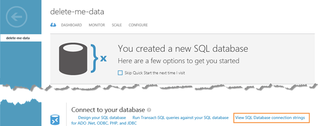
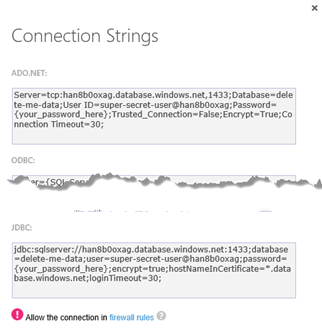

# 六、访问数据

到目前为止，为示例生成任何代码所做的大部分工作都仅限于静态 HTML，因为我们关注的是配置源代码控制和发布内容，而不是编写代码。然而，在动态的现实应用中，静态 HTML 的价值是有限的，除非您还有某种服务器端代码与它背后的数据进行交互。在本章中，我们将了解 Azure 网站中用于访问和操作数据的一些选项。其中一些选项可以通过 Azure 网站服务立即获得，而其他选项可能需要额外的 Azure 服务。

## Windows Azure 表存储

多年来，使用 SQL 管理和检索数据的关系数据库管理系统一直被认为是应用处理数据的首选方法。这是基于它们带来的优势，例如通过规范化结构来最小化存储和提高数据的一致性，以及通过结构化查询语言(SQL)提供对定义良好的数据结构的简单导航。然而，当涉及到大规模扩展时，SQL 数据库确实会遇到许多挑战。这导致了一类数据库替代品(统称为 NoSQL 数据库)的流行度激增。

Azure 表存储是 Azure 中的默认 NoSQL 数据库服务，从最早的 Azure 版本就开始提供。它具有与许多 NoSQL 数据库相关的可扩展性和低存储成本，并且易于在 Azure 中设置和配置。

对于熟悉传统 SQL 数据库的开发人员来说，Azure 表存储需要一段时间才能习惯的一些特性是:

*   虽然您会看到对表中列的引用，但固定模式的概念并不存在。Azure 允许您将记录存储在单个表中，其中一个记录包含适用于一瓶药品的数据属性，另一个记录包含适用于三轮车的数据属性。然而，这并不意味着通常建议在同一个表中存储截然不同的实体。
*   不存在拥有多个索引的概念。Azure 表存储基于单个分区键对数据进行分段，然后通过单个行键识别分区内的行。除了这两个键之外，基于数据属性值检索数据子集将是以编程方式过滤更大数据集的一种练习。这有时会被为您做这项工作的 API 屏蔽掉。

Azure 表存储不是随 Azure 网站服务一起提供的，因此，在使用 Azure 表存储之前，您必须先创建一个存储帐户。这在前面的“资源调配”一章中有简要描述。调配存储帐户后，您将开始在应用中使用 Azure 表存储。

|  | 注意:请记住，在设置任何新服务时，Azure 服务都是根据利用率计费的。 |

准备从 web 应用使用 Storage 的第一步是配置对 Azure 存储库“WindowsAzure”的引用。存储”。在 Visual Studio 中，最简单的方法是右键单击 web 项目，然后选择“管理 Nuget 包……”。将显示包管理器对话框，您可以在在线存储库中搜索“ **WindowsAzure。储物**。在搜索结果中找到**微软 Windows Azure 存储客户端库**并安装软件包。这将安装与存储帐户交互所需的所有库。

适当配置项目引用后，设置应用使用 Azure 表存储的下一步是在连接字符串中为存储帐户创建一个条目。在本例中，我们将添加一个应用设置来反映我们将使用的 Azure Storage 帐户。在`web.config`的`appSettings`中添加以下内容(确保使用自己的账户):

```cs
    <add key="CloudStorageConnectionString" value="DefaultEndPointsProtocol=https;AccountName=[youraccount];AccountKey=[yourkey]" />

```

现在连接字符串可用了，您可以在代码中引用存储。您需要首先确保代码模块顶部的 using 语句中表示了以下内容:

*   `Microsoft.WindowsAzure.Storage`
*   `Microsoft.WindowsAzure.Storage.Table`
*   `System.Configuration`

允许您访问所有存储功能的顶级对象是`CloudStorageAccount`对象。在 Azure 网站项目中，通过调用类的静态`Parse`方法，传递存储在`web.config`中的连接字符串，可以获得这种类型的对象的实例，如下所示:

```cs
    var account = CloudStorageAccount
    .Parse(ConfigurationManager.AppSettings[“CloudStorageConnectionString”]);

```

现在您可以访问您的帐户，您可以使用帐户对象生成一个适当配置的`CloudTableClient`，它将用于与 Azure 表存储服务进行交互。要访问`CloudTableClient`实例，调用`CloudStorageAccount`实例的`CreateCloudTableClient`方法，如下所示:

```cs
    var tableClient = account.CreateCloudTableClient();

```

使用`CloudTableClient`对象，您可以在存储帐户内访问和创建表格。在下面的代码中，通过使用`CreateIfNotExists`方法，在使用表之前，建立对名为“三轮车”的表的引用，并保证该表的存在:

```cs
    var table = tableClient.GetTableReference(“tricycle”);
    table.CreateIfNotExists();

```

以便处理表中的数据。NET 代码，最简单的事情就是创建。NET 类来表示表中的记录。这些类应该继承`Microsoft.WindowsAzure.Storage.Table`命名空间中的`TableEntity`类，除了包含描述实体所必需的字段之外，还应该在构造函数中建立分区和行键。继续我们的三轮车示例，我们将使用以下内容来描述存储在“三轮车”表中的实体:

```cs
    namespace TableStorageSample
    {
    public class Tricycle : TableEntity
    {
    public Tricycle(string manufacturer, string serialNumber)
    {
    PartitionKey = manufacturer;
    RowKey = serialNumber;
    }
    public string Manufacturer
    {
    get { return PartitionKey; }
    set { PartitionKey = value; }
    }

    public string SerialNumber
    {
    get { return RowKey; }
    set { RowKey = value; }
    }

    public string Color { get; set; }
    public DateTime ManufacturedDate { get; set; }
    }
    }

```

该类将用于对表执行所有的创建、读取、更新和删除(CRUD)操作。这些是使用`TableOperation`类实现的，该类公开静态方法来执行以下操作:

*   `Delete`:删除实体。
*   `Insert`:在表格中插入一个新的实体。
*   `InsertOrMerge`:如果表中还没有给定键的实体，则插入。如果存在，存储项的数据属性将与传递给方法的实体的数据属性合并。在实体已经存在的情况下，实体的属性将被更新以反映传入的新值，但是存在于存储的记录中并且没有在新实体中提供的任何属性将保持像以前一样被存储。
*   `InsertOrReplace`:如果表中还没有给定键的实体，则插入。如果它确实存在，存储的版本将被传递给方法的实体中的数据替换。与合并命令不同，当实体已经存储，并且存储的实体和新实体之间的属性列表不同时，新实体中不存在的属性将不会被保留。
*   `Merge`:这个操作将存储在表中的实体中的数据和传递给方法的实体中包含的数据合并。该对象必须已经存在于数据库中，否则该操作将导致在执行时引发`StorageException`。
*   `Replace`:这个操作用传递给方法的实体替换存储在给定键的表中的实体。该对象必须已经存在于数据库中，否则该操作将导致在执行时引发`StorageException`。
*   `Retrieve`:此操作用于检索给定分区和行键的实体。如果指定的键与表中存储的实体不相关，则提取操作将包含空结果，因此，当直接按键检索时，建议在尝试处理记录之前始终检查以确保操作结果包含非空值。

`TableOperation`实际上并不改变任何数据本身，而是作为一种“命令对象”传递给`CloudTable`对象。以下代码基于前面的示例，使用构造的表引用来检索一个`Tricycle`实体的实例，其中分区键(`Manufacturer`)是“施文”，行键(`SerialNumber`)是“ABC123”:

```cs
    Tricycle tricycle = null;
    var fetchOperation = TableOperation.Retrieve<Tricycle>("Schwinn", "ABC123");
    var result = table.Execute(fetchOperation);
    if (result.Result != null) tricycle = (Tricycle)result.Result;

```

如果您想要更新实体的存储数据，您将检索对象(或者如果您不关心当前存储的内容，可能只创建一个具有适当键值的对象的新实例)，更新字段值，然后创建一个更新操作，如实体的`Replace`以与`CloudTable`实例一起执行。以我们刚刚检索到的`Tricycle`实体为例，下面的代码将用于更新颜色并将更新后的值保存到数据库中:

```cs
    tricycle.Color = “Blue”;
    var updateOperation = TableOperation.Replace(tricycle);
    table.Execute(updateOperation);

```

Azure Table Storage 相对容易交互，学习曲线中最陡峭的部分是，今天的许多开发人员只是非常习惯于使用关系数据库。在这一部分中，我们只触及了表面，足以让您开始自己的探索，因此您可能首先想要探索过滤选项，然后是批处理操作。

## Windows Azure Blob 存储

Azure Blob 存储使用与 Azure 表存储相同的存储帐户，但用于存储非结构化数据(文件)，而不是数据库中的记录。这些文件可以作为称为块块的只读块进行优化传输。块 blob 可以快速地按顺序流式传输到客户端，这对于许多媒体类型(如大型视频文件)都非常有效，或者它们可以是页面 blob，针对随机读/写访问进行了优化，这在文件是文档时非常有用，甚至可以是完整的文件系统，如创建虚拟硬盘(VHD)文件以从 Azure VM 实例装载为磁盘驱动器时所使用的文件系统。

构建应用时，无论何时您有应用内部需求，例如像在图像处理工作流中那样将文件写入文件系统，都应该考虑 Blob 存储。由于 Azure 存储帐户实现了比大多数内部服务器上的硬盘驱动器更大的可扩展性(在撰写本文时，所有生产存储帐户支持高达 200 太字节和每秒 20，000 个请求)，您甚至会发现自己正在考虑将 Blob 存储用于希望有文件系统解决方案的情况，但由于担心在负载较重时会因输入/输出请求而拖累服务器，因此放弃了该选项。

在接下来的部分中，将演示与区块和页面 blobs 的交互。为了开始示例，您必须首先确保您已经在 Azure 管理门户中设置了存储帐户，并安装了`WindowsAzure.Storage` Nuget 包，这两者都在前面讨论 Azure 表存储的部分中有所描述。您还需要确保任何代码文件都引用了 using 语句中的以下命名空间:

*   `Microsoft.WindowsAzure.Storage`
*   `Microsoft.WindowsAzure.Storage.Auth`
*   `Microsoft.WindowsAzure.Storage.Blob`
*   `System.Configuration`

适当配置项目引用后，设置应用使用 Azure Blob 存储的下一步是在连接字符串中为存储帐户创建一个条目。在本例中，我们将添加一个应用设置来反映我们将使用的 Azure Storage 帐户。将以下内容添加到`web.config`文件中的`appSettings`(确保使用您自己的帐户):

```cs
    <add key="CloudStorageConnectionString" value="DefaultEndPointsProtocol=https;AccountName=[youraccount];AccountKey=[yourkey]" />

```

允许您访问所有存储功能的顶级对象是`CloudStorageAccount`对象。在 Azure 网站项目中，通过调用类的静态`Parse`方法，传递存储在`web.config`中的连接字符串，可以获得这种类型的对象的实例，如下所示:

```cs
    var account = CloudStorageAccount
    .Parse(ConfigurationManager.AppSettings[“CloudStorageConnectionString”]);

```

现在您可以访问您的帐户，您可以使用帐户对象来生成一个适当配置的`CloudBlobClient`实例，这是您将通过其与存储交互的主要对象。通过调用其`CreateCloudBlobClient`方法从`CloudStorageAccount`对象中检索`CloudBlobClient`实例，如以下代码所示:

```cs
    var client = account.CreateCloudBlobClient();

```

`After obtaining the``CloudBlobClient``instance, you are ready to interact with blobs stored in your Azure Storage account. These blobs are organized into containers that are analogous to folders in the file system of your PC, with the exception that they are flat rather than forming a hierarchy. When the appearance of a hierarchical folder structure is desired, creative naming of these containers can help give that appearance. Whether working with Page or Block blobs, you start by obtaining a reference to the container in which the blob will be stored. This is done by calling the``GetContainerReference``of the``CloudBlobClient``object, passing the name of the container. For this walk-through, we call the``CreateIfNotExists``method of the retrieved``CloudBlobContainer``instance which will ensure that the container actually exists before we attempt to read from and write to it:`

```cs
    var container = client.GetContainerReference(“container-name”);

```

### 读写区块块

通过`CloudBlockBlob`类访问 blob 进行读取或写入，这是通过调用`CloudBlobContainer`实例的`GetBlockBlobReference`方法获得的，并向其传递 blob 的名称。在 Block blob 中存储内容的最简单方法是使用`CloudBlockBlob`类的`Upload`方法之一，包括:

*   `UploadFromByteArray`
*   `UploadFromByteArrayAsync`
*   `UploadFromFile`
*   `UploadFromFileAsync`
*   `UploadFromStream`
*   `UploadFromStreamAsync`
*   `UploadText`
*   `UploadTextAsync`

这些方法的名称和它们显示的一样直观，允许您为将要保存到 blob 中的数据指定各种来源。在以下示例中，创建了一个新的 blob，并用本地文件系统上的文件内容填充该 blob:

```cs
    var blob = container.GetBlockBlobReference(“blob-name”);
    blob.UploadFromFile(@”c:\temp\myfile.dat”);

```

还有几个选项可以从 blob 中读取(包括直接提供指向 blob 的链接)。但最简单的方法是使用其中一种`Download`方法，包括:

*   `DownloadText`
*   `DownloadTextAsync`
*   `DownloadToByteArray`
*   `DownloadToByteArrayAsync`
*   `DownloadToFile`
*   `DownloadToFileAsync`
*   `DownloadToStream`
*   `DownloadToStreamAsync`

与上传方法一样，这些方法的名称非常直观，可用于根据您的需求处理下载的内容。存在其他`Download`方法，但这些方法不是用于在单次调用中下载 blob 的内容，而是用于在多次调用中管理 blob 的下载(例如，当要下载非常大的 blob，并且您想要创建可中断的进程或可以向最终用户传达进度的进程时)。在以下示例中，包含文本数据的 blob 的内容用于填充`string`变量:

```cs
    var blob = container.GetBlockBlobReference(“text-blob-name”);
    string contents = blob.DownloadText();

```

### 阅读和书写页面斑点

虽然块 blob 非常推荐用于 blob 存储，因为它们在必须大规模扩展的环境中更容易处理，但有时需要随机访问，您可以使用页面 blob 来满足这一需求。`CloudPageBlob`类公开了功能，与 Block blob 类似，通过调用`CloudBlobContainer`实例的`GetPageBlobReference`方法来访问它。`CloudPageBlob`对象具有在块 blob 部分中描述的读取和写入数据的方法，但是还支持使用`WritePages`等方法处理 blob 中的数据页。

## Windows Azure SQL 数据库

除了 NoSQL Azure 表存储服务，Azure 还提供了通过 SQL 数据库产品与更熟悉的关系数据库进行交互的能力。该服务非常类似于内部部署的微软 SQL Server 产品，列出了 SQL Server 中存在的、Azure SQL 数据库产品中没有实现的功能。随着 Azure 的每一次发布，这个列表似乎都在缩小，我预计它最终会缩减到那些在 Azure 环境中没有多大意义的功能，比如链接数据库服务器。SQL Azure 中没有的 Microsoft SQL Server 内部版本中当前可用的一些功能包括:

*   SQL 代理
*   主数据服务
*   变更数据捕获
*   文件流数据
*   分身术
*   反映
*   有限的 XML 支持
*   备份/恢复

除了为习惯于使用关系数据的开发人员提供熟悉的范例之外，Azure SQL Database 还使用了许多相同的库，例如 ADO.NET 数据访问 API、LINQ 到 SQL 和实体框架。这意味着从数据访问的角度来看，将许多现有的应用移入 Azure 环境可能只是改变连接字符串的问题。

|  | 注意:实体框架是微软目前推荐的数据访问方法。最新版本包括针对 Azure 优化的功能，例如集成支持重试针对不可靠连接执行的命令。 |

虽然 Azure SQL 数据库是它自己的产品，但它也被认为是 Azure 网站产品的一部分，Azure 网站产品开箱即用，包括一个 20MB 存储空间的免费 Azure SQL 数据库实例。这并不是很大的存储空间，但是对于许多只需要管理会员数据库和一点点信息来驱动网页上显示的内容的小型网站来说，这已经足够了。

确保您可以使用 Azure 网站连接到 Azure SQL 数据库的最简单方法是在创建 Azure 网站时从数据库选项中选择该数据库。至此，在创建 Azure 网站的所有演练和演示中，要么使用了“快速创建”，要么指示您选择“无数据库”。但现在是探索这些选择的时候了。

要创建 Azure SQL 数据库作为新创建的 Azure 网站的一部分，该网站配置为在网站和数据库之间启用连接，请首先转到 Azure 管理门户，并启动使用自定义创建方法创建新的 Azure 网站的过程。将显示“自定义创建”对话框，提示您输入信息，如网址、计费订阅和网站的托管区域，以及带有数据库选项的下拉菜单。在这个下拉菜单中选择“创建一个空闲的 20 MB SQL 数据库”会给向导添加一个“数据库连接字符串名称”文本框和一个新页面，如图 51 所示:


图 51:自定义创建数据库选择

进入向导的下一步，您可以使用对应用更有意义的名称来覆盖为数据库选择的默认名称，并提示您选择一个服务器来托管数据库。如果您尚未在 Azure 计划中创建 SQL 数据库，服务器下拉菜单中的唯一选项将是“新建 SQL 数据库服务器”。选择“新建 SQL 数据库服务器”选项会提示您指定将用于连接到数据库的登录凭据，以及应设置数据库服务器的区域，该区域应与承载 Azure 网站的区域相同，以防止在应用检索和更新数据时不得不跨越数据中心。完成的表单应该类似于图 52 所示:


图 52:自定义创建数据库设置

完成向导后，Azure 将配置网站和 SQL 数据库。完成后，可以在 Azure 管理门户的“SQL 数据库”部分以及在查看 Azure 网站时的“链接资源”选项卡中看到该 SQL 数据库。通过其中一个导航到 SQL 数据库将显示 SQL 数据库“快速启动”屏幕，如图 53 所示，其中包括查看各种客户端连接方法的数据库连接字符串的选项:



图 53: SQL 数据库快速启动

选择“查看 SQL 数据库连接字符串”命令将显示如图 54 所示的对话框，该对话框为 ADO.NET、开放数据库连接(ODBC)、PHP 和 JDBC 提供了正确构造的连接字符串。这些连接字符串显示在 HTML `textarea`控件中，以便您可以轻松选择内容，然后将值复制到剪贴板:



图 54: SQL 数据库连接字符串

|  | 注意:注意连接字符串对话框底部显示的警告。默认情况下，Azure SQL 数据库不允许来自任何客户端的连接，除非它已被明确授予权限。这是在创建过程中设置 Azure 网站和选择 SQL 数据库时自动处理的。但是，如果您稍后尝试从其他来源连接到数据库，并且没有配置防火墙规则，您可能会发现自己要花几个小时来解决连接问题。 |

现在，您已经设置了数据库，启用了 Azure 网站和数据库之间的连接(安装向导已经为您完成了此操作)，并且知道了连接字符串，您可以在应用中使用它，就像访问内部的 Microsoft SQL Server 实例一样。

## 总结

在本章中，我们介绍了 Azure 网站中使用的一些最常见的数据访问选项，包括 NoSQL Azure 表存储选项、Azure Blob 存储的基于文件的方法以及 Azure 网站帐户中包含的关系数据库选项的 Azure SQL 数据库。我们当然没有涵盖所有可能的数据库访问选项，因为 Azure 中托管的其他数据库选项(如 MySQL 和 Oracle)越来越多，您还可以使用高级配置选项来连接到内部数据中心托管的数据。