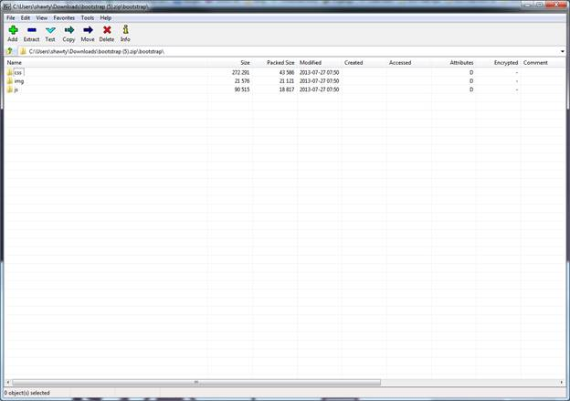
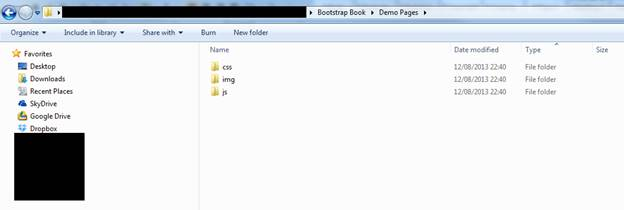
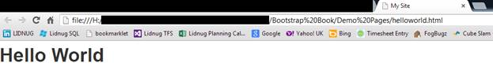

# 第 2 章将引导添加到您的项目中

那么，现在我得到了你的关注，我们如何将这种魔力添加到我们的项目中呢？

首先，它只是 CSS 和 JavaScript，所以你只需要通过在你的 HTML 代码中添加链接和脚本标签来以通常的方式附加它们。

然而，为了让你的钱得到最好的回报，有一个明确的方法，TWB 人建议你把事情联系起来。稍后会有更多的介绍。

首先是第一件事。让我们去 TWB 网站下载我们需要的东西。

|  | 注意:在撰写本书时，Bootstrap 版本 2 是当前版本，版本 3 仍在测试中。然而，从那时起，版本 3 已经退出测试，版本 2 也不再被广泛使用。这本书是用版本 2 的 CSS 类写的，所以如果你用的是版本 2，那么一切都应该没问题。但是，如果您使用的是版本 3，那么您必须意识到一些 CSS 规则的名称发生了一些重大变化。幸运的是，框架的创建者制作了一个转换图，准确地显示了发生了什么变化。这个转换图可以在[http://getbootstrap.com/getting-started/#migration](http://getbootstrap.com/getting-started/#migration)找到。原始的版本 2 文档仍然可用，但它位于网站的子文件夹中(如下所示)。 |

官方推特引导网站可以在[http://getbootstrap.com](http://getbootstrap.com)找到。

但是，如前所述，这将带您进入新的版本 3 门户。要找到版本 2 文档，您需要前往[http://getbootstrap.com/2.3.2](http://getbootstrap.com/2.3.2)。

如果您找到了正确的位置，那么您应该会看到如下内容:


图 1:推特引导 2.3.2 主页

从这里，如果你点击蓝色的下载引导按钮，它将下载主要的，完整的，未定制的 zip 文件，其中包含了使用 TWB 所需的一切。

## 下载选择

就像许多包装一样，TWB 可以通过许多不同的方式进行定制。

它的优势之一是整个框架是使用 CSS 预处理器“Less”构建的。使用“Less”，您可以在 CSS 代码中定义变量和常量，然后可以在构建/部署时替换它们，以对项目的外观进行系统范围的更改。

这意味着你可以，例如，定义一些东西为`Orange = #FF6000`。

然后，您可以在代码的其他区域以下列方式引用它:

`background-color: Orange;`

`border: 1px dashed Orange;`

或者类似的东西。

TWB 网站上的定制页面允许你调整它所使用的所有值，比如大小、颜色、字体等等，还可以选择最终下载的模块。

然而，现在我们只使用你可以从蓝色按钮上下载的内容。稍后我们将回到什么可以定制，什么不能定制。

如果你已经点击了下载按钮，那么在你的下载文件夹中你现在应该有一个名为 **Bootstrap.zip** 的文件。

如果你点击这个文件，它应该会在你系统上处理 zip 存档文件的任何应用程序中打开。我运行在 Windows 7 上，使用的是 7-Zip。

打开 zip 文件管理器后，您应该会看到许多类似于下图的文件夹:



图 2:显示引导下载的 Zip 客户端

CSS 文件夹包含核心的 TWB 样式表。请注意，这些已经被预处理过了，其中的任何“Less”命令都变成了真正的 CSS 语句。

JS 文件夹包含核心的 TWB JavaScript 文件。如果您进行了自定义下载并选择不包含 TWB 提供的某些功能，这里的文件将会有所不同。

IMG 文件夹包含 TWB 需要的图形文件，以便显示其软件包中的小位图图标。

TWB 的 CSS 文件中大约有 2285 行和 2309 行的定义；这些定义表明 IMG 文件夹需要和 CSS 在同一个文件夹中。如果需要更改位置，还需要更改 CSS 文件中的规则。

就我个人而言，我通常会删除任何路径信息，然后将文件放在与我的 CSS 文件相同的文件夹中。然而，现在，我们只是假设这三个文件夹都在你网站的根目录下。

## 单个文件

### CSS

在 CSS 文件夹中，您会发现四个不同的文件。这些应该如下:

| **CSS 文件名** | **描述** |
| Bootstrap 响应. css | 这是主要的、未压缩的、响应迅速的 TWB 样式表。 |
| Bootstrap-responsive.min.cs | 这是响应型 TWB 样式表的缩小版。 |
| 引导.css | 这是主要的、未压缩的 TWB 样式表。 |
| Bootstrap.min.cs | 这是标准 TWB 样式表的缩小版。 |

“缩小”版本如预期的那样:它们是样式表的缩小版本，以便在从远程浏览器访问您的网站时减少下载时间。非迷你版本是全脂的，包括注释、空白和其他内容。

CSS 有两种类型。第一种只是标准的无响应版本。这个样式表定义了网格、布局、字体以及 TWB 记录的所有其他内容。但是，它没有提供允许在移动设备(无论是平板电脑、智能手机还是其他缩小尺寸的显示器)上查看网站时流畅调整布局大小的规则。

另一方面，“响应”版本包含了将它添加到布局中所需的额外位。

通常，在设计布局时会包含主样式表。然后，一旦它完成了，你就可以在你的主 CSS 链接后面包含响应规则。这将覆盖主表中需要的那些规则，为您的站点启用响应功能。

在新的版本 3 构建中，这都是内置的，因为版本 3 有一个移动优先的策略。预计你会反其道而行之。

我们要到本书的后面才会处理响应性的东西，所以，目前，你唯一需要注意的是主样式表。

### JS

在 JS 文件夹中，您应该(如果您使用的是主非定制下载)找到以下文件:

| **JS 文件名** | **描述** |
| Bootstrap.js | 这是主引导 JavaScript 文件。 |
| Bootstrap.min.js | 这是主 JavaScript 文件的缩小版本。 |

就像 CSS 一样，缩小的文件是为网站的部署版本设计的缩小版本。如果您还没有决定定制，那么主 JS 文件是唯一需要的。如果您使用定制的下载，那么您可能会在这里找到单独的模块，例如 Modal.js 或 ScrollSpy.js，但是我通常不会费心定制 js，因为在一个文件中维护它要容易得多。

### IMG

如前所述，您应该会在这里找到两个 PNG 文件。这些是字形图标，一组是黑色，另一组是白色。它们用于呈现框架提供的图标。

在我们继续之前，将三个文件夹从您的 zip 文件中复制到您将要在其中创建基本 HTML 文件和模板的同一个文件夹中。就我而言，看起来是这样的:



图 3:显示引导文件夹布局的文件夹视图

## 向项目添加文件的推荐方式

所以，现在我们终于到了好的部分。

正如我之前提到的，TWB 的人建议您使用以下 HTML 5 代码作为所有基于 TWB 的项目的基础:

```html
    <!DOCTYPE html>
    <html>

    <head>
    <meta http-equiv="X-UA-Compatible" content="IE=9; IE=8; IE=7; IE=EDGE" />
    <meta charset="utf-8" />
    <title>My Site</title>
    <meta name="viewport" content=width="device-width, initial-scale=1.0">
    <link href="css/bootstrap.css" rel="stylesheet" type="text/css" />
    </head>

    <body>

    <!-- document code goes here -->

    <script src="js/jquery-2.0.2.js" type="text/javascript"></script>
    <script src="js/bootstrap.js" type="text/javascript"></script>

    </body>
    </html>

```

代码示例 1:推特引导基本代码

正如您在前面的代码示例中看到的，您还需要下载 jQuery 并将其添加到您的项目中。如果您没有在 TWB 使用任何 JS 特性，您将不会需要它，但是强烈建议您使用。我不会把细节放在这里；然而，Syncfusion 电子书库中有一本优秀的 jQuery 书籍，以及大量其他关于使用它的在线信息。

下载完文件后，在项目文件夹中创建一个文件并命名为 helloworld.html，然后使用您选择的文本编辑器将之前代码示例中的代码复制到该文件中。

更改以下行:

```html
    <!-- document code goes here -->

```

致:

```html
    <h1>Hello World</h1>

```

然后将 helloworld.html 文件加载到浏览器中。如果一切都如预期的那样运行，您应该会收到类似以下内容的问候:



图 Chrome 浏览器中显示的 Helloworld.html

恭喜你！您刚刚创建了第一个支持推特引导的网页。

从这里到这本书的结尾还有很多，在各个章节的过程中，我们将在项目文件夹中创建几个文件。

然而，我们创建的所有页面都将来自上面显示的模板。从这一点开始，每当我创建一个文件时，我都会假设您将创建新文件，然后将上面的基本模板代码复制并粘贴到其中。

因此，我将不再在我的示例中展示代码，而只展示我正在演示的 TWB 部分的 HTML 代码。

为了让事情变得更容易，你可能想做我做过的事情，那就是把 helloworld.html 复制到一个文件中，比如 template.html。然后，当您需要创建一个新文件时，您所需要做的就是复制您的模板，重命名它，然后将其加载到您的文本编辑器中。

因为我们在这里要做的一切都是普通的基本文本，任何简单的文本编辑器都可以。在我的例子中，我使用的是 Ultra Edit 和 Visual Studio 编辑器，但这纯粹是为了智能感知和颜色/语法突出显示之类的东西。

本书中介绍的示例可以在任何平台上完成，使用任何纯文本编辑器来查看您的输出。但是，我强烈建议您使用 Chrome 浏览器。

Twitter Bootstrap 需要一个支持 HTML 5 的浏览器，因为它使用了很多新的 HTML 5 和 CSS3 特性。这并不是说这里展示的任何代码在任何其他浏览器中都不起作用，但是在 Chrome 中看起来最好。在大多数情况下，在火狐和互联网浏览器的最新版本中，一切看起来都很好。

然而，传统浏览器是一个完全不同的游戏。框架的某些部分有一些优雅的退化，使用像这样的东西和像 Modernizr 这样的工具包将帮助您在旧浏览器中获得类似的外观和感觉。但是 TWB 的开发者并不能保证在当前的最新浏览器之外，一切都能如预期的那样运行。