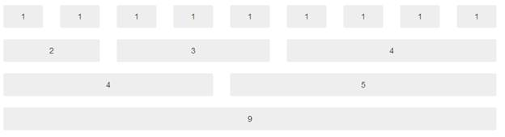
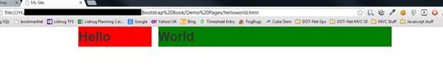
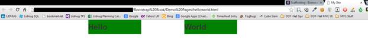

# 第三章推特引导支架

如前所述，TWB 提供了一个网格，允许您在文档中很容易地排列和设置列。

任何尝试过在 HTML 页面中做列的人，尤其是等高等间距的，都会知道这是一件多么苦差事。

TWB 通过将页面上的水平空间分成 12 个相等的列来简化这一过程；这些列可以进一步细分为这 12 列的倍数，但是你的总数永远不能超过 12。

然而，你不必被 12 列所束缚。如果你做了上一章提到的定制下载，你可以使用“更少”改变的选项之一是你的 CSS 中的列数。

为了让您了解这是如何工作的，下面是 TWB 网站上显示的九列网格的截图:



图 5:推特引导文档中的九列网格

要使用这个网格系统，就像使用 TWB 主 CSS 文件中定义的各种 spanX 类一样简单。

如果您有 12 列标准网格，那么您将有名为 span1 到 span12 的类。如果您已经自定义了副本，那么您将拥有 spanX，最多可达您指定的最大列数。

但是，需要记住的一点是，无论您有多少列，您的显示器将始终适应 940 像素的父容器，以及 724 或 1170 像素的网格宽度，具体取决于您的视口大小。

任何 767 像素或更小的视口宽度都将始终成为流畅的布局，并且列将开始垂直堆叠并沿页面向下流动，而不是横向流动，即使没有启用响应功能。

## 让 Hello World 看起来更好

打开您在上一章中创建的 helloworld.html 文件，找到如下所示的行:

```
    <h1>Hello World</h1>

```

更改此行，使其看起来如下所示:

```
    <div class="container">
    <div class="row">
    <div class="span12">
    <h1>Hello World</h1>
    </div>
    </div>
    </div>

```

你不必使你的缩进相同，但它会帮助你清楚地阅读东西。

如果您保存此内容并在浏览器上按 F5，您应该会看到您的 Hello World 文本跳过浏览器的中心，但稍微向左偏移。

您刚才所做的是创建一个标准的 TWB 父容器(如果您喜欢的话，可以创建一个页面)，然后在该容器中创建一行(很像表格中的一行)，最后在该行中，您创建了一个默认的、左对齐的单列，横跨默认网格的全部 12 列。

如果您现在将代码更改为以下内容:

```
    <div class="container">
    <div class="row">
    <div class="span6">
    <h1>Hello</h1>
    </div>
    <div class="span6">
    <h1>World</h1>
    </div>
    </div>
    </div>

```

现在，您应该看到您的 Hello World 文本已经分成两部分，单词之间有很大的差距。您所做的更改现在已经将这两个单词放入了它们自己的独立的六列网格中，该网格跨越了整个 12 列行，或者简单地说，您刚刚创建了两个等宽的列，这两个列将延伸到“平衡”位置，并适合文档的大小和流动。

当然，你不必把它们创造成平等的；您可以指定任何您喜欢的跨度宽度，只要总数加起来就是可用的列总数。例如，尝试以下方法:

```
    <div class="container">
    <div class="row">
    <div class="span3">
    <h1>Hello</h1>
    </div>
    <div class="span9">
    <h1>World</h1>
    </div>
    </div>
    </div>

```

你应该看到“世界”这个词现在跳得更靠左了，但是一切看起来仍然比例很好。

让我们添加一些样式规则，这样我们就可以看到发生了什么。在网页中包含 TWB CSS 文件的“链接”标签之后，关闭“标题”标签之前，添加以下代码:

```
    <style>
    .span3
    {
    background-color: red;
    }

    .span9
    {
    background-color: green;
    }

    </style>

```

如果一切按预期进行，保存修改后的文件并刷新浏览器时，您应该会看到以下内容:



图 6:修改后的 Helloworld.html 在网格上显示背景色

您将立即注意到使用跨度标记指定的网格是在哪里定义的。尝试将两个 div 中的跨度更改为不同的值，看看效果如何。但是请记住，如果您想要查看背景颜色，您还需要更改样式规则上的名称，以匹配网格中使用的名称。

如果你现在开始改变你的 spanX 类中的数字，你会很容易地看到一切是如何划分的。但是请记住，您还需要更改样式规则以匹配。

启用 spanX 的列也可以嵌套，以便列在其他列中保持平衡。然而，当你这样做的时候，你不再有你的 12 列网格。网格大小改为父网格的宽度减 1。

重温一下我们刚才做的三列和九列示例，更改您的代码，使它现在从以下内容更改:

```
    <div class="container">
    <div class="row">
    <div class="span3">
    <h1>Hello</h1>
    </div>
    <div class="span9">
    <h1>World</h1>
    </div>
    </div>
    </div>

```

致:

```
    <div class="container">
    <div class="row">
    <div class="span6">
    <h1>Twitter Bootstrap</h1>
    <div class="span3">
    <h2>Hello</h2>
    </div>
    <div class="span3">
    <h2>World</h2>
    </div>
    </div>
    </div>
    </div>

```

并将页面头部的样式规则更改为以下内容:

```
    <style>
    .span6
    {
    background-color: red;
    }

    .span3
    {
    background-color: green;
    }
    </style>

```

保存您的文档并点击刷新。如果一切按预期进行，您应该会看到以下内容:


图 7:修改为嵌套行的 Hello World 示例

为什么柱子叠在一起？

当嵌套跨度时，还需要为填充和 CSS 的其他部分留出一些扩展空间。如果嵌套跨度中没有足够的空间，那么 TWB 将尝试响应渲染，并尽可能地堆叠列。

在您刚刚编写的代码段中，如果您更改以下内容:

```
    <div class="span6">

```

致:

```
    <div class="span7">

```

记住也要更改样式名，然后保存并刷新页面。您应该会看到事情展开得更好一些，看起来应该如下所示:


图 8: Hello World 示例修改为嵌套行而不堆叠

样式表中有一些 CSS 规则，您可以用来对此进行更改，包括流体跨度(我们稍后会看到)。但是，在大多数情况下，通常更容易和更快地只是计划你的布局，总是考虑到一个额外的栏当需要的时候。

除了标准的网格和嵌套，我们还可以偏移列，在没有内容的地方创建空间，或者为您可能希望使用自己的 CSS 规则放置的其他东西腾出空间。

就像使用 spanX 类一样，通过向类中添加`offsetX`来偏移列，通常在控制宽度的 spanX 旁边。让我们对我们的 Hello World 示例再做一个更改。

将车身代码更改为:

```
    <div class="container">
    <div class="row">
    <div class="span3">
    <h2>Hello</h2>
    </div>
    <div class="span3 offset2">
    <h2>World</h2>
    </div>
    </div>
    </div>

```

标题中的样式:

```
    <style>
    .span3
    {
    background-color: green;
    }
    </style>

```

保存和刷新时，您应该会看到以下内容:



图 9:显示列偏移的 Hello World 示例

如您所见，第一个和第二个三柱跨度之间现在有一个两柱间隙。

就像正常跨度一样，偏移也可以嵌套。无论你使用什么样的规则，TWB 都会保持平衡的外观和感觉。

### 流体网格

TWB 在脚手架系统中的下一个锦囊妙计是流体网格。流体网格就像我们已经看到的固定网格，但是，它不是使用固定像素宽度的列布局，而是基于百分比的所有大小信息。

这意味着流体网格将使用所有可用的空间来显示，通常是浏览器窗口的整个宽度。

让我们基于我前面提到的模板创建一个新的 HTML 文档。将此文件作为 fluidhelloworld.html 文件保存在项目文件夹中。完成后，如前所述添加以下主体代码和样式:

```
    <style>
    .span6
    {
    background-color: green;
    }
    </style>

    <div class="container-fluid">
    <div class="row-fluid">
    <div class="span6">
    <h2>Hello</h2>
    </div>
    <div class="span6">
    <h2>World</h2>
    </div>
    </div>
    </div>

```

您会注意到，这个代码示例与上一个没有太大区别。其实细看的话，只有两个变化，分别是`container`变`container-fluid`、`row`变`row-fluid`。

如果保存并刷新页面，您应该会看到以下内容:


图 10:使用流体脚手架布局的 Hello World 示例

立即，您可以看到您的两个`span6`列已经扩展到浏览器窗口的整个宽度。使用`container-fluid`使您的根容器使用整个可用宽度，但仍然被分成 12 列。

您之前尝试过的所有嵌套和偏移的工作方式都与固定网格完全相同。你甚至可以把它们结合起来，达到两全其美的效果。

例如，您可以有一个包含使内部内容具有弹性的`row-fluids`的`container`。父框架将整齐地位于页面的中心，并在需要时进行相应的处理。

container-fluid 布局的一个常见用途是使用以下主体代码将页面分成常规内容和侧栏类型的排列:

```
    <div class="container-fluid">
    <div class="row-fluid">
    <div class="span2">
    <!--Sidebar content-->
    </div>
    <div class="span10">
    <!--Body content-->
    </div>
    </div>
    </div>

```

## 响应式设计

现在，最后，我们来到脚手架区，你们一直在等待的那个。

Twitter Bootstrap 不仅是一个很好的通用 CSS 框架，也是一个响应式设计框架。但是，要启用响应特性，您需要在页眉中包含主样式表之后包含响应 CSS 样式表，如下所示:

```
    <!DOCTYPE html>
    <html>

    <head>
    <meta http-equiv="X-UA-Compatible" content="IE=9; IE=8; IE=7; IE=EDGE" />
    <meta charset="utf-8" />
    <title>My Site</title>
    <meta name="viewport" content=width="device-width, initial-scale=1.0">
    <link href="css/bootstrap.css" rel="stylesheet" type="text/css" />
    <link href="css/bootstrap-responsive.css" rel="stylesheet" type="text/css" />
    </head>

    <body>

    <!-- document code goes here -->

    <script src="js/jquery-2.0.2.js" type="text/javascript"></script>
    <script src="js/bootstrap.js" type="text/javascript"></script>

    </body>
    </html>

```

代码示例 2:支持响应特性的 Twitter 引导基本代码

|  | 注意:Twitter Bootstrap 3 在设计上将是移动优先的。这意味着您不再需要确保添加响应特性 CSS，因为默认情况下响应特性是可用的。然而，在版本 3 中，所有的东西都有新的类名，所以需要大量的阅读才能知道什么是什么。 |

当您启用响应特性时，在页面的头部包含适当的元标签是非常重要的。这是您可以在代码示例 2 中看到的名为“视口”的标签除非将此 metatag 设置为适当的值，否则 TWB 的响应功能将无法正常工作。

那么，启用响应特性到底意味着什么？

近年来，随着 JavaScript 和 CSS 变得越来越强大，有可能将工具直接内置到网页呈现引擎中，以帮助不同大小屏幕的页面格式化。最棒的是，这些工具不再需要在许多独立的不同文件中实现，而是需要大量的 JavaScript 和 jQuery 代码来将一切联系在一起。

相反，开发人员需要做的就是像往常一样为一种显示类型创建他或她的页面，然后添加一些额外的 CSS 规则来控制当遇到较小的显示时会发生什么。

这些设施是通过使用所谓的媒体查询来实现的。

TWB 透明地为你处理这一切。作为开发人员，您不需要知道哪些查询做什么和如何做，或者根据显示的内容，某些规则如何在特定时间覆盖其他规则。

就像基本的网格系统一样，TWB 的大多数响应特性都是通过在文档的适当元素上指定特定的类名来实现的。

但是，请记住，尽管现在许多设备和浏览器都非常强大，但您仍然不想启用不需要的功能。如果你的应用程序除了宽屏的台式电脑之外永远不会被看到，那么启用 TWB 的响应部分就没有意义了。另外，在某些情况下，这样做甚至可能会减慢速度或导致一些意想不到的输出。

为了使响应设计正常工作，必须使用特定的显示宽度边界。对于 TWB，这些定义如下:

| 显示方式 | 布局宽度 | 列宽 | 檐槽宽度 |
| 大显示器 | 1200 像素及以上 | 70px | 30px |
| 默认 | 980 像素及以上 | 60px | 20px |
| 人像平板电脑 | 768 像素及以上 | 42px | 20px |
| 从手机到平板电脑 | 767px 及以下 | 仅提供液柱 |
| 电话 | 480 像素及以下 | 仅提供液柱 |

响应特性有三类类名。这些是手机、平板电脑和台式机。

在这三个类别中的每一个中，每个类别都有一个“隐藏”和“可见”类，确保给定的元素要么只在给定的类别中可见，要么总是在给定的类别中隐藏。

与其在这里打一个冗长的描述，最好的方法是让你看看 TWB 医生在 http://getbootstrap.com/2.3.2/scaffolding.html 的“脚手架”页面。

如果你向下滚动到文档的底部，你会看到一个布局良好的表格，绿色方块显示了易于理解的类和设备大小的各种组合。

然而，简单来说:

*   `class="visible-phone"`将只在手机大小的显示屏上可见，而`class="hidden-phone"`将一直隐藏在手机大小的显示屏上。
*   `visible-tablet/hidden-tablet`和`visible-desktop/hidden-desktop`的工作方式完全相同。

通过将这些类添加到网格布局的跨度和容器中，您可以确保边栏隐藏在手机上，但显示在桌面和所有其他组合中。如何组合它们只是决定什么需要出现在哪里的问题。

要以一个简单的示例结束本章，请将以下代码粘贴到模板中(如代码示例 1 所示):

```
    <div class="container-fluid">
    <div class="row-fluid">
    <div class="span2 visible-tablet visible-desktop">
    <!--Sidebar content-->
    </div>
    <div class="span10 hidden-phone">
    <!--Body content-->
    </div>
    <div class="span12 visible-phone">
    <!--Body content-->
    </div>
    </div>
    </div>

```

代码示例 3:响应元素

在上一个示例中，在 768px 以上的任何位置，您将获得一个 10 柱流体内容物区域，带有一个两柱流体侧杆。因为它们是流动的，所以它们会扩展到适合布局渲染的整个区域。

低于 768px 时，显示屏将变为 12 列流体网格，显示屏的整个宽度没有侧栏可见。

或者，用 Twitter Bootstrap 的话来说，在台式机和平板电脑上，你会让你的 10/2 侧边栏内容划分整个显示宽度；在手机上，你只能看到 12/0 的内容区域。

如果您在桌面浏览器中显示此内容并调整视口的宽度，您应该会很快看到它对不同显示宽度的影响。