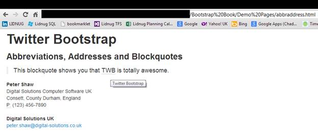
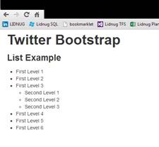
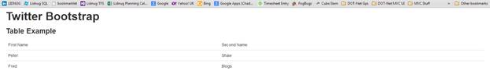
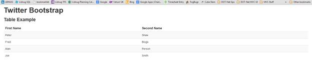
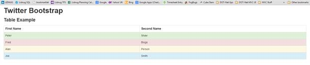

# 第四章推特引导库 CSS 类

像脚手架特性一样，TWB 的许多技巧都是通过简单地在你想要应用它们的元素上添加类来应用的。然而，许多可用的特性也直接应用于元素类型本身，在许多情况下，也应用于元素组。

您知道并使用的所有普通 HTML 元素都已经在标签的元素级别内置了样式。正如你在上一章已经看到的，标题 1

# 已经被使用了。

从 H1 到 H6 的所有标题标签都应用了一些默认的排版样式，标准正文的

标签以及粗体文本的**、斜体的*和小字的<small>也是如此。根据 HTML 5 规范，粗体和斜体仍然可以使用**和*，它们的样式仍然相同。***</small>***

所有这些都在基本 CSS 的标准排版类下，还有一些其他的。

## 引线主体副本

如果您使用标准正文`<p>`但对其应用类`lead`，您将获得一个看起来像引导正文副本或强调开头段落的段落样式。将下面的正文放入一个名为排版. html 的新文件中:

```html
    <div class="container-fluid">
    <div class="row-fluid">
    <h1>Twitter Bootstrap</h1>
    <h3>typography example</h3>
    <p class="lead">
    Lorem ipsum dolor sit amet, consectetur adipiscing elit. Nulla elit mi, pellentesque sed vehicula at.
    </p>
    <p>
    Maecenas ultricies, sem eget accumsan vehicula, mi dui luctus tortor, iaculis vehicula tortor justo et purus. Sed fermentum mauris magna, quis faucibus arcu mattis et. Aenean vitae nisi sit amet enim accumsan auctor. Mauris at lectus pellentesque, eleifend sapien sit amet.
    </p>
    </div>
    </div>

```

代码示例 4:基本排版

如果您已经像我们所做的那样将代码正确地复制到了一个推荐的模板中，那么您应该会得到如下结果:


图 11:推特引导基本排版示例

## 对齐和强调

基本 CSS 有一堆类，使对齐你的文本变得非常容易，以及强调使用标准颜色类的能力(如前所述，所有这些都可以通过自定义下载进行更改)。这些颜色类是 TWB 在整个框架中提供的许多样式和组件的标准。

文字对齐真的很好用；你只需将`class = "text-left", class = "text-center" or class = "text-right"`添加到你想要对齐的文本中。这个类也适用于任何文本元素(以及许多非文本元素)，因此您可以使用它来对齐标题、引导正文以及其他各种内容。

强调文本同样易于使用，具有以下类名:

*   静音:专为看起来被静音或禁用的文本而设计。
*   文本警告:显示为警告设计的黄色文本。
*   文本错误:显示为错误信息设计的红色文本。
*   文本信息:以粉蓝色显示文本，设计用于一般信息信息。
*   文本-成功:以绿色显示文本，旨在成功运行，一切正常的消息。

创建一个名为 alignmentemphasis.html 的新模板，并在其中输入以下正文:

```html
    <div class="container-fluid">
    <div class="row-fluid">
    <h1>Twitter Bootstrap</h1>
    <h3>Alignment and Emphasis</h3>
    <h4 class="text-left">This is a left aligned heading level 4</h4>
    <h4 class="text-center">This is a center aligned heading level 4</h4>
    <h4 class="text-right">This is a right aligned heading level 4</h4>
    <p class="text-center muted">This line of text has been muted.</p>
    <p class="text-center text-error">This line of text should serve as an error.</p>
    <p class="text-center text-warning">This line of text should serve as a warning.</p>
    <p class="text-center text-success">This line of text should serve as a successful operation message.</p>
    <p class="text-center text-info">This line of text should serve as an information message of some kind.</p>
    </div>
    </div>

```

代码示例 5:文本对齐和强调

与前面的所有示例一样，一旦您将页面保存并加载到浏览器中，您应该会看到以下消息:


图 12:对齐和强调示例

## 缩写、地址和区块引号

转到更标准的排版类，<abbr>、</abbr>

<address>和

> Labels have their own styles suitable for their use, which is also in line with the standard balanced look and feel we have seen in other parts of TWB so far.

</address>

如果您一直在关注新的 HTML 5 语义标记，那么每个标记都有特定的含义就不足为奇了。如果你没有看过，那么每个元素的预期用途和场景应该是相当明显的。

缩写通常以下列方式在线使用:

```html
    <p><abbr title="Twitter Bootstrap">TWB</abbr> is totally awesome</p>

```

另一方面，地址和块引号被设计为独立于其他元素使用的自描述实体，并且期望被标记为这样。

将以下代码示例添加到新文件中，然后将该文件保存并加载到浏览器中:

```html
    <div class="container-fluid">
    <div class="row-fluid">
    <h1>Twitter Bootstrap</h1>
    <h3>Abbreviations, Addresses and Blockquotes</h3>

    <blockquote>
    <p>This blockquote shows you that <abbr title="Twitter Bootstrap">TWB</abbr> is totally awesome.</p>
    </blockquote>

    <address>
    <strong>Peter Shaw</strong><br>
    Digital Solutions Computer Software UK<br>
    Consett, County Durham, England<br>
    <abbr title="Telephone number">P:</abbr> (123) 456-7890
    </address>

    <address>
    <strong>Digital Solutions UK</strong><br>
    <a href="mailto:#">peter.shaw@digital-solutions.co.uk</a>
    </address>

    </div>
    </div>

```

代码示例 6:缩写、地址和块引号

结果应该如下图所示:



图 13:缩写、地址和区块引用示例

## 列表

任何框架都不应该没有类来帮助创建和操作不起眼的列表项。Twitter Bootstrap 也不例外，它有六种不同的风格集可以使用。

前两个仅仅是简单的

与普通的父元素类型一样，UL 是一个无序列表，而 OL 将呈现一个有序列表，每行都以一个数字作为前缀。

你也可以取消你的 UL 或 OL 的根级别。这给了我们第三种类型的列表，它允许我们以整洁的块格式列出项目，但是不列出项目符号和数字，直到你深入一层以上。这是通过将“无样式”类添加到任何普通列表集合中来使用的。

TWB 提供的第四种列表样式是内嵌列表。这与导航和面包屑组件等其他组件一起使用。在这种样式中，列表中的项目是水平布局，而不是垂直布局。同样，对于未样式化的类型，您只需要向列表容器添加一个名为“inline”的类。

HTML 5 增加了一种新的列表类型，称为描述列表；像标准的 UL 和 OL 标签一样，这个新标签也被赋予了一些默认的样式，允许使用简单的标记创建定义列表，默认情况下，这些标记与文档的其余部分保持平衡。

第六种也是最后一种类型是水平描述列表。将 dl-horizontal 类添加到

元素会导致标题的

元素水平排列在

元素旁边，从而产生一个带有水平排列标签的格式良好的垂直列表。

首先，让我们做一个正常的，无序的列表。

将以下正文添加到文档模板中，并将其保存为 listexample.html:

```html
    <div class="container-fluid">
    <div class="row-fluid">
    <h1>Twitter Bootstrap</h1>
    <h3>List Example</h3>
    <ul>
    <li>First Level 1</li>
    <li>First Level 2</li>
    <li>First Level 3</li>
    <ul>
    <li>Second Level 1</li>
    <li>Second Level 2</li>
    <li>Second Level 3</li>
    </ul>
    <li>First Level 4</li>
    <li>First Level 5</li>
    <li>First Level 6</li>
    </ul>
    </div>
    </div>

```

代码示例 7:标准无序列表

如果您在浏览器中保存并渲染它，您应该会看到如下标准列表:



图 14:标准无序列表示例

如果您现在在之前的代码示例中更改了您的

标签，那么保存并刷新您的浏览器窗口；这将变成一个标准的有序列表，其中的项目符号被编号的列表项所取代。

如果您现在将根

```html
    <ol>

```

致:

```html
    <ol class="unstyled">

```

您将看到，格式将仅在直接子项目上删除，但其余部分保持不变:


图 15:应用了“无样式”类的有序列表

要演示第四种类型的可用列表，请将未样式化的类属性更改为 inline。您的代码现在应该如下所示:

```html
    <div class="container-fluid">
    <div class="row-fluid">
    <h1>Twitter Bootstrap</h1>
    <h3>List Example</h3>
    <ol class="inline">
    <li>First Level 1</li>
    <li>First Level 2</li>
    <li>First Level 3</li>
    <ol>
    <li>Second Level 1</li>
    <li>Second Level 2</li>
    <li>Second Level 3</li>
    </ol>
    <li>First Level 4</li>
    <li>First Level 5</li>
    <li>First Level 6</li>
    </ol>
    </div>
    </div>

```

代码示例 8:标准有序列表

当您在浏览器中保存和呈现页面时，您应该会得到以下信息:


图 16:内嵌列表示例

如您所见，像未样式属性一样，内联样式只影响直接子级。但是，如果您有任何其他东西破坏您的文档流，它将从列表中的每个项目创建多列等宽行。

如果您还将一个内联类应用于内部


图 17:嵌套内联列表示例

对于第五种和第六种类型，我们需要将我们的有序列表从代码示例 8 更改为 HTML 5 定义列表标签，如下所示:

```html
    <div class="container-fluid">
    <div class="row-fluid">
    <h1>Twitter Bootstrap</h1>
    <h3>List Example</h3>
    <dl>
    <dt>First Level 1 Title</dt>
    <dd>First Level 1 Text</dd>
    <dt>First Level 1 Title</dt>
    <dd>First Level 2 Text</dd>
    <dt>First Level 1 Title</dt>
    <dd>First Level 3 Text </dd>
    <dl>
    <dt>Second Level 1 Title</dt>
    <dd>Second Level 1 Text </dd>
    <dt>Second Level 2 Title</dt>
    <dd>Second Level 2 Text </dd>
    <dt>Second Level 3 Title</dt>
    <dd>Second Level 3 Text </dd>
    </dl>
    <dt>First Level 4 Title</dt>
    <dd>First Level 4 Text </dd>
    <dt>First Level 5 Title</dt>
    <dd>First Level 5 Text </dd>
    <dt>First Level 6 Title</dt>
    <dd>First Level 6 Text </dd>
    </dl>
    </div>
    </div>

```

*代码样本 9:标准定义列表*

如果您将它保存并加载到浏览器中，它应该如下所示:


图 18:标准定义列表示例

最后，更改每个标签:

```html
    <dl>

```

致:

```html
    <dl class="dl-horizontal">

```

刷新浏览器后，您将看到第六种类型的列表:


图 19:应用水平格式的定义列表示例

## 表格

关于 Twitter Bootstrap 中的表，我只有一点要说:它们太棒了。

就像任何曾经设计过桌子的人会告诉你的那样，这不是一件愉快的事情。您有行分条、边框折叠和单个单元格间距的规则。然后是奇数单元格，如垂直标签列，或最右端或行，其中，对于一个单元格，您必须有一个单独的规则来删除一小部分填充，因为它看起来不合适，整个边框也在那里。

在 TWB，你所需要做的就是让你的表像平常一样，然后把表类应用到它上面，就这样。

启动一个新的模板文件，并添加以下正文内容:

```html
    <div class="container-fluid">
    <div class="row-fluid">
    <h1>Twitter Bootstrap</h1>
    <h3>Table Example</h3>
    <table class="table">
    <thead>
    <tr>
    <td>First Name</td>
    <td>Second Name</td>
    </tr>
    </thead>
    <tbody>
    <tr>
    <td>Peter</td>
    <td>Shaw</td>
    </tr>
    <tr>
    <td>Fred</td>
    <td>Blogs</td>
    </tr>
    </tbody>
    </table>
    </div>
    </div>

```

代码示例 10:标准表

如前所述，如果保存并将其加载到浏览器中，您应该会看到以下内容:



图 20:推特引导基本表

看起来可能不多，但如果你注意到，你马上就能看到这是一张反应灵敏的桌子。

如果您调整浏览器的大小，它将适当地调整和平衡两列。如果您添加第三列，您将看到所有内容都将很好地调整大小，并且表格将保持平衡。

我们在这里仍然使用流体网格，但是你可以用偏移和各种方式将它包裹在跨度中，所有的东西都会很好地调整大小并保持正确的比例。

您还会注意到，我已经使用了 ad 和 tbody 标记了示例代码；这不仅对 TWB 是明智的，对 HTML 5 也是明智的。

有大量的插件(您将在后面看到)为 TWB 添加了额外的特性，并且需要像这样构建表才能工作。不过，就目前而言，它帮助我们更容易地设置标题行的样式。

正如我们在本书前面讨论脚手架时所做的那样，将以下样式规则添加到您刚刚创建的表格示例中，即页面“head”部分:

```html
    <style>
    .table thead tr td
    {
    font-weight: bold;
    font-size: 1.2em;
    }
    </style>

```

代码示例 11:表格标题样式

我不会为这一个做截图，但是一旦你在你的浏览器中添加、保存和刷新页面，你应该会看到第一行变得粗体和稍微大一点。

但是，因为我已经将规则的目标设置为 Twitter 现有的“table”类，所以您会看到，如果从您的表标记中移除 class =“table”，然后刷新页面，粗体将与 TWB 格式同时消失，并且一旦您将该类重新添加进来，就会重新出现。

如果您在文档中添加了第二个表格并添加了 TWB 表格类，那么如果您使用“标题”和“正文”标记表格，标题行中会自动出现粗体条目。如果您也对表尾使用 tfoot，也可以用同样的方式扩展规则。

我不打算在这里过多地讨论它，因为它是一个通用的 CSS 特性(层叠，这是 CSS 中的 C)，但是 Twitter Bootstrap 在很多地方都非常广泛地使用它，比如在这里的表格中，所有繁重的工作都是为您完成的，只需要在您需要关注的部分扩展样式。

然而，TWB 让事情变得简单多了。如果您将标题部分的Change the label to, TWB will automatically make it bold for you and keep the proportion of font size. It can even be used in other places., the font will be bold and highlighted.

你也可以使用...标签在起始的和标签之间添加一个标题到你的表格，然后 TWB 也会特别注意。

表类也有一些自己的类扩展。假设您想让奇数/偶数行分条。尝试从以下位置更改您的表定义:

```html
    <table class="table">

```

致:

```html
    <table class="table table-striped">

```

如果您做得正确，您应该会看到类似于下图的内容(我添加了一些行，以便您可以看到条纹):



图 21:推特引导分条表示例

现在，让我们尝试添加一个完整的边框。将您的表格从:

```html
    <table class="table table-striped">

```

致:

```html
    <table class="table table-bordered">

```

最后你应该得到:


图 22:推特引导带边框的表格示例

如果你想的话，没有什么能阻止你把它们都加进去:

```html
    <table class="table table-bordered table-striped">

```

这显示在下图中:


图 23:应用了分条和带边框可选类的推特引导表

另外两个可选类也存在。它们是表格悬停和表格压缩，前者突出显示鼠标光标当前悬停的行，后者通过将单元格周围的填充边距减半，将表格向上挤压一点。

如前所述，您可以将这些类单独用于一个普通的表，也可以将它们组合成一些非常有吸引力的表。前面提到的为 TWB 而存在的表格插件也增加了一些自己的新样式。

在我们离开表之前，还有一组类非常有用，它们是可选的行类。

可选的行类，不同于我们到目前为止所看到的，应用于表内的标签，而不是表本身。它们被设计成给整排特别突出。

像我们之前看到的文本颜色突出显示类一样，这些行类的预期用途是传递行内容的状态信息。他们也有类似的名字，如下:

*   成功:以成功操作定义的颜色显示(通常为绿色)。
*   错误:以为错误操作定义的颜色显示(通常为红色)。
*   警告:以为警告操作定义的颜色显示(通常为黄色)。
*   信息:以为信息操作定义的颜色显示(通常为蓝色)。

更改上一个表示例(来自代码示例 10)，使其如下所示:

```html
    <div class="container-fluid">
    <div class="row-fluid">
    <h1>Twitter Bootstrap</h1>
    <h3>Table Example</h3>
    <table class="table">
    <thead>
    <tr>
    <td>First Name</td>
    <td>Second Name</td>
    </tr>
    </thead>
    <tbody>
    <tr class="success">
    <td>Peter</td>
    <td>Shaw</td>
    </tr>
    <tr class="error">
    <td>Fred</td>
    <td>Blogs</td>
    </tr>
    <tr class="warning">
    <td>Alan</td>
    <td>Person</td>
    </tr>
    <tr class="info">
    <td>Joe</td>
    <td>Smith</td>
    </tr>
    </tbody>
    </table>
    </div>
    </div>

```

代码示例 12:可选行类

如果您在浏览器中保存并刷新它，您应该会看到如下内容:



就像任何其他股票颜色一样，这些颜色可以通过进行自定义下载来修改，如前所述，在关于在您的项目中安装推特引导的一章中。