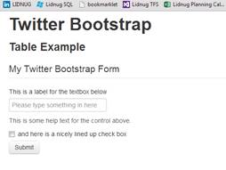
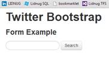
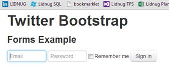
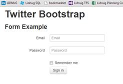
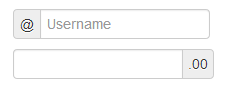
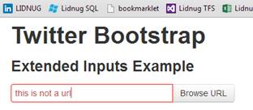
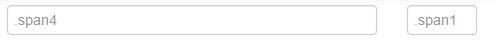

# 第五章形式

简而言之，TWB 为表单和网页交互增加的功能令人惊叹。有太多的东西要涵盖，它真的值得一整章。

在 Twitter Bootstrap 出现之前，我可以很容易地把大部分时间花在应用程序的 UI 上，除了尝试布局表单，让所有东西看起来都很漂亮并排列整齐之外，什么都不做。

任何一个曾经在网页上做过表单的网络开发人员都会明白我的意思，他们会知道做对是一种多么痛苦的体验。

最重要的是，在 TWB 下标记的表单不需要像在表格中那样添加任何主类。你所要做的就是使用推荐的语义 HTML 5 布局技术来标记你的表单。TWB 将只是做它需要做的，给你一个默认的，左对齐，垂直堆叠的响应形式。

开始一个新的模板 HTML 文件，就像我们在本书中一直做的那样，并向其中添加以下正文内容:

```
    <div class="container-fluid">
    <div class="row-fluid">
    <h1>Twitter Bootstrap</h1>
    <h3>Forms Example</h3>
    <form>
    <fieldset>
    <legend>My Twitter Bootstrap Form</legend>
    <label>This is a label for the textbox below</label>
    <input type="text" placeholder="Please type something in here">
    <span class="help-block">This is some help text for the control above.</span>
    <label class="checkbox">
    <input type="checkbox"> and here is a nicely lined up check box
    </label>
    <button type="submit" class="btn">Submit</button>
    </fieldset>
    </form>
    </div>
    </div>

```

代码示例 13:基本表单代码

保存和加载文档后，您的网页中应该有一个类似于以下内容的表单:



图 24:基本的推特引导表单

正如您所看到的，只需很少的时间就能获得视觉上令人愉悦的东西，并且与其他所有东西一样，您可以轻松地覆盖和定制您想要的任何单个位。

然而，像表类一样，有一大堆可选类可以添加到表单中。

有些是为特殊情况设计的，比如搜索类，它被设计成一个看起来非常现代的圆形搜索框，一直到更通用的单个输入类型的类。

## 搜索表单

我们都见过它们，视觉愉悦的人群喜欢它们。没错，我们在大多数网站的菜单栏上看到的那些漂亮的搜索框，有着尖锐的圆角和整齐的控件。

好吧，使用推特引导程序，你可以用四行 HTML 5 标记创建这些东西之一。不相信我？尝试将刚才创建的表单示例更改为以下内容:

```
    <div class="container-fluid">
    <div class="row-fluid">
    <h1>Twitter Bootstrap</h1>
    <h3>Forms Example</h3>
    <form class="form-search">
    <input type="text" class="input-medium search-query">
    <button type="submit" class="btn">Search</button>
    </form>
    </div>
    </div>

```

代码示例 14:基本表单代码

如果一切顺利，当您刷新页面时，应该会看到以下内容:



图 25:搜索表单示例

当您开始使用 Twitter Bootstrap 中的表单类时，您可以免费获得的其他东西是字段本身的高亮显示。我将很快向您展示更多内容，但是现在，如果您单击搜索框，您应该会看到它以蓝色光环突出显示，如下图所示:


图 26:带有突出显示字段的搜索表单示例

搜索表格只是 TWB 如何帮助你的一个专门例子；另一个是内联表单。

## 内嵌表单

内联表单通常用于导航栏和页眉等地方，用于微型登录表单等元素。要在 Twitter Bootstrap 中创建一个内联表单，您需要做的就是添加另一个类名(我确实提到过这都是关于 CSS 和 JavaScript 的)，这应该不足为奇。

更改您之前在代码示例 13 中制作的代码示例，使其看起来像下面的代码:

```
    <div class="container-fluid">
    <div class="row-fluid">
    <h1>Twitter Bootstrap</h1>
    <h3>Forms Example</h3>
    <form class="form-inline">
    <input type="text" class="input-small" placeholder="Email">
    <input type="password" class="input-small" placeholder="Password">
    <label class="checkbox">
    <input type="checkbox"> Remember me
    </label>
    <button type="submit" class="btn">Sign in</button>
    </form>
    </div>
    </div>

```

代码示例 13:内联表单代码

保存并刷新，您的搜索表单现在应该已更改为如下所示:



图 27:内联表单示例

正如您将在后面看到的，当我们进入像导航栏这样的主题时，采用这种形式并将其添加到站点范围的导航中会非常容易。

在我们继续讨论单个窗体控件可用的内容之前，让我们再看一种类型的窗体:水平窗体。

## 水平形式

要使用水平表单功能，可以将表单-水平类添加到表单中。但是，与你目前看到的其他形式不同，你必须做更多的工作。不同的控件集合需要包装在控件组中，并且表单布局必须以特定的方式进行结构化。

随着你对 TWB 的深入研究，你会发现有一些情况，它不仅仅是在元素中添加正确的类。在某些情况下(特别是当我们进入组件部分时)，它是关于您创建 HTML 元素的顺序和您使用的实际标签。

目前我们不会对此太担心，但这是你需要牢记在心的事情，因为你以后需要记住它。

在向您展示下一个代码示例之前，我将花一点时间向您介绍控制组。

### 对照组

当你正常创建一个表单时，你通常不会认真考虑它。您只需添加标签和输入字段，然后添加各种按钮并修复表单处理程序以接受您的数据输入。

然而，如果你从高层次逻辑地看待你的表单，通过用户的眼睛，你将很快开始看到模式。

输入字段上方或旁边的标签、单选按钮集合和按钮行都有单独的原因存在于页面上。

如果你在每条线周围画一个方框，你会发现在大多数情况下你有一个单列的表格。

现在，将验证消息、帮助文本和其他旨在帮助最终用户导航表单的构件添加到组合中。然后，考虑 ARIA 兼容性提示之类的东西，比如屏幕阅读器和导航辅助工具，以帮助那些有障碍的人。突然之间，你有了一大堆需要某种结构才能让相关事物看起来有关联的东西。

Twitter Bootstrap 的创建者用一种叫做控制组的东西解决了这个问题。

控制组只不过是一个标准的

标签，它围绕着表单中给定的一行元素(类似于行类在基础框架中的工作方式)。但是 TWB 的其他类理解并尊重这个父元素对它包含的控件的意义。当我介绍验证状态时，我们将很快看到更详细的内容。

### 继续水平形态

因此，回到我们的表单示例，更改表单中的主体代码，使其看起来如下所示:

```
    <div class="container-fluid">
    <div class="row-fluid">
    <h1>Twitter Bootstrap</h1>
    <h3>Form Example</h3>
    <form class="form-horizontal">
    <div class="control-group">
    <label class="control-label" for="inputEmail">Email</label>
    <div class="controls">
    <input type="text" id="inputEmail" placeholder="Email">
    </div>
    </div>
    <div class="control-group">
    <label class="control-label" for="inputPassword">Password</label>
    <div class="controls">
    <input type="password" id="inputPassword" placeholder="Password">
    </div>
    </div>
    <div class="control-group">
    <div class="controls">
    <label class="checkbox">
    <input type="checkbox"> Remember me
    </label>
    <button type="submit" class="btn">Sign in</button>
    </div>
    </div>
    </form>
    </div>
    </div>

```

代码示例 15:水平形式

与前面的示例一样，如果保存并刷新页面，您应该会看到类似于下图的内容:



图 28:推特引导水平表单示例

如您所见，结构和控制组的使用确保了复选框的文本标签整齐排列，输入字段的标签整齐排列，并且按钮和其他家具都共享一个公共的左边距。

只需几行额外的代码和少量的类，您的表单就会有一个令人赏心悦目的平衡外观。

### 验证状态

如果你还记得刚才我讨论控制组的时候，我提到了一种叫做验证状态的东西。验证状态是可选的类，您可以将其添加到控件组中，然后以某种可视方式影响该组中包含的每个元素，从而允许您向最终用户传达有关表单中输入状态的额外信息。

就像您之前看到的为表格行和文本项设置样式的可选类一样，验证状态类遵循类似的命名约定和默认颜色集，可以通过使用项目中主 TWB 样式表的自定义下载和/或“更少”版本轻松自定义。不同验证样式使用的名称如下:

*   警告:以黄色警告颜色显示验证状态。
*   错误:以红色显示验证状态，以指示错误状态。
*   信息:以粉蓝色显示表单状态，表示信息状态。
*   成功:用绿色显示表单，表示一切正常。

让我们试试这些状态，看看它们是什么样子。

在代码示例 14 中，更改表单中的第一个控件组，以包含表单中第一个控件组的警告验证状态。代码应该如下所示:

```
    <div class="control-group warning">
    <label class="control-label" for="inputEmail">Email</label>
    <div class="controls">
    <input type="text" id="inputEmail" placeholder="Email">
    </div>
    </div>

```

如果您保存并刷新表单，您将看到以下消息:


图 29:显示应用于第一个控件的警告状态的水平表单

尝试将警告级别更改为其他三种颜色中的一种，您应该会看到影响整个组的不同颜色。我在表单中添加了三个新的控件，只是为了将它们显示在一起。

我还添加了以下跨度:

```
    <span class="help-inline">Example help text</span>

```

每个包含实际输入控件的

标签都标有一个帮助内联类，因此您可以看到验证状态也会影响它们。


图 30:验证状态示例

## 独立控件支持

HTML 标准中的大多数标准输入类型都由 Twitter Bootstrap 自动支持、设计和处理。如果您使用 HTML 5 规范添加的特定输入类型(浏览器支持允许且可以更改样式)，TWB 还会尝试适当地处理呈现的控件。

不幸的是，浏览器对新的 HTML 5 控件类型的支持目前还有点不完善。Chrome 被认为是目前对不同类型支持最好的浏览器；然而，即便如此，距离目标仍有一点距离。

不过，不要被阻止使用它们。HTML 5 的一个好处是，如果浏览器不支持您试图呈现的控件类型，那么它将(或者应该)呈现为一个普通的旧文本框。

以下代码示例虽然不是 Twitter Bootstrap 特定的代码，但显示了所有新的输入类型，并在适当的控制组中进行了标记:

```
    <div class="container-fluid">
    <div class="row-fluid">
    <h1>Twitter Bootstrap</h1>
    <h3>Form Inputs Example</h3>
    <form>
    <div class="control-group">
    <label class="control-label">Text Input</label>
    <div class="controls">
    <input type="text" />
    </div>
    </div>
    <div class="control-group">
    <label class="control-label">Search Input</label>
    <div class="controls">
    <input type="search" />
    </div>
    </div>
    <div class="control-group">
    <label class="control-label">Email Input</label>
    <div class="controls">
    <input type="email" />
    </div>
    </div>
    <div class="control-group">
    <label class="control-label">Url Input</label>
    <div class="controls">
    <input type="url" />
    </div>
    </div>
    <div class="control-group">
    <label class="control-label">Telephone Input</label>
    <div class="controls">
    <input type="tel" />
    </div>
    </div>
    <div class="control-group">
    <label class="control-label">Number Input</label>
    <div class="controls">
    <input type="number" />
    </div>
    </div>
    <div class="control-group">
    <label class="control-label">Range Input</label>
    <div class="controls">
    <input type="range" />
    </div>
    </div>
    <div class="control-group">
    <label class="control-label">Date Input</label>
    <div class="controls">
    <input type="date" />
    </div>
    </div>
    <div class="control-group">
    <label class="control-label">Month Input</label>
    <div class="controls">
    <input type="month" />
    </div>
    </div>
    <div class="control-group">
    <label class="control-label">Week Input</label>
    <div class="controls">
    <input type="week" />
    </div>
    </div>
    <div class="control-group">
    <label class="control-label">Time Input</label>
    <div class="controls">
    <input type="time" />
    </div>
    </div>
    <div class="control-group">
    <label class="control-label">Datetime Input</label>
    <div class="controls">
    <input type="datetime" />
    </div>
    </div>
    <div class="control-group">
    <label class="control-label">Datetime local Input</label>
    <div class="controls">
    <input type="datetime-local" />
    </div>
    </div>
    <div class="control-group">
    <label class="control-label">Color Input</label>
    <div class="controls">
    <input type="color" />
    </div>
    </div>
    </form>
    </div>
    </div>

```

代码示例 16: HTML 5 输入控件类型

如果我在 Chrome 的默认副本(本文的版本 28.0.1500.95)中呈现这一点，我看到的是:


图 31:在推特引导中呈现的 HTML 5 输入类型

眼尖的你会注意到那是两列，不是一列。而且，不，TWB 没有在那方面帮助我(尽管它可以)。实际上，我以这种方式创建截图纯粹是为了本书中的插图。

如果您在不同的浏览器中尝试代码示例 15 中的代码，您将获得不同的里程，具体取决于您使用的浏览器。您还会注意到，尤其是在移动浏览器上，其中一些会调整屏幕键盘或输入系统以反映正在使用的输入类型。

您还应该注意到，如果您试图破坏输入类型中的验证规则(例如在数字输入中输入字母，或者在适当的字段类型中输入格式不正确的网址或电子邮件)，前面显示的验证状态颜色将会生效，甚至在您尝试提交表单之前。

除了标准的输入类型，使用正确的表单来分组类和正确标记表单，还有一件事似乎总是很难做到:将标签名称与复选框和单选按钮对齐。

通过将复选框和单选按钮实际包装在标签元素中，如下所示:

```
    <label class="checkbox">
    <input type="checkbox" value="">
    This is my option
    </label>

```

根据需要在标签上添加“复选框”或“单选”类，推特引导程序会将标签与控件对齐，这样您就再也不用担心选项面板的布局是否正确了。

如果进一步添加内联可选类，您将看到复选框和单选按钮都水平地内联显示在同一行上:

```
    <label class="checkbox inline">
    <input type="checkbox" value="">
    A
    </label>
    <label class="checkbox inline">
    <input type="checkbox" value="">
    B
    </label>
    <label class="checkbox inline">
    <input type="checkbox" value="">
    C
    </label>

```

这将产生以下输出:


图 32:内嵌复选框

您可以以同样的方式向单选按钮添加“内联”可选类。

其余的输入类型，如选择和选项以及具有多重属性的选择，也将被设置为匹配其他推特组件，因此，也可以与不同的跨度类和验证样式一起使用，就像其他所有东西一样。不幸的是，不起眼的文件上传控件还没有同样的功能。

有一些附加组件允许您使用文件选择控件，并使其视觉外观看起来像 Bootstrap 的其余部分。但这些基本上只是带有扩展控件集的文本框；实际的文件控制隐藏在幕后，使用的是我几年前在[博客](http://shawtyds.wordpress.com/2010/08/08/single-button-ajax-file-uploads-using-jquery/)上写的一种技术。这样做的原因是，出于安全考虑，文件控件不像其他控件那样拥有样式和 JavaScript 操作的自由。这是意料之中的事，因为你不希望脚本能够从你的电脑中窃取文件，是吗？

## 扩展表单控件

在使用 Twitter Bootstrap 时，还有另一个很好的理由来正确地构造 HTML 5 代码，这样你就可以利用它提供的扩展控件。

扩展控件是这样一种控件，其中有一个文本标签，该标签似乎是控件的一部分，例如 Twitter 名称输入的@符号或数字输入后的两个小数点，如下图所示:



图 33:扩展的输入类型

创造这些非常容易；您可以使用下面的 HTML 复制上面的两个例子:

```
    <div class="input-prepend">
    <span class="add-on">@</span>
    <input class="span2" id="prependedInput" type="text" placeholder="Username">
    </div>
    <div class="input-append">
    <input class="span2" id="appendedInput" type="text">
    <span class="add-on">.00</span>
    </div>

```

如您所见，这就像在标准“

”中包装控件及其前追加或后追加部分一样简单，类类型为“input-prepend”或“input-append”，具体取决于您想要将扩展添加到输入控件的哪一端。

还可以添加一个包含两者的类，然后在输入控件的两侧放置一个跨度，这样就可以同时在两端添加一个扩展。

文本并不是唯一可以用两者扩展控件的东西。Twitter Bootstrap 的许多组件都可以以同样的方式使用。例如，以下代码:

```
    <div class="input-append">
    <input class="span2" id="appendedInputButton" type="url">
    <button class="btn" type="button">Browse URL</button>
    </div>

```

这将创建一个带有附加浏览按钮的 HTML 5 URL 输入控件，如下所示:


图 34:带按钮的推特引导扩展输入控件

验证状态继续按预期工作:



图 35:带有按钮的 Twitter Bootstrap 扩展输入控件，显示验证错误

您可以添加多个按钮、带有下拉菜单的分段按钮、看起来像您之前看到的预制搜索表单的样式化搜索输入，以及各种其他添加，以使您的输入字段真正脱颖而出。

可以添加到单个输入中的其他类有“不可编辑输入”和“禁用”之类的东西在保存表单中的值的跨度上同时使用这两者，以在表单组中显示数据，并像任何其他表单输入一样设置其样式。结果实际上不是一个输入控件，而是一个具有相同视觉外观但不参与表单提交的元素。这个想法是，它可以用来在数据库应用程序中显示一个记录号，但允许该记录号保持未经编辑，并在表单发布回网络服务器时作为隐藏参数提交。

我们还有帮助文本类，正如您之前在验证状态示例中看到的。帮助文本可以分为两类:

*   帮助-内联:尝试使文本与其控件保持一致。
*   帮助块:将帮助文本分成段落，从新的一行开始，但仍尝试保持文本与表单控件左对齐。

## 控制尺寸

在我们完成关于表单的这一章之前，我想介绍的最后一件事是如何使用控件大小调整功能。

基本框架中的标准 spanX 类可以被使用并应用于输入，就像它们应用于框架中的任何其他类或元素一样，这并不奇怪。然而，Twitter Bootstrap 在输入字段方面有一些额外的技巧。

首先，我们可以使任何输入成为块级输入。当我们这样做时，控件将展开以填充其整个父容器的一行。考虑以下 HTML 代码示例:

```
    <div class="container-fluid">
    <div class="row-fluid">
    <h1>Twitter Bootstrap</h1>
    <h3>Control Sizing Example</h3>
    <span class="span5">
    <form>
    <input type="text">
    </form>
    </span>
    <span class="span5">
    <h1> This is span 2</h1>
    </span>
    </div>
    </div>

```

还有一个样式标签，只是为了显示这些跨度 5 在哪里(就像我们在脚手架一章的开头一样):

```
    <style>
    .span5
    {
    background-color: green;
    }
    </style>

```

然后，当您在浏览器中保存并呈现页面时，您应该会看到以下内容:


图 36:对照尺寸示例 1

如您所见，输入元素就隐藏在 span 元素的右上角。您可以摆弄各种 offsetX 和 spanX 类来获得正确的大小，或者您可以简单地将类输入块级添加到您的输入元素中，如下所示:

```
    <input type="text" class="input-block-level">

```

结果应该是这样的:


图 37:带有块级可选类集的控件大小调整示例 1

你需要注意垂直填充等。，但是，如您所见，您不需要担心输入，只需要担心它所在的容器，然后它会适当地调整自己的大小。

如前所述，网格大小调整可以直接在输入元素上使用 spanX 类，但是 TWB 没有使用 row 类，而是专门为此提供了一个额外的类。这是控件行类。

这应该用在任何使用行类的地方(如脚手架一章中所示)，但是行将主要容纳输入控件。

在您合理期望拥有“控件”类的任何地方(参见控件组和验证状态示例)，您也可以期望这是文档中您可能希望使用“控件-行”类的正常点。

举个例子:

```
    <div class="controls controls-row">
    <input class="span4" type="text" placeholder=".span4">
    <input class="span1" type="text" placeholder=".span1">
    </div>

```

当呈现前面的代码时，它应该给出以下内容:



如果不想使用固定网格，也可以使用相对大小的网格。在某些方面，这类似于我们之前看到的流体布局项目，但它是专门为布局表单控件而设计的。

开始一个新的模板文档，然后向其中添加以下主体代码:

```
    <div class="container-fluid">
    <div class="row-fluid">
    <h1>Twitter Bootstrap</h1>
    <h3>Relative Sizing Example</h3>
    </div>
    <div class="row-fluid">
    <span class="span5">
    <form>
    <input class="input-mini" type="text" placeholder=".input-mini"><br />
    <input class="input-small" type="text" placeholder=".input-small"><br />
    <input class="input-medium" type="text" placeholder=".input-medium"><br />
    <input class="input-large" type="text" placeholder=".input-large"><br />
    <input class="input-xlarge" type="text" placeholder=".input-xlarge"><br />
    <input class="input-xxlarge" type="text" placeholder=".input-xxlarge"><br />
    <input class="input-block-level" type="text" placeholder=".input-block-level (for comparison)"><br />
    </form>
    </span>
    </div>
    </div>

```

代码示例 17:相对大小

如果您使用样式规则保存并渲染它以显示 span5 类后面的颜色(在我的例子中是绿色)，您应该会看到如下内容:


图 38:推特引导相对规模示例

请注意，我还向其中一个元素添加了一个块大小类，只是为了进行比较。

如果您现在开始使用包含控件的父 span 上的 span5，您应该会看到它们中的每一个都始终与包含元素的容器保持相对大小，这再次确保您不需要大量嵌套类来控制表单的布局和平衡。

在表单部分还有一些次要的东西，比如" form-actions "类，当与布局正确的表单一起使用时，它将确保控件按钮和其他类似的东西与其父表单控件保持一致。

在这一章中，我们看到了 Twitter Bootstrap 最令人印象深刻的一个方面；然而，你们中一些更精明的人可能想知道按钮在哪里。这是下一章的主题。