# 四、更改的组件特性

## 字形变化

BS3 提供的组件最大的新闻是磷脂图标集。

当 V3.0 测试版首次发布时，构成 BS3 中图标集核心的 Glyphicons 字体被移除。社区对此非常愤怒，尤其是当图标集被拆分成自己的存储库时。

然而，这种分裂是短暂的，从生产版本开始，字体被恢复到主分支，但有一个新的奖励。

图标集不再是由一组黑白位图`png`组成——它现在是一个基于矢量的全尺寸字体集，具有`ttf`、`svg`、`wot`和其他格式。因为它现在是一个矢量，所以可以很容易地使用标准的基于 CSS 的颜色技术来着色，并且现在可以缩放到任何需要的大小。

在 BS3 的当前版本中，有 200 个或更多的图标可供选择，涵盖了许多不同的用例。要使用图标，您只需添加类别`glyphicon`和一个`glyphicon-xxxxx`来选择您想要使用的实际图标。然后，将它添加到嵌套在您希望在其中显示图标的元素内部的 span 类中。

你必须遵守的一个规则是你不能把图标内容和任何其他元素混合在一起。您必须确保图标类仅应用于它自己的元素，并且在它周围有足够的填充，以确保它和它旁边的任何其他内容之间有足够的空间。

下面的代码简单介绍了如何使用 glyphicon 类:

代码示例 32: BS3 字体示例

```html
          <h1>This is header text
            <small>with some small text and an icon <span class="glyphicon glyphicon-home"></span></small>
          </h1>
          <p>This is a normal paragraph, which again like the header has an icon inline with it
            <span class="glyphicon glyphicon-headphones"></span>
          </p>
          <div style="background-color: beige; width: 200px; height: 200px; padding: 4px;">
            <p>This is an absolute size div with a scaled up icon in it</p>
            <span class="glyphicon glyphicon-road" style="font-size: 150px;"></span>
          </div>
          <p class="text-success">This is a normal paragraph, with a different color applied to it
            <span class="glyphicon glyphicon-cog"></span>
          </p>

```

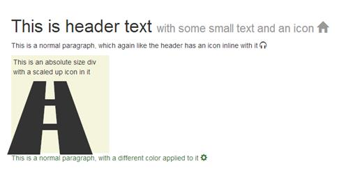

图 25:代码示例 32 产生的输出

可用的图标太多了，这里无法一一列举，但是如果你去[http://getbootstrap.com/components/#glyphicons-how-to-use](http://getbootstrap.com/components/#glyphicons-how-to-use)，你会发现一个完整的网格，里面有获得你需要的图标所需的所有类名。

图标在您添加到的任何容器中都可以正常工作，并且它们也尊重大小调整类。因此，例如，如果您在附加有`btn-lg`类的`<button>`元素中添加一个，图标将根据需要缩放以匹配按钮大小。

## 按钮变化

从组件角度来看，对 BS3 中按钮的更改非常少。有一些新的类和推荐，以及对它们的外观和感觉的一些改变，如前所述，但是除此之外，您在 BS2 中所做的一切应该仍然像预期的那样工作。

从组件的角度来看，`btn-group`和`btn-toolbar`类仍然是相同的，但是现在建议您尽可能确保使用`btn-group`对按钮进行分组。此外，在标记工具栏时，你应该尽量确保你有一个角色`toolbar`应用于它们，以帮助屏幕阅读器和其他设备。

有一件事你需要注意:由于 BS3 处理按钮组的方式发生了变化，如果你在按钮上使用工具提示或弹出窗口，你现在必须在创建工具提示或弹出窗口时添加选项`container:body`。然而，容器不必是`body`；它可以是嵌套 pop ver/tooltip/按钮排列的任何容器。容器需要在那里；不幸的是，这意味着您现在别无选择，只能使用 JavaScript 创建弹出窗口和工具提示。

与其他新的规模调整类一致的是新的`btn-group-lg`、`btn-group-sm`和`btn-group-xs`。与其他尺寸类别一样，没有`btn-group-md`，因为中等是默认尺寸，没有添加额外的造型。

下面的代码显示了按钮分组、工具栏和不同大小的基本示例。

代码示例 33:简单按钮组、工具栏和组大小示例

```html
          <div class="btn-toolbar" role="toolbar">
            <div class="btn-group btn-group-lg">
              <button type="button" class="btn btn-default">Left</button>
              <button type="button" class="btn btn-default">Middle</button>
              <button type="button" class="btn btn-default">Right</button>
            </div>
            <div class="btn-group">
              <button type="button" class="btn btn-primary">Left</button>
              <button type="button" class="btn btn-primary">Middle</button>
              <button type="button" class="btn btn-primary">Right</button>
            </div>
            <div class="btn-group btn-group-sm">
              <button type="button" class="btn btn-success">Left</button>
              <button type="button" class="btn btn-success">Middle</button>
              <button type="button" class="btn btn-success">Right</button>
            </div>
            <div class="btn-group btn-group-xs">
              <button type="button" class="btn btn-warning">Left</button>
              <button type="button" class="btn btn-warning">Middle</button>
              <button type="button" class="btn btn-warning">Right</button>
            </div>
          </div>

```


图 26:代码示例 33 生成的输出

按钮嵌套仍然以与 BS2 中相同的方式执行，因此允许您在普通按钮组中添加下拉按钮菜单，如下代码所示(但是请记住，这是 JavaScript 功能，因此您需要确保包含 JQuery 以及 BS3 JS 文件):

代码示例 34:嵌套按钮

```html
          <div class="btn-group">
            <button type="button" class="btn btn-default">Left</button>
            <button type="button" class="btn btn-default">Middle</button>

            <div class="btn-group">
              <button type="button" class="btn btn-primary dropdown-toggle" data-toggle="dropdown">
                Right
                <span class="caret"></span>
              </button>
              <ul class="dropdown-menu">
                <li><a href="#">Menu Link 1</a></li>
                <li><a href="#">Menu Link 2</a></li>
              </ul>
            </div>
          </div>

```

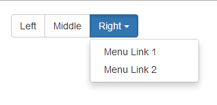

图 27:代码示例 34 生成的输出

请注意，在最后一个代码示例中，我更改了下拉按钮的按钮颜色；为了实现这一点，您所需要做的就是在各个按钮的类上添加单独的按钮颜色。这适用于所有按钮组和工具栏，而不仅仅是嵌套它们，这意味着您可以根据自己的使用情况改变组中按钮的颜色。

用于按钮布局的两个新类是`btn-group-vertical`和`btn-group-justified`类。

在 BS2 中，很难垂直堆叠按钮，或者让它们占据可用空间的全部宽度，同时保持大小平衡。BS3 中的这两个新类解决了这两种棘手的情况。但是，请注意，为了使对齐的组正确工作，您需要用比您预期的多一点的标记来标记按钮组。

下一个代码示例显示了如何使用垂直组:

代码示例 35:垂直按钮组

```html
          <div class="btn-group-vertical btn-group-lg">
            <button type="button" class="btn btn-default">Top</button>
            <button type="button" class="btn btn-default">Middle</button>
            <button type="button" class="btn btn-default">Bottom</button>
          </div>
          <div class="btn-group-vertical">
            <button type="button" class="btn btn-primary">Top</button>
            <button type="button" class="btn btn-primary">Middle</button>
            <button type="button" class="btn btn-primary">Bottom</button>
          </div>
          <div class="btn-group-vertical btn-group-sm">
            <button type="button" class="btn btn-success">Top</button>
            <button type="button" class="btn btn-success">Middle</button>
            <button type="button" class="btn btn-success">Bottom</button>
          </div>
          <div class="btn-group-vertical btn-group-xs">
            <button type="button" class="btn btn-warning">Top</button>
            <button type="button" class="btn btn-warning">Middle</button>
            <button type="button" class="btn btn-warning">Bottom</button>
          </div>

```

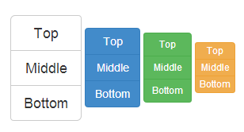

图 28:代码示例 35 产生的输出

正如我刚才指出的，标记调整类要稍微复杂一些，但是有必要消除一些仍然存在的浏览器不一致。如果您使用下面代码中显示的模式来标记您的对齐组，那么您应该会发现这些不一致都不会给您带来问题:

代码示例 36: BS3 对齐按钮示例

```html
          <div class="btn-group btn-group-justified" style="padding-top: 4px;">
              <div class="btn-group">
              <button type="button" class="btn btn-default">Left</button>
            </div>
            <div class="btn-group">
              <button type="button" class="btn btn-default">Middle</button>
            </div>
            <div class="btn-group">
              <button type="button" class="btn btn-default">Right</button>
            </div>
          </div>
          <div class="btn-group btn-group-justified" style="padding-top: 4px;">
            <div class="btn-group">
              <button type="button" class="btn btn-primary">Left</button>
            </div>
            <div class="btn-group">
              <button type="button" class="btn btn-primary">Middle 1</button>
            </div>
            <div class="btn-group">
              <button type="button" class="btn btn-primary">Middle 2</button>
            </div>
            <div class="btn-group">
              <button type="button" class="btn btn-primary">Right</button>
            </div>
          </div>
          <div class="btn-group btn-group-justified" style="padding-top: 4px;">
            <div class="btn-group">
              <button type="button" class="btn btn-success">Left</button>
            </div>
            <div class="btn-group">
              <button type="button" class="btn btn-success">Middle 1</button>
            </div>
            <div class="btn-group">
              <button type="button" class="btn btn-success">Middle 2</button>
            </div>
            <div class="btn-group">
              <button type="button" class="btn btn-success">Middle 3</button>
            </div>
            <div class="btn-group">
              <button type="button" class="btn btn-success">Middle 4</button>
            </div>
            <div class="btn-group">
              <button type="button" class="btn btn-success">Right</button>
            </div>
          </div>

```

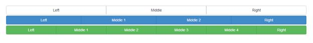

图 29:样本 36 产生的输出

标记的黄金法则是每个单独的按钮都必须包装在自己的`<div>`中，并应用一个`btn-group`类。然后，这些单个组中的每一个都需要被包裹在一个外部的`div`中，这个外部的`btn-group`和`btn-group-justified`都被应用到它上面。

如果您使用的是对齐组，有一点需要注意:因为按钮是作为块元素呈现的，所以按钮组大小类不会像预期的那样工作。这不应该真的令人惊讶，因为它们也不会在添加了`btn-block-level`类的单个按钮上工作，就像使用块标记和样式化的内联元素通常不能被流畅地控制一样。

如果你的按钮是由`<a>`标签组成的，那么你不需要所有这些额外的标记——你只需要添加了`btn-group-justified`类的外部`div`，以及里面的常规按钮。

带有菜单的下拉按钮仍然以与 BS2 中完全相同的方式创建。首先，创建一个应用了`btn-group`类的外部`<div>`。紧接着，您创建了一组应用于它的常规按钮样式类，以及一个名为`dropdown-toggle`的类和一个名为`toggle`的`data`属性，值为`dropdown`。紧接在按钮元素之后，但是在您关闭组`<div>`之前，然后您使用一个标准的无序列表定义实际的菜单，其中有一个类`dropdown-menu`和一个应用于它的角色或菜单。

|  | 注意:HTML 5 规范给表带来的新特性之一是所谓的数据属性。BS3(就此而言，BS2)在许多不同的地方使用这些属性来允许元素和 JavaScript 函数结合在一起，而开发人员不必编写一行 JavaScript。数据属性总是采用`data-name`的形式，其中名称是开发人员希望分配给该属性的名称。使用`data-`确保您定义的属性永远不会干扰 WHATWG 标准主体添加到规范中的任何内容，从而为开发人员提供他们希望使用它们的最大灵活性。在大多数情况下，这些数据属性以 BS3 使用它们的方式使用:为了将信息从元素传递到处理它的 JavaScript 例程中。它们可以用来传入标识名、选项、大小参数和许多其他东西，这意味着您通常不需要在应用程序中编写任何样板代码。在本章中，您将了解到更多这样的数据属性。 |

为了让下拉按钮工作，您必须将下拉 JavaScript 插件添加到您的 BS3 构建中。如果你刚刚下载了默认设置，那么这不成问题，因为`dropdown.js`已经是主`bootstrap.js`文件的一部分了。如果您已经完成了一个定制的构建，或者甚至自己编译了 Less 源代码，那么您需要确保它存在。

下面的代码显示了一个基本的下拉按钮示例:

代码示例 37:下拉按钮示例

```html
          <div class="btn-group">
            <button type="button" class="btn btn-success dropdown-toggle" data-toggle="dropdown">
              A dropdown button <span class="caret"></span>
            </button>
            <ul class="dropdown-menu" role="menu">
              <li><a href="#">1st Link</a></li>
              <li><a href="#">2nd Link</a></li>
              <li><a href="#">3rd Link</a></li>
              <li class="divider"></li>
              <li><a href="#">1st Link after divider</a></li>
            </ul>
          </div>

```


图 30:代码示例 37 生成的输出

通过对代码示例 37 进行简单的修改，您可以轻松地将按钮变成一个拆分的下拉菜单，其中按钮的操作本身仍然是单个操作，但仍然允许在单击插入符号时出现菜单。

为此，只需在 button 元素之前添加另一个 button 元素，然后将文本(但不是插入符号)从(现在的)第二个按钮移动到第一个按钮，这样新的 button 标记看起来如下:

```html
          <button type="button" class="btn btn-success">A dropdown button
              <button type="button" class="btn btn-success dropdown-toggle" data-toggle="dropdown">
                  <span class="caret"></span>
              </button>
               <ul class="dropdown-menu" role="menu">
                 <li><a href="#">1st Link</a></li>
                 <li><a href="#">2nd Link</a></li>
                 <li><a href="#">3rd Link</a></li>
                 <li class="divider"></li>
                 <li><a href="#">1st Link after divider</a></li>
               </ul>
          </button>

```

如果随后在浏览器中重新呈现输出，您应该会看到以下内容:


图 31:代码样本 37 修改后生成的输出

要生成拆分下拉菜单

在继续之前，最后要提到的是尺寸和下拉变化。

上浆简单；CSS 一章中提到的大小调整类在下拉按钮上的工作正如预期的那样，与它们在普通按钮上的工作方式完全相同(`lg`代表大按钮，没有`md`，因为默认为中按钮，`sm`代表小按钮，`xs`代表超小按钮)。

`Drop-up`是一个类名，在构造下拉或拆分下拉按钮时，您可以使用`btn-group`类将其应用于外部元素，顾名思义，这将导致菜单向上弹出，而不是向下弹出。

下拉菜单的最后一个注意事项

下拉菜单并不仅仅附加在按钮上——可以使用任何可以包装在外部父元素中的元素。

您可以将一类`dropdown`应用到具有`toggle`的`data`属性和`dropdown`值的包装元素，这将导致该元素成为下拉菜单显示的触发器。

## 输入组更改

简而言之，BS2 和 BS3 之间的输入组功能没有变化。

输入组仍然和以前一样标记，但有相同的注意事项，即:

不能在一侧添加多个附加物，每端只能添加一个附加物。

不支持一个输入组中的多个元素。

您不能将输入组与其他组件混合；你必须让它们筑巢。

如果您附加工具提示和弹出窗口，您必须添加一个容器选项，正如前面在按钮更改中提到的

在可能的情况下，避免使用带有选择列表的输入组，尤其是在针对基于 WebKit 的浏览器时

要创建输入组，只需将您的输入控件及其[pre | suf]修复(通常为`<span>`)包装在`<div>`或其他应用了类类型`input-group`的块级元素中。接下来，确保附加的`<span>`应用了`input-group-addon`类。

例如，下面的代码将为 Twitter 句柄创建一个输入框，并在没有输入小数部分的地方为货币创建一个输入框。

代码示例 38:使用输入组的 BS3 输入插件

```html
          <div class="input-group">
            <span class="input-group-addon">@</span>
            <input type="text" class="form-control" placeholder="Username">
          </div>
          <br/>
          <div class="input-group">
            <input type="text" class="form-control">
            <span class="input-group-addon">.00</span>
          </div>

```

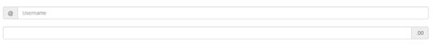

图 32:代码示例 38 产生的输出

正常的大小调整类也适用于这些，就像它们适用于其他表单输入一样，因此向外部输入组添加`input-group-lg`和`input-group-sm`(同样，没有`md`)将相应地调整整个控件集的大小。

有一件事在 BS3 中并不新鲜，但已经变得更容易做到，那就是在输入组中添加复选框、单选按钮、常规按钮和下拉菜单。

这些选项中的每一个都需要比使用常规`<span>`时多一点的标记，但结果是您可以为字段添加交互性。例如，您可以使用这些输入来创建自己的文件上传控件，或者创建随机密码的按钮。

下面的代码显示了如何实现这一点:

代码示例 39:使用按钮和收音机的输入组

```html
          <div class="input-group">
            <span class="input-group-addon">
              <input type="checkbox"> Keep Email Private
            </span>
            <input type="email" class="form-control" placeholder="Please enter email address">
          </div>
          <br/>
          <div class="input-group">
            <span class="input-group-addon">
              <input type="radio"> Make Default
            </span>
            <input type="text" class="form-control" placeholder="Enter an address here">
          </div>
          <br/>
          <div class="input-group">
            <span class="input-group-btn">
              <button class="btn btn-default" type="button">Check User Name</button>
            </span>
            <input type="text" class="form-control" placeholder="Please enter a user name here">
          </div>
          <br/>
          <div class="input-group">
            <input type="text" class="form-control" placeholder="Enter the password you would like to use">
            <span class="input-group-btn">
              <button class="btn btn-success" type="button">Create Random Password</button>
            </span>
          </div>

```


图 33:代码示例 39 产生的输出

## 导航变化

导航组件也有自己的变化，但与其他组非常相似，这主要是为了将常见的类名联系在一起，并基本上整理东西，使它们更有意义。

谈到导航组件，有两个主要部分:基本导航和导航条。在这两个组件中，导航条变化最大。

首先，在 BS2 中，你真正拥有的只是导航条；没有按钮类或文本类，只有品牌标签。这在开发人员中导致了许多困惑和问题，例如“我如何在导航条中集中排列文本？”以及“如何阻止我的按钮增加导航条的高度？”

BS3 现在已经引入了许多专门为这类场景设计的新类，我们将很快介绍这些类。但是首先，让我们看看基本导航组件有什么不同。

### 基本导航

首先:BS2 中的导航列表组件不见了。不仅被弃用，而且被带走再也不会被看到——这是一件好事。

虽然它很容易使用(您创建了一个无序列表，添加了一些Bootstrap魔法，并且可以使用)，但它很混乱，不能在所有浏览器中一致工作，并且有一些渲染问题。

我们在它的位置上有什么？

我们有*列表组*，后面会详细介绍。现在，让我们谈谈剩下的内容，因为它将为稍后使用列表组奠定基础。

那么基类是什么呢？你可能会惊讶地发现，这只是一个名为`nav`的类，它与`nav-tabs`、`nav-pills`和`nav-stacked`一起，可以像你在 BS2 中制作`nav`列表一样，用来制作标签、药丸和基于边栏的导航结构。

标记现在简单多了。您不需要担心任何额外的填充或浏览器怪癖，也不需要任何定制的东西来完成工作。

要使用标签，只需取一个无序列表，添加一个`nav`和`nav-tabs`类，如下代码所示:

代码示例 40:基于选项卡的导航

```html
          <ul class="nav nav-tabs">
            <li class="active"><a href="#">Home</a></li>
            <li><a href="#">Profile</a></li>
            <li><a href="#">Messages</a></li>
          </ul>

```


图 34:代码示例 40 产生的输出

现在需要的标记只不过是一些`<li>`元素；唯一需要应用类的地方是在外部`<ul>`本身。您还会看到，我们在列表中的第一个`<li>`上有一个`active`类，向我们显示哪个标签是活动标签。

如果您希望 BS3 提供整个选项卡的体验(也就是说，根据需要实际更改内容)，那么您还需要做更多的工作。为此，正如我们将在 JavaScript 部分看到的，您需要使用一个 JavaScript 加载项。然而，如果你想自己处理标签切换和内容，你所需要做的就是将活动类从一个`<li>`移动到下一个。

药丸并不会让事情变得更复杂:只需将代码示例 40 中的`nav-tabs`替换为`nav-pills`，您应该会看到您的输出更改为:


图 35:当更改为“药丸”模式时，代码示例 40 的输出

如果我们将`nav-stacked`添加到其中的任何一个，我们的导航将整齐地一个叠在另一个上面:

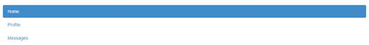

图 36:代码示例 40，更改为“药丸”模式，并添加了导航堆栈

与框架中的大多数其他组件和更改一样，输出现在呈现为占据所有可用空间的块元素。同样，您只需要使用网格系统和其他可用的类来确保它只占用您需要的空间。现在，任何因屏幕分辨率不同而改变大小的父容器都将根据需要相应地调整其子元素的大小。

顺便说一下，这也适用于选项卡式导航，但输出很可能不是您所期望的:


图 37:代码示例 40，呈现为堆叠选项卡

公平地说，虽然它并不是真的被设计成那样工作的:标签通常从左到右运行，虽然 BS2 确实有一些用于在元素的侧面和底部放置标签的类，但是这些类已经在 BS3 中被移除了。用于生成完整的、基于选项卡的输出的 JavaScript 插件仍然能够定位选项卡，但是常规导航不再能够。

与按钮组件中所做的更改一样，导航辅助工具现在也添加了一个新的对齐类，称为`nav-justified`，就像按钮版本一样，它将导致一个导航类跨越容器的整个宽度，给每个兄弟提供相同的大小。

如果我们取样本 40 中的代码并将`nav-justified`添加到已经存在的两个类中，我们会得到以下结果:


图 38:应用全宽调整的代码示例 40 中的导航选项卡

导航辅助工具与按钮类和组件有另一个共同点:基于状态的更改，用于显示给定的状态，以及获取下拉菜单和子导航的能力。

只需在导航设置内的`<li>`中添加一个类`disabled`，就会禁用并模糊与`muted-text`外观的链接。但是请记住，它实际上并没有禁用链接——链接仍然是可点击的，并且由您来编写代码，以便链接不会做出反应。

要向任何基于药丸或标签的导航项目添加下拉菜单，只需使用与按钮部分所示相同的布局和类别。将一个`<a>`嵌套在一个`<li>`中，然后是另一个`<ul>`，用适当的类和数据属性使其工作。

在基本导航和导航栏之间有一点交叉，我们也有面包屑和页面/分页导航帮助。

面包屑通常用于标记您在网站层次结构中的位置，正如我们在上面看到的，使用它们只是将它们添加到无序列表中的一种情况，如下代码所示:

代码示例 41: BS3 面包屑导航示例

```html
          <ul class="breadcrumb">
            <li><a href="#">Home</a></li>
            <li><a href="#">Library</a></li>
            <li class="active">Data</li>
          </ul>

```


图 39:代码示例 41 产生的输出

在我们进入完整导航栏之前，最后一个控件是分页控件。这些控件将大量繁重的工作从排列一个带有上一个/下一个和前一个/后一个以及中间一系列数字的条块中解脱出来。

通常用于数据量很大的网站，并且希望一次显示一页记录，而不是一次显示所有记录的情况，分页栏既易于使用，又易于与输出的其余部分对齐。

与其他基本元素一样，创建分页栏就像向无序列表中添加适当的类一样简单，如下代码所示:

代码示例 42: BS3 分页栏

```html
          <ul class="pagination">
            <li><a href="#">&laquo;</a></li>
            <li><a href="#">1</a></li>
            <li><a href="#">2</a></li>
            <li><a href="#">3</a></li>
            <li><a href="#">4</a></li>
            <li><a href="#">5</a></li>
            <li><a href="#">&raquo;</a></li>
          </ul>

```


图 40:代码示例 42 产生的输出

就像其他基本的导航工具一样，在列表中的单个`<li>`元素上应用`active`和`disabled`类可以使你将链接标记为禁用和选中。

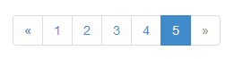

图 41:添加了活动类和禁用类的代码示例 42 产生的输出

使用新的调整大小选项，分页控件可以像其他控件一样轻松地调整大小，与其他控件一样，它们现在都遵循相同的命名方案:`pagination-lg`和`pagination-sm`。和其他一些人一样，没有`pagination-xs`，也没有暗示应该有一个；同样，也没有`-md`大小，因为默认为中等。

要使用分页控件，只需在保存列表的父级`<ul>`上的分页类旁边添加适当的大小调整类，如下代码所示:

代码示例 43:为分页组件使用不同的大小

```html
          <ul class="pagination pagination-lg">
            <li><a href="#">&laquo;</a></li>
            <li><a href="#">1</a></li>
            <li><a href="#">2</a></li>
            <li><a href="#">3</a></li>
            <li><a href="#">4</a></li>
            <li class="active"><a href="#">5</a></li>
            <li class="disabled"><a href="#">&raquo;</a></li>
          </ul>
          <br/>
          <ul class="pagination">
            <li><a href="#">&laquo;</a></li>
            <li><a href="#">1</a></li>
            <li><a href="#">2</a></li>
            <li><a href="#">3</a></li>
            <li><a href="#">4</a></li>
            <li class="active"><a href="#">5</a></li>
            <li class="disabled"><a href="#">&raquo;</a></li>
          </ul>
          <br/>
          <ul class="pagination pagination-sm">
            <li><a href="#">&laquo;</a></li>
            <li><a href="#">1</a></li>
            <li><a href="#">2</a></li>
            <li><a href="#">3</a></li>
            <li><a href="#">4</a></li>
            <li class="active"><a href="#">5</a></li>
            <li class="disabled"><a href="#">&raquo;</a></li>
          </ul>

```

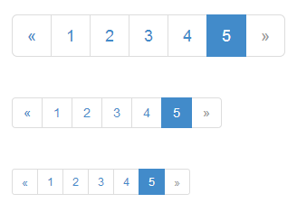

图 42:代码示例 43 产生的输出

分页类还有最后一个锦囊妙计——生成上一页和下一页按钮。

你会看到，在许多维基或博客风格的网站中，页面的底部通常有一个旧/新或上一个/下一个按钮对。

要使其成为默认版本，只需创建一个`<ul>`，就像我们在本节中所做的那样，并向其中添加一个类`pager`，如下所示:

代码示例 44:简单的 BS3 寻呼机

```html
          <ul class="pager">
            <li><a href="#">Previous</a></li>
            <li><a href="#">Next</a></li>
          </ul>

```

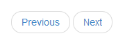

图 43:代码示例 44 的输出

寻呼机会自动将其按钮放在可用空间的中心，如图 44 所示，但是您也可以通过向内部的`<li>`元素添加`previous`和`next`类来左右调整它们。

如果您更改代码示例 44，使按住上一个按钮的`<li>`具有指定的`previous`类，按住下一个按钮的`<li>`具有`next`类，然后重新呈现输出，您应该会看到您的浏览器更改为以下内容:

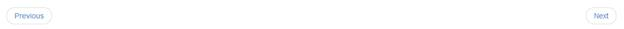

图 44:应用可选`previous`和`next`类的代码示例 44

您将再次看到，输出会响应性地扩展以填满所有可用空间，并且像以前一样，您可以根据需要使用网格、跨度和其他容器轻松控制这一点。

### 导航条导航

如果说有一件事是 BS3 比我见过的其他框架做得更好的，那就是导航栏。无论是下拉菜单、带有登录/退出控件的标题，还是仅仅是一个装饰，不可否认 Bootstrap 中的导航栏功能强大。

不幸的是，在 BS2 中有相当多的欠缺。发布了许多允许排列东西的黑客，但是使用的一些 CSS 边缘有点粗糙。BS3 改变了这一切。

基本导航栏现在作为页面显示中的折叠项目开始使用。这意味着，如果第一个显示在移动设备上，您的设计将从一个很好折叠的菜单栏开始，准备好完全按照移动用户的期望展开。在 BS2 中，情况正好相反，您必须采取额外的步骤来折叠显示屏，然后才能使其可见。

随着显示宽度的增加，导航栏将逐渐变得可见，直到整个单元有足够的空间在页面上水平呈现。

不过要小心——即使非流体的列宽为 1024px，整个显示器的流体宽度也是如此，但仍有可能耗尽空间。当这种情况发生时，您可能会遇到一些主要的内容溢出情况。例如，在高度上将导航条推高两行或多行并不难。

确保这种情况不会发生的建议方法是使用自定义样式来控制元素的宽度，和/或使用响应可见性类来控制不同屏幕大小显示和不显示的内容。

如果你正在使用 Less，你现在也可以自定义`@grid-float-breakpoint`变量来控制你的导航栏折叠的触发点，或者你可以在基本 CSS 中自定义合适的媒体查询。

导航栏需要启用 JavaScript 才能正常工作；如果没有启用，该栏应该仍然显示，但折叠将无法正常工作。您还需要确保，如果您已经完成了自定义构建，那么您也已经包含了折叠的 JavaScript 插件。

下面的代码示例演示如何创建一个基本的空的、可折叠的导航栏:

代码示例 45:简单的空 BS3 可折叠导航栏

```html
          <nav class="navbar navbar-default" role="navigation">
            <div class="container-fluid">
              <div class="navbar-header">
                <button type="button" class="navbar-toggle" data-toggle="collapse" data-target="#bs-example-navbar-collapse-1">
                  <span class="sr-only">Toggle navigation</span>
                  <span class="icon-bar"></span>
                  <span class="icon-bar"></span>
                  <span class="icon-bar"></span>
                </button>
              </div>
              <div class="collapse navbar-collapse" id="bs-example-navbar-collapse-1">
              </div><!-- /.navbar-collapse -->
            </div><!-- /.container-fluid -->
          </nav>

```

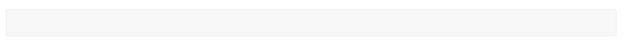

图 45:代码示例 45 产生的空白导航条

它看起来可能不多，但这个栏会根据不同大小的需要折叠和扩展，我们现在需要做的就是给它添加一些内容。让我们从品牌开始。

如果您打算在`<a>`链接上使用`navbar-brand`类来标记您的导航，那么 BS3 的最佳实践是将这个元素与构建三线折叠图标的`navbar-toggle`元素分组。这确保了在折叠时，文本在变得不可见并垂直堆叠之前尽可能地向下收缩。

要进行此更改，在代码示例 45 中，只需添加:

```html
          <a class="navbar-brand" href="#">BS3</a>

```

紧接在持有三个`<span>`元素的`icon-bar`类的关闭按钮标签之后，然后刷新你的浏览器。结果现在应该是这样的:


图 46:添加了品牌的空白导航条

如果你将鼠标悬停在品牌文本上，你会发现它也是一个活跃的链接，通常用于返回网站的主页。你也可以在这里放一个图片，但是这里没有具体的类可以帮助你。我已经在一些设计中这样做了，但不幸的是，它仍然需要一些手动工作。如果你把图像做成和`<H1>`元素差不多高，事物就会很好地排列在一起。否则，我发现最好的方法是在包含乐队名称的元素前面放一些填充，然后用合适的底部边距/填充绝对定位您的徽标，这样它就不会隐藏下面的任何内容。

从品牌类开始，我们还有表单、按钮和文本的特定类，如下所示:

`navbar-nav`:用于创建导航链接和下拉菜单的主`<ul>`

`navbar-form`:用于创建内嵌微型表单

`navbar-btn`:用于标记按钮组件，使其对导航条友好

`navbar-text`:用于在你的栏中包含独立的文本行

`navbar-link`:用于添加不属于常规导航项目的独立链接

您可以根据需要单独使用它们，也可以将它们与新出现的 web 组件规范结合起来，创建一个单独的栏，根据需要进行配置并绘制所需内容。

下面的代码示例扩展了示例 45，以包括一些导航链接:

代码示例 46:前面的示例扩展到包括基本链接

```html
          <nav class="navbar navbar-default" role="navigation">
            <div class="container-fluid">
              <div class="navbar-header">
                <button type="button" class="navbar-toggle" data-toggle="collapse" data-target="#bs-example-navbar-collapse-1">
                  <span class="sr-only">Toggle navigation</span>
                  <span class="icon-bar"></span>
                  <span class="icon-bar"></span>
                  <span class="icon-bar"></span>
                </button>
                <a class="navbar-brand" href="#">BS3</a>
              </div>

              <div class="collapse navbar-collapse" id="bs-example-navbar-collapse-1">
                <ul class="nav navbar-nav">
                  <li class="active"><a href="#">Menu 1</a></li>
                  <li><a href="#">Menu 2</a></li>
                </ul>
              </div><!-- /.navbar-collapse -->
            </div><!-- /.container-fluid -->
          </nav>

```


图 47:代码示例 46 产生的输出

与所有其他导航、链接类和元素一样，您会看到我们使用了`active`类来将第一个链接标记为活动的，并且像其他链接一样，您可以根据需要应用`disabled`和其他类似的类来标记项目。

创建一个从任何按钮向下扩展的菜单也同样容易。您所要做的就是使用与在按钮上创建下拉菜单时相同的标记模式，除了您将其包装在一个`navbar-nav`父元素中，如下所示:

代码示例 47:扩展导航栏以容纳下拉菜单按钮

```html
          <nav class="navbar navbar-default" role="navigation">
            <div class="container-fluid">
              <div class="navbar-header">
                <button type="button" class="navbar-toggle" data-toggle="collapse" data-target="#bs-example-navbar-collapse-1">
                  <span class="sr-only">Toggle navigation</span>
                  <span class="icon-bar"></span>
                  <span class="icon-bar"></span>
                  <span class="icon-bar"></span>
                </button>
                <a class="navbar-brand" href="#">BS3</a>
              </div>
              <div class="collapse navbar-collapse" id="bs-example-navbar-collapse-1">
                <ul class="nav navbar-nav">
                  <li class="dropdown">
                    <a href="#" class="dropdown-toggle" data-toggle="dropdown">Menu 1 <b class="caret"></b></a>
                    <ul class="dropdown-menu">
                      <li><a href="#">Sub Menu 1</a></li>
                      <li><a href="#">Sub Menu 2</a></li>
                      <li><a href="#">Sub Menu 3</a></li>
                      <li class="divider"></li>
                      <li><a href="#">Sub Menu 4</a></li>
                      <li class="divider"></li>
                      <li><a href="#">Sub Menu 5</a></li>
                    </ul>
                  </li>
                </ul>
              </div><!-- /.navbar-collapse -->
            </div><!-- /.container-fluid -->
          </nav>

```

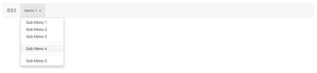

图 48:由代码示例 47 生成的下拉菜单

您可以将其中的每一个结合起来，因此只需根据需要标记每个`<li>`元素，就可以在一个`navbar-nav` `<ul>`中拥有下拉和非下拉链接。

导航栏中的另一个常见要求是强制登录表单，通常用于登录网站上的受保护区域。

BS3 使得使用`navbar-form`类构建这些表单更加容易。到目前为止，我们已经看到我们所有的元素都在导航栏的内部内容区域左对齐。由于登录表单通常是右对齐的，所以 BS3 团队提供了`navbar-right`类来允许您做这样的事情。下面的代码说明了一个示例:

代码示例 48:登录表单右对齐的 BS3 导航栏

```html
          <nav class="navbar navbar-default" role="navigation">
            <div class="container-fluid">
              <div class="navbar-header">
                <button type="button" class="navbar-toggle" data-toggle="collapse" data-target="#bs-example-navbar-collapse-1">
                  <span class="sr-only">Toggle navigation</span>
                  <span class="icon-bar"></span>
                  <span class="icon-bar"></span>
                  <span class="icon-bar"></span>
                </button>
                <a class="navbar-brand" href="#">BS3</a>
              </div>
              <div class="collapse navbar-collapse" id="bs-example-navbar-collapse-1">

                 <form class="navbar-form navbar-right">
                        <div class="form-group">
                               <input type="text" class="form-control" placeholder="Sign-in name">
                        </div>
                        <div class="form-group">
                               <input type="password" class="form-control" placeholder="Password">
                        </div>
                        <button type="submit" class="btn btn-default">Sign In</button>
                 </form>

              </div>
            </div>
          </nav>

```


图 49:带有登录表单的导航栏，由代码示例 48 生成

同样，当一个人登录到您的应用程序时，通常还需要显示他们的姓名，而不是表单，还需要一个链接和/或按钮来注销或更改选项。

按钮、文本和链接类涵盖了所有这些，如以下代码所示:

代码示例 49:用信息显示替换登录表单

```html
          <nav class="navbar navbar-default" role="navigation">
            <div class="container-fluid">
              <div class="navbar-header">
                <button type="button" class="navbar-toggle" data-toggle="collapse" data-target="#bs-example-navbar-collapse-1">
                  <span class="sr-only">Toggle navigation</span>
                  <span class="icon-bar"></span>
                  <span class="icon-bar"></span>
                  <span class="icon-bar"></span>
                </button>
                <a class="navbar-brand" href="#">BS3</a>
              </div>
              <div class="collapse navbar-collapse" id="bs-example-navbar-collapse-1">
                <div class="navbar-right">
                  <p class="navbar-text">Signed in as <strong>Peter Shaw</strong></p>
                  <a href='#' class="navbar-link">Options</a>&nbsp;&nbsp;
                  <button class="btn btn-primary navbar-btn">Sign Out</button>
                </div>
              </div>
            </div>
          </nav>

```


图 50:带有代码示例 49 产生的信息显示的导航栏

导航栏本身也有一些巧妙的小技巧，你可以把你的导航栏放在一个`container`或者其他对齐类里面，然后加上`navbar-fixed-top`，你的导航栏就会贴在它的容器顶部，并且和它完美对齐，如下图所示:


图 51:示例 49 中的导航栏，应用了`navbar-fixed-top`类

您还可以添加`navbar-fixed-bottom`类，它会将您的导航栏粘贴到页面的底部，以及`navbar-static-top`类，它会将导航栏粘贴到容器的顶部，但允许它随着页面内容滚动。

最后，如果您想要一个变暗的导航栏，那么您可以使用`navbar-inverse`类，它将反转整个组件使用的颜色集:


图 52:样本 49 中带有`inverse`类集的导航条

## 标签和徽章更改

这将是一个非常短的部分，因为标签只有两个变化，徽章有一个大的变化。

为了在 BS2 中制作一个标签，我们简单地给了它一个`label-xxxx`类名，其中`xxxx`代表标签要描绘的状态。在 BS3 下，我们现在有一个由两部分组成的类定义，以及一个从`error`到`danger`的红色类的重命名，所以命名现在匹配其他所有的东西，差不多就是这样。

BS3 中也没有针对这些的尺寸分类/选项，因为标签采用周围容器的尺寸。所以，如果你用一个合适的标签类创建一个`<span>`，然后把它包装在一个`<H1>`中，那么这个标签的大小会比其他标签大很多。

下面的代码示例演示了这一点:

代码示例 50:不同尺寸的 BS3 标签示例

```html

          <h1><span class="label label-default">Default</span></h1>
          <h2><span class="label label-primary">Primary</span></h2>
          <h3><span class="label label-success">Success</span></h3>
          <h4><span class="label label-info">Info</span></h4>
          <h5><span class="label label-warning">Warning</span></h5>
          <h6><span class="label label-danger">Danger</span></h6>

```


图 53:代码示例 50 产生的输出

另一方面，徽章经历了更大的变化。

在 BS3 中，徽章不再有上下文颜色类。也就是说，不再有`label-success`或`label-warning`，就像以前的标签和其他元素一样。

这意味着您不能像在 BS2 中一样给徽章着色，并且您创建的任何标签只能使用标准灰色渲染。至少官方上你不能。

如果您在用于标签的`<span>`上的`label`类旁边应用一个`alert-xxxxx`，那么该标签将采用该警报类的颜色，虽然这不是一种受支持的方式，但它确实有效，并允许您像在 BS2 中那样使用标签。

要标记一个标准标签，你只需要给一个`<span>`添加一个`label and 'label-default'`类，你就可以开始了:

代码示例 51:标准标签示例

```html
          <span class="label label-default">This is a label</span>

```


图 54:代码示例 51 产生的标签

如果您想修改标签以使用不同的颜色，那么您可以按如下方式操作:

代码示例 52:标签示例被黑客攻击使用非标准颜色

```html
          <span class="badge">Normal</span>
          <span class="badge alert-success">Success</span>
          <span class="badge alert-info">Info</span>
          <span class="badge alert-warning">Warning</span>
          <span class="badge alert-danger">Danger</span>

```

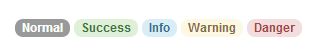

图 55:代码示例 52 产生的输出

然而，徽章组件仍然有一个很好的特性，那就是它使用了`empty:`伪选择器，如果它的内部文本是空的，它可以自动从显示中消失。这有助于设计用于列表组和药丸列表的内部更改，因为现在这意味着创建收件箱通知列表等东西非常容易，当`<span>`内容被移除时，这些值会消失。这里有一个例子:

代码示例 53:徽章的 BS3 列表样式

```html
          <div class="col-md-4">
            <ul class="nav nav-pills nav-stacked">
              <li class="active">
                <a href="#">
                  <span class="badge pull-right">42</span>
                  Inbox
                </a>
              </li>
              <li class="active">
                <a href="#">
                  <span class="badge pull-right">10000</span>
                  Spam
                </a>
              </li>
                <li class="active">
                <a href="#">
                  <span class="badge pull-right"></span>
                  Lottery Wins
                </a>
              </li>
            </ul>
          </div>

```


图 56:代码示例 53 产生的输出

如果您检查代码，您将看到列表中的最后一个选项在其 span 标签中没有值，由于`empty:`伪选择器，这导致浏览器不呈现它。然而，当你用 JavaScript 或者任何可以操作 DOM 的方法把任何东西放进去的时候，这个徽章就会立刻弹出来，一拍不漏。还要注意`pull-right`对齐类的使用，以确保标签位于元素的右侧，使一切看起来都很好并对齐。

## 列出组更改

列表组是 BS3 中添加的一个新东西，旨在取代 BS2 导航列表，并且比 BS2 导航列表具有更多的功能。

一旦你开始使用它们，你会意识到列表组更像是完全可样式化的列表框，老实说，创建一个完全可样式化的列表框所需要做的就是将它们包装在自己的`div`中，并设置溢出来适当地滚动。

基本列表组组件可以使用类似于以下内容的标记来创建:

代码示例 54:基本 BS3 列表组

```html
          <ul class="list-group">
            <li class="list-group-item">Cheese</li>
            <li class="list-group-item">Burger</li>
            <li class="list-group-item">Bun</li>
            <li class="list-group-item">Pickles</li>
            <li class="list-group-item">Tomato</li>
          </ul>

```


图 57:代码示例 54 产生的输出

正如您之前在徽章部分看到的，您可以将徽章添加到列表和其他对象中，如果您将它们添加到列表组中，它们会完美地排列在一起:

代码示例 55:附有徽章的列表组

```html
          <ul class="list-group">
            <li class="list-group-item"><span class="badge pull-right">4</span>Cheese</li>
            <li class="list-group-item"><span class="badge pull-right">2</span>Burger</li>
            <li class="list-group-item"><span class="badge pull-right">1</span>Bun</li>
            <li class="list-group-item"><span class="badge pull-right"></span>Pickles</li>
            <li class="list-group-item"><span class="badge pull-right">2</span>Tomato</li>
          </ul>

```


图 58:代码示例 55 的输出

你们中最善于观察的人可能会想，“好吧，所以列表组看起来不错，但表面下仍然有`<ul>`，它们真的没有什么特别的。”

嗯，也许你是对的……或者我们需要多做一些实验。

与我们在导航部分看到的类不同，列表组不能仅仅应用于无序列表。列表组可以应用于任何父容器，当这样做时，样式将导致该容器的所有子容器被链接。看看下面的例子:

代码示例 56:使用

```html
          <div class="list-group">
            <a class="list-group-item">Cheese</a>
            <a class="list-group-item">Burger</a>
            <a class="list-group-item">Bun</a>
            <a class="list-group-item">Pickles</a>
            <a class="list-group-item">Tomato</a>
          </div>

```

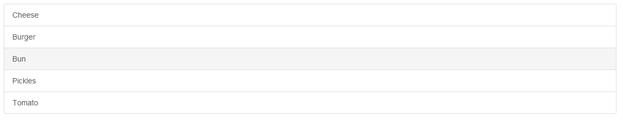

图 59:代码示例 56 产生的输出

如代码示例 56 所示，我们可以只使用列表周围的一个`<div>`来创建一个链接列表，然后该列表立即变成具有浅灰色悬停效果的列表样式菜单。然而，因为内部标签是`<a>`标签，我们现在可以更进一步:

代码示例 57:列表组扩展到不仅仅使用简单列表

```html
          <div class="list-group">
            <a class="list-group-item active">
              <strong>Cheese</strong>
              <p>A delicious slice of ...</p>
              
            </a>
            <a class="list-group-item">
              <strong>Burger</strong>
              <p>Prime Aberdeen angus beef ...</p>
              
            </a>
            <a class="list-group-item">
              <strong>Bun</strong>
              <p>A freshly baked soft sesame seed bun ...</p>
              
            </a>
            <a class="list-group-item">
              <strong>Pickles</strong>
              <p>The finest pickles from the finest purveyors ...</p>
              
            </a>
            <a class="list-group-item">
              <strong>Tomato</strong>
              <p>Fresh organic tomatoes picked directly from the vine ...</p>
              
            </a>
          </div>

```


图 60:代码示例 57 产生的输出

请注意，当您的鼠标悬停在链接上时，我们仍然会获得完整的单元格悬停效果，并且通过简单地添加`active`类，就像我们在其他示例中所做的那样，我们可以将一个项目标记为活动项目，同时保持一组边框和每个项目的外观就像一个常规的`<ul>`元素一样。

但是为什么就此打住呢？

就像 BS3 中的任何其他元素一样，列表组也有自己的上下文类来赋予它们在标准颜色集中的意义:

代码示例 58:带有上下文颜色类的 BS3 列表组

```html
          <div class="list-group">
            <a class="list-group-item list-group-item-success">
              <strong>Cheese</strong>
              <p>...</p>
              
            </a>
            <a class="list-group-item list-group-item-success">
              <strong>Burger</strong>
              <p>...</p>
              
            </a>
            <a class="list-group-item list-group-item-success">
              <strong>Bun</strong>
              <p>...</p>
              
            </a>
            <a class="list-group-item list-group-item-danger">
              <strong>Pickles</strong>
              <p>...</p>
              
            </a>
            <a class="list-group-item list-group-item-warning">
              <strong>Tomato</strong>
              <p>...</p>
              
            </a>
          </div>

```


图 61:代码示例 58 产生的输出

如你所见，没有奶酪和面包的汉堡有什么用？西红柿我可以拿也可以放，但是请不要放泡菜！

## 媒体对象和自定义缩略图更改

我们在 CSS 一章中讨论了样式的基本缩略图更改，但是我们没有涉及到周围组件的更改。

BS3 中现在存在的融合允许我们将缩略图类和网格类结合起来，创建易于使用的图像列表。我们可以使用它们的最基本方式是使用`row`类和网格跨度，以及基本的缩略图类，来制作完美排列的缩略图，如下所示:

代码示例 59:带有网格类的基本缩略图

```html
          <div class="row">
            <div class="col-md-3">
              <a href="#" class="thumbnail">
                
              </a>
            </div>
            <div class="col-md-3">
              <a href="#" class="thumbnail">
                
              </a>
            </div>
            <div class="col-md-3">
              <a href="#" class="thumbnail">
                
              </a>
            </div>
            <div class="col-md-3">
              <a href="#" class="thumbnail">
                
              </a>
            </div>
          </div>

```

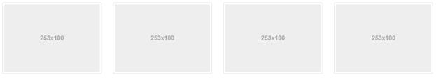

图 62:代码示例 59 生成的缩略图

对于想知道的人，我用 **holder.js** 制作图像占位符。我会让你在谷歌上搜索这个位置(它将作为第一个可用的位置出现)；这是一个很好的保留图像空间的工具，尤其是在为客户做实体模型的时候。

这个例子其实没什么特别的；如果你一直在读这本书的其余部分，你可能已经发现做到这一点有多容易。但是，如果我们添加更多的标记并使用相同的想法，我们可以很容易地生成如下内容:

代码示例 60:包含额外内容的 BS3 缩略图

```html
          <div class="row">
            <div class="col-md-3">
              <div class="thumbnail">
                
                <div class="caption">
                <h3>Ecstasy requires exploration</h3>
                <p>The planet is radiating pulses. This life is nothing short of a blossoming oasis of transformative potentiality outside of the being.</p>
                <p>
                    <a href="#" class="btn btn-success" role="button">Like</a>
                  <a href="#" class="btn btn-danger" role="button">Dislike</a>
                </p>
                </div>
              </div>
            </div>
            <div class="col-md-3">
              <div class="thumbnail">
                
                <div class="caption">
                <h3>We exist as frequencies</h3>
                <p>This life is nothing short of a blossoming uprising of frequency aspiration. Potential is the richness of conscious living, and of us.</p>
                <p>
                  <a href="#" class="btn btn-success" role="button">Like</a>
                  <a href="#" class="btn btn-danger" role="button">Dislike</a>
                </p>
                </div>
              </div>
            </div>
            <div class="col-md-3">
              <div class="thumbnail">
                
                <div class="caption">
                <h3>To traverse the myth is to become one</h3>
                <p>It can be difficult to know where to begin. The totality is calling to you via sub-atomic particles. Can you hear it?</p>
                 <p>
                  <a href="#" class="btn btn-success" role="button">Like</a>
                  <a href="#" class="btn btn-danger" role="button">Dislike</a>
                </p>
                </div>
              </div>
            </div>
            <div class="col-md-3">
              <div class="thumbnail">
                
                <div class="caption">
                <h3>We reflect, we heal, we are reborn</h3>
                <p>Through reiki, our essences are nurtured by purpose. You will soon be guided by a power deep within yourself.</p>
                <p>
                  <a href="#" class="btn btn-success" role="button">Like</a>
                  <a href="#" class="btn btn-danger" role="button">Dislike</a>
                </p>
                </div>
              </div>
            </div>
          </div>

```


图 63:代码样本 60 产生的输出

创建垂直列表同样简单，但是我们现在需要使用`media`对象类，而不是使用`thumbnail`类。这些类和相关的标记创建了一个类似于前面例子的布局，但是文本不是出现在缩略图下面，而是向右对齐。

这里的主要设计动机是带有头像图像的评论和消息列表，但是它们可以用于新闻项目、产品列表和许多其他东西。

要标记媒体对象，只需使用类别为`media`的外部`div`。然后，在其中，使用`media-object`、`media-body`和`media-heading`类来标记各个位，如下例所示:

代码示例 61:标记单个 BS3 媒体对象

```html
          <div class="media">
            <a class="pull-left" href="#">
              
            </a>
            <div class="media-body">
              <h4 class="media-heading">To follow the journey is to become one with it</h4>
              <p>The goal of ultrasonic energy is to plant the seeds of awareness rather than stagnation. You and I are beings of the quantum matrix. Purpose is a constant.</p>
            </div>
          </div>

```


图 64:代码示例 61 产生的媒体对象

正如您可能已经想象到的，将它们添加到一个列表组或使用 BS3 网格系统构建的其他结构中并不需要太多时间。BS3 实际上通过提供一个专用的媒体对象列表类和支持的标记使它变得更加容易。

只要稍微更改一下标记，就可以生成媒体对象的完整列表，如下所示:

代码示例 62:完整媒体对象列表

```html
          <ul class="media-list">
            <li class="media">
              <a class="pull-left" href="#">
                
              </a>
              <div class="media-body">
                <h4 class="media-heading">Humankind has nothing to lose</h4>
                <p>Awareness is the growth of synchronicity, and of us. This life is nothing short of an unfolding explosion of infinite truth. We exist as sonar energy.</p>
              </div>
            </li>
            <li class="media">
              <a class="pull-left" href="#">
                
              </a>
              <div class="media-body">
                <h4 class="media-heading">It is a sign of things to come</h4>
                <p>Humankind has nothing to lose. We are at a crossroads of rebirth and discontinuity. We are in the midst of a consciousness-expanding maturing of guidance that will clear a path toward the quantum soup itself.</p>
              </div>
            </li>
            <li class="media">
              <a class="pull-left" href="#">
                
              </a>
              <div class="media-body">
                <h4 class="media-heading">Only a traveller of the galaxy may generate this canopy of life</h4>
                <p>We must learn how to lead unified lives in the face of delusion. Eons from now, we warriors will reflect like never before as we are reborn by the quantum soup. We must beckon ourselves and fulfill others.</p>
              </div>
            </li>
          </ul>

```


图 65:代码示例 62 生成的完整媒体对象列表

如果您将`<li>`和`<ul>`嵌套在媒体列表中，BS3 将自动缩进它们，以产生父/子层次结构的效果。例如，您也可以在需要的地方使用`pull-right`和`pull-left`的不同组合来将图像定位在对面。或者，为了以稍微不同的方式排列，您可以将它们与面板(我们将很快看到)和其他类似的结构结合起来，在整个列表周围放置边框和其他上下文提示，并将它们内联包装以生成复合组件。

## 面板变化

像列表组一样，面板是 BS3 的一个新成员——它们是多么重要的一个成员！

我们都熟悉像表单这样的东西，例如，在分组框中，或者网站的各个部分在逻辑上彼此分开。BS3 面板允许您轻松控制这种逻辑分离。

您可以使用普通的旧面板、带有标题的面板、带有标题的面板、带有页脚的面板以及带有自己的一组上下文颜色的面板。

一个基本面板只使用两个`<div>`元素和三个 CSS 类来构建:

代码示例 63:基本面板对象

```html
          <div class="panel panel-default">
            <div class="panel-body">
              Panel content goes here
            </div>
          </div>

```

然而，没有标题也没什么好处，实际上在代码示例 63 中，它只不过是一个带有填充和边框的`div`。

然而，如果我们添加第三个`<div>`元素，并且给那个`<div>`一个`panel-heading`类，那么我们开始得到一些更有趣的东西:

代码示例 64:带有面板标题的基本面板对象

```html
          <div class="panel panel-default">
            <div class="panel-heading">Panel Header</div>
            <div class="panel-body">
              Panel content goes here
            </div>
          </div>

```


图 66:代码示例 64 生成的面板

你的面板标题也不一定只是一个简单的`<div>`；您可以将`<hx>`标签与任何其他常规标签包括在内，例如``，并且可以根据需要调整大小:

代码示例 65:以 H1 标签作为面板标题的面板

```html
          <div class="panel panel-default">
            <div class="panel-heading">
              <h1 class="panel-title">Panel Header</h1>
              <p>Panel sub header</p>
            </div>
            <div class="panel-body">
              <p>Panel content goes here</p>
              <p>Panel content goes here</p>
              <p>Panel content goes here</p>
            </div>
          </div>

```

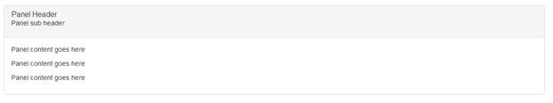

图 67:代码示例 65 产生的输出

您也可以通过在面板主体后添加`<div>`元素并应用类`panel-footer`来应用面板页脚。如果你想给你的面板赋予意义，你也可以使用上下文相关的颜色，用于其他任何事情。只需将前面代码示例中的`panel-default`类替换为`panel-primary`、`panel-success`、`panel-info`、`panel-warning`或`panel-danger`即可。

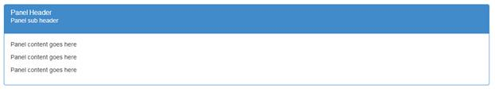

图 68:代码样本 65 产生的输出，类型设置为`panel-primary`

不过，有一点需要注意——如果你使用的是`panel-footer`和上下文颜色，页脚将不会采用面板的配色方案。这是经过深思熟虑的，因为 BS3 开发人员认为，从上下文来看，只有面板的内容才是重要的。响应该信息的任何按钮、控件或页脚信息不需要以相同的方式突出显示，因此允许开发人员根据需要为不同的控件添加不同的上下文颜色。

面板还可以流畅地处理列表组和表格。如果将一个表与父表`div`内的一个面板连接起来，就会得到一个如前所示的面板，并无缝连接到它下面的表，如下所示:

代码示例 66:来自示例 65 的面板，以彩色为主，并应用了表格

```html
          <div class="panel panel-primary">
            <div class="panel-heading">
              <h1 class="panel-title">Panel Header</h1>
              <p>Panel sub header</p>
            </div>
            <div class="panel-body">
              <p>Panel content goes here</p>
              <p>Panel content goes here</p>
              <p>Panel content goes here</p>
            </div>
            <table class="table">
              <thead>
                <tr>
                  <th>#ID</th>
                  <th>Name</th>
                  <th>Twitter Handle</th>
                </tr>
              </thead>
              <tbody>
                <tr>
                  <td>1</td>
                  <td>Peter Shaw</td>
                  <td>@shawty_ds</td>
                </tr>
                <tr>
                  <td>2</td>
                  <td>Digital Solutions UK</td>
                  <td>@digitalsolut_uk</td>
                </tr>
              </tbody>
            </table>
          </div>

```

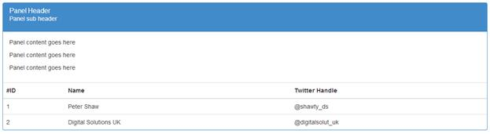

图 69:代码样本 66 产生的输出

如果您将包含面板主体的`<div>`从标记中移除，整个内容将向下折叠，只留下面板标题和边框，并直接进入表格——如果您需要的话，这非常适合为表格提供标题。

将列表组添加到面板中也同样简单，并且以完全相同的方式执行。不过，我会把它作为一个练习留给读者来玩。

## 其他变化

在我们最终离开关于组件的章节之前，还有一些事情要讨论:大屏幕、警告框、进度条和井。

大屏幕不是一个新的元素，但是它在 BS2 中的使用比现在在 BS3 中稍微混乱一些。创建一个大屏幕非常简单；您只需使用一个应用了类`jumbotron`的`<div>`，然后在里面添加一些可选的标记。您使用什么标记完全由您决定，但是为了获得预期的效果，推荐的标记是:

代码示例 67: BS3 大屏幕示例

```html
          <div class="jumbotron">
            <h1>Bootstrap 3</h1>
            <p>Don't you just love this framework? It's elegant, simple to use, and frees you from so much boilerplate code.</p>
            <p><a class="btn btn-primary btn-lg" role="button">Heck yes I do</a></p>
          </div>

```


图 70:代码示例 67 产生的大屏幕

就这样。您可以通过交换顺序并将其移出容器来移除圆角并使其成为全宽，但这没有特殊的类或可选的颜色——它被设计得又大又大胆，吸引了您的注意力。

说到吸引注意力，我们也有一些警戒类，而 BS2 版本和 BS3 之间唯一真正的变化就是类名`alert-error`更名为`alert-danger`。除此之外，生成警报的标记仍然像使用标准的`<div>`一样简单，添加了适当的上下文类:

代码示例 68:上下文警报类

```html
          <div class="alert alert-success">You did something ...</div>
          <div class="alert alert-info">Something happened you ...</div>
          <div class="alert alert-warning">Something happened that wasn't ...</div>
          <div class="alert alert-danger">You did something that was not liked ...</div>

```

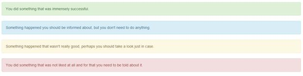

图 71:代码示例 68 产生的警告框

如果您想使用标准的`<a>`标签在您的提醒中添加链接，请确保您将类`alert-link`应用于锚点标签；这将确保链接颜色与正在使用的上下文颜色类保持一致。

您还可以向警报添加一个交叉/消除图标，允许用户关闭它并使其从显示屏上消失。为此，我们需要添加一个`<button>`元素，该元素标记有少量数据属性和额外的类，如下所示:

代码示例 69:可取消的警告框

```html
          <div class="alert alert-danger alert-dismissable">
            <button type="button" class="close" data-dismiss="alert" aria-hidden="true">&times;</button>
            <strong>YO!</strong> You got that operation very, very wrong indeed.
          </div>

```

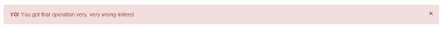

图 72:代码示例 69 产生的可消除警报

我们将额外的类`alert-dismissable`添加到外部的`<div>`中，然后使用一个`dismiss`数据属性，使用一个简单的按钮将 JavaScript 操作连接到警报的`dismiss`方法。

如果警报提供了操作反馈，那么还有一个与反馈相关的组件是必不可少的——进度条。

没有一个反馈元素能像这个不起眼的彩色小条一样产生如此多的仇恨或称呼。从 BS2 到 BS3，与警报类一样，这里所做的唯一更改是重命名上下文颜色，以匹配框架中其他地方的整体方案重命名。

生成它们的基本 HTML 标记保持不变:

代码示例 70:基本进度条

```html
          <div class="progress">
            <div class="progress-bar" role="progressbar" aria-valuenow="60" aria-valuemin="0" aria-valuemax="100" style="width: 60%;">
              <span class="sr-only">60% Complete</span>
            </div>
          </div>

```


图 73:样本 70 产生的进度条

然而，有一件事你真的应该注意(这也是我在本书的不同地方反复强调的)，那就是用来使这个元素对屏幕阅读器和类似设备友好的一组属性和附加元素。

因为进度条本质上往往是纯图形的，所以对于不能阅读屏幕的人来说，它毫无意义。大多数其他元素至少有足够的文本让读者了解那里有什么；进度条需要他们能得到的所有帮助。您将从前面的示例中看到，我们添加了额外的 aria 值来报告该值所占的百分比，并且我们还标记了一个仅供屏幕阅读器使用的跨度，特别是为了给出声音报告。

然而，如果我们去掉`sr-only`类，对于那些也能看到它的人来说，它会让我们的酒吧看起来更好一点:


图 74:进度条，其中`sr-only`类从内跨中移除

不言而喻，你也可以用`progress-bar`类将`progress-bar-success`、`progress-bar-info`、`progress-bar-warning`和`progress-bar-danger`添加到内侧`<div>`中，以便利用可用的上下文颜色。

您也可以将`progress-striped`和/或`active`添加到`progress`类旁边的外部`<div>`中，以便在进度条上获得条纹和动画效果。通过将多个`progress-bar` `<div>`放置在外部`progress`容器内并适当设置它们的值，可以获得堆叠进度条效果。

剩下的最后一个元素，是卑微的`well`。从 BS3 开始就没有对此进行过修改，但是现在它确实有了一个名为`well-sm`的额外类。这里没有魔法——如果你想要一个简单的、有阴影背景的封闭区域，只需创建一个`<div>`元素，给它添加`well`类，然后在里面添加你的内容。井对于边栏和/或页脚，或者任何太简单而不能保证放在整个面板或其他围栏区域的东西都是有用的。也没有上下文颜色或特殊动作；它简单、有效且易于使用:

代码示例 71:简单的油井示例

```html
          <div class="well">Hello World!</div>

```


图 75:样品 71 产生的井实例