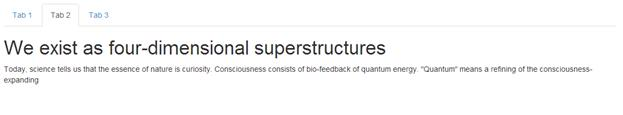
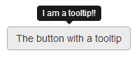

# 第 5 章改变了 JavaScript 特性

说到 BS3 中的 JavaScript，变化不大；到目前为止，我们看到的绝大多数变化都围绕着 CSS 和组件部分。这是有原因的。

BS2 的大多数(就此而言，BS3 的)JavaScript 功能都是以数据属性的形式出现的。在大多数情况下，我们已经在组件的不同部分看到了如何使用它们，这实际上只留下了非常少的特定于 JavaScript 的内容。

因此，在本章中，我将简要介绍大部分可用的内容，并且在本书其他地方没有其他描述的地方，展示一个如何使用可用的 API 的简单示例。

BS2 和 BS3 中可用的 JS 工具非常可扩展，即使是一本完整的书也可能无法涵盖所有可能的内容。因此，我强烈建议你去 www.getbootstrap.com 阅读 JavaScript 部分。

## 情态动词

当在 Bootstrap 中出现 JavaScript 主题时，人们首先提到的是模态对话框——这并不奇怪。

BS3 的模态框是现代浏览器 HTML5 框架中最简单的实现之一(也是最丰富的实现之一)。

使用它们很容易，但不幸的是，确实需要大量的标记。

下面的代码给出了一个非常基本的例子:

代码示例 72:基本模态示例

```html
          <button class="btn btn-primary btn-lg" data-toggle="modal" data-target="#myModal">
            Show Modal Dialog
          </button>

          <div class="modal fade" id="myModal" tabindex="-1" role="dialog" aria-labelledby="myModalLabel" aria-hidden="true">
            <div class="modal-dialog">
              <div class="modal-content">
                <div class="modal-header">
                  <button type="button" class="close" data-dismiss="modal" aria-hidden="true">&times;</button>
                  <h4 class="modal-title" id="myModalLabel">Modal title</h4>
                </div>
                <div class="modal-body">Modal Body</div>
                <div class="modal-footer">
                  <button type="button" class="btn btn-default" data-dismiss="modal">Close</button>
                  <button type="button" class="btn btn-primary">Some Action</button>
                </div>
              </div>
            </div>
          </div>

```


图 76:样本 72 产生的模态示例

为了显示一个模态，你首先需要有一个触发目标。在样本 72 中，这是标记为`Show Modal Dialog`的按钮。要使触发操作起作用，必须为其分配一个切换和目标数据属性，并且该切换必须具有值“`modal`”，以显示其目标是模态对话框。目标必须有分配给它的最外面的`<div>`的 ID 选择器。

在样本 72 中，最外面的`<div>`上有一个 **ID="myModal"** ，这意味着`target`的数据属性应该有`#myModal`作为它的值。

你的触发器不一定是一个按钮；只要提供了切换和目标数据属性，它可以是任何可以接受(或被设置为接受)鼠标点击的东西。

一旦我们进入模态本身，您将看到结构由许多嵌套相当深的`<div>`组成。由于这种嵌套，建议您创建和放置您的对话框/模态定义，尽可能靠近体根；如果没有，那么其他组件和 HTML 结构就有可能导致您没有预料到的布局问题。

您还会注意到，同样，标记东西以使它们对屏幕读者友好是一个共同的主题，同样，我再怎么强调也不为过:您应该尽一切努力确保您的标记对辅助工具尽可能友好。

模态以外部`<div>`和应用于它的类`modal`开始。或者，您也可以添加`fade`，这将使模态在显示和隐藏时有一个很好的平滑过渡。这个外部的`<div>`应该是你设置你的`Z-Order`和任何你想要的全局模态定制的方式。

中的下一个`<div>`应该添加了一个`modal-dialog`类。第三个`<div>`紧随`<div>`之后，分配给它的是`modal-content`班。在第三个`<div>`中，你实际上放置了你的模态内容定义。

一旦定义了模态内容外壳，就可以在另外三个`<div>`元素中放置以下类:`modal-header`、`modal-body`和`modal-footer`。这三个内部部分不应嵌套，而应作为彼此的兄弟添加到标记中，并用于定义对话框三个主要部分的内容。

您可以从示例 72 中的代码中看到，我们包括了一个结束的叉号，就像我们对警报框所做的那样。这个闭合十字和我们之前看到的唯一区别是`dismiss`数据属性的值为`modal`，而不是`alert`。任何放置在内部模态标记中的可点击元素，如果具有此数据属性和此值，将在点击时关闭对话框。

除了关闭图标，模态的其他内部内容只是正常的 BS3 标记和 CSS。您可以在其他地方使用的任何东西都可以在模态中使用，如果它对屏幕来说太高，您将获得一个自动切换到可滚动元素的内部容器。

还有两种可选的宽度尺寸；这些加到内`modal-dialog` `<div>`就是`modal-lg`和`modal-sm`。大尺寸类将模式的宽度扩展到屏幕宽度的一半(非常适合表格和列表)，而小尺寸类将默认宽度缩小到其原始尺寸的大约一半(非常适合“是/否”提示)。

您也可以用标准的 jQuery 方式使用 JavaScript API 初始化模态；如果你想改变默认选项的行为，那么使用 JQ 构造函数是唯一的方法。

代码示例 73:使用 JavaScript 在模态上设置默认选项

```html
          $('#myModal').modal({
            backdrop: true/false,
            keyboard: true/false,
            show: true/false,
            remote: 'path to url that returns content'
          });

```

可以更改的选项如下:

**背景:**布尔值 true 或 false，表示在显示模态时，是否包括页面上的阴影背景；如果指定了值`static`，则显示背景，但点击时不会关闭模式，就像使用`true`时一样。

**键盘:**布尔真或假；允许或不允许 escape 键关闭模式。

**显示:**布尔真或假，初始化后自动显示或不显示对话框。

**remote:** 包含获取对话框主体内部内容的 url 的字符串；如果提供了这个，那么对话框将要求 url 提供一大块 HTML，用于模态的主体。

也有一些事件是为某些操作引发的，但它们超出了本章的范围。

## 标签

如果您还记得的话，在关于基本导航的章节中，我提到标签组件可以与额外的标记连接起来，以便为您实际处理内容窗格的交换。

要标记一组使用 JavaScript 自动更改的选项卡，首先需要以导航组件部分所示的相同方式创建一个`<ul>`。该`<ul>`必须在其每个`<li>`元素中嵌入`<a>`元素，每个锚点的`href`指向每个关联的`<div>`的`id`，该关联的`<div>`设置为容纳一个选项卡面板。您还需要确保每个锚点都分配有切换数据属性，并且其值设置为`tab`。

一旦你创建了导航集，你就需要创建一个外部的`<div>`并将类`tab-content`分配给它。在这个`<div>`里面，你需要创建几个独立的兄弟`<div>`，每个兄弟都有一个`tab-pane`类和一个`id`属性匹配导航集中的相关标签。或者，您也可以添加`fade in`以在标签更改时淡化标签，添加`active`以标记当前显示的标签。

下面的代码显示了一个这样的例子:

代码示例 74:自动选项卡示例

```html
          <ul class="nav nav-tabs">
            <li class="active"><a href="#tab1" data-toggle="tab">Tab 1</a></li>
            <li><a href="#tab2" data-toggle="tab">Tab 2</a></li>
            <li><a href="#tab3" data-toggle="tab">Tab 3</a></li>
          </ul>
          <div class="tab-content">
            <div class="tab-pane active" id="tab1">
              <h1>We self-actualize, we believe, we are reborn</h1>
              <p>By refining, we live ...</p>
            </div>
            <div class="tab-pane" id="tab2">
              <h1>We exist as four-dimensional superstructures</h1>
              <p>Today, science tells us that the ...</p>
            </div>
            <div class="tab-pane" id="tab3">
              <h1>The goal of morphogenetic fields is to plant ...</h1>
              <p>You and I are life forms of the quantum soup ...</p>
            </div>
          </div>

```



图 77:代码示例 74 生成的选项卡集

选项卡控件没有像 modal 那样接受选项的构造函数，但是它有一个 API 调用，这样您就可以知道以编程方式显示哪个选项卡。要做到这一点，只需要使用 jQuery 选择合适的选择器，然后在上面调用`tab('show')`。完成后，您的选项卡将自动使引用的选项卡成为选定的选项卡。和情态动词(以及其他)一样，当事情发生变化时，有一些事件可以告诉你；每个调用的细节和参数可以在 BS3 文档中找到。

## 工具提示和弹出窗口

每个人都喜欢工具提示——简单的小弹出标签，可用于帮助和许多其他简单的描述性任务。

在 BS3 中使用工具提示非常容易。只需将值为`tooltip`的数据属性`toggle`分配给您希望工具提示显示的任何标准 HTML 元素。要定义工具提示的文本，请添加包含所需文本的标题属性，并根据需要添加名为`placement`的数据属性，该属性包含值`left`、`top`、`bottom`或`right`，具体取决于您希望工具提示显示的方向。

下面的代码将创建一个简单的按钮，其顶部附有工具提示:

代码示例 75:带工具提示的 BS3 按钮

```html
          <button id="mybutton" type="button" class="btn btn-default" data-toggle="tooltip" data-placement="top" title="I am a tooltip!!">The button with a tooltip</button>

```

有一个小警告适用于工具提示，但不适用于任何其他元素:您需要自己初始化工具提示。您可以同时向它们传递各种选项(就像 modals 一样)，但是您必须初始化它们，否则您的工具提示将不会出现。

要初始化上一个示例中显示的按钮，请将下面一行 JavaScript 放在页面的某个地方，以便在 DOM 准备好并创建按钮后运行:

```html
          $('#mybutton').tooltip();

```

如何选择每个按钮完全取决于您。例如，您可以通过它们的元素类型选择它们，但是您必须在每个附加了工具提示的元素上调用`tooltip()`。

如果一切按预期进行，您应该会看到如下内容:



图 78:带有附带工具提示的按钮

紧跟在不起眼的工具提示后面的是 popover，和工具提示一样，它必须通过调用`popover()`手动初始化。弹出窗口和工具提示的主要区别在于弹出窗口可以容纳比工具提示更多的内容。

工具提示通常只有一行简单的文本，而弹出窗口更大，可以包含多个 HTML 元素，从段落到按钮和图像。

第二个区别是元素必须在弹出窗口显示之前被点击，而工具提示在悬停时是自动的。

创建弹出窗口的方式与工具提示非常相似，只是弹出窗口的内容是在名为`content`的数据属性中定义的，而`title`属性用于给弹出窗口一个小标题区域(类似于标题区域在面板组件上的使用方式)。下面的代码显示了如何定义一个简单的 popover:

代码示例 76:带弹出窗口的 BS3 按钮

```html
          <button id="mybutton" type="button" class="btn btn-default" data-container="body" data-toggle="popover" data-placement="bottom" data-content="I am the pop over contents, and I'm awesome." title="Popover Title">
            I am a button with a pop over
          </button>

```

与工具提示一样，在文档启动的某个地方，您还需要确保使用类似以下内容初始化组件:

```html
          $('#mybutton').popover();

```

和工具提示一样，您可以在这里传递一个包含选项的对象。有很多可用的，所以我再次鼓励你阅读 BS3 文档来学习它们。

如果一切正常，您应该能够呈现页面并看到以下内容:


图 79:带有弹出装置的 BS3 按钮

## 可折叠面板

可悲的是，BS3 中去掉的一个东西是现成的手风琴组件。然而，取而代之的是更好的东西:可折叠面板。

使用这些面板，创建标准手风琴仍然很容易，但它们现在也是单独可用的独立组件，允许您创建折叠信息区、工具栏等。

但是，有一点需要注意:如果您正在进行自定义构建，您还必须确保包含转换助手 JavaScript 插件。如果您正在进行定制构建，那么 BS3 文档包含了您需要的更多信息。

要从可折叠的面板创建手风琴，你只需要创建一个外部的`<div>`和一个类`panel-group`，并给它一个`id`。然后，在这里面，你需要一系列的`<div>`标记，如前面面板组件部分所示，每个面板`div`是一个独立的面板。

布局好面板后，只需在`panel-header`内添加一个`panel-title`。这个头应该包含一个`<a>`标签，分配了两个数据属性:一个叫做`data-toggle`，一个叫做`data-parent`。

切换属性的值应该是`collapse`，父属性应该持有持有面板组的外部`<div>`的`id`，以及目标面板主体的`id`的`href`，该目标面板主体应该是折叠行为的对象。每个目标面板应分配有等级`panel-collapse`和`collapse`。

下面的代码显示了如何实现这一点:

代码示例 77:如何使用可折叠面板创建折叠替换

```html
          <div class="panel-group" id="newAccordion">
            <div class="panel panel-default">
              <div class="panel-heading">
                <h4 class="panel-title">
                  <a data-toggle="collapse" data-parent="#newAccordion" href="#panelOne">
                    Consciousness is the richness of truth, and of us
                  </a>
                </h4>
              </div>
              <div id="panelOne" class="panel-collapse collapse in">
                <div class="panel-body">
                  Aromatherapy may be the solution to what's ...
                </div>
              </div>
            </div>
            <div class="panel panel-default">
              <div class="panel-heading">
                <h4 class="panel-title">
                  <a data-toggle="collapse" data-parent="#newAccordion" href="#panelTwo">
                    The planet is radiating four-dimensional superstructures
                  </a>
                </h4>
              </div>
              <div id="panelTwo" class="panel-collapse collapse">
                <div class="panel-body">
                  It is time to take chi to the next level ...
                </div>
              </div>
            </div>
            <div class="panel panel-default">
              <div class="panel-heading">
                <h4 class="panel-title">
                  <a data-toggle="collapse" data-parent="#newAccordion" href="#panelThree">
                    Reality has always been radiating messengers whose souls are opened by stardust
                  </a>
                </h4>
              </div>
              <div id="panelThree" class="panel-collapse collapse">
                <div class="panel-body">
                  Self-actualization requires exploration ...
                </div>
              </div>
            </div>
          </div>

```


图 80:样品 77 生产的手风琴替代品

如上所述，面板不需要分组；它们可以以单一方式使用，只需一个元素作为折叠发生的触发器。例如，如果您想使用一个简单的按钮折叠一个面板，只需确保您的按钮具有值为`collapse`的数据属性`toggle`，以及值为目标面板选择器的名为`target`的数据属性。

## 转盘

为了结束这一章，我要介绍的最后一个 JavaScript 插件是新设计的转盘。BS2 有一个旋转木马，但像手风琴一样，现在已经被移除并大大简化，使其更容易使用。

通常，轮播插件用在页面的顶部，以提供旋转的图像横幅，在 BS2 中，这是轮播唯一可以使用的东西。然而，在 BS3 中，可以放在转盘面板内的任何内容都将被旋转，包括图像、文本、svg 等等。

下面的代码显示了如何构建转盘的基本示例:

代码示例 78: BS3 转盘

```html
          <div id="carousel-example-generic" class="carousel slide" data-ride="carousel">
            <ol class="carousel-indicators">
              <li data-target="#carousel-example-generic" data-slide-to="0" class="active"></li>
              <li data-target="#carousel-example-generic" data-slide-to="1"></li>
              <li data-target="#carousel-example-generic" data-slide-to="2"></li>
            </ol>
            <div class="carousel-inner">
              <div class="item active">
                
                <div class="carousel-caption">
                  <h3>You and I are beings of the planet</h3>
                  <p>Spacetime is a constant. Will requires exploration</p>
                </div>
              </div>
              <div class="item">
                
                <div class="carousel-caption">
                <h3>Nothing is impossible</h3>
                  <p>Stardust requires exploration. You and I are storytellers of the cosmos</p>
                </div>
              </div>
              <div class="item">
                
                <div class="carousel-caption">
                  <h3>You and I are beings of the planet</h3>
                  <p>Spacetime is a constant. Will requires exploration</p>
                </div>
              </div>
            </div>
            <a class="left carousel-control" href="#carousel-example-generic" data-slide="prev">
              <span class="glyphicon glyphicon-chevron-left"></span>
            </a>
            <a class="right carousel-control" href="#carousel-example-generic" data-slide="next">
              <span class="glyphicon glyphicon-chevron-right"></span>
            </a>
          </div>

```


图 81:代码示例 78 产生的转盘

还有一些比较低调的 JavaScript 对象，但是大多数都不能直接从正常的用户代码中使用，一般只在特殊情况下使用。BS3 文档涵盖了我错过的所有内容，如果你打算深入研究可用的 JavaScript 工具，那么长时间阅读并理解所有内容是如何连接在一起的绝对是一项要求。

最后一个注意事项:BS3 JavaScript 插件只不过是普通的 jQuery 插件(BS 在引擎盖下使用 jQuery)。这意味着，从 unheap.com 这样的地方获取您最喜欢的 jQuery 插件并对其进行调整以非常容易地与 BS3 一起工作应该非常容易。不要忘记，现在仍然有大量的附加组件可用，尤其是与框架一起使用的附加组件，其中大多数只是谷歌搜索。