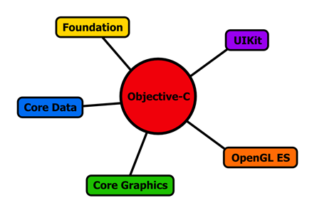
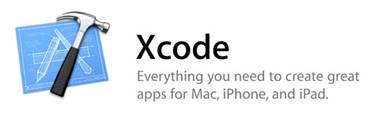
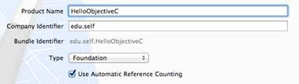
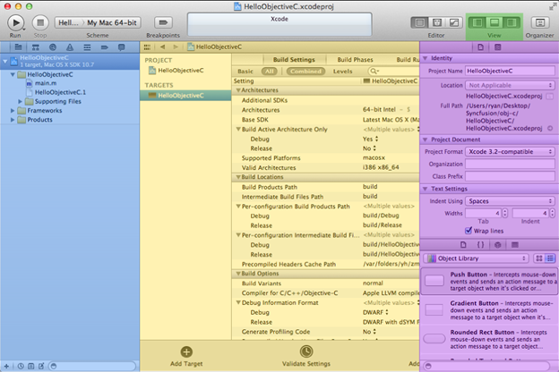
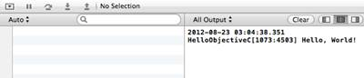

# 零、简介

Objective-C 是原生苹果应用背后的编程语言。这种语言最初设计于 20 世纪 80 年代，是为了给 ANSI C 编程语言增加面向对象的功能，此后它被用来创建从命令行工具到 Mac 程序再到移动应用程序的一切。你可以把 Objective-C 想象成苹果版的 C#编程语言。

然而，学习 Objective-C 只是 iPhone、iPad 和 Mac 应用开发的一个方面。除了这种语言之外，还有一些框架，它们提供了为这些平台构建应用程序所必需的工具。例如，UIKit 框架定义了您在 iPhone 上看到的基本 UI 组件(按钮、列表、图像等)。)，而核心数据框架提供了从设备保存和检索数据的应用编程接口。Objective-C 是一种粘合剂，它可以让你把这些工具组装成一个有用的程序。



图 1:Objective-C 将几个框架的各个方面结合在一起

*Objective-C 简洁地说*是关于苹果应用程序开发的两部分系列的第一部分。在这本书里，我们将使用实际例子来探索整个 Objective-C 语言。我们将通过构建命令行工具来集中学习核心语言概念，这意味着我们*不会在本书*中构建图形应用程序。*这为 *iOS 简洁地*奠定了基础，后者探索了 iPhone 和 iPad 应用底层的 iOS 框架。这两本书都利用了苹果官方集成开发环境 [Xcode](https://developer.apple.com/xcode/) 。*

## 客观的 C 语言

对于来自 C#背景的开发人员来说，Objective-C 保留了许多相同的工作流和面向对象的概念。您仍然可以编写代码，将其编译成可执行文件，当然，还可以使用对象来组织应用程序。Objective-C 提供标准的面向对象结构，如接口、类、类/实例方法和访问器。也就是说，Objective-C 和像 C++和 C#这样的语言有一些重要的区别。

你会注意到的第一件事是 Objective-C 使用完全不同的语法在对象之间进行通信。例如，将调用 C#的*方法语法与 Objective-C 的*消息发送*语法进行比较:*

```objc
    person.sayHello();    // C# method calling.
    [person sayHello ];    // Objective-C message sending.

```

Objective-C 没有调用绑定到对象的方法，而是使用方括号符号在对象之间“发送消息”。出于最实际的目的，您可以将消息发送作为方法调用来处理，我们将交替使用这两个术语，除非它会导致混淆。

第二，Objective-C 被设计成 C 的超集，这意味着可以用任何 Objective-C 编译器编译 C 代码。这也意味着你可以在同一个项目甚至同一个文件中组合 Objective-C 和 C。此外，大多数现代编译器将 C++添加到混合中，因此实际上可以在一个文件中混合 Objective-C、C++和 C。这对于新加入 Objective-C 的人来说可能非常令人困惑，但它也让 Mac 和 iOS 应用程序可以访问整个 C/C++生态系统。

我们将探索这些差异，并在整个*客观-简洁地*中进行更多的探索。

## 样本代码

如果使用书中提供的代码重新创建示例，您将从本书中学到更多。

使用书中提供的代码的精选样本可在网上获得。这些样本对于理解目标 c 至关重要。这些样本可从[https://bitbucket.org/syncfusion/objective_c_succinctly](https://bitbucket.org/syncfusion/objective_c_succinctly)下载。适用于特定部分的示例在它们适用的部分中提到，使用以下格式:

**包含的代码示例:{示例文件夹的名称}**

## 设置

Objective-C 有许多编译器，但本书将重点介绍 Xcode IDE，它附带了编译器、文本编辑器、调试器、界面编辑器，以及在方便的包中创建 iOS 应用程序所需的其他一切。在撰写本文时，Xcode 仅适用于 OS X，因此您需要在 Mac 上运行本书中的任何代码。

我们将从介绍 Xcode 的安装开始，然后我们将学习如何创建应用程序，并探索 IDE 的一些突出特性。

## 安装



图 2:苹果应用商店中的 Xcode 标志

Xcode 可以从 [Mac 应用商店](http://itunes.apple.com/us/app/xcode/id497799835?ls=1&mt=12)下载。导航到链接或在苹果应用商店搜索 **Xcode** ，然后点击左上角的**免费**开始下载。Xcode 应用程序相当大，所以下载至少需要几分钟。如果您不确定下载是否正常，您可以在苹果应用商店的**购买**标签中查看其状态:


图 3:苹果应用商店中的购买标签

向下滚动找到 Xcode 下载，您应该会看到一个进度条，指示它有多远。下载完成后，安装应该很简单，当您启动程序时，您应该(希望)看到一个友好的欢迎屏幕。


图 Xcode 欢迎屏幕

## 创建应用程序

我们的第一个 Objective-C 应用程序将是一个简单的命令行“你好，世界！”程序。要创建 Xcode 项目，请在欢迎屏幕中单击**创建新的 Xcode 项目**。或者，您也可以选择**文件** > **新建** > **项目**....这为您提供了选择项目模板的机会。如您所见，模板分为 iOS 应用程序和 Mac OS X 应用程序。在本系列的第二部分，我们将使用几个 iOS 模板，但是现在，让我们继续使用简单的 **Mac OS X** > **应用程序**下的**命令行工具**模板:


图 5: Mac OS X 模板类别和命令行工具模板图标

接下来，应该向您展示新项目的一些配置选项。对于**产品名称**，使用 **HelloObjectiveC** 。如果你打算发布这个程序，你需要通过[向苹果公司注册成为开发者](https://developer.apple.com/programs/ios/)来获得一个公司标识符，但是由于这是一个个人项目，你可以使用 **edu.self** 。这是应用程序的唯一命名空间。对于**类型** *，*选择**基础**(后面会详细介绍)，由于我们不想手动管理内存，所以一定要选择**使用自动参考计数**复选框。您的最终配置选项应该如下所示:



图 6:我们新项目的配置选项

最后，您应该能够选择保存项目的位置。保存在你喜欢的地方，但取消选择窗口底部的**源代码管理**选项。这将在您的项目文件夹中初始化一个 Git 存储库，但是我们正在处理一个如此小的项目，以至于我们不需要担心版本控制。


图 7:取消选择源代码管理选项

选择项目位置并点击**创建**后，Xcode 创建一个名为 **HelloObjectiveC** 的新文件夹。在里面，你应该会发现*另一个* **HelloObjectiveC** 文件夹包含了项目文件，还有一个**hello objectivec . xcode proj**文件夹；然而，后者更像是一个文件，而不是一个文件夹。**helloobjectvec . xcode proj**定义应用程序的元数据，以及 IDE 的本地配置设置。

你在 T2 唯一需要的文件。xcodeproj 文件夹是 **project.pbxproj** 文件，其中包含构建设置和其他项目相关信息。也就是说，如果您的项目处于源代码控制之下， **project.pbxproj** 是**helloobjecticevec . xcode proj**中唯一需要进行版本控制的文件。

双击**helloobjectvec . Xcode proj**文件夹将启动 Xcode 并打开项目。

## 了解 Xcode IDE

Xcode 是一个具有许多功能的大型应用程序，它有一个相应复杂的接口。值得花点时间熟悉一下下面截图中突出显示的各种 UI 组件。



图 Xcode 集成开发环境的主要组件

如您所见，Xcode 界面分为三个主要窗口:项目导航器(蓝色)、编辑器/工作区(黄色)和实用程序区(紫色)。导航器允许您选择文件、查找代码断点和调试程序。编辑器是您完成大部分工作的地方，在这里您可以编辑代码，对于图形应用程序，您可以设计用户界面并控制应用程序的流程。但是同样，对于 *Objective-C 简洁地说*，我们不需要任何界面编辑工具。最后，实用程序区域允许您为所选组件定义选项(例如，与特定文件相关联的构建目标)。

您可以使用右上角的视图选择器(绿色)控制哪些窗口可见；然而，不可能隐藏工作区域。单击视图选择器中的中心按钮将显示一个输出窗口，我们可以在其中查看应用程序的日志数据。

### 编辑文件

我们的命令行模板带有一个单独的 Objective-C 文件 **main.m** 。那个。m 扩展名用于只包含 Objective-C 代码的文件。mm 扩展名适用于混合了 Objective-C 和 C、Objective-C 和 C++，或者三者组合的文件。要编辑 **main.m** ，在导航面板中选择它，您应该会在编辑器窗口中看到以下代码:

```objc
    //
    // main.m
    // HelloObjectiveC
    //
    // Created by Ryan Hodson on 8/21/12.
    // Copyright (c) 2012 __MyCompanyName__. All rights reserved.
    #import <Foundation/Foundation.h>

    int main(int argc, const char * argv[])
    {

        @autoreleasepool {

            // Insert code here...
            NSLog (@"Hello, World!" );

        }
        return 0;
    }

```

下一章对这段代码进行了深入的解释，但目前唯一重要的是`NSLog()`函数，它向控制台输出一个字符串。还要注意，Objective-C 字符串的前缀是一个`@`符号(大多数 Objective-C 专用的构造也是如此)，并且它们必须是双引号。

### 编译代码

**包含代码示例:helloobjectvec**

要编译这段代码并运行生成的可执行文件，只需点击 IDE 左上角的**运行**按钮。或者，您可以在主菜单栏中选择**产品** > **运行**，或使用 **Cmd+R** 键盘快捷键。这将打开屏幕底部的输出面板，并显示“你好，世界！”消息:



图 9: HelloObjectiveC 日志输出

## 总结

这些是安装 Xcode IDE 并使用它来创建和编译一个 Objective-C 项目的基础。我们没有做任何编码，但希望您对 Xcode 界面感觉更舒服，并且至少能够在项目文件中导航。在下一章中，我们将开始实际编写 Objective-C 代码，定义类，实例化对象，并向它们发送消息。