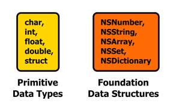
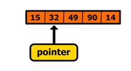
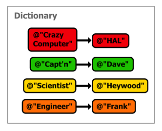

# 二、数据类型

Objective-C 有两类数据类型。首先，请记住 Objective-C 是 C 的超集，因此您可以访问所有本机 C 数据类型，如`char`、`int`、`float`等。Objective-C 还定义了一些自己的低级类型，包括一个布尔类型。让我们称所有这些为“原始数据类型”

其次，Objective-C 提供了几个高级数据结构，如字符串、数组、字典和日期。这些高级数据类型被实现为 Objective-C 对象，因此您将看到许多与前一章相同的面向对象结构。由于这些都是在基础框架中定义的，我们将它们称为“基础数据结构”



图 14:我们的两类数据类型

本章涵盖了原始数据类型和最重要的基础数据结构。到本章结束时，您应该对您的 Objective-C 程序可能需要的每一个数据结构都有一个坚实的掌握。

## 显示数值

除了数据类型，我们还将在本章中了解更多关于`NSLog()`字符串格式的信息。这将让我们在 Xcode 控制台中显示各种变量，这是调试应用程序不可或缺的技能。

正如我们在上一章看到的，`NSLog()`可以用**格式字符串来调用。**在格式字符串内部，您使用`%`符号来指定占位符值，`NSLog()`将用作为附加参数传递的值来填充它们。例如，以下代码中的`%@`被替换为`aName`变量:

```objc
    NSLog(@"Hello %@, my name is HAL.", aName);

```

`%@`被用作*对象*的占位符(Objective-C 字符串被实现为对象)，但是原语数据类型使用它们自己的格式说明符，这将在它们各自的部分中介绍。

## 原始数据类型

本章的前半部分着眼于本机 Objective-C 数据类型，并讨论如何使用`NSLog()`格式字符串显示它们。本节中呈现的数据类型的大小取决于系统——真正了解数据类型有多大的唯一方法是使用`sizeof()`函数。例如，您可以使用以下内容检查`char`的大小:

```objc
    NSLog(@"%lu", sizeof(char));

```

这样应该会输出`1`，也就是说`char`占用 1 字节内存。`%lu`占位符代表无符号长整数(稍后将详细讨论)，这是`sizeof()`的返回类型。接下来的部分将讨论 Objective-C 数据类型最常见的大小，但是请记住，这可能与您的系统不同。

### 布尔人

Objective-C 程序使用`BOOL`数据类型存储布尔值。Objective-C 还定义了自己的真假关键词，分别是`YES`和`NO`。要通过`NSLog()`显示`BOOL`值，请在格式字符串中使用`%i`:

```objc
    BOOL isHuman = NO;
    NSLog(@"It's alive: %i", isHuman);

```

`%i`说明符用于显示整数，因此这应该输出`It's alive: 0`。

从技术上讲，`BOOL`是`signed char`类型的宏(在下一节中讨论)。这意味着`BOOL`变量可以存储更多的值，而不仅仅是`YES`和`NO`，它们实际上分别是`1`和`0`的宏。然而，大多数开发人员永远不会使用这个额外的功能，因为它可能是条件语句中令人沮丧的错误的来源:

```objc
    BOOL isHuman = 127;
    if (isHuman) {
        // This will execute.
        NSLog (@"isHuman is TRUE" );
    }
    if (isHuman == YES ) {
        // But this *won't* execute.
        NSLog (@"isHuman is YES" );
    }

```

任何大于`0`的值都会评估为真，所以第一个条件会执行，但是第二个条件不会，因为`127 != 1`。根据你如何使用你的`BOOL`变量，这可能是也可能不是一个理想的区别。

### 字符

Objective-C 使用与 ANSI C 相同的`char`数据类型，表示单字节有符号整数，可用于存储`-128`和`127`之间的值或 ASCII 字符。要将`char`显示为整数，只需使用前面代码示例中引入的通用`%i`说明符。要将其格式化为 ASCII 字符，请使用`%c`:

```objc
    char letter = 'z';
    NSLog(@"The ASCII letter %c is actually the number %i", letter, letter);

```

与所有整数数据类型一样，可以分配一个*无符号* `char`，它可以记录从`0`到`255`的值。您应该使用`%u`作为无符号整数的占位符，而不是`%i`说明符:

```objc
    unsigned char tinyInt = 255;
    NSLog(@"The unsigned char is: %u", tinyInt);

```

### 短整数

短整数是 2 字节有符号整数，应该用于`-32768`和`32767`之间的值。要使用`NSLog()`显示它们，请使用`%hi`说明符(`h`是前两节中使用的相同`%i`的“修饰符”)。例如:

```objc
    short int littleInt = 27000;
    NSLog(@"The short int is: %hi", littleInt);

```

无符号短字符可以用与无符号字符相同的方式创建，最多可以保存`65535`。同样，`%hu`中的`u`与通用无符号整数的`%u`中的`u`相同:

```objc
    unsigned short int ulittleInt = 42000;
    NSLog(@"The unsigned short integer is: %hu", ulittleInt);

```

### “正常”整数

列表中的下一个是`int`，这是大多数系统上的 4 字节整数。同样，请记住，数据类型大小取决于系统—确定数据类型有多大的唯一方法是使用`sizeof()`函数:

```objc
    NSLog(@"%lu", sizeof(int));

```

如果您的`int`类型确实是 4 字节，它可以保存`-2147483648`和`2147483647`之间的值。

```objc
    int normalInt = 1234567890;
    NSLog(@"The normal integer is: %i", normalInt);

```

这也意味着未签名版本可以录制`0`–`4294967295`。

### 长整数

如果`int`不够大，不能满足您的需求，您可以向上移动到`long int`数据类型，在大多数现代系统上是 8 字节。这足以代表`-9223372036854775808`和`9223372036854775807`之间的值。长整数可以通过`NSLog()`在`%i`或`%u`说明符前面加上字母`l`来显示，如以下代码所示:

```objc
    long int bigInt = 9223372036854775807;
    NSLog (@"The big integer is: %li", bigInt);

    unsigned long int uBigInt = 18446744073709551615;
    NSLog(@"The even bigger integer is: %lu", uBigInt);

```

`18446744073709551615`是无符号版本的最大值，希望这是您需要存储的最大整数。

拥有如此多的整数数据类型背后的想法是为了让开发人员能够平衡程序的内存占用和数字容量。

### 彩车

Objective-C 程序可以使用`float`类型来表示 4 字节浮点数。文字值应该以`f`为后缀，将值标记为单精度，而不是`double`(将在下一节中讨论)。使用`%f`说明符输出带有`NSLog()`的浮点数:

```objc
    float someRealNumber = 0.42f;
    NSLog (@"The floating-point number is: %f", someRealNumber);

```

您也可以通过在`f`前包含一个小数来指定浮点本身的输出格式。例如，`%5.3f`将在小数点后显示 3 位数字，并填充结果，这样总共有 5 位(用于在列出值时对齐小数点)。

虽然浮点值的范围比定点值大得多，但重要的是要记住，它们本质上是*而不是精确的*。必须仔细考虑比较浮点值，它们永远不应该用于记录对精度敏感的数据(例如货币)。关于在Objective-C 中表示定点值，请参见[基础数据结构](#_NSDecimalNumber)部分中的`NSDecimalNumber`。

### 双打

`double`数据类型为双精度浮点数。大部分情况下，你可以把它当作`float`的更精确版本。您可以使用相同的`%f`说明符在`NSLog()`中显示`double`，但不需要将`f`附加到文字值:

```objc
    double anotherRealNumber = 0.42;
    NSLog(@"The floating-point number is: %5.3f", anotherRealNumber);

```

### 结构

Objective-C 还提供了对 C 结构的访问，C 结构可用于定义自定义数据结构。例如，如果您正在处理一个图形程序并与许多二维点进行交互，那么将它们包装成自定义类型会很方便:

```objc
    typedef struct {
        float x;
        float y;
    } Point2D;

```

`typedef`关键字告诉编译器我们正在定义一个新的数据类型，`struct`创建实际的数据结构，包括变量`x`和`y`，最后，`Point2D`是新数据类型的名称。声明此`struct`后，您可以像使用任何内置类型一样使用`Point2D`。例如，下面的代码片段创建了点`(10.0, 0.5)`，并使用我们现有的`NSLog()`格式说明符显示它。

```objc
    Point2D p1 = {10.0f, 0.5f};
    NSLog(@"The point is at: (%.1f, %.1f)", p1.x, p1.y);

```

`{10.0f, 0.5f}`符号被称为复合文字，可以用来初始化`struct`。初始化后，您还可以使用`=`操作符为`struct`的属性分配新值:

```objc
    p1.x = -2.5f;
    p1.y = 2.5f;

```

结构对于性能密集型应用程序很重要，但有时很难与高层次的 Foundation 数据结构集成。除非你正在处理三维图形或其他一些 CPU 密集型应用程序，否则你最好将定制数据结构存储在一个成熟的类中，而不是一个`struct`。

### 阵列

虽然 Objective-C 提供了自己的面向对象数组数据类型，但它仍然允许您访问 ANSI C 指定的低级数组。C 数组是在声明时分配的连续内存块，其所有元素必须是相同的类型。与 C#数组不同，这意味着在声明数组时需要定义数组的长度，并且在初始化后不能为其分配另一个数组。

因为程序没有办法自动确定数组中有多少元素，所以没有方便的`NSLog()`格式说明符来显示原生数组。相反，我们只能手动循环每个元素并调用单独的`NSLog()`。例如，下面的代码创建并显示一个 5 个整数的数组:

```objc
    int someValues[5] = {15, 32, 49, 90, 14};
    for (int i=0; i<5; i++) {
        NSLog (@"The value at index %i is: %i", i, someValues[i]);
    }

```

如您所见，C 数组看起来很像原子变量，只是您必须在方括号(`[5]`)中提供它们的长度。它们可以用与结构相同的复合文本语法进行初始化，但是所有的值必须是相同的类型。单个元素可以通过在方括号中传递项目编号来访问，这在大多数编程语言中都很常见。此外，您可以通过指针访问元素。

#### 两颗北极指极星

指针提供了一种在 C 程序中直接访问内存地址的低级方法。而且，由于 C 数组只是连续的内存块，指针是与数组中的项目交互的自然方式。事实上，保存本机数组的变量实际上是指向数组中第一个元素的指针。

指针是通过在变量名前加星号(`*`)来创建的。例如，我们可以使用以下代码创建对`someValues`数组中第一个元素的第二个引用:

```objc
    int someValues[5] = {15, 32, 49, 90, 14};
    int *pointer = someValues;

```

`*pointer`变量*将*指向包含该值的存储器地址，而不是存储`int`值。这可以可视化为以下内容:


图 15:指向数组第一个元素的指针

为了从内存地址中获取基础值，我们需要使用星号运算符**取消引用**指针，如下所示:

```objc
    NSLog(@"The first value is: %i", *pointer);

```

这将在您的输出面板中显示`15`，因为这是存储在`pointer`变量所指向的内存地址中的值。到目前为止，这只是访问普通(非指针)`int`变量的一种非常混乱的方式。然而，当你开始用`++`和`--`操作符移动*和*指针时，事情就变得有趣多了。例如，我们可以如下递增指向下一个内存地址的指针:

```objc
    pointer++;
    NSLog(@"The next value is: %i", *pointer);

```

由于数组是一个连续的内存块，指针现在将停留在数组第二个元素的地址上。因此，`NSLog()`呼叫应该显示`32`而不是`15`。这可以可视化为以下内容:



图 16:增加指向数组第二个元素的指针

指针提供了一种迭代数组的替代方法。您可以简单地增加指针并取消对它的引用以获得下一个值，而不是通过方括号(例如`someValues[i]`)来访问项目:

```objc
    for (int i=0; i<5; i++) {
        pointer++;
        NSLog(@"The value at index %i is: %i", i, *pointer);
    }

```

指针在高性能应用程序中有无数的用途，但实际上，除非您正在构建一个非常关注速度的数据密集型应用程序，否则您可能不需要将指针与本机数组一起使用。

然而，指针对于 Objective-C 程序仍然非常重要，因为每个*对象都是通过指针来引用的。这就是为什么即将到来的[基础数据结构](#_Foundation_Data_Structures)部分中的所有数据结构都被声明为指针(例如`NSNumber *someNumber`，而不是`NSNumber someNumber`)。*

### 无效

`void`类型表示没有值。`void`与不返回值的函数和方法一起使用，而不是键入变量。例如，上一章的`sayHello`方法没有返回任何内容，因此它是用`void`数据类型定义的:

```objc
    - (void)sayHello;

```

### 零和空

`nil`和`NULL`关键字都用来表示空指针。这对于明确声明变量不包含任何内容非常有用，而不是将其作为指向其最新内存地址的指针。

然而，这两者之间有严格的区别。`nil`常量只能用作 Objective-C 对象的空值—它应该*而不是*用于本机 C 风格指针(例如`int *somePointer`)。`NULL`可以用于原始指针或Objective-C 对象指针，尽管`nil`是首选。

## 原始数据类型汇总

本章的前半部分介绍了 Objective-C 程序员可以使用的原始数据类型。我们还简单看了一下指针和`nil`和`NULL`关键词。

重要的是要记住，变量中存储的值完全独立于它的解释方式。`unsigned` `int` s 可以解释为`signed int` s 而不用以任何方式改变变量。这就是为什么确保在`NSLog()`中使用正确的格式字符串如此重要。否则，你会疑惑为什么你的无符号变量看起来像是在存储负数。正如我们将在下一节中看到的，这并不是面向对象数据类型的问题。

本章的剩余部分集中在 Foundation 框架上，它定义了所有 Objective-C 开发人员都应该熟悉的几种面向对象的数据结构。

## 基础数据结构

原始数据类型对于任何 Objective-C 程序来说都是必不可少的，但是在如此低的级别上工作通常是乏味的。Foundation 框架将这些原生类型抽象为高级的面向对象工具，这使您能够专注于应用程序如何工作，而不是如何存储数据。

下面的数据结构是大多数高级编程语言所共有的，但是因为它是 Objective-C，所以它们有独特的方法名来操作它们包含的数据。本节的目标是向您介绍 Foundation 框架中定义的核心类的最重要方面，而不是提供全面的 API 参考。如果您正在寻找后者，请访问[基础框架参考](https://developer.apple.com/library/mac/#documentation/Cocoa/Reference/Foundation/ObjC_classic/_index.html)。

### NSNumber

[NSNumber](https://developer.apple.com/library/mac/#documentation/Cocoa/Reference/Foundation/Classes/NSNumber_Class/Reference/Reference.html%23//apple_ref/doc/uid/TP40003704) 是数字类型的通用容器(即`BOOL`、`char`、`short`、`int`、`long`、`float`和`double`)。它允许您采用本章前面讨论的基本类型之一，并以面向对象的方式与之交互。这叫做**拳击**，是将 Objective-C 与 C 和 C++库集成的必备工具。

`NSNumber`提供了几种方便的方法来转换为基元值和从基元值转换。例如，您可以在`NSNumber`中存储一个整数，如下所示:

```objc
    int someInteger = -27;
    NSNumber *someNumber = [NSNumber numberWithInt:someInteger];

```

同样的，`float` s 可以用`numberWithFloat:`创建，`double` s 可以用`numberWithDouble:`创建，`BOOL` s 可以用`numberWithBool:`创建等等。，可以使用相应的访问器方法访问记录的值:

```objc
    NSLog(@"The stored number is: %i", [someNumber intValue]);

```

其他原语的访问器遵循相同的模式:`floatValue`、`doubleValue`、`boolValue`等。

请记住，`%@`说明符用作对象的占位符。基础框架中的大多数类都定义了自己的显示格式。`NSNumber`将简单地显示它的存储值，因此下面的格式字符串将输出与前面的代码片段完全相同的内容。使用`NSNumber`的一个方便的好处是不用去弄清楚使用哪个说明符。

```objc
    NSLog(@"The stored number is: %@", someNumber);

```

注意`NSNumber`是一个不可变的类型，所以如果你需要改变存储的值，你必须创建一个新的实例。这看起来似乎是很大的开销，但是与 Objective-C 程序中发生的其他事情相比，它实际上并没有那么大的性能损失。当然，如果它成为一个问题，你总是可以回到原生的 C 基元。

`NSNumber`的另一个好处是能够将变量设置为`nil`来指示空值。没有办法用原始数值做到这一点。

### NS 十进制数

[ns 分数线](https://developer.apple.com/library/mac/#documentation/Cocoa/Reference/Foundation/Classes/NSDecimalNumber_Class/Reference/Reference.html%23//apple_ref/doc/uid/TP40003644)类是 Objective-C 的定点类。它可以表示比`float`或`double`更精确的数字，因此是表示货币或其他精度敏感数据的首选方式。创建`NSDecimalNumber`最简单的方法是使用`decimalNumberWithString:`方法，如下所示:

```objc
    NSDecimalNumber *subtotal = [NSDecimalNumber       
                                 decimalNumberWithString:@"10.99"];

```

由于`NSDecimalNumber`使用的算术算法比浮点数更精确，所以不能使用标准的`+`、`-`、`*`或`/`运算符。相反，`NSDecimalNumber`为所有这些操作提供了自己的方法:

*   `- decimalNumberByAdding:(NSDecimalNumber *)aNumber`
*   `- decimalNumberBySubtracting:(NSDecimalNumber *)aNumber`
*   `- decimalNumberByMultiplyingBy:(NSDecimalNumber *)aNumber`
*   `- decimalNumberByDividingBy:(NSDecimalNumber *)aNumber`

和`NSNumber`一样，`NSDecimalNumber`是一个不可变的类型，所以所有这些方法都返回一个新的`NSDecimalNumber`实例。例如，下一个片段将产品价格乘以折扣百分比:

```objc
    NSDecimalNumber *subtotal = [NSDecimalNumber
                                 decimalNumberWithString:@"10.99" ];
    NSDecimalNumber *discount = [NSDecimalNumber
                                 decimalNumberWithString:@".25" ];
    NSDecimalNumber *total = [subtotal decimalNumberByMultiplyingBy:discount];
    NSLog(@"The product costs: $%@", total);

```

但是，如果您运行这个代码示例，您会注意到它在小数点后多输出了几个位置。幸运的是，`NSDecimalNumber`提供了配置其舍入行为的详细选项。这是使用`NSDecimalNumber`而不是原始的`float`或`double`数据类型的主要原因。要定义您的舍入行为，使用您想要的参数创建一个`NSDecimalNumberHandler`实例，然后通过`withBehavior`参数将其传递给`NSDecimalNumber`的算术运算。以下配置对于使用货币非常有用:

```objc
    NSDecimalNumberHandler *roundUp = [NSDecimalNumberHandler
        decimalNumberHandlerWithRoundingMode:NSRoundUp
                                       scale:2
                            raiseOnExactness:NO
                             raiseOnOverflow:NO
                            raiseOnUnderflow:NO
                         raiseOnDivideByZero:YES ];

    NSDecimalNumber *roundedTotal = [subtotal 
        decimalNumberByMultiplyingBy:discount
                        withBehavior:roundUp];

    NSLog(@"The product costs: $%@", roundedTotal);

```

`NSRoundUp`参数告诉`NSDecimalNumber`运算要舍入(其他选项是`NSRoundPlain`、`NSRoundDown`和`NSRoundBankers`)。接下来，`scale`参数定义小数点后的最大位数(注意负值将开始移除小数点左边的有效数字)。其余参数定义`NSDecimalNumber`操作的异常处理行为。在这种情况下，我们告诉它忽略所有可能出错的地方，除非我们试图除以零。总的来说，这些参数确保了我们的货币值中总是有两位小数，并且它们总是被四舍五入。

一般来说，`NSDecimalNumber`的一个实例只对与其他`NSDecimalNumber`对象交互有用，但是您可能偶尔需要将它们转换为另一种数据类型:

```objc
    double totalAsDouble = [roundedTotal doubleValue];
    NSString *totalAsString = [roundedTotal stringValue];

```

`stringValue`方法对于将值导出到数据库或其他持久存储特别有用(`NSDecimalNumber`永远不应该存储为`double`，除非您真的不在乎精度的损失)。还值得一提的是，Core Data 框架确实为`NSDecimalNumber`提供了原生存储机制，尽管这不在本书的讨论范围之内。

### 根弦

[NSString](https://developer.apple.com/library/mac/#documentation/Cocoa/Reference/Foundation/Classes/NSString_Class/Reference/NSString.html%23//apple_ref/doc/uid/TP40003744) 是绝大多数 Objective-C 程序使用的不可变字符串类。我们已经在 [Hello，Objective-C](01.html#_Chapter_1_Hello%2C) 一章中看到了它的实际应用，但是让我们仔细看看它的一些方法。本质上，`NSString`是一个代表字符的美化的 C 整数数组。它的两个最基本的方法是:

*   `-(NSUInteger)length`–返回字符串中的字符数。
*   `-(unichar)characterAtIndex:(NSUInteger)theIndex`–在`theIndex`返回字符。

这两种方法使得遍历字符串中的单个字符成为可能。例如:

```objc
    NSString *quote = @"Open the pod bay doors, HAL.";
    for (int i=0; i<[quote length ]; i++) {
        NSLog (@"%c", [quote characterAtIndex:i]);
    }

```

然而`NSString`的真正力量来自其更高级别的功能。下面的列表描述了一些最常见的方法，但请记住，这个列表远非完整。

*   `+(id)stringWithFormat:(NSString *)format ...`–使用与`NSLog()`相同的占位符格式创建字符串。
*   `-(NSString *)stringByAppendingString:(NSString *)aString`–向接收对象追加一个字符串。
*   `-(NSString *)stringByAppendingFormat:(NSString *)format ...`–使用与`NSLog()`相同的占位符格式追加字符串。
*   `-(NSString *)lowercaseString`–返回接收字符串的小写形式。
*   `-(NSString *)substringWithRange:(NSRange)aRange`–返回驻留在`aRange`中的子串(用法见下面的例子)。
*   `-(NSRange)rangeOfString:(NSString *)aString`–在接收字符串中搜索`aString`，并将结果的位置和长度作为`NSRange`返回(用法见下面的例子)。
*   `-(NSString *)stringByReplacingOccurancesOfString:(NSString *)target withString:(NSString *)replacement`–将所有出现的`target`替换为`replacement`。

最后这种方法是一个很好的例子，说明了 Objective-C 方法名称的冗长本质是如何使程序自我记录的。打字很长，但是没有人会误认为你想用这种方法完成什么。下面的例子演示了其中的一些高级方法，并向您展示了如何使用 [NSRange](https://developer.apple.com/library/mac/#documentation/Cocoa/Reference/Foundation/Miscellaneous/Foundation_DataTypes/Reference/reference.html) ，这是一个包含`location`和`length`字段的结构。`NSMakeRange()`是由创建`NSRange`的基础框架定义的便利功能。

```objc
    NSString *quote = @"Open the pod bay doors, HAL.";
    NSRange range = NSMakeRange (4, 18 );
    NSString *partialQuote = [quote substringWithRange:range];
    NSLog (@"%@", partialQuote);

    NSString *target = @"HAL";
    NSRange result = [quote rangeOfString:target];
    NSLog (@"Found %@ at index %lu. It's %lu characters long.",
        target, result.location, result.length);

```

`NSString`也有直接读写文件内容的能力，但是我们会留到本系列的第二本书 *iOS 简洁地*。

### ns mutual string

正如你可能已经猜到的那样，`NSMutableString`是`NSString`的可变对应物。可变字符串允许您在不生成全新字符串的情况下更改单个字符。如果您对一个字符串进行许多小的更改，可变字符串会更有效，因为它会就地更改字符。另一方面，一个不可变的字符串必须为每个变化分配一个*新的*字符串。

`NSMutableString`是作为`NSString`的子类实现的，因此您可以访问所有的`NSString`方法，同时还可以添加一些新的方法来操作字符数组:

*   `-(void)appendString:(NSString *)aString`–将`aString`附加到接收字符串的末尾。
*   `-(void)appendFormat:(NSString *)format ...`–使用与`NSLog()`相同的占位符格式追加字符串。
*   `-(void)insertString:(NSString *)aString atIndex (NSUInteger)anIndex`–在指定的索引中插入一个字符串。
*   `-(void)deleteCharactersInRange:(NSRange)aRange`–从接收字符串中删除字符。
*   `-(void)replaceCharactersInRange:(NSRange)aRange withString:(NSString *)aString`–将`aRange`中的字符替换为`aString`。

注意这些方法都有`void`返回类型，而对应的`NSString`方法返回`NSString`对象。这表明了可变字符串的行为:不需要返回任何东西，因为字符是在适当的位置被操纵的。

```objc
    // With immutable strings.
    NSString *quote = @"I'm sorry, Dave. I'm afraid I can't do that.";
    NSString *newQuote = [quote
                          stringByReplacingCharactersInRange:NSMakeRange (11, 4 )                                                                                        
                                                  withString:@"Capt'n" ];
    NSLog (@"%@", newQuote);

    // With a mutable string.
    NSMutableString *mquote = [NSMutableString stringWithString:quote];
    [mquote replaceCharactersInRange:NSMakeRange (11, 4 )
                          withString:@"Capt'n" ];
    NSLog(@"%@", mquote);

```

正如您在这个示例中看到的，可变字符串背后的基本工作流程与不可变字符串大不相同。可变字符串方法在对象上操作*，所以你可以反复使用同一个变量，动态改变它的内容。不可变字符串方法需要多个变量；当然，您可以一次又一次地将新字符串分配给同一个变量，但是新字符串仍然会在幕后生成。*

有时很难知道什么时候使用不可变数据类型和可变数据类型。可变字符串通常有非常具体的用例(例如，对标记进行操作的语言解析器)，所以如果你不确定你是否需要一个，你可能不需要。对于类似前面的例子，一个*不可变的*字符串会更合适。

### nsaarray

数组是对象的有序集合，允许您维护和排序数据列表。和`NSString`一样，`NSArray`是不可变的，所以不请求一个全新的数组就不能改变它的内容。最重要的`NSArray`方法如下表所示。同样，这只是一项调查，而不是一个全面的概述:

*   `+(id)arrayWithObjects:(id)firstObject, ...`–通过传入对象列表来创建新数组。
*   `-(NSUInteger)count`–返回数组中元素的数量。
*   `-(id)objectAtIndex:(NSUInteger)anIndex`–返回数组中索引`anIndex`处的元素。
*   `-(BOOL)containsObject:(id)anObject`–返回`anObject`是否是数组的元素。
*   `-(NSUInteger)indexOfObject:(id)anObject`–返回数组中第一个出现的`anObject`的索引。如果对象不在数组中，返回`NSNotFound`常量。
*   `-(NSArray *)sortedArrayUsingFunction:(NSInteger (*)(id, id, void *))compareFunction context:(void *)context`–通过将对象与用户定义的函数进行比较来对数组进行排序(参见下面的第二个示例了解用法)。

请注意，所有这些方法都使用泛型对象类型`id`作为参数。因此，`NSArray`只能*处理对象，而*不能*用于原始数据类型。像`NSNumber`这样的课程的实际功能现在应该更加清晰了:它们促进了拳击运动。也就是说，它们使得使用`char`、`int`、`float`等成为可能。，通过将它们包装在面向对象的容器中。例如，以下代码片段显示了如何使用`NSArray`来管理`float`值的列表:*

```objc
    NSNumber *n1 = [NSNumber numberWithFloat:22.5f];
    NSNumber *n2 = [NSNumber numberWithFloat:8.0f ];
    NSNumber *n3 = [NSNumber numberWithFloat:-2.9f ];
    NSNumber *n4 = [NSNumber numberWithFloat:13.1f ];
    NSArray *numbers = [NSArray arrayWithObjects:n1, n2, n3, n4, nil ];
    NSLog(@"%@", numbers);

```

与原始的 C 数组相比，`NSArray`提供了大量高级功能，但当然，这是有代价的。对于高性能应用程序来说，装箱可能是一项昂贵的操作。想象一个图形程序用成千上万的`floats`来表示三维空间中的顶点。仅仅为了`NSArray`的兼容性而创建这么多`NSNumber`对象并不能有效利用内存或 CPU 周期。在这种情况下，您最好坚持使用本机 C 数组，直接使用原始数据类型。

`sortedArrayUsingFunction:`方法的签名可能看起来令人生畏，但它实际上是一种为数组定义自定义排序算法的相对简单的方法。首先，您需要定义排序函数:

**包含的代码示例:ArraySort**

```objc
    NSInteger sortFunction(id item1, id item2, void *context) {
        float number1 = [item1 floatValue ];
        float number2 = [item2 floatValue ];
        if (number1 < number2) {
            return NSOrderedAscending;
        } else if (number1 > number2) {
            return NSOrderedDescending;
        } else {
            return NSOrderedSame;
        }
    }

```

这定义了一个非常简单的升序排序，但是它演示了排序函数的基本组成部分。`item1`和`item2`参数是当前正在比较的两个项目。由于这些值被装箱在一个`NSNumber`中，我们需要在比较它们之前取出这些值。然后我们做实际对比，当`item1`应该放在`item2`之前时返回`NSOrderedAscending`，当应该放在`item2`之后时返回`NSOrderedDescending`，当不需要排序时返回`NSOrderedSame`。我们可以这样使用这个排序函数:

```objc
    int main(int argc, const char * argv[]) {
        @autoreleasepool {

            NSNumber *n1 = [NSNumber numberWithFloat:22.5f ];
            NSNumber *n2 = [NSNumber numberWithFloat:8.0f ];
            NSNumber *n3 = [NSNumber numberWithFloat:-2.9f ];
            NSNumber *n4 = [NSNumber numberWithFloat:13.1f ];
            NSArray *numbers = [NSArray arrayWithObjects:n1, n2, n3, n4, nil ];
            NSLog (@"%@", numbers);

            NSArray *sortedNumbers = [numbers
                                      sortedArrayUsingFunction:sortFunction
                                                       context:NULL ];
            NSLog (@"%@", sortedNumbers);

        }
        return 0;
    }

```

第二个`NSLog()`输出应该显示从`-2.9`到`22.5`的升序数字。`sortedNumbers`是一个全新的数组，`numbers`变量保持不变。然而，他们确实指出了`n1`、`n2`、`n3`和`n4`的相同实例。

### NSMutableArray

`NSMutableArray`是`NSArray`的易变对应物。有可能在数组被分配后更改项目，并通过任意数量的元素扩展或收缩数组。虽然不如`NSArray`高效，但增加或移除项目的能力使`NSMutableArray`成为 Objective-C 应用程序中常见的数据结构。`NSMutableArray`是`NSArray`的一个子类，因此两者都可以使用上一节中的方法来创建、访问和排序，但是它们也提供了一些额外的方法来操作它们的内容:

*   `+(id)arrayWithCapacity:(NSUInteger)numItems`–创建一个空的可变数组。`numItems`参数用作大小提示，因此它应该大致是您计划存储的初始项目数。
*   `-(void)addObject:(id)anObject`–将给定对象添加到现有数组的末尾。
*   `-(void)insertObject:(id)anObject atIndex:(NSUInteger)anIndex`–将给定对象插入指定索引。
*   `-(void)removeObjectAtIndex:(NSUInteger)anIndex`–移除指定索引处的对象。
*   `-(void)removeAllObjects`–清除阵列。
*   `-(void)replaceObjectAtIndex:(NSUInteger)anIndex withObject:(id)anObject`–用`anObject`覆盖`anIndex`处的对象。
*   `-(void)exchangeObjectAtIndex:(NSUInteger)index1 withObjectAtIndex:(NSUInteger)index2`–交换数组中两个对象的位置。

请注意，大多数可变方法本质上都是“写”方法，而在 [NSArray](#_NSArray) 一节中讨论的方法大多是“读”方法。此外，可变排序方法与`NSArray`相同，只是它们对数组*进行就地排序*，而不是生成新的数组。这些差异与`NSString`对`NSMutableString`非常相似。下面是一个演示将`NSMutableArray`用作队列的简单示例:

```objc
    // Define some people.
    NSString *n1 = @"HAL";
    NSString *n2 = @"Dave";
    NSString *n3 = @"Heywood";

    // Initialize an empty queue.
    NSMutableArray *queue = [NSMutableArray arrayWithCapacity:4 ];

    // Add to the queue.
    [queue addObject:n1];
    [queue addObject:n2];
    [queue addObject:n3];

    // Remove from the queue.
    NSLog (@"Removing %@ from queue.", [queue objectAtIndex:0 ]);
    [queue removeObjectAtIndex:0 ];
    NSLog (@"Removing %@ from queue.", [queue objectAtIndex:0 ]);
    [queue removeObjectAtIndex:0 ];
    NSLog (@"Removing %@ from queue.", [queue objectAtIndex:0 ]);
    [queue removeObjectAtIndex:0];

```

### NSSet 和 NSMutableSet

集合也表示对象的集合，但是与数组不同，它们是无序的集合 T2。此外，它们的所有元素必须是唯一的。如果您不关心元素的顺序，或者您想确保集合中没有重复的元素，您应该使用 [NSSet](http://developer.apple.com/library/mac/#documentation/cocoa/reference/foundation/Classes/NSSet_Class/Reference/Reference.html%23//apple_ref/doc/uid/TP40003736) 和 [NSMutableSet](http://developer.apple.com/library/mac/#documentation/cocoa/reference/foundation/Classes/NSMutableSet_Class/Reference/NSMutableSet.html%23//apple_ref/doc/uid/TP40003694) 而不是数组。此外，集合针对成员资格检查进行了优化，因此如果您的代码问了很多问题，比如“这个对象在这个组中吗？”你应该使用集合而不是数组。


图 17:有序数组和无序集合

数据结构反映了它们的元素之间的潜在关系。前一个数字的数组解释可能类似于“戴夫负责，然后是海伍德，然后是弗兰克，最后是哈尔”，而集合解释更通用:“戴夫、海伍德、弗兰克和哈尔是船员的一部分。”

除了排序，集合和数组有非常相似的功能和 API。一些最重要的方法是:

*   `+(id)setWithObjects:(id)firstObject, ...`–通过传递对象列表来创建新的集合。
*   `+(id)setWithArray:(NSArray)anArray`–用数组的内容创建一个新的集合。这是从`NSArray`中移除重复项目的简单方法。
*   `-(NSUInteger)count`–返回集合中成员的数量。
*   `-(BOOL)containsObject:(id)anObject`–如果指定对象是集合的成员，则返回`YES`，否则返回`NO`。`NSArray`确实有一个相同的方法，但是`NSSet`版本效率更高。
*   `-(NSArray *)allObjects`–返回一个包含集合所有成员的`NSArray`。

您可以使用 Objective-C 的**快速枚举**语法迭代一个集合的成员，如下例所示。请注意，由于`NSSet`是无序的，因此无法保证对象在迭代过程中会如何出现:

```objc
    NSSet *crew = [NSSet setWithObjects:@"Dave", @"Heywood", @"Frank", @"HAL", nil];
    for (id member in crew) {
        NSLog (@"%@", member);
    }

```

基础框架还提供了名为`NSMutableSet`的`NSSet`的可变版本。像`NSMutableArray`一样，你可以在创建一个可变的集合后改变它。其中一些“写”方法是:

*   `-(void)addObject:(id)anObject`–将指定的对象添加到集合中。重复成员将被忽略。
*   `-(void)removeObject:(id)anObject`–从集合中移除指定的对象。
*   `-(void)unionSet:(NSSet *)otherSet`–将`otherSet`中的每个项目添加到接收集(如果它还不是成员)。

`NSSet`的不可变和可变版本都提供了其他几种逻辑操作方法，如交集和等式。更多信息请见官方参考。

### NSDictionary 和 NSMutableDictionary

[字典](https://developer.apple.com/library/mac/#documentation/Cocoa/Reference/Foundation/Classes/NSDictionary_Class/Reference/Reference.html)，也称为关联数组，是键值对的无序关联。可以将任何对象用作键或值，因此字典可以用于任何事情，从为对象动态分配角色到将字符串命令映射到函数。



图 18:无序的键值对

像字符串、数组和集合一样，有一个不可变的版本和一个可变的版本。`NSDictionary`最常见的方法有:

*   `+(id)dictionaryWithObjectsAndKeys:(id)firstValue, (id)firstKey, ...`–通过传递键值对作为参数来创建字典。参数列表中的每两个对象定义一对，第一个对象定义值，而第二个对象定义该值的键(有关用法，请参见下一个示例)。
*   `-(NSUInteger)count`–返回字典中的条目数。
*   `-(id)objectForKey:(id)aKey`–返回与`aKey`相关的对象(值)，如果`aKey`没有条目，则返回零。
*   `-(NSArray *)allKeys`–返回包含字典中所有关键字的新数组。
*   `-(NSArray *)allValues`–返回包含字典中所有值的新数组。
*   `-(NSArray *)allKeysForObject:(id)anObject`–返回一个包含所有与`anObject`相关的键的新数组。请注意，有可能有多个键与单个对象相关联，因此键必须作为数组返回，而不是单个对象。

`NSMutableDictionary`的两个核心方法描述如下。再次注意，这些是`NSDictionary`的相关“读”方法的“写”方法。

*   `-(void)setObject:(id)anObject forKey:(id<NSCopying>)aKey`–向字典中添加新的键值对。`aKey`参数必须符合`NSCopying`协议(更多信息请参考[协议](07.html#_Chapter_7_Protocols)章节)。到目前为止，我们讨论的所有对象都符合这个协议，所以您不需要担心它，除非您使用自定义类作为键。
*   `-(void)removeObjectForKey:(id)aKey`–使用`aKey`作为键移除条目。

像`NSSet`一样，字典可以使用快速枚举语法进行迭代，如下所示:

```objc
    NSMutableDictionary *crew = [NSMutableDictionary dictionaryWithObjectsAndKeys:@"Dave", @"Capt'n",
                                 @"Heywood", @"Scientist",
                                 @"Frank", @"Engineer", nil ];

    [crew setObject:@"HAL" forKey:@"Crazy Computer"];
    [crew removeObjectForKey:@"Engineer" ];

    for (id role in crew) {
        NSLog (@"%@: %@", role, [crew objectForKey:role]);
    }

```

这将在您的控制台中输出以下内容，尽管这些项目可能会以不同的顺序出现:

```objc
    Scientist: Heywood
    Crazy Computer: HAL
    Capt'n: Dave

```

### 标识数据类型

虽然在技术上不是基础框架的一部分，但现在是引入`id`类型的合适时机，这是通用对象数据类型。它可以保存指向任何*object-C 对象的指针，无论其类别如何。这使得在单个变量中存储不同类型的对象成为可能，为动态编程打开了大门。例如，`id`允许您在同一个变量中存储一个`NSNumber`、`NSDecimalNumber`或一个`NSString`:*

```objc
    id mysteryObject = [NSNumber numberWithInt:5];
    NSLog (@"%@", mysteryObject);

    mysteryObject = [NSDecimalNumber decimalNumberWithString:@"5.1" ];
    NSLog (@"%@", mysteryObject);

    mysteryObject = @"5.2";
    NSLog(@"%@", mysteryObject);

```

注意`id`意味着值将是一个指针，所以变量声明不需要在变量名前加星号。换句话说，变量应该总是声明为`id mysteryObject`，而不是`id *mysteryObject`。

由于`id`变量不会检查它包含什么类型的对象，因此*程序员的*有责任确保他或她不会调用没有在对象上定义的方法或访问属性(例如，当变量包含`NSString`实例时，不要试图调用`stringValue`。

### 类数据类型

Objective-C 类实际上是对象本身，可以使用`Class`类型存储在变量中。您可以通过发送`class`消息来获取与特定类相关联的类对象。下面的例子展示了如何检索一个类对象，将其存储在一个`Class`变量中，并使用它来计算哪种对象存储在一个`id`变量中:

```objc
    Class targetClass = [NSString class]; 

    id mysteryObject = [NSNumber numberWithInt:5 ];
    NSLog (@"%i", [mysteryObject isKindOfClass:targetClass]);

    mysteryObject = [NSDecimalNumber decimalNumberWithString:@"5.1" ];
    NSLog (@"%i", [mysteryObject isKindOfClass:targetClass]);

    mysteryObject = @"5.2";
    NSLog(@"%i", [mysteryObject isKindOfClass:targetClass]);

```

`Class`数据类型为类带来了与`id`为对象带来的相同的动态能力。

### 基础数据结构汇总

本章后半部分介绍的课程为几乎每一个 Objective-C 程序提供了基础。字符串、数组、集合和字典几乎是每种编程语言的核心，拥有这样一个高级接口来表示数据是生产力的一个重要方面。我们还看到了 Objective-C 如何需要装箱 C 原语来与这些 Foundation 框架类一起使用，这提供了一个方便的 API，但牺牲了性能和内存。当然，在 Objective-C 程序中，您总是可以自由地处理原始数据类型。

我们还检查了 Objective-C 应用程序可用的另外两种面向对象的数据类型:`id`和`Class`。总之，这些为组织应用程序提供了各种各样的可能性。*