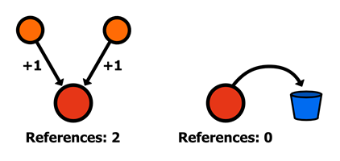
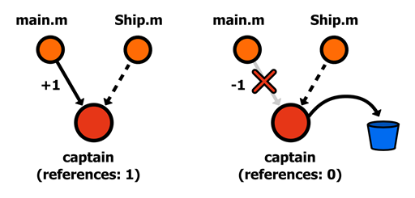
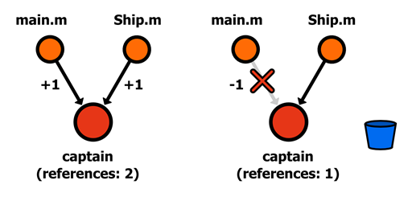

# 第四章内存管理

必须为应用程序使用的每个对象分配内存，并且在应用程序使用完内存后必须释放内存，以确保应用程序尽可能高效地使用内存。了解 Objective-C 的内存管理环境很重要，这样可以确保您的程序不会泄漏内存或试图引用不再存在的对象。



图 19:计算对对象的引用

与 C#不同，Objective-C 不*不*使用垃圾收集。相反，它使用一个引用计数环境来跟踪有多少地方在使用一个对象。只要至少有一个对该对象的引用，Objective-C 运行时就会确保该对象将驻留在内存中。但是，如果不再有对该对象的任何引用，运行时将被允许释放该对象并将内存用于其他用途。如果您试图在对象发布后访问它，您的程序很可能会崩溃。

在 Objective-C 中，有两种互斥的方法来管理对象引用:

1.  手动发送方法来增加/减少对对象的引用数量。
2.  让 Xcode 4.2(以及更高版本)新的自动引用计数(ARC)方案为您完成这项工作。

ARC 是新应用程序中管理内存的首选方式，但了解幕后发生的事情仍然很重要。本章的第一部分向您展示了如何手动跟踪对象引用，然后我们将讨论 ARC 的实际含义。

## 手动内存管理

要实验本节中的任何代码，您需要关闭自动引用计数。您可以通过单击 Xcode 导航面板中的**helloobjectvec**项目来完成此操作:


图 20:导航面板中的 HelloObjectiveC 项目

这将打开一个窗口，让您调整项目的生成设置。我们将在本系列的后半部分讨论构建设置。目前，我们只需要找到 ARC 标志。在右上角的搜索栏中，输入**自动参考计数**，会出现如下设置:


图 21:禁用自动参考计数

单击`Yes`旁边的箭头，并将其更改为`No`以禁用该项目的 ARC。这将允许您使用以下段落中讨论的内存管理方法。

手动内存管理(也称为手动保留-释放或 MMR)围绕着对象“所有权”的概念当你创建一个对象时，你被告知*拥有该对象*——当你完成它时，你有责任释放该对象。这是有意义的，因为你不会希望其他对象出现，并在你使用它的时候释放它。

对象所有权是通过引用计数实现的。当您声明一个对象的所有权时，它的引用计数增加一，当您放弃所有权时，它的引用计数减少一。这样，就有可能确保一个对象永远不会在另一个对象使用它时从内存中释放出来。[n 对象](http://developer.apple.com/library/ios/#documentation/Cocoa/Reference/Foundation/Classes/NSObject_Class/Reference/Reference.html)和[n 对象协议](https://developer.apple.com/library/mac/#documentation/Cocoa/Reference/Foundation/Protocols/NSObject_Protocol/Reference/NSObject.html)定义了支持对象所有权的四种核心方法:

*   `+(id)alloc`–为新实例分配内存，并声明该实例的所有权。这将对象的引用计数增加一。它返回一个指向分配对象的指针。
*   `-(id)retain`–要求现有对象的所有权。一个对象可能有多个所有者。这也会增加对象的引用计数。它返回一个指向现有对象的指针。
*   `-(void)release`–放弃对象的所有权。这会减少对象的引用计数。
*   `-(id)autorelease`–在当前自动释放池块结束时放弃对象的所有权。这减少了对象的引用计数，但允许您通过将实际释放推迟到稍后的时间点来继续使用对象。它返回一个指向现有对象的指针。

对于您调用的每一个`alloc`或`retain`方法，您需要在线路的某个点调用`release`或`autorelease`。你认领一个物体的次数*必须等于你释放它的次数*。*调用额外的`alloc` / `retain`会导致内存泄漏，调用额外的`release` / `autorelease`会试图访问不存在的对象，导致程序崩溃。*

您的所有对象交互——无论您是在实例方法、getter/setter 还是独立函数中使用它们——都应该遵循声明/使用/自由模式，如以下示例所示:

**内含代码示例:手动记忆**

```objc
    int main(int argc, const char * argv[]) {

        // Claim the object.
        Person *frank = [[Person alloc ] init ];

        // Use the object.
        frank.name = @"Frank";
        NSLog (@"%@", frank.name );

        // Free the object.
        [frank release ];

        return 0;
    }

```

`[Person alloc]`调用将`frank`的引用计数设置为 1，`[frank release]`将其递减为零，允许运行时处理它。请注意，尝试调用另一个`[frank release]`将导致崩溃，因为内存中不再存在`frank`变量。

当在函数中使用对象作为局部变量时(例如，前面的例子)，内存管理非常简单:只需在函数末尾调用`release`。然而，当在 setter 方法内部分配属性时，事情会变得更加棘手。例如，为名为`Ship`的新类考虑以下接口:

**包含代码示例:手动记忆–弱参考**

```objc
    // Ship.h
    #import "Person.h"

    @interface Ship : NSObject

    - (Person *)captain;
    - (void )setCaptain:(Person *)theCaptain;

    @end

```

这是一个非常简单的类，带有手动定义的`captain`属性的访问器方法。从内存管理的角度来看，setter 有几种实现方式。首先，举一个最简单的例子，新值被简单地分配给一个实例变量:

```objc
    // Ship.m
    #import "Ship.h"

    @implementation Ship {
        Person *_captain;
    }

    - (Person *)captain {
        return _captain;
    }

    - (void )setCaptain:(Person *)theCaptain {
        _captain = theCaptain;
    }

    @end

```

这创建了一个*弱引用*，因为`Ship`实例在被分配时不拥有`theCaptain`对象的所有权。虽然这没有错，并且您的代码仍然可以工作，但是理解弱引用的含义是很重要的。考虑以下片段:

```objc
    #import <Foundation/Foundation.h>
    #import "Person.h"
    #import "Ship.h"

    int main(int argc, const char * argv[]) {
        @autoreleasepool {

            Person *frank = [[Person alloc ] init ];
            Ship *discoveryOne = [[Ship alloc ] init ];

            frank.name = @"Frank";
            [discoveryOne setCaptain:frank];
            NSLog (@"%@", [discoveryOne captain ].name );

            [frank release ];

            // [discoveryOne captain] is now invalid.
            NSLog(@"%@", [discoveryOne captain]. name);

            [discoveryOne release];   
        }
        return 0;
    }

```

调用`[frank release]`会将`frank`的引用计数减为零，这意味着运行时可以解除分配。这意味着`[discoveryOne captain]`现在指向一个无效的内存地址，尽管`discoveryOne`从未释放它。

在提供的示例代码中，您会发现我们在 Person 类中添加了一个`dealloc`方法覆盖。`dealloc`在内存即将释放时调用。我们通常应该处理`dealloc`并释放我们持有的任何嵌套对象引用。在这种情况下，我们将释放我们持有的嵌套名称属性。关于`dealloc`我们将在下一章有更多的话要说。

如果你试图访问财产，你的程序很可能会崩溃。如您所见，当您使用弱引用属性时，您需要非常小心地跟踪对象引用。



图 22:对队长值的弱引用

对于更健壮的对象关系，可以使用强引用。这些是通过在分配对象时调用`retain`来声明该对象而创建的:

**包含代码示例:手动记忆-强引用**

```objc
    - (void)setCaptain:(Person *)theCaptain {
        [_captain autorelease ];
        _captain = [theCaptain retain ];
    }

```

有了强引用，其他对象对`theCaptain`对象做什么并不重要，因为`retain`确保只要`Ship`实例需要它，它就会一直存在。当然，你需要通过释放旧值来平衡`retain`调用——如果你没有释放旧值，那么每当有人给`captain`属性分配新值时，你的程序就会泄漏内存。



图 23:对队长值的强引用

### 自动释放物体

`autorelease`方法的工作原理与`release`非常相似，只是对象的引用计数不会立即递减。相反，运行时会等到当前`@autoreleasepool`块结束时，在对象上调用正常的`release`。这就是为什么`main.m`模板总是被包装在一个`@autoreleasepool`中——它确保所有用`autorelease`调用排队的对象实际上都是在程序结束时发布的*:*

```objc
    int main(int argc, const char * argv[]) {

        @autoreleasepool {

            // Insert code to create and autorelease objects here.
            NSLog (@"Hello, World!" );

            // Any autoreleased objects are *actually* released here.
        }
        return 0;
    }

```

自动释放背后的思想是给予对象的所有者放弃所有权的能力，而不实际破坏对象。在需要从工厂方法返回新对象的情况下，这是一个必要的工具。例如，考虑以下在`Ship.m`中定义的类方法:

```objc
    + (Ship *)shipWithCaptain:(Person *)theCaptian {
        Ship *theShip = [[Ship alloc ] init ];
        [theShip setCaptain:theCaptian];
        return theShip;
    }

```

该方法创建、配置并返回一个新的`Ship`实例。但是这个实现有一个严重的问题:它会导致内存泄漏。方法从不放弃对象的所有权，`shipWithCaptain`的调用者不知道他们需要释放返回的对象(也不应该必须释放)。因此，`theShip`对象永远不会从记忆中释放。这正是`autorelease`的设计初衷。正确的实现如下所示:

```objc
    + (Ship *)shipWithCaptain:(Person *)theCaptian {
        Ship *theShip = [[Ship alloc ] init ];
        [theShip setCaptain:theCaptian];
        return [theShip autorelease ];      // Must relinquish ownership!
    }

```

使用`autorelease`而不是立即的`release`可以让调用者使用返回的对象，同时在适当的位置放弃它的所有权。如果你还记得[数据类型](02.html#_Chapter_2_)一章，我们使用类级工厂方法创建了所有的基础数据结构。例如:

```objc
    NSSet *crew = [NSSet setWithObjects:@"Dave", @"Heywood", @"Frank", @"HAL", nil];

```

`setWithObjects`方法的工作原理与前面例子中描述的`shipWithCaptain`方法完全一样。它返回一个自动重新发布的对象，以便调用方可以使用该对象，而不用担心内存管理。请注意，初始化 Foundation 对象有等效的实例方法。例如，上一个示例中的`crew`对象可以手动创建，如下所示:

```objc
    // Create and claim the set.
    NSSet *crew = [[NSSet alloc ] initWithObjects:@"Dave", @"Heywood", @"Frank", @"HAL", nil ];

    // Use the set...

    // Release the set.
    [crew release];

```

但是，使用类方法如`setWithObjects`、`arrayWithCapacity`等。，一般优于`alloc` / `init`。

### 手动保留-释放属性

处理对象属性背后的内存可能是一项乏味、重复的任务。为了简化这个过程，Objective-C 包含了几个属性，用于自动执行访问器函数中的内存管理调用。以下列表中描述的属性定义了*手册*参考计数环境中的设置器行为。不要在自动参考计数环境中尝试使用`assign`和`retain`*。*

*   `assign`–存储指向新值的直接指针，无需任何`retain` / `release`调用。这是弱引用的自动化等价物。
*   `retain`–存储指向新值的直接指针，但在旧值上调用`release`，在新值上调用`retain`。这是强引用的自动化等价物。
*   `copy`–创建新值的副本。复制会声明新实例的所有权，因此会向先前的值发送一条`release`消息。这就像是对对象的一个全新实例的强引用。一般来说，复制只用于像`NSString`这样的不可变类型。

举个简单的例子，检查下面的属性声明:

```objc
    @property (retain) Person *captain;

```

`retain`属性告诉相关的`@synthesize`声明创建一个类似如下的设置器:

```objc
    - (void)setCaptain:(Person *)theCaptain {
        [_captain release ];
        _captain = [theCaptain retain ];
    }

```

可以想象，使用带有`@property`的内存管理属性比手动为您定义的每个自定义类的每个属性定义 getters 和 setters 要容易得多。

## 自动参考计数

现在您已经掌握了引用计数、对象所有权和自动重新发布块，您可以完全忘记这些了。从 Xcode 4.2 和 iOS 4 开始，Objective-C 支持自动引用计数(ARC)，这是一个预编译步骤，为您添加了必要的内存管理调用。

如果您在上一节中碰巧关闭了 ARC，您应该将其重新打开。请记住，您可以通过点击导航面板中的**helloobjectvec**项目，选择**构建设置**选项卡，并搜索**自动参考计数**来实现。


图 24:在项目的构建设置中启用自动引用计数

自动引用计数的工作原理是检查您的代码，找出一个对象需要停留多长时间，并插入`retain`、`release`和`autorelease`方法，以确保它在不再需要时被释放，但不是在您使用它时。为了不混淆 ARC 算法，你*一定不要*自己打任何`retain`、`release`或者`autorelease`的电话。例如，使用 ARC，您可以编写以下方法,`theShip`和`theCaptain`都不会被泄露，即使我们没有明确放弃它们的所有权:

**包含代码示例:ARC**

```objc
    + (Ship *)ship {
        Ship *theShip = [[Ship alloc ] init ];
        Person *theCaptain = [[Person alloc ] init ];
        [theShip setCaptain:theCaptain];
        return theShip;
    }

```

### ARC 属性

在 ARC 环境中，不应再使用`assign`和`retain`属性。相反，您应该使用`weak`和`strong`属性:

*   `weak`–指定与目标对象的非拥有关系。这很像`assign`；但是，如果值被解除分配，它具有将属性设置为`nil`的方便功能。这样，当你的程序试图访问一个无效的内存地址时就不会崩溃。
*   `strong`–指定目标对象的所属关系。这是`retain`的 ARC 等价物。它确保只要对象被分配给属性，它就不会被释放。

通过上一节`ship`类方法的实现，可以看出弱和强的区别。为了创建对船长的强引用，`Ship`的界面应该如下所示:

```objc
    // Ship.h
    #import "Person.h"

    @interface Ship : NSObject

    @property (strong ) Person *captain;

    + (Ship *)ship;

    @end

```

而实现`Ship`应该是这样的:

```objc
    // Ship.m
    #import "Ship.h"

    @implementation Ship

    @synthesize captain = _captain;

    + (Ship *)ship {
        Ship *theShip = [[Ship alloc ] init ];
        Person *theCaptain = [[Person alloc ] init ];
        [theShip setCaptain:theCaptain];
        return theShip;
    }

    @end

```

然后，可以更改`main.m`显示船长:

```objc
    int main(int argc, const char * argv[]) {
        @autoreleasepool {
            Ship *ship = [Ship ship ];
            NSLog (@"%@", [ship captain ]);
        }
        return 0;
    }

```

这将在控制台中输出类似`<Person: 0x7fd6c8c14560>`的内容，告诉我们在`ship`类方法中创建的`theCaptain`对象仍然存在。

但是，尝试将`(strong)`属性更改为`(weak)`并重新编译程序。现在，您应该会在输出面板中看到`(null)`。弱引用并不能保证`theCaptain`变量不动，所以一旦到达`ship`类方法的末尾，ARC 算法认为可以处理掉`theCaptain`。因此，`captain`属性被设置为`nil`。

## 总结

内存管理可能很痛苦，但它是构建应用程序的一个重要部分。对于 iOS 应用程序，由于移动设备的内存资源有限，适当的对象分配/处置尤为重要。我们将在本系列的第二部分 *iOS 简洁地*中详细讨论这一点。

幸运的是，新的 ARC 方案使得普通开发人员的内存管理更加容易。在大多数情况下，可以像处理 C#程序中的垃圾收集一样处理 ARC 项目——只需创建您的对象，并让 ARC 自行处置它们。然而，请注意，这只是一个实际的相似之处 ARC 实现比垃圾收集更有效。