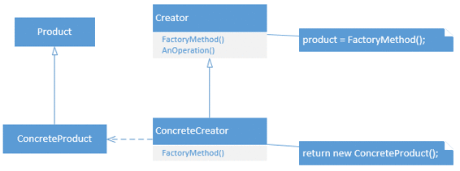
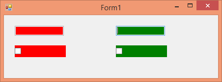
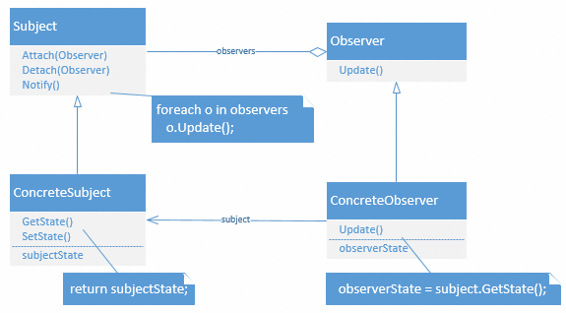
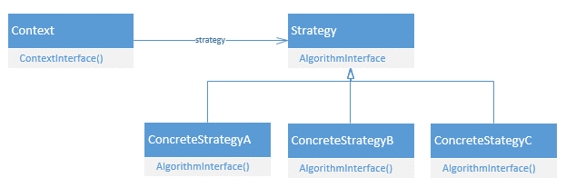
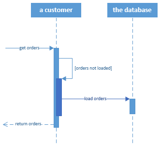
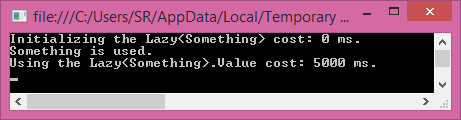
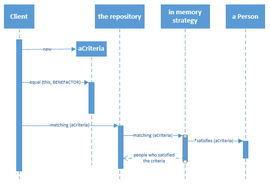

你以前在别的地方遇到过你知道已经解决的问题吗？很多人都有。设计模式是许多人面临的特定问题的一般解决方案。Erich Gamma 等人在 1995 年出版的《设计模式:可重用面向对象软件的元素》一书中首次系统地为 C++语言组织了设计模式*【2】。*

一般来说，有三种设计模式:创造型、结构型和行为型。它们不仅解决重复出现的问题，问题的形式化解决方案意味着我们不会重新发明轮子，我们可以更清楚地交流我们的代码。任何程序员都会(希望)认识到你对模式 X 的使用，然后知道如何相应地改变你的代码。

在本章中，我将讨论几个(许多)设计模式。我将包含每个模式的统一建模语言类图。UML 不在本书的范围内，所以我无法解释应该如何解释这些图。我添加它们是为了参考，它们是“官方”UML 图，所以类和方法名与示例中的不匹配。你可以用它们进行视觉解释，但是如果你没有得到它们，不要担心，这些都在文本中进行了解释。

我正在讨论的模式被《设计模式》一书作为良好的开始模式提到。它们很容易进入，你可能也会经常使用它们。

顾名思义，创造模式处理对象的创造。通过创建模式，我们可以抽象出对象实例化的过程。正如我们之前看到的，我们可以使用组合而不是继承。创建一组作为一个组一起工作的对象可能是有益的，但是我们可以像使用 DI 一样抽象这个过程，而不是硬编码要使用的具体类型。在下一节中，我们将看一些创造模式。这不是一个完整的列表，但它显示了他们可以带来的力量。


图 3:抽象工厂模式的类图

抽象工厂是最简单，也是最有用的创造性设计模式之一。抽象工厂为创建密切相关的对象定义了一个接口。再想象一下，我们正在构建一个动态的用户界面。我们需要文本框、按钮、复选框、单选按钮等。假设我们有以下接口，类似于我之前使用的例子，但是在 WinForms 中:

代码清单 37:抽象工厂

```
  public interface IControlFactory
  {
      Control CreateTextBox();
      Control CreateCheckBox();
  }

```

假设它的使用方式如下(这会产生一个几乎无法使用的用户界面):

代码清单 38:抽象工厂的使用

```
  private void CreateGui(IControlFactory factory)
  {
      Control textBox = factory.CreateTextBox();
      textBox.Location = new Point(10, 10);
      Controls.Add(textBox);
      Control checkBox = factory.CreateCheckBox();
      checkBox.Location = new Point(10, 50);
      Controls.Add(checkBox);
  }

```

我们现在可以为这个接口创建具体的类型。

代码清单 39:混凝土工厂

```
  public class RedControlFactory : IControlFactory
  {
      public Control CreateTextBox()
      {
          return new TextBox { BackColor = Color.Red };
      }

      public Control CreateCheckBox()
      {
          return new CheckBox { BackColor = Color.Red };
      }
  }

  public class GreenControlFactory : IControlFactory
  {
      public Control CreateTextBox()
      {
          return new TextBox { BackColor = Color.Green };
      }

      public Control CreateCheckBox()
      {
          return new CheckBox { BackColor = Color.Green };
      }
  }

```

现在，我们的应用程序可以使用指定的具体类型创建红色或绿色的图形用户界面。

代码清单 40:使用混凝土工厂

```
  private void Form1_Load(object sender, EventArgs e)
  {
      CreateGui(new RedControlFactory());
  }

```

结果令人震惊:


图 4:使用红色控件工厂的表单

当然，将红色控制工厂更改为绿色控制工厂会将渲染的表单从红色更改为绿色。


图 5:使用绿色控制工厂的表单

注意到添加一个 BlueControlFactory 而不破坏任何现有代码是多么容易吗？或者更好的是，我们可以用自定义控件或第三方控件替换我们丑陋的 WinForms 控件。

英寸 NET 中，您可以在使用数据库时找到抽象工厂模式。DbProviderFactory 基类就是这样一个抽象工厂，尽管通常没有必要自己实现它。

代码清单 41:抽象工厂。网

```
  public class SqlProviderFactory : DbProviderFactory
  {
      public override DbConnectionStringBuilder CreateConnectionStringBuilder()
      {
          return new SqlConnectionStringBuilder();
      }
      public override DbConnection CreateConnection()
      {
          return new SqlConnection();
      }
      public override DbCommand CreateCommand()
      {
          return new SqlCommand();
      }
      // ...
  }

```



图 6:工厂方法模式的类图

有时候创建一个抽象工厂是没有意义的。如果没有密切相关的对象，如文本框、复选框、按钮等，该怎么办？？让一个抽象工厂创建一个单独的对象(当然可能包含其他对象)，虽然可能，但感觉很奇怪(尽管可能有用)。假设我们正在构建一个生成用户界面的类。用户界面生成器可以利用图标工厂来构建用户界面。此外，我们可能有多个 UIGenerators 来为不同类型的用户构建 ui。

使用工厂方法模式，我们可以将对象的创建委托给子类。当一个基类不能预测它需要哪个子类来执行它的功能时，这尤其有用。

下一个例子还是在 WinForms 中。

这就是基本生成器(它将作为所有基本生成器的基类)。

代码清单 UIGenerators 的基类

```
  public abstract class BaseUIGenerator
  {

      public void GenerateUI(Control container)
      {
          IControlFactory factory = CreateControlFactory();
          Control textBox = factory.CreateTextBox();
          textBox.Location = new Point(10, 10);
          container.Controls.Add(textBox);
          Control checkBox = factory.CreateCheckBox();
          checkBox.Location = new Point(10, 50);
          container.Controls.Add(checkBox);

      }

      protected abstract IControlFactory CreateControlFactory();
  }

```

我们现在可以轻松地创建新的 UIGenerators。

代码清单 43:具体的 UIBuilders

```
  public class RedUIGenerator : BaseUIGenerator
  {
      protected override IControlFactory CreateControlFactory()
      {
          return new RedControlFactory();
      }
  }

  public class GreenUIGenerator : BaseUIGenerator
  {
      protected override IControlFactory CreateControlFactory()
      {
          return new GreenControlFactory();
      }
  }

```

IControlFactory 的创建现在被委托给 BaseUIGenerator 的子类。现在，您可以使用生成器来生成用户界面。

代码清单 44:生成器类的用法

```
  private void Form1_Load(object sender, EventArgs e)
  {
      BaseUIGenerator generator = new RedUIGenerator();
      builder.GenerateUI(this);
  }

```

这将像前面的示例一样构建表单:


图 7:使用归约器的表单

也可以使用其他东西作为容器，例如面板。

代码清单 45:使用带有面板的生成器

```
  private void Form1_Load(object sender, EventArgs e)
  {
      BaseUIGenerator red = new RedUIGenerator();
      red.GenerateUI(panel1);
      BaseUIGenerator green = new GreenUIGenerator();
      green.GenerateUI(panel2);
  }

```

结果是，每个面板现在都有相同的控件，但颜色不同。



图 8:带有不同 UIGenerators 的面板

这个例子也展示了抽象工厂和工厂方法模式的力量。

那个。NET Framework 也使用工厂方法模式，例如在处理数据库连接时。

代码清单 46:中的工厂方法。网

```
  using (SqlConnection connection = new SqlConnection("connString"))
  using (DbCommand cmd = connection.CreateCommand()) // Factory Method
  {
      DbParameter param = cmd.CreateParameter(); // Factory Method
      //...
  }

```


图 9:单一模式的类图

单例模式非常有趣。这很容易，但经常实施不正确。有人爱，也有人恨。那么我为什么要把它包含在这里呢？首先，Singleton 将特定类型的创建对象的数量限制为一个，这非常简洁，而且是必要的(Singleton 的例子有打印假脱机程序、文件系统等)。).还有，由于经常用错，我想教育一下，希望搞清楚什么时候用这个。最后，由于它经常被错误地实现，我们现在要一劳永逸地正确地实现它。

Singleton 的基础是一个私有构造函数。你没看错。当一个类的构造函数是私有的时，没有其他类可以创建这个类的实例。这可能会派上用场，因为类现在可以创建自己的实例并跟踪这些实例。这有点违背直觉，但是用静态场完全可能。

代码清单 47:单例的开始

```
  public class SomeSingleton
  {
      private static SomeSingleton instance;

      private SomeSingleton()
      { }
  }

```

此时，没有其他类可以创建或到达这个类的实例。接下来，我们需要另一个静态方法(或属性)来访问这个类的实例。我们还需要创建那个实例。

代码清单 48:完整的单例

```
  public class SomeSingleton
  {
      private static SomeSingleton instance;

      private SomeSingleton()
      { }

      public static SomeSingleton Instance
      {
          get
          {
              if (instance == null)
              {
                  instance = new SomeSingleton();
              }
              return instance;
          }
      }
  }

```

现在单例已经完成了。事实上，这是我们经常在代码库中找到的实现(你也经常会发现带有公共构造函数的 singleton，也就是完全没有 singleton)。

那么这个 Singleton 到底有什么问题呢？没什么，如果你的应用完全是单线程的。当您使用多线程时，这种实现仍然会产生多个实例。当两个线程试图同时获取实例时，就会发生这种情况。两个线程都将看到该实例为空，因为两个线程都没有实际创建新实例，所以我们需要为多个线程锁定这段代码。作为一个小的优化，我们不会在创建实例后锁定。下面是完整的线程安全的 Singleton:

代码清单 49:线程安全的单例

```
  public class SomeSingleton
  {
      private static SomeSingleton instance;
      private static object syncRoot = new object();

      private SomeSingleton()
      { }

      public static SomeSingleton Instance
      {
          get
          {
              if (instance == null)
              {
                  lock(syncRoot)
                  {
                      if (instance == null)
                      {
                          instance = new SomeSingleton();
                      }
                  }
              }
              return instance;
          }
      }

      public void SomeMethod()
      {
          // Just an instance method like any other.
      }
  }

```

双重空检查看起来可能很奇怪，但是请记住，当两个线程同时访问实例时，两个线程都会看到该实例为空，并且一个线程将被锁定，而另一个线程将创建该实例。在锁定的线程被释放后，它应该再次检查 null，否则它将创建第二个实例。

Singleton 上的其他方法现在可以简单地成为公共实例方法，并且行为与任何其他方法一样。请记住，Singleton 对象的状态是在整个应用程序中共享的，因为它是静态的！

那么单身族有什么问题呢？它们用得太频繁了。我见过 Singletons，一年后，在应用程序的某个地方需要第二个实例！事实证明，这个 Singleton 根本不是 Singleton！

第二，单件不能子类化。由于除了 Singleton 本身之外，应用程序的任何部分都不能访问构造函数，所以甚至子类也不能访问它(这意味着它们不能自己构造)。

最后，单线态很难测试。假设您正在测试内部使用 Singleton 的应用程序的一部分。很长一段时间里，你都没有办法嘲笑辛格尔顿。现在可以使用使用代码编织和面向方面编程(AOP)的较新的测试框架，但是感觉还是不完全正确。

那么什么时候应该使用 Singleton 呢？基本上，当您绝对确定您的应用程序永远不需要对象的第二个实例时(或者当另一个实例甚至可能对系统有害时)。它还可以方便地提供对共享资源的单点访问(如后台打印程序)。日志记录通常被认为是对单例模式的一种可接受的使用。

当许多物体。NET 逻辑上只有一个实例(比如 Application)，我不知道中有任何 Singleton 实现。NET(这并不是说您可以创建 Application 的实例，构造函数只是内部的，而不是私有的)。如果像。NET 不需要 Singletons，如果你需要它们或者你能以不同的方式解决你的问题，你应该非常仔细地思考。

结构模式是关于使对象一起工作，并相应地组织代码。在创造模式是关于对象的创造的地方，结构模式是关于使对象一起工作，但是这些对象不知道彼此的内部。

### 适配器


图 10:适配器模式的类图

一种简单且众所周知的结构模式是适配器模式，或包装器。使用适配器模式，我们可以让两个类一起工作，即使它们有不兼容的接口。假设我们正在创建一个数据检索系统，但是客户端还没有决定使用 Oracle 或 SQL Server，或者他们将来可能会切换。假设这两个数据库都带有一些不同类和方法的应用编程接口(当然，两者已经兼容。NET 应用编程接口)。下面的代码被简化了，但是显示了适配器的用法:

代码清单 50:外部数据库应用编程接口

```
  public class SqlServerApi
  {
      public DataTable GetData()
      {
          return new DataTable();
      }

      public void SendData(DataTable data)
      {
          // ...
      }
  }

  public class OracleApi
  {
      public object GetQuery()
      {
          return new object();
      }

      public void ExecQuery(object data)
      {
          // ...
      }
  }

```

这里的问题是，如果我们选择一个 API，我们就不能轻易用另一个替换它。SqlServerApi 使用数据表，而 Oracle 使用普通对象，这些方法有不同的名称，等等。在现实世界中，你会发现两个接口使用不同的类，有许多不同的方法(另一个没有)，等等。因此，让我们创建一个可以将这两个不兼容的应用编程接口联系在一起的接口。问题是我们将如何处理数据表。我们的接口可以处理数据表，然后我们应该让它为 Oracle 工作，或者我们可以处理对象并将其转换为用于 SQL Server 的数据表。第三个选项是创建一个自定义对象，该对象可以转换为普通对象和数据表。为了简单起见，我们将使用对象。

代码清单 51: IDbApiAdapter

```
  public interface IDbApiAdapter
  {
      object GetData();
      void SendData(object data);
  }

```

现在，我们可以为 SQL Server 和 Oracle 实现这一点。

代码清单 52: IDbApiAdapter 实现

```
  public class SqlServerApiAdapter : IDbApiAdapter
  {
      private SqlServerApi api = new SqlServerApi();

      public object GetData()
      {
          DataTable table = api.GetData();
          object o = ConvertToObject(table);
          return o;
      }

      private object ConvertToObject(DataTable table)
      {
          // ...
          return null; // Placeholder.
      }

      public void SendData(object data)
      {
          DataTable table = ConvertToDataTable(data);
          api.SendData(table);
      }

      private DataTable ConvertToDataTable(object obj)
      {
          // ...
          return new DataTable();
      }
  }

  public class OracleApiAdapter : IDbApiAdapter
  {
      private OracleApi api = new OracleApi();

      public object GetData()
      {
          return api.GetQuery();
      }

      public void SendData(object data)
      {
          api.ExecQuery(data);
      }
  }

```

如您所见，从数据表转换到数据表现在是一个“实现细节”只要公共 API 是正确的，我们并不真正关心 SqlServerApiAdapter 是如何做到的(可能使用反射)。您现在可以使用 IDbApiAdapter，并将特定适配器的创建留给系统的另一部分(使用工厂或依赖注入)。

代码清单 53:IDbApiAdapter 的用法

```
  static void Main(string[] args)
  {
      IDbApiAdapter adapter = DbApiFactory();
      object o = adapter.GetData();
      adapter.SendData(new object());
  }

  static IDbApiAdapter DbApiFactory()
  {
      return new SqlServerApiAdapter();
  }

```

适配器模式用于。. NET 在处理旧的 COM 对象时。引用组件对象时。NET 创建一个可以在中使用的包装器(或适配器)。NET 调用相应的 COM 方法。


图 11:复合模式的类图

复合也是比较容易的模式之一。假设你有一个东西的集合，如果你喜欢的话，一个列表<something>。也许所有这些“东西”也收集了同样的东西，儿童的东西。那样的话，我们就会有一棵树了。现在某物有一些操作，当那个操作被执行时，同样的操作应该被执行在所有的子某物上。听起来很抽象，但是假设某个东西是一个控件(比如文本框、复选框、数据网格等)。).所以我们有一个控件，它有子控件，每个子控件也可以有子控件。该操作正在呈现控件。因此，当我们呈现我们最上面的控件时，所有子控件以及这些子控件的子控件也应该呈现。</something>

下一个例子可能看起来有点牵强，但是创建一个复合模式的例子并不容易，所以请耐心等待。在这个例子中，我们将一个符号一个符号地打印句子。所以我们的操作将是打印。我们需要能够打印单个符号，如“c”或“#”，所以让我们创建一个可以做到这一点的类。

代码清单 54:可打印的复合文件

```
  public interface IPrintable
  {
      void Print();
  }

  public class Symbol : IPrintable
  {
      private char symbol;

      public Symbol(char c)
      {
          symbol = c;
      }

      public void Print()
      {
          Console.Write(symbol);
      }
  }

```

这样，我们就可以创建一个包含任何单个符号的 IPrintable。为了方便起见，让我们创建一些额外的 IPrintables(例如)。

代码清单 55:附加的可打印实现

```
  public class LineBreak : IPrintable
  {
      public void Print()
      {
          Console.WriteLine();
      }
  }

  public class Space : IPrintable
  {
      public void Print()
      {
          Console.Write(" ");
      }
  }

```

现在我们需要一个可以包含多个符号的复合类，一个书写类。

代码清单 56:(复合)编写类

```
  public class Writing : IPrintable
  {

      private List<IPrintable> printables = new List<IPrintable>();

      public void Add(IPrintable printable)
      {
          printables.Add(printable);
      }

      public void Remove(IPrintable printable)
      {
          printables.Remove(printable);
      }

      public IPrintable GetPrintable(int index)
      {
          return printables[index];
      }

      public void Print()
      {
          foreach (IPrintable printable in printables)
          {
              printable.Print();
          }
      }

  }

```

就这样。我们现在可以使用这些类来编写单词和句子，并将其打印在屏幕上。在一个简单的控制台应用程序中，用法如下:

代码清单 57:复合用法

```
  // Create the writing 'hello'.
  Writing hello = new Writing();
  hello.Add(new Symbol('h'));
  hello.Add(new Symbol('e'));
  hello.Add(new Symbol('l'));
  hello.Add(new Symbol('l'));
  hello.Add(new Symbol('o'));
  // Add a line break.
  LineBreak br = new LineBreak();
  hello.Add(br);

  // Print hello.
  hello.Print();
  // Remove the line break, so we can re-use hello.
  hello.Remove(br);

  // Create the writing 'bye'.
  Writing bye = new Writing();
  bye.Add(new Symbol('b'));
  bye.Add(new Symbol('y'));
  bye.Add(new Symbol('e'));

  // Create a writing consisting of the writings
  // hello and bye separated by a space.
  Writing helloBye = new Writing();
  helloBye.Add(hello);
  helloBye.Add(new Space());
  helloBye.Add(bye);

  // Print all the printables.
  helloBye.Print();

  Console.ReadKey();

```

英寸 NET 中，如前所述，在 WinForms 中呈现控件时会使用这种模式(可能在 WPF 和 ASP.NET 也是如此)。


图 12:装饰模式的类图

装饰模式可以用来动态地向对象添加功能。当一个对象可能有多个不总是同时使用的功能时，比如同一数据的不同表示，这尤其有用。在这方面，它为继承提供了一个灵活的选择。

假设我们有一些文本消息，我们想要打印和/或发送电子邮件和/或传真(是的，人们仍然这样做)和/或将其发送到外部系统。此外，消息必须始终保存到数据库中。首先，我们需要包含我们想要处理的消息的 Message 类，并且我们可以实现默认的过程(毕竟，我们总是需要将消息发送到数据库)。

代码清单 58:消息类

```
  public interface IMessage
  {
      string Msg { get; set; }
      void Process();
  }

  public class Message : IMessage
  {
      public string Msg { get; set; }
      public void Process()
      {
          Console.WriteLine(String.Format("Saved '{0}' to database.", Msg));
      }
  }

```

我们现在可以创建一个基础装饰器。请注意，我们总是需要向构造函数传递另一个 IMessage(或者我们会得到一个 NullReference，您可能想在那里添加一个检查)。Msg 属性只是委托给根 IMessage。

代码清单 59:一个基础装饰器

```
  public abstract class BaseMessageDecorator : IMessage
  {
      private IMessage innerMessage;

      public BaseMessageDecorator(IMessage decorator)
      {
          innerMessage = decorator;
      }

      public virtual void Process()
      {
          innerMessage.Process();
      }

      public string Msg
      {
          get
          {
              return innerMessage.Msg;
          }

          set
          {
              innerMessage.Msg = value;
          }
      }
  }

```

现在我们有了基础装饰器，我们可以创建一些子装饰器。

代码清单 60:子装饰者

```
  public class EmailDecorator : BaseMessageDecorator
  {
      public EmailDecorator(IMessage decorator)
          : base(decorator)
      { }

      public override void Process()
      {
          base.Process();
          Console.WriteLine(String.Format("Sent '{0}' as email.", Msg));
      }
  }

  public class FaxDecorator : BaseMessageDecorator
  {
      public FaxDecorator(IMessage decorator)
          : base(decorator)
      { }

      public override void Process()
      {
          base.Process();
          Console.WriteLine(String.Format("Sent '{0}' as fax.", Msg));
      }
  }

  public class ExternalSystemDecorator : BaseMessageDecorator
  {
      public ExternalSystemDecorator(IMessage decorator)
          : base(decorator)
      { }

      public override void Process()
      {
          base.Process();
          Console.WriteLine(String.Format("Sent '{0}' to external system.", Msg));
      }
  }

```

我们现在可以用许多不同的方式处理我们的信息；我们可以把它保存到数据库中，我们可以保存它并通过电子邮件或传真或发送到外部系统；我们可以保存，电子邮件和传真；保存，发邮件，并发送到外部系统；或者保存、传真并发送到外部系统。美妙之处在于，我们可以在不破坏现有功能的情况下轻松添加新功能。

在简单的控制台应用程序中，用法可能如下:

代码清单 61:装饰者的用法

```
  IMessage msg = new Message();
  msg.Msg = "Hello";

  IMessage decorator = new EmailDecorator(
      new FaxDecorator(
          new ExternalSystemDecorator(msg)));
  decorator.Process();

  Console.WriteLine();
  decorator = new EmailDecorator(msg);
  decorator.Msg = "Bye";
  decorator.Process();

  Console.ReadKey();

```

英寸 NET 中，我们可以找到使用流时的装饰模式。许多流，如内存流、缓冲流和文件流，提供相同的基本功能(由流基类提供)，但它们在内部的工作方式不同。所以不同的流装饰了 Stream 类。在这些类的使用中，我们经常可以找到一个策略模式(稍后解释)。

行为模式是关于改变算法和类的运行时行为。如果创建模式是关于对象的创建，而结构模式是关于对象如何协同工作，那么行为模式更多的是关于改变这些对象的实现。有了这三种模式，您可以构建高度可扩展和可维护的软件，这些软件被整齐地组织成小块代码。



图 13:观察者模式的类图

有了观察者模式，一个类，一个所谓的可观察的，可以通知其他类，观察者，变化。。NET 事件是使用这种模式实现的。

关于. NET 中的观察者模式的一些快速注释。NET 已经有了事件，应该没有必要自己实现这个模式。让我们暂时假设你仍然想。您可能会从两个接口开始:IObservable 和 IObserver。然后你会发现。NET 已经有了这些接口(在通用变体中)。不要使用它们。我见过。NET 接口在观察者模式中使用，但是这些接口主要用于反应式扩展(Rx)。我不能在这里解释 Rx，但是接口对于我将要在这里讨论的“传统”观察者模式没有什么意义。

让我们从定义 IObservable 和 IObserver 接口开始。

代码清单 62:观察者模式接口

```
  public interface IObservable
  {
      void Attach(IObserver observer);
      void Detach(IObserver observer);
      void Notify();
  }

  public interface IObserver
  {
      void Update(IObservable observable);
  }

```

现在让我们实现 IObservable。我们将创建一个产品库存，每次库存发生变化时，我们都会通知观察者(也称为监听器)。代码有点长，主要是因为底部的属性。请注意，这些属性与观察者模式无关，它们只是识别股票所必需的。

代码清单 63:可观察的实现

```
  public class Stock : IObservable
  {
      private List<IObserver> observers = new List<IObserver>();
      private string productName;
      private int noOfItemsInStock;

      public Stock(string name)
      {
          productName = name;
      }

      public void Attach(IObserver observer)
      {
          observers.Add(observer);
      }

      public void Detach(IObserver observer)
      {
          observers.Remove(observer);
      }

      public void Notify()
      {
          foreach (IObserver observer in observers)
          {
              observer.Update(this);
          }
      }

      public string ProductName
      {
          get
          {
              return productName;
          }
      }

      public int NoOfItemsInStock
      {
          get
          {
              return noOfItemsInStock;
          }
          set
          {
              noOfItemsInStock = value;
              Notify();
          }
      }
  }

```

现在我们可以创造一些观察者。

代码清单 64:观察者

```
  public class Seller : IObserver
  {
      public void Update(IObservable observable)
      {
          Console.WriteLine("Seller was notified about the stock change.");
      }
  }

  public class Buyer : IObserver
  {
      public void Update(IObservable observable)
      {
          Console.WriteLine("Buyer was notified about the stock change.");
      }
  }

```

在一个简单的控制台应用程序中使用现在非常容易。

代码清单 65:观察者的用法

```
  Stock stock = new Stock("Cheese");
  stock.NoOfItemsInStock = 10;

  // Register observers.
  Seller seller = new Seller();
  stock.Attach(seller);
  Buyer buyer = new Buyer();
  stock.Attach(buyer);

  stock.NoOfItemsInStock = 5;
  Console.ReadKey();

```

不过，你会发现这种方法有一个很大的警告。买方和卖方得到通知，但他们不知道是什么。只是一些可观察的东西。这里有几个选择。首先，我们可以简单地将 IObservable 转换为 Stock。例如，卖方类现在看起来如下:

```
  public class Seller : IObserver
  {
      public void Update(IObservable observable)
      {
          Stock stock = (Stock)observable;
          Console.WriteLine(String.Format("Seller was notified about the stock change of {0} to {1}
  items.",
              stock.ProductName,
  stock.NoOfItemsInStock));
      }
  }

```

这种方法在 WinForm 事件中采用，其中每个控件事件都有(对象发送者，事件参数 e)的签名。发送者可以是任何类型的控件，如果您想对发送者(事件的发起者)做任何有用的事情，应该对其进行强制转换。

第二种方法是使您的 IObservable 不那么通用(或更具体)。在这种情况下，IObservable 将获得 ProductName 和 NoOfItemsInStock 属性(您可能希望将其重命名为 IStock)。

代码清单 66:一个更具体的可观察对象

```
  public interface IObservable
  {
      void Attach(IObserver observer);
      void Detach(IObserver observer);
      void Notify();
      string ProductName { get; }
      int NoOfItemsInStock { get; set; }
  }

  public class Seller : IObserver
  {
      public void Update(IObservable observable)
      {
          Console.WriteLine(String.Format("Seller was notified about the stock change of {0} to {1}
  items.",
              observable.ProductName,
  observable.NoOfItemsInStock));
      }
  }

```

当然，这种方法的问题是，您不能为其他类重用 IObservable。

最后，但并非最不重要的是，您可能想要使用泛型。这应该能解决你所有的问题。请记住，对于反应式扩展，IObserver <t>和 IObservable <t>已经存在，因此我们将不得不使用另一个名称。我用了 INotifier 和 IListener。变化不大，但实现起来稍微困难一些。</t></t>

代码清单 67:通用可观察

```
  public interface INotifier<T>
  {
      void Attach(IListener<T> observer);
      void Detach(IListener<T> observer);
      void Notify();
  }

  public interface IListener<T>
  {
      void Update(T observable);
  }

  public class Stock : INotifier<Stock>
  {
      private List<IListener<Stock>> observers = new List<IListener<Stock>>();
      private string productName;
      private int noOfItemsInStock;

      public Stock(string name)
      {
          productName = name;
      }

      public void Attach(IListener<Stock> observer)
      {
          observers.Add(observer);
      }

      public void Detach(IListener<Stock> observer)
      {
          observers.Remove(observer);
      }

      public void Notify()
      {
          foreach (IListener<Stock> observer in observers)
          {
              observer.Update(this);
          }
      }

      public string ProductName
      {
          get
          {
              return productName;
          }
      }

      public int NoOfItemsInStock
      {
          get
          {
              return noOfItemsInStock;
          }
          set
          {
              noOfItemsInStock = value;
              Notify();
          }
      }
  }

  public class Seller : IListener<Stock>
  {
      public void Update(Stock observable)
      {
          Console.WriteLine(String.Format("Seller was notified about the stock change of {0} to {1}
  items.",
              observable.ProductName, observable.NoOfItemsInStock));
      }
  }

```



图 14:策略模式的类图

策略模式允许您封装一系列算法并可互换地使用它们。你可以想到战略模式的许多应用，例如一个视频游戏，其中战场上的单位在许多方面都表现相同，例如移动和渲染，但是攻击策略不同。一个单位可能是进攻性的，而另一个单位是防御性的。进攻或防守算法可以注入每个单位。
另一个例子是列表的排序。根据列表的大小，您可能想要使用另一种排序算法，但是您不想将每个算法硬编码到列表类中。

所以我们来做个小游戏。这是一个简单的控制台应用程序，我们只需按下任何按钮，移动我们的单位，这可能会导致敌人遭遇(继续按下按钮或按下退出退出)。每个单位对敌人遭遇的反应不同。首先，让我们定义一个通用的单元类。

代码清单 68:策略模式

```
  public interface IUnitBehavior
  {
      void ReactToOpponent();
  }

  public class Unit
  {
      private string name;
      private IUnitBehavior behavior;

      public Unit(string name, IUnitBehavior behavior)
      {
          this.behavior = behavior;
          this.name = name;
      }

      public void Render()
      {
          Console.WriteLine(@"\o/ ");
          Console.WriteLine(@" O ");
          Console.WriteLine(@"/ \");
      }

      public void Move()
      {
          Console.WriteLine(String.Format("{0} moves...", name));
      }

      public void ReactToOpponent()
      {
          behavior.ReactToOpponent();
      }

  }

```

如你所见，渲染和移动方法对每个单位都是一样的。然而，ReactToOpponent 是通过构造函数注入的。IUnitBehavior 接口定义了要使用的最终策略。所以让我们定义一些策略。

代码清单 69:一些策略

```
  public class WarriorBehavior : IUnitBehavior
  {
      public void ReactToOpponent()
      {
          Console.WriteLine("\"ATTACK!!!\"");
      }
  }

  public class DefenderBehavior : IUnitBehavior
  {
      public void ReactToOpponent()
      {
          Console.WriteLine("\"Hold the line!\"");
      }
  }

```

现在让我们把单位和行为粘在一起。

代码清单 70:最终游戏

```
  Unit warrior = new Unit("Warrior", new WarriorBehavior());
  Unit defender = new Unit("Defender", new DefenderBehavior());

  List<Unit> units = new List<Unit>();
  units.Add(warrior);
  units.Add(defender);

  foreach (Unit unit in units)
  {
      unit.Render();
      Console.WriteLine();
  }

  Console.WriteLine("Your troops are on an important mission!");
  Console.WriteLine("Press Escape to quit or any other key to continue.");
  Console.WriteLine();
  Random rnd = new Random();
  while (Console.ReadKey().Key != ConsoleKey.Escape)
  {
      foreach (Unit unit in units)
      {
          unit.Move();
      }
      Console.WriteLine();

      // Returns 0, 1, or 2.
      if (rnd.Next(3) == 0)
      {
          Console.WriteLine("The enemy attacks!");
          foreach (Unit unit in units)
          {
              unit.ReactToOpponent();
          }
      }
      else
      {
          Console.WriteLine("Nothing happened...");
      }
      Console.WriteLine();
  }

```

这是相当多的代码，但真正重要的是前两行。我们定义了两个单位，但是有另一个单位行为。当敌人攻击时(3 次机会中的 1 次)，你会看到每个单位都按照自己的策略行动。添加另一个策略也变得很容易。

代码清单 71:添加新策略

```
  // ...
  Unit priest = new Unit("Priest", new PriestBehavior());
  // ...
  units.Add(priest);
  // ...

  public class PriestBehavior : IUnitBehavior
  {
      public void ReactToOpponent()
      {
          Console.WriteLine("\"Heal our troops!\"");
      }
  }

```

那个。NET Framework 也使用了策略模式，比如在调用 List <t>时。排序()。你可以通过一个可选的 IComparer <t>。让我们来看看，因为这是另一个好例子。我们将按名字和姓氏对人们进行分类。</t></t>

代码清单 72:人员类别和公司

```
  public class Person
  {
      public string FirstName { get; set; }
      public string LastName { get; set; }
  }

  public class FirstNameSorter : IComparer<Person>
  {
      public int Compare(Person x, Person y)
      {
          return x.FirstName.CompareTo(y.FirstName);
      }
  }

  public class LastNameSorter : IComparer<Person>
  {
      public int Compare(Person x, Person y)
      {
          return x.LastName.CompareTo(y.LastName);
      }
  }

```

我们现在可以创建一个列表，将一些人放入其中，并按名字或姓氏对他们进行排序。

代码清单 73:用策略对列表进行排序

```
  Person bill = new Person { FirstName = "Bill", LastName = "Gates" };
  Person steve = new Person { FirstName = "Steve", LastName = "Ballmer" };
  Person satya = new Person { FirstName = "Satya", LastName = "Nadella" };

  List<Person> ceos = new List<Person>();
  ceos.Add(bill);
  ceos.Add(steve);
  ceos.Add(satya);

  ceos.Sort(new FirstNameSorter());
  foreach (Person p in ceos)
  {
      Console.WriteLine(String.Format("{0} {1}", p.FirstName, p.LastName));
  }
  Console.WriteLine();

  ceos.Sort(new LastNameSorter());
  foreach (Person p in ceos)
  {
      Console.WriteLine(String.Format("{0}, {1}", p.LastName, p.FirstName));
  }
  Console.ReadKey();

```


图 15:模板方法的类图

模板方法模式真的非常简单。事实上，它只不过是简单的继承和方法重写。这是策略模式的继承变体(继承与委托)。

假设我们有一个连接到数据库、构建查询、执行查询、检索结果以及最终关闭连接的通用模式。我们可以毫不夸张地用代码写下这个例子，而不用担心细节。

代码清单 74:模板方法

```
  public abstract class BaseDataRetriever
  {
      public DataTable RetrieveData()
      {
          Connect();
          string query = GetQuery();
          DataTable result = ExecQuery(query);
          Close();
          return result;
      }

      protected abstract void Connect();
      protected abstract string GetQuery();
      protected abstract DataTable ExecQuery(string query);
      protected abstract void Close();
  }

```

假设我们需要从一个 SQL Server 数据库中检索产品表。我们可以继承 BaseDataRetriever 并填充空白。

代码清单 75:模板类的继承

```
  public class ProductRetriever : BaseDataRetriever
  {
      private string connString;
      private SqlConnection connection;

      public ProductRetriever(string connString)
      {
          this.connString = connString;
      }

      protected override void Connect()
      {
          connection = new SqlConnection(connString);
      }

      protected override string GetQuery()
      {
          return "SELECT Id, Name, Price FROM Product";
      }

      protected override DataTable ExecQuery(string query)
      {
          using (SqlDataAdapter adapter = new SqlDataAdapter(query, connection))
          {
              DataTable result = new DataTable();
              adapter.Fill(result);
              return result;
          }
      }

      protected override void Close()
      {
          connection.Dispose();
          connection = null;
      }
  }

```

同样，我们可以为 ODBC、Oracle 或您拥有的任何东西实现它。

增加另一个层次的深度是有意义的，因此我们可以为 SQL Server 实现这一点，但不能使其特定于查询。只需将 ProductRetriever 重命名为 SqlDataRetriever，使其抽象，并移除 GetQuery 方法。现在，产品检索器将如下所示:

代码清单 76:产品检索器

```
  public class ProductRetriever : SqlDataRetriever
  {
      public ProductDataRetriever(string connString)
          : base(connString)
      { }

      protected override string GetQuery()
      {
          return "SELECT Id, Name, Price FROM Product";
      }
  }

```

现在创建一个 CustomerRetriever 非常容易。

代码清单 77: CustomerRetriever

```
  public class CustomerRetriever : SqlDataRetriever
  {
      public CustomerRetriever(string connString)
          : base(connString)
      { }

      protected override string GetQuery()
      {
          return "SELECT Id, FirstName, LastName, Address FROM
  Customer";
      }
  }

```

CustomerRetriever 类(或任何 BaseDataRetriever 类)的使用是直截了当的。

代码清单 78:模板方法的使用

```
  CustomerRetriever retriever = new CustomerRetriever("connString");
  DataTable table = retriever.RetrieveData();
  // Do stuff with the data.

```

英寸我们经常发现模板方法。基本上，您可以覆盖的每个方法都是模板方法。一个这样的例子是 Collection <t>类，它是定制集合的基类。</t>

代码清单 79:自定义集合

```
  public class UniqueCollection<T> : Collection<T>
  {
      // Only insert or set items if
      // the item is not yet in the collection.
      protected override void InsertItem(int index, T item)
      {
          if (!this.Contains(item))
          {
              .InsertItem(index, item);
          }
      }

      protected override void SetItem(int index, T item)
      {
          if (!this.Contains(item))
          {
              .SetItem(index, item);
          }
      }
  }

```

到目前为止讨论的模式都是“经典”模式，在《设计模式:可重用面向对象软件的元素》一书中有系统的描述。然而，还有更多的设计模式。马丁·福勒(Martin Fowler)[【3】](part0002_split_045.html#_ftn3)(在 Java 中)的《企业应用程序架构的 T2 模式》一书中讨论了其中的许多问题。福勒书中讨论的模式涵盖了代码库的不同领域，例如特定于您的领域逻辑的模式、与数据源的通信、并发性和 web 会话。我将讨论一些广为人知和广泛使用的模式。

马丁·福勒使用了大量的 UML 序列图。和 UML 类图一样，序列图也不在本书的讨论范围之内，但我将添加它们以供参考和可视化解释。



图 16:惰性加载模式的序列图

惰性加载模式是指在你真正使用它之前不获取数据。它有四种风格:惰性初始化、虚拟代理、值持有者和幽灵。我们将只关注惰性初始化，因为它是最常见的，讨论它们会占用太多空间。我也想讨论这一个，因为它已经变得越来越相关和广泛使用。函数式语言，比如 Haskell，对所有东西都有默认的惰性加载策略。这种做法在中国越来越普遍。NET 也是如此。

当我们实现单例模式时，我们实际上已经看到了延迟加载模式。在实际使用对象之前，不会创建单例实例。让我们再看一下(简单的)实现。

代码清单 80:惰性初始化

```
  public class SomeSingleton
  {
      private static SomeSingleton instance;

      private SomeSingleton()
      { }

      public static SomeSingleton Instance
      {
          get
          {
              if (instance == null)
              {
                  instance = new SomeSingleton();
              }
              return instance;
          }
      }
  }

```

如果某个单身者。实例没有在代码中的任何地方被引用，那么某些单例将永远不会被初始化。这就是所谓的惰性初始化。当一个对象需要很长时间来加载，而你又不想执行代码，除非你真的必须这样做时，它特别有用。

那个。NET Framework 有一个惰性<t>类，用于惰性加载任何类。假设我们有一个需要五秒钟初始化的类。</t>

代码清单 81:繁重的初始化

```
  public class Something
  {
      public Something()
      {
          // Fake some heavy computation.
          Thread.Sleep(5000);
      }

      public void PrintUse()
      {
          Console.WriteLine("Something is used.");
      }
  }

```

通过使用惰性<t>包装器，我们实际上不需要创建实例，直到我们使用它。</t>

代码清单 82:懒惰的用法

```
  Stopwatch sw = new Stopwatch();
  sw.Start();
  Lazy<Something> lazy = new Lazy<Something>();
  sw.Stop();
  Console.WriteLine(String.Format(
      "Initializing the Lazy<Something> cost: {0}
  ms.",
      sw.ElapsedMilliseconds));

  sw.Restart();
  lazy.Value.PrintUse();
  sw.Stop();
  Console.WriteLine(String.Format(
      "Using the Lazy<Something>.Value cost: {0}
  ms.",
      sw.ElapsedMilliseconds));
  Console.ReadKey();

```

结果应该不奇怪。



图 17:使用惰性<t>的结果</t>

我们也可以使用复杂的初始化，使用 lambda 方法。

代码清单 83:具有复杂初始化的惰性

```
  // ...
  Lazy<Something> lazy = new Lazy<Something>(() => new Something(new object()));
  // ...

  public class Something
  {
      public Something(object someParam)
      {
          // ...

```

那个。NET Framework 在实体框架(一种对象关系映射器)中广泛使用了延迟加载。实体框架将数据库表映射到中的类。NET，并且可以使用这些类更新您的数据库。现在假设你有一个销售订单表；每个销售订单都有销售订单行，这是另一个表。C#中的类具有相同的名称和属性。另外，您的 C#类有一个属性，SalesOrderLines，它实际上是 SalesOrderLines 的集合。加载销售订单时，您的销售订单行将为空，直到您实际请求销售订单的销售订单行。如果您需要所有销售订单行，这不一定会更快，但是如果您只需要其中的一些，这可能会非常快速和方便。请参见本节开头的序列图以获得可视化效果。


图 18:MVC 模式的类图

《设计模式》一书已经提到了在 Smalltalk-80 中使用的模型视图控制器模式，简称 MVC，但只是说这个模式利用了观察者、合成和策略设计模式。然而，MVC 模式还有更多。它使用三个组件:模型、视图和控制器[在此插入埃尼奥·莫里康原声]。该模型包含该领域的一些信息，如产品、客户或销售订单。模型严格是非用户界面的。用户界面信息在视图对象中。如果这是网页，视图可能包含 HTML。或者它可能包含一些显示在屏幕上的用户界面小部件。第三个组件，控制器，将这两者结合在一起。它处理来自视图的请求，检索和操作数据，然后将数据放入模型中，模型返回给视图，视图可以使用模型在屏幕上显示。

整个 MVC 模型是关于关注点分离(SoC)。事实上，使用 MVC 可以很容易地将系统的一部分换成其他部分。在 web 开发中，您可以交换视图或使用多个视图来表示相同的数据。

模型视图控制器模式在今天如此流行，以至于微软围绕它创建了一个完整的框架，并以该模式命名为 ASP.NET MVC。检验这一点的最好方法是简单地启动 Visual Studio 并创建一个新的 ASP.NET MVC 项目(ASP.NET 网络应用程序)。你会得到大量的文件和文件夹(经常听到关于 ASP.NET MVC 的抱怨)，但是我们感兴趣的类是控制器、模型和视图文件夹。例如，家庭控制器有三种方法:索引、关于和联系。它们都返回一个没有模型的视图。AccountController 有一些返回视图并传递模型的方法，但是在这里讨论它们有点复杂(毕竟这不是一本关于 ASP.NET MVC 的书)。如果您查看模型，例如 AccountViewModels 中的类，您会看到这些只是带有一些属性的类。模型在帐户控制器中初始化，并在帐户视图(由许多 cshtml 文件组成)中使用。对于一些更简单的视图，请查看主页视图

举个简单的例子，我将创建一个新的 ASP.NET MVC 项目，将其重命名为“MyMvcApp”，将身份验证类型更改为“无身份验证”，并创建一个非常简单的静态网站。首先，扔掉所有视图，除了 Home/Index.cshtml。现在我想在我的视图中显示一些数据，所以我要创建一个模型，PersonModel。

代码清单 84:模型

```
  public class PersonModel
  {
      public string FirstName { get; set; }
      public string LastName { get; set; }
  }

```

接下来，我将更改 HomeController，以便它将一个 PersonModel 传递给视图。

代码清单 85:控制器

```
  public class HomeController : Controller
  {
      public ActionResult Index()
      {
          PersonModel model = new PersonModel();
          model.FirstName = "Bill";
          model.LastName = "Gates";
          return View(model);
      }
  }

```

最后，我将更改我的主页/索引视图(这并不是完全有效的 HTML，但它会这样做)，这样它将在模型中显示数据。

代码清单 86:视图

```
  @using MyMvcApp.Models
  @model PersonModel

  <p>The
  person that was passed in the PersonModel is: @Model.FirstName
  @Model.LastName</p>

```

这将显示以下网页:


图 19:结果视图

现在，如果您将控制器中的名称更改为其他名称，它将反映在视图中。您不必更改模型或视图。概括地说，用户向控制器请求视图。控制器(可选)创建模型，将其传递给视图，并返回视图。视图在屏幕上显示模型中的数据。

与 MVC 相关的两种设计模式是模型视图视图模型(MVVM)和模型视图演示器(MVP)。

MVP 是用户界面的一种模式。演示者位于模型和视图之间，并格式化数据，以便视图可以使用它。

在 MVVM，视图模型是视图用于显示的视图的抽象。由于视图的抽象，双向绑定成为可能(模型中的更新直接呈现在视图中，视图中的更新直接推送到模型中)。MVVM 是为微软的视窗演示基金会(WPF)创建的，但现在也可以在许多 JavaScript 框架中找到，比如 KnockoutJS 和 AngularJS。
MVC、MVP 和 MVVM 一起被称为 MV*模式。请注意，它们并不相互排斥。



图 20:存储库模式的序列图

存储库模式是一种困难的模式，幸运的是，您不必自己实现它。它利用了其他模式，即数据映射器和查询对象。数据映射器是一段将数据库记录映射到 C#域对象的代码。数据库和域对象彼此不知道。查询对象是一个 C#对象，其行为类似于数据库 WHERE 子句，并且可以传递给数据映射器(图中的“aCriteria”)。
最后，存储库是一个类似集合的接口，可以检索域对象，并位于您的域和数据映射层之间。再次强调，这样做的好处是分离了关注点。您的域对象不知道您的数据库，可以重用用于其他目的。您的数据库层可以交换(例如，从 Oracle 到 SQL Server)，您只需更改您的数据映射器。您的数据映射器、查询对象和存储库也可以在其他项目中重用。

虽然我很想构建一个数据映射器、查询对象和存储库，但我们不会这么做。那要花很多时间，而且可以是一本书。相反，我将创建一个简单的控制台应用程序，保存它，向我的项目添加一个 ADO.NET 实体模型，并连接到某个数据库，在那里我有一个 Person 表。实体框架将为我生成 Person 类(我不会采用代码优先的方法)。

代码清单 87:生成的人员类

```
  public partial class Person
  {
      public int Id { get; set; }
      public string FirstName { get; set; }
      public string LastName { get; set; }
      public Nullable<DateTime> DateOfBirth { get; set; }
  }

```

它还将生成存储库，该存储库继承自数据库上下文，并允许访问我的个人对象，就像它们只是内存中的 C#对象一样。

代码清单 88:生成的数据库上下文

```
  public partial class ApplicationEntities : DbContext
  {
      public ApplicationEntities()
          : base("name=ApplicationEntities")
      {
      }

      protected override void OnModelCreating(DbModelBuilder modelBuilder)
      {
          throw new UnintentionalCodeFirstException();
      }

      public virtual DbSet<Person> People { get; set; }
  }

```

美丽来了。存储库模式的使用(当正确完成时)非常简单。

代码清单 89:存储库的使用

```
  using (ApplicationEntities context = new ApplicationEntities())
  {
      // Construct a query.
      // context.People is the Repository.
      // The Query Object (an Expression) is constructed using
  .Where(lambda).
      // The Data Mapper is not visible, but is used by the Entity
  Framework internally.
      IQueryable<Person> query = context.People.Where(p =>
  p.FirstName.Contains("Sand"));
      // ToList() will actually call the database.
      List<Person> people = query.ToList();
  }

```

就我个人而言，我是整个“lambda 创建表达式(查询对象)”哲学的粉丝，但它确实有点模糊了模式。我使用的其他 API 有一个更明确的查询对象。

代码清单 90:显式查询对象

```
  List<Person>
  people = SomeApi.People.Select(Query.Contains("FirstName", "Sand"));

```

还是比写 SQL 强！

使用存储库时要注意一点:一切看起来可能都像普通的 C#，但黑暗的事实是它不是。最终，一些查询将被发送到您的数据库，如果您不小心，它将不会很漂亮。实体框架(和其他 ORM)能够连接、聚合、使用内部查询。一些 SQL 代码将不得不被生成，如果你不知道你在做什么，它将是丑陋和缓慢的。有时候写一些 SQL 并完成它会快得多！

还有更多的模式。有些模式通常可以应用于任何(面向对象的)语言，而其他模式则是特定于语言的。有些模式甚至是特定于某个编程范例的。例如，没有访问修饰符的 JavaScript 拥有像 Module 这样的设计模式，仍然能够隐藏对象内部。当您构建多线程应用程序时，您可能希望使用专门设计的模式来简化多线程代码。要讨论所有这些模式，你需要很多不太简洁的书。设计模式就像生活中的大多数事情一样，有粉丝也有反对者。虽然设计模式确实不能保证软件的美观，甚至可能导致软件过于复杂，但了解可用的工具和方法也很重要。设计模式绝不是编程的圣杯，但是，当正确应用时，可以帮助您创建健壮和可维护的软件。

那个。NET Framework 利用了许多这里没有讨论的其他设计模式，例如；迭代器模式，带有 IEnumerable 和 IEnumerator，使得遍历集合成为可能；构建复杂对象的构建器模式，例如参见 ConnectionStringBuilder 表达式编辑器中的访问者模式(当使用表达式/实体框架时)；与视窗通信基金会(WCF)合作时的代理模式；和工作单元模式来优雅地处理实体框架中的数据库事务。