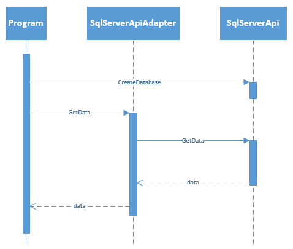

一组你不会经常看到的模式是 GRASP 模式，一般责任分配软件模式或原则(我很确定缩写最先出现)。它们不完全是像设计模式那样的模式，它们更像是应该帮助你解决常见编程问题的建议。我不确定为什么 GRASP 没有 SOLID 或 Design Patterns 那么受欢迎，因为原则同样重要，每个开发人员都应该知道它们。克雷格·拉尔曼在他的《应用 UML 和模式——面向对象分析和设计以及迭代开发导论》一书中讨论了这些问题[【4】](part0002_split_045.html#_ftn4)。总共有九个 GRASP 原则，其中一些与已经讨论过的内容重叠。在本章中，我将讨论与我们之前讨论的没有重叠的 GRASP 模式。重叠的是控制器(就像我们在 MVC 中看到的)、多态(OOP 的三大支柱之一)、间接(依赖反转的另一个词)和受保护的变体(依赖反转和封装的另一种形式)。

任何面向对象应用程序都会遇到的第一个问题是，您需要创建某个对象的实例，但是您不确定其他什么对象会创建它。在某些情况下，这是显而易见的，例如当使用某些设计模式(如工厂方法或单例)时。其他时候就不那么明显了。在这本书的开头，我们看到了一个汽车和引擎类的小例子(继承和合成)。

代码清单 91:汽车和发动机

```
  public class Engine
  {
      // ...
  }

  public class Car
  {
      private Engine engine = new Engine();
      // ...
  }

```

汽车有发动机，所以它显然应该创造一个发动机，对吗？或许吧。对于一个类是否会创建另一个类，有一些提示。如果某个类包含或聚合了另一个类，紧密地使用了另一个类，或者拥有另一个类的初始化数据(参见下一节中的信息专家)，那么让该类创建另一个类可能是个好主意。汽车确实包含一个引擎，但它并不聚合它。汽车密切使用发动机。汽车也有发动机的初始化数据吗？谁知道呢？这取决于你的设计。在这种情况下，我可能会选择另一种解决方案，即通过构造函数(或通过其他方式)用一个 Engine 类组成汽车。

代码清单 92:不同的引擎

```
  public abstract class Engine { }
  public class GasolineEngine : Engine { }
  public class DieselEngine : Engine { }

  public class Car
  {
      private Engine engine;
      public Car(Engine engine)
      {
          this.engine = engine;
      }
      // ...
  }

```

现在另一个类创建了一个引擎，你可以给你的汽车任何你想要的引擎。

代码清单 93:组装你的汽车

```
  Car diesel = new Car(new DieselEngine());
  Car gas = new Car(new GasolineEngine());

```

当然，这仍然不能解决整个问题，因为是谁创造了汽车，是同一类还是另一类创造了发动机？

这里需要注意的是，这些对象是代码对象，而不是域对象。领域或现实世界的对象，可能是在某个装配线上创建的。很有可能你还没有在代码中对装配线建模，所以这可能不会创建汽车或引擎。有一点你可以肯定，在现实世界中，汽车从来没有创造过发动机。

信息专家是一个你可能已经在应用的原则。信息专家解决了哪个对象处理哪个责任的问题。你有多少次想过某个方法的正确类别是什么？答案在于信息专家，看似简单。应该为拥有履行职责所需的所有信息的班级分配职责。

我们来看一个例子。之前我们为一个 SqlServerApi 类创建了一个适配器。这里有一个小小的提醒:

代码清单 94:SQL server 快速适配器

```
  public class SqlServerApiAdapter : IDbApiAdapter
  {
      private SqlServerApi api = new SqlServerApi();

      public object GetData()
      {
          DataTable table = api.GetData();
          object o = ConvertToObject(table);
          return o;
      }

      private object ConvertToObject(DataTable table)
      {
          // ...
          return null; // Placeholder.
      }

      public void SendData(object data)
      {
          DataTable table = ConvertToDataTable(data);
          api.SendData(table);
      }

      private DataTable ConvertToDataTable(object obj)
      {
          // ...
          return new DataTable();
      }
  }

  public class OracleApiAdapter : IDbApiAdapter
  {
      private OracleApi api = new OracleApi();

      public object GetData()
      {
          return api.GetQuery();
      }

      public void SendData(object data)
      {
          api.ExecQuery(data);
      }
  }

```

现在我们希望能够创建新的数据库。这是新功能，因为它不受 GetData 或 SendData 的支持。现在我们可以把这个新的创建数据库的方法放在哪里呢？也许在我们的项目课上？

代码清单 95:程序中的 SqlServerApi

```
  class Program
  {
      static void Main(string[] args)
      {
          CreateDatabase("MyDB");
          SqlServerApiAdapter adapter = new SqlServerApiAdapter();
          object data = adapter.GetData();
          // ...
      }

      static void CreateDatabase(string name)
      {
          SqlServerApi api = new SqlServerApi();
          api.CreateDatabase(name);
      }
  }

```

我想你可以在这里看到问题。我们已经经历了为 SqlServerApi 创建适配器的所有麻烦，现在我们将在应用程序中直接使用它。这毫无意义，因为 SqlServerApiAdapter 是更明显的选择。反正它已经用了 SqlServerApi！这正是信息专家的观点。SqlServerApiAdapter 拥有创建新数据库所需的所有信息，因此它是获得这一新功能的理想选择。另一种选择是程序，它对 SqlServer 或数据库一无所知，所以很容易做出选择。

这里的例子有点明显，但是它展示了信息专家的全部内容。我还要告诉你一个小秘密:我见过在程序中创建数据库的软件(嗯，不完全是这样，但也有类似的情况)。当代码库变大时，新功能的去向并不总是显而易见的。

低耦合原则有助于将变更的影响保持在最小。类之间的耦合是指一个类依赖于另一个类。不用说，当许多类依赖于某个类时，改变那个类就变得困难了。信息专家原则实际上有助于实现这一目标。让我们用 SqlServerApi 来检查前面的例子。将 CreateDatabase 方法放在 Program 中是一个糟糕的设计，因为 Program 不知道 SqlServerApi，也不需要知道它。它在 SqlServerApi 和程序之间造成了不必要的耦合。



图 21:高耦合序列图

如图所示，程序和 SqlServerApi 之间有一条直线。如果 SqlServerApi 发生变化，我们可能需要更改 Program 和 SqlServerApiAdapter。在另一个设计中，SqlServerApiAdapter 创建数据库，我们得到了另一个图。


图 22:低耦合序列图

在这种设计中，程序依赖于 SqlServerApiAdapter，而 SqlServerApiAdapter 依赖于 SqlServerApi。现在，如果 SqlServerApi 发生了变化，我们只需要更改 SqlServerApiAdapter。当然，如果 SqlServerApi 中的更改导致了另一个(中断的)SqlServerApiAdapter 更改，我们也需要更改 Program。

如您所见，低耦合原则可以用来比较不同的设计解决方案，在大多数情况下，我们应该选择类之间耦合度最低的设计。因为信息专家会指导您找到具有特定职责所需的所有信息的类，所以它有助于实现耦合最少的设计。

内聚性是一个类的某些元素属于一起的程度。高凝聚力原则认为一个班级的凝聚力应该很高。换句话说，类的方法和属性应该属于一起。让我们看另一个例子。假设我们有一个具有一些属性和方法的 Person 类:

代码清单 96:个人类

```
  public class Person
  {
      public string FirstName { get; set; }
      public string LastName { get; set; }
      public DateTime DateOfBirth { get; set; }

      public string GetFullName ()
      {
          return String.Format("{0} {1}", FirstName, LastName);
      }

      public int GetAge()
      {
          int age = DateTime.Today.Year - DateOfBirth.Year;
          // Month and Day correction.
          if (DateOfBirth.AddYears(age) > DateTime.Today)
          {
              age -= 1;
          }
          return age;
      }
  }

```

凝聚力之所以高，是因为所有的属性和方法都描述了一个人。让我们添加一个方法。

代码清单 97:有销售订单的人

```
  public class Person
  {
      // ...

      public List<SalesOrder> GetSalesOrders()
      {
          // ...
      }
  }

```

《人》的凝聚力下降了。这并不完全错误，但你应该问问自己，一个人是否真的需要了解销售订单。在不想依赖 SalesOrder 类的环境中，使用 Person 类并不是不可想象的。也许我们可以将一个人的销售订单的检索委托给其他类。

代码清单 98:销售订单存储库

```
  public class SalesOrderRepository
  {
      public List<SalesOrder> GetPersonsSalesOrders(Person person)
      {
          // ...
      }
  }

```

现在的用法如下:

代码清单 99:销售订单存储库的使用

```
  Person sander = new Person
  {
      FirstName = "Sander",
      LastName = "Rossel",
      DateOfBirth = new DateTime(1987, 11, 8)
  };
  SalesOrderRepository repo = new SalesOrderRepository();
  List<SalesOrder>
  orders = repo.GetPersonsSalesOrders(sander);

```

我不是说这是最好的解决方案，但它确实增加了 Person 类的内聚性，降低了耦合性。

如你所见，高内聚和低耦合是齐头并进的。当一个类的内聚性很高时，耦合性通常很低。同样，信息专家和低耦合原则导致设计具有最高的凝聚力。

## 纯制造

我们已经看了很多《纯粹制造》了。事实上，当某些职责不适合你现有的任何课程时，你会这样做:你会为这一项任务专门设计一个新的职责。在前面的例子中，我们创建了一个销售订单存储库，因为为 person 类中的一个人获取销售订单违反了低耦合和高内聚的原则。基本上，任何没有建模领域对象的类都是纯粹的虚构(我们的想象是纯粹的虚构，因为它只有一个职责)。

让我们看另一个例子。我们还有个人课。现在哪个类将把我们的人保存到数据库？我们还没有任何数据库类，一个人拥有将自己保存到数据库所需的大部分信息。因此，让 Person 类执行将自身保存到数据库所需的数据库逻辑似乎是可以的。我们已经知道这不是一个好主意，主要是因为我们希望我们的 Person 具有低耦合性和高内聚性。

代码清单 100:打破低耦合和高内聚的人员类

```
  public class Person
  {
      public string FirstName { get; set; }
      public string LastName { get; set; }
      public DateTime DateOfBirth { get; set; }

      public void Save()
      {
          // Database logic here.
      }
  }

```

因此，我们着手创建一个纯虚构的类，其唯一目的是将一个人保存到数据库中。我不会在这里包括代码，因为我认为你明白了。当我们应用我们在本书中看到的其他模式和原则时，我们最终得到了一个数据映射器，可能还有一个存储库。

GRASP 在设计类的时候真的很有用。与我们到目前为止看到的任何其他东西不同，它们不是非常技术性的，也不描述类或方法。它们描述了如何为您的软件获得高效的设计。本章已经表明，应用程序没有一种设计。事实上，当我们只有一辆汽车和一台发动机时，我们已经有了两种设计选择(甚至更不明显的选择)。记住 GRASP，我们可以得到一些至少比许多替代方案更好的设计(没有所谓的“最佳设计”)。GRASP 的有趣之处在于，对于大多数开发人员来说，很多都已经是常识了(就像一个人不应该拯救自己一样)，但是有了 GRASP，你就有了一些正式的规则来描述为什么它会有这样的常识。