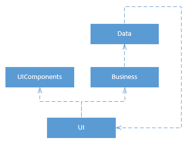

# 六、架构

到目前为止，您已经在小范围内看到了许多代码。我们已经看到了如何设计单个类，如何让多个类相互通信，以及如何抽象出某些组件(比如数据库)。不过，你可能需要写更多的课程。当观察软件系统的高层结构时，我们会谈到该系统的架构。在本章中，我将讨论构建应用程序时可能遇到的一些技术挑战和方法。

我想强调一下我也不会讨论的内容。我不会讨论软件架构师的工作，即与利益相关者交谈，决定开发过程(敏捷或瀑布)、文档、预算以及构建实际应用程序时必须处理的其他外部因素。

系统的架构是不容易改变的部分。对此众说纷纭，但让我们考虑一个数据库。许多人会指着数据库，称它为任何系统的核心，并告诉你在开发过程的后期很难改变它。然而，我们现在知道，当我们抽象出数据映射器和存储库(软件通过抽象依赖于它们)后面的数据库时，改变数据库“只是”切换我们的数据映射器，可能还有存储库。当然这仍然是一个很大的工作，一切都必须经过彻底的测试，但是我们不应该改变我们的前端，例如。
那么，什么是难以改变的呢？假设在项目进行到一半时，您决定更改数据映射器或存储库的接口。这可能很成问题。或者你决定加入 MVC 和/或 MVVM 架构。这将需要对许多组件进行良好的重写。

我们还没有讨论的一个重要原则是干燥原则，或者说不要重复你自己。为什么我们要经历所有的麻烦，把一切都放在抽象后面，思考架构，然后重用呢？答案是干。防止两次编写相同的代码。下一个例子将说明原因。

假设您有一个具有保存逻辑的 Person 类。我们打破了低耦合和高凝聚力，但我们可以拯救我们的人。

代码清单 101:具有保存逻辑的人

```cs
  public class Person
  {
      // ...

      public void Save()
      {
          // Dataase logic for Person here.
      }
  }

```

现在我们需要一份销售订单。因为我们没有一个可以保存域对象的类，所以我们需要再次编写保存功能，但这次是针对我们的销售订单。没问题，我们只是从 Person 复制/粘贴！

代码清单 102:带有错误的销售订单类

```cs
  public class SalesOrder
  {

      // ...

      public void Save()
      {
          // Dataase logic for Person here.
      }
  }

```

这很容易，但是程序员从 Person 复制/粘贴了 Save 方法，现在 SalesOrder 字面意思是“此处 Person 的数据库逻辑”这种情况我见过很多次，甚至在生产代码中！

不过，还有一个问题。该方法不读取“数据库”，而是读取“数据库”。看来我们又有一只虫子了。让我们修复销售订单类。

代码清单 103:固定销售订单

```cs
  public class SalesOrder
  {

      // ...

      public void Save()
      {
          // Database logic for SalesOrder here.
      }
  }

```

好极了，我们的销售订单现在起作用了！但是我们的 Person 类有同样的错误。我们现在必须记住修复这个错误，否则它会保留我们刚刚在销售订单中修复的错误。

如果我们有一个同时适用于销售订单和人员的保存方法，我们就不会有第一个错误(销售订单保存一个人员)，我们只需要解决第二个错误一次。这就是为什么你应该努力使代码抽象:这样你就可以写一次，测试一次，修复一次错误，并经常使用它。

通过创建类和方法，我们可以在整个应用程序中重用代码。但是很多时候你想在应用程序之间重用代码。一个例子是一个工具，可能是一个 XML 或 JSON 解析器，或者是一个数据映射器，您已经编写了这个工具，并且您还想在其他应用程序中使用它。我们已经看到，复制/粘贴，即使在应用程序之间，也是不切实际的。您可以通过创建可由其他应用程序使用的包(动态链接库或动态链接库)来重用这些组件。当你使用。NET，你实际上只是在使用微软创建的包。就像类设计一样，在发布和使用包时也有一些最佳实践。罗伯特·C·马丁在他的《C#中的敏捷原则、模式和实践》一书中讨论了这些实践[【5】](part0002_split_045.html#_ftn5)。我在这里快速总结一下。

重用/发布等价原则声明只有发布的东西才能被重用。发布是由另一个作者或实体维护的东西。发布是一个产品，你是客户。发布会获得更新，这可能是您感兴趣的，也可能不是，您可以选择更新或坚持旧版本一段时间。显然，复制的代码不符合这个描述(正如我们在 DRY 中看到的)。由于应用程序通常由数百个类和接口组成，因此发布单个类既繁琐又难以承受。一个包是一个很好的发布候选，这样发布的所有东西都可以被重用。

通用重用原则有点像包的高内聚原则。打包在一起的类应该属于一起。如果在一个包中重用一个类，那么就重用了该包中的所有内容。如果包中的任何类发生变化，您需要更新、重新验证您的软件，并重新分发您的软件。由于这个原因，包中的类应该有很高的内聚性(我说的是类之间的内聚性，而不是每个类)。如果你得到一个更新并且必须做所有的工作，你不会很高兴，但是你实际上并不需要更新。当然，这在实践中经常发生，因为替代方案是有很多包，这也不是很好。

值得一提的是，一些脚本库，比如 jQuery UI(一个 JavaScript 库)，只允许你下载你需要的代码。然后，您可以勾选您想要的组件，并留下其余的组件。当然，对于已编译的包来说，这样的实践是不可能的，因为你要么编译所有内容，要么什么都不编译。

公共闭包原则指出，一起变化的类应该打包在一起。这是因为如果你改变一个类或职责，你就不想更新多个包。您不希望在一个包中包含不相关的功能(CRP)，也不希望在多个包中包含单个功能(CCP)。

非循环依赖原则在 C#和 Visual Studio 中确实不是问题。根据这个原则，包不能依赖依赖于依赖它们的包，从而在依赖关系中创建一个循环。然而，在 Visual Studio 中不可能建立这样的依赖关系。如果你试图编译。NET 代码违反了 ADP，你会得到一个错误消息，抱怨你正在创建一个循环引用。不管怎样，让我们再深入一点。假设您有四个包:数据、业务、组件和用户界面。用户界面依赖于业务和用户界面组件，业务依赖于数据。


图 23:没有周期的依赖关系

如果业务发生变化，我们知道 UI 依赖于它，所以我们应该检查 UI 是否仍然工作。我们知道，组件和数据保持不变。同样，如果数据发生变化，我们知道应该检查业务和用户界面，而不是用户界面组件。

现在假设数据依赖于用户界面。



图 24:循环依赖关系

我们现在创造了一个循环。如果业务现在发生变化，我们应该检查用户界面是否仍然有效，但是因为数据现在依赖于用户界面，我们也应该检查数据。如果 UIComponents 发生变化，您必须重新验证每个包。这对于四个包来说是令人厌倦的，但是在一个有几十个包的真实应用程序中，这几乎是不可撤销的。无论如何，这是非常糟糕的设计，被 Visual Studio 禁止。

有些包只写一次，很少更新，而其他包经常变化。想想用户界面:应用程序的每个新特性都需要用户界面的改变来支持该特性。希望您的数据映射器更少更改。如果一个包很少变化，就说是稳定的。根据稳定依赖原则，稳定的包不应该依赖不稳定的包。这很有意义，因为每次更新依赖项时，我们都应该验证包。这意味着，如果依赖经常变化，我们应该经常验证。按照这个逻辑，一个包只和它所依赖的最不稳定的包一样稳定，所以稳定的包不应该依赖于不太稳定的包。

为了使包稳定，这些包必须有一定的抽象级别。没有抽象，这些包就不容易被改变或扩展，使它们不可改变或不稳定。我们已经看到了如何通过使用接口、继承和固体原则来创建可扩展的软件。

你会经常听到分层或分层软件设计这个术语。一个*层*是一个抽象层次。一个*层级*是软件责任之间的物理分离。例如，客户机-服务器解决方案是一个两层架构。如果您决定为一些业务逻辑服务增加一个额外的服务器，那么您已经创建了一个 3 层架构。n 层架构在面向对象编程中相对容易，因为模块可以很容易地在不同的层上重用。
当你实践这本书所阐述的原则时，一个分层的架构将会自然出现。一个众所周知的分层结构是现场视察模型，一个描述互联网不同层的模型。简单地说，你的浏览器不知道如何通过一条线发送位和字节，你的线也不知道任何浏览器。然而，通过抽象，两者共同呈现网站和应用程序。软件也是如此。您的应用程序不了解数据库，但是，通过一些 IDataMapper 接口，它能够与数据存储进行通信。

这样的层可以很容易地被替换，而不影响系统的其余部分。当您查看互联网时，您可以轻松地从拨号连接切换到 ADSL，再切换到有线或无线。无需更换浏览器或电脑。同样，用于在互联网上发送和接收数据的协议 TCP/IP 可以切换为 UDP，这是另一种更快但不太安全的数据发送协议。在您的应用程序中，您可以切换您的数据库，或者重建您的用户界面，而不需要接触系统的其他部分(假设您已经成功地在不同的层中分离了关注点)。

常见的分层或分层体系结构可能如下所示:


图 25:公共层或层级

所有这些模式、层和层级都可以组合起来，以创建更好的架构风格和不相互排斥的模式。挑选适合你和你的项目的东西是极其困难的，可能是你知道什么和你喜欢什么的问题。当然，有些模式对特定的应用程序或技术更有意义，但总的来说，你有一些选择。

考虑一个 ASP.NET MVC 应用程序。这个名字已经暗示了我们正在使用 MVC。MVC 框架使用 REST(表示状态转移，简单来说，就是你的服务器只是坐在那里等待一个请求，处理这个请求，发送一个响应，然后继续等待)。也许你在前端使用的是 AngularJS 或者 KnockoutJS，也就是 MVVM。您可能已经是三层的了(客户机上的 HTML、CSS、AngularJS/KnockoutJS、web 服务器和数据库服务器)。您可以选择为业务逻辑创建一些额外的服务，这些服务也可以用于其他平台。此外，前端可能使用事件驱动的设计。

如您所见，您可能已经使用了很多模式，甚至可能还不知道。单独讨论所有这些模式需要另外几本书，所以我不会这样做。让您正在使用的框架或技术为您做出这些艰难的架构决策可能是您喜欢的方式，或者您可能想要自己创建一些东西。每种方法都有利弊。

面向对象设计现在应该对你没有秘密了。您可能想知道您应该在抽象和重用方面走多远。毕竟，你能做并不意味着你应该做。很难说你应该在哪里划清界限，因为这是非常主观的。我曾经看到过下面的抽象:

代码清单 104: NowResolver

```cs
  public interface INowResolver
  {
      DateTime GetNow();
  }

  public class NowResolver : INowResolver
  {
      public DateTime GetNow()
      {
          return DateTime.Now;
      }
  }

```

这是不是太过分了？程序员是否在抽象的海洋中迷失了自己？你可能很想这么想，但实际上这很聪明。假设您必须对一个类运行一些测试，根据当前时间(或日期)给出不同的结果。这一点也不罕见；也许这是一个金融应用程序，需要获取给定日期的汇率。所以试着测试一下，如果代码库有日期时间。现在直接换方法。使用 INowResolver，您可以注入您的现在，并测试昨天、现在和明天。

就我个人而言，我从未见过抽象走得太远。不过，我错过了很多抽象概念。当然，有许多不必要的抽象很难理解，但是缺少抽象很难维护。所以我在这里唯一能给的建议就是继续思考，想出不同的设计，用我在这本书里列出的工具进行比较，并运用你最好的判断力。幸运的是，你为下一个项目选择的框架或技术已经为你做出了一些更难的决定。