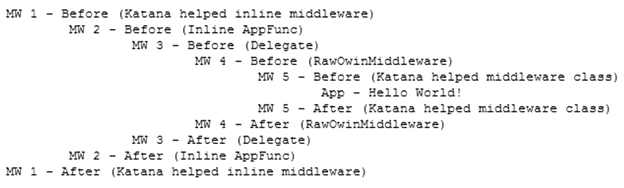

# 第四章构建定制中间件

在前一章中，您学习了如何使用其他人编写的 web 框架和中间件组件来构建基于 OWIN 的应用程序，但是您可能需要编写特定于您的应用程序的定制组件。

在本章中，您将学习如何做到这一点，既作为简单的内联函数，也作为它们自己的类和库中更孤立的组件。

## 使用核心 OWIN 规范定义中间件

正如您在[第 1 章](1.html#_Chapter_1_)中所看到的，OWIN 中间件组件基本上只是一个带有`AppFunc`签名的函数。

```cs
     using AppFunc = Func<
    IDictionary<string, object>, // Environment
    Task>; // Done

```

代码清单 42

要使用中间件组件，您还必须通过`IAppBuilder`接口在 OWIN 管道中注册它。即使规范中没有严格定义(在撰写本文时，这个主题实际上正在 OWIN 列表中讨论)，您也可以通过调用该接口的`Use`方法并提供具有以下签名的函数来注册中间件组件。

```cs
     Func<AppFunc, AppFunc>

```

代码清单 43

基本上，您传递一个函数，该函数接受 OWIN 管道中的下一个组件，并向`Use`方法返回一个新的中间件组件。这样说，听起来很复杂，所以我们最好看一个例子。

```cs
     app.Use(new Func<Func<IDictionary<string, object>, Task> /*next*/
        , Func<IDictionary<string, object> /*env*/, Task>>
        (next => (async env =>
    {
        var response = env["owin.ResponseBody"] as Stream;
        string pre = "\tMW 2 - Before (Inline AppFunc)\r\n";
        string post = "\tMW 2 - After (Inline AppFunc)\r\n";
        await response.WriteAsync(Encoding.UTF8.GetBytes(pre), 0, pre.Length);
        await next.Invoke(env);
        await response.WriteAsync(Encoding.UTF8.GetBytes(post), 0, post.Length);
    })));

```

代码清单 44

上一个代码清单中显示的是一个非常简单的中间件，它只使用 OWIN 规范附带的东西，在调用管道中的下一个组件时，将两个字符串(“`Before`”和“`After`”)写入响应流。`next`变量是在“外部”函数中传递的参数，而`env`是“内部”函数的输入参数。还要注意，该函数访问环境字典，并在使用它们之前将值转换为正确的类型。

如果您只想添加一些跟踪，这种内联方法是可以的，但是如果您的中间件类更复杂，您可能需要创建一个单独的类。

```cs
     public class RawOwinMiddleware
    {
        private Func<IDictionary<string, object>, Task> next;
        public RawOwinMiddleware(Func<IDictionary<string, object>, Task> next)
        {
            this.next = next;
        }
        public async Task Invoke(IDictionary<string, object> env)
        {
            var response = env["owin.ResponseBody"] as Stream;
            string pre = "\t\t\tMW 4 - Before (RawOwinMiddleware)\r\n";
            string post = "\t\t\tMW 4 - After (RawOwinMiddleware)\r\n";
            await response.WriteAsync(Encoding.UTF8.GetBytes(pre), 0, pre.Length);
            await next.Invoke(env);
            await response.WriteAsync(Encoding.UTF8.GetBytes(post), 0, post.Length);
        }
    }

```

代码清单 45

它本质上做了相同的事情，但是`IAppBuilder`实例在接收到`Type`而不是内联 lambda 表达式时表现不同。在这种情况下，它创建一个中间件类型的实例，将管道中的下一个元素传递给构造函数，然后在必须执行中间件时调用`Invoke`方法。

要注册这个中间件组件，需要将其类型传递给`Use`方法:`app.Use(typeof(RawOwinMiddleware))`。

## 借助武士刀助手定义中间件

如果你想更好地理解中间件是如何工作并在管道中注册的，或者如果你想发布它以便它在所有 OWIN 服务器中工作而不依赖于`Microsoft.Owin` DLL，那么直接使用 OWIN 规范是很好的。但是如果这些约束都不是问题，可以使用 Katana 项目提供的`Use`扩展方法来构建中间件，这需要一个`Func<IOwinContext, Func<Task>, Task>`——基本上是一个接收`IOwinContext`和管道中下一个元素并返回`Task`执行的函数。

```cs
     app.Use(async (context, next) =>
    {
        await context.Response.WriteAsync("MW 1 - Before (Katana inline middleware)\r\n");
        await next();
        await context.Response.WriteAsync("MW 1 - After (Katana inline middleware)\r\n");
    });

```

代码清单 46

这个代码示例与上一节中的代码示例做了相同的事情，但是更加简洁。

当然，有了 Katana 助手，您可以将中间件作为一个单独的类来编写。

```cs
     public class LoggerMiddleware : OwinMiddleware
    {
        public LoggerMiddleware(OwinMiddleware next)
            : base(next)
        {
        }
        public override async Task Invoke(IOwinContext context)
        {
            await context.Response.WriteAsync("\t\t\t\tMW 5 - Before (Katana helped middleware class)\r\n");
            await this.Next.Invoke(context);
            await context.Response.WriteAsync("\t\t\t\tMW 5 - After (Katana helped middleware class)\r\n");
        }
    }

```

代码清单 47

在这种情况下，你必须编写一个继承自`OwinMiddleware`的类，但是剩下的几乎和你只使用 OWIN 规范编写的一样。您还需要通过将其类型传递给`Use`方法来注册组件:`app.Use(typeof(LoggerMiddleware))`。

正如在[第 2 章](2.html#_Chapter_2_)中看到的，使用`Microsoft.Owin`助手的最大优势是`IOwinContext`，它以强类型的方式包装了 OWIN 环境字典中的所有元素。

在结束本章之前，我想提醒您关于中间件的一个非常重要的观点:它们所有的“之前”操作都是按照组件在管道中注册的顺序执行的，而“之后”操作是按照相反的顺序执行的。这在[图 36](#Figure36) 中也很形象。

```cs
        public void Configuration(IAppBuilder app)
        {
            app.Use(async (context, next) =>
            {
                await context.Response.WriteAsync("MW 1 - Before (Katana helped inline middleware)"+Environment.NewLine);
                await next();
                await context.Response.WriteAsync("MW 1 - After (Katana helped inline middleware)" + Environment.NewLine);
            });
            app.Use(new Func<Func<IDictionary<string, object>, Task> /*next*/
                , Func<IDictionary<string, object> /*env*/, Task>>
                (next => (async env =>
            {
                var response = env["owin.ResponseBody"] as Stream;
                string pre = "\tMW 2 - Before (Inline AppFunc)\r\n";
                string post = "\tMW 2 - After (Inline AppFunc)\r\n";
                await response.WriteAsync(Encoding.UTF8.GetBytes(pre), 0, pre.Length);
                await next.Invoke(env);
                await response.WriteAsync(Encoding.UTF8.GetBytes(post), 0, post.Length);
            })));
            app.Use(new Func<Func<IDictionary<string, object>, Task> /*next*/
                , Func<IDictionary<string, object> /*env*/, Task>>             ( next => env => Invoke(next, env)));
            app.Use(typeof(RawOwinMiddleware));
            app.Use(typeof(LoggerMiddleware));
            app.Run(ctx =>
            {
                return ctx.Response.WriteAsync("\t\t\t\t\tApp - Hello World!" + Environment.NewLine);
            });
        }
        private async Task Invoke(Func<IDictionary<string, object>, Task> next
        , IDictionary<string, object> env)
        {
            var response = env["owin.ResponseBody"] as Stream;
            string pre = "\t\tMW 3 - Before (Delegate)\r\n";
            string post = "\t\tMW 3 - After (Delegate)\r\n";
            await response.WriteAsync(Encoding.UTF8.GetBytes(pre), 0, pre.Length);
            await next.Invoke(env);
            await response.WriteAsync(Encoding.UTF8.GetBytes(post), 0, post.Length);
        } }
    }

```

代码清单 48

下图显示了如果本章中定义的所有组件都像前面的代码清单一样在管道中注册，它们是如何执行的。



图 36:对中间件调用的跟踪

## 结论

在本章中，您已经学习了如何构建定制中间件组件。

在下一章中，您将学习如何保护您的应用程序，配置其他中间件组件以启用标准表单身份验证，以及如何利用推特、脸书、谷歌和其他公司的社交身份验证。