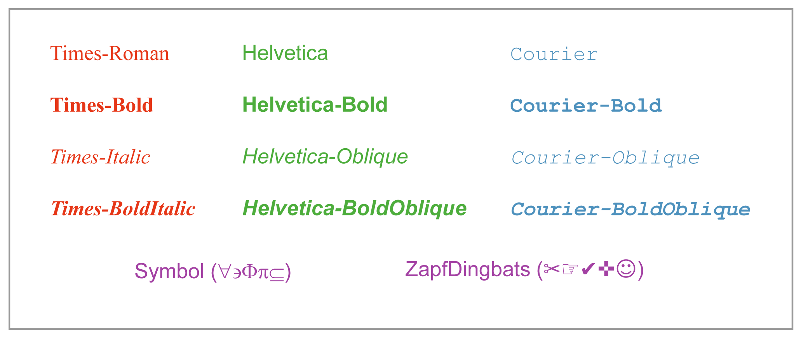
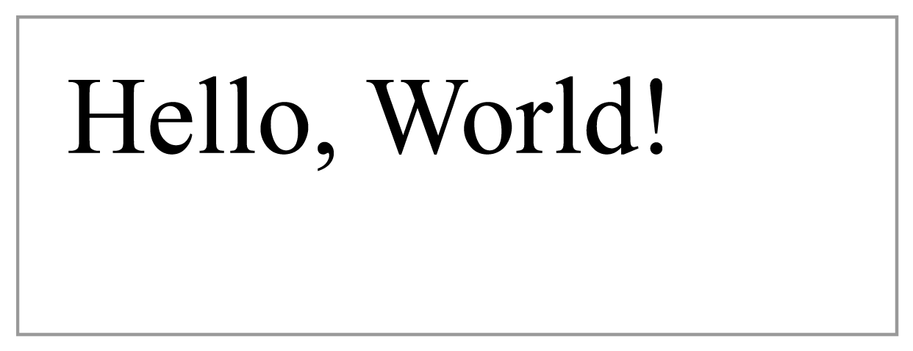

# 二、创建 PDF

pdf 包含文本和二进制文件的混合，但是仍然可以使用文本编辑器和一个名为 pdftk 的程序从头开始创建它们。你自己创建标题、正文和尾部，然后 pdftk 实用程序进入并为你填充二进制空白。它还管理对象引用和字节计算，这不是您想要手动完成的事情。

首先，从 [PDF 实验室](http://www.pdflabs.com/tools/pdftk-the-pdf-toolkit/)下载 pdftk。对于 Windows 用户来说，安装就像解压文件并将结果文件夹添加到你的`PATH`一样简单。如果安装成功，从命令提示符运行`pdftk --help`将显示帮助页面。

接下来，我们将手动创建一个 PDF 文件用于 pdftk。创建一个名为**hello-src.pdf**的纯文本文件(该文件可在[https://bitbucket.org/syncfusion/pdf-succinctly](https://bitbucket.org/syncfusion/pdf-succinctly)获得)，并在您最喜欢的文本编辑器中打开它。

## 表头

我们将从添加一个标题到 hello-src.pdf 开始。请记住，标题包含 PDF 版本号和一位二进制数据。我们将只添加 PDF 版本，并将二进制数据留给 pdftk。在**hello-src.pdf**增加以下内容。

```

        %PDF-1.0

```

`%`字符是 PDF 评论的开头，所以标题实际上只是一种特殊的评论。

## 身体

正文(以及整个可见文档)是使用**对象**构建的。对象是 PDF 文件的基本单元，它们大致对应于流行编程语言的数据结构。例如，PDF 具有布尔、数字、字符串、数组和字典对象，以及特定于 PDF 的流和名称。我们将在需要时查看每种类型。

### 页面树

页面树是一个字典对象，包含组成文档的页面列表。最小页面树只包含一个页面。

```
        1 0 obj<< /Type /Pages
           /Count 1
           /Kids [2 0 R]
        >>
        endobj

```

对象包含在`obj`和`endobj`标签中，它们以唯一的识别号(`1 0`)开始。第一个数字是*对象号*，第二个是*生成号*。后者仅用于增量更新，因此我们示例中的所有生成号都将是`0`。正如我们稍后将看到的，pdf 使用这些标识符来引用文档中其他地方的单个对象。

字典用尖括号(`<<`和`>>`)隔开，它们包含键/值对。空格用于将键与值*和*以及项目彼此分开，这可能会造成混淆。它有助于将线对保持在不同的线上，就像前面的例子一样。

`/Type`、`/Pages`、`/Count`、`/Kids`键被称为**名称**。它们是一种特殊的数据类型，类似于高级编程语言的常量。pdf 经常使用名称作为字典键。名称区分大小写。

`2 0 R`是对识别号为`2 0`的对象的引用(尚未创建)。`/Kids`键将该引用包装在方括号中，将其变成一个数组:`[2 0 R]`。PDF 数组可以混合和匹配类型，所以它们实际上比原生数组更像 C#的`List<object>`。

和字典一样，PDF 数组也是用空格分隔的。同样，这可能会令人困惑，因为对象引用也由空白分隔。例如，向`/Kids`添加第二个引用看起来像:`[2 0 R 3 0 R]`(不过，不要实际向**hello-src.pdf**添加这个引用)。

### 页

接下来，我们将创建第二个对象，这是上一节中`/Kids`引用的唯一页面。

```
        2 0 obj << /Type /Page
           /MediaBox [0 0 612 792]
           /Resources 3 0 R
           /Parent 1 0 R
           /Contents [4 0 R] >> endobj

```

`/Type`条目始终指定对象的类型。很多时候，如果可以通过上下文推断对象类型，则可以省略这一点。请注意，PDF 使用名称来标识对象类型，而不是文字字符串。

`/MediaBox`条目以磅为单位定义页面的尺寸。一英寸有 72 个点，所以我们刚刚创建了一个标准的 8.5 × 11 英寸页面。`/Resources`指向包含页面所需资源的对象。`/Parent`点回页面树对象。双向引用在 PDF 文件中非常常见，因为它们使得在任一方向上解析依赖关系变得非常容易。最后，`/Contents`指向定义页面外观的对象。

### 资源

第三个对象是定义字体配置的资源。

```
        3 0 obj << /Font
           << /F0
              << /Type /Font
                 /BaseFont /Times-Roman
                 /Subtype /Type1
              >>
           >> >> endobj

```

`/Font`键包含一个完整的字典，与我们之前看到的名称/值对相反(例如`/Type /Page`)。我们配置的字体叫做`/F0`，我们选择的字体是`/Times-Roman`。`/Subtype`是字体文件的格式，`/Type1`是 PostScript 类型 1 文件格式。

该规范定义了所有 PDF 应用程序都应该支持的 14 种“标准”字体。



图 4:符合 PDF 的应用程序的标准字体

这些值中的任何一个都可以用于`/Font`字典中的`/BaseFont`。非标准字体*可以*嵌入到 PDF 文档中，但是手动做不太容易。我们将推迟定制字体，直到可以使用 iTextSharp 的高级框架。

### 含量

最后，我们能够指定页面的实际内容。页面内容表示为**流**对象。流对象由元数据字典和字节流组成。

```
        4 0 obj  << >> stream BT     /F0 36 Tf     50 706 Td     (Hello, World!) Tj ET endstream endobj

```

`<< >>`创建一个空字典。pdftk 会用任何需要的元数据来填充它。该流本身包含在`stream`和`endstream`关键词之间。它包含一系列说明，告诉 PDF 查看器如何呈现页面。在这种情况下，它将显示“你好，世界！”在靠近页面顶部的 36 点时代罗马字体。

流的内容完全依赖于上下文——流只是任意数据的容器。在本例中，我们使用 PDF 内置的**操作符**来定义页面内容。首先，我们用`BT`和`ET`创建一个文本块，然后用`Tf`设置字体，然后用`Td`定位文本光标，最后画出文本“你好，世界！”`Tj`同。这种新的运算符语法将在接下来的两章中详细讨论。

但是，值得指出的是，PDF 流是在*后缀符号*中。它们的操作数在它们的运算符之前是*。例如，`/F0`和`36`是`Tf`命令的参数。在 C#中，你会期望这个看起来更像`Tf(/F0, 36)`。事实上，PDF 中的所有内容都是后缀符号。在`1 0 obj`语句中，`obj`实际上是一个运算符，对象/代号是参数。*

您还会注意到，PDF 流使用简短、不明确的命令名称。手动处理是一件痛苦的事情，但这可以使 PDF 文件尽可能小。

### 目录

正文的最后一部分是目录，它指向根页面树(`1 0 R`)。

```
        5 0 obj << /Type /Catalog
           /Pages 1 0 R >> endobj

```

这看起来像是一个不必要的引用，但是将一个文档分成多个页面树是优化 pdf 的常用方法。在这种情况下，程序需要知道文档从哪里开始。

## 对照表

交叉引用表提供了文件正文中每个对象的位置。位置被记录为从文件开始的字节偏移量。这是 pdftk 的另一项工作——我们所要做的就是添加`xref`关键字。

```
        xref

```

生成最终 PDF 后，我们将仔细查看交叉引用表。

## 拖车

文件的最后一部分是预告片。它由`trailer`关键字组成，后面是包含目录引用的字典，然后是交叉引用表的指针，最后是文件结束标记。让我们把这些都加到**hello-src.pdf**上。

```
        trailer
        << /Root 5 0 R
        >> startxref %%EOF

```

`/Root`指向*目录*，而不是根页面树。这很重要，因为目录还可以包含关于文档结构的重要信息。`startxref`关键字指向交叉引用表开头的位置(以字节为单位)。再说一遍，我们把这个留给 pdftk。在这两个信息位之间，程序可以计算出它需要的任何东西的位置。

`%%EOF`注释标志着 PDF 文件的结束。增量更新使用多个预告片，因此在单个文档中可能有多个`%%EOF`行。这有助于程序确定每次更新中添加了哪些新内容。

## 编译有效的 PDF

我们的**hello-src.pdf**文件现在包含一个完整的文档，减去一些二进制序列和字节位置。我们要做的就是运行 pdftk 来填补这些漏洞。

```
        pdftk hello-src.pdf output hello.pdf

```

您可以在任何 PDF 查看器中打开生成的**hello.pdf**文件，并看到“你好，世界！”左上角用 36 点的泰晤士罗马字体。



图 5:**hello.pdf**截图(未按比例绘制)

让我们看一下 pdtfk 必须添加到我们的源文件中的内容…

### 头二进制

如果你打开**hello.pdf**，你会在标题中找到另一行。

```
        %PDF-1.0 %âãÏÓ

```

同样，这防止程序将文件作为文本处理。我们的《你好，世界》中没有太多的二进制例如，但是许多 pdf 将完整的字体文件嵌入为二进制数据。对这样的文件执行天真的查找和替换可能会损坏字体数据。

### 内容流长度

接下来，向下滚动到对象`4 0`。

```
        4 0 obj  << /Length 62 >> stream ...

```

pdftk 添加了一个`/Length`键，包含流的长度，以字节为单位。这对读取文件的程序来说是一个有用的信息。

### 对照表

之后，我们就有了完整的`xref`表。

```
        endobj xref 0 6 0000000000 65535 f  0000000015 00000 n  0000000074 00000 n  0000000182 00000 n  0000000280 00000 n  0000000395 00000 n

```

它首先指定`xref`的长度(6 行)，然后在单独的一行列出文件中每个对象的字节偏移量。一旦程序找到了`xref`，它就可以只使用这个信息找到任何对象。

### 预告片词典

还要注意的是，pdftk 在预告片词典中增加了`xref`的大小。

```
        << /Root 5 0 R /Size 6 >> 

```

最后，pdftk 填写`startxref`关键字，使程序能够快速找到对照表。

```
        startxref 445

```

## 总结

这就是 PDF 文档的全部内容。它只是定义文档中页面及其内容的对象集合，以及一些指针和字节偏移量，以便于查找对象。

当然，真实的 PDF 文档包含的文本和图形比我们的**hello.pdf**要多得多，但过程是一样的。我们对 pdf 如何表示内容略有了解，但浏览了许多重要的细节。下一章将介绍内容流的文本相关操作符。