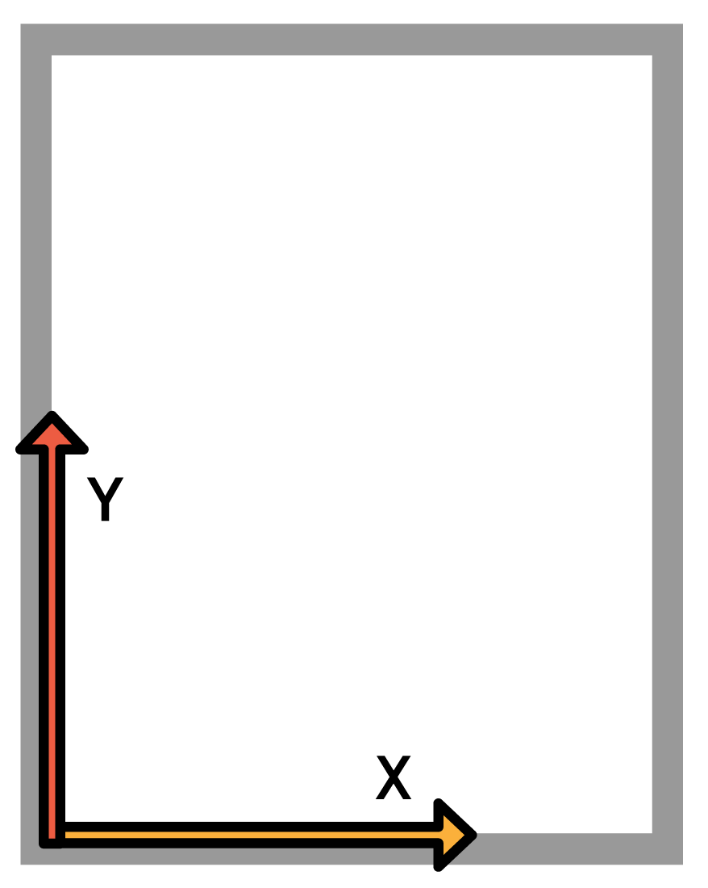
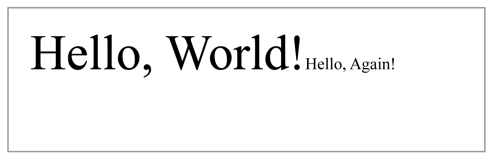
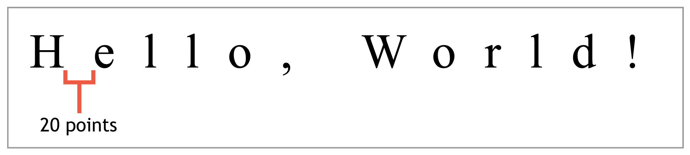
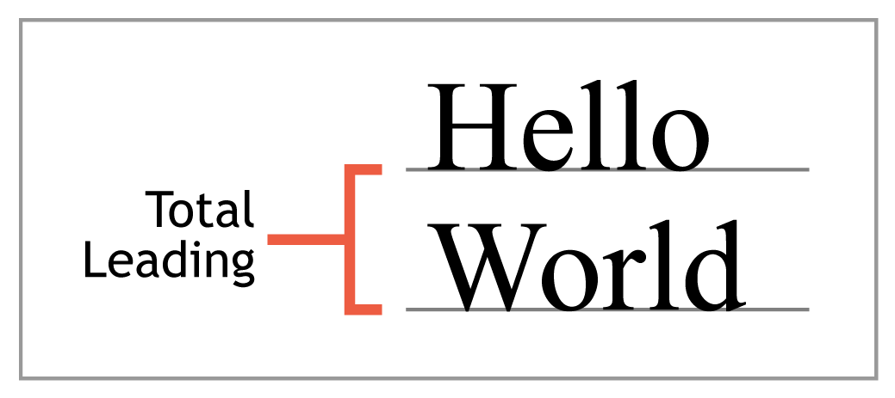

# 三、文本操作符

正如我们在上一章中看到的，pdf 使用流来定义页面的外观。内容流通常由一系列命令组成，这些命令告诉 PDF 查看器或编辑器在页面上绘制什么。例如，命令`(Hello, World!) Tj`写字符串“你好，世界！”翻到这一页。在这一章中，我们将确切地发现这个命令是如何工作的，并探索其他几种有用的操作符来格式化文本。

## 基础

向页面添加文本的一般过程如下:

1.  定义字体状态(`Tf`)。
2.  定位文本光标(`Td`)。
3.  将文本“绘制”到页面上(`Tj`)。

让我们从检查现有流的简化版本开始。

```
        BT
            /F0 36 Tf
            (Hello, World!) Tj
        ET

```

首先，我们用`BT`运算符创建一个文本块。在我们可以使用任何其他与文本相关的运算符之前，这是必需的。相应的`ET`操作符结束当前文本块。文本块是孤立的环境，因此选定的字体和位置不会应用于后续的文本块。

下一行将字体设置为`/F0`，这是我们在`3 0 obj`中定义的倍罗马字体，并将大小设置为 36 点。同样，PDF 操作符使用后缀表示法——命令(`Tf`)排在最后，参数排在第一(`/F0`和`36`)。

现在选择了字体，我们可以用`Tj`在页面上画一些文字。该运算符接受一个参数:要显示的字符串(`(Hello, World!)`)。PDF 中的字符串必须用括号括起来。嵌套圆括号不需要转义，但是单个圆括号需要在前面加一个反斜杠。因此，下面两行都是有效的字符串。

```
        (Nested (parentheses) don’t need a backslash.)
        (But a single \(parenthesis needs one.) 

```

当然，反斜杠也可以用来转义自身(`\\`)。

### 定位文本

如果你用 pdftk 生成一个包含本章开头内容流的 PDF(没有 Td 操作符)，你会发现“你好，世界！”显示在页面的左下角。

因为我们没有为文本设置位置，所以它是在原点绘制的，即页面的左下角。pdf 使用经典的笛卡尔坐标系，x 从左到右递增，y 从下到上递增。



图 PDF 坐标系

我们必须手动确定我们的文本应该放在哪里，然后在用 Tj 绘制之前将这些坐标传递给 Td 操作符*。例如，考虑下面的流。*

```
        BT
            /F0 36 Tf
            50 706 Td
            (Hello, World!) Tj
        ET

```

这将我们的文本定位在页面的左上角，并留出 50 点的边距。注意文本块的原点是*它的*左下角，所以字体的高度必须从 y 位置减去(792-50-36=706)。PDF 文件格式仅定义了*表示*文档的方法。它不包括复杂的布局功能，如换行或换行符，这些必须手动确定(或在第三方布局引擎的帮助下)。

总而言之，通过选择文本状态，定位文本光标，然后将文本绘制到页面上来创建文本页面。在数字时代，这个过程就像你在传统印刷机上手工排版一样。

接下来，我们将仔细研究格式化文本的过多选项。

## 文本状态运算符

用 Tj 绘制的所有文本的外观由文本状态操作符决定。这些操作符中的每一个都定义了一个特定的属性，所有后续对 Tj 的调用都会反映这个属性。下表显示了最常见的文本状态运算符。每个运算符的参数都显示在尖括号中。

*   <font><size>Tf:设置字体和字号。</size></font>
*   <spacing>Tc:设置字符间距。</spacing>
*   <spacing>Tw:设置字距。</spacing>
*   <mode>Tr:设置渲染模式。</mode>
*   <rise>Ts:设置文字上升。</rise>
*   <leading>TL:设置前导(行距)。</leading>

### Tf 运算符

我们已经看到`Tf`运算符在起作用，但是让我们看看当我们不止一次调用它时会发生什么:

```
        BT
            /F0 36 Tf
            50 706 Td
            (Hello, World!) Tj
            /F0 12 Tf
            (Hello, Again!) Tj
        ET

```

这将字体大小更改为 12 磅，但仍与 36 磅文本在同一行:



图 7:用 Tf 改变字体大小

`Tj`操作符将光标留在它添加的任何文本的末尾——新的行必须用定位或绘画操作符之一明确定义。但是在我们开始定位操作符之前，让我们看一下剩下的文本状态操作符。

### Tc 操作员

`Tc`操作符控制字符之间的间距。下面的流将在“你好，世界”的每个角色之间放置 20 个点的空间

```
        BT     /F0 36 Tf     50 706 Td     20 Tc     (Hello, World!) Tj ET

```

这类似于文档准备软件中的跟踪功能。也可以指定一个负值来拉近字符的距离。



图 8:用 Tc 将字符间距设置为 20 点

### Tw 算子

与`Tc`操作员相关的是`Tw`。该运算符控制单词之间的间距。它的行为与`Tc`完全一样，但它只影响空间特征。例如，以下命令将单词额外分开 10 个点(在`Tc`设置的字符间距之上)。

```
        10 Tw

```

`Tw`和`Tc`命令可以通过微妙地改变单词内部和周围的空间来创建对齐的线条。同样，pdf 只是提供了一种表达方式——您必须使用一个专用的布局引擎来计算单词和字符的间距(以及连字符)以适应分配的尺寸。

也就是说，PDF 文件格式中没有“对齐”命令，也没有“左对齐”或“右对齐”命令。幸运的是，本书最后一章*中讨论的 iTextSharp 库*是否包含这种高级功能。

### Tr 操作员

`Tr`操作符定义了未来调用绘画操作符的“渲染模式”。渲染模式决定了字形是填充的、描边的还是填充的和描边的。这些模式被指定为 0 到 2 之间的整数。


图 9:文本呈现模式

例如，命令`2` `Tr`告诉 PDF 阅读器以当前笔画颜色勾勒任何新文本，并用当前填充颜色填充。颜色由图形操作符决定，这将在下一章中介绍。

### Ts 操作员

`Ts`命令偏移文本的垂直位置以创建上标或下标。例如，下面的流绘制“x”。

```
        BT     /F0 12 Tf     50 706 Td     (x) Tj     7 Ts     /F0 8 Tf     (2) Tj ET 

```

文本上升总是相对于基线来测量的，因此它本身并不被认为是文本定位操作符。

### TL 运算符

`TL`操作符设置行间使用的前导。前导定义为两行文本从基线到基线的距离。这考虑了字体的上升和下降。因此，您需要将它添加到当前字体的高度来确定`TL`的总值，而不是定义您想要的行间距。



图 10:从基线到基线的测量领先

例如，选择 12 点字体后将前导设置为 16 点，将在每行之间留出 4 点空白。然而，字体设计者可以独立于字形定义字体的高度，因此每一行之间的实际间距可能比传递给`TL`的间距稍大或稍小。

```
        BT
            /F0 36 Tf
            50 706 Td
            (Hello, World!) Tj
            /F0 12 Tf
            16 TL
            T*
            (Hello, Again!) Tj
        ET

```

`T*`移动到下一行，这样我们就可以看到我们领先的效果。下一节将介绍这种定位操作符。

## 文本定位运算符

定位运算符确定新文本将插入的位置。请记住，pdf 是一种相当低级的文档表示方法。定义段落的宽度并让 PDF 文档填充它直到文本用完是不可能的。正如我们之前看到的，pdf 甚至不能自行换行。这些类型的高级布局功能必须通过第三方布局引擎来确定，然后根据需要通过手动移动文本位置和绘制文本来表示。

最重要的定位运营商有:

*   `<x> <y> Td`:移动到下一行的开始，偏移(`<x>`、`<y>`)。
*   `T*`:移动到下一行的开始，偏移当前前导。
*   `<a> <b> <c> <d> <e> <f> Tm`:手动定义文本矩阵。

### Td 运算符

`Td`是基本定位符。它将文本位置移动从当前行开始测量的水平和垂直偏移量。我们一直在使用`Td`将光标放在页面的顶部(`50 706 Td`)，但是它也可以用来跳下一行。

```
        BT
            /F0 36 Tf
            50 706 Td
            (Hello, World!) Tj
            /F0 12 Tf
            0 -16 Td
            (Hello, Again!) Tj
        ET

```

前一个流绘制了文本“你好，世界！”然后用`Td`向下移动 16 点，画出“你好，又来了！”因为第二条线的高度是 12 点，所以线之间的距离是 4 点。这是定义每一行的前导的手动方式。

请注意，正 y 值向上移动*，因此必须使用负值来移动到下一行。*

 *### T *运算符

`T*`是使用当前前导移动到下一行的快捷操作符。相当于`0 -<leading> Td`。

### Tm 算子

在内部，pdf 使用*变换矩阵*来表示绘制到页面上的所有文本的位置和比例。下图显示了矩阵的结构:


图 11:文本转换矩阵

`e`和`f`值决定文本的水平和垂直位置，`a`和`d`值分别决定其水平和垂直比例。改变不仅仅是这些条目会产生更复杂的转换，比如倾斜和旋转。

可以通过将每个值作为参数传递给`Tm`运算符来定义该矩阵。

大多数其他文本定位和文本状态命令只是对转换矩阵的预定义操作。例如，设置`Td`会增加现有的`e`和`f`值。下面的流程显示了如何手动设置变换矩阵，而不是使用`Td`或`T*`来创建新的线。

```
        BT
            /F0 36 Tf   
            1 0 0 1 50 706 Tm
            (Hello, World!) Tj
            1 0 0 1 50 670 Tm
            (Hello, World!) Tj
        ET

```

同样，我们可以改变矩阵的`a`和`d`值来改变字体大小，而无需使用`Tf`。下一个流将初始字体大小缩小了 33%，导致第二行的字体为 12 磅。

```
        BT
            /F0 36 Tf
            1 0 0 1 50 706 Tm
            (Hello, World!) Tj
            .33 0 0 .33 50 694 Tm
            (Hello, World!) Tj
        ET

```

当然，`Tm`真正的效用不仅仅是定义简单的平移和缩放操作。它可以用来将几个复杂的转换组合成一个简洁的表示。例如，下面的矩阵将文本旋转 45 度，并将其移动到页面中间。

```
        BT
            /F0 36 Tf
            .7071 -.7071 .7071 .7071 230 450 Tm
            (Hello, World!) Tj
        ET

```

关于变换矩阵的更多信息可以从任何计算机图形学教科书中获得。

## 文字绘画操作符

绘画操作符在页面上显示文本，可能会修改当前的文本状态或进程中的位置。我们一直使用的`Tj`操作符是显示文本的核心操作符。其他的绘画操作符只是普通排版任务的便捷快捷方式。

PDF 规范定义了四种文本绘制操作符:

*   `<text> Tj`:在当前文本位置显示文本。
*   `<text> '`:移动到下一行，显示文本。
*   `<word-spacing> <character-spacing> <text> "`:移动到下一行，设置单词和字符间距，显示文本。
*   `<array> TJ`:手动调整字母间距的同时显示字符串数组。

### Tj 算子

`Tj`操作符在当前位置插入文本，并将光标留在结束的地方。考虑下面的流。

```
        BT
            /F0 36 Tf
            50 706 Td
            (Hello, World!) Tj
            (Hello, Again!) Tj
        ET

```

两个`Tj`命令都将文本绘制在同一行，中间没有空格。

### 运算符'(单引号)

`'`(单引号)操作符移动到下一行*，然后*显示文本。这与`T*`后跟`Tj`的功能完全相同:

```
        BT
            50 706 Td
            /F0 36 Tf
            36 TL
            (Hello, World!) Tj T*
            (I'm On Another Line!) Tj
            (So Am I!) '
        ET

```

和`T*`一样，`'`操作者使用当前的引线来确定下一条线的位置。

### 运算符“(双引号)

`"`(双引号)运算符类似于单引号运算符，只是它允许您同时设置字符间距和单词间距。因此，它需要三个参数而不是一个。

```
        2 1 (Hello!) "

```

这和下面的完全一样。

```
        2 Tw
        1 Tc
        (Hello!) '

```

记住`Tw`和`Tc`常用来为段落正名。由于每行通常需要不同的单词和字符间距，`"`操作符是呈现对齐段落的非常方便的命令。

```
        BT
            /F0 36 Tf
            50 706 Td
            36 TL
            (The double quote oper-) Tj
            1 1 (ator is very useful for) "
            1 1.7 (creating justifed text) "
        ET

```

该流使用字符和单词间距来对齐三行文本:


图 12:调整字符和单词间距以创建对齐行

### TJ 操作员

`TJ`运算符通过让您独立指定字母之间的间距，提供了更大的灵活性。`TJ`不接受字符串，而是接受字符串和数字的数组。当遇到字符串时，`TJ`会像`Tj`一样显示出来。但是当它遇到一个数字时，它会从当前水平文本位置减去该值。

这可用于使用单个命令调整整行中各个字母之间的间距。在传统排版中，这被称为字距调整。

```
        BT
            /F0 36 Tf
            50 706 Td
            36 TL
            (Away With You!) Tj T*
            [(A) 100 (way W) 60 (ith Y) 150 (ou!)] TJ
        ET

```

该流使用`TJ`来对“Aw”、“Wi”和“Yo”对进行字距调整。字距调整背后的想法是消除显眼的空白，以便在页面上创建均匀的灰色。结果如下图所示。


图 13:带`TJ`的字距字母对

## 总结

本章介绍了 PDF 文档中最常用的文本操作符。这些运算符可以用最少的标记来表示多页、基于文本的文档。如果你来自印刷背景，你会欣赏许多方便的操作符，比如用于字距调整的`TJ`和用于调整行的`"`。

您还会注意到，pdf 不会将内容与演示文稿分开。这是创建 PDF 和创建 HTML 文档的根本区别。pdf 使用*程序*运算符同时表示内容和格式，而其他流行的语言如 HTML 和 CSS 将样式规则应用于语义元素。这使得 pdf 能够呈现像素完美的布局，但也使得从文档中提取文本变得更加困难。*