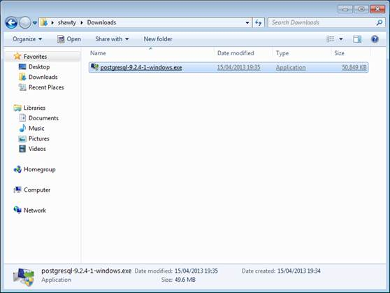
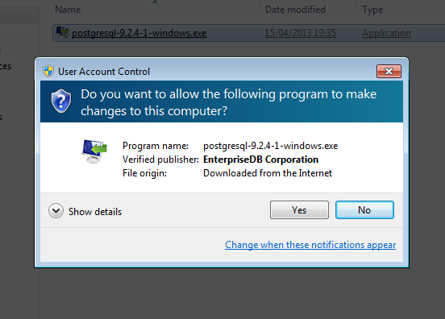
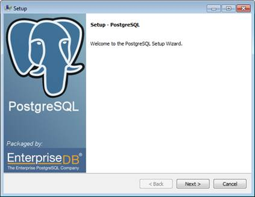
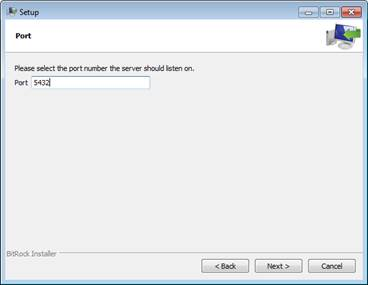
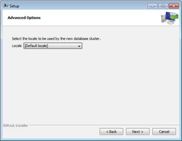
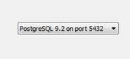
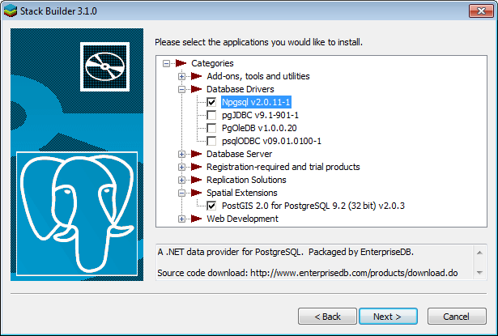
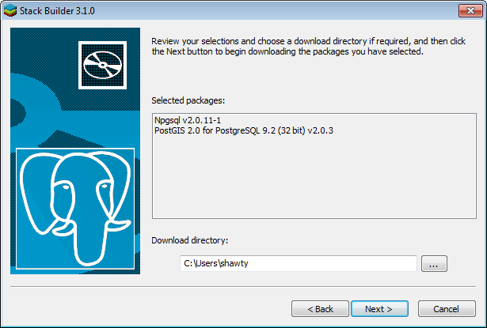

# 第四章安装后缀

现在您已经了解了 Postgres 及其功能，是时候实际安装和使用它了。因为我是在基于 Windows 的机器上写这本书的，说明和插图会反映这一点。

关于在其他操作系统上安装该系统，我将在继续的过程中发表评论，但不幸的是，本书中没有足够的空间来详细描述每个可用平台的安装过程。

## 获取软件

您可以从以下网站下载所需的一切:

[http://www.postgresql.org/download/](http://www.postgresql.org/download/)

您将找到各种平台的链接，以及实时光盘发行版等功能，以便您可以在安装应用程序之前试用它们。

请注意，所有使用包管理器(如 apt-get 或 Yum)的 Linux 和 Unix 发行版在其自己的存储库中也有自己的特定于发行版的 Postgres 包。如果可能的话，您应该使用这些版本，而不是下载页面上的通用版本。

特定于发行版的版本通常是为他们运行的特定平台量身定制的，并且通常会利用其他平台上没有的额外功能。

从下载页面还有 **[pgFoundry](http://pgfoundry.org/)** 的链接。我强烈建议深入探讨这一点，因为有大量的软件可用，从简单的扩展到完整的包，如 PostGIS。所有这些都呈现在一个简单易用的基于 web 的浏览器中，感觉非常像一个具有扩展信息的普通文件系统浏览器。

您还可以获得软件的所有版本，一直追溯到 v7.0.3，作为预编译的二进制文件，或者 v1.08 作为源代码树。在撰写本书时，最新版本是 v9.2.4。

## 安装服务器

出于我的目的，并且由于我已经在我工作的电脑上安装了 Postgres 的生产副本，我将把它安装到运行在 VMware desktop 下的 Windows 7 的虚拟机中。

我将描述的步骤对于其他版本也是相同的。虽然我们讨论的是操作系统，但我个人并没有尝试去看看 Postgres 是否会安装在 Windows 8 上，也没有遇到任何与之相关的信息。我个人的观点是，这很可能行得通，因为 Windows 8 仍然有经典的桌面和命令行可用。然而，我无法确认它是否会引起任何问题；我所有的安装，包括这本书的安装，都是在 64 位的 Windows 7 上。

下载安装程序可执行文件后，双击它，就像其他安装程序一样。请注意，在这里的演示中，我使用的是 Postgres 的 32 位安装。虽然 32 位和 64 位安装程序没有区别，但请注意，对于任何 32 位和 64 位应用程序，默认路径名和其他选择可能会有所不同。

图 1:post installer

首先，如果您配置了用户访问控制，您应该会看到正常的**用户访问控制**确认。因为 Postgres 是作为 Windows 服务安装的，所以它必须以管理员权限运行，否则安装将不会成功。

图 2:用户帐户控制窗口

与任何普通的应用程序安装程序一样，单击**是**运行一个大多数 Windows 用户都应该熟悉的安装向导。

图 3: Postgres 安装向导

点击**下一步**，系统会询问您安装服务器的位置。

图 4:安装目录设置

您可以单击小文件夹按钮以图形方式浏览到新位置，或者在提供的文本框中键入一个位置。一般来说，最好选择默认值，因为这将把它安装在其他应用程序的常用程序文件目录中。

下一页将询问您希望 Postgres 存储其数据文件的路径。这些将是 Postgres 存储实际数据的物理文件，因此您需要确保这些文件位于有足够磁盘空间供您使用的地方。明智的做法是确保这些文件存储在与应用程序完全不同的位置，但出于本书的目的，我将保持这两个文件夹相同。

图 5:数据目录设置

你应该看到的下一个屏幕是**密码**屏幕。

对于熟悉 SQL Server 的读者来说，**后缀**账户的作用与 **su** 账户相同。对于更熟悉 MySQL 的读者来说，这相当于 **Root** 账号。

图 6:密码设置

您必须保证此密码的安全，因为一旦服务器启动并运行，它就允许访问服务器上的所有帐户。在您添加其他帐户之前，它将是系统上唯一的活动帐户。

接下来，系统会询问您希望服务器监听的端口号。除非有特殊原因需要更改，否则最好将其保留为默认值。该选项存在的主要原因是 Postgres 允许您在同一台机器上运行同一台服务器的多个不同副本，完全独立于彼此和彼此的数据。

图 7:端口设置

下一页允许您设置特定于位置的字符集或端口号。最好将其保留在默认位置，安装程序会尝试根据您的操作系统安装语言来确定该位置。更改端口号是 Postgres 安装失败的最大原因之一。在这种情况下，服务器被设置并运行，填充数据，然后一旦不同位置的脚本试图从 web 服务器访问该数据，就会失败。使用默认端口可以防止出现这种情况。

图 8:高级选项设置

下一页应该是确认 Postgres 已准备好安装。点击**下一步**等几分钟，事情就设置好了。

如果一切按计划进行，您看到的最后一个对话框将询问您是否要运行堆栈生成器，并邀请您单击**完成**以完成安装。确保选中运行堆栈生成器的框，然后单击**完成**。

图 9:完成安装向导

## 什么是堆栈生成器？

Stack Builder 是一个只支持 Windows 的组件，允许您快速轻松地安装 Postgres 可用的许多附加组件中的一些。您可以使用它为您的编程项目安装访问库，并完成工具包来帮助管理您的服务器。

在主安装程序中单击**完成**后，您将看到以下内容:

图 10:堆栈构建器向导

您需要做的第一件事是使用页面中间的下拉菜单选择刚刚安装的 Postgres 服务器。

图 11:服务器下拉菜单

如果需要，您也可以使用**代理服务器**按钮设置您可能需要的任何外部访问代理信息。由于 Stack Builder 需要访问外部服务器来下载您选择的软件，因此您可能需要在其中指定一些选项。

我们不需要任何代理信息，所以一旦我们选择了我们正在运行的服务器，点击**下一步**继续。

堆栈生成器将访问 **pgFoundry** 服务器并下载一个应用程序列表，然后它将显示在屏幕上，允许您选择想要安装的软件。我鼓励你熟悉这份清单上的所有项目。

图 12:堆栈构建器应用程序列表

因为我们将在本书的后面看一下 PostGIS，也因为我们将编写一些示例。NET 代码来访问服务器，我们将选择 PostGIS 空间扩展和开源的 **Npgsql** 。NET ADO 接口库(对于那些使用 Visual Studio 的人来说，它也可以在 NuGet 上获得)。

图 13:堆栈构建器详细应用程序列表

选择完要安装的附加产品后，单击**下一步**继续。

下一页将询问您希望从哪里下载安装程序。由于这些将自动运行，您可以接受默认值。

但是，如果您想备份安装程序或稍后再次运行它们，您可能需要记下位置。

图 14:堆栈构建器下载目录

点击**下一步**开始下载您选择的产品。

图 15:堆栈构建器下载应用程序

一旦您选择的所有内容下载完毕，您应该会看到以下内容:

图 16:堆栈构建器应用程序安装

如果选择**跳过安装**复选框，堆栈构建器将完成，并将下载的扩展留在您选择的下载文件夹中。如果您不选择它，安装程序将运行并呈现它们自己的标准 Windows 安装过程，允许您设置它们。

正如我之前提到的，我们稍后会更仔细地研究这些，所以让安装程序运行。

您看到的安装程序应该像 Postgres 安装程序一样，熟悉通常的安装选择。

请注意，当您在显示的第一个屏幕上安装 PostGIS 时，系统会询问您是否要创建空间数据库。这个问题你应该回答是，因为我们以后会用到它。因为邮政地理信息系统安装程序需要对核心数据库设置进行更改，所以邮政地理信息系统会要求您输入您之前创建的管理员密码。不要跳过此步骤或使用不正确的密码，因为这将在以后给您带来问题，甚至可能需要重新安装。