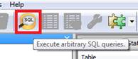
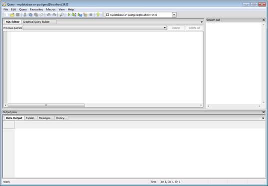
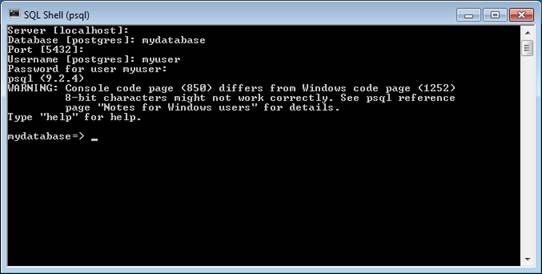
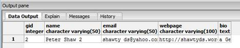
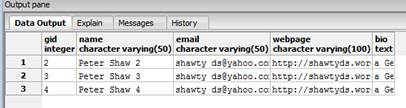
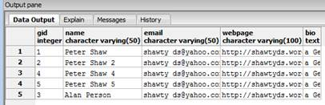
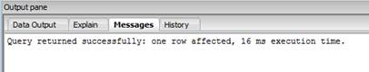

# 第六章基本 SQL

与本书的其他章节相比，这将是一个相当短的章节。为什么呢？

其实很简单。postgres 100%符合 ANSI-95 及以上标准。

这在实践中意味着，您已经知道的关于您选择的现有数据库的所有标准兼容的 SQL 仍然可以在 Postgres 中工作。

在互联网上已经有很多优秀的 SQL 参考资料，所以对我来说，涵盖其他地方已经做得更好的东西是没有用的。

将您的 SQL 命令输入 Postgres 通常有两种方法。首先，您可以使用 pgAdmin 的 SQL 编辑器，在这里您可以获得语法高亮显示和全屏编辑。您可以通过在对象树中选择要使用的数据库节点，然后单击主工具栏上的 SQL 放大镜按钮来打开它:



图 48: SQL 编辑器按钮

这将打开以下编辑器，供您输入 SQL 查询:



图 49: SQL 编辑器

或者您可以选择**图形查询生成器**选项卡:


图 50:图形查询生成器

另一种方法是在您的 Windows **开始**菜单中的 Postgres 组中执行 **SQL Shell** 选项:


图 51:开始菜单中的后缀

选择此选项时，系统会提示您输入服务器地址、数据库名称、用户名和密码等信息。如果您使用我们在上一章中创建的对象，您应该会得到如下结果:



图 52: SQL Shell

外壳识别的命令可以在[http://www.postgresql.org/docs/9.0/static/app-psql.html](http://www.postgresql.org/docs/9.0/static/app-psql.html)找到。

我不会在这里重复它们，因为我们将使用图形用户界面，但是如果您需要编写与 Postgres 的交互脚本，那么 PSQL 外壳是这样做的最佳方式。如果已经登录找不到出路， **\q** 会退出外壳。

## 付诸实践

打开一个 pgAdmin，点击图 48 所示的放大镜图标，打开 SQL 编辑器。

我经常发现为我正在处理的表展开树，然后调整我的**查询**窗口的大小，使其覆盖右侧窗格是很有用的，如下图所示:


图 53:调整查询窗口的大小

这允许我在键入时看到我的表和列名等，以便我可以看到我正在处理的内容。

首先，我们将在测试表中插入一些数据。在您的 SQL 窗口中键入以下内容，然后单击**运行**按钮或按 F5 执行。

```
    insert into
    mytable(name, email, webpage, bio)
    values(
      "Peter Shaw",
      "shawty_ds@yahoo.com",
      "http://shawtyds.wordpress.com",
      "a Geek pure and simple....")

```

如果您已经这样做了，那么您将看到一条错误消息，并想知道为什么与第一个字段的数据同名的列不存在。

还记得我之前说的对象名区分大小写吗？如果你看，我犯了一个经典的错误，在输入字符串时使用双引号。

就像我到目前为止给出的大部分建议一样，这是 Postgres 新用户经常遇到的另一个症结。虽然我同意错误消息可能更好，但 Postgres 实际上正在做它应该做的事情，并试图按照拼写解释表或对象名称。

如果您将所有这些双引号都更改为 single，那么您应该会看到新行现在已经插入到您的表中了。

对不同的数据重复该命令几次，这样您就可以多处理四行或五行数据。

您会注意到，在应用 **insert** 命令时，我们通过在表名后面的括号中包含一个逗号列表来明确告诉 Postgres 我们想要插入哪些列，并且我们确保在 values 部分提供了完全相同数量的数据参数。

这样做是为了不让我们试图将数据插入到 **gid** 列中，如果您还记得的话，该列现在处于 Postgres 序列的控制之下。

如果您现在键入:

```
    select * from mytable

```

进入 SQL 编辑器，然后按 F5，您应该会看到如下所示的内容，只显示您插入的数据:


图 54:输出窗格

其他简单的 SQL 语句如您所料:

```
    select * from mytable where gid = 2

```



图 55:输出窗格

```
    select * from mytable where gid in(2,3,4)

```



图 56:输出窗格

```
    update mytable set name = 'Alan Person' where gid = 3

```


图 57:输出窗格



图 58:输出窗格

```
    delete from mytable where gid = 4

```



图 59:输出窗格


图 60:输出窗格

在我们继续之前，还有一件事:因为 Postgres 非常兼容，所以像在许多其他数据库系统中一样查询 **INFORMATION_SCHEMA** 表将会得到相同的结果。

```
    SELECT * FROM information_schema.columns

```

当使用 SQL 管理工作室在 MS SQL 上运行时，以及使用 pgAdmin 在 Postgres 上运行时，此命令返回相同的信息列:


图 61:输出窗格

在下一章中，我们将介绍一些更有趣的专门针对 Postgres 的 SQL 示例。