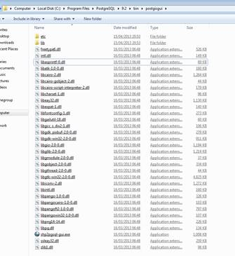
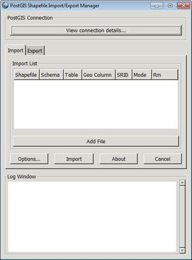

# 第八章波斯特吉斯

关于 Postgres 的任何一本书如果不提到 PostGIS 都是不完整的，这是 Postgres 成功的最大原因之一。这一简单的增加使 Postgres 站在了世界上大多数开源(和许多闭源)地图和地理信息系统的前列。

事实上，仅次于 Postgres 和 PostGIS 的第二大数据库技术是 Oracle Spatial，它的成本要高得多，并且通常是大多数中小型企业无法企及的。

在本章中，我不可能涵盖 PostGIS 的所有功能，所以它将相当简短。要更深入地了解 GIS(和 PostGIS)，请参阅我之前在*简洁*系列、[T3【GIS 简洁 T5】中的书，该书以 GIS 为主题。](http://www.syncfusion.com/resources/techportal/ebooks/gis)

## 那么 PostGIS 给表带来了什么呢？

首先，PostGIS 增加了许多新的数据类型。有些是我们已经看到的几何类型的扩展，有些是全新的。

它还增加了许多(数百个)处理功能，涵盖从处理基于矢量的图形和输入形状，到基于世界各地使用的不同网格系统的坐标转换的一切。

PostGIS 的最新版本已经得到扩展，提供了许多新的栅格分析功能，并且现在功能非常强大，其中许多功能可以获取扫描的纸质地图或航空照片的原始位图图像，并从中实际提取矢量细节到数据库表中。

让我们创建一个新的数据库，设置为使用 PostGIS，然后快速查看添加了什么。打开 pgAdmin，并按照前面章节中的说明创建数据库。

在选择模板时，请确保您选择了 PostGIS 安装程序为您添加的模板。

图 103:新的数据库属性

图 104:新的数据库定义

如果按照之前的安装说明，这个模板应该叫做 **template_postgis_20** 。

点击**确定**让 Postgres 创建你的新数据库。

创建数据库后，展开对象树，看看添加了什么。

图 105:对象树

一个包含空间参考信息的表，两个用于强制标注和几何类型的触发函数，四个帮助管理地理信息系统数据库元数据的视图，以及 892 个新的函数和例程。

如果你向下滚动函数列表，你会发现很多函数都是从 **st_** 开始的。这些功能是遵循简单功能标准的开放地理联盟(OGC)兼容功能。

有了这些功能，任何使用 OSG 标准编写的软件都可以轻松地将 Postgres 用作地理信息系统商店。这也意味着许多与 Oracle Spatial 等系统配合使用的软件在使用 Postgres 时不会有问题。

你还应该看到，你有很多平移功能，比如`ST_Transform()`，可以将全球几何从一个坐标空间转换到另一个坐标空间。

有许多不同的输出功能，例如`ST_AsGeoJson()`、`ST_AsKml()`和`ST_AsGml()`，它们允许您直接从存储在数据库中的地图数据中生成 GeoJson、Google Earth KML 和行业标准的 GML 文件。

最后，最重要的是，如果您在硬盘上存储 Postgres 的安装文件夹中查找，您应该还会发现一些额外的工具，例如 shp2pgsql:

图 106:安装的 Postgres 工具

该工具将行业标准的形状文件转换为 SQL 脚本，以便可以将其插入 Postgres。

如果您查看 **postgisgui** 文件夹，您应该还会发现这些工具的图形化版本，它允许您从本地硬盘中简单地选择 GIS 数据文件，并自动执行插入过程。

图 107: Postgisgui 文件夹

图 108:邮政地理信息系统形状文件导入/导出管理器

开始使用地理信息系统从未如此简单。不再需要阅读几十本这方面的书籍，也不再需要参加昂贵的课程。

有了自由的 Postgres 开源许可证、PostGIS 附加组件，再加上当今存在的许多免费地理空间应用程序，如 Quantum GIS，没有理由认为好的 GIS 系统很难找到。

我鼓励你在这个问题上更进一步；这是我觉得特别有趣的事情，我相信你也会的。