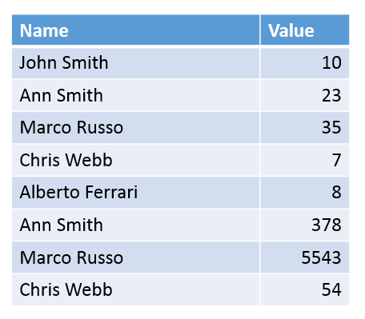

# 第五章深度潜水:xVelocity 引擎

PowerPivot 惊人功能的核心是 xVelocity 引擎。这是一项强大的技术，它使 PowerPivot 工作簿能够以如此惊人的幅度压缩数据，从而允许将巨大的数据集存储在相对较小的内存中。了解哪些数据压缩得好以及为什么会压缩，将有助于您了解工作簿是如何使用内存的。

## 理解压缩

PowerPivot 中的 xVelocity 引擎主要通过一种称为字典编码的功能来实现压缩。这通过创建一个整数索引来表示您的数据值，创建一个字典来存储索引/值关系，并且只在数据中存储索引来实现。

简单来说，考虑一下我们数据中的一组名称:

图 99:理解压缩的示例数据

我们可以看到这些名称中有几个是重复的，因此重复数据会产生一些存储开销。PowerPivot 将创建一个带有索引的字典:

图 100:名称列的字典

然后，它作为以下内容存储在工作簿中:

图 101:用字典索引存储的数据

这允许大量的数据压缩。即使是我们列表中最短的名字，安·史密斯，也要消耗 9 字节的数据。在我们描述的小字典中，我们需要 1 个字节来存储列表中多达 10 个条目。即使列表中有 10，000 个名字，我们也可以用一个 5 字节的数字来存储它。

实际上，这意味着数据集中重复频率更高的数据将得到更有效的压缩。例如，跨销售交易重复的产品代码将被很好地压缩。相反，有些数据根本压缩不好，例如销售交易金额，它会因行而异，几乎没有可重复性。

对所有这一切的一个小警告:前面的描述涵盖了压缩算法通常是如何工作的，并且得到了广泛的认可。然而，实际的压缩引擎并不公开，有时会有不同的行为，尽管这种行为的具体情况永远不会向最终用户公开。

## 管理非常大的工作簿

如果您的工作簿变得太大，有几个技巧可以让它缩小，这两个技巧都只需要一点压缩工作原理的知识。

第一种技术是简单地去掉一些列。没有存储在工作簿中的数据显然会占用更少的空间！了解压缩有助于您了解可以删除哪些数据以获得最大的影响。删除包含大量重复数据的列，如产品和交易代码，不会节省太多空间，即使代码本身很长。然而，不重复的列(如时间戳、货币金额等)会产生很大的不同。

第二个技巧需要一点思考。如果您被不重复的数据所困扰，例如时间戳、货币金额，甚至是人名，您可以尝试将这些列分成重复频率更高的块，并且仅在计算时将它们组合起来。

考虑交易金额，通常四舍五入到两位小数:

| 数量 |
| Seven point nine nine |
| Eight point nine nine |
| Ten point nine five |
| Twelve point nine five |
| Seven point four nine |
| Ten point four nine |
| Fifteen point four nine |
| Seven point seven five |

表 3:交易金额示例

该列表目前有八个唯一值。如果我们从主数字中分离出小数部分，那么重复性会发生变化:

| 数量 | 美元 | 分 |
| Seven point nine nine | seven | Ninety-nine |
| Eight point nine nine | eight | Ninety-nine |
| Ten point nine five | Ten | Ninety-five |
| Twelve point nine five | Twelve | Ninety-five |
| Seven point four nine | seven | forty-nine |
| Ten point four nine | Ten | forty-nine |
| Fifteen point four nine | Fifteen | forty-nine |
| Seven point seven five | seven | Seventy-five |

表 4:分割出的交易金额示例

现在我们有五个独特的美元金额和四个独特的美分金额。在这种微小的规模下，这将增加所需的空间——但要考虑对成千上万笔交易的影响。分币部分将只有 100 个排列，只能存储 2 个字节。根据你的美元数额的变化，这可以节省很多空间。带有时间戳的日期，甚至是第一个和；ast 名称可以用这种方式来看。