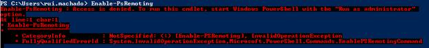
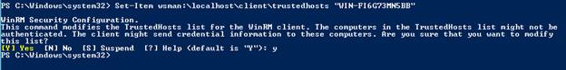

# 五、远程 PowerShell

## 使用远程电源外壳

远程访问本地机器或在远程机器上运行脚本是微软不愿意支持的功能，在 PowerShell 的第一个版本之前，没有办法做到这一点。自 PowerShell 2.0 以来，情况发生了变化，微软付出了巨大的努力来实施 Windows Management Foundation，它将 PowerShell 与 Windows Remote Management 结合起来，为系统管理员提供了工具，现在他们可以管理一个或多个域上的所有机器。

需要注意的一点是，并非所有的 PowerShell 命令都允许远程访问计算机。但是，有许多方法可以远程运行脚本，要么在远程计算机上执行脚本，要么在您自己的计算机上运行脚本。

在我们进入实际案例之前的另一个要点是，一些命令要求在两台机器上安装 PowerShell，而另一些命令可能在没有安装 PowerShell 的机器上运行。

要在计算机上远程使用 PowerShell，它必须在该计算机上处于活动状态。为此，请使用**启用-PsRemoting** 命令。

```powershell
          Enable-PsRemoting

```

确保您在管理员模式下运行 PowerShell 控制台，否则您将看到如图 42 所示的错误。



图 42:启用 PSRemoting 错误

您可能面临的另一个错误是网络连接类型。为了激活远程 PowerShell，您的所有网络连接类型必须是私有或域。错误如图 43 所示。


图 43:启用-PSRemoting 网络连接类型

这个问题的解决方案是将前面提到的连接类型更改为公共或域。为此，您必须调用以下函数，该函数将网络类型更改为由 type 参数指定的类型。您可以只为一个网络调用此脚本，或者激活标志(布尔参数“全部”)，为您的所有网络更改它。

```powershell
          function ChangeNetworkConType{
                param(
                      [ValidateSet("Domain","Public","Private")]
                      [string][Parameter(Mandatory=$true)]$Type,
                      [string][Parameter(Mandatory=$false)]$NetworkName,
                      [bool][Parameter(Mandatory=$true)]$ChangeAll
                )
                #Instantiate a network manager object using its CLSID (CLSID is a com object ID).
                [Activator]::CreateInstance([Type]::GetTypeFromCLSID([Guid]"{DCB00C01-570F-4A9B-8D69-199FDBA5723B}")) | %{

                      #Get all connections.
                      $allConns = @()
                      if($ChangeAll -eq $true){
                            $_.GetNetworkConnections() | %{ $allConns+= $_.GetNetwork()}
                      }else{
                            $_.GetNetworkConnections() | ?{$_.GetNetwork().GetName() -like "*$NetworkName*"} | %{$allConns+=$_.GetNetwork()}
                      }

                      $allConns | %{
                            <#
                                  Network Connection Types Available
                                  Public  - 0
                                  Private - 1
                                  Domain  - 2 //Won´t cover it in this script                      
                            #>
                            #Because we will change the context of execution to a switch, we must save the network connection to a variable.
                            $networkConnection = $_

                            switch($Type){
                                  "Public"
                                  {
                                        $networkConnection.SetCategory(0);
                                        break;
                                  }
                                   "Private"
                                  {
                                         $networkConnection.SetCategory(1);
                                         break;
                                  }
                                   default {"Only Private or Public type is implemented."}
                             }                      
                      }
                }    
          }

```

要调用该命令，只需运行以下代码块:

```powershell
          ChangeNetworkConType -Type "Private" -ChangeAll $true

```

在您克服了所有这些障碍之后，启用 PowerShell 远程应该不会再给您带来任何问题，但是您可能需要授权对您的机器进行一些更改。


图 44:启用 PSRemoting 运行时没有错误

## 识别远程 PowerShell 兼容命令

在使用远程 PowerShell 命令时，您可能会面临两种类型的上下文应用程序:一种是您有远程兼容命令并远程调用它，另一种是您没有远程兼容命令。在这种情况下，您需要通过远程会话直接在另一台机器上调用脚本或命令。要评估这两种情况中哪一种适合您，您需要检查某个命令是否与远程 PowerShell 兼容。

在这种情况下，要评估命令的兼容性，您可以简单地检查它是否有计算机名参数，这意味着您只需使用 **Get-Command** 命令就可以获得完全兼容的列表。这将返回 PowerShell 中所有可用命令的列表，然后过滤该列表以仅显示包含计算机名参数的命令。

```powershell
          #Get all commands.
          Get-Command -CommandType Cmdlet | %{
                #Filter the list to show those that contain computer name parameter.
                if(($_.Parameters -ne $null) `
                      -and ($_.Parameters["ComputerName"] -ne $null)){
                      #Return the command name.
                      $_.Name
                }
          }

```

|  | 注意:要在远程机器上调用命令，可能需要安装 PowerShell 但是，有一种常用的技术可以克服这个问题，那就是建立远程桌面会话。 |

## 测试远程连接

PowerShell 中允许通过其 **Test-Connection** 命令测试两台计算机之间的连通性，该命令的工作方式与旧的 ping 命令类似。它向一台或多台远程计算机发送互联网控制消息协议(ICMP)回送请求数据包(pings ),并返回回送响应回复。

```powershell
          #Test connection between this computer and another
          Test-Connection -ComputerName "WIN-FI6G73MN5BB"

```

这个命令以其最基本的形式很容易调用；只需用目标计算机名参数调用它，就可以了。这个调用的结果如图 45 所示，在这个例子中是成功的。


图 45:测试连接

检查连接是否建立后，您就可以开始在该机器上调用命令和脚本了。

## 调用远程机器中的脚本

虽然远程连接连接到一台计算机，但主机应用程序可以运行 **Invoke-Command** 在其他计算机上运行命令。有了这个概念，您可以使用**调用-命令**命令，该命令在本地或远程计算机上运行命令，并返回命令的所有输出，包括错误，只需将计算机名指定为参数。您的计算机和目标计算机之间会自动创建一个临时连接。

```powershell
          #Invoke the command with the target computer and the script block
          Invoke-Command –ComputerName “WIN-FI6G73MN5BB” –ScriptBlock {Get-Process}

```

调用此命令时，您可能会遇到以下错误，这可能是由几种情况引起的。我会给你最常见的一个解决方案。

```powershell
          [WIN-FI6G73MN5BB] Connecting to remote server WIN-FI6G73MN5BB failed with the following error message : WinRM cannot process the request. The following
          error with errorcode 0x80090311 occurred while using Kerberos authentication: There are currently no logon servers available to service the logon request.
           Possible causes are:
            -The user name or password specified are invalid.
            -Kerberos is used when no authentication method and no user name are specified.
            -Kerberos accepts domain user names, but not local user names.

            -The Service Principal Name (SPN) for the remote computer name and port does not exist.
            -The client and remote computers are in different domains and there is no trust between the two domains.
           After checking for the above issues, try the following:
            -Check the Event Viewer for events related to authentication.
            -Change the authentication method; add the destination computer to the WinRM TrustedHosts configuration setting or use HTTPS transport.
           Note that computers in the TrustedHosts list might not be authenticated.

```

为了解决这个问题，假设您已经使用 **Enable-PsRemoting** 命令在两台机器上启用了远程 PowerShell，那么在两台机器之间使用 WinRM 时，您可以使用以下代码建立信任关系。您必须在目标计算机和目标计算机上以管理员权限运行此操作。

```powershell
          Set-Item wsman:\localhost\client\trustedhosts “DestinationMachineName”

```



图 46:设置可信主机

|  | 注意:PowerShell 中机器之间的远程连接由一个名为 Kerberos 的安全和身份验证机制管理。此机制防止您连接的远程计算机使用您的帐户连接到其他计算机。 |