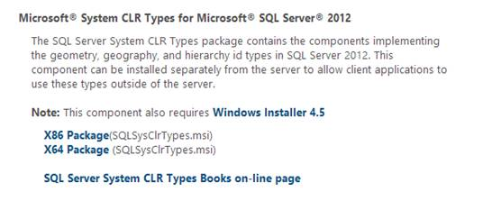
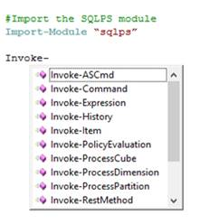
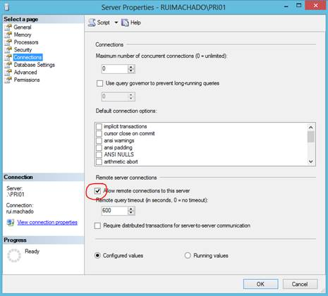

# 第七章 SQL Server 与 PowerShell

使用数据库是当今大多数开发人员的常规活动，这意味着现代编程语言必须能够连接到各种各样的数据库才能成功，PowerShell 也不例外。尽管由于。NET 框架，它仅限于它的提供者。

即使你觉得熟悉。NET，您应该考虑其他选项，如 PowerShell 模块，它们带来了更好的解决方案来优化您与 SQL Server 的交互。在本章中，您将学习如何使用微软的 PowerShell SQL Server 官方模块 SQLPS。我每天都在使用这个模块，事实证明它非常稳定和高效。要开始使用它，您需要安装 SQL Server 或安装一些请求的功能。

## 安装 SQLPS

如果您的计算机上安装了 SQL Server，那么 SQLPS 模块将与该安装一起安装。但是，您可以简单地从 Microsoft SQL Server 2012 功能包中安装三个独立的软件包。[点击这里](http://www.microsoft.com/en-us/download/details.aspx?id=29065)下载这些包，点击**安装说明**将打开所有可用功能的下拉列表。按照以下顺序下载并安装:

1.  微软系统 CLR 类型
2.  Microsoft SQL Server 2012 共享管理对象
3.  微软视窗服务器 2012 的扩展

安装完这些软件包后，您将能够加载 SQLPS 模块，并直接在 PowerShell 中开始使用您的 SQL 数据库。一个重要的注意事项是根据您的处理器架构选择正确版本的安装包。在图 47 中，您可以看到一个为每个要安装的特性选择的例子。



图 47:安装 SQLPS 功能

## 添加 SQL 管理单元

要将 SQLPS 模块添加到脚本中，您只需要调用**导入-模块**命令，该命令将模块添加到当前会话中。请注意，如果您希望在本地计算机或远程计算机上运行这些脚本，您导入的模块必须安装在本地计算机或远程计算机上。

```powershell
          #Import the SQLPS module
          Import-Module “sqlps”

```

将 SQLPS 模块导入到脚本后，PowerShell 中应该会有一些新的命令。如图 48 所示，您现在可以执行一个 SQL 命令，调用多维数据集上的一个进程，甚至可以从 Analysis Services 处理多维数据集上的一个维度。



图 48:新的 SQL 命令

## 调用 SQL 查询

```powershell
          #Import the SQLPS module only if it is not already loaded.
          if(-not (Get-Module "sqlps")){
                Import-Module “sqlps”
          }
          #Set the database.
          $database="rmBlog"

          #Set the server and instance.
          $server = ".\PRI01"

          #read the post name from the interactive shell.
          "Please enter a post to seach`n"
          $post = Read-Host

          #Set the query.
          $query = "SELECT p.PostTitle,
                   p.PostText,
                   p.PostDate
          FROM Post p
          WHERE PostTitle like '%$post%'"

          $query
          #Invoke the command providing as parameters all that are necessary.
          Invoke-Sqlcmd -ServerInstance $server -Database $database -Query $query

```

调用此脚本将直接从 SQL Server 返回一个结果数据集，您可以在脚本的其余部分中使用它。假设您希望结果是一个 XML 文件。可能会想到几个可以接受的解决方案，但是如果您正在使用 SQL Server，为什么不使用它来检索我们的 XML 文件结果呢？您只需要更改查询，以便转换结果并将其导出到一个 XML 文件中。

```powershell
          #...(Some code omitted)

          #Set the query.
          $query = “SELECT p.PostTitle,
                   p.PostText,
                   p.PostDate
          FROM Post p
          WHERE PostTitle like ‘%$post%’
          FOR XML AUTO, ROOT(‘MyPosts’)”

          #Invoke the command providing as parameters all that are necessary.
          $result = Invoke-Sqlcmd –ServerInstance $server –Database $database –Query $query

          #Load the result as XML.
          $xmlDoc = new-object System.Xml.XmlDocument
          $xmlDoc.LoadXml($result[0])

          #Export as XML.
          $xmlDoc.InnerXml | Out-File “c:\temp\testeSQL.xml”

```

调用该脚本后，您将有一个包含完整 DOM 对象的 XML 文件可供使用。下面的代码块显示了运行该脚本的结果。

```powershell
          <MyPosts>
              <p PostTitle="Snippet Creator C#"
                 PostText="My First Post"
                 PostDate="2013-06-18T20:29:18.857" />
          </MyPosts>

```

关于使用这个 SQL 模块，还有最后一个重要警告。当您运行脚本来调用对 SQL 数据库的调用时，您可能会遇到以下错误:

```powershell
          Invoke-Sqlcmd : A network-related or instance-specific error occurred while establishing a connection to SQL Server. The server was not found or was not
          accessible. Verify that the instance name is correct and that SQL Server is configured to allow remote connections. (provider: SQL Network Interfaces,
          error: 26 - Error Locating Server/Instance Specified)

```

如果所有服务器和数据库参数都正确，这可能与 SQL Server 配置有关，您需要更改该配置，以便允许该服务器的远程连接。您可以使用 SQL Server 管理工作室，如图 49 所示。



图 49:允许远程连接