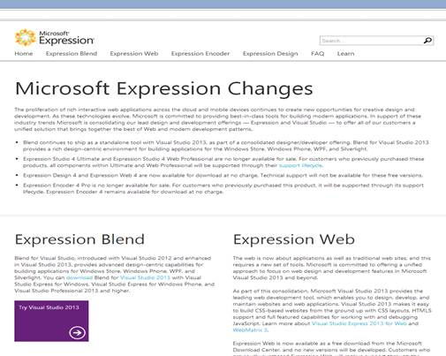

# 二、入门

使用Prism 4 框架需要什么？

Prism 4 框架可以用于任何版本的微软 Visual Studio 2008 和更高版本。正如您已经知道的，它可以与 WPF、Silverlight 和 Phone 7 或 8 解决方案一起使用。这是本书附带的用于构建三个解决方案的应用程序列表。如果您决定构建这些解决方案，则需要在您的计算机上下载并安装以下应用程序。

与微软Prism 4 演示解决方案一起使用的应用程序:

*   Microsoft Visual Studio 2012 Express 或更高版本
*   Syncfusion 基本工作室企业版
*   微软表情工作室 4 终极版
*   微软表达式混合 4
*   微软表达式设计 4
*   单元测试应用。

同步融合版本

与演示解决方案一起使用的 Essential Studio 企业版版本为 11.2045.0.25 版；这是演示解决方案所需的版本。如果您打算从头开始构建解决方案，只需下载 Syncfusion 套件的最新版本并使用该版本。

Prism 4 框架的成本是多少？

首先是第一件事。Prism 4 框架的成本是多少？Prism 4 最让你喜欢的一点是它的成本——它是免费的。你所要做的就是去网站下载框架。我们现在就开始吧。

下载微软Prism 4.1

你可以从 [`http://www.microsoft.com/en-us/download/details.aspx?id=28950`](https://www.nuget.org/packages/Prism/4.1.0 ) 的纽金特下载Prism 4.1。

图 1:微软Prism 4 下载网站

下载内容包括:

*   Prism 4.1 DLLs
*   针对 WPF 和 Silverlight 的众多快速启动解决方案
*   C#或 Visual Basic 的 Prism 4 参考手册。网
*   两个参考实现(股票交易者和 MVVM)
*   其他资源

我们将使用Prism版本 4.1。要开始下载，点击**下载**按钮。下载完成后，在电脑的**下载**文件夹中运行 **Prism4.1_Source** exe 文件。系统将要求您接受许可协议，并确定文件的加载位置。单击**确定**将文件提取到选定的位置。

提取文件后，您可以自动将 Prism 4 DLL 文件与 Visual Studio 项目相关联，也可以手动关联。

|  | 注意:我会将 Prism 4 DLL 文件移动到一个集中的文件夹中，该文件夹还包含在我的 Prism 4 解决方案中定期使用的其他 DLL。 |

获取其他应用程序

在我们开始这个项目之前，有几件事我们应该解决。首先，我使用了 Visual Studio Professional 或更高版本的演示解决方案。如果您没有 Visual Studio 2012 Professional 或更高版本，则适用于 Windows 桌面的 Visual Studio Express 2013 是可以使用的较新的免费应用程序版本。

如果你没有 Visual Studio 2013 的副本，可以在[http://www . Microsoft . com/visualstudio/eng/downloads # d-express-windows-desktop/](http://www.microsoft.com/visualstudio/eng/downloads%23d-express-windows-desktop/)获取快递版。

图 2:用于 Windows 桌面下载站点的 Visual Studio Express 2013

微软表达式混合 4 和微软表达式设计 4 被用来为*虚拟计算器*创建动画和图形。如果你没有副本，可以在[http://www.microsoft.com/expression/eng](http://www.microsoft.com/expression/eng)下载这两个应用的免费副本。

图 3:微软表达式网站

在本书中，我们还将使用 Syncfusion 的 Essential Studio 企业版控制套件。该套件的 30 天评估可在以下网址下载:[http://www.syncfusion.com/downloads/evaluation](http://www.syncfusion.com/downloads/evaluation)。

图 4:同步融合下载站点

如果您想在解决方案中运行单元测试，我使用 NUnit 作为单元测试应用程序。你可以在[http://www.nunit.org/index.php?p=download](http://www.nunit.org/index.php?p=download)下载一份免费的 NUnit。

图 5: NUnit 下载站点

下一步是什么？

现在我们有了 Prism 4 和其他需要的应用程序，我们将讨论如何使用 WPF 和 Prism 4 构建一个 *Hello World* 解决方案。