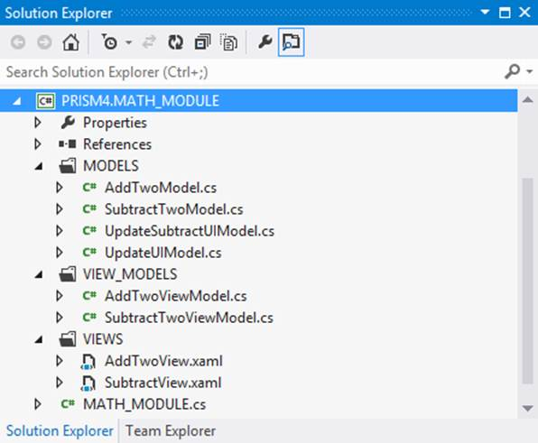

# 七、Prism 4 和 MVVM

模型-视图-视图模型(MVVM)设计模式不包含在 Prism 4 库中，但它是框架的一个特别合适的伴侣。MVVM 是所有关注的分离。它的主要目标是将解决方案的观点与其业务规则隔离开来。MVVM 模式由三部分组成:视图、视图模型和模型。

MVVM 观

视图包含解决方案中的用户界面。视图是用户与解决方案交互的方式。

在 Prism 4 中，解决方案视图可以是用户控件、数据模板或几乎任何容器控件。Prism 4 视图也可以被注入壳形式的区域或其他视图。这允许在运行时动态构建用户界面。我们将在第 9 章展示如何将视图注入区域。

清单 AddTwoView 视图的列表

```cs
      <syncfusion:TabItemExt 

          x:Class="PRISM4.MATH_MODULE.VIEWS.AddTwoView"

          xmlns:x="http://schemas.microsoft.com/winfx/2006/xaml"
          xmlns:mc="http://schemas.openxmlformats.org/markup-compatibility/2006"
          xmlns:d="http://schemas.microsoft.com/expression/blend/2008"
          xmlns:ei="http://schemas.microsoft.com/expression/2010/interactions"
          xmlns:i="http://schemas.microsoft.com/expression/2010/interactivity"

          xmlns:syncfusion="http://schemas.syncfusion.com/wpf"

          x:Name="AddTwo"
          mc:Ignorable="d"
          d:DesignWidth="300"
          Header="{Binding Path=TabHeaderText}"
          Height="auto">

          <i:Interaction.Triggers>

              <i:EventTrigger
                  EventName="Loaded">

                  <i:InvokeCommandAction 
                          Command="{Binding TabLoadedCommand}">
                  </i:InvokeCommandAction>

              </i:EventTrigger>

          </i:Interaction.Triggers>

          <Grid
              Name="MainGrid">

              <Grid.RowDefinitions>
      ...
      ...
              <!--***************************************************
              ADD Interaction Behaviors here.
              *******************************************************-->
              <i:Interaction.Behaviors>

                  <ei:DataStateBehavior
                      x:Name="TextBox1ExceptionBehavior"
                      Binding="{Binding TextBox1Exception}"
                      Value="true"
                      TrueState="TextBox1ExceptionStatusTrueState"
                      FalseState="TextBox1ExceptionStatusFalseState">
                  </ei:DataStateBehavior>

      ...

              </i:Interaction.Behaviors>

              <!--***************************************************
              Add Visual State Manager (VSM) groups here.
              *******************************************************-->
              <VisualStateManager.VisualStateGroups>

                  <VisualStateGroup
                  x:Name="Exception1TextBoxStates">

                      <VisualState
                      x:Name="TextBox1ExceptionStatusTrueState">

                          <Storyboard>

                              <BooleanAnimationUsingKeyFrames
                                  Storyboard.TargetProperty="IsEnabled" 
                                  Storyboard.TargetName="CalculateButton">

                                  <DiscreteBooleanKeyFrame
                                      KeyTime="0"
                                      Value="false">
                                  </DiscreteBooleanKeyFrame>

                              </BooleanAnimationUsingKeyFrames>

      ...

              </VisualStateManager.VisualStateGroups>

              <Border
                  Grid.Row="0"
                  Grid.Column="0"
                  Grid.RowSpan="5"
                  BorderBrush="DarkBlue"
                  BorderThickness="3"
                  CornerRadius="5" 
                  Margin="10">

                  <ScrollViewer
                      VerticalScrollBarVisibility="Auto">

                      <TextBlock
                          Name="HelpText"
                          Text="{Binding Path=DescriptionTextboxText}"
                          Height="auto"
                          Width="Auto"
                          HorizontalAlignment="Stretch"
                          VerticalAlignment="Stretch"
                          TextWrapping="WrapWithOverflow"
                          FontWeight="Bold"
                          FontSize="16"
                          Foreground="Blue"
                          Padding="5">

                          <TextBlock.Background>
                              <LinearGradientBrush EndPoint="0.5,1" StartPoint="0.5,0">
                                  <GradientStop Color="LightSteelBlue" Offset="0"/>
                                  <GradientStop Color="LightSteelBlue" Offset="1"/>
                                  <GradientStop Color="White" Offset="0.556"/>
                              </LinearGradientBrush>
                          </TextBlock.Background>

                      </TextBlock>

                  </ScrollViewer>

              </Border>

              <ScrollViewer
                  Grid.Row="0"
                  Grid.Column="1"
                  VerticalScrollBarVisibility="Auto"
                  Margin="0,0,5,0">

                  <GroupBox
                      Name="ContentGroupBox"                
                      BorderBrush="DarkBlue"
                      BorderThickness="3"
                      Header="{Binding Path=GroupBoxHeaderText}"                 
                      FontWeight="Bold"
                      Padding="2">

                      <GroupBox.Background>
                          <LinearGradientBrush EndPoint="0.5,1" StartPoint="0.5,0">
                              <GradientStop Color="LightSteelBlue" Offset="0"/>
                              <GradientStop Color="LightSteelBlue" Offset="1"/>
                              <GradientStop Color="White" Offset="0.541"/>
                          </LinearGradientBrush>
                      </GroupBox.Background>

                      <Grid
                          Name="CalculationGrid"
                          HorizontalAlignment="Stretch"
                          VerticalAlignment="Stretch"
                          Margin="5,10">
      ...

                          <Label
                              Name="Integer1Label"
                              Grid.Row="0"
                              Grid.Column="0"
                              FontWeight="Bold"
                              FontSize="14"
                              Content="Integer One: "
                              Margin="0,0,0,3">
                          </Label>

                          <TextBox
                              Name="Integer1TextBox"
                              Grid.Row="0"
                              Grid.Column="1"                        
                              FontWeight="Bold"
                              FontSize="14"
                              HorizontalAlignment="Stretch"
                              VerticalAlignment="Stretch"
                              VerticalContentAlignment="Center"
                              Margin="0,0,0,3"
                              Text="{Binding Path=TextBoxOneText}">

                              <i:Interaction.Triggers>

                                  <i:EventTrigger
                                      EventName="TextChanged">

                                      <i:InvokeCommandAction 
                                             Command="{Binding TextBoxOneTextChangedCommand}"
                                             CommandParameter="{Binding ElementName=Integer1TextBox, Path=Text}">
                                      </i:InvokeCommandAction>

                                  </i:EventTrigger>

                              </i:Interaction.Triggers>

                          </TextBox>

      ...

                          <Button
                              Name="ClearButton"
                              Content="Clear"
                              Grid.Row="3"
                              Grid.Column="1"                        
                              FontWeight="Bold"
                              Foreground="DarkBlue"
                              FontSize="16"
                              Margin="0,5,0,0">

                              <i:Interaction.Triggers>

                                  <i:EventTrigger
                                      EventName="Click">

                                      <i:InvokeCommandAction 
                                          Command="{Binding ClearButtonClickCommand}">
                                      </i:InvokeCommandAction>

                                  </i:EventTrigger>

                              </i:Interaction.Triggers>
                          </Button>

                          <Button
                              Name="CalculateButton"
                              Content="Calculate"
                              Grid.Row="0"
                              Grid.Column="2"
                              Grid.RowSpan="4"
                              FontWeight="Bold"
                              Foreground="DarkBlue"
                              FontSize="16"
                              Margin="5,0"
                              Padding="10"
                              IsDefault="True">

                              <i:Interaction.Triggers>

                                  <i:EventTrigger
                                      EventName="Click">

                                      <i:InvokeCommandAction 
                                          Command="{Binding CalculateButtonClickCommand}">
                                      </i:InvokeCommandAction>

                                  </i:EventTrigger>

                              </i:Interaction.Triggers>
                          </Button>

                      </Grid>

                  </GroupBox>

              </ScrollViewer>

      ...
                  </ScrollViewer>

              </Border>

          </Grid>

      </syncfusion:TabItemExt>…

```

关于清单 24，您会注意到的第一件事是它包含了大量的标记……这只是部分清单！这是因为 XAML 的力量使它不仅仅是简单地渲染用户界面成为可能。除了呈现用户界面之外，清单 24 中的标记还公开了在解决方案的生命周期中，当用户与其交互时，用于更新用户界面的行为和状态。

如果仔细查看清单 24 中的标记，您会注意到没有使用标准的用户控件。这样做的原因是，如果我们使用常规用户控件，我们将为我们注入的每个视图向选项卡控件添加一个选项卡，但是选项卡标题将是空白的。用户控件中没有允许填充选项卡标题属性的属性。这个问题的解决方案是使用*同步表文本*控件(`<syncfusion:TabItemExt>`)。此控件具有标头属性，并允许填充属性。

基于状态的导航

这个观点的另一个有趣的方面是，Prism 4 基于状态的导航用于更新用户界面。每个状态都通过表达式混合行为和关联的状态来实现。

基于状态的导航允许用户界面在不同状态之间转换。基于状态的导航在不影响数据或底层业务规则的情况下更改视图。

|  | 注意:我可以使用微软的掩码编辑控件或者 Syncfusion 的数字控件，比如 Integer 文本框控件。这些控件将大大减少解决方案中所需的验证代码量。我使用了常规的文本框控件来展示这种解决方案中的一种验证方法。 |

基于状态的导航行为

在清单 25 中，一个`DataStateBehavior`用于触发两种状态之一。每个状态都执行动画故事板，这些动画故事板更改用户界面控件中的不同属性。

`binding`属性与位于视图模型中的`Boolean`属性相关联。此属性用于将行为设置为两种状态之一。我们将在查看视图模型时更多地讨论这一点。

真实状态触发`TextBox1ExceptionStatusTrueState`。出现异常时会触发此状态。当没有异常时`TextBox1ExceptionStatusFalseState`被触发。

`Value`属性包含行为的初始设置，在本例中为`true`。

清单 25:文本框异常行为标记

```cs
        <ei:DataStateBehavior
            x:Name="TextBox1ExceptionBehavior"
            Binding="{Binding TextBox1Exception}"
            Value="true"
            TrueState="TextBox1ExceptionStatusTrueState"
            FalseState="TextBox1ExceptionStatusFalseState">
        </ei:DataStateBehavior>

```

基于状态的导航状态

清单 26 显示了`TextBox1ExceptionStatusTrueState`。当`TextBox1Exception`属性设置为`true`时，该状态被触发。这个部分列表显示了三个故事板关键帧。

`BooleanAnimationUsingKeyFrames`用于设置`Calculate`按钮的`IsEnabled`属性。当抛出异常时，`IsEnabled`属性值设置为假。

第一个`ColorAnimation`将`Integer1Textbox`的前景色变为白色。第二个`ColorAnimation`将`Integer1Textbox`的背景颜色更改为红色。

这些更改用于给用户界面一个有异常的视觉指示。禁用`Calculate`按钮可阻止用户传递无效数据进行计算。

清单 26:文本框 1 异常状态标记的部分列表

```cs
        <VisualState
                        x:Name="TextBox1ExceptionStatusTrueState">

                            <Storyboard>

                                <BooleanAnimationUsingKeyFrames
                                    Storyboard.TargetProperty="IsEnabled" 
                                    Storyboard.TargetName="CalculateButton">

                                    <DiscreteBooleanKeyFrame
                                        KeyTime="0"
                                        Value="false">
                                    </DiscreteBooleanKeyFrame>

                                </BooleanAnimationUsingKeyFrames>

                                …

                                <ColorAnimation
                                    Storyboard.TargetProperty="Foreground.Color"
                                    Storyboard.TargetName="Integer1TextBox"
                                    To="White">
                                </ColorAnimation>

                                <ColorAnimation
                                    Storyboard.TargetProperty="Background.Color"
                                    Storyboard.TargetName="Integer1TextBox"
                                    To="Red">
                                </ColorAnimation>

                              …

                            </Storyboard>

                        </VisualState>

```

MVVM 视图模型

视图模型充当视图和模型之间的中介。它通过数据上下文向视图公开公共属性。(我们在第 6 章中查看了数据上下文。)视图通过数据上下文和绑定了解视图模型；另一方面，视图模型不知道它所服务的视图。这是 MVVM 模式的一个非常重要的方面。视图模型将实体暴露给视图，而没有关于它们向其提供服务的视图的真实信息。这允许视图被设计为独立的实体，简单地使用视图模型提供的服务。

清单 27 显示了`AddTwoViewModel`的部分列表。

清单 AddTwoViewModel

```cs
        public class AddTwoViewModel : INotifyPropertyChanged
        {
          #region CLASS PROPERTIES AND MEMBERS

          #region CLASS CONSTANTS

            private const string AddIntegersTabHeaderText = "Add Two Integers";
            private const string AddIntegersGroupboxHeaderText = "Add Integers";

          #endregion //END CLASS CONSTANTS REGION

          #region CLASS SINGLE MEMBERS

            private IEventAggregator EventAggregator;
            private UpdateUIModel UIModel;
            private IUpdateUIState CurrentUIState;
            private bool ClearFlag = false;
            private ObservableCollection<string> IntegerStrings = new                   ObservableCollection<string>();

            private string IntegerTotal = "";

            private AddTwoModel AddIntegers;

            private IDescription Description;
            private DescriptionResult DescriptionResult;

          #endregion //END CLASS SINGLE MEMBERS REGION

          #region GENERAL CLASS PROPERTIES AND MEMBERS              

            private string TAB_HEADER_TEXT;
            public string TabHeaderText
            {
              get
              {
                return TAB_HEADER_TEXT;
              }

              set
              {
                if (TAB_HEADER_TEXT != value)
                {
                  TAB_HEADER_TEXT = value;
                  NotifyPropertyChanged("TabHeaderText");
                }
            }
        }
        ...

          #region CLASS CONSTRUCTOR

            public AddTwoViewModel
            (IEventAggregator EventAggregator,
             UpdateUIModel UIModel,
             IUpdateUIState CurrentUIState,
             AddTwoModel AddIntegers,
             IDescription Description,
             DescriptionResult DescriptionResult)
            {
              if (EventAggregator != null)
              {
                this.EventAggregator = EventAggregator;
              }

              if (UIModel != null)
              {
                this.UIModel = UIModel;
              }

              if (AddIntegers != null)
              {
                this.AddIntegers = AddIntegers;
              }

              if (Description != null)
              {
                this.Description = Description;
              }

              if (DescriptionResult != null)
              {
                this.DescriptionResult = DescriptionResult;
              }

          SetDescriptionText();
          SetHeaderValues();
          ResetUserInterface();

          TAB_LOADED_COMMAND = new DelegateCommand(TabLoad);
          TEXT_BOX_ONE_TEXT_CHANGED_COMMAND = new DelegateCommand<string>(TextBoxOneTextChanged);
          TEXT_BOX_TWO_TEXT_CHANGED_COMMAND = new DelegateCommand<string>(TextBoxTwoTextChanged);
          CLEAR_BUTTON_CLICK_COMMAND = new DelegateCommand(ClearButtonClick);
          CALCULATE_BUTTON_CLICK_COMMAND = new DelegateCommand(CalculateButtonClick);
        }

          #endregion //END CLASS CONSTRUCTOR REGION

```

INotifyPropertyChanged 接口

`AddTwoViewModel`类实现了`INotifyPropertyChanged`接口。正如我们前面提到的，这个界面用于反映视图模型对视图所做的更改。它应该在所有包含公共属性的视图模型类中实现。让我们仔细看看代码。

清单 28:一个属性和 INotifyPropertyChanged 代码

```cs
                private string TAB_HEADER_TEXT;
                public string TabHeaderText
                {
                    get
                    {
                        return TAB_HEADER_TEXT;
                    }

                    set
                    {
                        if (TAB_HEADER_TEXT != value)
                        {
                            TAB_HEADER_TEXT = value;
                            NotifyPropertyChanged("TabHeaderText");
                        }
                    }
                }

        ...

        #region I NOTIFY PROPERTY CHANGED

                public event PropertyChangedEventHandler PropertyChanged;

                private void NotifyPropertyChanged(string PropertyName)
                {
                    if (PropertyChanged != null)
                    {
                        PropertyChanged(this, new PropertyChangedEventArgs(PropertyName));
                    }
                }

        #endregion  //END I NOTIFY PROPERTY CHANGED REGION

```

清单 28 显示了一个`INotifyPropertyChanged`代码的例子。属性`TabHeaderText`调用`NotifyPropertyChanged`方法。它将其名称传递给方法(`PropertyName`)。保护子句确定`PropertyChanged`事件处理程序不为空。如果处理程序不为空，则触发事件。视图模型被传递给事件的发送方参数，而`PropertyName`被传递给事件的`PropertyChangedEventArgs`。

视图使用的视图模型中的每个公共属性都应该在其 setter 中调用`NotifyPropertyChanged`方法，并将其属性名传递给该方法。

MVVM 模式

MVVM 模式是我们展示服务的地方。这些服务可以是本地的，也可以是全球的。服务可以是从数据访问层到业务规则的任何东西。该模型被设计成对视图或视图模型一无所知，并提供执行解决方案所需的服务。

MVVM 模式中唯一应该知道模型的类是视图模型。视图模型从模型中访问服务，并将它们的返回值作为公共属性公开给视图。这在视图和模型之间提供了必要的关注点分离。

解决方案中的每个 Prism 4 模块都应该使用 MVVM 模式来保持视图和模型的分离。有许多方法可以合并这种关注点的分离。图 10 显示了*虚拟计算器*解决方案中使用的文件夹结构示例。



图 10:数学模块项目文件夹布局

模块中有三个文件夹:模型、视图模型和视图。

我使用文件夹来分隔类，以便更好地组织我的解决方案。这在包含大量不同类型的类的大型项目中非常方便。

摘要

让我们简单介绍一下 MVVM。MVVM 不是一个Prism 4 构造，但旨在与框架很好地合作。它的主要目的是加强视图和模型之间的关注点分离。视图的数据上下文用于将视图模型松散地耦合到视图。视图通过数据上下文了解视图模型，但视图模型对视图知之甚少或一无所知。视图模型了解模型。模型不了解视图或视图模型。

视图模型使用`INotifyPropertyChanged`界面来同步视图模型和视图中的更改。

尽管 MVVM 设计模式不是微软 Prism 4 的一部分，但它确实是使用该框架的解决方案的有力补充

在下一章中，我们将讨论Prism 4 区域。