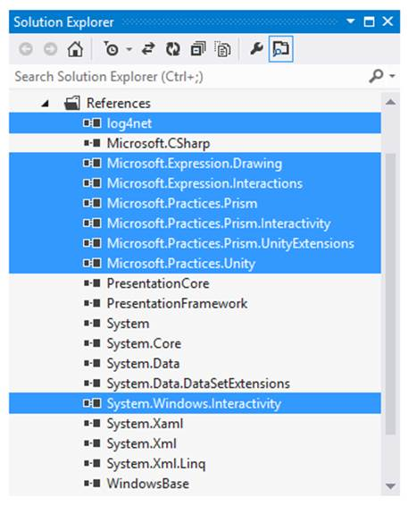

# 第十三章虚拟计算器解决方案

在本章中，我们将着眼于我们尚未解释的部分来看*虚拟计算器*解决方案。我将讨论为什么事情会这样做的一些原因，并讨论解决方案可以重构的一些方法。

虚拟计算器解决方案

构建 Prism 4 解决方案的第一步是创建一个 Visual Studio 解决方案。我更喜欢只创建一个解决方案。这允许我为我的项目使用符合我的标准的命名约定。

|  | 注意:当然，您可以简单地向解决方案文本框中添加正确的解决方案名称。我总是忘记！ |

如果选择了一个项目(如 WPF 应用程序)，将创建解决方案和 WPF 项目。项目名称与解决方案名称相同，例如，PRISM4.PRISM4 .点符号用于将解决方案名称与项目名称分开。我更喜欢用以下方式命名我的解决方案和项目:PRISM4。主，PRISM4。基础设施等。我觉得使用这种符号更好地描述了解决方案中的每个项目。

|  | 提示:我在这本书里使用的技巧和布局是最适合我的。如果你是棱镜 4 的新手，我建议你从使用我的技术和布局开始。随着你变得越来越熟练，你可以根据自己的口味设置解决方案。 |

主(启动)项目

*主*项目是 WPF 和棱镜 4 解决方案开始的项目。*主*项目是 WPF 应用项目。这个项目是组合根和引导程序所在的地方。这也是解决方案的外壳形式所在的位置。

其他必要的类和文件也驻留在这个项目中。区域适配器通常位于主项目中，图像和其他文件(如 *App.config* 文件)位于该项目中。

加载动态链接库引用

在项目中使用棱镜 4 之前，我们需要加载棱镜 4 库。当我们下载 Prism 4 时，所需的 dll 包含在文件中。

|  | 提示:使用 Prism 4 解决方案时，我会将所有需要的 DLL 文件(Prism 4 和其他必要的文件)移动到一个中心文件夹中。这让我可以快速找到需要的 dll。棱镜 4 WPF dll 位于棱镜 4 下载的\Bin\Desktop 文件夹中。您还可以选择使用 RegisterPrismBinaries 工具自动将 Prism 4 DLL 文件加载到您的 Visual Studio 解决方案中。该工具位于下载的棱镜 4 文件夹中。 |

需要将以下选定的 DLL 文件添加到项目中:



图 14:主要项目动态链接库引用

虽然我们不会谈论使用 Log4Net DLL，但这是我的 Prism 4 解决方案中经常使用的库，因此也添加了它。Prism 4 有一个默认的日志机制，将所有活动记录到输出控制台。在 Prism 4 解决方案中，您不必真的做任何事情来实现这一功能。您还可以选择使用第三方记录器，这就是 Log4Net 记录器的用途。

微软。表达式。绘图 DLL 用于绘制矢量图形。这个和所有的微软。表达式 dll 来自表达式混合和表达式设计。

我们需要微软。表达式交互和交互性库，用于处理我们解决方案中的触发器和行为。

微软。棱镜 DLL 是棱镜 4 的主要库。它包含允许使用事件聚合、区域、模块、导航和任何其他 Prism 4 特性的类。

微软。统一和统一扩展动态链接库与统一直接接口容器一起使用。这是我们在此解决方案中使用的 DI 容器。托管可扩展性框架(MEF) DI 容器有库，但是没有必要添加 DLL，因为我们不会使用 MEF。

这些是使用 Prism 4 所有功能所需的最小库。还有其他的库，比如 Service Location，但是它们并不是必须以本书中使用的方式使用 Prism 4 框架。

设置主项目文件夹结构

现在我们有了必要的项目引用，下一步是设置项目文件夹。有许多方法可以做到这一点；我发现下面的文件夹结构最适合我。


图 15:主项目文件夹布局

请注意，我对文件夹名称使用了所有大写字母。这将我添加的文件夹与 Visual Studio 文件夹区分开来。

贝壳形态

目前，请将 Prism 4 外壳形式视为解决方案将使用的主要显示。这个窗口表单是我们组成解决方案的视图的地方。我们在第 7 章中讨论了*虚拟计算器*外壳形式。

与常规的 WPF 表单不同，shell 表单在设计时不包含大量内容。事实上，外壳表单最初可以在没有任何内容的情况下设计。在*虚拟计算器*解决方案中，我们在运行时从模块向外壳表单动态添加视图。当我们谈到模块时，我们在第 9 章中详细讨论了这个过程。

应用程序 xaml 文件

App.xaml 文件是 WPF 解决方案的正常起点(组合根)。App.xaml 文件使用`StartupUri`标记指向*主*项目中的窗口表单(在本例中为 MainWindow.xaml)。随着我们设置棱镜 4 WPF 解决方案的进展，我们更改了该文件，以使项目符合棱镜 4。在清单 60 中，我们删除了粗体的`StartupUri`属性。

清单 62:应用程序 xaml 文件标记

```
        <Application
            x:Class="PRISM4.MAIN.App"

            xmlns:x="http://schemas.microsoft.com/winfx/2006/xaml"

            StartupUri="MainWindow.xaml">

            <Application.Resources>

            </Application.Resources>

        </Application>

```

app . xaml . cs 文件

虽然 App.xaml 文件适用于简单的 WPF 解决方案，但是 Prism 4 解决方案是通过调用`Bootstrapper`类来启动的。最简单的方法是从 App.xaml 文件中移除`StartupUri`，并从 App.xaml.cs 文件中调用`Bootstrapper`类。该文件作为 App.xaml 文件的代码隐藏文件，可以替换为 WPF 解决方案的启动文件。我们在第 3 章构建 Hello Prism 4 解决方案时讨论过这个文件。

应用程序配置文件

App.config 文件是 *Main* 项目的配置文件，也供解决方案中的所有其他项目使用。该文件用于提供解决方案的后期绑定，也可用于为与 Prism 4 一起使用的第三方记录器创建附加程序。如果使用微软实体框架，连接字符串和许多其他基于字符串的项目可以添加到这个文件。

在*虚拟计算器*解决方案中使用 App.config 文件在解决方案启动时加载模块。解决方案中的三个模块都有定义模块的 XAML 标记，用于加载模块。清单 63 显示了*虚拟计算器*解决方案的应用程序配置文件示例。

清单 63:虚拟计算器应用程序配置文件标记

```
        <?xml
          version="1.0"
          encoding="utf-8" ?>

        <configuration>

          <configSections>

            <section
              name="modules"
              type=
              "Microsoft.Practices.Prism.Modularity.ModulesConfigurationSection,
              Microsoft.Practices.Prism"/>

          </configSections>

          <modules>

            <module
              assemblyFile="MODULES/PRISM4.APPLICATION_LOGO_MODULE.dll"

              moduleType=
              "PRISM4.APPLICATION_LOGO_MODULE.APPLICATION_LOGO_MODULE,
              PRISM4.APPLICATION_LOGO_MODULE,
              Version=1.0.0.0,
              Culture=neutral,
              PublicKeyToken=null"

              moduleName="APPLICATION_LOGO_MODULE"

              startupLoaded="True">

            </module>

            <module
              assemblyFile="MODULES/PRISM4.COMPANY_LOGO_MODULE.dll"

              moduleType=
              "PRISM4.COMPANY_LOGO_MODULE.COMPANY_LOGO_MODULE,
              PRISM4.COMPANY_LOGO_MODULE,
              Version=1.0.0.0,
              Culture=neutral,
              PublicKeyToken=null"

              moduleName="COMPANY_LOGO_MODULE"

              startupLoaded="True">

            </module>

            <module
              assemblyFile="MODULES/PRISM4.MATH_MODULE.dll"

              moduleType=
              "PRISM4.MATH_MODULE.MATH_MODULE,
              PRISM4.MATH_MODULE,
              Version=1.0.0.0,
              Culture=neutral,
              PublicKeyToken=null"

                  moduleName="MATH_MODULE"

                  startupLoaded="True">

            </module>

          </modules>

          <startup>
            <supportedRuntime
              version="v4.0"
              sku=".NETFramework,Version=v4.5" />
          </startup>

        </configuration>

```

首先，在 App.config 文件的`configSections`部分创建一个模块部分。模块部分是解决方案的所有 Prism 4 模块标记所在的位置。*虚拟计算器*解决方案有三个模块:

1.  公司标志模块
2.  应用程序徽标模块
3.  数学模块

这三个模块在 App.config 文件中都有标识该模块的标记。该标记用于在解决方案启动时加载每个模块。让我们来看看其中一个模块加载器。

清单 64:应用程序配置文件数学模块标记

```
        <module
              assemblyFile="MODULES/PRISM4.MATH_MODULE.dll"

              moduleType=
              "PRISM4.MATH_MODULE.MATH_MODULE,
              PRISM4.MATH_MODULE,
              Version=1.0.0.0,
              Culture=neutral,
              PublicKeyToken=null"

                  moduleName="MATH_MODULE"

                  startupLoaded="True">

            </module>

```

我们在模块标签后遇到的第一个属性是`assemblyFile`属性。该属性指向模块 DLL 文件的路径和文件名。*虚拟计算器*解决方案将其所有模块动态链接库文件存储在模块文件夹中，该文件夹位于解决方案的调试或发布文件夹中。

`moduleType`属性是与模块项目相关联的模块类的名称空间和名称。解决方案名称和项目名称是该属性的第二部分。该属性中还添加了`Version`、`Culture`和一个空值`PublicKeyToken`。

`moduleName`属性是模块类的名称。

`startupLoaded`属性是一种`Boolean`类型，如果`true`则在解决方案启动时加载模块，如果设置`false`则不加载模块。

解决方案中的每个模块都使用相同的标记及其关联的模块数据。

|  | 提示:请记住 App.config 文件不是安全文件！不要在此文件中保存可能危及安全的数据，如密码。 |

引导程序创建模块目录方法

即使每个模块都被添加到 App.config 文件中，这也不足以加载 Prism 4 模块。`Bootstrapper`类需要知道模块将如何加载。这是通过引导程序`CreateModuleCatalog`方法完成的。清单 65 显示了这个方法的一个例子。

清单 65:引导程序创建模块目录方法

```
        protected override IModuleCatalog CreateModuleCatalog()
        {
            ConfigurationModuleCatalog configurationCatalog = new ConfigurationModuleCatalog();
            return configurationCatalog;
        }

```

首先，创建`configurationModuleCatalog`。这种类型的目录默认为启动项目中的 App.config 文件，然后返回。这是为 App.config 文件加载配置解决方案所需的全部内容。

这种加载模块的方法适用于具有少量模块的解决方案。随着模块数量的增加，这种模块加载会变得容易出错。使用 App.config 文件(或者 XAML 文件)和大量模块是有问题的，因为这些文件区分大小写，因此很脆弱。如果您预计解决方案中将使用大量模块，目录扫描是模块加载的更好选择。

项目后期构建事件

在我们离开主要项目之前，还有一个问题需要解决。我们如何确保为模块生成的 dll 被移动到 modules 文件夹中？

每次我们构建解决方案时，添加的更改都会附加到每个项目的更新的 DLL 文件中。这些更新的文件需要与 Prism 4 使用的 MODULES 文件夹中的 DLL 文件同步。没有理由不能在每次构建完成时手动复制这些文件，但是使用这种方法来更新 DLL 文件会容易出错并且耗时。

通过使用每个模块项目的后期生成事件，可以实现更新 DLL 文件的自动方法。


图 16:数学模块项目的构建后事件

清单 66 显示了我用来更新 DLL 文件的命令行示例。

清单 66:使用 XCopy 命令自动同步模块 DLL 文件

```
        xcopy "$(TargetDir)$(projectname).dll" "$(SolutionDir)PRISM4.MAIN\bin\$(ConfigurationName)\MODULES\" /Y

```

该命令行只是将位于模块项目中的 DLL 文件复制到位于主(启动)项目的调试或发布文件夹中的 MODULES 文件夹中。`ConfigurationName`占位符根据解决方案的配置设置，将 DLL 文件复制到正确的文件夹(调试或发布)。

每次在 Visual Studio 中执行生成解决方案或重建解决方案时，生成后事件都会将项目的更新 DLL 文件复制到“模块”文件夹中。使用构建后事件很重要，因为该事件是在更新 DLL 文件后触发的。

基础设施项目

*基础设施*项目是一个全局项目，可以被解决方案中的所有其他项目安全地引用。这类项目是*类库*项目。

Prism 4 的主要目标之一是通过创建一个环境来促进松散耦合，在这个环境中，模块和主项目是彼此不紧密耦合的自治实体。实现这一点的一种方法是消除项目之间的引用。

为什么需要基础设施项目？

在*基础设施*项目的情况下，需要由解决方案中的多个模块和其他项目访问的项目可以将该项目用作实体、服务或任何其他可能需要共享的项目的中心位置。

在基础设施项目中加载棱镜 4 DLL 文件

*基础设施*项目应具有与*主*项目相同的加载的棱镜 4 参考。这将确保所需的库可用于事件聚合、命令以及该项目需要使用的任何其他 Prism 4 功能。

在基础设施项目中加载其他 DLL 文件

因为*基础设施*项目将作为全局实体的中心仓库，所以没有需要添加到这个项目中的库的集合组。例如，如果在您的解决方案中使用了实体框架，您将需要加载*系统。数据.实体*库。如果使用 ADO。另一方面，你会想要*系统。数据. SqlClient* 库。因此*基础设施*项目引用的基本规则是加载任何需要的东西。

|  | 提示:正如我之前所说的，你如何设计这个项目应该反映什么最适合你。我使用微软实体框架-代码优先和流畅的应用编程接口，我的文件夹布局反映了这种组织结构。底线是使用最适合你的东西。 |

基础设施项目文件夹结构

图 16 显示了我用于 Prism 4 *基础设施*项目的初始文件夹布局示例。


图 17:基础设施项目文件夹结构

突出显示的项目是添加的文件夹。

“数据模型”文件夹包含使用微软实体框架——代码优先——所需的所有文件夹和实体。我将我的数据访问层、数据上下文和域模型分组到根数据模型文件夹中。如果有必要将不同的文件夹分成不同的项目，我可以移动文件夹并修改代码。请注意，FLUENT_CONFIGURATIONS 文件夹嵌套在 DATA _ CONTECTIONS 文件夹中。我更喜欢在数据上下文中为每个`DbSet`使用单独的流畅类，我发现这是组织类的好方法。关系数据库没有在*虚拟计算器*解决方案中使用，所以这些文件夹是空的。

EVENT _ AGGREGATORS 文件夹用于保存事件聚合器类，这些类必须对解决方案中的所有模块都是全局的。这是以松散耦合的方式实现模块间通信的一种方式。有关事件聚合的更多信息，请参见第 11 章。如果你想在这个文件夹中看到一个类的例子，看看 EA_VBN 演示解决方案。

“全局命令”文件夹用于两种类型的命令:复合命令和全局委托命令。我倾向于在模块视图模型中本地使用委托命令，但是当在基础设施项目中全局创建时，它们也可以用于模块到模块的通信。我试图将事件聚合专门用于模块间的通信，但发现全局命令在某些情况下是有意义的。我们在第 10 章中更深入地讨论了本地委托命令。

COMPOSITE_COMMANDS 文件夹包含所有解决方案的复合命令。复合命令是用于触发任意数量的其他命令的单个命令。当您需要(例如)跨多个模块保存数据时，这种类型的命令会派上用场。我们不会在本书中使用复合命令，但是在互联网上和棱镜 4 手册中有大量关于它的信息。

“服务”文件夹包含解决方案中使用的所有全局服务。此文件夹用于为每个项目提供实体，解决方案中的任何模块或项目都可以使用这些实体。

棱镜 4 模块项目

棱镜 4 模块项目是棱镜 4 解决方案中最常见的项目类型。这些项目为解决方案提供视图和业务规则。它们也是实现模型-视图-视图模型(MVVM)设计模式的地方。模块项目是在 Prism 4 项目中提供松散耦合和关注点分离的实体。

这些项目定义了解决方案的外观和操作。它们用用户界面(视图)填充外壳表单，解决方案的用户与这些用户交互，并为视图导航提供基础结构。简而言之，没有至少一个模块的 Prism 4 解决方案没有多大意义。

模块是如何使用的？

棱镜 4 模块项目是类库项目。添加模块时，使用**添加新项目**对话框中的**类库项目**选择。

Prism 4 模块被设计成独立的实体。尽管模块可以设置彼此之间的依赖关系，但这仅限于模块的创建顺序。不鼓励紧密绑定的依赖项(引用)。

模块的工作是定义 Prism 4 解决方案的离散部分。该模块可以包括视图和模型之间的一个或多个视图(用户界面)、验证、数据访问和业务规则(通过模型)协调，通过视图模型提供。该模块还允许用户采取行动(仅举几个例子，命令、触发器、行为和事件聚合)。

因此，模块用于定义 Prism 4 解决方案的独立但完整的部分。在内部，通过使用 MVVM 设计模式来实现关注点的分离。

将 Prism 4 DLL 文件加载到每个模块项目中

模块项目应具有与主项目相同的加载的棱镜 4 参考。这将确保所需的库可用于`IModule`界面、区域和项目需要使用的任何其他棱镜 4 功能。

在模块项目中加载其他 DLL 文件

应将`System.Xaml`和`WindowsBase`库添加到所有棱镜 4 模块项目中。根据需要添加其他库。

模块项目文件夹结构

图 18 显示了我用于*棱镜 4 模块*项目的初始文件夹布局。突出显示的项目是添加的文件夹。


图 18:模块项目文件夹结构

“模型”文件夹用于业务规则和数据访问类。虽然视图模型类知道这个文件夹中的类，但是视图用户控件不知道这个文件夹的类。这确保了视图和模型之间的关注点分离得到加强。

视图模型文件夹用作视图和模型之间的中介。视图模型知道模型类，但不知道任何视图。视图模型类是每个模块中完成大部分工作的地方。它的工作是向视图公开功能和数据，即使它不知道视图。它还负责调用模型中执行业务规则的方法，并从远程数据存储中收集数据。

“视图”文件夹是用户界面所在的位置。这些用户界面可以是用户控件、数据模板或 Windows 窗体。XAML 用于构建和格式化每个视图。视图使用绑定，通过使用视图的数据上下文从视图模型中访问功能和数据。我们在第 6 章中讨论了数据上下文。视图通过数据上下文知道视图模型，但不知道模块的模型。

模块类

模块类使一个项目成为 Prism 4 模块。这个类负责每个模块的初始化。

IModule 接口

模块类实现`IModule`接口；该接口用于将项目转换为 Prism 4 模块。`IModule`界面公开了一个方法:`Initialize`。模块使用此方法来设置其初始环境。这通常需要将模块中包含的视图加载到壳形式的区域或其他视图中的区域。

公司标志模块项目

*公司徽标模块*项目负责将动画公司徽标图形加载到外壳表单中。

该图形是用微软表达式设计创建的。动画是使用表达式混合添加的。表达式设计和表达式混合是微软表达式工作室终极套件的组件。表达式设计的使用方式与 Adobe Illustrator 相同；这是一个基于矢量的图形设计工具。表情设计也可以用于照片。另一方面，Expression Blend 是一个 XAML 代码生成器。这两个工具的结合允许快速创建强大的图形和 XAML 结构。

*公司徽标模块*的一个有趣的方面是，我没有使用本地用户控件，而是选择使用一个动态链接库文件来存储图形和动画内容。这使得公司徽标 DLL 可以跨不同的解决方案使用。以这种方式使用 DLL 文件允许公司创建的任何数量的应用程序具有一致的外观和布局。

需要记住的一个重要事实是:如果在渲染视图的模块中使用了一个 DLL 文件，您还必须在 *Main* 项目中引用该文件。否则将导致异常。

应用标识项目

*应用标识*项目负责将应用标识加载到 shell 表单中。该模块使用本地用户控件来显示应用程序徽标。使用了本地用户控件，因为应用程序徽标特定于每个应用程序，不需要共享。

|  | 提示:在解决方案中没有必要创建两个模块(每个徽标视图一个)。我可以很容易地创建一个徽标模块项目，并从单个模块中加载每个模块(公司徽标和应用程序徽标)。我在演示解决方案中添加了两个模块，以展示 Prism 4 解决方案中模块加载的更多示例。 |

关于这两个徽标模块的另一个有趣的事实是，在两个项目中都没有视图模型或模型代码。每个视图都不需要其他类，因为它们只使用 XAML；甚至公司徽标视图中的自动化代码也是 XAML。

数学项目

*数学模块*项目是解决方案中完成大部分工作的地方。这个项目是两个数学视图(AddTwoView 和减法视图)的位置。视图不仅定义了外观和布局，还包含了在解决方案生命周期中随着用户交互的进行用于更新用户界面的行为和状态。

视图模型公开了一个接口，该接口允许视图设置不同的状态，并提供属性，使输入到视图中的数据可供模型处理。

我使用模型类作为基础设施项目中的服务与视图模型和视图之间的中介。我发现使用中间类可以让我更好地使用设计模式，比如 decorator，在不违反设计原则(比如开放/封闭原则)的情况下向我现有的类添加功能。

单元测试项目

*单元测试*项目使用 NUnit 来测试解决方案中的大多数服务类。我不会详细讨论这个项目，因为测试不在这本书的范围内。请随意查看我的测试，了解您可能想要如何设置您的测试项目。