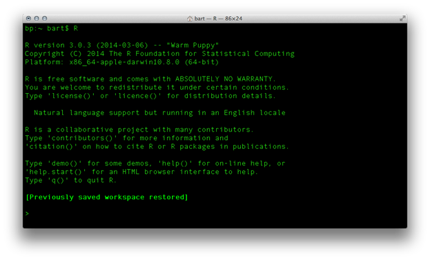
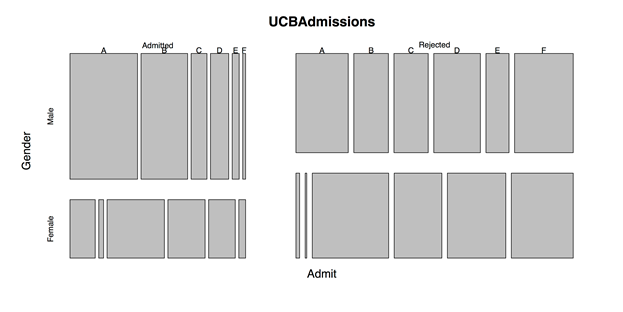
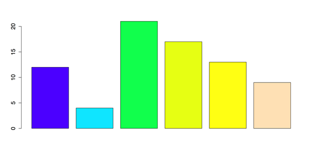
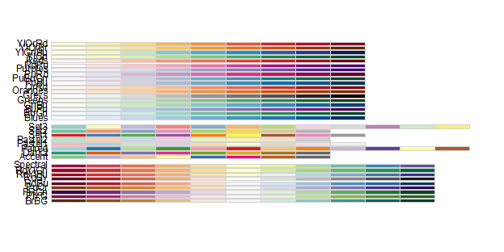
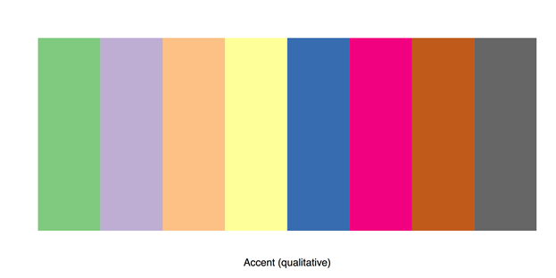

# 第 1 章从 R 开始

r 是一种免费的开源统计编程语言。它的实用性和受欢迎程度显示了同样的爆炸性增长，这也是数据可用性和多样性不断增加的特征。虽然对许多人来说，R 的命令行界面起初可能令人生畏，但这种方法的优势，例如增加了共享和复制分析的能力，很快就变得显而易见。这本书是对那些对 R 的可能性感兴趣的人的介绍。第 1 章将介绍安装 R 和配套产品 RStudio、使用变量和数据集以及发现补充 R 功能的第三方包的功能的步骤。

## 安装 R

r 是一个免费的下载，适用于 Windows、Mac 和 Linux 电脑。安装是一个简单的过程。

1.  打开网络浏览器，进入 [R 项目网站](http://www.r-project.org/)。
2.  在“入门”下，单击“下载”，这将带您进入几十个下载服务器的列表。
3.  单击任何服务器，尽管单击“0-云”下的链接[http://cran.rstudio.com/](http://cran.rstudio.com/)可能效果最好。
4.  单击操作系统的下载链接；最上面的选项往往是最好的。
5.  打开下载的文件并按照说明安装软件。

现在，您的计算机上应该有一个功能性的 R 副本。如果您双击应用程序图标打开它，那么您将在 r 中看到默认的启动窗口。


图 1:R 的默认启动窗口

对于那些习惯于使用命令行的人来说，也可以通过这种方式访问 R。例如，如果我在我的苹果电脑上打开终端，在提示符下键入`R`，我会得到图 2。



图 2:从命令行调用 R

您会注意到，出现在集成开发环境中的样板文本会出现在终端中。

许多人在这两种环境中运行 R:R 的 IDE，或者命令行。不过，还有其他方法可以让使用 R 变得更容易，这也是我们下一步要转向的地方。

## 安装 RStudio

r 是处理数据的好方法，但是界面并不完美。部分问题是所有的东西都在不同的窗口中打开。另一个问题是，R 的默认接口在每个操作系统中的外观和行为并不相同。R 有几个接口可以解决这些问题。虽然有很多选择，但我们将在本书中使用的界面是 RStudio。

和 R 一样，RStudio 也是一个免费的下载，可以在 Windows、Mac 和 Linux 电脑上下载。同样，安装是一个简单的过程，但是请注意，您必须首先安装 r。

1.  打开网络浏览器，进入[https://www.rstudio.com](https://www.rstudio.com)。
2.  单击“立即下载”。
3.  RStudio 可以在桌面或 Linux 服务器上运行。我们将使用桌面版本，因此单击“下载 RStudio 桌面”
4.  RStudio 将检查您的操作系统；单击“为您的系统推荐”下的链接
5.  打开下载的文件，并按照说明安装软件。

如果双击 RStudio 图标，您将看到类似图 3 的内容。


图 3: RStudio 启动窗口

RStudio 将 R 的独立窗口组织成一个面板。它还提供了一些函数的链接，否则很难找到这些函数。RStudio 还有其他一些优势:

*   它允许你把你的工作分成不同的环境或“项目”每个项目都有自己的工作目录、工作空间、历史记录和源文档。
*   它有 GitHub 集成。
*   它保存图形历史。
*   它以多种尺寸和格式导出图形。
*   它可以通过操作包创建交互式图形。
*   它通过 tab 键提供代码完成。
*   它有标准化的键盘快捷键。

RStudio 是一种使用 R 的便捷方式，但也有其他选择。你可能想花一点时间看看一些替代方案，这样你就能找到最适合你和你的项目的方案。

## R 控制台

当您打开 RStudio 时，默认情况下，您将工作最多的两个窗口位于左侧。左侧底部窗口是 R 控制台，有 R 命令提示符:>(“大于”符号)。控制台中可能会发生两件事。首先，您可以通过在提示符下键入来运行命令，尽管您不能在那里保存您的工作。其次，R 给出了命令的输出。

我们可以尝试在控制台中输入一个基本命令，看看它是如何工作的。我们从加法开始。在命令提示符下输入以下文本，然后按回车键:

```
          > 9 + 11       

```

第一行包含您输入的命令；在此  `9 + 11`。请注意，您不需要键入等号或任何其他命令结束符，如分号。还有，虽然加号前后没必要放空格，但是形式不错。[【1】](11.html#_ftn1)输出如下:

```
          [1] 20

```

第二行没有命令提示符，因为它有程序的输出。方括号`[1]`中的“1”需要一些解释。r 用向量做数学，这就是它返回响应的方式。括号中的数字是这一行输出向量中第一项的索引号。(许多其他程序以索引号 0 开始，但 R 从 1 开始。)在索引号之后，R 打印输出，在这种情况下是“20”的总和。

随着新信息的出现，控制台的内容会向上滚动。您也可以通过选择“编辑”>“清除控制台”或在 Mac 或 PC 上按 ctrl-l(小写字母 L)来清除控制台。请注意，这只会清除显示的数据，不会清除内存中的数据或丢失命令历史记录。

## 脚本窗口

控制台是 R 中的默认窗口，但它不是您工作的最佳场所。主要问题是您无法保存您的命令。另一个问题是一次只能输入一个命令。考虑到这些问题，使用 R 的一个更好的方法是使用脚本窗口。在 RStudio 中，这是控制台上方左上角的窗口。(如果您在那里什么也没看到，请转到文件>新建文件> R 脚本或按 Shift+Command+N 创建一个新的脚本文档。)

R 中的脚本是扩展名为“. R”的纯文本文件。当您在 R 中创建新脚本时，您可以保存该脚本，并且可以一次选择并运行一行或多行。我们可以通过创建一个新的脚本，然后再次键入命令，来重新创建我们在控制台中所做的简单添加问题。即使一次只运行一个命令，也可以在脚本中输入多个命令。要了解这是如何工作的，您应该键入以下三行。

```
          9 + 11
          1:50
          print("Hello World")

```

注意脚本窗口没有命令提示`>`。相反，只有编号的文本行。接下来，通过选择文件>保存或按下苹果电脑上的命令+S 和窗口上的 Ctrl+S 来保存该脚本。

如果您想一次运行一个命令，请将光标放在所需命令行的任意位置。然后选择代码>运行行或按命令+返回(在窗口上按 Ctrl+返回)。这将把选定的命令发送到控制台并显示结果。对于第一个命令`9 + 11`，这将产生与我们之前在控制台输入命令时相同的结果。

接下来的两行代码说明了一些其他的基本功能。命令`1:50`创建一个从 1 到 50 的数字列表。您还可以看到，行首方括号中的数字是该行第一项的索引号。

```
          [1]  1  2  3  4  5  6  7  8  9 10 11 12 13 14 15 16 17 18 19 20 21 22 23
          [24] 24 25 26 27 28 29 30 31 32 33 34 35 36 37 38 39 40 41 42 43 44 45 46
          [47] 47 48 49 50

```

如果你运行第三行文本`print("Hello World!")`，你会得到这个输出。

```
          [1] "Hello World!"

```

输出`"Hello World!"`是长度为 1 的字符向量。这与 C 或其他语言中的字符串相同。

## 评论

在代码中添加注释是一种很好的形式。注释可以帮助您记住代码的每一部分是做什么的。注释还有助于使您的代码可复制，因为其他人可以遵循您的逻辑。这在协作项目以及您以后可能会重新访问的项目中至关重要。

要在 R 中进行注释，请键入#后跟您的文本。您还可以“注释掉”一行代码，以便在尝试替换行时禁用它。要进行多行注释，您需要对每一行进行注释，因为 R 没有内置的多行函数。RStudio 使注释行变得容易。只需选择文本并转到代码>注释/取消注释行或按 Shift+Command+C(Windows 上的 Shift+Ctrl+C)。

```
          # These lines demonstrate commenting in R.
          # First, add an inline comment on a line of code to explain it.
          print("Hello World!")  # Prints "Hello World" in the console.
          # Second, comment out a variation on a line of code.
          # print("Hello R!")  # This line will not run while commented out.

```

## 数据结构

识别数据的四种基本结构:

1.  **向量**。向量是一维数组。所有数据必须采用相同的格式，如数字、字符等。这是 r 中的基础数据对象。
2.  **矩阵和数组**。矩阵类似于向量，因为所有的数据必须具有相同的格式。然而，矩阵有两个维度；数据按行和列排列(列的长度必须相同)，但列没有命名。数组类似于矩阵，只是它可以有两个以上的维度。
3.  **数据帧**。数据帧是长度相同的向量的集合。数据框和矩阵的区别在于，数据框可以有不同数据类型的向量，例如数字向量和字符向量。向量也可以有名字。数据框类似于 SPSS 中的数据表或 Excel 中的工作表(不同的是，数据框中的向量长度必须相同)。
4.  **列出**。列表是 r 中最通用的数据结构。列表是任何类、长度或结构(包括其他列表)的元素的有序集合。然而，许多统计函数不能应用于列表。

r 还有几个内置函数，用于将数据从一个结构转换或强制转换到另一个结构:

*   `as.vector()`可以将矩阵强制为一维向量，尽管可能需要先将它们强制为矩阵
*   `as.matrix()`可以强制数据结构成为矩阵结构
*   `as.data.frame()`可以强制数据结构成为数据帧
*   `as.list()`可以将数据结构强制到列表中

## 变量

变量很容易在 r 中创建，只需键入变量的名称，无需赋值变量类型。接下来，使用赋值运算符`<-`。你可以把这个理解为“得到”，这样`x <- 2`就意味着“x 得到 2。”赋值可以用等号，但 r 中的形式不好，在下面两行中，我创建了一个变量 x，赋值 1 到 5，然后通过键入 x 的名称来显示 x 的内容。

```
          x <- 1:5  # Put the numbers 1-5 in the variable x
          x  # Displays the values in x

```

如果要指定指定给变量的每个值，可以使用函数`c`。这代表“concatenate”，尽管您也可以将其视为“combine”或“collection”。此函数将创建一个包含您为其分配的项目的单个向量。需要说明的是，RStudio 为分配运算符`<-`提供了一个方便的快捷方式。键入代码时，使用快捷方式 Alt+连字符，RStudio 将插入前导空格、分配运算符和尾随空格。然后，您可以继续进行编码。

这里我给向量`y`赋值 7、12、5、4 和 9。

```
          y <- c(7, 12, 5, 4, 9)

```

赋值运算符也可以从左向右，或者它可以同时包含几个变量。

```
          15 -> a  # Can go left to right, but is confusing.
          a <- b <- c <- 30  # Assign the same value to multiple variables.

```

要从 R 的工作空间中移除变量，请使用`rm`功能。

```
          rm(x)  # Remove the object x from the workspace.
          rm(a, b)  # Remove more than one object.
          rm(list = ls())  # Clear the entire workspace.

```

## 包装

R 的默认安装在功能上令人印象深刻，但它不能做所有的事情。R 的一大优势是可以添加包。包是扩展 R 能力的代码包。在其他语言中，这些包是库，但是在 R 语言中，库是存储所有包的地方。R 的包可以来自两个不同的地方。

有些包附带 R，但默认情况下不活动。您可以在 RStudio 的“包”选项卡中看到这些内容。其他软件包可在存储库在线获得。可用套餐列表可在查看[。该网页是综合档案网络的一部分。它包含包的主题或“任务视图”列表。如果你点击一个主题，它会把你带到一个带有单个包链接的注释列表。您也可以通过名称](http://cran.r-project.org/web/views)[在此](http://cran.r-project.org/web/packages/available_packages_by_name.html)搜索包裹。另一个好的选择是网站[起重机](http://crantastic.org/)。这些网站上的所有软件包都是免费的，开源的。

要查看当前安装或加载了哪些软件包，请使用以下功能:

```
          library()  # Brings up editor list of installed packages.
          search()   # Shows packages that are currently loaded.

```

`library()`将调出功能的文本列表。在 RStudio 的“包”选项卡下，同样的信息以超链接的形式提供。`search()`将在控制台中显示活动包的名称。这些包与 RStudio 的“包”选项卡中有检查的包相同。

要安装新的软件包，您在 RStudio 中有几个选项。首先，您可以使用工具>安装包下的菜单。其次，您可以单击“软件包”选项卡顶部的“安装软件包”。第三，可以使用`install.packages()`功能。只需将所需包的名称放在引号中(请记住，像大多数编程语言一样，R 是区分大小写的)。如果您想将命令保存为脚本的一部分，最后一个选项是最好的。

```
          install.packages("ggplot2")  # Download and install the ggplot2 package.

```

前面的命令安装了包。要使用该包，您还必须加载它或使它在 r 中处于活动状态。有两种方法可以做到这一点。第一个是`library()`，常用于脚本中加载包。第二个是`require()`，常用于函数中的加载包。[【2】](11.html#_ftn2)以我的经验来看，`require()`在两种设定下都可以工作，避免混淆“库”的意思，所以我更喜欢用它。

```
          library("ggplot2")  # Makes package available; often used in scripts.
          require("ggplot2")  # Also makes package available; often used in functions.  

```

要了解有关包的更多信息，您可以使用 R 的内置帮助功能。许多软件包也有小插图，这是软件包功能的例子。您可以使用以下代码访问这些:

```
          vignette(package = "grid")  # Brings up list of vignettes in editor window
          ?vignette  # For help on vignettes in general
          browseVignettes(package = "grid")  # Open webpage with hyperlinks
          vignette()  # List of all vignettes for currently installed packages
          browseVignettes()  # HTML for all vignettes for currently installed packages  

```

您还应该定期检查软件包更新。有三种方法可以做到这一点。首先，您可以使用 RStudio 中的菜单:工具>检查软件包更新。其次，您可以转到 RStudio 中的“包”选项卡，然后单击“检查更新”第三，可以运行这个命令:`update.packages()`。

当您在 R 中完成工作时，您可能想要卸载或删除您不会很快再次使用的包。默认情况下，R 退出时会卸载所有包。如果你想在那之前卸载它们，你有两个选择。首先，您可以转到 RStudio 中的“包”选项卡，逐个取消选中包。第二，可以使用`detach()`命令，比如:`detach("package:ggplot2", unload = TRUE)`。[【3】](11.html#_ftn3)

如果你想删除一个包，使用`remove.packages()`，像这样:`remove.packages("psytabs")`。这破坏了包装。如果您想再次使用已删除的软件包，您需要下载并重新安装它。

## R 的数据集包

内置的“数据集”包使得使用真实数据实验 R 的过程变得容易。虽然这个包是 R 的基本安装的一部分，但是您必须加载它。您可以在“包装”标签中选择它，或者输入`library("datasets")`或`require("datasets")`。您可以通过键入`data()`或转到 [R 数据集包](http://stat.ethz.ch/R-manual/R-devel/library/datasets/html/00Index.html)列表来查看可用数据集的列表。

有关特定数据集的更多信息，您可以通过键入`?`和不带空格的数据集名称来搜索 R 帮助:`?airmiles`。您也可以通过输入数据集的名称来查看数据集的内容:`airmiles`。要查看数据集的结构，使用`str()`，如:`str(airmiles)`。这将向您展示它是什么样的数据集，它有多少观测值和变量，以及前几个值。

如果已经准备好处理数据集，可以加载`data()`，比如:`data(airmiles)`。然后，它将出现在 RStudio 右上角的“环境”选项卡中。

r 的内置数据集是一个极好的资源。您可以使用它们来尝试不同的函数和过程，而不必查找或输入数据。我们将在本书的每一章中使用这些数据集。我建议你花一点时间浏览它们，看看你可能感兴趣的是什么。

## 手动输入数据

r 是灵活的，因为它允许您以多种不同的方式将数据输入程序。

最简单的——但并不总是最快的——是将数据直接输入到 r 中。如果您只有少数几个值，那么这个方法可能有意义。

如果要创建模式化数据，有两种常见的选择。首先，冒号运算符`:`创建一组连续的整数值。例如:

```
          0:10       

```

给出这个升序列表:

```
          [1]  0  1  2  3  4  5  6  7  8  9 10      

```

或者，将较大的数字放在第一位，如下所示:

```
          55:48      

```

然后 R 将创建一个降序列表:

```
          [1] 55 54 53 52 51 50 49 48   

```

模式化数据的另一种选择是序列函数`seq()`，它更加灵活。

您可以选择步长:

```
          seq(30, 0, by = -3)     

```

该尺寸产生以下结果:

```
          [1] 30 27 24 21 18 15 12  9  6  3  0      

```

或者您可以选择列表长度:

```
          seq(0, 5, length.out = 11)    

```

这给了你:

```
          [1] 0.0 0.5 1.0 1.5 2.0 2.5 3.0 3.5 4.0 4.5 5.0 

```

您也可以将这些函数中的任何一个输入到新的变量中。只需声明变量名，并将赋值运算符放在函数前面，如下所示:

```
          x <- seq(50, 150, by = 5)     

```

相反，如果您有未排序的真实数据，您可以通过两种方式将它们输入 R。首先，您可以使用前面提到的连接功能`c()`。例如:

```
          x <- c(5, 4, 1, 6, 7, 2, 2, 3, 2, 8)

```

其次，可以使用`scan()`功能在控制台输入数字。调用此功能后，转到控制台，一次键入一个号码。在每个数字后按 return 键。完成后，按两次 return 键将数据发送到变量。

根据我的经验，只有当你有顺序数据或玩具数据时，把数据输入 R 才有意义。对于任何实际大小的数据集，几乎总是更容易将数据导入到 R 中，这就是我们接下来要讨论的。

## 导入数据

大量数据存在于电子表格中。r 使得导入这样的数据变得很容易，带有一些重要的限定条件。许多人在统计程序中也有数据，如 SPSS 或 SAS。r 也能够读取这些数据，但同样有一个重要的限定条件。

### 避免使用 Excel 或 SPSS 中的原生文件

不要尝试导入本机 Excel 电子表格或 SPSS 文件。虽然有一些包是为这两者而设计的，但它们通常很难使用，并且会带来问题。R 网站[【4】](11.html#_ftn4)这样说导入 Excel 电子表格(重点增加):

最常见的 R 数据导入/导出问题似乎是“如何阅读 Excel 电子表格”……第一条建议是**尽可能避免这样做！**如果有权限访问 Excel，从 Excel 中以制表符分隔或逗号分隔的形式导出想要的数据，使用`read.delim`或`read.csv`导入到 R……【An】Excel 中。xls 文件不仅仅是一个电子表格:这样的文件可以包含许多工作表，并且工作表可以包含公式、宏等等。并非所有读者都能阅读第一页以外的内容，可能会被文件的其他内容所混淆。

许多同样的问题也适用于 SPSS 文件。好消息是，这些问题有一个简单的解决方案。

### 导入 CSV 文件

将数据导入 R 的最简单方法是使用 CSV 文件或逗号分隔值电子表格。任何电子表格程序，包括 Excel，都可以以 CSV 格式保存文件。像 SPSS 这样的统计程序也可以做到这一点。[【5】](11.html#_ftn5)然后，使用`read.csv`功能读取 CSV 文件。您需要指定文件的位置以及它是否有变量名的标题行。例如，在我的 Mac 上，我可以通过以下方式从桌面导入一个名为“rawdata.csv”的文件:

```
          csvdata <- read.csv("~/Desktop/rawdata.csv", header = TRUE)

```

类似的过程可以读取制表符分隔的 TXT 文件中的数据。区别是这样的:第一，用`read.table`代替`read.csv`。其次，您可能需要在命令中明确指定分隔符，例如逗号或制表符。第三，如果缺少数据值，请确保为单元格指定明确的分隔符。如果您的分隔符是制表符，则使用命令`sep = \t`，如本例所示:

```
          txtdata <- read.table("~/Desktop/rawdata.txt", header = TRUE, sep = "\t")

```

r 及其可用的包提供了多种方法将数据输入程序。但是，我发现将数据放入 CSV 文件并导入它几乎总是最容易的。但是不管你如何将数据输入 R，现在你已经准备好开始探索你的数据了。

## 将表格数据转换为行数据

马上要问的一个重要问题是，您的数据格式是否适合您的分析。这对于分类数据来说是最重要的，因为可以将数据折叠成频率计数。一个很好的例子是内置的 R 数据集`UCBAdmissions`。这个数据集描述了 1973 年加州大学伯克利分校研究生招生的结果。这些数据很重要，因为它们构成了一起重大歧视诉讼的基础。它们也是统计学中辛普森悖论[【6】](11.html#_ftn6)的完美例子。在我们看代码之前，我应该解释两件事。

首先，表格数据是可以组织成具有频率行和频率列的表格的数据。例如，您可以创建一个表格，显示几种互联网浏览器的流行程度。该表只有一个维度或因素:安装了哪个浏览器。然后，您可以添加第二个维度，按照操作系统分解数据。浏览器列在列中，操作系统列在行中。这将是一个双向表，或交叉列表。表格每个单元格中的数字会给出符合该类别组合的案例数量，例如运行 IE 的 Windows 电脑数量或运行 Chrome 的安卓平板电脑数量。当然，可以添加更多的变量，这些变量通常显示为单独的面板或表格，每个面板或表格都有相同的行和列。这也是我们将在本例中使用的 UCBAdmissions 数据的情况。数据按行和列(或面板)排列，得到“边际”总数，通常称为“边际”这些余量是一个或多个变量与其他变量的总和。例如，在我们假设的浏览器和操作系统表中，浏览器的边际是每个浏览器的安装总数，忽略操作系统。类似地，操作系统的边距会给出每个操作系统的安装总数，忽略浏览器。边距很重要，因为它们通常比最大维度的数据更有意义(即，所有维度或因素都分解到最详细的层次)。

其次，我将在这个例子中使用两个绘图命令——bar plot()和 plot()——以及我还没有展示的下一个关于颜色的命令。现在，我正在用它们来演示其他原理，但我将在下一章的图形中充分解释它们。

本节的代码在一个单独的 R 文件 sample_1_1 中提供。r，但为了可读性，我将把它分成几部分。

**样本:样本 _1_1。R**

```
          # LOAD DATA
          require(“datasets”)  # Load datasets package
          ?UCBAdmissions  # Data from graduate admissions at UC Berkeley in 1973.
          str(UCBAdmissions)  # Tabular data in 3 dimensions; N = 4526.
          UCBAdmissions  # Prints six tables; one for each department.

          # TRY DEFAULT PLOTS
          admit.fail <- (UCBAdmissions$Admit)  # Doesn't work.
          barplot(UCBAdmissions$Admit)  # Doesn't work.
          plot(UCBAdmissions)  # Makes a plot, but not the one we wanted.

```

这段代码产生了图 4，这是一个不寻常的三向条形图。我们想要一个简单的条形图，显示申请这六个部门的人数，所以这是行不通的。



图 4:任务的默认图

下一步是从三向表中获取边际频率。此时，频率只是显示在控制台中。

```
          # SHOW MARGINAL FREQUENCIES
          margin.table(UCBAdmissions, 1)  # Admit
          margin.table(UCBAdmissions, 2)  # Gender
          margin.table(UCBAdmissions, 3)  # Dept
          margin.table(UCBAdmissions)     # Total

```

接下来我们保存部门的边际频率，因为这有图表所需的数据。

```
          # SAVE MARGINALS
          admit.dept <- margin.table(UCBAdmissions, 3)  # Creates table for dept
          str(admit.dept)  # Describe the structure of the data table
          barplot(admit.dept)  # Makes a default barplot of the frequencies
          admit.dept  # Show frequencies
          prop.table(admit.dept)  # Show as proportions
          round(prop.table(admit.dept), 2)  # Show as proportions w/2 digits
          round(prop.table(admit.dept), 2) * 100  # Percentages w/o decimals

```

然而，进一步的分析需要将数据结构化为每人一行。我们可以通过将表转换为数据框，将列表转换为数据框来实现这一点。

```
          # RESTRUCTURE DATA
          admit1 <- as.data.frame.table(UCBAdmissions)  # Coerces to data frame
          # This repeats each row by Freq
          admit2 <- lapply(admit1, function(x)rep(x, admit1$Freq)) 
          admit3 <- as.data.frame(admit2)  # Converts from list back to data frame.
          admit4 <- admit3[, -4]  # Removes fifth column that has frequencies.
          # admit4 is the final data set, ready for analysis by case.

```

通过替换，也可以在一个长命令中完成整个转换:

```
          # COMBINE ALL STEPS
          admit.rows <- as.data.frame(lapply(as.data.frame.table(UCBAdmissions), function(x)rep(x, as.data.frame.table(UCBAdmissions)$Freq)))[, -4]

```

上面的命令展示了一种将数据组织成对分析最有用的结构的方法。在其他情况下，不同的方法会更有帮助，但这给了你一个有用的想法，你可以在 r。

## 颜色

当你在 R 中制作图形时，你应该考虑你的设计决策。布局和颜色之类的因素可以决定可视化效果的好坏。考虑用 R 的默认颜色制作的条形图。

**样本:样本 _1_2。R**

```
          # LOAD DATA
          x = c(12, 4, 21, 17, 13, 9)  # Data for bar chart

```

以下命令使用默认颜色。

```
          # BARPLOT WITH DEFAULT COLORS
          barplot(x)  # Default barplot

```


图 5:默认颜色的条形图

我们可以通过使用`barplot`函数中的`col`属性来改变条形的颜色来改进图 5。r 给了我们几种指定颜色的方法。

r 有 657 种颜色的名称，按字母顺序排列(除了白色，白色在列表中排第一)。通过输入`colors()`，可以看到所有颜色名称的文本列表。你也可以在这里看到一个带有彩色图表的 PDF。如果我想将小节更改为 slategray3，我可以通过几种方式实现:

*   颜色名称:slategray3。
*   列表中的颜色位置:slategray3 是颜色向量中的索引号 602。
*   RGB 十六进制代码:根据这个[斯托斯研究所图表](http://research.stowers-institute.org/efg/R/Color/Chart/ColorChart.pdf)，slategray3 是#9FB6CD
*   0-255 比例的 RGB 颜色:使用`col2rgb("slategray3")`获得 159、182 和 205 或查看上一个 PDF 上的值。您必须指定 255 作为最大值。
*   0-1 比例的 RGB 颜色:将之前的值除以 255，得到. 62、. 71 和. 80。

然后，您可以在`col`属性中使用这些值:

```
          # METHODS TO SPECIFY COLORS
          barplot(x, col = "slategray3")  # Color by name.
          barplot(x, col = colors() [602])  # slategray3 is 602 in the list.
          barplot(x, col = "#9FB6CD ")  # RGB hex code.
          barplot(x, col = rgb(159, 182, 205, max = 255))  # RGB 0-255
          barplot(x, col = rgb(.62, .71, .80))  # RGB 0.00-1.00

```

前面的任何命令都会产生图 6 中的图表。


图 6:彩色条形图

如果你想让条形变成不同的颜色，那么你可以一次指定一种颜色，也可以使用调色板。要指定单个颜色，只需使用`col`属性中的连接功能`c()`，如:`col = c("red", "blue")`。您可以使用部分中的任何颜色指定方法。然后，颜色将在每个小节中循环。

调色板可以提供更广泛的颜色，以及在一起看起来更好的颜色。您可以通过指定调色板的名称和所需的颜色数量来使用 R 的内置调色板。一些 R 的调色板是:

*   彩虹:明亮的原色
*   颜色:黄色到红色
*   地形。颜色:灰色到绿色
*   颜色:紫色到棕色
*   颜色:蓝色和粉色

运行`?palette`命令，了解更多关于 R 内置调色板的信息。

要将 topo.colors 调色板用于六个小节，您需要输入以下内容:

```
          # BARPLOT WITH BUILT-IN PALETTE
          barplot(x, col = topo.colors(6))

```

前面代码的输出如图 7 所示。



图 7:带有调色板“地形颜色”的条形图

R 调色板的一个有吸引力的替代方案是软件包 RColorBrewer。这个包源自优秀网站 [ColorBrewer 2.0](http://colorbrewer2.org/) 。 [[7]](11.html#_ftn7) RColorBrewer 提供了几种顺序、发散和定性颜色的调色板。要使用 RColorBrewer，您必须首先安装它并将其加载到 R:

```
          # INSTALL AND LOAD RCOLORBREWER PACKAGE
          install.packages("RColorBrewer")
          require("RColorBrewer")

```

我鼓励您通过输入`help(package = "RColorBrewer")`来探索 RColorBrewer 的帮助信息。进入`display.brewer.all()`可以看到所有可用的调色板。这就产生了图 8。(重叠的标签是由于景观纵横比造成的。)



图 8:所有 rcolorbrewer 选项板

通过指定调色板和所需的颜色数量，可以更好地查看单个调色板，如下所示:`display.brewer.pal(8, "Accent")`。图 9 展示了这个调色板。



图 RColorBrewer 调色盘“强调”的预览

要将 RColorBrewer 调色盘应用于条形图，请调用`col`属性中的`brewer.pal`。同时指定所需的调色盘和颜色数量。

```
          # BARPLOT WITH RCOLORBREWER PALETTE
          barplot(x, col = brewer.pal(6, "Blues"))

```

该命令产生图 10。


图 10:带有 RColorBrewer 调色板的条形图

完成后，最好恢复默认调色板并清理:

```
          # CLEAN UP
          palette("default")  # Return to default palette.
          detach("package:RColorBrewer", unload = TRUE)  # Unloads RColorBrewer
          rm(list = ls())  # Removes all objects from workspace.

```