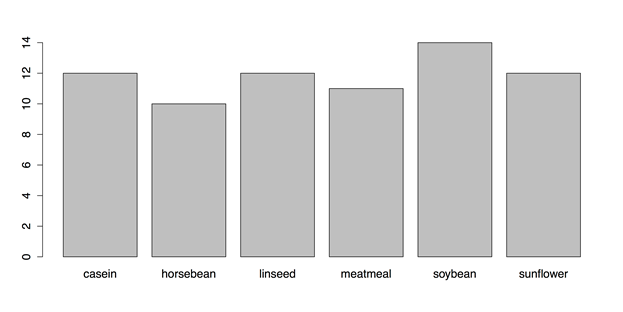
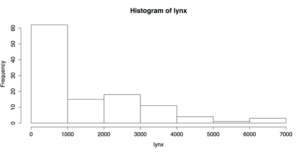

# 第二章单变量图表

在前言中，我提到在统计程序之前，当图形首先出现时，分析是最有用的。此外，需要很好地理解构成所有后续工作基础的单个变量，并在适当的情况下根据分析需要进行调整。考虑到这两点，第二章从一个变量的图表开始。

## 分类变量的条形图

一旦你的数据在 R 中，你在任何分析中的第一个任务就是检查单个变量。这项任务有三个目的:

*   检查数据是否正确。
*   检查数据是否符合您将使用的程序的假设。
*   检查数据中有趣的观察或模式。

最容易从分类变量开始，比如被调查者的性别或公司的部门。条形图适用于此类数据，因此这是我们首先要讨论的地方。

对于这个例子，我们将使用 R 的`datasets`包中的`chickwts`。这个数据集记录了小鸡的体重和它们的饲料。要查看该数据集的更多信息，请输入`?chickwts`。要查看控制台中的整个数据集—它有 71 个案例—请输入`chickwts`。为了制作该图，我们需要运行以下两个命令:

**样本:样本 _2_1。R**

```
          # LOAD DATA
          require(“datasets”)  # Loads data sets package

```

然后运行默认的`plot()`命令。

```
          # DEFAULT CHART WITH PLOT()
          plot(chickwts$feed)  # Default method to plot the variable feed from chickwts

```

默认的`plot()`功能是自适应的。它会根据你给它的变量产生不同的图表。如果你给它一个分类变量，就像我们在这里做的那样，它会产生图 11 中的条形图。参数`chickwts$feed`是一种告诉 R 使用数据集“chickwts”，然后使用来自该数据集的变量“feed”的方法。



图 11:来自`plot()`功能的默认条形图

图 11 中的图表是功能性的，但在几个方面有所欠缺。我们应该添加标题，重新排列横条，改变页边距等等。然而，默认的`plot()`功能并没有提供太多的控制。相反，我们需要使用`barplot()`功能。但是首先，我们需要计算图表的频率。我们可以为此使用`table()`功能:

```
          # CREATE TABLE
          feeds <- table(chickwts$feed)  # Create a table of feed, place in “feeds”
          feeds  # See contents of object “feeds”
          barplot(feeds)  # Identical to plot(chickwts$feed) but with new object

```

现在我们可以使用`barplot()`创建一个新的图表。我们也会用`par()`功能调整一些参数。(输入`?par`了解更多信息。)R 为您提供了两种从脚本窗口运行多行命令的选择。您可以一次运行一行，方法是对每一行按下 Command+Return(Ctrl+Windows 上的 Return)。在这种情况下，在运行命令的最后一行之前，什么都不会发生。您也可以突出显示该块，并使用相同的键盘命令立即运行它。

```
          # USE BARPLOT() AND PAR() FOR PARAMETERS
          par(oma = c(1, 4, 1, 1))  # Sets outside margins: bottom, left, top, right.
          par(mar = c(4, 5, 2, 1))  # Sets plot margins.
          barplot(feeds[order(feeds)],  # Orders the bars by descending values.
                  horiz  = TRUE,  # Makes the bars horizontal.
                  las    = 1,  # las gives orientation of axis labels.
                  col    = c("beige", "blanchedalmond", "bisque1", "bisque2",
                             "bisque3", "bisque4"),  # Vector of colors for bars.
                  border = NA,  # No borders on bars.
                  # Add main title and label for x-axis.
                  main   = "Frequencies of Different Feeds in chickwts Data set",
                  xlab   = "Number of Chicks")  

```

这一系列命令将产生图 12 中修改后的条形图。


图 12:使用`barplot()`修改的条形图

最后，保存您的工作，重置图形参数，并清除工作区中不需要的变量、对象和包:

```
          # CLEAN UP
          par(oldpar)  # Restores previous parameters (ignore errors).
          detach("package:datasets", unload = TRUE)  # Unloads data sets package.
          rm(list = ls())  # Removes all objects from workspace.

```

## 在 R 和 RStudio 中保存图表

有两种方法可以保存图表，以便导出它们。第一种方法是 R 的默认方法，它既麻烦又混乱，但是您可以将它包含在代码中。第二种方法使用 RStudio，简单得多，但使用菜单。(我对这本书里的所有图像都用了第二种方法。)

要使用 R 的方法保存图像，您必须打开一个设备或“图形设备”下面的代码显示了如何使用设备保存光栅图形的 PNG 文件或矢量图形的 PDF 文件。(命令必须使用其中一个；你不能同时运行两者。还有其他几种可用的格式。)有关这些功能的更多信息，请参见`?png`、`?pdf`和`?dev`。

**样品:样品 _2_2。R**

```
          # CHOOSE GRAPHICS DEVICE
          # TO SAVE AS PNG
          # EITHER this device for a PNG file (raster graphics)
          png(filename = "~/Desktop/bar_a.png",  # Give the full path and name.
              width = 900,  # Width of image in pixels.
              height = 600)  # Height of image in pixels.

          # TO SAVE AS PDF
          # OR this device for a PDF file (scalable vector graphics)
          pdf("bar_b.pdf",  # Save to default directory or errors ensue.
              width = 9,  # Width in inches (NOT pixels).
              height = 6)  #Height in inches.

```

选择图形设备并设置参数后，即可创建图形。

```
          # CREATE GRAPHIC
          # Then run the command(s) for the graphic.
          oldpar <- par()  # Stores current graphical parameters.
          par(oma = c(1, 1, 1, 1))  # Sets outside margins: bottom, left, top, right.
          par(mar = c(4, 5, 2, 1))  # Sets plot margins.
          barplot(feeds[order(feeds)],  # Order the bars by descending values.
                  horiz  = TRUE,  # Make the bars horizontal.
                  las    = 1,  # las gives orientation of axis labels.
                  col    = c("beige", "blanchedalmond", "bisque1", "bisque2",
                             "bisque3", "bisque4"),  # Vector of colors for bars
                  border = NA,  # No borders on bars.
                  # Add main title and label for x-axis.
                  main   = "Frequencies of Different Feeds\nin chickwts Data set",
                  xlab   = "Number of Chicks")  

```

一旦保存了工作，就应该清除工作区中不需要的变量和对象。使用`dev.off().`关闭图形设备至关重要

```
          # CLEAN UP
          dev.off()  # Turns off graphics device.
          par(oldpar)  # Restores previous graphics parameters (ignore errors).
          rm(list = ls())  # Removes all objects from workspace.

```

然后保存该图形，而不在 RStudio 中显示。注意，用`par(oldpar)`恢复之前的图形参数时，会收到几条错误信息。发生这些错误是因为存储的一些参数是只读的。这些参数未被修改，因此您可以安全地忽略这些错误消息。

我发现这种使用图形设备的方法是不可靠的。例如，对于巴布亚新几内亚设备，您必须指定完整的文件路径，并将图像保存在您想要的位置。但是使用 PDF 设备，如果指定路径，文件将无法打开。相反，您需要将 PDF 保存到默认目录，然后移动它。此外，这些设备并不总是按预期关闭。出现这种情况时，RStudio 不会在“绘图”选项卡中显示新图形。您可能需要重新启动 RStudio 才能完全退出设备。这是不必要的沮丧。

考虑到这一点，我更喜欢使用第二种保存图形的方法，它使用 RStudio 的菜单。您所需要做的就是正常创建图形，RStudio 将在“绘图”选项卡中显示它。然后点按窗口顶部的“导出”按钮。RStudio 会先问你是要把图存成图像，还是 PDF，还是存到剪贴板。那么在打开的窗口中设置参数就很简单了。这样，您可以选择文件类型、图像大小和位置等属性。

## 饼图

显示分类变量的一种常见方式是使用饼图。这些很容易在 R:

**样品:样品 _2_3。R**

```
          # LOAD DATA SET & CREATE TABLE
          require(“datasets”)  # Loads data sets package.
          feeds <- table(chickwts$feed)  # Create a table of feed, place in “feeds”
          feeds  # See contents of object “feeds”.

          # PIE CHART WITH DEFAULTS
           pie(feeds)

```

图 13 显示了结果图表。


图 13:默认饼图

与条形图一样，以几种方式修改饼图可能会有所帮助:

```
          # PIE CHART WITH OPTIONS
          pie(feeds[order(feeds, decreasing = TRUE)],  # Order slices by values.
              init.angle = 90,  # Start as 12 o'clock instead of 3 o’clock.
              clockwise = TRUE,  # Go clockwise (default is FALSE).
              col = c("seashell", "cadetblue2", "lightpink",
                      "lightcyan", "plum1", "papayawhip"),  # Change colors)
              main = "Pie Chart of Feeds from chickwts")  # Add title.

```

这产生了图 14 中改进的饼图:


图 14:修改后的饼图

用 R 做饼状图很容易，但是读起来很难。例如，饼图上的 R 帮助(见`?pie`)是这样说的:

饼图是一种非常糟糕的信息显示方式。眼睛擅长判断线性度量，不擅长判断相对区域。条形图或点状图是显示这类数据的较好方式。

克利夫兰(1985)，第 264 页:“可以用饼图显示的数据总是可以用点图显示的。这意味着可以沿着一个共同的尺度进行位置判断，而不是不太精确的角度判断。”这种说法是基于克利夫兰和麦克吉尔的实证调查以及知觉心理学家的调查。

饼图可能很难准确阅读，这违背了图表的目的。很难读出圆形扇形的角度和面积。然而，比较直杆的高度或长度是一项非常简单的任务。因此，尽可能避免使用饼图，而是选择更容易阅读和理解的图形是一个好主意。

保存工作后，您应该清除工作区中不需要的变量和对象:

```
          # CLEAN UP
          detach("package:datasets", unload = TRUE)  # Unloads data sets package
          rm(list = ls())  # Removes all objects from workspace

```

## 直方图

当你有一个定量变量——也就是一个区间或比率水平变量——直方图是有用的。区间和比率水平变量在分数之间都有可测量的距离，而较低的测量水平——名义的和顺序的——没有。例如，华氏温度是一种区间测量水平，因为可以说今天的高温比昨天高 2.7 度。另一方面，如果我们用一个序数级别的度量，只是说今天比昨天热，给它一个相对的位置，而不是绝对的位置，那么我们不知道这两天有多大的区别。为了制作直方图，我们需要知道我们测量的距离有多远。区间级变量，比如华氏温度，或者比率级变量，比如米的距离，都可以做到这一点。[【8】](11.html#_ftn8)在本例中，我们将使用内置数据集“lynx”(更多信息请参见`?lynx`)。首先我们需要加载`data sets`包，然后加载`lynx`数据集。

**样品:样品 _2_4。R**

```
          # LOAD DATA SET
          require(“datasets”)
          data(lynx)  # Annual Canadian Lynx trappings 1821-1934

```

`lynx`是只有一个变量的时间序列数据集，所以我们可以只调用`hist()`函数中的数据集。

```
          # HISTOGRAM WITH DEFAULTS
           hist(lynx)

```

这产生了图 15:



图 15:默认直方图

图 15 是一个不错的图表，只使用了默认设置。图表有标题，坐标轴有标签，横条的数量和宽度合理，即使是普通的黑白也干净易读。不过，r 的`hist()`功能有很多选择。以下是其中的一些:

```
          # HISTOGRAM WITH OPTIONS
          hist(lynx,
               breaks = 14,  # "Suggests" 14 bins.
               freq = FALSE,  # Axis shows density, not frequency.
               col = "thistle1",  # Color for the histogram.
               main = "Histogram of Annual Canadian Lynx Trappings\n1821-1934",
               xlab = "Number of Lynx Trapped")  # Label X axis

```

这段代码产生了图 16:


图 16:修改的直方图

除了颜色和标题的明显变化之外，还有两个修改需要进一步解释。`breaks`属性设置要使用的箱数，但它比其他属性更像是一个建议。这意味着 R 将查看建议，但使用自己的算法来计算仓位宽度。在这种情况下，我使用了 14 个箱的参数，这就是 R 所做的，但是如果我在这里输入 11，我仍然会得到 14 个箱。r 在这方面的自主性可能是一个优势，但是如果你想要更多的控制，你可以手动设置断点。您可以使用规则的序列以统一的距离设置断点，如下所示:`breaks = seq(0, 7000, by = 100)`。也可以手动设置每个断点，如:`breaks = c(0, 100, 300, 500, 3000, 3500, 7000)`。然而，很难想象你会想这么做。

我想提的另一个属性是`freq = FALSE`。默认情况下，R 用仓位频率标记 Y 轴。`freq = FALSE`将轴标签更改为密度或比例。这不会改变分布的形状，但它允许一个重要的添加。当直方图是密度图时，可以叠加其他分布。这样就更容易判断正态性和识别重要的偏差。

在下面的代码中，我将向直方图添加四个图:

*   正态分布。
*   使用默认带宽的内核密度估计。
*   使用调整带宽的核密度估计。
*   出现在分布图下方的地毯或线条图。

```
          # SUPERIMPOSED NORMAL DISTRIBUTION
          curve(dnorm(x, mean = mean(lynx), sd = sd(lynx)),  # Shape, mean, SD
                col = "thistle4",  # Color of the curve.
                lewd = 2,  # Line width of 2 pixels.
                add = TRUE)  # Superimpose on the previous graph.

          # SUPERIMPOSED KERNEL DENSITY ESTIMATES
          lines(density(lynx), col = "blue", lwd = 2)
          lines(density(lynx, adjust = 3), col = "darkgreen", lwd = 2)

          # SUPERIMPOSED RUG PLOT
          rug(lynx, lwd = 2)

```

在这种情况下，`curve()`函数需要一个`dnorm`分布，或者正态密度分布。(还有很多其他选择；详见`?curve`。)第一行还使用了两个函数作为参数:`mean = mean(lynx)`和`sd = sd(lynx)`。这些函数将曲线的平均值和标准偏差与直方图相匹配。这个快捷方式节省了精力和舍入误差。核密度估计对经验数据起作用，因此不需要调整带宽以外的参数。(参见**？内核**了解更多。)地毯反映了分布情况。结果如图 17 所示:


图 17:叠加法线曲线的直方图

保存工作后，清除工作区中不需要的变量和对象:

```
          # CLEAN UP
          detach("package:datasets", unload = TRUE)  # Unloads data sets package.
          rm(list = ls())  # Remove all objects from workspace.

```

## 拳击图式

我们将讨论的最后一个单变量图表是箱线图。箱线图非常适合识别定量变量中的异常值。默认的箱线图很容易创建:

**样本:样本 _2_5。R**

```
          # LOAD DATA SET
          require(“datasets”)  # Load datasets package.
          data(lynx)  # Annual Canadian Lynx trappings 1821-1934.
          # BOXPLOT WITH DEFAULTS
          boxplot(lynx)

```

该命令产生图 18 中的基本箱线图:


图 18:默认箱线图

如果图 18 有标签并且是水平的，它会更好。箱线图还有其他几个选项:

```
          # BOXPLOT WITH OPTIONS
          boxplot(lynx,
                  horizontal = TRUE,  # Draw boxplot horizontally.
                  las = 1,  # Make all labels horizontal.
                  notch = TRUE,  # Notches for CI for median.
                  col = "slategray3",   # Color for the central box.
                  boxwex = 0.5,  # Width of box as proportion of original.
                  whisklty = 1,  # Whisker line type; 1 = solid line
                  staplelty = 0,  # Staple (line at end) type; 0 = none
                  outpch = 16,  # Symbols for outliers; 16 = filled circle
                  outcol = "slategray3",  # Color for outliers.
                  main = "Histogram of Annual Canadian Lynx Trappings\n1821-1934",
                  xlab = "Number of Lynx Trapped")  # Label the x-axis.

```

这产生了图 19 中改进的箱线图:


图 19:修改后的箱线图

图 19 中的箱线图强调了分布的不对称性以及间隙和异常值。这是统计分析的重要信息，我们将在下一章讨论。

保存工作后，您应该清除工作区中不需要的变量、对象或包:

```
          # CLEAN UP
          detach("package:datasets", unload = TRUE)  # Unloads data sets package.
          rm(list = ls())  # Removes all objects from workspace.

```