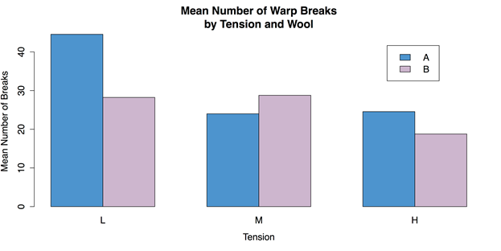

# 第 8 章三个或更多变量的图表

我们在第 6 章和第 7 章中介绍的方法为探索变量之间的联系提供了一种初步的方法，但是这些方法一次只能有两个变量。然而，在基本的实验室实验之外，经常需要同时考虑几个变量。我们将在本章讨论的方法将允许我们做到这一点；它们将允许我们一次可视化三个或更多变量之间的联系。下一章，第 9 章，将介绍统计描述这些复杂关系的方法。

在我们开始之前，先记下术语。当一个分析一次处理一个变量时，这叫做单变量分析。当一个分析处理变量对之间的关联时，它被称为二元分析。因此，一个涉及多个变量的分析被称为多元分析是有意义的。然而，术语“多变量”通常只适用于有多个结果变量的情况。这些类型的统计数据比我们将要做的要复杂得多，我们将使用多个预测变量和一个结果变量。考虑到这一点，对于这些程序，我通常会避免使用“多变量”这个术语，而是讨论“多变量”

## 均值的聚类条形图

当有多个预测变量时，我们的第一个图表将是均值条形图。在这种情况下，聚类条形图通常是最佳选择。重要的是要指出，许多程序，如 Excel、PowerPoint 和类似的程序，可能会提供用网格中的条来制作三维图表。尽管在某些情况下这是一个合理的解决方案，但这种情况很少发生。三维图表几乎总是比平面图表更难准确阅读。出于同样的原因，应该避免给条增加错误的厚度。它只是使图表变得复杂，而没有添加任何可用的信息。因此，并排图表通常是更好的选择，因为它更容易关注数据并准确解释数据。

在本练习中，我们将使用来自 R 的`datasets`包的`warpbreaks`数据。该数据集根据使用的纱线种类(记录为 A 和 B)和织机中的张力水平(记录为 L、M 和 H，表示低、中和高)给出织机中纱线断裂的次数。

第一步是加载`datasets`包和`warpbreaks`数据。

**样本:样本 _8_1。R**

```r
          # LOAD DATA
          require(“datasets”)  # Load datasets package
          data(warpbreaks)  # Load data into workspace

```

如果这些数据可以直接与 R 的`barplot()`函数一起工作，就很方便了，比如:`barplot(breaks ~ wool*tension, data = warpbreaks)`。不幸的是，这将给出一条错误消息，表示“`'height' must be a vector or a matrix`”，这意味着包含条形高度的变量(在本例中应该是平均断点数)必须具有不同的格式。我们可以通过使用`list()`函数和`tapply()`函数的组合将数据转换为正确的格式，其中`list()`函数将羊毛的类型和张力水平识别为因素(即分类预测变量)，而【】函数将函数应用于参差不齐的数组，或者可能包含空单元格的数组。然后，我们可以将重组后的数据保存到一个名为`wbdata`的新对象中，用于“warpbreaks 数据”

```r
          # RESTRUCTURE DATA
          wbdata <- tapply(warpbreaks$breaks,  # Outcome
                           list(warpbreaks$wool, warpbreaks$tension),  # Factors
                           FUN = mean)  # Summary function

```

然后我们可以使用`wbdata`来创建条形图。

```r
          # CREATE BARPLOT
          barplot(wbdata,  # Use a new summary table.
                  beside = TRUE,  # Bars side-by-side vs. stacked
                  col = c("steelblue3", "thistle3"),  # Colors
                  main = "Mean Number of Warp Breaks\nby Tension and Wool",
                  xlab = "Tension",
                  ylab = "Mean Number of Breaks")

```

然后，我们可以使用交互式定位器(1)功能添加一个图例，该功能允许我们通过在绘图上单击鼠标来选择位置。

```r
          # ADD LEGEND
          legend(locator(1),  # Use mouse to locate the legend.
                 rownames(wbdata),  # Use matrix row names (A & B)
                 fill = c("steelblue3", "thistle3"))  # Colors

```

结果图表如图 32 所示。



图 32:平均值的分组条形图

我们可以通过清理工作区来完成。

```r
          # CLEAN UP
          detach("package:datasets", unload = TRUE)  # Unloads the datasets package.
          rm(list = ls())  # Remove all objects from the workspace.

```

## 分组散点图

我们在上一节中看到的均值的聚类条形图，最好用在有两个分类预测变量和一个定量结果的情况下。相反，如果定量结果有一个分类和一个定量预测因子，那么分组散点图可以很好地工作。这仅仅是一个散点图，其中根据分类变量，通常通过形状或颜色来标记点。还可以为每个组包括单独的拟合线，例如线性回归线或平滑器。

对于这个例子，我们将使用来自 R 的`datasets`包的`iris`数据。

**样品:样品 _8_2。R**

```r
          # LOAD DATA
          require(“datasets”)  # Load the datasets package.
          data(iris)  # Load data into workspace.
          iris[1:3, ]  # Show the first three lines of data.
            Sepal.Length Sepal.Width Petal.Length Petal.Width Species
          1          5.1         3.5          1.4         0.2  setosa
          2          4.9         3.0          1.4         0.2  setosa
          3          4.7         3.2          1.3         0.2  setosa

```

我们将观察虹膜数据中三种不同物种的萼片长度和萼片宽度之间的关系。

在 R 中制作分组散点图最简单的方法是使用外部`car`包，我们在第 6 章中也使用了该包进行修改的二元散点图。

```r
          # LOAD "CAR" PACKAGE
          require("car")  # "Companion to Applied Regression"

```

我们将使用`scatterplot()`函数，也可以用缩写名`sp()`来调用。该代码与二元散点图命令之间的重要区别在于增加了管道运算符`|`，在这里用于将分组变量或因子(在本例中为`Species`)与函数的其余部分分开。

```r
          # SCATTERPLOT BY GROUPS
          sp(Sepal.Width ~ Sepal.Length | Species,  # Group by species.
             data = iris,
             xlab = "Sepal Width",
             ylab = "Sepal Length",
             main = "Iris Data",
             labels = row.names(iris))  # Label names.

```

结果图表如图 33 所示。


图 33:按组划分的散点图

`car`包使用颜色和形状来指示组成员身份。默认情况下，它还会为每个组叠加一条线性回归线和一条较低的平滑线，并通过颜色进行匹配。

我们可以通过卸载包和清理工作区来完成。

```r
          # CLEAN UP
          detach("package:datasets", unload = TRUE)  # Unloads the datasets package.
          detach("package:car", unload = TRUE)  # Unloads the car package.
          rm(list = ls())  # Remove all objects from workspace.

```

## 散点图矩阵

我们在上一节中创建的分组散点图能够显示两个定量变量之间的关系，同时指示第三个分类变量的组成员关系。虽然该图表的信息密度令人印象深刻，但它并没有包括数据集中的所有变量。为了得到图表中的所有四个定量变量，我们需要做一个散点图矩阵，它只是一个二元散点图的集合。有几种不同的方法可以做到这一点:R 的默认`pairs()`功能，`pairs()`带有自定义功能，或者`car`包中的`scatterplotMatrix()`功能。我们将探讨每种方法，但首先我们需要加载我们的数据。

**样品:样品 _8_3。R**

```r
          require("datasets")  # Load the datasets package.
          data(iris)  # Load data into the workspace.
          iris[1:3, ]  # Show the first three lines of data.
            Sepal.Length Sepal.Width Petal.Length Petal.Width Species
          1          5.1         3.5          1.4         0.2  setosa
          2          4.9         3.0          1.4         0.2  setosa
          3          4.7         3.2          1.3         0.2  setosa

```

我们将使用的第一种方法是 R 的`pairs()`函数。该函数唯一需要的参数是数据框的名称。然而，因为`iris`中的第五个变量是分类的——物种名称——我们将通过仅使用前四列数据来排除它。

```r
          # SCATTERPLOT MATRIX WITH DEFAULTS
          pairs(iris[1:4])  # Use just the first four variables from iris.

```

结果如图 34 所示。


图 34:带有`pairs()`的散点图矩阵

这是一个合理的图，但它不是信息密集的:没有组成员的指示，没有拟合线，带有变量名的大单元格可以用于其他目的。

我们可以通过几个步骤解决这些问题。第一步是用每个变量的直方图增加对角线上的名称。我们可以用下面的代码为此创建一个自定义函数，该代码改编自 R 的内置帮助中的`?pairs`中的代码。它创建了一个名为`panel.hist`的新函数。该函数将被保存到工作区，然后可以在我们再次运行`pairs()`函数时调用。

```r
          # FUNCTION TO PUT HISTOGRAMS ON DIAGONAL
          # Adapted from code in "pairs" help
          panel.hist <- function(x, ...)
          {
            usr <- par("usr")  # Copies usr parameters for plot coordinates.
            on.exit(par(usr))  # Restores parameters on exit.
            par(usr = c(usr[1:2], 0, 1.5) )  # Sets plot coordinates.
            h <- hist(x, plot = FALSE)  # Creates histogram.
            breaks <- h$breaks  # Reads breaks for histograms.
            nB <- length(breaks)  # Reads number of breaks.
            y <- h$counts  # Get raw values for the y-axis.
            y <- y/max(y)  # Adjusts raw values to fit the y scale.
            rect(breaks[-nB], 0, breaks[-1], y,  ...)  # Draws boxes.
          }

```

然后我们可以加载`RColorBrewer`包，这样我们就可以选择一个调色板来指示图中的组成员。

```r
          # SET COLOR PALETTE WITH RCOLORBREWER
          require("RColorBrewer")

```

创建`panel.hist`功能并加载`RColorBrewer`包后，我们可以使用指定的几个选项再次运行`pairs()`功能。`pairs()`功能有多种选择，可以让我们选择，比如哪个功能会显示在对角线上，上面板，下面板等。(详见`?pairs`。)

此外，通过调用`col`属性中的`RColorBrewer`调色板`Pastel1`并使用`unclass()`功能将`Species`因子分解为 1、2 和 3 的列表，这三种鸢尾以不同的颜色显示。

```r
          # SCATTERPLOT MATRIX WITH OPTIONS
          pairs(iris[1:4],  # Reads the data.
                panel = panel.smooth,  # Adds an optional smoother.
                main = "Scatterplot Matrix for Iris Data Using pairs Function",
                diag.panel = panel.hist,  # Calls histogram function.
                pch = 16,  # Uses solid dots for points.
                # Next line color dots by "Species" category.
                col = brewer.pal(3, "Pastel1")[unclass(iris$Species)])

```

结果图表如图 35 所示。


图 35:带有自定义功能的散点图矩阵

图 35 是对图 34 的改进，但它仍然可以改进。最重要的是，它缺少一个指示组成员身份的图例。使用具有未知兼容性问题的自定义函数也有潜在的麻烦。相反，我们可以使用`car`包中的`scatterplotMatrix()`功能。另外请注意标题属性`main`中`paste()`功能下面的代码。`paste()`将单独的字符串放在一个字符串中，这样可以在 R 命令中写一个长标题，但代码不会太宽。

```r
          # SCATTERPLOT MATRIX WITH "CAR" PACKAGE
          require("car")
          scatterplotMatrix(~Petal.Length + Petal.Width +
                             Sepal.Length + Sepal.Width | Species,
                            data = iris,
                            main = paste("Scatterplot Matrix for Iris Data",
                                         "Using the \"car\" Package"))

```

前面的命令生成了图 36 所示的图表。


图 36:带有`car`包中`scatterplotMatrix()`功能的散点图矩阵

图 36 同时完成了几件事:

*   它显示了四个定量变量和一个分类变量之间的关系。
*   它用颜色和形状来标记组成员身份。
*   它为组变量提供了一个图例。
*   它为每个图提供了线性回归线。
*   它为每个图提供了更平滑的置信区间。
*   它为每个变量提供了带有 rugplots 的核密度估计。

这些因素使得图 36 成为我们在本书中创建的信息最密集的图表。这张图表也是 R 非凡的灵活性和能力的一个例子，尤其是在数千个外部包中的任何一个的帮助下。

我们可以通过将调色板恢复为默认值、卸载包并清除我们的工作空间来完成。

```r
          # CLEAN UP
          palette("default")  # Return to default.
          detach("package:datasets", unload = TRUE)  # Unloads the datasets package.
          detach("package:RColorBrewer", unload = TRUE)  # Unloads RColorBrewer
          detach("package:car", unload=TRUE)  # Unloads car package.
          rm(list = ls())  # Remove all objects from the workspace.

```