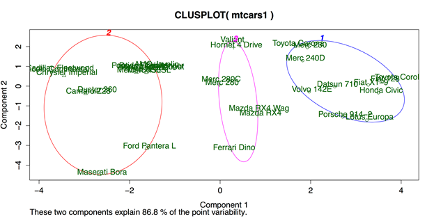
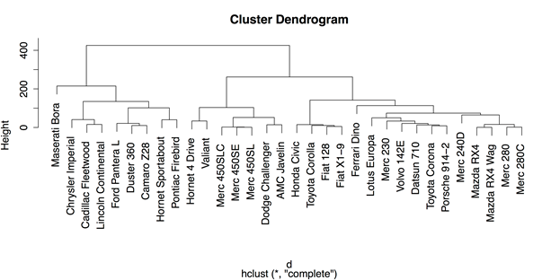
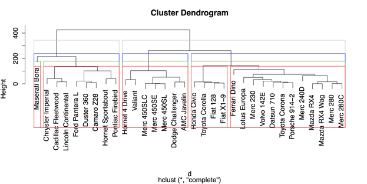
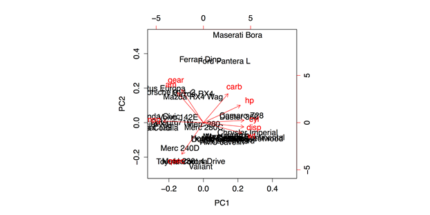

# 第九章三个或更多变量的统计

本书的最后一章分析了一些探索和描述多个变量之间关系的常用方法。这些方法包括任何分析师工具箱中最有用的程序，多元回归。我们将介绍的其他方法包括双因素方差分析、聚类分析和主成分或因子分析。

## 多元回归

回归的目标很简单:收集一组预测变量，并使用它们来预测单个定量结果变量的得分。多元回归是我们将在本书中介绍的最灵活的方法。我们已经介绍的所有其他参数程序——t 检验、方差分析、相关和二元回归——都可以看作多元回归的特殊情况。

在本节中，我们将从多元回归的最简单版本开始:同时输入。这是当所有的预测器作为一个组输入，并且它们都保留在等式中的时候。

在这个特殊的例子中，我们将看多元回归的最基本形式，其中所有的变量都同时输入到等式中(正是变量的选择和输入导致了统计中的大部分混乱)。我们将从从 R 的`datasets`包加载`USJudgeRatings`数据开始。详见  。

**样本:样本 _9_1。R**

```
          # LOAD DATA
          require("datasets")  # Load the datasets package.
          data(USJudgeRatings)  # Load data into the workspace.
          USJudgeRatings[1:3, 1:8]  # Display 8 variables for 3 cases.
                         CONT INTG DMNR DILG CFMG DECI PREP FAMI
          AARONSON,L.H.   5.7  7.9  7.7  7.3  7.1  7.4  7.1  7.1
          ALEXANDER,J.M.  6.8  8.9  8.8  8.5  7.8  8.1  8.0  8.0
          ARMENTANO,A.J.  7.2  8.1  7.8  7.8  7.5  7.6  7.5  7.5

```

R 中回归的默认函数为`lm()`，代表“线性模型”(详见`?lm`)。基本结构是`lm(outcome ~ predictor1 + predictor2)`。我们可以对结果变量`RTEN`(即“值得保留”)和 11 个预测器运行该函数，使用下面的代码并将模型保存到我们将称为`reg1`的对象中，用于回归 1。然后只调用`reg1`这个名字就可以得到回归系数，调用`summary(reg1)`就可以得到模型上的几个统计量。

```
          # MULTIPLE REGRESSION: DEFAULTS
          # Simultaneous entry
          # Save regression model to the object.
          reg1 <- lm(RTEN ~ CONT + INTG + DMNR + DILG + CFMG +
                     DECI + PREP + FAMI + ORAL + WRIT + PHYS,
                     data = USJudgeRatings)

```

一旦我们保存了回归模型，我们就可以调用对象的名称`reg1`，并获得回归系数列表:

```
          Coefficients:
          (Intercept)         CONT         INTG         DMNR         DILG 
             -2.11943      0.01280      0.36484      0.12540      0.06669 
                 CFMG         DECI         PREP         FAMI         ORAL 
             -0.19453      0.27829     -0.00196     -0.13579      0.54782 
                 WRIT         PHYS 
             -0.06806      0.26881

```

有关模型的更多详细信息，包括残差描述、系数置信区间和推理测试，我们只需键入`summary(reg1)`:

```
          Residuals:
               Min       1Q   Median       3Q      Max
          -0.22123 -0.06155 -0.01055  0.05045  0.26079

          Coefficients:
                      Estimate Std. Error t value Pr(>|t|)   
          (Intercept) -2.11943    0.51904  -4.083 0.000290 ***
          CONT         0.01280    0.02586   0.495 0.624272   
          INTG         0.36484    0.12936   2.820 0.008291 **
          DMNR         0.12540    0.08971   1.398 0.172102   
          DILG         0.06669    0.14303   0.466 0.644293   
          CFMG        -0.19453    0.14779  -1.316 0.197735   
          DECI         0.27829    0.13826   2.013 0.052883 . 
          PREP        -0.00196    0.24001  -0.008 0.993536   
          FAMI        -0.13579    0.26725  -0.508 0.614972   
          ORAL         0.54782    0.27725   1.976 0.057121 . 
          WRIT        -0.06806    0.31485  -0.216 0.830269   
          PHYS         0.26881    0.06213   4.326 0.000146 ***
          ---
          Signif. codes:  0 ‘***’ 0.001 ‘**’ 0.01 ‘*’ 0.05 ‘.’ 0.1 ‘ ’ 1

          Residual standard error: 0.1174 on 31 degrees of freedom
          Multiple R-squared:  0.9916,   Adjusted R-squared:  0.9886
          F-statistic: 332.9 on 11 and 31 DF,  p-value: < 2.2e-16

```

所有的预测变量都包含在这个模型中，这意味着它们的系数和概率值只有结合在一起才有效。这种模式有两点令人好奇。首先，它具有极高的预测价值，R <sup>2</sup> 为 99%。第二，这种同时入职模式中最重要的两个预测指标是(a) `INTG`，或者说司法诚信，这有明显的道理，(b) `PHYS`，或者说身体能力，它的 t 值几乎是诚信的两倍。第二个没有意义，但是有数据支持。

当在括号中输入模型名称时，这些函数可提供回归模型的其他信息:

*   `anova()`，给出回归模型的方差分析表
*   `coef()`或`coefficients()`给出的系数与我们通过调用模型名称`reg1`得到的系数相同。
*   `confint()`，给出系数的置信区间。
*   `resid()`或`residuals()`，给出具体情况下的残值。
*   `hist(residuals())`，给出残差的直方图。

多元回归是一个潜在的非常复杂的过程，有大量的变异和很大的分析判断空间。我们之前进行的版本是最简单的版本:所有的变量都是在原始状态下一次输入的(即没有任何转换)，没有指定任何交互，并且一旦计算了模型就没有进行任何调整。

r 的基本安装提供了许多其他选项，可用的包为多元回归提供了成百上千个其他选项。[【21】](11.html#_ftn21)我就只提两个 R 的内置选项，都是基于分步程序的。逐步回归模型的工作原理是使用一个简单的标准来包含或排除模型中的变量，它们可以大大简化分析。然而，这种模型很容易利用数据的怪癖，导致一位作者愤怒地称它们“在对第一类错误的诱惑中非常邪恶。”[【22】](11.html#_ftn22)

考虑到这些严厉的警告，我们仍然将简要地看一下逐步回归的两个版本，因为它们是非常常见的——也是通常要求的——过程。我们将研究的第一个变化是向后移除，首先输入所有可能的变量，然后一次移除一个对整个模型有统计意义的变量。

第一步是创建一个完整的回归模型，就像我们为同步回归所做的那样。然后，调用 R 函数`step()`，该回归模型作为其第一个参数，`direction = "backward"`作为第二个参数。一个可选的参数`trace = 0`，阻止 R 在每一步打印出所有的汇总统计数据。最后，我们可以使用`summary()`获得新模型的汇总统计数据，该数据被保存为`regb`，如“向后回归”中所示

```
          # MULTIPLE REGRESSION: STEPWISE: BACKWARDS REMOVAL
          reg1 <- lm(RTEN ~ CONT + INTG + DMNR + DILG + CFMG +
                     DECI + PREP + FAMI + ORAL + WRIT + PHYS,
                     data = USJudgeRatings)
          regb <- step(reg1,  # Stepwise regression, starts with the full model.
                       direction = "backward",  # Backwards removal
                       trace = 0)  # Don't print the steps.
          summary(regb)  # Give the hypothesis testing info.
          Residuals:
                Min        1Q    Median        3Q       Max 
          -0.240656 -0.069026 -0.009474  0.068961  0.246402 

          Coefficients:
                      Estimate Std. Error t value Pr(>|t|)    
          (Intercept) -2.20433    0.43611  -5.055 1.19e-05 ***
          INTG         0.37785    0.10559   3.579 0.000986 ***
          DMNR         0.15199    0.06354   2.392 0.021957 *  
          DECI         0.16672    0.07702   2.165 0.036928 *  
          ORAL         0.29169    0.10191   2.862 0.006887 ** 
          PHYS         0.28292    0.04678   6.048 5.40e-07 ***
          ---
          Signif. codes:  0 ‘***’ 0.001 ‘**’ 0.01 ‘*’ 0.05 ‘.’ 0.1 ‘ ’ 1

          Residual standard error: 0.1119 on 37 degrees of freedom
          Multiple R-squared:  0.9909,   Adjusted R-squared:  0.9897 
          F-statistic: 806.1 on 5 and 37 DF,  p-value: < 2.2e-16

```

使用一个逐步回归模型与向后删除，预测能力或 R2 仍然是 99%。模型中只剩下五个变量，和同时进入模型一样，体能仍然是最大的贡献者。

逐步回归的一种更常见的方法是正向选择，它从没有变量开始，然后一次添加一个变量，如果它们对预测能力有统计上的显著贡献。这种方法在 R 中稍微复杂一些，因为它需要创建一个“最小”模型，该模型只包含截距，即结果变量的平均得分。这个模型是通过使用数字 1 作为等式中唯一的预测变量而创建的。然后再次调用`step()`函数，以最小模型为起点，`direction = "forward"`为属性之一。可能包含的变量在`scope`中列出。最后，`trace = 0`防止中间步骤被打印。

```
          # MULTIPLE REGRESSION: STEPWISE: FORWARDS SELECTION
          # Start with a model that has nothing but a constant.
          reg0 <- lm(RTEN ~ 1, data = USJudgeRatings)  # Intercept only
          regf <- step(reg0,  # Start with intercept only.
                       direction = "forward",  # Forward addition
                       # scope is a list of possible variables to include.
                       scope = (~ CONT + INTG + DMNR + DILG + CFMG + DECI +
                                  PREP + FAMI + ORAL + WRIT + PHYS),
                       data = USJudgeRatings,
                       trace = 0)  # Don't print the steps.
          summary(regf)  # Statistics on model.

          Residuals:
                Min        1Q    Median        3Q       Max 
          -0.240656 -0.069026 -0.009474  0.068961  0.246402 

          Coefficients:
                      Estimate Std. Error t value Pr(>|t|)    
          (Intercept) -2.20433    0.43611  -5.055 1.19e-05 ***
          ORAL         0.29169    0.10191   2.862 0.006887 ** 
          DMNR         0.15199    0.06354   2.392 0.021957 *  
          PHYS         0.28292    0.04678   6.048 5.40e-07 ***
          INTG         0.37785    0.10559   3.579 0.000986 ***
          DECI         0.16672    0.07702   2.165 0.036928 *  
          ---
          Signif. codes:  0 ‘***’ 0.001 ‘**’ 0.01 ‘*’ 0.05 ‘.’ 0.1 ‘ ’ 1

          Residual standard error: 0.1119 on 37 degrees of freedom
          Multiple R-squared:  0.9909,   Adjusted R-squared:  0.9897 
          F-statistic: 806.1 on 5 and 37 DF,  p-value: < 2.2e-16

```

考虑到逐步回归可能出现的波动，令人欣慰的是，这两种方法都以相同的模型结束，尽管它们的排列顺序不同。

同样，重要的是要记住，多元回归可能是一个非常复杂和微妙的过程，许多分析师强烈批评了逐步方法。幸运的是，R 及其可用的包提供了许多替代方案，并且还会定期添加更多的替代方案，因此我鼓励您在使用单一方法之前探索您的选择。

一旦保存了您的工作，您应该通过删除您创建的任何变量或对象来清理工作空间。

```
          # CLEAN UP
          detach("package:datasets", unload = TRUE)  # Unloads the datasets package.
          rm(list = ls())  # Remove all objects from the workspace.

```

## 双因素方差分析

我们在上一节讨论的多元回归程序非常灵活，我们将在这一节讨论的程序，双因素方差分析，可以准确地描述为多元回归的一个特例。然而，使用方差分析的专门程序也有好处。最重要的优势是，它是专门为同时使用两个分类变量(方差分析中称为*因子*)预测单一定量结果的情况而开发的。方差分析给出了每个因素主要影响的容易解释的结果，以及它们相互作用的第三个结果。我们将使用来自 R 的`datasets`包的`warpbreaks`数据来检查这些影响。

**样品:样品 _9_2。R**

```
          # LOAD DATA
          require("datasets")  # Load the datasets package.
          data(warpbreaks)

```

有两种不同的方法来指定 R 中的双因素方差分析，但都使用`aov()`函数。在第一种方法中，显式指定了主要效果和交互，如下面的代码所示。该分析的结果可以通过我们在其他地方使用的`summary()`功能查看。

```
          # ANOVA: METHOD 1
          aov1 <- aov(breaks ~ wool + tension + wool:tension,
                      data = warpbreaks)
          summary(aov1)  # ANOVA table
                       Df Sum Sq Mean Sq F value   Pr(>F)   
          wool          1    451   450.7   3.765 0.058213 . 
          tension       2   2034  1017.1   8.498 0.000693 ***
          wool:tension  2   1003   501.4   4.189 0.021044 * 
          Residuals    48   5745   119.7                    
          ---
          Signif. codes:  0 ‘***’ 0.001 ‘**’ 0.01 ‘*’ 0.05 ‘.’ 0.1 ‘ ’ 1

```

这些结果表明张力水平对羊毛断裂的主要影响很大，与所用羊毛种类的相互作用较小。考虑到我们在第 8 章分组条形图中看到的均值模式，这些结果是有意义的。为了方便起见，下面将图 32 复制为图 37:


图 37:均值分组条形图

指定方差分析的第二种方法只说明交互作用，而将主要影响保留为隐含的，结果与第一种方法相同。

```
          # ANOVA: METHOD 2
          aov2 <- aov(breaks ~ wool*tension,
                      data = warpbreaks)

```

r 也能够通过`model.tables()`功能提供大量的附加信息。例如，命令`model.tables(` `aov1` `, type = "means")`给出了所有边际和单元平均值的表格，而命令`model.tables(` `aov1` `, type = "effects")`将这些平均值重新解释为系数。

最后，如果一个或两个因素有两个以上的水平，可能有必要做一个事后测试。与第 7 章中讨论的单因素方差分析一样，一个好的选择是图基的 HSD(诚实显著差异)测试，带有 R 命令`TukeyHSD()`。

我们可以通过卸载和打包以及清理工作区来完成这一部分。

```
          # CLEAN UP
          detach("package:datasets", unload = TRUE)  # Unloads the datasets package.
          rm(list = ls())  # Remove all objects from workspace.

```

## 聚类分析

聚类分析执行一项基本任务:确定哪些案例是相似的。这个任务使得放置案例成为可能——无论是人、公司、国家的地区等等。—分成相对同质的组，同时将它们与其他组区分开来。r 具有内置函数，以两种方式接近集群的形成。第一种方法是使用`kmeans()`函数的 k-均值聚类。这种方法要求研究人员指定他们想要形成多少个集群，尽管可以尝试几种变体。第二种方法是具有`hclust()`功能的层次聚类，其中每个案例都是自己开始的，然后根据它们的相似性将案例逐渐连接在一起。我们将依次讨论这两个过程。

对于这些例子，我们将使用来自 R 的`datasets`包的`mtcars`数据的稍微简化的版本，其中我们从数据集中移除了两个未定义的变量。

**样品:样品 _9_3。R**

```
          # LOAD DATA
          require("datasets")  # Load the datasets package.
          mtcars1 <- mtcars[, c(1:4, 6:7, 9:11)]  # New object, select variables.
          mtcars1[1:3, ]  # Show the first three lines of the new object.
                         mpg cyl disp  hp    wt  qsec am gear carb
          Mazda RX4     21.0   6  160 110 2.620 16.46  1    4    4
          Mazda RX4 Wag 21.0   6  160 110 2.875 17.02  1    4    4
          Datsun 710    22.8   4  108  93 2.320 18.61  1    4    1

```

为了使用`kmeans()`功能，我们必须指定我们想要的簇的数量。对于这个例子，我们将尝试三个集群，尽管进一步的检查可能会建议更少或更多的集群。这个函数产生大量的输出，可以通过用结果调用对象的名称来显示，在这种情况下是`km`。

```
          # CLUSTER ANALYSIS: K-MEANS
          km <- kmeans(mtcars1, 3)  # Specify 3 clusters

```

此时，创建一个聚类图比`kmeans()`函数的统计输出更有用。不幸的是，`kmeans()`功能默认不这样做。我们将改为使用`cluster`包中的`clusplot()`功能。

```
          # USE "CLUSTER" PACKAGE FOR K-MEANS GRAPH
          require("cluster")
          clusplot(mtcars1,        # Data frame
                   km$cluster,     # Cluster data
                   color = TRUE,   # Use color
                   shade = FALSE,  # Colored lines in clusters (FALSE is default).
                   lines = 3,      # Turns off lines connecting centroids.
                   labels = 2)     # Labels clusters and cases.

```

这个命令产生如图 38 所示的图表。



图 38:K 均值聚类的聚类图

图 38 显示了由彩色圆圈界定的三个集群，并排列在由两个最大的集群组件定义的网格上。簇之间有很好的分离，但是最左边簇 2 中的大分离表明多于三个簇可能是合适的。分层聚类是检查聚类数量和大小的好方法。

在 R 中，用`hclust()`函数进行层次聚类。但是，该功能不能在原始数据帧上运行。而是需要一个距离或相异度矩阵，可以用`dist()`函数创建。一旦运行了`dist()`和`hclust()`功能，就可以在由`hclust()`生成的模型上使用 R 的通用`plot()`命令显示集群的树形图。

```
          # HIERARCHICAL CLUSTERING
          d <- dist(mtcars1)  # Calculate the distance matrix.
          c <- hclust(d)  # Use distance matrix for clustering.
          plot(c)  # Plot a dendrogram of clusters.

```

图 39 显示了`plot()`生成的默认树形图。在此图中，每个案例都单独列在底部。上面的线条将每个案例与其他类似案例连接起来，而更相似的案例则向下连接得更低——例如最右侧的奔驰 280 和 280 c——而更不同的案例则向上连接得更高。例如，从这张图中可以清楚地看到，最左边的玛莎拉蒂宝来与数据集中的所有其他汽车都有很大不同。



图 39:带有默认值的分层聚类树图

一旦计算出分层模型，也可以使用`cutree()`将观察值分组，这表示“切割树”图，这是树形图的另一个名称。但是，您必须告诉函数如何或在哪里将树分成组。您可以使用`k = 3`指定组的数量，也可以在树形图中指定垂直高度`h = 230`，这将产生相同的结果。例如，以下命令将把案例分为三组，然后显示最后三个案例的组标识:

```
          # PLACE OBSERVATIONS IN GROUPS
          g3 <- cutree(c, k = 3)  # "g3" = "groups: 3"
          g3[30:32]  # Show groups for the last three cases.
          Ferrari Dino Maserati Bora    Volvo 142E 
                      1             3             1

```

值得注意的是，也可以通过指定一系列组(`k = 2:5`将进行 2、3、4 和 5 的组)或特定值(`k = c(2, 4)`将进行 2 和 4 的组)来同时进行几个分组。

R 的层次聚类功能的最后一个方便的特性是能够使用`rect.hclust()`在树形图中的组周围绘制方框。以下代码在树形图上叠加了四组不同颜色的方框:

```
          # DRAW BORDERS AROUND CLUSTERS
          rect.hclust(c, k = 2, border = "gray")
          rect.hclust(c, k = 3, border = "blue")
          rect.hclust(c, k = 4, border = "green4")
          rect.hclust(c, k = 5, border = "red")

```

结果如图 40 所示。



图 40:分组周围有方框的层次聚类树图

从图 40 中可以明显看出，大型美国汽车形成了不同于小型进口汽车的群体。同样显而易见的是，玛莎拉蒂宝来与该集团截然不同，因为一旦我们要求至少四个集团，它就会被归入自己的类别。

一旦保存了您的工作，您应该通过删除您创建的任何变量或对象来清理工作空间。

```
          # CLEAN UP
          detach("package:datasets", unload = TRUE)  # Unloads datasets package.
          detach("package:cluster", unload = TRUE)  # Unloads datasets package.
          rm(list = ls())  # Remove all objects from the workspace.

```

## 主成分和因子分析

我们将在本书中讨论的最后一对统计过程是主成分分析和因子分析。这些过程密切相关，通常用于探索变量之间的关系，目的是将变量组合成组。从这个意义上说，这些过程是聚类分析的补充，我们在上一节中已经介绍过了。但是，在聚类分析对案例进行分组的情况下，PCA 和 FA 对变量进行分组。主成分分析和功能分析是经常互换使用的术语，即使这在技术上是不正确的。心理学包的文档中给出了两者之间差异的一个解释:“成分模型和因素模型之间的主要经验差异是对每个项目的差异的处理。从哲学上讲，成分是观察变量的加权组合，而在因子模型中，变量是因子的加权组合。”[【23】](11.html#_ftn23)以我的经验，那可以是没有区别的区分。我个人对 PCA 和 FA 有一个非常务实的方法:解释和应用结果的能力是最重要的结果。因此，有时将这些分析的结果更多地视为如何对变量进行分组的建议，而不是必须遵循的统计教条，会有所帮助。

考虑到这一点，我们可以看一个简单的例子，说明如何在 R 中运行 PCA 和 FA。对于这个例子，我们将使用来自 R 的`datasets`包的相同`mtcars`数据，我们在上一节中使用了这些数据来说明聚类分析。我们将从数据集中排除两个变量，因为 R 没有提供它们意义的解释。这就给我们留下了九个变量。

**样品:样品 _9_4。R**

```
          # LOAD DATA
          require("datasets")  # Load the datasets package.
          mtcars1 <- mtcars[, c(1:4, 6:7, 9:11)]  # Select the variables.
          mtcars1[1:3, ]  # Show the first three cases.
                         mpg cyl disp  hp    wt  qsec am gear carb
          Mazda RX4     21.0   6  160 110 2.620 16.46  1    4    4
          Mazda RX4 Wag 21.0   6  160 110 2.875 17.02  1    4    4
          Datsun 710    22.8   4  108  93 2.320 18.61  1    4    1

```

R 中主成分分析的默认方法是`prcomp()`。如果可以使用整个数据帧，这个函数最容易使用。此外，还有两个额外的参数可以使变量标准化，并使结果更容易解释:`center = TRUE`，它将变量的平均值集中到零，以及`scale = TRUE`，它将变量的方差设置为 1(即单位方差)。这两个参数基本上将所有的观察值转化为 z 分数，并确保数据具有某种形式的方差同质性，这有助于稳定主成分分析的结果。有关该函数以及`center`和`scale`参数的更多信息，请参见`?prcomp`。

```
          # PRINCIPAL COMPONENTS
          pc <- prcomp(mtcars1,
                       center = TRUE,  # Centers means to 0 (optional).
                       scale = TRUE)  # Sets unit variance (helpful).

```

通过将分析保存在一个对象中——在这种情况下是 PC——我们可以为几个函数调用附加函数。第一个是`summary()`，给出了各成分占总方差的比例。第一行“标准差”包含协方差/相关矩阵特征值的平方根。

```
          # OUTPUT
          summary(pc)  # Summary statistics
          Importance of components:
                                    PC1    PC2     PC3     PC4     PC5     PC6     PC7
          Standard deviation     2.3391 1.5299 0.71836 0.46491 0.38903 0.35099 0.31714
          Proportion of Variance 0.6079 0.2601 0.05734 0.02402 0.01682 0.01369 0.01118
          Cumulative Proportion  0.6079 0.8680 0.92537 0.94939 0.96620 0.97989 0.99107
                                     PC8    PC9
          Standard deviation     0.24070 0.1499
          Proportion of Variance 0.00644 0.0025
          Cumulative Proportion  0.99750 1.0000

```

一些地块也可用于主成分分析。通用的`plot()`函数，当应用到`prcomp()`的输出时，将给出每个组件的特征值的未标记条形图，尽管这可以用来直观地测试应该保留多少组件。

函数`biplot()`给出了一个二维图，其中:

1.X 轴和 Y 轴上最大的两个组件。

2.指示数据框中每个变量与这些组件之间关系的向量。

3.单个案例的标签显示它们在两个组件上的位置。

有了我们的数据，`biplot(pc)`会给出图 41。



图 41:主成分分析的双标图

R 中因子分析最简单的用途是确定需要多少因子来充分代表数据中的可变性。例如，在我们的数据中，我们可以运行函数`factanal()`的几次迭代，在那里我们指定不同数量的可能因子，并检查结果卡方检验的概率值。在这种情况下，我们寻找的模型是*而不是*的统计显著性(即 *p* > .05，而不是 *p* < .05)，因为我们希望模型与数据很好地对应，并且基本上不偏离数据。在以下四个分析中，每一个都指定了不同数量的因子，并提到了打印输出最后一行的 p 值。还包括最终命令的完整打印输出。

```
          # FACTOR ANALYSIS
          factanal(mtcars1, 1)  # 1 factor, p < .05 (poor fit)
          factanal(mtcars1, 2)  # 2 factors, p < .05 (poor fit)
          factanal(mtcars1, 3)  # 3 factors, p < .05 (poor fit)
          factanal(mtcars1, 4)  # 4 factors, First w/p > .05 (good fit)
          Call:
          factanal(x = mtcars1, factors = 4)

          Uniquenesses:
            mpg   cyl  disp    hp    wt  qsec    am  gear  carb 
          0.137 0.045 0.005 0.108 0.038 0.101 0.189 0.126 0.031 

          Loadings:
               Factor1 Factor2 Factor3 Factor4
          mpg   0.636  -0.445  -0.453  -0.234 
          cyl  -0.601   0.701   0.277   0.163 
          disp -0.637   0.555   0.176   0.500 
          hp   -0.249   0.721   0.472   0.296 
          wt   -0.730   0.219   0.417   0.456 
          qsec -0.182  -0.897  -0.246         
          am    0.891                  -0.100 
          gear  0.907           0.226         
          carb          0.478   0.851         

                         Factor1 Factor2 Factor3 Factor4
          SS loadings      3.424   2.603   1.549   0.644
          Proportion Var   0.380   0.289   0.172   0.072
          Cumulative Var   0.380   0.670   0.842   0.913

          Test of the hypothesis that 4 factors are sufficient.
          The chi square statistic is 6.06 on 6 degrees of freedom.
          The p-value is 0.416

```

这些结果表明，从因素载荷的模式来看，第一个因素与汽车的物理尺寸有关(较小的汽车获得较高的因素分数)，第二个因素与功率和速度有关(功率更大、速度更快的汽车获得较高的分数)，第三个因素与化油器管有关(这减少到“玛莎拉蒂宝来”因素，因为它是唯一一辆有八个化油器管的汽车)，第四个因素给发动机更大的重型汽车带来了一些额外的差异。这些结果可以与前一节中来自主成分分析和聚类分析的双标图进行比较，以更全面地了解该数据集中病例和变量之间的关系。

一旦保存了您的工作，您应该通过删除您创建的任何变量或对象来清理工作空间。

```
          # CLEAN UP
          detach("package:datasets", unload = TRUE)  # Unloads the datasets package.
          rm(list = ls())  # Remove all objects from the workspace.

```