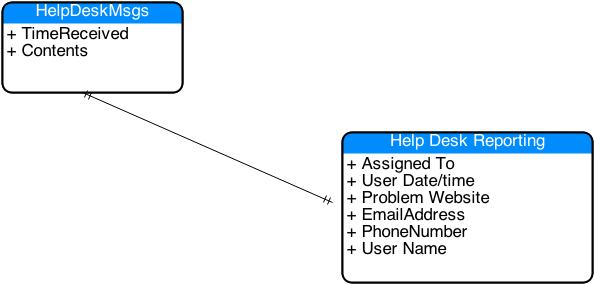

# 第 1 章文本处理

计算机非常擅长处理结构化数据，但还不能与人们处理文本的能力相提并论。例如，如果服务台系统中记录了以下文本:

`Hi,`

`I called Jon on Tuesday, March 25th at 7pm and expressed a concern about my slow times accessing [www.cnn.com](http://www.cnn.com). He said he would fix it, but I never heard back. Can someone contact me at Kellie.Booth@if.com ASAP? What does Ctrl-F5 mean, by the way?`

`Thanks`

`Kellie`

不需要太多努力，一个人就可以阅读该文本，并轻松找到凯丽交谈过的人、问题网站、日期和电子邮件地址。然而，对一个人来说如此简单的任务对一台计算机来说却相当困难。如果日期改为 3 月 25 日，会发生什么？或者网站没有“www”前缀？或者地址中是否包含“http:”字样？

## 模式

人们是怎么做得这么好的？本质上，我们理解模式，并且可以轻松处理丢失的信息。我们知道一个日期可能有一天，也可能没有一天，一个月的名字可能会被拼写出来，也可能会被缩写。我们知道，一个网站通常是一个或多个单词(没有空格)，后跟一个句点和一个常见的缩写(com、net、org 等)。).

构建一个正则表达式模式就是理解一些文本的规则，然后用正则表达式模式语言描述这些规则。在本书的其余部分，我们将使用上面的例子，一个帮助系统，它包含收到消息的日期和消息的文本内容。我们将探索使用正则表达式模式来解析这些文本消息，并提取日期、时间、网址、电子邮件地址等。

下面是来自我们帮助系统的另一条示例消息:

`Hey jerks,`

`I called on Mar 15, spoke to Suzie, and complained about not be able to access livedates.net after 7:30PM. What the heck is up? Get back to me, fred@mycollege.edu. Or call me at 619-555-1212\. Hopefully, somebody will read this…`

`Very upset, Fred!`

我们通过这本书正在进行的任务将是使用正则表达式来找出如何阅读这些消息，并确定何时打电话，打给谁，他们对哪个网站有问题，以及他们的电子邮件地址或电话号码。

## 建筑模式

在我们阅读这本书的过程中，我们会看到正则表达式模式匹配结果的各种方式。建立你的模式的最好方法是离开电脑，用英语写下你如何识别模式的步骤。一旦你用英语描述了你的搜索规则，你就可以将这些规则转换成与你自己搜索文本所用的逻辑相匹配的适当的正则表达式模式。

例如，假设我们在一个在线广告中寻找价格信息。我们想找一辆车出售，但我们不想花超过一万美元。以下是我们在寻找价格时可能会用到的英语规则。

表 1:模式规则

| 规则 | 正则表达式模式 |
| 匹配所有文本，直到第一次出现$符号。 | `.*\$` |
| 现在我们需要一些数字。 | `\d+` |
| 可能有逗号。 | `,?` |
| 还有一些数字 | `d+` |

当你不加思索地使用这些步骤时，你需要弄清楚它们，以便将它们转换成 regex 模式语言，从而让计算机直观地知道你在做什么。

|  | 注意:暂时不要担心正则表达式模式方面；这些角色在几章中会更有意义。 |

## 我们的服务台

举个例子，我们假设我们的服务台由三个人组成:约翰、苏珊和比尔。发送到帮助系统的短信或电子邮件会自动记录到一个数据库表中，该表只包含两个字段:收到消息的日期和时间，以及消息的文本。该公司希望开始报告这些短信的摘要、信息发送给谁以及发送时间、收件人的联系信息和其他相关信息。

图 1:帮助台工作流程

一个人可以轻松地从帮助台消息表中读取消息，并将信息提取到帮助台报告表中。在阅读本书时，我们的目标是能够从帮助台消息表中提取大部分信息，以便在报告表中创建一个条目。