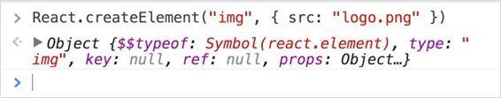

HTML 是一门伟大的语言，在我看来，它的伟大之处在于它让我们在构建网页时可以声明性。我们基本上用 HTML 告诉浏览器我们想要什么。

例如，当我们告诉浏览器在页面中呈现一段文本时，我们并不关心浏览器实际上是如何做的。我们不必担心浏览器需要采取什么步骤来使我们的文本看起来像一个段落，例如它周围应该有多少像素的空白，每行显示多少个单词，或者当屏幕调整大小时该做什么。我们只想要一个段落，有了 HTML，我们就有能力命令浏览器让它发生。

但是 HTML 本身是不够的。我们在 HTML 中没有循环、if 语句或变量，这意味着我们不能根据数据编写动态 HTML。HTML 非常适合静态内容，但是当等式中有数据时，我们需要其他东西。

简单的事实是，数据在等式中总是*。我们编写 HTML 来表示一些数据，即使当我们将 HTML 用于静态内容时。当我们编写静态内容时，我们手动编写 HTML 来表示一些数据，这对于数据不经常变化的小网站来说是可以的。*

 *“改变”这个词在这里很关键。当我们用 HTML 表示的数据发生变化时，我们需要手动更新 HTML 来反映这种变化。例如，当您为其建立网站的小型企业获得一个新的电话号码时，是时候进入一个 HTML 编辑器，进行更改，然后将新的 HTML 文件上传到服务器。

如果变更的性质更频繁，例如，如果企业现在希望每小时在主页上展示一个不同的产品，您不会同意(我希望)每小时进行一次手动变更。想象一下，如果脸书全是静态内容，每次你更新状态时，脸书的某个人都需要编辑一个 HTML 文件并上传到服务器。

我们很久以前就意识到 HTML 是不够的，此后我们一直在努力增强 HTML，使其支持动态内容。

让我们假设我们想要用 HTML 表示一个产品列表。对于每种产品，我们都有一个名称和价格。以下是一些示例数据:

代码清单 1:示例产品数据

```jsx
  {
    "products": [
      { "name": "React.js Essentials",
  "price": 2999 },
      { "name": "Pro React", "price":
  2856 },
      { "name": "Learning React Native",
  "price": 2199 }
    ]
  }

```

一个小企业的心态会认为我们只有这三种产品，它们的价格很少变化。手动为这三个产品编写一些静态 HTML 是可以的。

但是产品列表是动态的——有些产品会被添加，有些会被删除，价格会随季节变化。手动编写 HTML 不会伸缩，所以我们需要拿出始终代表产品数据最后*状态*的 HTML。

我们可以使用数据库表(或集合)来表示数据库中的数据。对于我们的产品示例，我们可以使用产品表。

代码清单 2:产品表

```jsx
  create table products (
    name text,
    price integer
  )

```

该表中的每一行都代表一个产品。然后，我们可以授予客户对表的写访问权限，允许他们随时添加、删除和更新他们的产品列表。

要想出 HTML 来表示这些产品，我们可以从这个表中读取数据的最后状态，并用某种编程语言(如 Java)对其进行处理，使程序基于数据将 HTML 字符串连接在一起。

代码清单 3: HTML 字符串

```jsx
  html = "<html><body><ul>";

  // Loop over rows in table, and for every row:
  html += "<li>" + name + " - " + price +
  "</li>";

  // When the loop is done:
  html += "</ul></body></html>";

```

我们现在可以将那个`html`变量的值写入一个 HTML 文件并发送它。每次客户更新他们的数据表，我们都可以重新生成并发送新的 HTML。

这很有效，它给了我们很多处理动态数据的能力，但是出了问题；感觉不对劲。

*我们想写 HTML，而不是连接字符串。*

一个天才想出了一个主意，创造一种介于 HTML 和像 Java 这样的编程语言之间的新语言。在这种语言中，我们仍然可以编写普通的 HTML 标签，但也可以使用特殊的标签，当我们需要它们时，这些标签会像循环和条件一样工作。JSP 和 PHP 就是这方面的例子。

下面是我们如何使用增强的 HTML 语言来表示我们的产品数据:

代码清单 4: HTML+(伪代码)

```jsx
  <html><body><ul>
    <%
  FOR each product in the list of products %>
      <li><%=
  the product's name %> - <%= the product's price %></li>
    <%
  END FOR %>
  </ul></body></html>

```

这显然比串联字符串更令人愉快。编译器将负责为我们进行字符串连接，我们将获得始终反映我们确切数据的 HTML。

多年来，这一直是创建动态网站的标准方式。事实上，直到最近，脸书都是这样做的，给你看你朋友的更新列表。

但是就像生活中的其他事情一样，浏览器也在进化，变得更加智能。JavaScript 成为所有浏览器都支持的标准语言，有人发明了 AJAX，它允许我们在网页的背景下向服务器提问。

我们意识到，我们可以更高效地表示数据。我们可以只将数据发送给客户端，而不是在服务器端准备好 HTML 并将其发送给客户端，这样我们就可以让漂亮的智能浏览器自己准备 HTML 了。JavaScript 可以做到这一点。

因为我们不想连接字符串，所以我们需要像 JSP 和 PHP 这样的东西，但是需要能够与浏览器中的 JavaScript 引擎一起工作的东西。

像 Angular、Ember 和其他一些框架的开发是为了使这个过程更容易。

就像服务器端增强的 HTML 语言一样，通过 Angular，我们做到了:

代码清单 5:角度循环

```jsx
  <html><body><ul>

  <li *ngFor="#product of products">

  {{product.name}} - {{product.price}}

  </li>
  </ul></body></html>

```

现在，我们通过网络变得更加高效，我们可以生成动态 HTML，而不必处理串联字符串。

这非常有效，但是当我们使用它构建大型应用程序时，出现了一些问题:

*   性能:由于我们不再每次点击一个链接就点击刷新按钮，我们现在应该更仔细地管理内存的使用。
*   浏览器非常适合动态呈现元素的 HTML 树，但是它们仍然很慢，尤其是当我们需要更新树的时候。每次需要更新时，都需要进行树遍历，当我们到达节点并更新它时，浏览器需要重新绘制用户屏幕，这是一个昂贵的过程。
*   在某些情况下，我们不是直接用用户界面来建模数据的状态，而是编写代码来表达更新这些界面所需的步骤和转换。这并不理想。

脸书的工程师们意识到了所有其他 JavaScript 框架的问题，想要更好的东西，所以他们又回到了画板上。几个月后，他们想出了最终成为 React 的东西。

他们有几个简单的规则来指导他们的天才解决方案:

*   对 HTML 的增强是噪音——让我们在 JavaScript 本身中连接字符串，是的，为了性能牺牲一些可读性。
*   DOM 是一个瓶颈；我们应该尽可能避免它。

HTML 视图是分层的。一个 HTML 文档是一棵大节点树。凭借 JavaScript 的强大功能和灵活性，脸书的工程师意识到，如果将 HTML 节点表示为 JavaScript 对象，我们将拥有一个全新的使用它们的可能性世界。

有了 JavaScript 的强大功能和灵活性，脸书的工程师意识到，如果 HTML 节点被表示为 JavaScript 对象，我们将有一个全新的世界来处理它们。

这导致了他们的第一个重大决定:*用一个 JavaScript 对象表示每个 HTML 元素。*

|  | 注意:如果您想测试本书中的 React 代码示例，获取 React 环境进行测试的最简单方法是使用网络开发在线游乐场应用程序之一。我最喜欢的是 JS Bin[这里有一个反应就绪箱](http://jsbin.com/nufuwas/edit?js,output)，你可以分叉开始测试。 |

React 今天的 API 有`createElement`功能，正好可以用来做这个。

代码清单 6: Void 元素

```jsx
  //
  Instead of:
  

  //
  We do:
  React.createElement("img",
  { src: "logo.png" })

```

`createElement`函数返回一个 JavaScript 对象。要检查该对象，请转到[主反应](http://facebook.github.io/react/)网站，并将`createElement`行粘贴到开发人员工具 JavaScript 控制台中:



图 1:JS 控制台中的`createElement`

请注意该对象的`type`属性，并查看一下`props`属性。

``然而，是一个空(自动关闭)元素；让我们看另一个普通元素的例子。

代码清单 7:普通元素

```jsx
  //
  Instead of:
  <a href="/">Home</a>

  //
  We do:
  React.createElement("a",
  { href: "/" }, "Home");

```

为了表示父子关系，我们可以使用`React.createElement`函数的参数。我们可以传递一个或多个 React 对象，从`React.createElement`的第三个参数开始。

例如，要使徽标图像可点击:

代码清单 8:父子关系

```jsx
  //
  Instead of:
  <a
  href="/">

  
  </a>

  //
  We do:
  React.createElement("a",
  { href: "/" },

  React.createElement("img", { src: "logo.png" })
  );

```

如果我们检查控制台中的最后一个对象，我们会注意到`<a>`元素的`props`属性如何具有`children`属性，而这又保存了`` 元素的对象。这就是我们用“反应”来表示树的方式。

当然，在幕后，React 最终将从这些 JavaScript 对象中生成 HTML 字符串，并将它们连接在一起。

用 JavaScript 编写 HTML 有很多好处:

*   我们有 JavaScript 本身处理数据的能力。我们的产品示例如下:

代码清单 JavaScript 的力量

```jsx
  React.createElement("ul",
  {},

  ...products.map(product => 

  React.createElement("li", {}, `${product.name} - ${product.price}`)

  )
  );

```

*   都是 JavaScript，所以我们不会把 HTML 和新标签什么的混在一起。我们也不必学习一门新的语言，而是学习如何使用 React 定义的几个 JavaScript 函数。
*   我们在内存中总是有一个 HTML 的表示，与浏览器中的表示是分开的。这意味着我们可以通过对内存中的结构使用智能区分算法来优化我们的 DOM 操作。这只有在事情发生变化时才有意义。这个概念就是我们所说的*React 中的虚拟 DOM* 。

在为我们开始的产品数据示例呈现了 HTML 之后，我们将在浏览器中显示三个产品及其名称和价格。通过`Ajax`呼叫，我们确定产品#2 的价格已经改变，现在我们有第四个产品要展示。

React 将三个产品的原始用户界面状态存储在内存中(因为我们首先用 JavaScript 编写了它)。在向浏览器发送任何内容之前，React 将计算新的状态，该状态现在有四个产品。

现在两种状态都在内存中，React 可以计算新状态和原始状态之间的差异，并可以得出结论，它需要添加节点#4 并修改节点#2。所有其他节点将保持不变。

将原始状态保存在内存中代表了很大的性能优势。内存中没有原始状态的其他框架有两种选择:

*   生成新状态的用户界面，并替换浏览器中的整个树。
*   尝试更改节点#2 和#4，但是依赖于 DOM 中的内容。这导致在 DOM 中进行一系列读取操作，并处理树以找出节点#2 从哪里开始，节点#3 从哪里结束。这些 DOM 操作通常很昂贵。

React 在内存中对浏览器 DOM 的虚拟表示(称为虚拟 DOM)显然是更好的选择。事实上，它是如此的好，以至于今天大多数其他的 JavaScript 框架已经改变了它们的算法，来做 React 为更新 DOM 所做的事情。

React 的功能不仅仅是一个带有智能区分算法的虚拟 DOM。React 中的视图具有私有状态，因此我们的产品列表视图可以在该私有状态中表示其原始的三个产品对象，当新数据进来时，我们只需更新私有状态。每当视图的私有状态改变时，React 触发 DOM 重载。它基本上点击了浏览器中的一个特殊的刷新按钮。

从用户检查状态的角度来看，视图已经完全刷新，新视图代表新状态。但是在幕后，React 通过使用它通过虚拟 DOM 计算的 diff，并且只将该 diff 应用于浏览器的树，聪明地完成了这个刷新操作。然而，作为开发人员，我们不必担心这个问题；我们只需声明我们的状态更改，并让 React 负责所需的步骤，以使这些更改有效地反映在浏览器的 DOM 中。

理解这一点非常重要，值得重复:使用 React，我们对用户界面的状态建模，而不是对它们的转换建模。如果有变化，我们只是模拟新的状态。

React 有效地教会了浏览器和美国开发者说一种新的语言:用户界面结果语言。我们现在可以用这种更高级的语言与我们的浏览器通信，这种语言允许我们以声明的方式表达我们的用户界面。

用 React 语言为我们的产品举例，我们基本上是说，“Browser，我有三个产品给你。”然后一分钟后，我们回来说:“浏览器，我现在有四个产品给你。”我们不必担心价格或名称的变化，因为这不是语言的一部分；这是一个过渡，我们只是为新的状态建模:四个产品。事实上，即使是产品的数量也不重要，因为 React 的反应式更新特性会在数量发生变化时重新呈现视图。我们对浏览器的命令最终是，“浏览器，我们有一个产品列表给你，这个列表可能会发生变化。”*