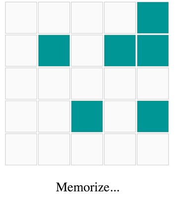
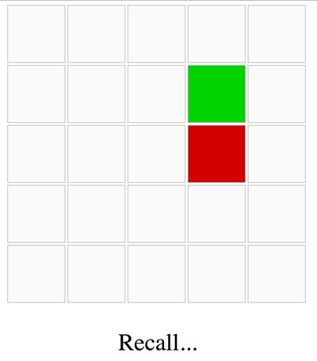
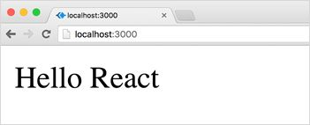
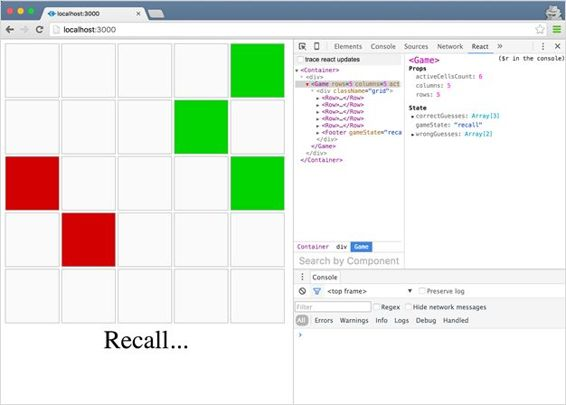
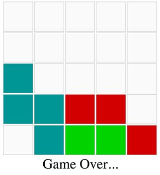

#  构建一个游戏

让我们利用到目前为止所学的知识，用 React 从头开始构建一些东西。让我们构建一个有点娱乐性的游戏，而不是构建一个无聊的示例应用。

我爱记忆游戏；我认为它们是“保持”你有用的短期记忆的极好方法。我挑了一款流行又简单的记忆游戏让我们一起打造。这款游戏有很多名字，也有很多变化，但我只称它为“记忆网格”

这个游戏将向玩家展示一个有许多单元格的网格，并突出显示一些随机的单元格。玩家需要记住突出显示的单元格的位置。然后，游戏将清除突出显示的单元格，并要求用户从记忆中回忆起它们的位置。

我选择这个游戏是因为它不是一个微不足道的例子，但仍然足够简单，可以放在一章中。游戏还有几个移动的部分:会有不同层次不同状态的嵌套组件，会有定时器，会有用户通过点击输入。

要查看本章中我们将构建的演示，您可以在此处玩内存网格游戏的最终版本。



图 8:记忆状态



图 9:召回状态

以下是客户在请求游戏时告诉我们的内容:

你从一个空的网格开始，这个网格是 X 乘 Y 的(使它可配置)。告诉玩家准备好，然后突出显示一些单元格(也是可配置的)几秒钟，同时告诉用户记住这些单元格。游戏随后进入“回忆”模式，在我们将单元格从网格中清除后，用户被要求记住这些单元格。如果他们猜中了一个正确的单元格，将其标记为绿色，如果他们猜错了单元格，将其标记为红色。如果他们以最多两次错误的尝试猜出所有正确的细胞，他们就赢了。

这个要求不算太差；你会幸运地从客户那里得到这样一个详细的请求。通常，客户的请求是模糊的，你必须围绕它们进行创新——这就是为什么当我们有准备好要测试的东西时，我们需要通过总是让客户参与进来来提高流程的敏捷性。

和任何复杂的问题一样，找到解决方案的关键是将问题分成小的、可管理的部分。把注意力放在最小的可测试增量上，这样你就可以把项目向前推进一点点，并实现它。

*   我们将使用本地托管的 React 应用程序，因为这实际上是您从现在开始要做的事情。这意味着我们需要做一些配置步骤来让事情正常运行。或者，你可以在像 jsbin.com 或 codepen.io 这样的网站上做整个游戏，但我建议你跟着做，让一个本地的 React 应用程序工作。不会太难，我保证。
*   我们将在这个项目中使用 JSX。这意味着我们需要一个工具来处理所有有 JSX 的文件。我们将使用 [Babel.js](https://babeljs.io/) 来做到这一点。
*   我们将使用 JSPM，JavaScript 包管理器，来调用 Babel.js，并为浏览器捆绑我们的应用程序。JSPM 可能是启动本地 React 项目最简单的方法。
*   我们将使用现代的 ES2015 JavaScript 语法。通过使用 Babel.js，我们不必担心浏览器支持(无论如何，当您阅读本文时，这可能是无关紧要的)。我们还将使用 React 类语法来定义我们的组件。
*   我们将尽可能模块化；我们将把每个组件放在它自己的文件中，我们将努力保持组件的小而纯。
*   我们不会花很多时间在游戏的造型上。我们这样做是为了学习反应。我们将在需要的地方做最少的造型。
*   为了简单起见，我们不会为这个游戏编写测试。这是一个糟糕的决定，除非你正在为*简洁的*系列书写一个例子，否则不要做出类似的决定。
*   我们将关注可读性而不是性能。
*   我们将尽可能减少组件状态的使用。

|  | 注意:我会有意在这个游戏中“植入”一些 bug 和问题，并可能引入其他不那么有意的 bug 和问题。当我们在游戏中取得进展时，试着找出问题。我最终会解决故意的(在我挑战你找到它们之后)，但是如果你发现了其他的 bug，请确保在游戏的 GitHub 项目上用一个问题来报告它们。 |

当你完成了这本书的后续部分，游戏的完整源代码可以在 [GitHub](http://github.com/reactjscamp/memory-grid-game) 上找到。

客户的段落是一个良好的开端，但是在规范中存在一些空白，我们应该尝试填补这些空白:

*   游戏开始时，屏幕中央呈现一个网格，有 X 行和 Y 列。默认情况下，它将从 5 × 5 开始。
*   在初始网格下，一条提示消息将显示“准备好…”
*   两秒钟后，网格下的提示信息将变为“熟记…”并且网格将以蓝色突出显示 Z 单元格。Z 单元格将随机选取。默认情况下，Z 将为 6。
*   到目前为止，用户除了观察正在发生的事情之外，什么也做不了。
*   再过两秒钟，网格下的提示信息将变为“Recall……”，网格将清除六个突出显示的单元格。
*   游戏会在清除高亮显示的单元格之前记住它们的位置。
*   此时，用户可以点击任何单元格。单击之前高亮显示的单元格会将其变为绿色。点击其他没有突出显示的单元格会使它们变成红色。
*   在页脚，我们将显示赢得游戏所需的剩余正确猜测的数量。每一个新的正确猜测都会减少这个数字。
*   如果点击三个错误的单元格，用户就会输掉游戏。
*   如果用户在不超过两次错误尝试的情况下正确猜测了所有六个单元格，则赢得了游戏。
*   如果用户赢得游戏，网格下的消息将显示“玩得好”如果他们输了，信息会是“游戏结束”
*   游戏结束后，会显示用户猜不到的活动单元格。

显然，这比客户为我们详细说明的要多得多，但对我来说，这是最起码的道理。我在提出规格时假设了一些事情，客户可能不喜欢。当我们在纸上列出清单后，一件合乎逻辑的事情是确保客户喜欢它的一切。

如果得到客户的批准，该清单将成为您和客户之间的初始合同。我们可以回去参考一下。

如果你不能一次列出全部清单，没关系。有些人甚至会说，像这样的列表更接近瀑布模型，而不是精益模型。将此列表视为游戏的 MVP(最小可行产品)，这是客户端想要的，但我们对其进行了详细说明，以便它可以映射到任务列表。该列表不是常数；我们可能需要修改一些东西，我们肯定会添加更多的东西。

激动人心的时刻到了:打开你的终端，为游戏创建一个新的目录。命名为**记忆网格游戏**。

代码清单 81: `mkdir`

```
  ~ $ mkdir memory-grid-game

```

|  | 注意:我假设这个例子中的所有命令都是基于 Linux 的环境。在微软视窗上，命令和输出可能略有不同。 |

可以使用节点包管理器(NPM)安装 JSPM 库。我们需要一个活动的 Node.js 安装来安装 NPM 库。安装 Node.js 最简单的方法取决于您使用的操作系统。在 Mac 和 Linux 上，我从来没有遇到过[节点版本管理器](https://github.com/creationix/nvm) (NVM)的问题。

对于微软视窗系统来说，有一些 NVM 的替代品。有 nvm-windows，也没有 nodist。您也可以只使用直接安装程序[这里的](https://nodejs.org/en/download/)。

一旦安装了 Node，您也将获得 NPM。你应该可以用`-v`参数检查版本。以下是我现在使用的版本:

代码清单 82:节点版本

```
  ~
  $ node -v
  v6.3.1
   ~
  $ npm -v
  3.10.3

```

现在就开始安装 JSPM。

代码清单 83: JSPM 安装

```
  ~
  $ npm install jspm –g
  └─┬ jspm@0.16.41

  ~
  $ cd memory-grid-game

  ~/memory-grid-game
  $ npm init
  #
  Answer the questions

  ~/memory-grid-game
  $ npm install jspm --save-dev

  ~/memory-grid-game
  $ jspm init
  Would
  you like jspm to prefix the jspm package.json properties under jspm? [yes]:
  Enter
  server baseURL (public folder path) [./]:
  Enter
  jspm packages folder [./jspm_packages]:
  Enter
  config file path [./config.js]:
  Configuration
  file config.js doesn't exist, create it? [yes]:
  Enter
  client baseURL (public folder URL) [/]:
  Do
  you wish to use a transpiler? [yes]:
  Which
  ES6 transpiler would you like to use, Babel, TypeScript or Traceur? [babel]:

```

我保留了所有默认答案，因为它们是针对`jspm init`命令的。

此时，JSPM 将安装它需要的所有系统依赖项，并将它们全部放在`jspm_packages`目录下。这包括 Babel.js。

|  | 注意:你应该用 Git 跟踪你的增量。如果您使用 Git，不要忘记将 node_modules 和 jspm_packages 都添加到。gitignore 在这一点上。 |

JSPM 准备好了。我们现在可以启动一个本地的 React 应用程序。我们首先需要一个`index.html`文件。为了简单起见，这里我将使用最新的`React`和`ReactDOM`的全局包含，但是您也可以使用 JSPM 本身来使用`import`语句加载 React 的本地副本。

在`memory-grid-game`目录的根目录下，创建一个`index.html`文件。

代码清单 84: `index.html` —JSPM 模板

```
  <!doctype html>
  <head>
    <script
  src="jspm_packages/system.js"></script>
    <script src="config.js"></script>
    <script src="https://fb.me/react-15.3.0.js"></script>
    <script src="https://fb.me/react-dom-15.3.0.js"></script>
  </head>
  <body>
    <div id="react">
      Loading...
    </div>
    <script>
      System.import('lib/main.js');
    </script>
  </body>
  </html>

```

带`id="react"`的`div`是我们要安装我们的 React 应用的地方。

现在在`lib/main.js`中，导入一个`Container`组件，它将是我们应用程序的主要顶层组件，然后将该组件安装在`div#react`元素中。

代码清单 85:`lib/main.js`—渲染容器组件

```
  import
  Container from "./Container";

  ReactDOM.render(

  <Container />,

  document.getElementById("react")
  );

```

|  | 注意:在任何导入行中，当我们从本地 JavaScript 文件(如前面示例中的“Container.js”)导入时，我们可以省略”。js“因为 JSPM 认为这是默认的。 |

让我们在`Container`组件中创建一个“Hello React”行来测试一切。

代码清单 86:`lib/Container.js`—你好，反应

```
  class
  Container extends React.Component {

  render() {

  return <div>Hello React</div>;

  }
  }

  export
  default Container;

```

继续使用您最喜欢的命令行 web 服务器，通过 web 服务器为内存网格游戏目录提供服务。我最喜欢的是 NPM 套餐。

代码清单 87:使用`serve`运行本地服务器

```
  ~/memory-grid-game
  $ npm install serve –g
  └──
  serve@1.4.0
  ~/memory-grid-game
  $ serve
  serving
  /Users/samer/memory-grid-game on port 3000

```

|  | 注意:在撰写本文时，JSPM 使用的是 Babel 5.x，它不需要配置任何预设。巴别塔 6 不一样。当 JSPM 支持巴贝尔 6 时，你可能需要做一些不同的事情。我会写一篇后续的博文，谈谈你需要为 JSPM 的巴贝尔 6 做些什么。在这里寻找它[。](https://edgecoders.com/) |

在浏览器窗口中，现在转到 [http://localhost:3000/](http://localhost:3000/) ，您应该会看到“Hello React。”



图 10:你好反应

我总是用`Container`组件启动一个 React 应用。你会发现这个组件被命名为“应用”或“主”的例子拥有一个顶级包装组件是一个好主意，因为有时你需要控制你的实际启动组件，而你不能从内部做到这一点。

现在是时候“在反应中思考”我们需要什么组件？国家应该住在哪里？在我们的组件中，我们需要计划什么行动？这些问题没有直接正确的答案。从此时此刻对你有意义的事情开始，边走边迭代。

让我们从一个`Game`组件开始。`Container`组件将挂载`Game`组件的一个实例，并将行和列变量作为道具传递给它:

代码清单 88: `lib/Container.js`—容器类

```
  import
  Game from "./Game";

  class
  Container extends React.Component {

  render() {

  return (

  <div>

  <Game rows={5} columns={5} />

  </div>

  );

  }
  } 

  export
  default Container;

```

`Game`组件将有`this.props.rows`行和`this.props.columns`列，两者的值都是 5。

将这两个变量从`Container`传递给我们，让我们有能力稍后用不同的网格维度渲染另一个游戏。

在`Game`组件中，我们需要绘制一个网格，并在该网格下显示一条消息和一些统计数据。我们将在后面的增量中关注消息和统计数据。

我们确实需要一个`Cell`组件来表示网格中的一个单元。`Cell`组件很重要，因为它有自己的逻辑、风格和动作。

我们应该创建一个`Row`组件吗？我们确实没有网格中某一行的特定内容，但是`Row`组件可能会使网格代码读起来更好。所以我们要创造一个。

我们应该创建一个`Grid`组件来表示游戏的那个部分吗？您可能会想这样做，但我认为这只会引入不必要的复杂性，所以让我们从直接在`Game`组件本身中绘制行和列开始。

我们必须管理任何州吗？为了回答这个问题，让我们来回答另一个问题:当事情发生变化时，我们需要 React 来重新渲染 DOM 吗？如果是的话，那东西应该在某个地方处于状态。然而，到目前为止，我们定义的任何东西都不应该触发用户界面的重载。一切都是驱动初始用户界面的初始属性。

我们有一个`Row`组件和一个`Cell`组件。我们需要渲染`this.props.rows` `Row`实例，在每一行内，我们需要渲染`this.props.columns` `Cell`实例。

这听起来像嵌套循环。我们不能在 JSX 做常规的循环。我们有两个选择:

*   在带有循环的变量中准备网格，然后将该变量放入返回的 JSX 中。
*   准备一个数据矩阵(行×列)，然后将该矩阵映射到返回的 JSX 内部的`Rows`和`Cells`组件中。

你可能会想做第一个选择，我认为这有点势在必行。第二个选项，虽然听起来很奇怪，但它是呈现这个网格的更具声明性的方式，这将使事情更容易进行。

如果我们提前一点思考，我们最终需要在网格中随机挑选单元格，并且我们需要记住它们。拥有一个代表网格单元的数据结构，并为每个单元赋予一个唯一的`id`，肯定会帮助我们完成这些任务。

我们不是在我们识别的嵌套循环中准备 DOM 节点，而是创建一个数据矩阵(它只是一个数组的数组)，给该矩阵中的每个单元格一个唯一的`id`，然后将矩阵数组映射到`Rows`和`Cells`组件中。以下是我想到的:

代码清单 89:`lib/Row.js`—行组件

```
  class
  Row extends React.Component {

  render() {

  return (

  <div className="row">

  {this.props.children}

  </div>

  );

  }
  }

  export
  default Row;

```

代码清单 90:`lib/Cell.js`—单元组件

```
  class
  Cell extends React.Component {

  render() {

  return (

  <div className="cell">

  {this.props.id}

  </div>

  );

  }
  }

  export
  default Cell;

```

代码清单 91:`lib/Game.js`—游戏组件

```
  import
  Row from "./Row";
  import
  Cell from "./Cell";

  class
  Game extends React.Component {

  render() {

  let matrix = [], row;

  for (let r = 0; r < this.props.rows; r++) {

  row = [];

  for (let c = 0; c < this.props.columns; c++) {

  row.push(`${r}${c}`);

  }

  matrix.push(row);

  }

  return (

  <div className="grid">

  {matrix.map((row, ri) => (

  <Row key={ri}>

  {row.map(cellId => <Cell key={cellId} id={cellId} />)}

  </Row>

  ))}

  </div>

  );

  }
  }

  export
  default Game;

```

我添加了这些最小样式来使单元格`div`看起来像一个网格:

代码清单 92:在`index.html` `head`元素中——CSS 样式

```
  ...
  <style>
    body
  {
      text-align:
  center;
    }
    .cell
  {

   width: 100px;
      height:
  100px;
      display:
  inline-block;
      border:
  1px solid #aaa;
      background:
  #f8f8f8;

  margin-right: 4px;
    }
  </style>
  ...

```

这是我现在刷新浏览器时看到的内容:


图 11:空网格

到目前为止关于代码的问题:

*   在`Row`组件中，由于这只是一个围绕多个单元格的包装器，我们所需要做的就是渲染实例的所有子级。我们在 React 中使用`this.props.children`来实现这一点，它是一种特殊的结构，可以容纳一个或多个元素。在这种情况下，它有五个`Cell`组件。我们还可以制作一个`Row`组件，负责直接在其渲染功能中渲染五个`Cell`组件。你认为哪种方法更好？为什么呢？
*   通过连接行索引和列索引，我们为每个单元格提供了唯一的`id`。`id`我们默认网格的单元格是“00”、“01”、“44”等字符串。我们将 id 显示在网格上进行测试，但它们不会成为最终产品的一部分。我们也可以用序列号作为身份证。你认为哪种方法更好？为什么呢？

|  | 注意:到目前为止，您发现代码有任何问题吗？Game.js 中有一个问题，我们将在增量 6 中解决。试着辨认一下。 |

在我们进入网格的细节之前，让我们准备好三种游戏状态:“准备好”、“记住”和“回忆”。

游戏以“就绪”状态开始。两秒钟后，我们需要将其切换到“记忆”状态，两秒钟后，我们需要将其切换到“回忆”状态。我们可以使用浏览器定时器通过`setTimeout`来完成。

当游戏状态改变时，我们希望在游戏的 UI 中显示一条提示线，就在网格的正下方。让我们把这个逻辑放在一个`Footer`组件中。为了保持这个组件的纯净，我们假设它将接收`gameState`作为道具，并且我们将使用`defaultProps`准备一个用户友好提示的对象来显示给用户。

代码清单 93:`lib/Footer.js`—页脚组件

```
  class
  Footer extends React.Component {

  render() {

  return (

  <div className="footer">

  <div className="hint">

  {this.props.hints[this.props.gameState]}...

  </div>

  </div>

  );

  }
  }

  Footer.defaultProps
  = {

  hints: {

  ready: "Get Ready",

  memorize: "Memorize",

  recall: "Recall"

  }
  }

  export
  default Footer;

```

我们用`defaultProps`来规划未来；如果需要的话，我们将有一种方法使用带有不同提示的`Footer`组件实例，而不是在组件实例中对`hints`对象进行硬编码。例如，当该用不同的语言渲染这个游戏时，我们对这些提示有更高的控制水平。

`Game`组件实例将渲染一个`<Footer />`，传递一个`gameState`道具。

`gameState`变量并不是某个东西是否应该进入组件状态的最好例子，因为我选择了一个已经暗示它的名字。但是我们之前问的同样的问题也适用于这里:当这个`gameState`变量改变时，我们需要 React 来重新渲染 UI 吗？绝对的。

每次`gameState`改变，我们都想重新渲染挂载的`Footer`组件实例来更新提示线。将`gameState`变量放在`Game`组件实例的状态上会让 React 为我们做这件事。

要从“准备”到“记忆”再到“回忆”，我们可以使用两个`setTimeout`调用，当我们在浏览器中挂载`Game`组件时就应该开始了。

代码清单 94:在`lib/Game.js`中—添加带计时器的页脚

```
  ...
  import
  Footer from "./Footer";

  class
  Game extends React.Component {

  constructor(props) {

  super(props);

  this.state = { gameState: 'ready' };

  }

  componentDidMount() {

  setTimeout(() => this.setState({ gameState: 'memorize' }), 2000);

  setTimeout(() => this.setState({ gameState: 'recall' }), 4000);

  }

  render() { ... }
  }
  ...

```

要完成该特征，`Footer`组件实例需要作为道具访问`gameState`。当我为了可读性和组织性而创建组件时，我通常会将整个状态对象传递给它们，这样我就不必担心以后添加到状态中的项目。

在`Game`的`render()`中，在网格的正下方:

代码清单 95:在`lib/Game.js` `render()`功能中-为`Footer`展开`state`对象

```
  ...
  //
  The Matrix Map
  <Footer
  {...this.state} />
  ...

```

三点扩散操作符将把`this.state`及其所有的键扩散为`Footer`组件的道具。

当我们现在刷新浏览器时，我们应该会看到“准备好……”提示。两秒钟后，应该切换到“熟记……”，再过两秒钟，应该切换到“回忆……”。

`componentDidMount`中的计时器代码没问题，但可能更好。“回忆”状态完全不依赖于“记忆”状态，这意味着如果第一行失败，第二行可能仍然运行。这是不理想的，可能会导致未来的问题。

只有当我们处于“记忆”状态时，我们才应该进入“回忆”状态。`setState`不保证它的操作是同步的，但是它提供了第二个参数可选回调。我们作为回调传递的函数将在`setState`操作完成后执行。

因此，我们可以做到以下几点:

代码清单 96:在`lib/Game.js`—`setState`回调中

```
  componentDidMount()
  {
    setTimeout(()
  => {
      this.setState({
  gameState: 'memorize' }, () => {

    setTimeout(() => this.setState({ gameState: 'recall' }), 2000);

  });

  }, 2000);
  }

```

将`gameState`设置为“回忆”的计时器现在仅在第一个`setState`完成且游戏处于“记忆”状态时才会被调用。

### 时高亮显示网格上的 Z 随机单元格

你发现我在增量 4 中提到的问题了吗？

我们在`render`方法中计算了数据矩阵，这意味着每次 React 计算组件的虚拟 DOM 时，都会创建一个新的矩阵对象。如果你在渲染中放入一条`console.log`线，你会看到它随着`gameState`的变化被调用了三次，每次我们都在创建一个新的矩阵对象。

|  | 注意:在 render()函数中放入 console.log 行通常可以用来发现意想不到的问题。不要担心 React 调用 render()函数的次数——React 只会将需要更改的内容带到真实的 DOM 中。 |

这可以通过将矩阵计算转移到组件的构造函数中来避免。当 React 从组件类中创建组件实例时，构造函数只执行一次。

然而，由于我们需要访问`render`函数中的数据矩阵，我们需要将其置于状态(`this.state.matrix`)或使用实例变量(`this.matrix`)。这两种方法都是有效的，但是我们应该只设置需要 React DOM 刷新的状态。

一旦我们安装了组件，数据矩阵就不会改变:我们只是用它来给单元赋予唯一的 id，并声明性地将结构映射到`Rows`和`Cells`中。这里使用一个实例变量就足够了。

下面是我们的 5 × 5 网格的精确矩阵:

代码清单 97:5×5 网格的数据矩阵

```
  [

  ["00", "01", "02", "03",
  "04"],

  ["10", "11", "12", "13",
  "14"], 

  ["20", "21", "22", "23",
  "24"], 

  ["30", "31", "32", "33", "34"],

  ["40", "41", "42", "43",
  "44"]
  ]

```

我们想从那个矩阵中选取 Z 个随机单元。我们将把这个 Z 变量作为道具传递给`Game`组件实例。我们称之为`activeCellsCount`，给它一个默认值 6。我们需要更新`Container`组件源，以便从那里传递`activeCellsCount`。

代码清单 98:在`lib/Container.js` `render()`功能中—添加`activeCellsCount`

```
  ...
    <div>

  <Game rows={5} columns={5} activeCellsCount={6} />

  </div>
  ...

```

从数组中挑选随机元素的一个简单方法是使用一个像下划线或洛达什这样的库。

Lodash 有一个`sampleSize`函数可以做到这一点，但是我们这里有一个数组数组，而不仅仅是一个数组，所以我们需要*先把*展平。幸运的是，我们还可以使用 Lodash 来展平我们的数组。

以下是`Game` `constructor`功能的更新代码:

代码清单 99:在`lib/Game.js`中—使用洛达斯选择随机值

```
  import
  _ from "lodash";

  ...
  constructor(props)
  {

  super(props);

  this.matrix = [];

  for (let r = 0; r < this.props.rows; r++) {

  let row = [];

  for (let c = 0; c < this.props.columns; c++) {

  row.push(`${r}${c}`);

  }

  this.matrix.push(row);

  }

  let flatMatrix = _.flatten(this.matrix);

  this.activeCells = _.sampleSize(flatMatrix, 

  this.props.activeCellsCount);

  this.state = {

  gameState: "ready"

  };
  }
  ...

```

既然我们的 app 现在依赖`lodash`，我们需要安装它。

代码清单 100:安装 Lodash

```
  memory-grid-game
  $ jspm install lodash

```

`flatMatrix`变量现在将是:

代码清单 101: `flatMatrix`

```
  ["00",
  "01", "02", "03", "04",
   "10",
  "11", "12", "13", "14", 
   "20",
  "21", "22", "23", "24", 
   "30",
  "31", "32", "33", "34", 
   "40",
  "41", "42", "43", "44"]

```

`activeCells`变量将是从`flatMatrix`中选择的六个随机 id 的数组。

我再次选择不将`activeCells`放在组件状态上，而是使用一个实例变量。考虑到这些单元格需要在“记忆”状态下显示在网格上(这听起来像是用户界面的重新渲染)，您可能会想把它放在状态上。但是如果你仔细想一想，我们需要做的就是将`activeCells`记忆一次，然后我们将使用`gameState`来确定它们是否应该出现。我们在组件实例初始化时计算`activeCells`，而不是在我们从“就绪”移动到“记忆”`gameState`时用`activeCells`更新状态。

就像我们将状态对象传递给`Footer`组件一样，我们将它传递给`Cell`组件。我们也将把`activeCells`阵传给`Cell`。

代码清单 102:在`lib/Game.js`中—将矩阵映射到行和单元格

```
  render()
  {

  return (

  <div className="grid">

  {this.matrix.map((row, ri) => (

  <Row key={ri}>

  {row.map(cellId => <Cell key={cellId} id={cellId}

  activeCells={this.activeCells}

  {...this.state} />)}

  </Row>

  ))}

  <Footer {...this.state} />

  </div>

  );
  }

```

这里的目标是让`Cell`组件完全控制其不同的 UI 状态，但是通过来自父组件的道具。这可能不是最有效的方法，但我认为它使代码更易读。

为了进一步简化`Cell`组件中的事情，我将只使用不同的 CSS 类来表示一个`Cell`的不同状态。

以下是我为`Cell`组件想到的:

代码清单 103:`lib/Cell.js`—单元组件

```
  class
  Cell extends React.Component {

  active() {

  return this.props.activeCells.indexOf(this.props.id) >= 0;

  }

  render() {

  let className = "cell";

  if (this.props.gameState === "memorize" && this.active()) {

  className += " active";

  }

  return (

  <div className={className}>

  </div>

  );

  }
  }

  export
  default Cell;

```

如果一个单元格的`id`是`activeCells`数组的一部分，那么它就是活动的，我们只希望活动的单元格在【记住】`gameState`期间出现在网格上。

让我们给活跃的细胞一个不同的颜色。

代码清单 104:在`index.html` `style`元素中——活动单元格颜色

```
  .active
  {

  background-color: #058BDA;
  }

```

如果我们现在刷新浏览器，在“记忆”状态期间，我们应该会在网格上看到六个随机突出显示的单元格。


图 12:网格上的活动单元格

以下是预分析:

*   一个`Cell`组件应该只在“召回”`gameState`期间接受点击事件。
*   `Cell`组件中的点击处理程序可以计算这个点击是否是正确的猜测，因为它可以访问这样做所需的所有数据。
*   我们需要在猜测的同时改变 UI。正确的猜测应该标记为绿色，错误的应该标记为红色。这意味着当我们点击时，某些东西必须以某种状态存储在某个地方。
*   我们希望将状态保持在`Game`组件级别，因此`Cell`组件中的点击处理程序需要调用`Game`组件上的函数来改变那里的状态。

状态应该怎么走？这是一个具有挑战性的问题，答案将极大地塑造这个游戏的其余代码。请记住，我们只在状态上放置变量，当它们发生变化时，我们希望对这些变量做出反应来触发用户界面的重新加载。

我们希望当有新的正确猜测时，以及当有新的错误猜测时，更新用户界面。让我们用状态上的数组来维护这两个数据。

代码清单 105:在`lib/Game.js`—初始游戏状态

```
  ...
  this.state
  = {

  gameState: "ready",

  wrongGuesses: [],

  correctGuesses: []
  };
  ...

```

这样，我们就会知道，如果我们向其中一个数组推新值，React 将刷新浏览器中的 DOM。

现在让我们在`Cell`组件中创建一个点击处理程序。为了调用处理程序，我们在单元格的`div`上添加一个`onClick={this.handleClick.bind(this)}`，并定义`handleClick`来调用顶层函数。我们来命名顶层功能`recordGuess`。

代码清单 106:在`lib/Cell.js` — `handleClick`中

```
  ...
  handleClick()
  {

  if (this.props.gameState === "recall") {

  this.props.recordGuess({

  cellId: this.props.id,

  userGuessIsCorrect: this.active()

  });

  }
  }
  ... 
  render()
  {

  ... 

  return (

  <div className={className} onClick={this.handleClick.bind(this)}>

  </div>

  );
  }
  ...

```

我们只想在游戏处于“回忆”状态时记录一个猜测。这就是为什么我们在`handleClick`中有一个`if`语句。

`Game`组件中的`recordGuess`功能需要访问被点击的单元格以及用户的猜测是否正确。从一个`Cell`组件的角度来看，从`active()`函数返回的值决定了猜测的正确与否。

`recordGuess`需要作为道具传递给`<Cell />`。在`Game.js`的`<Cell />`行添加`recordGuess={this.recordGuess.bind(this)}` 。

`recordGuess`将需要更新状态，并将猜测单元的`id`推至`correctGuesses`或`wrongGuesses`。

代码清单 107:在`lib/Game.js`—功能`recordGuess()`中

```
  ...
  recordGuess({
  cellId, userGuessIsCorrect }) {

  let { wrongGuesses, correctGuesses } = this.state;

  if (userGuessIsCorrect) {

  correctGuesses.push(cellId);

  } else {

  wrongGuesses.push(cellId);

  }

  this.setState({ correctGuesses, wrongGuesses });
  }
  ...

```

这就完成了猜测的记录，但是我们需要在 UI 中反映这些猜测。

在`Cell`组件中，如果单元格的`id`处于状态的`correctGuesses`或`wrongGuesses`，我们要给它不同的 CSS 类，这样我们就可以将其标记为绿色或红色。

让我们创建一个函数来返回单元格的`id`是在`correctGuesses`还是在`wrongGuesses`的真或假。

代码清单 108:处于`lib/Cell.js`—猜测状态

```
  ...
  guessState()
  {

  if (this.props.correctGuesses.indexOf(this.props.id) >= 0) {

  return true;

  } else if (this.props.wrongGuesses.indexOf(this.props.id) >= 0) {

  return false;

  }
  }
  ...

```

`correctGuesses`和`wrongGuesses`都可以作为道具用于`<Cell />`实例，因为我们在单元格和页脚上展开了完整的`Game`状态键作为道具。

所以现在我们需要做的就是根据每个单元格的`guessState()`给它添加 CSS 类。

Cell.js `render`函数现在看起来像:

代码清单 109:在`lib/Cell.js`—功能`render()`中

```
  ...
  render()
  {

  let className = "cell";

  if (this.props.gameState === "memorize" && this.active()) {

  className += " active";

  }

  className += " guess-" + this.guessState();

  return (

  <div className={className} onClick={this.handleClick.bind(this)}>

  </div>

  );
  }
  ...

```

我们需要下面的 CSS 样式来完成这个特性:

代码清单 110:在`index.html` `style`元素中——红色和绿色 CSS 样式

```
  .guess-true
  {

  background-color: #00CC00;
  }
  .guess-false
  {

  background-color: #CC0000
  }

```

如果你现在测试，在“回忆”状态下，你可以点击猜测。正确的猜测应该标记为绿色，错误的猜测应该标记为红色:



图 13:正确和错误的猜测

到目前为止，我们的代码有一个小错误。试着辨认一下。

如果你点击一个已经猜到的单元格会发生什么？

我们的代码会很乐意将同一个单元格`id`再次推到合适的数组中。起初这听起来可能无害，但它会潜在地引入问题。

解决方法很简单:在`handleClick`函数的`if`语句中，对于从其`guessState()`函数返回任何值(真或假)的单元格，不要调用`recordGuess`。

代码清单 111:在`lib/Cell.js`中——不要猜测已经猜到的单元格

```
  ...
  handleClick()
  {
    if
  (this.guessState() === undefined &&

  this.props.gameState === "recall") { ... }

```

这个容易；我们所需要做的就是显示计算的计数。`Footer`组件已经可以从状态中访问当前`correctGuesses`的总数，但是它也需要访问`activeCellsCount`道具。

代码清单 112:在`lib/Game.js`中——页脚道具

```
  ...
  <Footer
  {...this.state}

  activeCellsCount={this.props.activeCellsCount} />
  ...

```

在组件的`render`功能中，我们将显示一个`remainingCount()`功能的结果。当游戏状态不是“回忆”时，该函数将返回 null(不显示任何内容)，否则它将计算完成游戏所需的正确猜测次数。

代码清单 113:在`lib/Footer.js` — `remainingCount()`中

```
  class
  Footer extends React.Component {

  remainingCount() {

  if (this.props.gameState !== "recall") { return null; }

  return (

  <div className="remaining-count">

  {this.props.activeCellsCount - this.props.correctGuesses.length}

  </div>

  );

  }

  render() {

  return (

  <div className="footer">

  <div className="hint">

  {this.props.hints[this.props.gameState]}...

  </div>

  {this.remainingCount()}

  </div>

  );

  }
  }
  ...

```

如果现在测试，正确猜测将减少提示行下面的计数器。

我们可以通过`wrongGuesses`和`correctGuesses`数组计算游戏的输赢状态:

*   如果我们在`correctGuesses`中有原来的`activeCellsCount`，游戏就“赢”了。
*   如果我们在`wrongGuesses`中有三个项目，游戏就“输”了。

赢/输变量应该是`Game`组件状态的一部分吗——就像我们对“读”、“记忆”和“回忆”所做的那样——还是应该被计算？

可以计算赢/输的变量。它不需要进入组件状态。然而，由于我们已经有了一个`gameState`结构，我认为将赢/输变量作为该结构的一部分会使代码更简单，可读性更好。

我们在页脚需要做的就是添加新的状态键和它们的提示消息。

代码清单 114:在`lib/Footer.js`中—页脚提示

```
  ...
  Footer.defaultProps
  = {

  hints: {

  ready: "Get Ready",

  memorize: "Memorize",

  recall: "Recall",

  won: "Well Played",

  lost: "Game Over"

  }
  };
  ...

```

为了将`gameState`设置为“赢”或“输”，我们在`recordGuess`中添加了计算`if`语句。

代码清单 115:在`lib/Game.js`中—更新猜测状态

```
  ...
  recordGuess({
  cellId, userGuessIsCorrect }) {

  let { wrongGuesses, correctGuesses, gameState } = this.state;

  if (userGuessIsCorrect) {

  correctGuesses.push(cellId);

  if (correctGuesses.length === this.props.activeCellsCount) {

  gameState = "won";

  }

  } else {

  wrongGuesses.push(cellId);

  if (wrongGuesses.length > this.props.allowedWrongAttempts) {

  gameState = "lost";

  }

  }

  this.setState({ correctGuesses, wrongGuesses, gameState });
  }
  ...

```

注意我是如何在`<Game />`上使用`allowedWrongAttempts`道具而不是硬编码“2”值的。有了这个变量，我们以后可以用不同的`allowedWrongAttempts`值旋转另一个游戏。由于我们还不打算这么做，我们可以使用 React components 的`defaultProps`为这个道具使用一个默认值。

代码清单 116:在`lib/Game.js` — `allowedWrongAttempts`中

```
  ...
  Game.defaultProps
  = {

  allowedWrongAttempts: 2
  };
  ...

```

现在就开始测试这个特性。你应该能赢或输这场比赛。


图 14:游戏“获胜”状态

查看控制是否应该显示`activeCell`的`if`语句，检查此时`gameState`是否“记忆”。所有其他州都将隐藏`activeCells`，这到目前为止是有意义的。

对于这个特性，如果`gameState`变成“丢失”，我们还需要显示`activeCells`为了更好的可读性，让我们把状态检查逻辑提取到它自己的方法中，而不是做一个更长的`if`语句。

代码清单 117:在`lib/Cell.js` — `showActiveCells()`中

```
  ...
  showActiveCells()
  {

  return ["memorize", "lost"].indexOf(this.props.gameState)
  >= 0;
  }
  ...

```

`render`功能中的`if`语句现在变为:

代码清单 118:在`lib/Cell.js`中——在`render()`函数中

```
  ...
  if
  (this.showActiveCells() && this.active()) {

  className += " active";
  }
  ...

```

这可读性更强。该功能现在将按要求工作。



图 15:游戏“失败”状态

但是，仅仅因为它有效，并不意味着我们就完了。

想象一下你现在在接受技术采访，我不知从哪里问你:“这个`showActiveCells`代码怎么了？我们能做得更好吗？”

如果你不能识别一个问题，我会给你一个提示。在`showActiveCells`里面放一根`console.log`线，观察它被发射多少次。

对于我们的 5 × 5 网格示例，在每次`gameState`变化时，我们调用这个函数 25 次。更重要的是，每次点击单元格，我们都会调用这个函数 25 次。为什么呢？

每次`Game`状态发生变化，React 都会重新计算其`render`函数，也就是重新计算 25 个子细胞的`render`函数，也就是调用`showActiveCells` 25 次。对于我们正在处理的小型代码库来说，这并不是一个大问题，但是我们可以轻松消除这个问题。

当我们的`<Game />`实例的状态改变时，我们只需要计算`showActiveCells`一次。该函数不依赖于特定于单元格的数据，因此我们不需要该函数处于`Cell`级别。我们可以把它提升到`Game`等级，作为道具传给所有细胞。

`Game` `render`功能变为:

代码清单 119:在`lib/Game.js` — `showActiveCells`游戏的`render()`

```
  render()
  {
    let
  showActiveCells =

  ["memorize", "lost"].indexOf(this.state.gameState) >=
  0;

  return (

  <div className="grid">

  {this.matrix.map((row, ri) => (

  <Row key={ri}>

  {row.map(cellId => 

  <Cell key={cellId} id={cellId}

  showActiveCells={showActiveCells}

  activeCells={this.activeCells}

  recordGuess={this.recordGuess.bind(this)}

  {...this.state} />)}

  </Row>

  ))}

  <Footer {...this.state}

  activeCellsCount={this.props.activeCellsCount} />

  </div>

  );
  }

```

在`Cell`渲染功能中，我们现在使用`this.props.showActiveCells`代替`this.showActiveCells()`。

`indexOf()`线现在只调用一次，而不是每次状态改变调用 25 次。

这是一个很容易发现的问题，因为我们将最初的`if`语句重构为一个函数，并意识到该函数根本不依赖于`Cell`实例。每当你在一个循环中多次渲染一个组件时，就像我们这里的`<Cell />`例子一样，小心你在其中进行的任何计算。总是问这样一个问题，“这个计算需要在那个水平上进行，还是我们可以从父母那里传递过来？”

有了这个增量，我们就正式达到了 MVP 的地位。我们现在可以自豪地把产品带给客户，让他们测试反馈。

当客户带着增强功能或错误回到我们身边时，我们代码设计的关键时刻就来了。如果我们在早期对组件的结构和状态进行了良好的调用，扩展和维护应用程序将会更加容易。

当然，尽早做出好的设计决定纯粹是经验问题。使用 React 构建的应用程序越多，做出这些决定的能力就越强。

让我们假设我们的客户回来给我们带来了两个额外的功能，他们希望在发货之前完成这个游戏。

以下是他们的要求:

*   给玩家 10 秒时间玩游戏，如果没有及时完成就“游戏结束”。
*   当一个游戏赢了或输了，显示“再次玩”按钮。

继续尝试首先自己实现这两个特性，完成后在下一节中查看我的解决方案。

首先，我们不要在代码中直接使用数字 10，因为这可能需要更改，并且不同的级别可能需要不同的超时秒数。

让我们暂时把它作为`Game`组件的默认道具。

代码清单 120:在`lib/Game.js`—`timeoutSeconds`中

```
  ...
  Game.defaultProps
  = {

  allowedWrongAttempts: 2,

  timeoutSeconds: 10
  };
  ...

```

这个 10 秒超时功能有两点很清楚:

*   在“回忆”`gameState`期间，我们需要每秒递减秒剩余变量。我们可以通过`setInterval`功能做到这一点。
*   当剩余秒变量达到 0 值时，我们需要将`gameState`更新为“丢失”

你是通过在游戏状态中添加一个新变量来实现这个功能的吗？

你可能会想在状态上放一个`secondsRemaining`变量，但是由于该特性没有指示我们在游戏 UI 中显示剩余的秒数，所以我们真的不需要将这个变量作为游戏状态的一部分。如果我们这样做，我们将引入不必要的渲染。

这里唯一需要的 UI 更新是`secondsRemaining`命中 0 值的时候。这个更新无论如何都会发生，因为`gameState`变量会在那个时候改变。

如果您需要保存一个特定于组件实例的变量，而不是其官方支持的反应状态，您可以使用一个实例变量:`this.secondsRemaining`。

如果您怀疑客户端会回来告诉您在用户界面中显示剩余的秒数，您可以继续使用状态变量。理解其中的区别很重要。

当前代码在`componentDidMount`中使用另一个计时器内的计时器开始“召回”`gameState`。

由于我们将在将游戏切换到“回忆”状态时增加更多的逻辑，让我们引入一个`startRecallMode`函数，并在计时器中使用它。

代码清单 121:在`lib/Game.js`中—调用`startRecallMode()`函数

```
  ...
  componentDidMount()
  {

  setTimeout(() => {

  this.setState({ gameState: 'memorize' }, () => {

  setTimeout(this.startRecallMode.bind(this), 2000);

  });

  }, 2000);
  }
  ...

```

`startRecallMode`会将`gameState`更新为“召回”当更新完成时，它应该初始化`secondsRemaining`变量，并使用`setInterval`启动一个定时器来减少它。当`this.secondsRemaining`打到 0 时，会将`gameState`更新为“丢失”

代码清单 122:在`lib/Game.js`—功能`startRecallMode()`中

```
  ...
  startRecallMode()
  {

  this.setState({ gameState: 'recall' }, () => {

  this.secondsRemaining = this.props.timeoutSeconds;

  setInterval(() => {

  if (--this.secondsRemaining === 0) {

  this.setState({ gameState: "lost" });

  }

  }, 1000);

  });
  }
  ...

```

现在应该可以了。开始游戏，在“回忆”状态下等待 10 秒，应该会看到“游戏结束”提示线。

别紧张。对吗？

到目前为止，该代码至少有三个大问题。试着识别他们。

**问题 1:**10 秒后游戏会输，即使你在那 10 秒内赢了。

**解决方法:**当用户赢得游戏时，停止间隔计时器。当用户通过三次错误的尝试输掉游戏时，你也应该停止它，因为在那之后也不需要它。

**问题 2:** 如果让游戏过期，那个间隔计时器会继续运行，`this.secondsRemaining`会变成负数。由于状态更新，React 将继续每秒重新渲染`Game`实例。

**解决方案:**停止其`if`语句内的间隔计时器。

这两个问题很容易。我们只需要将间隔计时器`id`放在一个实例变量中，并在需要时使用`clearInterval`函数。由于我们在多个地方执行相同的任务，在函数中执行`clearInterval`调用可能是个好主意。姑且称之为`finishGame`。

代码清单 123:在`lib/Game.js` — `finishGame()`中

```
  ...
  finishGame(gameState)
  {

  clearInterval(this.playTimerId);

  return gameState;
  }
  ...

```

`playTimerId`就是我们所说的间隔计时器 id。我还将`gameState`传递给了这个函数，因为我将在`recordGuess`中为“赢了”和“输了”`if`语句调用这个函数，这使得代码更加清晰。

代码清单 124:在`lib/Game.js`中—使用`this.finishGame()`

```
  ...
  recordGuess({
  cellId, userGuessIsCorrect }) {

  let { wrongGuesses, correctGuesses, gameState } = this.state;

  if (userGuessIsCorrect) {

  correctGuesses.push(cellId);

  if (correctGuesses.length === this.props.activeCellsCount) {

  gameState = this.finishGame("won");

  }

  } else {

  wrongGuesses.push(cellId);

  if (wrongGuesses.length > this.props.allowedWrongAttempts) {

     gameState = this.finishGame("lost");

  }

  }

  this.setState({ correctGuesses, wrongGuesses, gameState });
  }
  ...

```

`startRecallMode()`内的定时器代码变为:

代码清单 125:在`lib/Game.js`中—在区间代码中使用`this.finishGame()`

```
  ...
  this.playTimerId
  = setInterval(() => {

  if (--this.secondsRemaining === 0) {

  this.setState({ gameState: this.finishGame("lost") });

  }
  },
  1000);
  ...

```

**问题 3:** 如果我们在召回模式下卸载`Game`组件会发生什么？

事实上，是时候发现另一个隐藏的错误了:如果我们在“就绪”状态和“记忆”状态下卸载组件，现在会发生什么？去试试吧。

要卸载我们的游戏组件，在开发工具 JavaScript 控制台中，调用`unmountComponentAtNode`函数。

代码清单 126:卸载游戏

```
  ReactDOM.unmountComponentAtNode(document.getElementById("react"));

```

你会看到这样的东西:


图 16:更新未安装组件的状态

知道为什么会这样吗？

我们在`componentDidMount`中使用了两个计时器，每个计时器都设置了状态，现在我们添加了第三个计时器，它将在 10 秒后设置状态。当您在这些计时器被调用之前卸载`<Game />`实例时，它们会尝试在卸载的组件上设置状态。

**解决方案:**每次在组件中创建计时器时，给它一个`id`并使用`componentWillUnmount`生命周期挂钩清除该计时器。

代码清单 127:在`lib/Game.js`中—清除定时器

```
  componentDidMount()
  {
    this.memorizeTimerId
  = setTimeout(() => {

  this.setState({ gameState: 'memorize' }, () => {

  this.recallTimerId = setTimeout(

  this.startRecallMode.bind(this), 

  2000

  );

  });

  }, 2000);
  }
  componentWillUnmount()
  {

  clearTimeout(this.memorizeTimerId);

  clearTimeout(this.recallTimerId);

  this.finishGame();
  }

```

现在尝试以前的卸载测试，并确保您不再看到警告。

“再次播放”按钮将进入`Footer`组件，我们只想在`gameState`不是“赢了”就是“输了”时显示它

当出现这种情况时，我通常会创建一个函数，只有在满足条件时才返回所需的 DOM，并且我会在渲染函数中使用该函数。

代码清单 128:在 `lib/Footer.js`—在`playAgainButton()`中

```
  ...
  playAgainButton()
  {

  if (["won", "lost"].indexOf(this.props.gameState) >=
  0) {

  return (

  <button className="play-again-button"

  onClick={this.props.playAgain}>

  Play Again

  </button>

  );

  }
  }
  render()
  {

  return (

  <div className="footer">

  <div className="hint">

  {this.props.hints[this.props.gameState]}...

  </div>

  {this.remainingCount()}

  {this.playAgainButton()}

  </div>

  );
  }
  ...

```

“重置”游戏的动作将不是`Footer`组件的一部分，因此我们将把该动作作为道具传递给`<Footer />`。这就是为什么“再次播放”按钮的`onClick`值使用道具。

让我们考虑一下`playAgain`动作。您可以通过多种方式实现该功能。您可能想重置`Game`组件的状态，类似于:

代码清单 129: `resetGame()`

```
  resetGame()
  {

  this.setState({

  gameState: "ready",

  wrongGuesses: [],

  correctGuesses: []

  }, () => {

  // invoke the timers to change gameState

  });
  }

```

这当然是一个有效的方法，但是如果我们销毁 DOM 中的当前`<Game />`实例，并在它的位置安装一个新实例，不是更容易吗？这样，我们就不必有`resetGame`逻辑了。

后一种方法虽然听起来像作弊，但实际上非常有效。想象一下，如果客户带着另一个功能回来找你，他们希望每次用户再次点击播放时，游戏的“级别”都增加。由于单元数量、允许的错误尝试和超时秒的配置都作为道具传递给`<Game />`，如果我们更新渲染的`<Game />`实例，我们可以只传递一组新的道具。

但是，对浏览器使用直接卸载命令感觉有点必要，并且不太适合反应方式。

如果给一个已安装的组件实例一个`key`属性(类似于循环组件所需的属性)，React 会专门使用`key`的值来“识别”该实例。这意味着如果`key`的值改变了，React 会在那里看到一个全新的实例。我们可以利用这个概念来改变我们挂载的`<Game />`实例。我们只需要给它一个键，然后将该键的值更改为“再次播放”

当然，我们不能从已安装的`<Game />`实例内部更改该实例的密钥，因此该操作必须发生在容器组件内部。

代码清单 130:`lib/Container.js`—生成新游戏

```
  import
  Game from "./Game";

  class
  Container extends React.Component {

  constructor(props) {

  super(props);

  this.state = { gameId: 1 };

  }

  createNewGame() {

  this.setState({ gameId: this.state.gameId + 1 });

  }

  render() {

  return (

  <div>

  <Game key={this.state.gameId}

  createNewGame={this.createNewGame.bind(this)}

  rows={5} columns={5}

  activeCellsCount={6} />

  </div>

  );

  }
  }

  export
  default Container;

```

通过在状态上加上一个`gameId`并将其用作游戏的`key`，我们现在可以声明性地更新`gameId`来创建一个新的游戏。

既然我们需要这个动作从`Footer`组件开始，我们就把它作为`<Game />`的道具传递，让`<Game />`把它传递给`<Footer />`。

代码清单 131:在`lib/Game.js`中——页脚的道具

```
  <Footer
  {...this.state}

  playAgain={this.props.createNewGame}

  activeCellsCount={this.props.activeCellsCount} />

```

当用户现在单击“再次播放”按钮时，会发生以下情况:

*   `<Footer />`将告诉`<Game />`调用其`createNewGame`道具下的功能。
*   `<Game />`将告诉`<Container />`调用其`createNewGame`道具下的功能。
*   `<Container />`将调用其`createNewGame`功能，该功能将更新组件实例的状态。
*   React 将重新渲染`<Container />`实例，它将看到`<Game />`的一个新键。
*   React 将卸载它在 DOM 中的`<Game />`，并用新的密钥挂载一个新的实例。

你把这个版本带给客户，他们很喜欢，但当然他们想要更多。作为对这款游戏的个人挑战，下面是我留给大家的两个主要特性:

1.  **赛道得分:**

*   当用户在没有任何错误尝试的情况下猜测所有正确的单元格时，满分为 3 分。如果他们做了一次错误的尝试，得分是 2，如果做了两次错误的尝试，得分是 1。
*   让分数有时间意识。如果用户在前五秒内完成游戏，他们的得分将翻倍。
*   在 UI 的某个地方显示总分。
*   当用户再次玩游戏时，将新分数添加到总分数中。

2.  **加大难度:**

*   当用户点击“再次播放”时，让网格变大:6 × 6，然后是 7 × 7，以此类推。
*   每次新游戏增加`activeCells`。

玩得开心！