# 第一章入门

### ReSharper 到底是什么？

ReSharper 是一个生产力扩展，旨在安装在大多数版本的 Visual Studio(微软的旗舰编程环境)下。现在在第 8 个版本中，R#已经被程序员使用了七到九年的大部分时间(五年多了，由你卑微的作者使用)，并且没有停止的迹象。

然而，一旦你安装了它，你会发现它不仅仅是一个简单的扩展。引擎盖下有数量惊人的工具。

有重新格式化代码的工具，有确保不破坏构建的工具，还有帮助您找到复杂的大型解决方案的工具。有一些选项允许高级或主要开发人员强制执行所有开发人员都必须遵守的企业范围的标准，这意味着开发团队中团队成员之间更好的凝聚力。

最后，它将(如果配置为这样做的话)为您改进代码，并提供数百个键盘快捷键，这意味着您可以将手指放在需要的地方。

R#变得如此流行，以至于 Visual Studio 本身在其最新版本中实际上已经内置了一些 R#的功能，并且许多其他流行的工具现在也为类似的事情模拟相同的键绑定。

然而，没有什么可以替代 R#一旦你熟悉了周围的环境，相信我，我已经尝试了其他的方法——甚至给了他们一个真正公平、长期的试验——但是就是不能像我对 R#那样和他们融为一体

R#不止于此。

开发团队 JetBrains 也对使用该工具时发现的可能的边缘案例进行了长期而艰苦的思考，并意识到这是开发人员使用的开发工具。这听起来可能很明显，但许多公司实际上忘记了这样想，只是简单地为开发人员制作“工具”，而没有停下来考虑工具之外可能发生的任何事情。

因此，JetBrains 使 R#具有可扩展性，甚至还制作了一个 SDK，可以通过 NuGet 免费安装。

这个 SDK 允许你为 R#创建自己的插件，所以如果你需要一个还没有提供的场景或者工具，添加自己的扩展是儿戏。仍有部分下载可从 JetBrains 网站获得，但这不再包含除项目模板和 MSBuild 目标之外的任何内容，允许您快速开始构建自己的扩展。软件开发工具包及其动态链接库的主要内容现在都只通过 NuGet 分发。

总而言之，对于任何使用 Visual Studio 的严肃开发人员来说，R#都可能是终极工具——随着我们深入本书，您将会看到，R#可以帮助您的事情似乎数不胜数。

### 安装重磨机

在开始使用 R#之前，您首先需要安装它。

如果想在购买前测试一下，可以[从 JetBrains 网站下载 30 天试用版](http://www.jetbrains.com/resharper/)。目前，它看起来像这样:

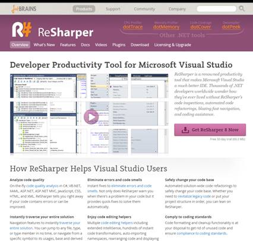

图 1:喷气大脑网站

点击右边的粉色按钮获取最新版本(目前为 8.2)。

继续下载最新的版本，当它到达你的电脑时，给自己冲一杯新鲜的咖啡。

### 运行安装程序

在我们实际启动安装程序之前，请确保没有运行 Visual Studio 的实例。R#适用于 Visual Studio 2005 以上版本，因此，如果您希望安装顺利进行，请确保退出您希望安装的所有版本。

实际上，我以前在运行 Visual Studio 的情况下安装过它，但是我必须在任何东西生效之前退出并重新加载，所以最好在您运行安装程序时终止任何正在运行的实例。

|  | 注意:当这本书发布的时候，v9 可能会成为主流，所以会有一个新的安装程序。这方面的细节在这本书的最后一章。 |

单击下载的文件后，会出现一个对话框，询问您是否要运行该文件。点击**是**，一两分钟后，你应该会收到如下提示:

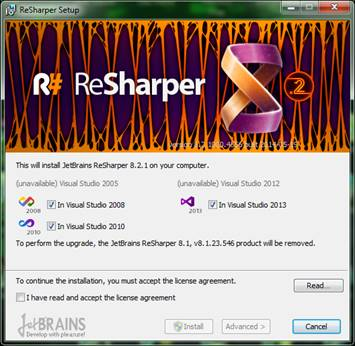

图 2:第一个安装程序屏幕

如您所见，这个副本已经收集了我安装的所有三个版本的 Visual Studio。确保您已阅读许可协议，并单击复选框以验证您已阅读该协议。接下来，点击**安装**或**高级**继续。

**安装**将带你通过选择明智的默认路线，并为你做大部分工作。高级路线将为您提供以下信息:

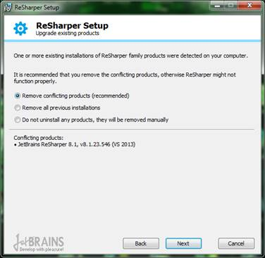

图 3:选择高级安装时的初始安装屏幕

在我的例子中，它选择了 8.1 版本，它说它想删除它。我们将允许它这样做(我稍后将重新安装 8.1，因为我没有 8.2 的完整许可证)；如果您正在执行升级，您肯定会想要这样做。

做出选择，点击**下一步**，你会看到以下内容:

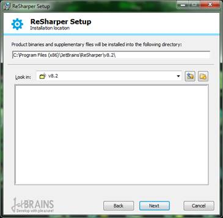

图 4:请求保存位置的安装程序屏幕

这只是通常的目录设置对话框；默认通常是最好的选择。

点击**下一步**，然后**安装，**一切自动继续。安装完成后，您将看到此对话框:


图 5:安装程序进度屏幕

安装完成后，您应该会看到以下窗口:


图 6:安装程序完成屏幕

点击**关闭**，此时，我们已经准备好启动 Visual Studio 并开始探索。

### R#第一眼

安装 R#后第一次启动 Visual Studio 时，启动时间可能会比正常时间长一点。别担心，R#可以在第一次运行时花一点时间来配置东西。也可能会要求您选择键盘方案；只需选择您想要使用的一组键盘快捷键，一切都会照常进行。

当您在 Visual Studio 菜单栏中看到 R#菜单时，您将知道 R#已准备好运行:

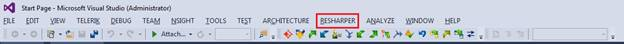

图 7:显示安装了 R#的 Visual Studio 菜单栏

让我们看看菜单上有什么。

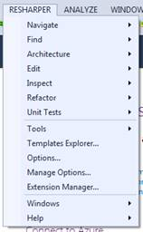

图 8:主 R# Visual Studio 菜单

这些是 R#用户可用的主要核心工具。但是，正如您将看到的那样，如果您开始将鼠标悬停在选项上，大多数选项都没有启用。

首次使用 ReSharper 时，您会看到一个产品注册对话框:


图 9:重新注册对话框

注册是一个必需的步骤，如果不这样做，您将无法使用该产品。如果您还没有准备好购买该产品，您可以从捷脑科网站申请 30 天的免费试用。

我为这本书使用的副本已经注册了，正如你在上图中看到的。注册、试用或其他操作完成后，您需要在此对话框中输入提供的详细信息才能继续。

因为 R#是一个编程工具，所以您需要加载一个活动项目来启用大多数菜单项。

如果我们去 **RESHARPER** > **求助** > **关于捷脑浆 ReSharper** :

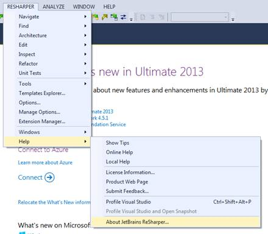

图 10:获取关于窗口的帮助菜单

我们至少应该能够获得关于信息:


图 11:关于窗口

### R#选项

沿着菜单路径 **RESHARPER** > **选项**，应该会看到如下:

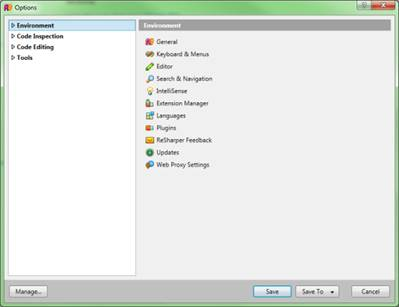

图 12: R#初始选项窗口

随着选项树的扩展，这可能会变得更大。有很多选项——事实上，如果你有更小的默认对话框，我可以保证你会想让对话框更大。当我使用可用的选项时，我通常可以拥有几乎与我的屏幕分辨率一样大的盒子！

如果您单击主树节点而不展开它们，您应该会在右侧窗格中看到基础选项列表。在图 12 中，您可以看到我已经准备好使用环境选项了。单击文本左侧的小三角形，展开环境选项树。您应该会看到以下内容:

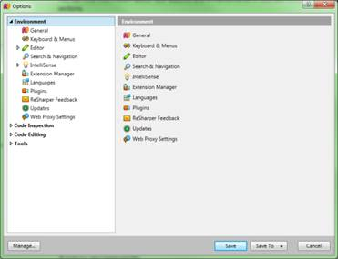

图 13:显示扩展的环境选项的选项对话框

点击**通用**，右侧面板会发生变化。此时，您很可能希望扩大盒子的大小。

“常规”选项，然后是“键盘”和“编辑器”选项，是您最有可能在第一个实例中想要更改的选项；其余部分我们将根据需要在本书的其余部分进行介绍。

从环境选项开始，您应该有如下内容:


图 14: R#常规选项

1.  **启动时显示提示**:这只是在你第一次运行 VS 的时候启用了 R#提示对话框，在你第一次开始使用插件的时候打开这个是值得的；你会学到很多 R#可以做到的事情。提示对话框也很聪明——它不会显示你已经使用的东西！
2.  **循环选择**:一开始这可能有点神秘——对我来说是这样。该选项实际上会影响弹出列表(类似于 VS 的内置智能感知弹出列表)。当您使用弹出列表并导航到它的末尾时，设置该选项将使您的选择光标跳回顶部；取消选中它将使选择光标停留在原来的位置。
3.  **显示托管内存**:这不仅会显示 R#的内存消耗，还会显示您可能已经安装并运行的所有其他加载项的内存消耗，以及 Visual Studio 本身使用的内存消耗。这将显示在 Visual Studio 状态栏的右下角。
4.  **应用图标**:这些选项可以让你选择你希望 R#整体使用的图标集。我一般只是让它自动开启，让 R#选择最合适的图标。如果你习惯了另一个使用不同图标集的类似工具，你可以强制 R#使用类似的图标。
5.  **源代码图标**:这些选项类似于一般的应用图标，但是它们不是特定于应用的，而是用于项目的源代码显示。当 R#向您展示一些东西时，您会看到它们出现在测试屏幕上和代码窗口的左边界。
6.  **缓存选项**:R #工作时，保存了大量的临时数据。内部代码映射、选项列表、警告等。您可以选择 R#保存这些缓存的位置。通常，您会想要使用系统文件夹，但是如果您决定将它们存储在项目文件夹中，那么您几乎肯定会想要确保您配置了一些东西，以便临时文件夹不会提交到您的代码存储库中。如果需要，清除缓存按钮允许您清除任何累积的临时数据。
7.  **使用 msbuild** :选择此选项会使 R#使用 Microsoft Build 引擎(和项目文件)来找出任何链接到项目的引用。相反的(未选择)是让 R#询问各种。NET 程序集，并以这种方式计算出引用映射。

转到键盘和菜单选项，如果您单击左侧树中的条目，您应该会看到如下内容:

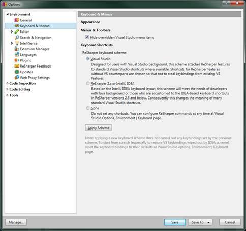

图 15: R#键盘和菜单选项

键盘和菜单选项非常简单。第一个选项隐藏 Visual Studio 中已经存在的项，这些项已经被 R#中可用的功能覆盖或取代。您可以取消选中此项，以便所有内容始终可见。如果您这样做，Visual Studio 可能会变得有点拥挤，因此强烈建议将其选中。

键盘快捷键的选项与您第一次运行插件时所做的决定相同。R#重新映射了许多现有的 Visual Studio 键盘按键，因此它们激活了插件中可用的增强功能。

默认情况下，有三组预定义的映射(以及创建自己的自定义绑定的能力)。该对话框中的选项与您第一次启动 R#时可能已经被询问过的选项相同。

如果您选择 **Visual Studio** 选项，那么您的键映射将会反映已经在 Visual Studio 中找到的键映射。 **ReSharper 2.x 或 IntelliJ** 会将您的键盘快捷键设置为与另一款 JetBrains 产品 IntelliJ IDEA 相同。**无**的最后一个选项不会设置任何键盘映射，您必须在其他地方使用自定义键盘选项从头开始设置您自己的所有绑定。

我发现最有效和有用的方法是选择 Visual Studio 映射，然后只定制我需要的几个不同的映射。

最后，我们将快速查看编辑器选项。

您会注意到编辑器选项菜单有两个子菜单；与前面的选项集一样，您需要单击小三角形来展开这些选项以查看树。您的选项对话框应该类似于图 16。


图 16:初始编辑器选项

如果您点击**编辑器外观**选项，您将获得许多初始设置，这些设置会影响 R#在主 VS 代码编辑窗口中的显示方式。该对话框应该如下所示:

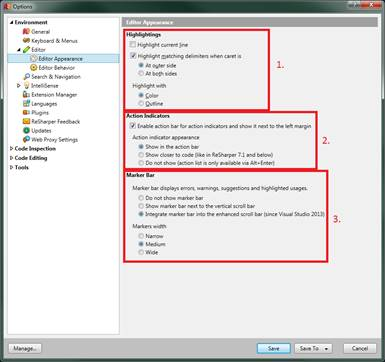

图 17: R#编辑器外观选项

第一组选项(图 17 中的第 1 部分)帮助您查看代码中的位置。

*   **突出显示当前行**只是突出显示您当前正在处理的行，这样当您在代码中快速上下滚动时，就很容易看到您的位置。
*   **高亮匹配分隔符**处理像括号和引号这样的事情。如果您将光标立即移动到其中一个标记的左侧或右侧，则闭合标记也将突出显示，使您能够轻松看到封闭块的闭合部分在哪里。外侧和两侧的子选项**允许您指定高亮显示的内容。**
*   **用**突出显示可以选择用什么突出显示。**颜色**使突出显示的块中的文本变为定义的颜色，而**轮廓**是选区周围纯色边框的更传统形式。

第二组处理 R#动作栏，我们很快就会遇到。动作栏是 R#向您展示源代码中它认为需要您注意的点的方式。操作栏位于编辑器窗口的左侧(行号和断点旁边)，并将显示小图标，允许您单击和选择影响当前位置代码的菜单。

*   **启用动作栏**选项打开和关闭动作栏。由于您在 R#中使用的大部分内容都是基于您在此栏中看到的内容，因此通常建议保持启用状态。
*   **动作栏外观**允许您选择 R#如何以及在哪里使用该栏来通知您代码问题。“在动作栏中显示”从 v8 开始，将灯泡或锤子图标放在代码左侧的动作栏中，“在更靠近代码的地方显示”是原始遗留(v8 之前)行为，其中图标显示在标记检查的代码上，可能会模糊下面的代码。最后，“不显示”意味着对于潜在的代码问题，根本不显示动作栏图标。

三个选项中的最后一个仅推荐给那些已经使用 R#相当长时间并且习惯于知道 R#将突出显示什么以及何时突出显示的用户，或者不希望在工作时收到通知，而是选择在保存之前仅使用菜单中的“代码清理”工具(或类似工具)的用户。

第三组选项处理编辑器窗口右侧的栏，称为标记栏。任何看过在右边空白处有许多彩色线条的 Visual Studio 屏幕截图或视频的人很可能已经看到了这一点。标记栏是 R#放置彩色破折号的地方，当悬停在上面时，它会告诉您 R#认为源代码中该位置可能存在的问题、错误或改进。

单击破折号将允许您导航到文档中的该位置，使您可以立即访问左栏操作栏中的选项，或者通过使用 **Alt** + **Enter** 激活的任何弹出窗口(下一节将详细介绍)。

与动作栏类似，您有三个单选选项，允许您显示与 Visual Studio 2013 标记栏集成的标记栏，或者作为现有标记栏旁边的单独标记栏显示，或者根本不显示。您几乎总是希望保持启用状态，因为这是单独获得您正在处理的源文件的当前状态的最佳方式。当我们开始研究 R#如何集成到 Visual Studio 编辑器中时，我将在下一章回到标记栏。

第 3 部分的最后一个选项允许您将栏的宽度设置为**窄**、**中**或**宽**。

如图 18 所示的编辑器行为选项允许您更改 R#的格式，并在键入时为您更改源代码。

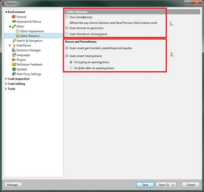

图 18: R#编辑器行为选项

第 1 节讨论基本的编辑行为。

**使用驼峰**当选择时，意味着某些键盘操作(如选项卡展开模板)将受到设置的不同影响。这对 ReSharper 的选择和导航工具的工作方式也有很大影响；快捷方式，如 **Ctrl** + **左/右**和扩展选择(您将在后面看到更多)将使用此设置来确定在选择部分文本时将标识符拆分为单个单词的位置。

对于不熟悉的人来说，CamelHumps 是一个术语，指的是用小写字母键入的文本，然后句子中每个单词的其余首字母大写，单词之间没有空格，例如:

```cs
          thisIsAnExampleVariableName

```

这是在 Java 和 JavaScript 世界中使用的一种常见的键入符号，通常用于 Visual Studio 下的 C#中的局部变量。一些开发人员有他们自己的打字和命名风格，所以如果你愿意，ReSharper 可以让你选择关闭它。

第一组中剩下的两个，分号上的**自动格式化和右大括号**上的**自动格式化，指的是当到达行、语句或当前块的末尾时，R#如何处理您的源代码格式化。**

在整个 R#插件中，有各种选项允许 R#为您格式化您的代码，其风格确保您始终对代码的格式化方式有一致的外观和感觉。如果在您键入代码时不断应用这些规则，您将很难正确键入，尤其是当您的代码在您周围发生变化时。

分号和大括号上的格式意味着 R#将等到遇到这些情况之一时，才会尝试应用您在 R#选项中设置的任何格式规则。等待分号通常意味着您已经到达当前正在键入的行的末尾，而等待大括号通常意味着等待结束一个封闭符，例如在创建包含数据的对象时使用默认属性语法。

我们暂时不去探索 R#选项——我可以写一整本书来探索它们的现状。我们将在本书的后续章节中介绍其他选项。同时，如果你想独自探索剩下的，我鼓励你这样做。

我使用 R#已经快六年了，甚至我仍然发现了我从来不知道它能做的事情。它确实是一个巨大的插件，在幕后隐藏着数量惊人的工具和选项，其中许多你可能永远不会发现。

所有 R#选项的主帮助页面可以在[这里](http://www.jetbrains.com/resharper/webhelp/Reference__Options.html)找到。

### 编辑器中的 ReSharper

结束我们对 R#的第一次观察，我们将看到它对您的常规代码编辑窗口所做的更改。

如前所述，R#在编辑器中添加了两个栏，左边是一个动作栏，右边是一个标记栏。那些使用 Visual Studio 2013 的人可能已经习惯了标记栏，因为 VS2013 现在有了自己的标记栏。那些仍在使用较旧版本的 Visual Studio 的人还没有被引入这个概念。

R#当前版本中的默认编辑器视图应该类似于图 19:


图 19:通用代码编辑器布局

如图 19 所示，我们的动作栏在左边，标记栏在右边。

在这段特殊的代码中，您可以看到我们有一个灯泡图标显示在动作栏内，因为我们的光标当前所在的位置可能存在警告情况。该警告是“未使用的导入”警告，并且 R#将未使用的导入着色为与已使用的不同的颜色，因此您可以立即看到哪些未使用。

R#还更进一步:不仅有效遮挡了代码，还提供了灯泡图标，也就是说你可以按 **Alt** + **Enter** 的主 R#键盘组合，去掉未使用的导入。您也可以点击灯泡，并使用弹出菜单选择您想要采取的行动。

您还会注意到，标记栏在文档顶部附近有四个黄色条，每个未使用的导入行对应一个黄色条，代码状态图标显示为黄色三角形。

这里提到的项目是您将在代码窗口中看到的常规更改。根据您的设置以及警告和其他问题的严重程度，您可能还会在源代码的不同部分看到不同颜色的曲线。

这些曲线的工作方式与原生 VS 曲线完全相同，除了标记栏，它们在不同的状态下呈现不同的颜色。像在 Visual Studio 中一样，红色通常表示错误，绿色表示改进，黄色表示警告，蓝色表示推荐做法。

稍后我们将更详细地介绍不同的颜色。现在，你可能注意到的其他事情是以前没有下划线的各种下划线项目。

例如，图 19 显示了一个 ASP.NET MVC 控制器，它来自于我在本书中帮助演示的快速而肮脏的黑客攻击。您会注意到视图函数和视图名称都带有下划线。

加下划线的内容在很大程度上取决于您正在查看的文件类型和项目类型。例如，在 CSS 文件中，您将获得与带下划线的颜色标签的颜色相匹配的下划线，在下划线上使用 R#键盘快捷键将允许您从编辑器中内置的颜色选择器中选择颜色。

同样，随着本书的深入，我们将更详细地介绍这些和其他内容。然而，为了结束这一章，我们需要看最后一件事。

### 键盘快捷键和 ReSharper 的主键

我已经提过几次了，但现在是时候让它多一点风头了。如果有一个你每天都会用到的按键组合你用 R#，那就是 **Alt** + **回车**。这一个组合就是 R#的主快捷键，无论何时何地你在你的源文件中，如果有一个动作可以执行，那么 **Alt** + **回车**就会使这个动作发生。

也可以快速连续按 **Alt** + **回车**两次(我们有些人称为双击)进行动作，选择默认动作。例如，回头看图 19，如果您将光标定位在一条阴影未使用的导入线上，并快速按下 **Alt** + **Enter** 两次，您将一次修复并删除所有四个警告。

然而，这里有一个警告需要注意。

要非常小心，尤其是当你第一次开始使用 R#的时候。在过去的六年里，有很多次我不得不准备好 Ctrl+Z 来撤销一些动作，只是因为我对 R#向我指出的事情反应太快，后来意识到我应该更加注意。

然而，事实仍然是，所有 R#的巨大功能的 90%是通过各种键盘菜单和快捷方式访问的。R#旨在将您的手放在开发人员大脑需要的地方，并且放在键盘上。

没有它的许多键盘可访问的工具和快捷方式，R#将远远没有它强大，它肯定不会帮助你提高生产力。我能给你的最好的建议就是学会捷径——好好学，早点学会。如果你这样做了，你会惊讶于你在很短的时间内开始取得的成就。