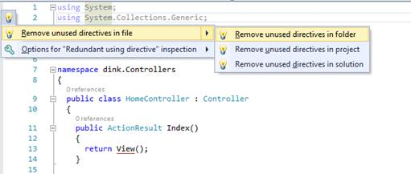
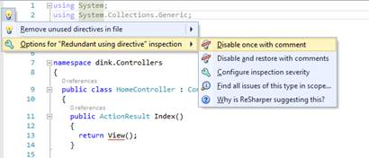
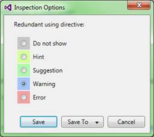
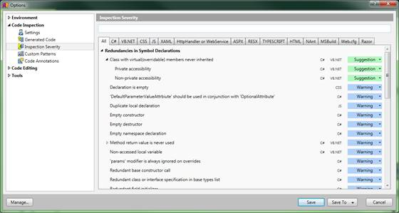
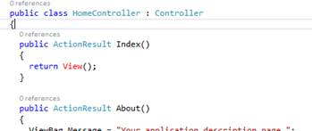
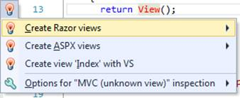
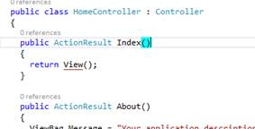
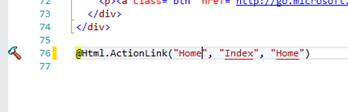

# 第 2 章作为程序员的助手的 ReSharper

正如您已经看到的，R#完美地集成到了您的一般开发人员的工作流中，但是到目前为止，我们还没有真正提到它在这个工作流中到底做了什么或者实际上能做什么。

回顾上一章中的图 19，如果我将光标放在一条阴影的导入线上，然后按 **Alt** + **回车**并展开菜单，我应该会看到以下内容:

图 20:扩展的未使用的导入操作菜单

只需选择第一个菜单上的第一个菜单选项，将只删除未使用的导入行，但正如您可以清楚地看到的，还有一个子菜单，允许您在同一文件夹中的所有文件、整个项目甚至整个解决方案中进行此更改。在这种情况下，我们使用移除动作。许多操作仅适用于它们所在的直接行，并且只有选定数量的操作能够影响整个解决方案。整个过程在 ReSharper 文档中被称为*范围内的固定*。

在[喷气大脑网站](https://www.jetbrains.com/resharper/webhelp/Code_Analysis__Fix_in_Scope.html)上有这些范围内修复菜单的可用操作列表。

(注意:我们示例中的列表是针对版本 8 的；一旦版本 9 发布，可能会有更多。)

如果您单击 **Alt** + **Enter** ，然后按几下箭头键，您可能会在大约三次按键中消除每个未使用的导入警告的数百个文件的解决方案。

您还可以配置 R#如何响应未使用的导入警告。如果我们以同样的方式扩展第二个选项，我们应该会看到如下内容:

图 21:未使用的导入操作菜单检查选项

如果您选择**禁用一次注释**，有问题的行将被 R#识别的特殊格式的注释所包装。此注释将防止 R#将该行标记为要解决的问题，但这仅适用于放置注释的文件，不会影响解决方案其他部分对同一问题的检查。

**禁用和带注释恢复**选项允许您启用和禁用通知，例如，如果您只想暂时禁用通知。这使您不必手动删除第一个选项中的行)。

如果选择**配置检查严重度**，会出现如下对话框:

图 22:检查严重性选项

此对话框允许您永久设置全局选项，如 R#如何通知您正在查看的特定案例。例如，如果你很乐意在你的源代码中留下未使用的导入，那么你可以选择**不显示；**您不会再收到关于此特定案例的通知。如果你将某个东西标记为**错误**，那么你会得到红色的曲线下划线，这是在你的源代码中标记其他错误时常见的。

**提示**和**建议**是代码中可能改进的绿色下划线，但是如果您选择忽略它们，这些不会对操作产生任何影响。最后，**警告**在 ReSharper 错误列表中将该问题显示为警告。

你如何选择标记一个问题完全取决于个人喜好。然而，如果你是一个团队领导，这可能是你想要采取的第一步，迫使你的团队采用一套给定的标准(稍后将详细介绍)。

菜单上的最后两个选项是**在**和**范围内查找该类型的所有问题为什么 R#建议这样做？**第一个允许您进行常规搜索操作，就像您按下 **Ctrl + H** 一样，但是您实际上只搜索您当前正在检查的问题，而不是搜索短语或模式。

既然 R#已经给了你一键解决所有问题的能力，为什么还要给你这个选项呢？正如我已经指出的，例如，在某些情况下，您知道将要导入一个库，但是现在您只想将 import 语句留在那里。在这种情况下，您可能希望找到一些问题，将它们包装在注释中，然后返回并运行选项来更正任何其他此类警告。

通过这样做，你可以很容易地找到那些你想单独处理的事情，然后你就可以对其余的事情进行全局修复。请记住，R#的唯一目的是让你更有效率，即使这感觉像是次要的事情，但它可能会(像许多其他 R#选项一样)为你节省更多你意识到的手动工作。

最后一个选项，**为什么 R#会提出这个建议？**，只是对开发人员的一个有益的帮助，旨在帮助决策过程。在我们的示例中，它只是一个未使用的导入。然而，这可能是开发人员没有太多经验的其他问题。

如果选择了此选项，您的默认浏览器将会打开，并带您进入 JetBrains 网站上的解释页面，描述所选问题的后果，如下所示:

图 23:喷气大脑网站上的问题描述

对于我们未使用的进口问题，真的没什么好说的，但是其他检查有更多的内部信息，当你开始更多地使用 R#时，你可能会对你得到的一些提示感到惊讶。

### 重访检验严重度选项

如果您记得当我向您展示检查严重性选项时(图 22)，我提到作为团队领导，这可能是您为团队项目设置一些检查选项的第一个切入点。

好吧，如果你像我一样，当你第一次看到这个的时候，你可能会想“我喜欢这个想法，但是要建立它需要很多工作。”我最初这么想是因为我想我需要为我感兴趣的每个检查找到选项，然后通过这个对话框对每个选项做出决定。

你会很高兴知道你根本不需要这么做。如果您像我们之前一样打开 R#选项，然后转到**代码检查** > **检查严重性**，您会发现 R#了解的每一项检查都唾手可得。

您可以在右侧窗格中展开给定文件类型的问题树，并配置该问题如何以与您在单个对话框中完全相同的方式响应 Visual Studio。

图 24: R#检验严重性选项

如果仔细查看图 24，您还会注意到在选项对话框的底部有两个保存按钮。第一个只是一个常规的保存按钮，将您选择的所有选项保存为您安装的 R#的默认选项。但是，“保存到”按钮有更多选项。

如果点击**保存到**，应该会看到以下三个选项:

图 25:保存到选项对话框的选项

选择第一个选项会将选项直接保存到活动项目中。这允许您为不同的项目设置不同的设置，如果 R#在您加载项目时找到这些设置，它将使用它找到的内容来覆盖该选项的当前设置。

第二个选项将文件保存在现有解决方案文件旁边的解决方案目录中。这里的目的是将该文件保存在项目的源存储库中，以便所有团队成员自动拥有相同的设置。

最后一个选项**这台电脑**将文件保存在 ReSharper 通常保存其设置的默认位置；然后可以使用**管理选项**导出这些设置(可在主菜单上找到)。通常，导出选项允许您花时间设置设置集合，然后将它们归档以备将来使用。一旦这样做了，您就可以在开始一个新项目时重新加载它们，然后将一个副本与该项目一起保存，这意味着您不需要在下一行中再次查看它们。

保存到不同存储的选项正是允许项目负责人强制执行一组给定标准的东西，让他们可以选择保持对生成代码的控制。也请记住，当您保存这些选项集时，您保存的不仅仅是代码严重性设置；您正在 ReSharper 中保存从默认值更改的任何选项。

### 【ReSharper 可以为我做哪些检查？

为了结束本章，我将向您展示一些您可能经常看到的不同代码检查。制作和描述 R#要寻找的每一件事的完整列表远远超出了这本书的范围——R #可以关注的事情太多了，我可以很容易地填满这本书的剩余部分，很可能还有另外两件！

您已经看到了最常见的一个，未使用的导入；这很容易理解。如果你做了很多 ASP.NET MVC 编程，你可能会经常看到的另一个问题是缺少视图检查:

图 26:缺少 Razor 视图的 ASP.NET MVC 控制器

在这种情况下，您可以看到，它实际上是用红色显示关键字，而不是用曲线给它加下划线。

|  | 注意:在图 26 中，可以看到一行写着“0 引用”。这一行不是 ReSharper 的一部分，而是 Visual Studio 2013 Ultimate 特性(称为 CodeLens)的一部分。 |

尽管如此，这一切仍然是一样的。如果将光标放在单词上，按下默认的 R#键( **Alt+Enter** ，应该会得到如下菜单:

图 27:缺少 MVC 剃刀视图的检查菜单

如果您使用箭头键扩展各种选项，您将会看到创建部分、创建具有布局的视图以及所有您习惯的常规选项的简单选项。

您也可以选择**用 VS** 创建索引来打开正常的 Visual Studio 对话框，并且您有与之前看到的相同的通知选项。

您还会看到，在这种情况下，菜单中的灯泡是红色的。这表明这是一个严重的错误，如果不加以处理，可能会导致应用程序在部署时崩溃。

如果您继续通过创建视图来解决这个问题，然后返回到您的代码，您可能会注意到它现在看起来略有不同:

图 28:修复视图问题后的 MVC 控制器代码

你现在会看到你有一个坚实的红线。不过别担心，这不是一件坏事；您现在看到的是 ReSharper 的视图导航功能，它允许您以最小的努力快速直接导航到控制器的视图。

R#为您做的另一件事是提供额外的导航功能。如果将光标放在 **View** 关键字上，但这次不是按 Alt+Enter，而是按 **F12** (或按住 **Ctrl** 并用鼠标点击)，应该会得到如下菜单:

图 29:MVC 视图关键字上的 R# F12 菜单

如果您在第一个选项中按下**进入**，您将直接进入您的剃刀视图代码。如果您选择第二个，那么您将在对象浏览器中位于。NET 框架。

这种实线下划线也可以在其他地方找到。例如，如果我们看一下我们的 Razor 视图，特别是我们生成链接的地方，我们可能会看到类似这样的内容:

图 30:剃刀视图中的 R#实线下划线

当你移动到这个位置时，你会立即看到左边的栏里有一个菜单图标。和以前一样，左边的图标告诉你有一个可用的 Alt+Enter 菜单；但是，如果您也将光标放在一个带下划线的选项上，并按下 **F12** ，您也将直接找到该链接所指的控制器。

在你看到实线下划线的地方，你可能也会有操作选择。这些选择范围从导航辅助工具到您可能通常想要执行的过程，例如将一个长字符串拆分为两个独立的字符串。这里的关键是，如果它是实心的，而不是弯曲的，那么它不太可能是一个错误；如果它是一条弯曲的线，那么根据它的颜色，它要么是通知、提示、警告，要么是错误。

为了给你一个绿色曲线的例子，下图显示了使用 ASP.NET MVC 5 web 应用程序默认模板生成的默认帐户控制器的代码片段:

图 31:ASP.NET MVC 帐户控制器的代码片段

您会看到，在所示的两种情况下，public 关键字用绿色下划线标出；这意味着你看到的要么是一个暗示，要么是一个建议的改进。

如果您将光标放在上面并按下默认的 R#键(Alt+Enter)，那么您应该会看到以下菜单:

图 32:公共关键字的 R#建议菜单

如果您在打开此菜单之前将鼠标悬停在该选项上，您会看到 R#告诉您可以将构造函数设为私有，因此菜单反映了这一点，并为您可能想要采取的操作提供了适当的选择。

在这种情况下，R#已经分析了您的项目源代码，并意识到构造函数从未从任何外部代码中调用。这意味着您可以将该方法封闭起来，甚至一起移除。这样的检查有助于通过移除可能永远不会被使用的公共钩子点，或者识别可能超出需求的代码，使面向对象的代码变得更好，最终导致更简单的代码库。

R#不仅能让你更有效率，而且过一段时间后，你还会发现自己开始发现这些好的实践，并积极地删除它们——或者甚至一开始就不添加它们。本质上，R#实际上训练你成为一个更好的开发人员。

就这样——这是 R#的 100 英尺概观。从这里开始，我们将开始深入研究 Visual Studio 工具栏中提供的各种菜单，并带您参观可供您使用的特定 R#工具。