# 第五章代码生成

R#有一件事做得非常好:它生成代码。从代码片段到模板，从包装到转换，R#的工具是最先添加到产品中的东西，并且一直延续到今天，成为其突出的特性之一。

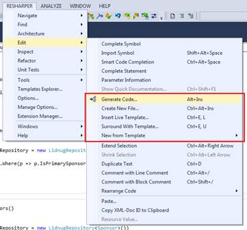

图 76:编辑菜单上的 R#代码生成特性

在我们的“编辑”菜单中的第二组选项中，您将看到 R#提供的几个选项，用于帮助您完成为您和您的团队构建的产品编写应用程序代码的日常任务。

#### 那么 R#到底能生成什么呢？

让我们从**生成代码**选项(Alt+Ins)开始。这个选项特别适合开发人员经常做的一个任务:为对象创建类。

图 77: R#生成代码菜单

如果您将光标放在源文件中的任何地方，然后激活“生成代码”弹出菜单，您将看到类似于图 77 的内容。然而，如果我们创建一个空类，然后依次检查选项，我们可以更好地感受每个选项的作用。在代码中创建一个空类，如下所示:

图 78:创建空类来演示创建代码函数

现在将光标放在空类内，按 **Alt+Ins** (或使用菜单)，再次弹出**生成代码**菜单。现在，您应该看到弹出窗口上的可用选项比上次多了一些。

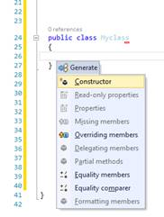

图 79:在空类定义中生成代码弹出菜单

四个可用选项是 R#认为对创建空类很重要的任务。如果选择**构造函数**，应该会得到一个默认的构造函数:

图 80:由生成代码创建的空构造函数

您的光标将自动定位，因此您可以立即开始键入您的参数列表。对于大多数人来说，这可能不是一个突破性的功能，但是当你考虑到你只用了大约两个键就做到了这一点时，长期使用真的会积累一张图片，显示它可以节省你多少分钟，甚至几个小时。

回头看图 79，你会看到**覆盖成员**、**平等成员**和**平等比较器**被列为选项。您的基类中任何可以被覆盖或设置为进行`.Equals`类特定调用的东西都可以用这三个调用来创建和注入。

例如，如果您选择**覆盖成员**，您将获得如下所示的弹出菜单:

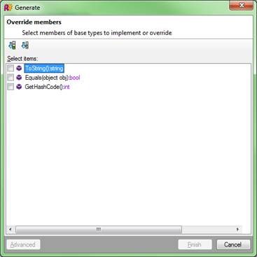

图 81:覆盖成员对话框

类中任何可以被覆盖的东西都会在这里列出。在这种情况下，我只有一个简单的类，所以只有将军。NET 基础调用是可用的。如果我选择全部三个并点击**完成**，我得到如下代码:

图 82:由 R#的覆盖成员选项生成的代码

|  | 注意:你现在可能已经注意到，在一些截图中，一些代码的颜色已经褪色。这是 R#的另一个有用的代码诊断工具，可以帮助您了解您的代码覆盖率有多好。在图 82 中，所有三个覆盖都消失了，这仅仅是因为它们还没有被定制，所以没有为代码库提供任何价值。我们将在后面的章节中详细介绍这一点。 |

正如你所看到的，你现在有一个`ToString`、`Equals`和`GetHashCode`准备填写我们自己的自定义代码。一旦我们把代码加入其中。NET 将在需要的时间和地点调用这些方法。

您可能已经注意到，我已经从上到下浏览了代码生成菜单，就像我在本书的大多数其他菜单中所做的那样。这可能无法最好地展示 ReSharper 的代码生成功能，因为我已经在类中添加了代码，而这些代码最终会创建冗余代码。在一个真实的项目中，你可能会希望根据项目的需要使用其中的一个。对于 ReSharper 的初级用户来说，我已经用我必须保持简单的方式做了一些事情。随着您对该产品的经验的增加，值得记住的是，许多工具确实有重复的功能，有时在没有做出明智的决定的情况下盲目激活东西有时会产生比节省更多的工作。

作为最后的演示，将光标放回到类定义中，并再次激活**生成代码**选项。

这一次，选择**相等成员**，您应该会看到，由于之前的覆盖成员选项，它会要求您确认是否应该更改已经生成的相等存根:

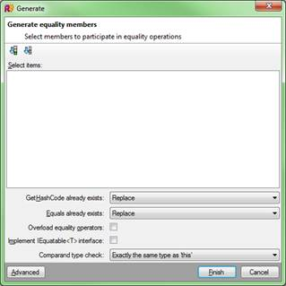

图 83:确认您将要替换现有的被覆盖的方法

在这种情况下，我选择替换它们，因为我没有在方法中放入任何自定义代码。如果我有，那么我可以跳过实现，或者得到一些叫做“并行”的东西这将会以不会对我现有的实现造成任何问题的方式注入代码，同时允许我看到将要生成的代码。

如果我们现在再看一遍代码，您会看到创建了一些稍微多一点的样板代码供您使用:

图 84:运行平等成员后的空类代码

实现**相等比较器**选项会截断使用 IEqualityComparer 接口所需的代码。这进一步允许您在代码中创建和支持动态比较接口，使您能够将比较委托给外部类，同时仍然保留控制结果的能力。

像许多其他 R#选项一样，菜单的其余部分是特定于上下文的。首先向类中添加一个属性，如下所示:

图 85:添加了属性的虚拟类

如果您将光标放在属性上并按下 **Alt+Ins** ，还有四个选项可用:

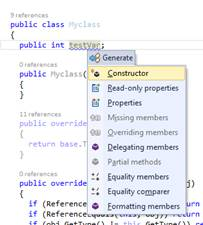

图 86:生成代码菜单，提供基于属性的选项

选择**只读属性**选项会出现以下对话框，询问您希望为类中的哪些属性生成只读存根:

图 87: R#只读属性对话框

在这个例子中，我选择了 **testVar** 并点击了 **Finish** ，以下面的代码结束:

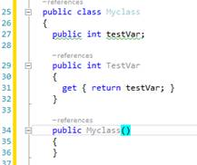

图 88:显示 testVar 只读属性的类

如果我愿意，我现在可以在带绿色下划线的公共访问器或类变量上使用 Alt+Enter，将访问权限更改为受保护、内部或私有，并强制对`Var`的所有读取通过只读访问器进入类。

**属性**选项做了类似的事情，但是它在过程中创建了完整的读/写属性访问器，而不是我们刚刚看到的只读属性访问器。

剩下的选项**委托成员**、**缺失成员**和**分部类**都用于为接口契约、现有分部类的扩展以及创建用于委托对给定属性或变量的访问的方法存根等生成代码存根。

仅这一个菜单选项就可以将您每天的按键次数减少大约 100 倍，我们甚至还没有开始使用代码和代码片段模板。

这就把我们带到了我们旅程的下一站，创建新文件。

图 89:创建新文件

与这些菜单不同，Ctrl+Alt+Ins 不区分上下文。这意味着您可以在任何地方按这些键，从代码编辑器到高亮显示的解决方案树根。

那么，与标准的 Visual Studio“添加新...”对话框相比，使用它有什么优势呢？首先，菜单的实际内容是上下文相关的。如果我将自己定位在一个 MVC 项目中，并按下 Ctrl+Alt+Ins，我会得到这个弹出菜单:

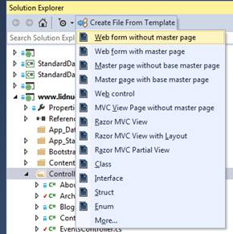

图 90:为一个 MVC 项目从模板创建文件弹出菜单

然而，如果我把自己放在一个标准类库中，我只会得到这个:

图 91:为类库项目从模板创建文件弹出菜单

不同的项目类型在菜单上显示不同的选项，正如您可能已经猜到的，所有这些都可以在 R#选项中自定义。如果你在 Visual Studio 中点击 R#主菜单，在第二部分你会看到一个标记为**模板浏览器**的选项。

图 92: R#模板浏览器菜单

如果我们点击这个选项，我们会得到一个相当大的 Visual Studio 编辑器窗口，名为模板资源管理器，其中有三个选项卡。我们感兴趣的标签是**文件模板**标签。

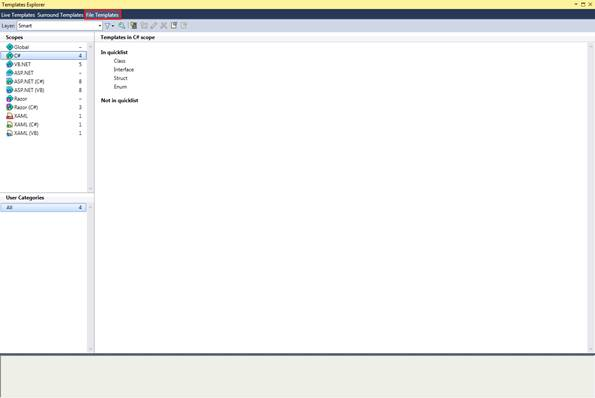

图 93: R#文件模板编辑器

立即，您可以在右侧窗格中看到我们有【快速列表中的 T0】和【快速列表中的 T2】选项，正如您可能猜到的，当我们按 Ctrl+Alt+Ins 插入文件时，这些选项决定了该条目是否会出现在我们的弹出菜单中。

如果我们看一下对话框的右侧，我们可以看到各种场景，如全局、C#和 ASP.NET。这些方案控制不同列表使用的项目类型。如果您沿着列表往下走，您应该会在左侧窗格中看到我之前演示的每个组。

我将离开模板资源管理器，但我们很快会回来。现在，点击模板编辑器右上角的**关闭**图标，让我们回到代码编辑功能。

如果你从**新建文件**菜单中选择一个要插入的文件，你会得到通常的体验:R#用红色边框突出显示模板中的一些区域，要求你填写一些东西，比如变量名或布局名。

这个菜单的方便之处在于只需按一个键，而且快捷简单。Visual Studio“添加新菜单和对话框”通常要求您阅读菜单选项，以确保您想要的项目在那里，如果没有，则需要进入完整的对话框并查看已安装的模板。

再一次，R#使一个已经存在的过程更快更容易激活，并且不需要你的鼠标。

实时模板(通过**编辑**菜单中的**插入实时模板**或 **Ctrl+E** 后跟一个 **L** 来访问)类似于插入文件。这里的不同之处在于，代码片段直接插入到您的源代码中光标所在的位置。razor 视图文件中空白行上的默认菜单如下所示:

图 94: R#插入实时模板菜单

和“文件”菜单一样，它会根据文件类型和预期使用场景而变化。

第二组的最后一个选项是**用模板包围** (Ctrl+E 后跟 U)。像它的两个前身一样，它生成代码，但它不是线性代码生成，而是通过包装选定的区域来工作。

它在编辑 HTML 和 Razor 代码时非常有用，这样，如果您在 HTML 源中选择了一个文本区域，就可以很容易地在它周围放置一个新标签。例如，如果我们有一个没有 P 标签的段落，我们可以选择文本并激活**用模板包围**，选择**标签**，并键入标签名称。该工具的其他用途包括添加编译器条件(如#if 块)和语言结构(如 try/catch 和循环结构)。

当然，这不一定只是一个标签；它可以是括号、大括号或任何其他通常具有某种开始和结束分隔符的东西。

这个工具最棒的地方是，因为这是一个非常常见的操作，所以 R#经常会在左边距操作栏上添加**环绕……**快速菜单图标，这意味着你经常可以直接在环绕模板功能上点击 Alt+Enter。

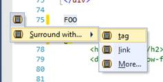

图 95:带 Alt+Enter 菜单的 R#环绕

正如您在几页前看到的，ReSharper 有一个模板编辑器。该编辑器允许您自定义刚刚看到的所有内容，并使您自己的自定义文件、包装和实时模板可供您自己使用。

有数百种可能的组合，甚至有更多的宏可以使用。不幸的是，这本书没有空间让我一一列举，所以我们将为这三个场景中的每一个制作一个快速有用的模板，剩下的就留给你去探索了。

让我们从一个实时代码模板开始。从 R#主菜单中打开模板资源管理器，并确保选择了实时模板标签。

我们将制作一个模板来帮助我们在一个 ASP.NET MVC 项目中使用 Razor 创建 HTML 表单，所以在活动模板的右侧列表中点击 **Razor** 。您应该会看到如下内容:

图 96: Visual studio 显示了 Razor 的实时模板编辑器

在模板列表上方的工具栏上，您可以看到蓝色条旁边的黑色和灰色复选框。选中此框可创建新模板；您的显示器应该更改为如下所示的样子(请记住，我的窗口已经对接好了):

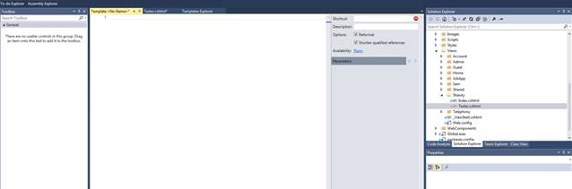

图 97:显示新模板编辑器的 Visual studio

在中心的主要部分，我们有一个普通的编辑器，它的功能与 Visual Studio 中的任何其他编辑器一样。在这个编辑器的右边，我们有模板的参数。

*   **快捷方式**:这是我们希望 R#在提供给我们完成模板之前识别的文本。
*   **描述**:这是你给模板的人类可读的描述。当引用它时，这将显示在工具提示中。
*   **重新格式化**:有了这个选项，一旦扩展完成，R#会重新格式化你的代码，以匹配你当前的编码风格。
*   **缩短合格参考文献**:这指示 R#将模板中的任何参考文献做得尽可能短。例如，如果您有 MyLib。模板中的函数，并且您已经有了 MyLib。名称空间在你的`using`列表中，R#会自动将引用改为只是`Function`。
*   **可用性**:这将打开一个对话框，允许你选择你的模板将出现的确切位置，默认情况下，这将显示“剃刀”，因为我们从左手列表中选择了剃刀。然而，你可以走得更远，不仅仅是“剃刀”，你可以选择许多选项，让你选择如何以及何时你的实时模板将是可用的。

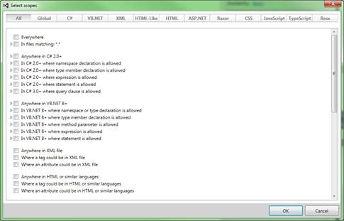

图 98:选择模板允许位置的范围选择对话框

最后，我们有我们的**参数**部分。当您向模板中添加可扩展参数时，它们会出现在这里，并允许您选择 R#的许多宏中的哪一个应用于它们。

通过在参数名称的两侧用$符号括起来，可以将参数引入到模板中。例如，如果您想要模板中的参数 *`Name`* ，您可以使用`$*Name*$`来指定它。这又会自动将其添加到编辑器的参数部分，允许您为其分配一个 ReSharper 宏。

一旦你声明了一个参数，你可以任意多次使用它。无论扩展到哪个值，它都将在您声明使用参数的模板中的任何地方使用。

对于我们的实时模板，我们想要扩展一个在 Razor 中创建表单时使用的典型`using`外壳，因此我们从将以下代码放入模板编辑器开始:

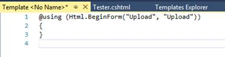

图 Razor 实时模板的模板浏览器中的初始代码

在图 99 的代码中，我们希望将`Upload`字符串替换为允许用户填写控制器和动作名称的属性，在{ }部分，我们需要告诉 R#结束在哪里。

有一些特殊的参数标签是 R#预留的，你可以在下面看到其中一个，`$END$`。

为了添加所需的参数，我们将代码更改如下:

图 100:添加了参数的图 99 中的模板代码

从图 99 中需要注意的一点是`END`模板并没有在模板的末尾。

这是因为`END`标记了一旦扩展完成，您希望光标放置在模板中的点。在这种情况下，我们希望放置光标，以便最终用户可以继续键入表单的内部代码。

将参数输入到实时模板中并填写其他详细信息后，您应该会看到编辑器的右侧如下所示:

图 101:我们新的 Razor 实时模板的设置

此时，我们现在可以点击蓝色**选择宏**链接，允许我们选择一个合适的宏，R#将在为我们的参数赋值时使用。

您还会注意到，每个参数都有一个“可编辑”的勾选框；如果您选择了一个合适的宏，您可以让 R#自动填充它，而不允许最终用户实际更改任何内容。然而在实践中，我从未见过任何使用这个的模板。

点击**动作**的宏条目，应该会看到以下内容:

图 102: R#选择宏对话框

选择**ASP.NET MVC 动作**作为我们的动作参数，然后对 controller 重复同样的步骤，除了这次选择合适的 Controller 宏。

请随意探索其他可用的宏类型，您会很快发现您可以做任何事情，从指定硬编码的选项列表，一直到在机器上的每个程序集中搜索可能的名称空间匹配。

如果现在点击**保存**(或按 Ctrl+S)保存模板，应该可以立即开始使用。

打开或创建一个剃刀视图，并输入**开始通知** *。*如果暂停，您应该会看到 R#显示一个工具提示，邀请您使用 Tab 键完成模板扩展。

如果您接着按 Tab 键，您应该会看到您的模板出现，并且您的光标被放置在允许您为表单选择动作和控制器的位置。

图 103: Visual Studio 显示了我们正在进行的模板扩展

一个小小的警告:当你定义你的模板名称时(特别是像 Razor 这样的东西)，不要试图在模板名称前面加一个 at 符号(@)。能够键入和扩展@ BeginForm 会很好，但是 Razor 解释器会试图理解它，阻止 R#能够管理它。最糟糕的是，你通常不会马上意识到为什么你的模板扩展不起作用。我第一次遇到这种情况时，我挠了好几个小时的头。

在下一个例子中，我们将创建一个环绕/包裹模板，它将帮助我们创建包裹在`<li> </li>`中的锚点标签(例如，导航菜单中通常使用的布局类型)。

创建环绕模板的过程与实时代码模板的过程几乎相同，除了一个关键的区别。您可以使用`$SELECTION$`来标记文档中要包装的代码位，而不是使用`$END$`来标记模板扩展的结束。

与实时模板不同，您会发现在您的设置部分，您所拥有的只是一个描述。这是有意义的，因为没有快捷代码来触发这个过程。相反，该选项将从菜单或模板选择器中显示，具体取决于您是否决定将模板添加到快速列表中。

对于环绕声示例，在模板资源管理器的“环绕声模板”选项卡中创建新模板，然后输入以下代码和设置:

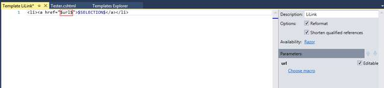

图 104:我们的示例环绕模板

如图 104 所示，我将 URL 参数保留为**选择宏**。这是有意的，将允许模板的最终用户在占位符中键入他们自己选择的内容。

一旦我们保存了模板，我们就使用模板资源管理器来移动新的模板条目，以便它出现在我们的快速列表中。

图 105:将我们的环绕模板移动到快速列表

如果我们切换回 Razor 视图并尝试，我们应该会看到以下内容:

图 106:我们新的环绕模板正在运行

此时，我将把创建新文件模板的探索留给读者；这个过程和另外两个完全一样。

关于活动模板，最后要知道的是剩余的预定义模板变量。

你已经见过`END`和`SELECTION`；还有两个是`SELSTART`和`SELEND`的形式。剩下的两个变量用于标记模板文本部分的开始和结束，一旦模板扩展完成，您希望预先选择该部分。

这里的想法是，您可以在模板中放置一些默认文本(例如异常处理程序中的`Console.Writeline`语句)，但是您可以预先选择它，以便一旦最终用户开始键入任何新内容，它就会被自动替换。

“编辑”菜单上的其余条目大多与简单的光标移动有关。

**扩展选择**和**收缩选择**处理智能更改选择大小，并将尝试扩展以覆盖单词和变量名，同时考虑下划线、编码风格和空白等因素。

**复制文本** (Ctrl+D)选择后会复制当前选中的文本；如果所选内容包含回车符，则新文本将放在下一行。

这对于以相对速度快速复制具有小修改的类似行非常有用。

**用行注释进行注释**和**用块注释进行注释**也完全按照名称所建议的那样操作——它们选择一个文本项，或者将整个多行选择包含在一个块中，或者只需将//放在第一行的前面，将该行标记为注释。

“重新排列代码”子菜单旨在允许您在文件中移动整个代码块，例如，帮助重新排序函数调用或属性声明。

最后，我们有**粘贴**选项，它打开一个剪贴板历史窗口，包含项目中最近使用的粘贴，允许您潜在地返回到以前的片段并再次粘贴。该选项后面是**复制 XML 文档标识…** ，它将所选代码成员的 XML 文档节点标识复制到剪贴板。最后一个选项**复制** **资源值，**会将与所选资源文件标识符相关联的值复制到剪贴板，准备粘贴到其他地方。