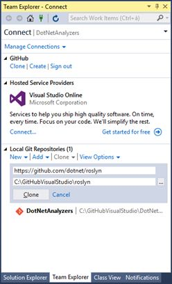
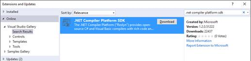

# 一、Roslyn 项目：.NET 编译器平台

随着 Visual Studio 2015 和的最新发布。NET 框架 4.6，微软也发布了 1.0 版本的。NET 编译器平台，前身是 Project Roslyn，它为开源的 C#和 Visual Basic 编译器提供了丰富的代码分析 API。那个。NET 编译平台在新的。NET 生态系统，并在许多方面增强了 Visual Studio 2015 的能力。为了更好地理解。NET Compiler Platform 是什么以及为什么它如此重要，您需要一些关于最新版本中编译器的新特性的解释。本章介绍了 Roslyn，为您在开始编写代码之前理解整本书中描述的更复杂的概念奠定了基础。

|  | 注意:除了特别声明的地方，本书描述的所有主题都适用于 Visual Basic 和 C#。 |

在过去的几年里，微软一直忙于完全在托管环境中重写 C#和 Visual Basic 编译器。NET 代码。除了被重写之外，这两个编译器都公开了丰富的代码分析 API，您可以利用它们来构建开发人员工具，以执行与代码相关的任务，并且与 Visual Studio 代码编辑器在您键入时用来检测问题和错误的工具相同。通过公开 API，编译器被视为一个平台(也称为编译器即服务)；这打开了无限多可能的开发场景，特别是关于代码分析和代码生成。

此外，微软已经发布了新的 Visual Basic 和 C#编译器作为开源项目，这意味着您可以下载源代码，调查它，并通过发送您的代码、反馈或建议进行协作。这些重写的、公开丰富代码分析 API 的开源编译器使用这个名字。NET 编译器平台。

|  | 注:本书使用了”。NET 编译器平台”和“Roslyn”可以互换名称。第一个名字是产品发布时的名称，但 Roslyn 别名多年来一直(现在仍然)广泛用于指代该项目。事实上，世界各地的许多开发人员仍然更喜欢使用 Roslyn 别名，而不是官方名称。 |

至于微软的所有其他开源项目。NET Compiler Platform 托管在 [GitHub](https://github.com) 上，这是一个非常受欢迎的网站，允许共享代码并提供协作工具，包括基于 Git 引擎的源代码控制，以及接受开发者社区贡献的工具。[官方。GitHub 上的 NET 编译器平台主页](https://github.com/dotnet/roslyn)包含编译器及其公开的 API 的[完整源代码](http://source.roslyn.io/)、文档、API 引用和代码示例。值得一提的是，项目主页还包含了 C# 6.0 和 Visual Basic 14 中[新语言特性](https://github.com/dotnet/roslyn/wiki/Languages-features-in-C%23-6-and-VB-14)的文档。一些新语言功能的实现得益于。NET 编译器平台。

Visual Basic 和 C#编译器已经用托管代码重写，现在公开了 API，但是从实用的角度来看，这并没有真正改变您使用编程语言和编写代码的方式。然而，在幕后，Visual Studio 2015 中的代码编辑器强烈依赖。NET 编译器平台。例如，在您键入时检测问题的实时代码分析，您过去已经知道，现在是建立在 Roslyn 应用编程接口的基础上的。此外，Visual Basic 现在支持代码重构，C#具有改进的重构体验；两者都是在。NET 编译器平台。我会在[第二章](2.html#_Chapter_2_Coding)中详细描述这些改进，所以如果此时有什么不清楚的地方，不要害怕。

您使用 Roslyn 应用编程接口为开发人员构建工具。更具体地说，使用 Roslyn 原料药，您可以:

*   编写和共享集成到 Visual Studio 2015 代码编辑器中的自定义、特定于域的代码分析规则。这样，您可以用自己的规则扩展实时代码分析引擎。这意味着您可以编写诊断和代码修复(称为**分析器**)，并为您的 API 或特定编程模式进行代码重构，Visual Studio 代码编辑器将在您键入时检测代码问题，弯曲需要注意的代码，并建议适当的修复。编写诊断和代码修复在[第 4 章](4.html#_Chapter_4_Writing)中讨论，编写代码重构在[第 5 章](5.html#_Chapter_5_Writing)中讨论。
*   实现代码生成，发出 IL 代码，并在内部执行其他与代码相关的任务。NET 应用程序。
*   构建在 Visual Studio 之外运行的独立工具，但是可以利用 MSBuild 工作区并利用 Visual Basic 和 C#编译器来执行与代码相关的任务。
*   使用读取-评估-打印循环创建一个交互式的、解释的 C#或 Visual Basic 编程环境(REPL)。

可能性不限于这个列表。无论您在哪里需要分析源代码或构建工具来利用编译器的 API，这就是。NET 编译器平台。

要试验 Roslyn，您需要下载并安装。NET 编译器平台软件开发工具包，这将在下一节中解释。但是因为 Roslyn 是 GitHub 上的一个开源项目，所以您也可以随意查看和修改 Roslyn 的源代码，正如本节所解释的那样。

|  | 提示:您需要一个 GitHub 帐户来完成本节中描述的步骤。没有的可以[免费注册](https://github.com/join)。另外，必须安装 Visual Studio 2015 的 GitHub 扩展。如果未安装，您可以从“窗口程序和功能”工具中更新 Visual Studio 已安装的组件。 |

GitHub 和 Git 源代码控制引擎允许在本地机器上克隆源代码存储库，这对于在本地编辑和测试任何开源项目以及熟悉代码非常有用。当然，Roslyn 项目也是如此。要克隆包含编译器源代码的完整 Roslyn 源代码，请执行以下步骤:

1.  打开你最喜欢的网页浏览器，导航到[https://github.com/dotnet/roslyn](https://github.com/dotnet/roslyn)，用你的账号登录(见图 1)。
2.  在 Visual Studio 中点击**打开。**
3.  当 Visual Studio 2015 启动时，团队资源管理器窗口会自动出现，提供克隆项目所需的信息(参见图 2)。如果需要，可以提供不同的本地文件夹。准备好之后，点击**克隆**。如果您从未从团队资源管理器登录过 GitHub，Visual Studio 会要求您输入您的 GitHub 凭据。
4.  当操作完成时，团队资源管理器会显示代码库中 Visual Studio 解决方案的完整列表，以及一些可用于管理项目的快捷方式(参见图 3)。
5.  双击**Roslyn. sln** 文件，等待 Visual Studio 2015 打开 Roslyn 项目的所有代码。

图 GitHub 上的 Roslyn 主页

|  |  |
| 图 2:准备好连接 GitHub 的团队浏览器窗口 | 图 3:Roslyn 项目的源代码在本地克隆 |

您现在可以探索整个。NET 编译器平台，包括编译器、Visual Studio 的工具窗口等功能、重构工具和内置的代码分析规则。您还可以对代码进行更改(只有在您有编译器经验的情况下才这样做)并在本地测试您的编辑。为此，将 **OpenSourceDebug** 项目设置为启动项目，然后按 **F5** 。这将启动所谓的 Roslyn 蜂巢，一个 Visual Studio 的实验实例，在那里您可以调试的源代码。NET 编译器平台。您还可以编译和运行解决方案中包含的单元测试。为此，请在 Visual Studio 命令提示符下编写以下代码行:

`msbuild /v:m /m BuildAndTest.proj /p:PublicBuild=true /p:DeployExtension=false`

此命令将生成并运行 Visual Studio 当前公共版本中支持的单元测试。关于调试、测试和运行源代码的其他信息可以在 Roslyn 项目的[构建、测试和调试](https://github.com/dotnet/roslyn/wiki/Building%20Testing%20and%20Debugging)页面上找到。

微软一直在向 GitHub 发布其所有开源项目。该网站提供了一个完整的协作平台，不仅包括源代码控制，还包括提交您的反馈、建议和请求的特定工具。这允许团队和开发人员社区之间的直接接触。例如，您可能想要提交一个 bug，请求一个特性，甚至发送一段您添加到克隆的 Roslyn 项目中的代码，您认为这些代码应该在未来的版本中进行评估。为了发送您的投稿，您必须遵守[投稿代码](https://github.com/dotnet/roslyn/wiki/Contributing-Code)指南。我们将根据指南的条款对您提交的所有材料进行深入评估。如果您想发送反馈，您可以打开[问题](https://github.com/dotnet/roslyn/issues?q=is%3Aopen+is%3Aissue)或发送[请求](https://github.com/dotnet/roslyn/pulls?q=is%3Aopen+is%3Apr)(在提交新问题或请求之前，不要忘记搜索类似的问题或请求)。这本书不是 GitHub 工具的完整指南，所以如果你想在 Roslyn 项目上积极合作，一定要阅读[帮助页面](https://help.github.com)。

为了编写代码分析器、重构和独立的。利用 Roslyn 应用程序接口的. NET 应用程序，首先需要安装[。NET 编译器平台 SDK](https://visualstudiogallery.msdn.microsoft.com/2ddb7240-5249-4c8c-969e-5d05823bcb89) ，这将是您完成下一章所需要的。该软件开发工具包是 Visual Studio 2015 的免费扩展，也可以从集成开发环境中安装。为此，打开 Visual Studio 2015，选择**工具** > **扩展和更新**。在扩展和更新对话框中，选择左侧的**在线**，然后在搜索框中输入**。NET 编译器平台 SDK** (见图 4)。

图 4:安装。NET 编译器平台软件开发工具包

在你的机器上，点击**下载**。重新启动 Visual Studio 后，您就可以开始了。那个。NET 编译器平台 SDK 包括创建诊断、代码修复、代码重构和基于 Roslyn 的独立项目所需的项目和项目模板。NET 应用程序。它还包括一个名为语法可视化工具的非常重要的工具，稍后将在[第 3 章](3.html#_Chapter_3_Walking)中讨论，并将在本书中频繁使用。

一旦理解了的目的，利用 Roslyn 应用编程接口来构建代码分析工具并不难。NET 编译器平台(当然，如果您对。NET 和 Visual Studio)。为了帮助您尽可能好地理解。NET 编译器平台以及您可以使用它做什么，本书中的主题按以下顺序组织:

1.  解释并展示 Visual Studio 2015 如何使用？NET 编译器平台，使代码编辑器中的实时代码分析引擎能够在您键入时检测代码问题(参见[第 2 章](2.html#_Chapter_2_Coding))。
2.  用技术说明和图表描述 Roslyn 的 API 和架构，以及**语法**的概念，包括如何借助语法可视化工具研究现有代码的语法结构的说明(参见[第 3 章](3.html#_Chapter_3_Walking))。
3.  引导您进入本书最相关的主题:编写定制的、特定领域的代码分析器和重构(参见[第 4 章](4.html#_Chapter_4_Writing)和[第 5 章](5.html#_Chapter_5_Writing))。
4.  帮助您通过 NuGet 或 Visual Studio 图库与其他开发人员共享您的工具(参见[第 6 章](6.html#_Chapter_6_Deploying)和[第 7 章](7.html#_Chapter_7_Deploying))。
5.  为您提供使用 API 编译代码和管理解决方案和项目的基础知识(参见[第 8 章](8.html#_Chapter_8_Workspaces%2C))。

如果你像我一样，你可能会迫不及待地跳到第四章，把手放在键盘上。但是，强烈建议您按顺序阅读所有章节。毕竟他们不是很长，我保证他们不会让人讨厌。

那个。NET 编译器平台，前身是 Project Roslyn，为开源的 Visual Basic 和 C#编译器提供了丰富的代码分析 API。本章介绍了。NET Compiler Platform，描述了 Visual Basic 和 C#编译器是如何在托管代码中重写的，以及它们如何公开 API，开发人员可以利用这些 API 来构建开发人员工具，例如集成到 Visual Studio 2015 代码编辑器或独立代码分析工具中的诊断、代码修复和代码重构。您已经看到了。NET Compiler Platform 在 GitHub 上可用，您可以如何将代码存储库克隆到您的计算机上进行本地测试，以及您需要什么工具来使用。NET 编译器平台。下一章描述了 Visual Studio 2015 如何使用 Roslyn 来改善编码体验；这将使您更清楚地了解如何使用 Roslyn 的分析 API。