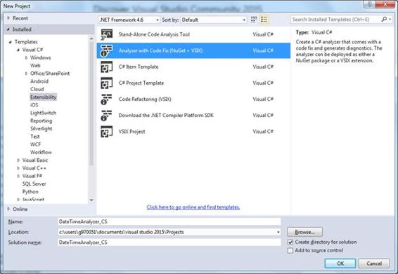
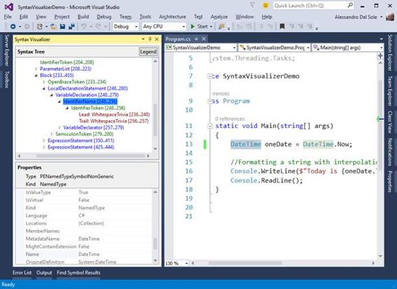
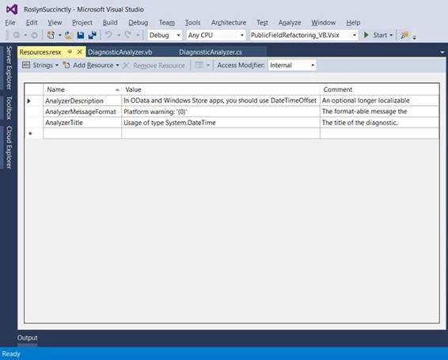
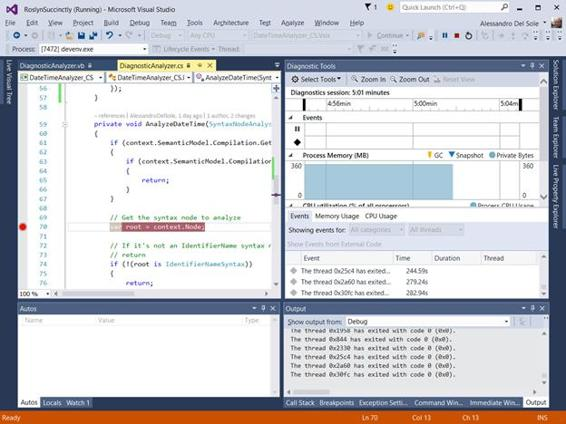

# 四、编写代码分析器

Visual Studio 一直提供集成分析来检测代码问题。在以前的版本中，当您键入时，后台编译器会检测到一些代码问题，集成开发环境会立即在代码编辑器中用曲线报告错误和警告，并在“错误列表”窗口中显示相关的错误或警告消息。在特定的场景中，代码编辑器还提供了一个选项，可以通过适当的修复来编辑代码问题，但是大多数错误和其他代码问题只能在编译解决方案时检测到。此外，代码分析仅限于在微软编码的规则，但不可能用特定于领域的规则来增强代码分析引擎，至少在代码编辑器中是这样。

那个。NET 编译器平台带来革命性的变化。有了新的编译器应用编程接口，实时静态代码分析不仅可以在您键入时检测到任何代码问题，还可以使用自定义的、特定于域的分析规则进行扩展。在本章中，您将学习如何为插入到 Visual Studio 2015 代码编辑器中的自定义语法规则构建代码分析器，以及许多其他关于语法的概念。

|  | 注意:在编写分析器时，通常使用异步方法和异步/等待模式。这要求您至少具备异步方法如何工作的基本知识、`async`和`await`关键字以及取消令牌的概念。MSDN 图书馆有一个关于这种编程模式的专门的[页面](https://msdn.microsoft.com/en-us/library/hh191443.aspx)，如果你不熟悉这种编码方式，强烈建议你在继续本章之前阅读。 |

代码分析器是一个库，其中包含一个或多个自定义规则，用于在您键入时检测特定于域的错误和代码问题。编译器收集的一个规则和所有相关信息被称为**诊断**。代码分析器(或简称分析器)也可以建议灯泡内的正确修复，如[第 2 章](2.html#_Chapter_2_)所述。在本章中，您将创建一个分析器来检测源代码是否将`System.DateTime`类型不正确地分配给了 Windows Store 和 Windows Phone 项目中的一个变量，您应该改用`System.DateTimeOffset`类型，至少在您使用允许操作日期的用户控件时是这样。

|  | 注意:本书中的例子并没有提供特定问题的最终解决方案，也没有完全解决所有可能的情况。在大多数情况下，它们需要改进以适应现实世界的场景。然而，它们的架构方式使您更容易开始使用语法，学习正确的方法，并理解与使用Roslyn应用编程接口构建开发人员工具相关的所有概念。阅读本章和下一章后，您将具备探索其他 API 和为任何场景创建自定义分析规则所需的所有基础知识。 |

要创建一个分析器，选择**文件** > **新项目**，然后在所选语言下的**扩展性**节点，选择**带有代码修复的分析器(NuGet + VSIX)** 项目模板，如图 28 所示。



图 28:创建一个分析器项目

键入 **DateTimeAnalyzer_CS** 作为 C#项目名称，或者 **DateTimeAnalyzer_VB** 作为 Visual Basic 项目名称，然后单击**确定**。在下面的解释中，我使用的是 C#项目名，但同样的过程也适用于 Visual Basic (VB)。

所选项目模板生成一个示例分析器，其指导目的是检测和修复类型名称中的小写字母。我不讨论自动生成的样本；相反，我将向您展示如何从头开始，但您绝对可以将源代码作为练习来看一看。使用此模板，Visual Studio 2015 生成了一个包含三个项目的解决方案:

*   **DateTimeAnalyzer_CS(可移植)**，一个实现分析器的可移植类库。这个项目包含两个文件:DiagnosticAnalyzer.cs(或。vb)，它负责实现分析逻辑并引发正确的错误或警告。vb)，这是您实现集成到灯泡中的代码修复的地方。这些是传统的文件名，您可以用更有意义的名称来重命名。当向单个项目中添加多个分析器和代码修复时，这肯定是您想要做的事情。
*   **DateTimeAnalyzer_CS。测试**，一个包含单元测试的项目，在一个独立的环境中测试你的分析器。这本书没有讨论这个特别的项目，因为我不能假设你有单元测试和测试项目的知识。但是，创建和部署分析器并不是强制性的。
*   **DateTimeAnalyzer_CS。Vsix** ，将分析器打包成 Vsix 包。生成的 VSIX 包可用于将您的分析器发布到 Visual Studio Gallery(参见[第 7 章](7.html#_Chapter_7_Deploying)，但最重要的是，在这一点上，Visual Studio 使用它将分析器安装到 IDE 的实验实例中，这是调试分析器(和代码重构)所必需的。

在实现分析逻辑之前，您必须首先了解需要使用哪些语法元素。为此，您可以使用[第 3 章](3.html#_Working_with_Syntax)中讨论的语法可视化工具。例如，考虑图 29，您可以看到代码声明了一个名为`oneDate`的变量，类型为`System.DateTime`。



图 29:使用语法可视化工具研究语法节点

假设您的分析器需要在每次检测到 Windows Store 应用程序中的`DateTime`类型时报告警告。你需要做的第一件事是了解`DateTime`是如何用Roslyn来表示的。如图 29 所示，它由类型为`IdentifierNameSyntax`的 IdentifierName 语法节点表示。“属性”区域对于理解这种语法节点的属性很有用，但是更有用的是发现这个标识符是否有匹配的符号，这提供了更多的信息。为此，右键单击**识别名称**，然后选择**查看符号(如果有)**。现在，“属性”区域显示符号信息，例如语法种类、包含程序集、基本类型和类型名称，您将很快使用这些信息。这种符号叫做 PENamedTypeSymbolNonGeneric，用一个叫做`INamedTypeSymbol`的. NET 接口来表示。

分析器中的分析逻辑将:

*   只关注 IdentifierName 语法节点。这通过避免调查整个语法树的需要，从分析中排除所有其他类型的语法节点，提高了分析性能。
*   获取这些语法节点的符号信息。
*   只关注命名类型符号。
*   检测所分析的命名类型符号是否称为日期时间，如果是，分析器将创建新的诊断并报告警告，以便代码编辑器在命名类型下显示绿色曲线。

|  | 提示:一般来说，您可以通过选择一行示例代码来确定要使用语法可视化工具分析的确切语法节点，以便从分析中排除所有其他语法节点。这是构建高效分析逻辑的第一步。 |

特定于领域的规则、诊断和分析逻辑是在继承自`Microsoft.CodeAnalysis.Diagnostics.DiagnosticAnalyzer`的类中定义的，并且必须用`DiagnosticAnalyzer`属性修饰，该属性的参数是来自`LanguageNames`类的常量，表示目标编程语言(`CSharp`或`VisualBasic`)。

当您创建名称基于项目名称的分析器项目时，Visual Studio 会自动生成满足这些要求的类。打开诊断分析器。vb)文件，并考虑代码清单 3，其中已经包含了对自动生成的代码的一些编辑。

代码清单 3 (C#)

```cs
    [DiagnosticAnalyzer(LanguageNames.CSharp)]
    public class DateTimeAnalyzer_CSAnalyzer : DiagnosticAnalyzer
    {
        public const string DiagnosticId = "DTA001";

        // You can change these strings in the Resources.resx file.
        // If you do not want your analyzer to be localize-able,
        // you can use regular strings for Title and MessageFormat.
        private static readonly LocalizableString Title =
            new LocalizableResourceString(nameof(Resources.AnalyzerTitle),
                Resources.ResourceManager, typeof(Resources));
        private static readonly LocalizableString MessageFormat =
            new LocalizableResourceString(nameof(Resources.
            AnalyzerMessageFormat),
            Resources.ResourceManager, typeof(Resources));
        private static readonly LocalizableString Description =
            new LocalizableResourceString(nameof(Resources.
            AnalyzerDescription),
            Resources.ResourceManager, typeof(Resources));
        private const string Category = "Naming";

```

代码清单 3 (Visual Basic)

```cs
    <DiagnosticAnalyzer(LanguageNames.VisualBasic)>
    Public Class DateTimeAnalyzer_VBAnalyzer
        Inherits DiagnosticAnalyzer

        Public Const DiagnosticId = "DTA001"

        ' You can change these strings in the Resources.resx file.
        'If you do not want your analyzer To be localize-able,
        'you can use regular strings For Title And MessageFormat.
        Private Shared ReadOnly Title As LocalizableString =
            New LocalizableResourceString(NameOf(My.Resources.AnalyzerTitle),
            My.Resources.ResourceManager,
            GetType(My.Resources.Resources))
        Private Shared ReadOnly MessageFormat As LocalizableString =
            New LocalizableResourceString(NameOf(My.Resources.
            AnalyzerMessageFormat),
            My.Resources.ResourceManager,
            GetType(My.Resources.Resources))
        Private Shared ReadOnly Description As LocalizableString =
            New LocalizableResourceString(NameOf(My.Resources.
            AnalyzerDescription), My.Resources.ResourceManager,
            GetType(My.Resources.Resources))
        Private Const Category = "Naming"

```

|  | 注意:Visual Studio 根据项目名称命名分析器的根命名空间和自动生成的类，并添加分析器后缀。因此，就像在当前示例中一样，命名空间是 DateTimeAnalyzer_CS，但是类名是 DateTimeAnalyzer_CSAnalyzer。如果您认为这个双后缀可能会引起混淆，或者您只是不喜欢它，请不要在命名新项目时添加 analyzer 后缀，也不要重命名 Analyzer 类来删除这个后缀。 |

`DiagnosticId`常量代表分析器的唯一标识符，在代码清单 3 中，默认的 ID 已经被一个自定义的 ID 所改变。当然，你可以自由写不同的 ID。诊断标识与`MessageFormat`的值一起显示在错误列表窗口中。当指针悬停在曲线上或启用代码问题上的灯泡时，诊断工具提示中也会显示`DiagnosticId`、`MessageFormat`和`Title`。`Description`提供了更详细描述诊断的方法。

默认情况下，`Title`、`MessageFormat`和`Description`属于`LocalizableResourceString`类型，它们的值通过 Resources.resx 文件通过项目的默认资源提供。这种方法使分析器的本地化更容易实现，但是如果您不希望分析器本地化，您绝对可以使用常规字符串。要了解这是如何定义的，在**解决方案资源管理器**中，双击 **Resources.resx** 文件(对于 Visual Basic，您必须首先启用**显示所有文件**视图，然后展开**我的项目**)以显示资源编辑器，如图 30 所示。



图 30:编辑资源字符串

默认情况下定义了三种字符串资源。将**值**列替换为图 30 所示的内容(“在 OData 和 Windows Store 应用程序中，您应该使用 DateTimeOffset”)，它显示了当前示例的正确字符串。`Category`常量代表分析器所属的类别，比如命名、语法、可维护性、设计等等。您选择的类别不会影响分析器的工作方式。相反，这是一种向开发人员提供额外信息的方式。

|  | 提示:有用的类别名称列表可以在[https://msdn.microsoft.com/en-us/library/ee1hzekz.aspx](https://msdn.microsoft.com/en-us/library/ee1hzekz.aspx)找到。 |

对于您添加到分析器中的每个规则，您需要一个所谓的诊断描述符，它是`Microsoft.CodeAnalysis.DiagnosticDescriptor`类的一个实例。这种描述诊断的方式可以被工具(如 Visual Studio)理解。`DiagnosticDescriptor`实例公开了包含以下诊断信息的属性:

*   `DiagnosticId`、`MessageFormat`、`Title`、`Category`、`Description`的值，用名称匹配的属性表示。
*   如果必须默认启用，或者必须在规则集编辑器中手动启用。这条信息由`IsEnabledByDefault`布尔属性保存。
*   诊断的严重级别，由`DefaultSeverity`属性表示，其值可以是来自`Microsoft.CodeAnalysis.DiagnosticSeverity`枚举的值，如`Warning`、`Error`、`Info`或`Hidden`。请记住，只有`Error`严重性级别阻止项目被编译，直到代码问题被修复。
*   分析器在线文档的可选 URI(如果有)，开发人员将通过单击错误列表中的诊断标识来打开该文档。这由`HelpLinkUri`属性表示。请注意，如果没有提供自定义 URI，Visual Studio 2015 将根据诊断标识和标题启动阿炳搜索。此时，没有更改默认搜索引擎的选项(除非您提供自定义 URI)。

诊断描述符通过名为`SupportedDiagnostics`的不可变属性公开，该属性返回`System.Collections.Immutable.ImmutableArray<DiagnosticDescriptor>`。通常，这个不可变数组只包含诊断描述符的实例。代码清单 4 显示了诊断描述符和不可变数组的实现。

代码清单 4 (C#)

```cs
    private static DiagnosticDescriptor Rule =
            new DiagnosticDescriptor(DiagnosticId,
            Title, MessageFormat, Category,
            DiagnosticSeverity.Warning,
            isEnabledByDefault: true,
            description: Description,
            helpLinkUri:
        "https://github.com/AlessandroDelSole/RoslynSuccinctly/wiki/DTA001");

    public override ImmutableArray<DiagnosticDescriptor>
         SupportedDiagnostics { get { return ImmutableArray.Create(Rule); } }

```

代码清单 4

```cs
    Private Shared Rule As New DiagnosticDescriptor(DiagnosticId,
            Title, MessageFormat, Category,
            DiagnosticSeverity.Warning,
            isEnabledByDefault:=True,
            description:=Description,
            helpLinkUri:=
         "https://github.com/AlessandroDelSole/RoslynSuccinctly/wiki/DTA001")

    Public Overrides ReadOnly Property SupportedDiagnostics As _
           ImmutableArray(Of DiagnosticDescriptor)
        Get
           Return ImmutableArray.Create(Rule)
       End Get
    End Property

```

现在是实现实际分析逻辑的时候了。

分析逻辑需要两个基本步骤:编写一个在给定语法节点上执行代码分析的方法，称为**动作**，并在分析器启动时注册该动作，以便分析器可以响应编译器事件，例如查找语法节点或声明符号。

您可以为一个语法节点实现和注册多个操作。如果您想要检测多个问题并提供多个修复，这可能会很有用。您可以在`Initialize`方法中注册动作，这是分析器的主要入口点。这个方法采用一个名为`context`的参数，类型为`AnalysisContext`，代表初始化分析器的上下文。`AnalysisContext`类型公开了许多用于注册动作的方法，如表 1 所述。

表 1:注册动作的方法

| 方法名 | 描述 |
| --- | --- |
| `RegisterSyntaxTreeAction` | 注册在分析代码文件后执行的操作。 |
| `RegisterSyntaxNodeAction` | 注册在语法节点的语义分析完成时执行的操作。 |
| `RegisterSymbolAction` | 注册在符号语义分析完成时执行的操作。 |
| `RegisterSemanticModelAction` | 注册在分析代码文档后执行的操作。 |
| `RegisterCompilationStartAction` | 注册编译开始时执行的操作。 |
| `RegisterCompilationEndAction` | 注册编译完成时执行的操作。 |

正如我之前提到的(参见[图 29](#Figure29) ，您必须分析一个 IdentifierName 节点，它由`IdentifierNameSyntax`类型表示，因此是一个语法节点。为此，您需要注册一个调用`RegisterSyntaxNodeAction`方法的动作，如代码清单 5 所示。

代码清单 5 (C#)

```cs
    public override void Initialize(AnalysisContext context)
    {
        context.RegisterSyntaxNodeAction(AnalyzeDateTime,
                SyntaxKind.IdentifierName);
    }

```

代码清单 5

```cs
    Public Overrides Sub Initialize(context As AnalysisContext)
        context.RegisterSyntaxNodeAction(AddressOf AnalyzeDateTime,
                                     SyntaxKind.IdentifierName)
    End Sub

```

`RegisterSyntaxNodeAction`的第一个参数是执行实际代码分析的委托，而第二个参数是语法种类(有关种类的详细信息，请参见[第 3 章](3.html#_Chapter_3_))。这是通过从`SyntaxKind`枚举中选择一个值来指定的，在本例中为`IdentifierName`，表示一个 IdentifierName 语法节点。

|  | 注意:`SyntaxKind`枚举暴露了差不多 800 个值，所以本书不可能对每个值都提供描述。然而，智能感知总是在描述值方面做得很好，您可以在代码编辑器中右键单击枚举，然后选择转到定义来探索所有可用的语法种类。 |

代码清单 6 (C#)

```cs
            private void AnalyzeDateTime(SyntaxNodeAnalysisContext context)
            {

                // Get the syntax node to analyze
                var root = context.Node;

                // If it's not an IdentifierName syntax node,
                // return
                if (!(root is IdentifierNameSyntax))
                {
                    return;
                }

                // Convert to IdentifierNameSyntax
                root = (IdentifierNameSyntax)context.Node;

                // Get the symbol info for
                // the DateTime type declaration
                var dateSymbol = context.SemanticModel.
                    GetSymbolInfo(root).Symbol as INamedTypeSymbol;

                // If no symbol info, return
                if (dateSymbol == null)
                {
                    return;
                }

                // If the name of the symbol is not
                // DateTime, return
                if (!(dateSymbol.MetadataName == "DateTime"))
                {
                    return;
                }

                // Create a diagnostic at the node location
                // with the specified message and rule info
                var diagn = Diagnostic.Create(Rule,
                    root.GetLocation(),
                    "Consider replacing with DateTimeOffset");

                // Report the diagnostic
                context.ReportDiagnostic(diagn);
            }

```

代码清单 6

```cs
        Private Sub AnalyzeDateTime(context As SyntaxNodeAnalysisContext)

            'Get the syntax node to analyze
            Dim root = context.Node

            'If it's not an IdentifierName syntax node,
            'return
            If TypeOf (root) Is IdentifierNameSyntax
               'Convert to IdentifierNameSyntax
                root = CType(context.Node, IdentifierNameSyntax)
            Else
                Return
            End If

            'Get the symbol info for
            'the DateTime type declaration
            Dim dateSymbol =
                TryCast(context.SemanticModel.
                        GetSymbolInfo(root).Symbol,
                        INamedTypeSymbol)

            'If no symbol info, return
            If dateSymbol Is Nothing Then
                Return
            End If

            'If the name of the symbol is not
            'DateTime, return
            If Not dateSymbol.MetadataName = "DateTime" Then
                Return
            End If

            'Create a diagnostic at the node location
            'with the specified message and rule info
            Dim diagn =
                Diagnostic.Create(Rule, root.GetLocation,
                           "Consider replacing with DateTimeOffset")

            'Report the diagnostic
            context.ReportDiagnostic(diagn)
        End Sub

```

#### 检索语法节点的信息

`AnalyzeDateTime`方法有一个类型为`SyntaxNodeAnalysisContext`的参数，它表示语法节点的上下文，并从编译器的角度保存关于语法节点的信息。这个对象公开了一个名为`Node`的属性，类型为`SyntaxNode`，它代表您使用的实际语法节点。正如你在[第 3 章](3.html#_Working_with_Syntax)中所学的，`SyntaxNode`是语法层次的根，因此，你需要一个更专业的对象。因此，代码试图将语法节点转换为一个`IdentifierNameSyntax`对象，该对象代表`DateTime`类型。如果转换失败，这意味着当前节点不是 IdentifierName，因此方法的执行终止。如果转换成功，则当前节点是一个标识符名称，代码尝试检索该节点的符号信息。

#### 检索符号信息

通过在语法节点上下文的`SemanticModel`上调用`GetSymbolInfo`方法，然后将`Symbol`属性转换为类型为`INamedTypeSymbol`的对象来完成节点符号信息的检索，该对象源自`ISymbol`，旨在表示像`DateTime`这样的命名类型。

如果此调用和转换的结果为空，则意味着没有与此 IdentifierName 节点关联的符号信息，并且方法执行终止。如果不为空，代码将检查`MetadataName`属性的值是否为`DateTime`。`MetadataName`包含被检查符号的类型名称。在本例中，如果`MetadataName`等于`DateTime`，则意味着当前的 IdentifierName 节点代表`DateTime`类型，因此它是我们要报告诊断的节点。

此时需要考虑的一个重要问题是:语法可视化工具显示了每个语法节点和每个符号(如果有)的完整属性列表。关于这个例子，如果你回顾一下[图 29](#Figure29) ，你会看到语法可视化工具是如何显示`DateTime`的符号信息的，包括`MetadataName`属性。同样，语法可视化工具非常重要，因为它显示了属性的完整列表，您可以通过研究这些属性来确定关于语法节点的任何信息。

又如，`IMethodSymbol`类型公开了一个名为`ReturnType`的属性，它包含方法返回的类型的完全限定名，对于确定正在分析的方法是否是您期望的方法非常有用。当您想要分析不太熟悉的语法节点时，不要忘记保持语法可视化工具打开；它将提供所有语法节点公开的属性和返回的信息的完整列表。

#### 报告诊断

回到代码，如果`MetadataName`的值是`DateTime`，你需要创建一个诊断，它将在代码编辑器中扭曲类型名称。为此，从`Microsoft.CodeAnalysis.Diagnostic`类调用静态`Create`方法。此方法采用三个参数:诊断描述符的实例(`Rule`)、代码编辑器中的诊断位置(`root.GetLocation`)和描述性消息。请注意，任何语法节点类都会公开`GetLocation`方法，该方法对应于当前研究的语法节点，在本例中是`IdentifierNameSyntax`节点。最后，通过调用上下文类的`ReportDiagnostic`方法来报告诊断。这样，像 Visual Studio 这样的工具将接收诊断实例，并使用它的信息来突出显示代码问题和显示有关它的信息。

#### 快速查看代码修复

到目前为止，您已经完成了分析器的第一部分，即诊断。下一步是提供一个代码修复程序，通过显示灯泡中潜在的修复程序来帮助开发人员解决代码问题。

记住:提供代码修复不是强制性的。在 VB 和 C#编译器中有很多内置诊断程序，它们只报告警告和错误，而不建议代码修复，可能有很多情况和原因不提供代码修复。如果您想到正则表达式，您可以编写一个分析器来检查字符串文字是否与特定的正则表达式不匹配，但是您不能真正预测编写正确文字的所有可能方法。在这种情况下，您可能只想报告一个代码问题。

|  | 提示:您在分析器中编写的动作会在每次按键时被调用。这意味着您必须高效地设计您的分析器，以便它们不会影响代码编辑器的性能。创建高效分析器的秘密是实现小测试，一次一个，而不是执行一个繁重的分析。前面的例子非常有效，因为它在创建和报告诊断之前按顺序实现了小测试。 |

在这一点上，您可能会争辩说，对于 Visual Basic 来说，示例代码是不完整的，因为该语言还提供了`Date`关键字，该关键字被用来代替`DateTime`。这是那些为特定语言定制的应用编程接口的一个特定场景，稍后将在[语言定制应用编程接口](#_Language-Tailored_APIs)一节中描述。现在，是时候提供代码修复了。

代码修复是集成到灯泡中的快速操作，它为代码问题提供了可能的解决方案。您可以在 CodeFixProvider.cs(或)中实现代码修复。vb)文件。

|  | 提示:请始终记住，DiagnosticAnalyzer.cs 和 CodeFixProvider.cs 都是常规名称，您可以用更有意义的文件名替换它们。为了一致性，我使用了本书中的默认文件名。 |

代码修复由继承自`Microsoft.CodeAnalysis.CodeFixProvider`的类表示，该类为代码修复提供了公共基础设施。本例中，Visual Studio 2015 生成了一个名为`DateTimeAnalyzer_CSCodeFixProvider`的类，该类继承自`CodeFixProvider`，并使用`ExportCodeFixProvider`属性进行修饰。后者需要两个参数:目标语言(仍然通过`LanguageNames`枚举指定)和名称。

`CodeFixProvider`公开了派生类必须重写的三种方法:

*   `FixableDiagnosticIds`，返回一个不可变数组，其中有一个元素表示与之关联的诊断 ID，可以用当前的代码修复提供程序进行修复。
*   `GetFixAllProvider`，定义了一种提供修复的方式，可以从`FixAllProvider`类中选择。
*   `RegisterCodeFixesAsync`，实现解决问题的代码。

`RegisterCodeFixesAsync`需要特别注意，所以`DateTimeAnalyzerCodeFixProvider`类的代码的第一部分是关于它的定义和前面列表中的前两个方法。代码清单 7 显示了这段代码。

代码清单 7 (C#)

```cs
    [ExportCodeFixProvider(LanguageNames.CSharp, Name =
    nameof(DateTimeAnalyzer_CSCodeFixProvider)), Shared]
    public class DateTimeAnalyzer_CSCodeFixProvider : CodeFixProvider
    {
         private const string title = "Replace with DateTimeOffset";

         public sealed override ImmutableArray<string> FixableDiagnosticIds
         {
             get { return ImmutableArray.
                   Create(DateTimeAnalyzerAnalyzer.DiagnosticId); }
         }

         public sealed override FixAllProvider GetFixAllProvider()
         {
             return WellKnownFixAllProviders.BatchFixer;
         }

```

代码清单 7

```cs
    <ExportCodeFixProvider(LanguageNames.VisualBasic, Name:=NameOf(DateTimeAnalyzer_VBCodeFixProvider)), [Shared]>
    Public Class DateTimeAnalyzer_VBCodeFixProvider
        Inherits CodeFixProvider

        Private Const title As String =
                "Replace DateTime with DateTimeOffset"

        Public NotOverridable Overrides ReadOnly Property
               FixableDiagnosticIds As ImmutableArray(Of String)
            Get
                Return ImmutableArray.
                       Create(DateTimeAnalyzer_VBAnalyzer.DiagnosticId)
            End Get
        End Property

        Public NotOverridable Overrides Function _
               GetFixAllProvider() As FixAllProvider
            Return WellKnownFixAllProviders.BatchFixer
        End Function

```

#### 注册操作

代码修复的核心是`RegisterCodeFixesAsync`方法，在该方法中，您注册一个操作来解决代码问题。当然，您可以为不同的潜在修复提供多个操作。代码清单 8 显示了当前示例的实现(阅读代码注释了解详细信息)。

代码清单 8 (C#)

```cs
            public sealed override async Task
                   RegisterCodeFixesAsync(CodeFixContext context)
            {
                // Get the root syntax node for the current document
                var root = await context.Document.
                    GetSyntaxRootAsync(context.CancellationToken).
                    ConfigureAwait(false);

                // Get a reference to the diagnostic to fix
                var diagnostic = context.Diagnostics.First();
                // Get the location in the code editor for the diagnostic
                var diagnosticSpan = diagnostic.Location.SourceSpan;

                // Find the syntax node on the span
                // where there is a squiggle
                var node = root.FindNode(context.Span);

                // If the syntax node is not an IdentifierName
                // return
                if (node is IdentifierNameSyntax == false)
                {
                    return;
                }

                // Register a code action that invokes the fix
                // on the current document
                context.RegisterCodeFix(
                CodeAction.Create(title:title,
                                  createChangedDocument:
                                  c=> ReplaceDateTimeAsync(context.Document,
                                  node, c),
                                  equivalenceKey:title), diagnostic);
            }

```

代码清单 8

```cs
        Public NotOverridable Overrides Async Function _
            RegisterCodeFixesAsync(context As CodeFixContext) As Task

            'Get the root syntax node for the current document
            Dim root = Await context.Document.
                GetSyntaxRootAsync(context.CancellationToken).
                ConfigureAwait(False)

            'Get a reference to the diagnostic to fix
            Dim diagnostic = context.Diagnostics.First()

            'Get the location in the code
            'editor for the diagnostic
            Dim diagnosticSpan =
                diagnostic.Location.SourceSpan
            'Find the syntax node on the span
            'where there is a squiggle
            Dim node = root.FindNode(context.Span)

            'Register a code action that invokes the fix
            'on the current document
            context.RegisterCodeFix(
            CodeAction.Create("Replace with DateTimeOffset",
                                Function(c)
                                ReplaceDateTimeAsync(context.Document,
                                node, c), equivalenceKey:=title),
                                diagnostic)
        End Function

```

该方法采用类型为`Microsoft.CodeAnalysis.CodeFixes.CodeFixContext`的名为`context`的参数，该参数是一个值类型，表示代码修复的当前上下文。上下文是指具有诊断功能的语法节点。

#### 获取诊断参考

`RegisterCodeFixesAsync`方法首先通过`GetSyntaxRootAsync`方法检索当前文档(即源代码文件)的根语法节点。接下来，它通过在不可变的代码修复数组上调用`First`来获取对要修复的诊断的引用。之后，代码通过`diagnostic.Location.SourceSpan`属性检索代码编辑器中的诊断位置，并通过`root.FindNode`方法检索相关语法节点。

#### 将注册的动作与灯泡集成

该方法的最后一步是通过静态`Microsoft.CodeAnalysis.CodeAction.Create`方法注册代码动作，该方法将灯泡中显示的标题、执行实际工作以修复语法节点的委托、名为`equivalenceKey`的唯一标识符以及诊断实例作为参数。此委托在当前示例中称为`ReplaceDateTimeAsync`，通常接收三个参数:`Document`类的一个实例，表示包含要修复的语法节点的源代码文件、语法节点的实例和取消标记。

#### 生成新的语法节点

此时，目标是创建一个新的语法节点，其中代码问题已经基于具有诊断的语法节点得到解决，并用新节点替换后者，返回一个新的`Document`实例。代码清单 9 演示了这一点。

代码清单 9 (C#)

```cs
            private async Task<Document>
                    ReplaceDateTimeAsync(Document document,
                             SyntaxNode node,
                             CancellationToken cancellationToken)
            {
                // Get the root syntax node for the current document
                var root = await document.GetSyntaxRootAsync();

                // Convert the syntax node into the specialized kind
                var convertedNode = (IdentifierNameSyntax)node;

                // Create a new syntax node
                var newNode = convertedNode?.WithIdentifier(SyntaxFactory.
                              ParseToken("DateTimeOffset")).
                              WithLeadingTrivia(node.GetLeadingTrivia()).
                              WithTrailingTrivia(node.GetTrailingTrivia());

                // Create a new root syntax node for the current document,
                // replacing the syntax node that has the diagnostic with
                // a new syntax node
                var newRoot = root.ReplaceNode(node, newNode);

                // Generate a new document
                var newDocument = document.WithSyntaxRoot(newRoot);
                return newDocument;
            }

```

代码清单 9

```cs
        Private Async Function ReplaceDateTimeAsync _
                (document As Document,
                 node As SyntaxNode,
                 cancellationToken As CancellationToken) _
                 As Task(Of Document)

            'Get the root syntax node for the current document
            Dim root = Await document.GetSyntaxRootAsync

            'Convert the syntax node into the specialized kind
            Dim convertedNode = DirectCast(node, IdentifierNameSyntax)

            'Create a new syntax node
            Dim newNode = convertedNode.
                          WithIdentifier(SyntaxFactory.
                          ParseToken("DateTimeOffset")).
                          WithTrailingTrivia(node.
                          GetTrailingTrivia)

            'Create a new root syntax node for the current document,
            'replacing the syntax node that has the diagnostic with
            'a new syntax node
            Dim newRoot = root.ReplaceNode(node, newNode)

            'Generate a new document
            Dim newDocument = document.WithSyntaxRoot(newRoot)
            Return newDocument

        End Function

```

前两行代码检索当前文档的根语法节点，并将当前语法节点实例转换为预期类型，即`IdentifierNameSyntax`。逻辑的核心在`newNode`变量声明；目标是用`DateTimeOffset`类型名称而不是`DateTime`来修改具有诊断的语法节点。语法节点是不可变的，所以不能直接编辑`convertedNode`。相反，您可以从现有语法节点开始创建一个新的语法节点(`newNode`)。

要进行编辑，需要调用`WithIdentifier`方法，该方法允许向`IdentifierNameSyntax`节点提供新的标识符。`WithIdentifier`的论点是`SyntaxToken`；因为您不能直接提供一个`SyntaxNode`，所以您使用来自`SyntaxFactory`类的`ParseToken`方法，该方法解析一个字符串并返回一个`SyntaxToken`。因为原始语法节点可能有空格、注释和终止符，所以您也可以调用`WithTrailingTrivia`方法。由于不需要更改原始花絮，只需将调用传递给`node.GetTrailingTrivia`，后者从原始语法节点获取尾随花絮。

下一步是生成一个新的根语法节点。因为语法节点是不可变的，所以不能直接编辑原始的根语法节点。相反，您可以通过用新节点(`ReplaceNode`)替换旧语法节点来创建新语法节点。

最后，通过调用`WithSyntaxRoot`并传递新的根语法节点作为参数来生成一个新文档。此调用返回一个新的`Document`实例，该实例表示代码问题已修复的当前源文件。在做任何其他工作之前，停下来讨论Roslyn应用编程接口中的重要对象是很重要的。

|  | 提示:从`SyntaxNode`派生的类型公开了许多`With`方法，您调用这些方法来创建一个新的语法节点，提供更新的信息。在实现代码修复和重构时，使用`With`方法是非常常见的，在这方面，智能感知是您最好的朋友，它显示了从`SyntaxNode`继承的每个类的可用方法及其描述的完整列表。 |

使用 Roslyn，您可以执行不同类型的代码相关任务，例如代码生成和分析，从源文本开始，或者对现有语法节点进行操作。在第二种情况下，由于不变性，您可以基于现有的语法节点创建一个新的语法节点，并进行适当的编辑，包括添加或删除成员。

无论您需要从头开始创建新的语法树和节点，还是对现有的语法节点进行编辑，您都需要使用语法节点。那个。NET 编译器平台提供了两个用于生成任何语法节点的对象:`SyntaxFactory`类和`SyntaxGenerator`类。让我们从`SyntaxFactory`开始。

#### 使用语法工厂生成语法节点

Visual Basic ( `Microsoft.CodeAnalysis.VisualBasic.SyntaxFactory`)和 C# ( `Microsoft.CodeAnalysis.CSharp.SyntaxFactory`)有这个类的特定版本，因为这些语言有不同的词汇和语法。例如，在 C#中，你用括号来限定一个方法定义，而在 Visual Basic 中，你有`Sub`和`Function`关键字，外加一个`End`语句。

因为你键入的每一个东西都必须有一个语法表示，所以你可以理解为什么`SyntaxFactory`有两种不同的实现。这公开了许多允许生成语法元素的方法。例如，假设您想要创建一个语法节点，表示代码清单 10 中所示的类。

代码清单 10 (C#)

```cs
    public abstract class Person : IDisposable
    {
        public void IDisposable.Dispose()
        {
            // Leaving blank for simplicity
        }
    }

```

代码清单 10

```cs
    Public MustInherit Class Person
        Implements IDisposable

        Public Sub Dispose() Implements IDisposable.Dispose
            'Leaving blank for simplicity
        End Sub
    End Class

```

虽然这个类定义看起来很简单，但是它有足够的语法成员来理解语法生成是如何工作的。事实上，这里有一个带有修饰符和访问器的类定义。类别会实作介面，并公开实作介面所需方法的方法。

用语法可视化工具浏览一下这个简单代码的定义。一旦您对组成这个节点的语法元素有了更精确的概念，请查看代码清单 11，了解如何使用`SyntaxFactory`生成语法定义。

代码清单 11 (C#)

```cs
                var classBlock = SyntaxFactory.ClassDeclaration(
                @"Person")
            .WithModifiers(
                SyntaxFactory.TokenList(
                    new[]{
                        SyntaxFactory.Token(
                            SyntaxKind.AbstractKeyword),
                        SyntaxFactory.Token(
                            SyntaxKind.PublicKeyword)}))
            .WithKeyword(
                SyntaxFactory.Token(
                    SyntaxKind.ClassKeyword))
            .WithBaseList(
                SyntaxFactory.BaseList(
                    SyntaxFactory.SingletonSeparatedList<BaseTypeSyntax>(
                        SyntaxFactory.SimpleBaseType(
                            SyntaxFactory.IdentifierName(
                                @"IDisposable"))))
                .WithColonToken(
                    SyntaxFactory.Token(
                        SyntaxKind.ColonToken)))
            .WithOpenBraceToken(
                SyntaxFactory.Token(
                      SyntaxKind.OpenBraceToken))
            .WithMembers(
                SyntaxFactory.SingletonList<MemberDeclarationSyntax>(
                    SyntaxFactory.MethodDeclaration(
                        SyntaxFactory.PredefinedType(
                            SyntaxFactory.Token(
                                SyntaxKind.VoidKeyword)),
                        SyntaxFactory.Identifier(
                            @"Dispose"))
                    .WithModifiers(
                        SyntaxFactory.TokenList(
                            SyntaxFactory.Token(
                                SyntaxKind.PublicKeyword)))
                    .WithExplicitInterfaceSpecifier(
                        SyntaxFactory.ExplicitInterfaceSpecifier(
                            SyntaxFactory.IdentifierName(
                                @"IDisposable"))
                        .WithDotToken(
                            SyntaxFactory.Token(
                                SyntaxKind.DotToken)))
                    .WithParameterList(
                        SyntaxFactory.ParameterList()
                        .WithOpenParenToken(
                            SyntaxFactory.Token(
                                SyntaxKind.OpenParenToken))
                        .WithCloseParenToken(
                            SyntaxFactory.Token(
                                SyntaxKind.CloseParenToken)))
                    .WithBody(
                       SyntaxFactory.Block()
                       .WithOpenBraceToken(
                            SyntaxFactory.Token(
                                SyntaxKind.OpenBraceToken))
                        .WithCloseBraceToken(
                            SyntaxFactory.Token(
                                SyntaxKind.CloseBraceToken)))))
            .WithCloseBraceToken(
                SyntaxFactory.Token(
                    SyntaxKind.CloseBraceToken)).
                    NormalizeWhitespace();

```

代码清单 11

```cs
    Dim ClassBlock = SyntaxFactory.ClassBlock(
                     SyntaxFactory.ClassStatement("Person").
                     AddModifiers(SyntaxFactory.ParseToken("MustInherit"),
                                  SyntaxFactory.ParseToken("Public"))).
                     AddImplements(SyntaxFactory.
                     ImplementsStatement(SyntaxFactory.
                     ParseTypeName("IDisposable"))).
                     AddMembers(SyntaxFactory.
                     MethodBlock(SyntaxKind.SubBlock,
                                 SyntaxFactory.SubStatement(Nothing,
                                 SyntaxFactory.TokenList(
                                 SyntaxFactory.ParseToken("Public")),
                                 SyntaxFactory.ParseToken("Dispose()"),
                                 Nothing, Nothing, Nothing, Nothing,
                                 SyntaxFactory.ImplementsClause(
                                 SyntaxFactory.ParseToken("Implements"),
                                 SyntaxFactory.
                             SingletonSeparatedList(Of QualifiedNameSyntax) _
                                 (SyntaxFactory.QualifiedName(SyntaxFactory.
                                 ParseName("IDisposable"),
                                 SyntaxFactory.ParseName("Dispose"))))),
                                 SyntaxFactory.EndSubStatement)).
                    NormalizeWhitespace()

```

#### 以编程方式创建语法节点

您在语法可视化工具中看到的每个语法节点都有一个由`SyntaxFactory`类公开的相应方法。这些方法允许创建语法节点，它们的名称是不言自明的；它们接受的参数是其他语法节点或语法标记。

例如，Visual Basic 中的`ClassBlock`方法生成一个`Class..End Class`块，并接受一个参数，这就是`ClassStatement`方法。这个`ClassStatement`方法表示`Class`语句(包括类名)、修饰符(如代码清单 11 中的`Public`和`MustInherit`)、`Implements`语句(`AddImplement`加上`ImplementsStatements`)、`Inherits`语句等等。

#### 向语法节点添加成员

`ClassBlock`方法还允许向类中添加成员，如方法，每个成员都由对`MethodBlock`方法的调用来表示。值得一提的是生成全限定类型名的`SyntaxFactory.QualifiedName`，解析类型名返回`IdentifierNameSyntax`对象的`SyntaxFactory.ParseName`。

同样的考虑适用于 C#，但是根据不同的词典和语义，方法名称略有不同。调用`NormalizeWhitespace`方法总是很重要的，该方法为生成的语法节点提供适当的缩进和行终止符。

在 IntelliSense 的帮助下使用`SyntaxFactory`类是如此简单，以至于现在没有必要列出任何可能的方法，一旦您理解了如何使用`SyntaxFactory`公开的方法来创建您在语法可视化工具中看到的任何语法节点，一切都将变得容易得多。

#### 使用语法生成器生成语法节点

虽然`SyntaxFactory`类非常强大，允许生成任何可能的语法元素，但是根据您使用的编程语言，您可以使用不同的语法元素。那个。NET 编译器平台还提供了`Microsoft.CodeAnalysis.Editing.SyntaxGenerator`类，这是一个创建语法节点的语言无关工厂。此类允许创建语言之间语义相似的特定于语言的语法节点。更简单地说，它为 VB 和 C#公开了相同的成员，并且您对这两种语言使用它的方式是相同的。

为了使用`SyntaxGenerator`，您需要通过调用其静态`GetGenerator`方法获得这个类的一个实例。这需要一个`Document`实例(代表一个源代码文件)或者一个工作空间。在`Document`的情况下，您可以使用现有代码文件中的语法节点，`GetGenerator`将自动检测它所使用的语言。在工作区的情况下，您也可以从头开始创建语法节点，并将`MSBuildWorkspace`类的实例和编程语言的名称作为参数传递。

工作区应用编程接口和`MSBuildWorkspace`类将在[第 8 章](8.html#_Chapter_8_Workspaces%2C)中讨论，但是在这一点上，您需要知道的只是，这种类型代表了一个可以用 MSBuild 解决方案和项目填充的工作区。代码清单 12 展示了如何使用`SyntaxGenerator`生成表示代码清单 10 内容的语法节点。你会惊讶于 C#和 Visual Basic 如何使用完全相同的 API。

|  | 注意:为了完成并编译代码清单 12 中显示的示例，您可以创建一个控制台应用程序，然后安装 Microsoft。代码分析包，或者您可以使用独立代码分析工具项目模板创建控制台应用程序，该模板在“新建项目”对话框的“可扩展性”节点中可用。后者在[第 8 章](8.html#_Chapter_8_Workspaces%2C)中有更全面的讨论，并自动安装所有必要的 NuGet 包来与Roslyn合作。 |

代码清单 12 (C#)

```cs
        //Requires the following using directives:
        //using Microsoft.CodeAnalysis;
        //using Microsoft.CodeAnalysis.Editing;
        //using Microsoft.CodeAnalysis.MSBuild;
            static void Main(string[] args)
            {
                //Create a workspace
                var ws = MSBuildWorkspace.Create();

                //Get an instance of SyntaxGenerator for
                //the specified workspace in C#
                var generator = SyntaxGenerator.
                                GetGenerator(ws, "C#");

                //Generate a qualified name for IDisposable
                var interfaceType =
                    generator.DottedName("IDisposable");

                //Generate a public method called Dispose
                var methodBlock =
                    generator.MethodDeclaration(
                              "Dispose",
                              accessibility:
                              Accessibility.Public);

                //Make the method implement IDisposable.Dispose
                var methodBlockWithInterface =
                    generator.
                    AsPublicInterfaceImplementation(methodBlock,
                    interfaceType);

                //Generate a public abstract class
                //that implements the previous interface
                //and with the specified members
                var classBlock =
                    generator.ClassDeclaration("Person",
                              accessibility:
                              Accessibility.Public,
                              modifiers:
                              DeclarationModifiers.Abstract,
                              members:new SyntaxNode[]
                              { methodBlockWithInterface },
                              interfaceTypes:new SyntaxNode[]
                              { interfaceType }).
                              NormalizeWhitespace();

                Console.WriteLine(classBlock.ToFullString());
                Console.Read();
            }

```

代码清单 12

```cs
        'Requires the following Imports directives:
        'Imports Microsoft.CodeAnalysis
        'Imports Microsoft.CodeAnalysis.Editing
        'Imports Microsoft.CodeAnalysis.MSBuild
        Sub Main()
            'Create a workspace
            Dim ws = MSBuildWorkspace.Create()

            'Get an instance of SyntaxGenerator for
            'the specified workspace in VB
            Dim generator = SyntaxGenerator.
                            GetGenerator(ws,
                            "Visual Basic")

            'Generate a qualified name for IDisposable
            Dim interfaceType =
                generator.DottedName("IDisposable")

            'Generate a Public method called Dispose
            Dim methodBlock =
                generator.MethodDeclaration(
                          "Dispose",
                          accessibility:=
                          Accessibility.Public)

            'Make the method implement IDisposable.Dispose
            Dim methodBlockWithInterface =
                generator.
                AsPublicInterfaceImplementation(methodBlock,
                interfaceType)

            'Generate a public abstract class
            'that implements the previous interface
            'and with the specified members
            Dim classBlock =
                generator.ClassDeclaration("Person",
                          accessibility:=
                          Accessibility.Public,
                          modifiers:=
                          DeclarationModifiers.Abstract,
                          members:={methodBlockWithInterface},
                          interfaceTypes:={interfaceType}).
                          NormalizeWhitespace

            Console.WriteLine(classBlock.ToFullString)
            Console.Read()
        End Sub

```

这里有几点需要注意:

*   Visual Basic 和 C#使用相同的 API。
*   `SyntaxGenerator`允许通过表示 Visual Basic 和 C#语义的方法生成语法节点。通过使用 IntelliSense，您将看到方法的完整列表，这些方法的名称会回想起它们生成的类型或成员的名称(例如，`ClassDeclaration`生成类，`InterfaceDeclaration`生成接口，`PropertyDeclaration`生成属性，等等)。
*   从`SyntaxGenerator`返回`SyntaxNode`的方法，在很多情况下，它们的参数要么是`SyntaxNode`类型，要么是`SyntaxNode`对象的集合或数组。使用`SyntaxNode`而不是衍生对象给`SyntaxGenerator`很大的灵活性。
*   您可以调用`DottedName`方法将限定类型名解析为`SyntaxNode`，该名称可以作为参数传递给任何需要`SyntaxNode`来表示类型名的方法。

至于`SyntaxFactory`，IntelliSense 和[源码定义](http://source.roslyn.io/#Microsoft.CodeAnalysis.Workspaces/Editing/SyntaxGenerator.cs,3c40e627ffcd3bf7)都会帮助你获得可用方法的完整列表，并理解它们的用途。

|  | 注意:当`SyntaxGenerator`提供了一种与语言无关的方式来生成语法节点时，您可能会想为什么要使用`SyntaxFactory`。首先，`SyntaxFactory`非常适合为特定语言定制的 API 的语法生成。其次，`SyntaxFactory`从 Roslyn 的第一个社区技术预览版就已经存在，多年来被广泛用于创建语法节点。`SyntaxGenerator`更近，还没有同样的扩散。如果你在网上搜索关于生成语法节点的例子，你会发现 90%以上的例子使用`SyntaxFactory`。由于这些原因，你必须对这两种类型都有所了解。 |

### 语言定制的应用编程接口

尽管诊断 API 提供了大量 C#和 Visual Basic 通用的类型和成员，但在某些情况下，您需要为给定语言定制的 API。关于到目前为止讨论的样本分析器，Visual Basic 语言有`Date`关键字，你可以用它来代替`System.DateTime`(它有相同的返回类型)。为了完整性，您还必须对`Date`关键字执行代码分析。借助语法可视化工具，您可以发现`Date`关键字是如何由一个名为预定义类型的语法节点表示的，该节点由一个`PredefinedTypeSyntax`对象映射。这意味着您需要在`Initialize`方法中注册一个额外的动作，并且您需要对这种节点执行代码分析。也就是说，您必须执行以下任务:

*   在诊断类的`Initialize`方法中注册一个检查预定义类型语法种类的附加语法节点操作。
*   编辑诊断类中的`AnalyzeDateTime`方法，检查当前语法节点是 IdentifierName 还是 PredefinedType。
*   在代码修复提供程序类中，注册一个附加操作，该操作也将为预定义类型语法节点提供修复。
*   实现一个专门针对`Date`关键字的新方法来解决代码问题。

代码清单 13 显示了对诊断分析器. vb 文件的编辑，而代码清单 14 显示了对代码修复提供程序. vb 文件的编辑。

代码清单 13

```cs
        Public Overrides Sub Initialize(context As AnalysisContext)
            context.RegisterSyntaxNodeAction(AddressOf AnalyzeDateTime,
    SyntaxKind.PredefinedType)
            context.RegisterSyntaxNodeAction(AddressOf AnalyzeDateTime,
    SyntaxKind.IdentifierName)
        End Sub

        Private Sub AnalyzeDateTime(context As SyntaxNodeAnalysisContext)

            'Get the syntax node to analyze
            Dim root = context.Node

            'If it's not an IdentifierName syntax node,
            'return
            If TypeOf (root) Is PredefinedTypeSyntax Then
                root = CType(context.Node, PredefinedTypeSyntax)
            ElseIf TypeOf (root) Is IdentifierNameSyntax
                'Conver to IdentifierNameSyntax
                root = CType(context.Node, IdentifierNameSyntax)
            Else
                Return
            End If

            'Get the symbol info for
            'the DateTime type declaration
            Dim dateSymbol =
                TryCast(context.SemanticModel.
                        GetSymbolInfo(root).Symbol,
                        INamedTypeSymbol)

            'If no symbol info, return
            If dateSymbol Is Nothing Then
                Return
            End If

            'If the name of the symbol is not
            'DateTime, return
            If Not dateSymbol.MetadataName = "DateTime" Then
                Return
            End If

            'Create a diagnostic at the node location
            'with the specified message and rule info
            Dim diagn =
                Diagnostic.Create(Rule, root.GetLocation,
                           "Consider replacing with DateTimeOffset")

            'Report the diagnostic
            context.ReportDiagnostic(diagn)
        End Sub

```

代码清单 14

```cs
        Private Async Function ReplaceDateTimeAsync _
                (document As Document,
                 node As SyntaxNode,
                 cancellationToken As CancellationToken) _
                 As Task(Of Document)

            'Get the root syntax node for the current document
            Dim root = Await document.GetSyntaxRootAsync

            Dim newRoot As SyntaxNode = Nothing

            'Convert the syntax node into the specialized kind
            If TypeOf (node) Is IdentifierNameSyntax Then
                Dim convertedNode = DirectCast(node, IdentifierNameSyntax)

                'Create a new syntax node
                Dim newNode = convertedNode.
                              WithIdentifier(SyntaxFactory.
                              ParseToken("DateTimeOffset")).
                              WithTrailingTrivia(node.
                              GetTrailingTrivia)

                newRoot = root.ReplaceNode(node, newNode)
            ElseIf TypeOf (node) Is PredefinedTypeSyntax
                Dim convertedNode = DirectCast(node, PredefinedTypeSyntax)

                Dim newIdentifierName = SyntaxFactory.
                              IdentifierName(SyntaxFactory.
                              ParseToken("DateTimeOffset")).
                              WithTrailingTrivia(node.
                              GetTrailingTrivia)
                newRoot = root.ReplaceNode(node, newIdentifierName)
            End If

            'Create a new root syntax node for the current document,
            'replacing the syntax node that has the diagnostic with
            'a new syntax node

            'Generate a new document
            Dim newDocument = document.WithSyntaxRoot(newRoot)
            Return newDocument
        End Function

```

如代码清单 13 所示，您需要额外的检查来确定语法节点是`PredefinedTypeSyntax`还是`IdentifierNameSyntax`，并执行正确的转换。您不需要更改代码的其余部分，因为`Date`的符号信息仍然是从同一个`SyntaxNode`获得的。

在代码清单 14 中，您看到了如何增强`ReplaceDateTimeAsync`方法来检查节点是`IdentifierNameSyntax`还是`PredefinedTypeSyntax`，并根据节点的类型提供新的语法节点。在当前示例中，您没有更改现有节点(预定义类型)的属性。相反，您需要创建一个完全不同的语法节点(IdentifierName)来替换根节点中的前一个，因此您不能使用任何名称以`With`开头的方法。

这里使用`SyntaxFactory.IdentifierName`方法创建一个新的`IdentifierNameSyntax`，该方法返回一个类型为`IdentifierNameSyntax`的对象，并接受一个类型为`SyntaxToken`的参数。该语法标记包含标识符的名称(`DateTimeOffset`)并通过`SyntaxFactory.ParseToken`生成。新生成的`IdentifierNameSyntax`将替换根语法节点中的`PredefinedTypeSyntax`。通过这种方法，您还解决了为`Date`关键字提供代码修复的需求。这将很快在测试分析器时在实践中演示。

DateTimeAnalyzer 示例旨在使您更容易理解诊断 API 背后的概念和逻辑。然而，它有一些局限性，当然可以通过不同的方式进行改进。例如，因为`DateTimeOffset`的构造函数有一个重载，该重载接受一个类型为`DateTime`的参数，所以当代码声明一个`DateTime`对象的新实例时，您应该考虑提供一个代码修复，将`DateTime`声明指定为`DateTimeOffset`的构造函数的参数，如下所示:`DateTimeOffset myDate = new DateTimeOffset(new DateTime(2015, 09, 09));`。

此外，对于 Windows Store 和 Windows Phone 应用程序，只有在将`DateTime`分配给`DatePicker`控件的`Date`属性(属于`DateTimeOffset`类型)时，才能限制报告诊断。这样，对用户控件的不正确分配将被报告为代码问题，但是开发人员可以在该上下文之外自由使用`DateTime`。在语法可视化工具的帮助下，更容易理解在这些场景中需要使用哪些语法节点。

在许多情况下，您可能希望诊断仅应用于某些开发平台。例如，当前样本分析器中的诊断仅在 Windows Store、Windows Phone 和 OData Web API 应用程序中有意义。`Compilation`类公开了一个名为`GetTypeByMetadataName`的方法，该方法可用于确定所分析的项目是否引用了任何定义指定类型名的库。如果没有引用，方法返回 null 空结果意味着您的分析器没有在给定的平台上运行。

为了更好地理解，让我们考虑一下 Windows 商店和 Windows Phone 应用程序的情况。Windows 运行时定义了一个名为`Windows.Storage.StorageFile`的对象，它代表磁盘上的一个文件。您可以通过传递`Windows.Storage.StorageFile`或在窗口运行时中定义的任何其他类型名称来调用`Compilation.GetTypeByMetadataName`，以检测项目是否引用了定义该类型的库。如果结果为空，则意味着您的分析器既没有在 Windows 8.1 上运行，也没有在 Windows Phone 8.1 上运行，因此可以跳过代码分析(这也提高了性能)。

许多开发人员习惯于将此检查放在执行代码分析的委托中(在当前示例中为`AnalyzeDateTime`)。这肯定有效，但是每次调用委托时(也就是说，每次击键时)都会执行检查。更好的方法是在`Initialize`方法中注册一个编译开始动作，并且只执行一次该检查。要实现这一点，您需要调用`AnalysisContext.RegisterCompilationStartAction`，它会在编译开始时执行一个操作。代码清单 15 演示了这一点。

代码清单 15 (C#)

```cs
        public override void Initialize(AnalysisContext context)
        {
            context.
            RegisterCompilationStartAction(
            (CompilationStartAnalysisContext ctx) =>
            {
                var requestedType =
                    ctx.Compilation.
                    GetTypeByMetadataName("Windows.Storage.StorageFile");

                if (requestedType == null)
                    return;

                ctx.RegisterSyntaxNodeAction(AnalyzeDateTime,
                    SyntaxKind.IdentifierName);
            });
        }

```

代码清单 15

```cs
        Public Overrides Sub Initialize(context As AnalysisContext)
            context.RegisterCompilationStartAction(
                Sub(ctx As CompilationStartAnalysisContext)
                    Dim requestedType =
                        ctx.Compilation.
                        GetTypeByMetadataName("Windows.Storage.StorageFile")
                    If requestedType Is Nothing Then Return

                    ctx.RegisterSyntaxNodeAction(AddressOf AnalyzeDateTime,
    SyntaxKind.PredefinedType)
                    ctx.RegisterSyntaxNodeAction(AddressOf AnalyzeDateTime,
    SyntaxKind.IdentifierName)
                End Sub)
        End Sub

```

如果`GetTypeByMetadataName`返回 null，则表示没有引用`Windows.Storage.StorageFile`，因此分析器没有在 Windows 8.1 或 Windows Phone 8.1 项目上运行。如果它返回一个非空的结果，语法节点操作最终被注册。

是时候测试和调试样本分析器了。一般来说，要测试分析器，首先要确保。Vsix 项目设置为启动项目，然后只需按 F5 即可。此时，Visual Studio 2015 将自动生成的分析器 VSIX 包部署并安装到 IDE 的实验实例中。开始时，您可以简单地创建一个新项目或打开一个现有项目，并测试您的分析器是否工作。

对于当前样本分析器，请确保 DateTimeAnalyzer。Vsix 项目是启动项目，然后按 F5。当实验实例准备好之后，创建一个新的 Windows 8.1 项目(或者一个 Windows Phone 8.1 项目)，并在代码编辑器的任何地方放置一个`DateTime`声明(见图 31)。


图 31:日期时间分析器检测到预期的问题，并建议代码修复

如图 31 所示，`DateTime`的使用被正确识别为代码问题，因此代码编辑器报告带有指定消息和诊断标识的警告。灯泡建议修复并显示实时预览。您可以决定将代码修复应用于文档或解决方案中的所有实例。还要注意错误列表窗口如何显示代码问题的完整消息，如果您单击错误代码，您将能够访问 GitHub 上的文档页面。

为了完整起见，您还可以尝试创建一个不同的项目，看看分析器将如何工作，因为它已经被限制在特定的开发平台上。您也可以使用 Visual Studio 2015 提供的完整调试工具来调试分析器。当分析器不能按预期工作时，这一点很重要。您可以设置断点并使用所有已知的诊断窗口，如图 32 所示。



图 32:调试分析器

您可以通过选择**工具** > **扩展和更新**来管理实验实例中安装的分析器和代码重构。图 33 显示了示例分析器如何出现在已安装的扩展列表中。


图 33:在实验实例中管理已安装的分析器和重构

您可以像禁用任何其他 Visual Studio 扩展一样禁用或删除已安装的分析器。这让您了解当分析器或代码重构作为 VSIX 包分发到公众时会发生什么；这是一个重要的主题，在[第 7 章“将分析器和重构部署到 Visual Studio 图库”](7.html#_Chapter_7_Deploying)中有所描述。

|  | 提示:如果从实验实例中卸载分析器，下次在 Visual Studio 中打开分析器项目并按 F5 进行调试时，构建过程可能会失败。这是因为在实验实例中找不到分析器。如果发生这种情况，请在解决方案资源管理器中双击 Source.vsixmanifest 文件，在启用的 VSIX 清单设计器中升级 VSIX 版本号。此时，重建解决方案将会成功。 |

通过带有代码修复的诊断项目模板创建的分析器库可以包含和公开许多诊断和代码修复。那个。NET 编译器平台软件开发工具包还将以下特定项目模板安装到 Visual Studio:

*   **分析器**:这将一个包含诊断分析器的新代码文件添加到项目中。
*   **代码修复**:这将一个包含代码修复的新代码文件添加到项目中，并要求项目至少包含一个诊断。请记住编辑自动生成的代码，以匹配正确的诊断标识。
*   **重构**:这将一个包含代码重构的新代码文件添加到项目中(参见[第 5 章](5.html#_Chapter_5_Writing))。

要使用这些模板之一，请选择**项目** > **添加新项目**或在**解决方案资源管理器**中右键单击项目名称，然后选择**添加** > **新项目**。出现添加新项目对话框时，选择**扩展性**节点。

在本章中，您已经构建了第一个Roslyn代码分析器。您学习了如何使用语法可视化工具来理解需要使用的语法元素，然后开始使用代码修复诊断项目模板。你看到了最重要的。NET 对象，您编写了一个诊断程序，学习了在哪里以及如何使用一些语法元素来实现代码分析逻辑，这些元素在使用Roslyn API 时经常会出现。接下来，您实现了一个集成到灯泡中的代码修复程序，并修复了一个代码问题。您发现了关于生成语法元素、为 VB 和 C#语言定制的 API 以及如何将代码分析限制在特定开发平台的重要概念。

最后，您学习了测试和调试分析器，发现了如何使用您已经知道的 Visual Studio 2015 中的调试工具。你现在处于一个非常好的阶段——你已经掌握了创造伟大诊断所需的一切。但是要完成这项工作，你必须学会如何创建代码重构，这是下一章的主题。