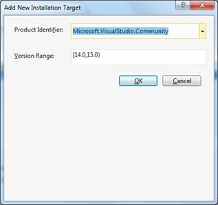
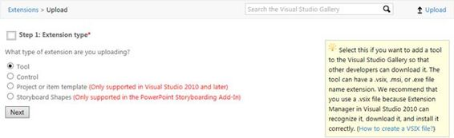
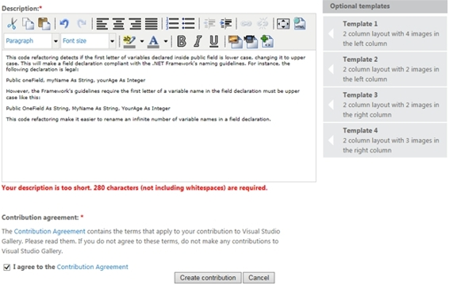
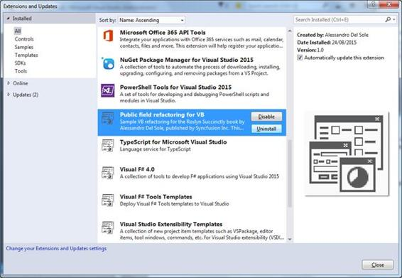

# 第 7 章将分析器和重构部署到 Visual Studio 图库

|  | 注意:本章内容不适用于 Visual Studio 2015 速成版。 |

多年来，开发人员使用 [Visual Studio Gallery](http://visualstudiogallery.com) 下载 Visual Studio 的第三方扩展(通过集成的扩展管理器工具)并发布自定义扩展，以便其他开发人员可以使用。现在，您还可以将代码分析器和重构以 Visual Studio 扩展的形式发布到 Visual Studio Gallery，并通过熟悉的 IDE 工具让其他开发人员可以使用它们。

当您创建分析器和重构时，带有代码修复的**分析器(NuGet + VSIX)** 和**代码重构(VSIX)** 模板都包含一个自动生成 VSIX 包的项目，您可以在解决方案资源管理器中轻松看到它，因为它的名称以**结尾。vsix** 。VSIX 包是编译的，自安装的。包含 Visual Studio 扩展名的 vsix 文件。如果您曾经从 Visual Studio Gallery 或集成的扩展管理器工具中为 Visual Studio 安装过扩展，您可能已经知道这样的扩展是用 VSIX 包部署的。Visual Studio 的扩展是一个. dll 库，适合插入到集成开发环境中，通过新命令、自定义工具窗口等自定义功能扩展环境。

在幕后，VSIX 包是开放的 XML 压缩文件，包含:

*   那个。dll 库。
*   一个名为 extension.vsixmanifest 的包清单，其中包含作者信息、版本号、包描述、包依赖项以及该包的 Visual Studio 版本列表等信息。
*   用户安装扩展时必须接受的许可协议。
*   一个可选的图标和预览图像，将用于在 Visual Studio 库以及“Visual Studio 扩展和更新”对话框中显示扩展。

您可以通过使用归档工具(如 WinZip 或 WinRAR)打开. VSIX 文件来轻松研究 vsix 包的内容结构。因为代码分析器和重构都是。可以插入代码编辑器的 dll 库，它们可以打包到 VSIX 文件中，并被识别为 Visual Studio 扩展。幸运的是，Visual Studio 2015 会自动为您生成 VSIX 包，使部署体验更加轻松。

|  | 注意:当您在 Visual Studio 2015 的实验实例中按 F5 调试分析器或重构时，IDE 会首先将自动生成的 VSIX 包安装到实验实例中。这对于允许您通过通常的调试工具调试分析器或重构是必要的。 |

在本章中，您将看到如何将代码重构部署到 Visual Studio 库。本节讨论代码重构，因为用于代码重构的 Visual Studio 2015 项目模板不包括对 NuGet 的支持，而只自动生成 VSIX 包。另一方面，代码分析器的项目模板自动化了 NuGet 包和 VSIX 包的生成。因此，本章中描述的步骤适用于重构和分析器。考虑到这一点，在 Visual Studio 2015 中，打开您在[第 5 章](5.html#_Chapter_5_)中创建的**public field refresh**项目。这将作为部署的基础。

在发布 VSIX 包之前，您需要编辑包清单中包含的一些信息，其中包含包描述、作者姓名、许可协议、发行说明、图标和预览图像以及文档链接等信息。包清单被称为**source . extension . vsixmindicate**，在。vsix 项目。编辑清单非常容易，因为 Visual Studio 2015 提供了一个方便的设计器，您可以通过双击解决方案资源管理器中的**source . extension . vsix manifest**来启用它。图 43 显示了如何编辑包清单。

图 43:编辑包清单

设计器由几个选项卡组成:元数据、安装目标、资产和依赖项。在元数据选项卡中，您提供了将在 Visual Studio Gallery 和扩展管理器工具中向其他开发人员显示的所有信息，这对识别和描述包非常重要。您不应该更改的一件事是产品标识字段，它包含一个唯一的标识符，该标识符包含您的产品的 GUID。您可以编辑作者姓名、产品名称，并提供软件包功能的完整描述。强烈建议您选择许可协议，该协议必须是. txt 文件。其他信息是可选的。

另一个重要的选项卡是安装目标，您可以在其中指定可以接收包的 Visual Studio 版本。当您打开此选项卡时，您将看到支持的版本列表。在写的时候不支持快递版，所以选择每个快递版，然后点击**删除**。您可能希望包含 Visual Studio 2015 社区版，因此单击**新建**。在**添加新安装目标**对话框中(见图 44)，选择**微软。从**产品标识符**组合框中选择**社区。“版本范围”字段将自动填写。完成后，点击**确定**。

图 44:指定支持的 Visual Studio 版本

此时，设计人员将显示新添加的版本，以及默认支持的 Visual Studio 专业版，如图 45 所示。

图 45:支持的 Visual Studio 版本

|  | 注意:Pro 版的意思是专业及以上，不需要指定企业版，隐式支持。 |

“资产”选项卡允许指定将打包到 VSIX 文件中的其他项目目标。“依赖项”选项卡包含扩展依赖的框架和库的列表。在分析器和代码重构的情况下，您不需要编辑这些选项卡的内容，因为它们已经为这些类型的库量身定制。然而，值得一提的是，依赖项选项卡是您可以选择指定任何可能的分析器或重构依赖项的地方。这与 NuGet 体验不同，在 NuGet 体验中，依赖关系是自动解析的。

一旦您提供了必要的信息，确保构建配置设置为**发布**并编译项目。构建过程会生成一个独立的、自安装的 VSIX 包，该包可以通过多种方式共享，或者通过双击安装在本地计算机上。在当前场景中，生成的 VSIX 包将发布到 Visual Studio 库。

|  | 提示:当您调试重构或分析器时，您在包清单中所做的更改在 Visual Studio 的实验实例中也是可见的。要演示这一点，请使用 F5 开始调试，然后打开扩展管理器工具。如果选择当前重构或分析器，您将看到更新的产品信息。 |

打开 [Visual Studio 图库](http://visualstudiogallery.com/)并使用右上角的**登录**链接使用您的微软帐户登录。登录后，您可以选择上传新的扩展和管理已发布的扩展(如果有)。点击**上传**(见图 46)启动上传向导。

图 46: Visual Studio 图库主页

您要做的第一件事是指定扩展类型。选择**工具**(见图 47)，然后点击**下一步**。

图 47:将工具指定为扩展类型

在这一步中，您将指定要上传的 VSIX 包。选择**我想上传我的工具**，然后点击**浏览**(见图 48)。

图 48:指定要上传的 VSIX 包

此时，找到并选择包含代码重构的 VSIX 包。一般来说，它位于 VSIX 项目的 **Bin\Release** 子文件夹下。在这种情况下，就是**public field refresh _ VB。为 Visual Basic 或**发布**。C#的 Vsix\Bin\Release** 。准备好之后点击**下一步**。在下一步中(参见图 49)，您将看到 Gallery 从包清单中获取的摘要信息，您将被要求执行以下操作:

*   最多选择三个类别来帮助开发人员识别扩展的目的。
*   指定免费、试用或付费的成本类别。
*   指定一个或多个标签，帮助开发人员在图库中找到您的扩展。

类别和标签完全是你的选择，但是我建议选择**编码**和**编程语言**作为类别，指定**罗斯林**作为标签。在**成本类别**下拉菜单中，选择**免费**。如果你决定使用试用或付费，实现购买逻辑是你自己的责任；Visual Studio Gallery 基本上会通知用户某个扩展不是免费的。

图 49:对包进行分类

还必须提供包装内容的详细描述。向下滚动页面并提供描述，如图 50 所示。您可以利用内置的编辑器，它还允许格式化文本和添加多媒体。

图 50:提供包描述

确保您的描述至少有 280 个字符长；否则，将出现一条错误消息(参见图 50)。完成后，阅读并接受投稿协议，点击**创建投稿**。此时，您的贡献已经被创建，您可以选择预览它对其他开发人员的表现(参见图 51)。

图 51:在公开之前回顾你的贡献

如果您对预览感到满意，并且符合您的要求，请单击**发布**，以便立即下载。如果您希望进行任何修改，请点击**编辑**。通过几个简单的步骤，您已经将代码重构发布到了 Visual Studio 库。请记住，同样的步骤也适用于分析仪。

要了解可从 Visual Studio 图库获得的分析器或重构的开发人员体验，请启动 Visual Studio 2015，然后选择**工具** > **扩展和更新**。选择**在线**标签，在搜索框中输入**罗斯林**。如图 52 所示，代码重构出现在可用扩展的列表中，还显示了包描述。

图 52:在 Visual Studio 图库中找到代码重构

点击**下载**。下载完成后，您将被要求接受包含的许可协议(参见图 53)。

图 53:接受包许可协议

当您点击**安装**时，Visual Studio 2015 将在几秒钟内完成安装操作。请注意，安装完成后，系统会要求您重新启动 Visual Studio。Visual Studio 重新启动后，创建一个新的控制台应用程序。在其中添加一个新的类和一个公共字段声明，如图 54 所示。

图 54:测试代码重构

右键点击`Public`关键字，选择**快速动作**，看看新安装的代码重构是如何完美工作的，允许你将公共字段成员标识符改为大写。

可以轻松禁用或卸载从 Visual Studio 库安装的分析器和重构。为此，选择**工具** > **扩展和更新**，并在已安装的扩展列表中，选择要禁用或删除的扩展。图 55 显示了本章中描述的代码重构。

图 55:禁用或卸载代码重构

选择**禁用**或**卸载**，但请记住，在您明确重新启用或重新安装之前，所选的重构(或分析器)将不可用于任何项目。

## 【NuGet 和 Visual Studio 图库的区别

通过 NuGet 和 Visual Studio 图库共享分析器有许多不同之处。以下是当您必须决定在何处发布作品时，您可能需要考虑的重要差异列表:

*   NuGet 包是每个项目的。每次创建新项目时，您都需要从 NuGet 安装分析器或重构。
*   VSIX 包是 Visual Studio 扩展，因此它们始终可用于新项目和现有项目。如果不希望项目使用软件包，则需要显式禁用或卸载它们。
*   NuGet 包自动解析分析器或重构可能依赖的任何依赖关系。
*   VSIX 包不会自动解析分析器或重构可能依赖的任何依赖关系。您可以在包清单的“依赖项”选项卡中手动添加依赖项。
*   VSIX 包是自安装的。这意味着您不仅可以通过 Visual Studio 图库共享. vsix 文件，还可以以任何您想要的方式共享。例如，您可以通过共享网络路径、电子邮件或 u 盘共享一个。收件人只需双击文件即可安装扩展名。安装由与操作系统集成的 VSIX Installer 引擎提供动力。
*   用新版本更新包是非常相似的。对于 NuGet 包，Visual Studio 2015 会自动更新版本号。对于 VSIX 包，可以在包清单编辑器中手动更新版本号。对于这两种情况，您可以在各自的网站中上传更新的软件包。

当然，您可以完全自由地向 NuGet 和 Visual Studio 图库发布分析器和重构。

分析器和代码重构可以以 VSIX 包的形式发布到 Visual Studio 库。分析器和重构的项目模板自动生成独立的 VSIX 包，可以通过多种方式与其他开发人员共享。Visual Studio 2015 包含一个方便的设计器，您可以使用它来编辑包清单，包清单的信息将显示给其他开发人员。关于发布，Visual Studio Gallery 允许通过几个步骤发布一个 VSIX 包，提供了一个在包信息对公众可用之前查看包信息的选项。使用以这种方式部署的分析器和重构非常简单:Visual Studio 2015 中的“扩展和更新”对话框允许以搜索和下载任何其他 Visual Studio 扩展的相同方式搜索和下载这两个组件。