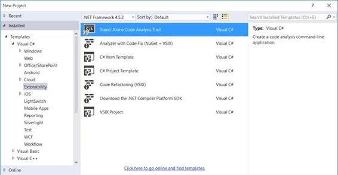
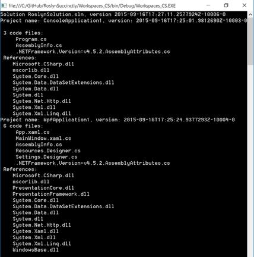
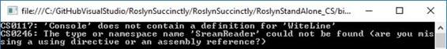

# 八、工作区，代码生成，发出

那个。NET 编译器平台不仅仅是分析器和重构。在[第 3 章](3.html#_Chapter_3_Walking)中，向您介绍了工作区 API 和编译器管道，其中包括发出阶段。本章简要介绍了工作区应用编程接口，以及如何实现代码生成和发出程序集。

工作区 API 允许您与组成 MSBuild 解决方案的所有内容进行交互，包括项目、代码文件和元数据，对象由。NET 编译器平台。大多数必要的类型都是在 Microsoft.CodeAnalysis.Workspaces.dll 程序集中定义的，加上为特定语言(如 Microsoft.CodeAnalysis.CSharp.Workspaces.dll 和 Microsoft.CodeAnalysis.VisualBasic.Workspaces.dll)定制的库。

在本章中，您将创建一个打开解决方案(。sln 文件),并列出该解决方案中的所有项目，以及每个项目的所有代码文件(文档)和引用。为了更简单的起点，您可以利用一个名为**独立代码分析工具**的项目模板，它生成一个控制台应用程序，其中包含对Roslyn应用程序接口的所有必要引用。当然，您可以在任何项目中手动添加对 Microsoft.CodeAnalysis.dll 图书馆的引用。该项目模板位于您选择的语言下的**扩展性**节点，如图 56 所示。



图 56:创建独立的代码分析应用程序

要与解决方案进行交互，您需要创建一个`Microsoft.CodeAnalysis.MSBuild.MSBuildWorkspace`类的实例，它代表一个可以用 MSBuild 解决方案和项目填充的工作空间。这个类公开了一个名为`Create`的方法，它生成工作空间，以及许多与解决方案和项目交互的方法，例如`OpenSolutionAsync`和`OpenProjectAsync`。

|  | 提示:使用智能感知发现可用方法的完整列表几乎总是最好的方法。方法名称是不言自明的，所以理解每一个方法的目的并不难。 |

代码清单 19 演示了如何在磁盘上打开一个现有的解决方案，但是请记住将解决方案路径更改为您机器上现有的路径。

代码清单 19 (C#)

```cs
            static void Main(string[] args)
            {
                // Path to an existing solution
                string solutionPath =
                       "C:\\temp\\RoslynSolution\\RoslynSolution.sln";

                // Create a workspace
                var ws = Microsoft.CodeAnalysis.
                    MSBuild.MSBuildWorkspace.
                    Create();

                // Open a solution
                var solution =
                    ws.OpenSolutionAsync(solutionPath).Result;

                // Invoke code to iterate items
                // in the solution
                // using a program-defined method
                IterateSolution(solution,
                    solutionPath);
            }

```

代码清单 19

```cs
        Sub Main()
            'Path to an existing solution
            Dim solutionPath =
                "C:\temp\RoslynSolution\RoslynSolution.sln"

            'Create a workspace
            Dim ws =
                MSBuild.
                MSBuildWorkspace.Create()

            'Open a solution
            Dim solution =
                ws.OpenSolutionAsync(
                solutionPath).Result

            'Invoke code to iterate
            'items in the solution
            'using a program-defined method
            IterateSolution(
                solution, solutionPath)
        End Sub

```

对`OpenSolutionAsync`的调用返回一个类型为`Solution`的对象，它代表一个 MSBuild 解决方案。类似地，调用`OpenProjectAsync`会产生一个类型为`Project`的对象。`Solution`公开了一个名为`Result`的相同类型的属性，它返回解决方案的实际实例。下一步是迭代解决方案中的项目列表以及每个项目的文档和引用列表。为了理解下一段代码将做什么，首先看一下图 57，它显示了基于一个 C# WPF 应用程序的结果。



图 57:迭代 MSBuild 解决方案的属性

如您所见，您需要一些代码来显示关于解决方案、项目列表以及每个项目的代码文件和引用的信息。执行此操作所需的代码如代码清单 20 所示。

代码清单 20 (C#)

```cs
            static void IterateSolution(Solution solution,
                        string solutionPath)
            {
                // Print solution's path and version
                Console.WriteLine(
                    $"Solution {System.IO.Path.GetFileName(solutionPath)},
                      version {solution.Version.ToString()}");

                // For each project...
                foreach (var prj in
                         solution.Projects)
                {
                    // Print the name and version
                    Console.WriteLine(
                        $"Project name: {prj.Name}, version:
                        {prj.Version.ToString()}");
                    // Then print the number of code files
                    Console.WriteLine(
                        $" {prj.Documents.Count()} code files:");

                    // For each code file, print the file name
                    foreach (var codeFile in
                             prj.Documents)
                    {
                        Console.
                        WriteLine($"     {codeFile.Name}");
                    }

                    Console.WriteLine(" References:");

                    // For each reference in the project
                    // Print the name
                    foreach (var reference in
                             prj.MetadataReferences)
                    {
                        Console.WriteLine(
                     $"    {System.IO.Path.GetFileName(reference.Display)}");
                    }
            }

            Console.ReadLine();
            }

```

代码清单 20

```cs
        Private Sub IterateSolution(
                    solution As Solution,
                    solutionPath As String)

            'Print solution's path and version
            Console.WriteLine(
                $"Solution {IO.Path.
                GetFileName(solutionPath)},
                version {solution.Version.ToString}")

            'For each project...
            For Each prj In solution.Projects

                'Print the name and version
                Console.
                WriteLine(
                $"Project name: {prj.Name}, version: {prj.Version.ToString}")
                'Then print the number of code files
                Console.
                WriteLine($" {prj.Documents.Count} code files:")

                'For each code file, print the file name
                For Each codeFile In
                    prj.Documents
                    Console.
                    WriteLine($"     {codeFile.Name}")
                Next

                Console.
                WriteLine(" References:")

                'For each reference in the project
                'Print the name
                For Each ref In
                    prj.MetadataReferences
                    Console.
                    WriteLine($"    {IO.Path.GetFileName(ref.Display)}")
                Next
                Console.WriteLine("")
            Next

            Console.ReadLine()
        End Sub

```

其中，`Solution`类公开了`Version`属性，表示解决方案的文件版本号。它还公开了`Projects`属性，这是`Project`对象的集合，每个对象代表解决方案中的一个项目。`Project`类公开了一个名为`Documents`的属性，一个`Document`对象的集合，每个对象代表项目中的一个代码文件。`Project`还公开了`MetadataReferences`属性，该属性表示程序集引用的集合，包括 CLR 库。

每个引用由类型为`MetadataReference`的对象表示，其`Display`属性包含程序集名称。这个例子只是展示了工作区应用编程接口功能的表面，但它让您了解了如何以. NET 方式使用解决方案、项目和文档。您可能还想考虑 [`AdHocWorkspace`](http://source.roslyn.io/#Microsoft.CodeAnalysis.Workspaces/Workspace/AdhocWorkspace.cs) 类，它也提供成员来创建项目、文档和代码文件，并将它们添加到解决方案中。

|  | 注意:这一部分要求您了解. NET 中的反射。对于使用反射的代码块，将只详细讨论与Roslyn相关的代码片段。 |

使用Roslyn应用编程接口，您可以获取源代码，编译它，并发出一个程序集。源代码可以纯文本解析为语法树或现有语法树。然后可以使用`Compilation`类执行对编译器的调用。

在本章中，您将看到如何从纯源文本生成语法树，然后如何使用`Compilation`类调用编译器来发出程序集。更具体地说，您将编写检查文本文件是否存在的源代码，并将其内容打印到控制台窗口。您还将看到如何通过导致故意错误来与诊断交互。

在开始之前，根据独立的代码分析工具项目模板，用您选择的语言创建一个新的控制台应用程序(见图 56)。实际上，`Compilation`是一个抽象类，`VisualBasicCompilation`和`CSharpCompilation`类的基类型，是为 VB 和 C#量身定制的。如您所知，`Microsoft.CodeAnalysis`命名空间公开了`VisualBasic`和`CSharp`类，它们提供了根据语言规范定制的成员。两者都提供了通过`VisualBasicSyntaxTree`和`CSharpSyntaxTree`对象以语法树的形式表示源文档的选项。这两个类都公开了一个名为`ParseText`的方法，您可以调用该方法从纯源文本生成语法树。代码清单 21 展示了如何解析源文本并生成语法树。

代码清单 21 (C#)

```cs
            private static void GenerateCode()
            {
                SyntaxTree syntaxTree =
                    CSharpSyntaxTree.ParseText(@"
        using System;
        using System.IO;

        namespace RoslynSuccinctly
        {
            public class Helper
            {
                public void PrintTextFromFile(string fileName)
                {
                    if (File.Exists(fileName) == false)
                    {
                        Console.WriteLine(""File does not exist"");
                        return;
                }

                    using (StreamReader str = new StreamReader(fileName))
                    {
                        Console.WriteLine(str.ReadToEnd());
                    }
                }
            }
        }");
        // more code goes here...
    } //end GenerateCode()

```

代码清单 21

```cs
        'Generate a syntax tree
        'from source text
        Private Sub GenerateCode()
            Dim tree = VisualBasicSyntaxTree.ParseText("
    Imports System
    Imports System.IO

    Namespace RoslynSuccinctly
        Public Class Helper

            Public Sub PrintTextFromFile(fileName As String)
                If File.Exists(fileName) = False Then
                    Console.WriteLine(""File does not exist"")
                    Exit Sub
                End If

                Using str As New StreamReader(fileName)
                    Console.WriteLine(str.ReadToEnd())
                End Using
            End Sub
        End Class
    End Namespace")

```

下一步是准备程序集的元数据。这需要获取一个程序集名称，这是通过`System.IO.Path.GetRandomFileName`方法实现的，用于演示目的，并创建一个程序集将依赖的引用列表。引用列表必须是`MetadataReference`对象的数组。`MetadataReference`曝光了一个叫`CreateFromFile`的方法。如果将类型传递给此方法，它将能够确定包含相应命名空间定义的程序集文件，并获取引用。在这种情况下，示例代码使用来自`System`和`System.IO`命名空间的对象，因此要获取对包含程序集的引用，可以将`Object`和`File`传递给数组中的每个`MetadataReference`。代码清单 22 演示了这一点。

代码清单 22 (C#)

```cs
                //Get a random file name for
                //the output assembly
                string outputAssemblyName =
                    System.IO.Path.GetRandomFileName();

                //Add a list of references from assemblies
                //By a type name, get the assembly ref
                MetadataReference[] referenceList =
                    new MetadataReference[]
                    {
                        MetadataReference.
                        CreateFromFile(typeof(object).
                        Assembly.Location),
                        MetadataReference.
                        CreateFromFile(typeof(File).
                        Assembly.Location)
                    };

```

代码清单 22

```cs
            'Get a random file name for
            'the output assembly
            Dim outputAssemblyName As String =
                Path.GetRandomFileName()

            'Add a list of references from assemblies
            'By a type name, get the assembly ref
            Dim referenceList As MetadataReference() =
                New MetadataReference() _
                {MetadataReference.
                CreateFromFile(GetType(Object).
                Assembly.Location),
                MetadataReference.
                CreateFromFile(GetType(File).
                Assembly.Location)}

```

下一步是创建新的编译。您调用`Create`方法来调用编译器，传递新的程序集名称、语法树数组、引用数组和编译选项作为参数。代码清单 23 演示了这一点。

代码清单 23 (C#)

```cs
                //Single invocation to the compiler
                //Create an assembly with the specified
                //syntax trees, references, and options
                CSharpCompilation compilation =
                    CSharpCompilation.Create(
                    outputAssemblyName,
                    syntaxTrees: new[] { syntaxTree },
                    references: referenceList,
                    options: new CSharpCompilationOptions(
                        OutputKind.DynamicallyLinkedLibrary));

```

代码清单 23

```cs
            'Single invocation to the compiler
            'Create an assembly with the specified
            'syntax trees, references, and options
            Dim compilation As VisualBasicCompilation =
                VisualBasicCompilation.
                Create(outputAssemblyName,
                       syntaxTrees:=New SyntaxTree() {tree},
                       references:=referenceList,
                       options:=New VisualBasicCompilationOptions(
                       OutputKind.DynamicallyLinkedLibrary))

```

您可以通过`AddSyntaxTrees`和`AddReferences`方法逐步添加新的语法树或引用。注意`CSharpCompilationOptions`和`VisualBasicCompilationOptions`类型如何允许指定组件的输出类型。

下一步是发出 IL 代码，这是通过在`Compilation`实例上调用`Emit`方法来完成的。如果发出阶段失败，代码将迭代诊断列表并打印它们的消息。`EmitResult`类型是`Emit`返回的类型，它公开了一个`ImmutableArray<Diagnostic>`，其中包含代码中存在的诊断列表。代码清单 24 演示了这一点。

代码清单 24 (C#)

```cs
                //Create a stream
                using (var ms = new MemoryStream())
                {
                    //Emit the IL code into the stream
                    EmitResult result = compilation.Emit(ms);

                    //If emit fails,
                    if (!result.Success)
                    {
                        //Query the list of diagnostics
                        //in the source code
                        IEnumerable<Diagnostic> diagnostics =
                            result.Diagnostics.Where(diagnostic =>
                            diagnostic.IsWarningAsError ||
                            diagnostic.Severity ==
                            DiagnosticSeverity.Error);

                        //Write ID and message for each diagnostic
                        foreach (Diagnostic diagnostic in
                            diagnostics)
                        {
                            Console.Error.
                                WriteLine("{0}: {1}",
                                diagnostic.Id,
                                diagnostic.
                                GetMessage());
                        }
                    }
                    else
                    {
                        //If emit succeeds, move to
                        //the beginning of the assembly
                        ms.Seek(0,
                            SeekOrigin.Begin);
                        //Load the generated assembly
                        //into memory
                        Assembly inputAssembly =
                            Assembly.Load(ms.ToArray());

                        //Get a reference to the type
                        //defined in the syntax tree
                        Type typeInstance =
                            inputAssembly.
                            GetType("RoslynSuccinctly.Helper");

                        //Create an instance of the type
                        object obj =
                            Activator.CreateInstance(typeInstance);

                        //Invoke the method. Replace MyFile.txt with an
                        //existing file name
                        typeInstance.
                            InvokeMember("PrintTextFromFile",
                            BindingFlags.Default |
                            BindingFlags.InvokeMethod,
                            null,
                            obj,
                            new object[]
                            { "C:\\MyFile.txt" });
                    }
            }
            } //end GenerateCode()

```

代码清单 24

```cs
            'Create a stream
            Using ms As New MemoryStream()
                'Emit the IL code into the
                'stream
                Dim result As EmitResult =
                    compilation.Emit(ms)

                'If emit fails,
                If Not result.Success Then
                    'Query the list of diagnostics in the source code
                    Dim diagnostics As _
                        IEnumerable(Of Diagnostic) =
                        result.Diagnostics.Where(Function(diagnostic) _
                        diagnostic.IsWarningAsError _
                        OrElse diagnostic.Severity =
                        DiagnosticSeverity.[Error])

                    'Write ID and message for each diagnostic
                    For Each diagnostic As _
                        Diagnostic In diagnostics

                        Console.Error.WriteLine("{0}: {1}",
    diagnostic.Id,
    diagnostic.GetMessage())
                    Next
                Else
                    'If emit succeeds, move to
                    'the beginning of the assembly
                    ms.Seek(0, SeekOrigin.Begin)

                    'Load the generated assembly
                    'into memory
                    Dim inputAssembly As Assembly =
                        Assembly.Load(ms.ToArray())

                    'Get a reference to the type
                    'defined in the syntax tree
                    Dim typeInstance As Type =
                        inputAssembly.
                        GetType("RoslynSuccinctly.Helper")

                    'Create an instance of the type
                    Dim obj As Object =
                        Activator.
                        CreateInstance(typeInstance)

                    'Invoke the method. Replace MyFile.txt with an existing
                    'file name
                    typeInstance.
                        InvokeMember("PrintTextFromFile",
                                     BindingFlags.Default Or
                                     BindingFlags.InvokeMethod,
                                     Nothing, obj,
                                     New Object() _
                                     {"C:\MyFile.txt"})
                End If

            End Using

        End Sub

```

要测试代码，调用`Main`方法中的`GenerateCode`方法。如果您提供现有文本文件的名称，您将看到其内容将如何打印到控制台窗口。这是可能的，因为您编写的源文本被解析成语法树并编译成. dll 程序集。除了测试代码如何针对现有文本文件正常工作之外，您还可以尝试在源文本中造成有意的错误，然后运行代码。因为编译器的工作不仅是生成 IL 代码，还执行代码分析，在这一点上，它将报告正确的诊断；这些可以根据需要进行分析和利用。例如，您可以将`Writeline`更改为`Witeline`，将`StreamReader`更改为`SreamReader`。图 58 显示了代码分析的结果。



图 58:Roslyn生成的源代码的代码分析结果

总之，Roslyn应用编程接口非常强大和有用，不仅可以生成和编译代码，还可以对源代码进行代码分析。

那个。NET 编译器平台不仅仅是分析器和代码重构。在本章中，我们向您概述了工作区应用编程接口和发出应用编程接口。您首先看到了如何使用工作区和`Solution`、`Project`和`Document`对象与 MSBuild 解决方案进行交互。在第二部分中，您看到了如何利用`Compilation`类基于解析的语法树生成程序集，如何从结果库中调用类型，以及如何在源代码中研究诊断。