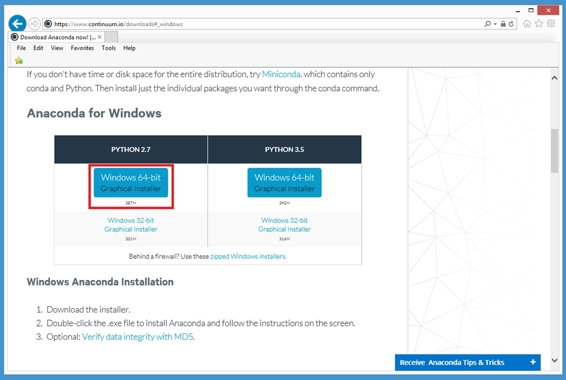
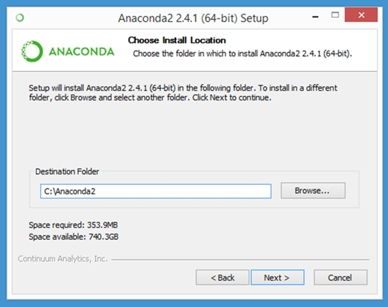
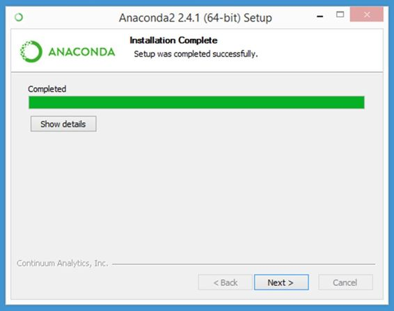
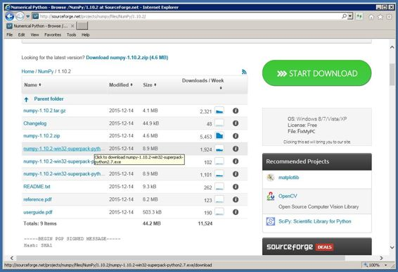
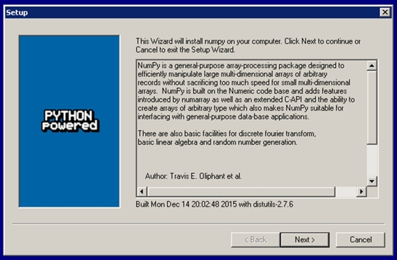
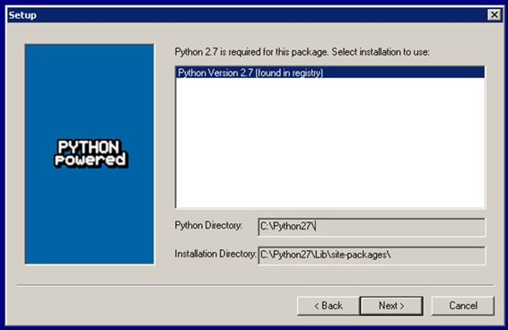
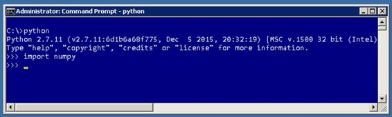
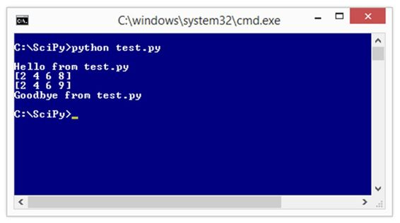
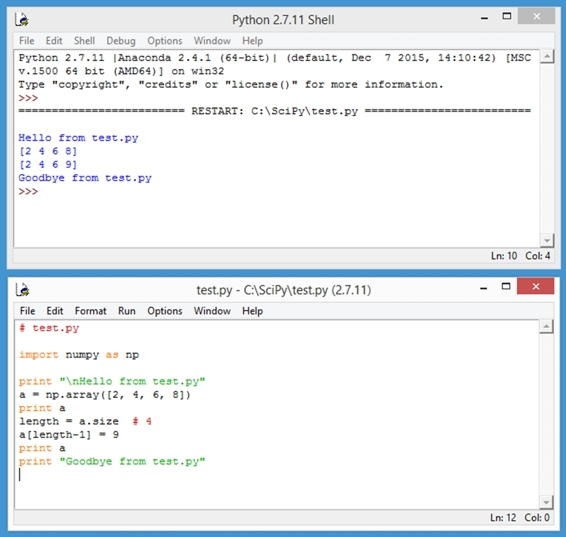

SciPy 库(科学 Python，发音为“叹气派”)是 Python 语言的开源扩展。当 Python 在 1991 年首次发布时，该语言通过设计省略了一个数组数据结构。很快就变得很明显，数值和科学计算需要一种数组类型和在数组上运行的函数。

SciPy 堆栈有三个组件:Python、NumPy 和 SciPy。Python 语言具有基本特性，例如循环控制语句和通用列表数据结构。NumPy 库(Numerical Python)具有数组和矩阵数据结构，加上一些相对简单的功能，如数组搜索。需要 NumPy 的 SciPy 库有许多处理数组和矩阵的中级和高级函数。SciPy 和 NumPy 之间有一些重叠，这意味着两个库中都有一些函数。

当 SciPy 在 2001 年首次发布时，它包含内置的数组和矩阵类型。2006 年，SciPy 的数组和矩阵功能被转移到一个新创建的 NumPy 库中，这样只需要一个数组类型的程序员就不必导入整个 SciPy 库。由于依赖性，术语 SciPy 也指 NumPy。

这本电子书没有假设你的背景或经历。即使您完全没有 Python 编程经验，您也应该能够通过一点点努力来完成。

这本电子书的每一部分都展示了一个完整的演示程序。我认识的每一个程序员，包括我在内，都是通过启动并运行一个示例程序，然后通过做出改变来进行实验，从而学会如何用一种新的语言进行编程。所以如果你想学习 SciPy，复制并粘贴演示程序的源代码，运行程序，然后摆弄程序。在 Syncfusion 的 Bitbucket [存储库中](https://bitbucket.org/syncfusiontech/scipy-programming-succinctly)找到代码示例。

我在这本电子书中采用的方法不是呈现数百个单行 SciPy 示例。相反，我试图挑选关键的例子，给你快速学习 SciPy 所需的知识。例如，第 5.4 节解释了`normal()`函数如何生成随机值。一旦你理解了`normal()`功能，你就可以很容易地理解如何使用其他 35 个分配功能，比如`poisson()`和`exponential()`功能。

在我看来，学习任何编程语言或技术最困难的部分是让第一个程序运行。之后，就是细节了。但是开始可能会令人沮丧。第一章的目的是确保您可以安装 SciPy 并运行程序。

在 1.1 节中，您将学习如何安装访问 SciPy 库所需的软件。特别是，您将看到如何安装 Anaconda 发行版，其中包括 Python、SciPy、NumPy 以及许多相关且有用的包。如果您已经安装了 Python 的现有实例，您还将学习如何单独安装 SciPy。在 1.2 节中，您将学习如何编辑和执行使用 SciPy 和 NumPy 库的 Python 程序。在 1.3 节中，您将学习一些使用 SciPy 和 NumPy 时的程序结构和风格。第 1.4 节提供了 NumPy 和 SciPy 的快速参考。

聊够了。我们开始吧。

众所周知，学习一门编程语言、库或技术的最好方法就是使用它。与许多 Python 库的安装过程不同，安装 SciPy 并不简单。简而言之，困难的关键在于 SciPy 和 NumPy 包含 C 语言例程的钩子。

可以先安装 Python，然后使用 pip (PIP Installs Packages)实用程序从源代码中单独安装 SciPy 和 NumPy 包，但这种方法可能会很麻烦。我建议您或者使用 Anaconda 发行包，或者，如果您分别安装 Python、NumPy 和 SciPy，那么您应该为 NumPy 和 SciPy 使用预构建的二进制安装程序。

|  | 注意:术语包、模块和库有不同的含义，但通常或多或少可以互换使用。 |

使用蟒蛇有几个优点。有适用于 Windows、OS X 和 Linux 的二进制安装程序。该发行版附带了 Python、NumPy 和 SciPy，以及许多其他相关的包。这意味着您有一个相对简单的安装过程。该发行版附带了 conda 开源包和环境管理器，这意味着您可以使用 Python 的多个版本。换句话说，即使您已经安装了 Python，Anaconda 也会让您在没有资源冲突的情况下使用新的 Python+scipy 安装。Anaconda 还附带了两个不错的 Python 编辑器，IDLE 和 Spyder。

开源的 Anaconda 发行版由 Continuum Analytics 公司在[http://www.continuum.io/](http://www.continuum.io/)维护。让我们一步一步地完成安装过程。我将向您展示 Windows 安装的截图，但是您应该很容易在 OS X 或任何 Linux 版本上安装。首先，使用您选择的网络浏览器进入连续分析网站，然后找到下载链接并点击它。


图 1:蟒蛇下载网站

接下来，找到相应操作系统的链接并单击它。

此时，您必须在 Python 版本 2.x 和 Python 版本 3.x 之间进行选择。如果您是 Python 新手，关键是这两个版本不完全兼容。Python 用户可以对他们更喜欢哪个 Python 版本有强烈的意见，但是对于与 SciPy 一起使用，我建议使用 Python 2.7，以保持与旧功能的兼容性。



图 2: Python 版本选择

选择 Python 版本后，您应该会看到一条消息，询问您是想要保存自解压可执行安装程序，还是想要立即运行安装程序。你两个都可以。我选择了**运行**选项。


图 3:运行可执行安装程序

安装过程从显示欢迎闪屏开始。请注意，Anaconda 发行版号(本例中为 2.4.1)与 Python 版本号(2.7)不同。


图 4:欢迎界面

点击**下一步**后，会给你一个许可协议，如果你是一个不怕法律术语惩罚的人，你可以看一下。点击**我同意**。


图 5:许可协议

接下来，您可以选择为所有用户安装，也可以只为当前用户(可能是您)安装。我建议用 Anaconda 的推荐。


图 6:用户选项

然后，您需要指定安装根目录。对于 Python 等开源软件，通常将程序安装在驱动器 C 之外的目录中，而不是 C:\Program Files 目录中。我建议安装在 C:\Anaconda2。



图 7:安装目录

接下来，您将获得一个将 Anaconda 可执行文件的位置添加到 System PATH 变量的选项，以及一个将 Anaconda Python 注册为默认值的选项。选中两个复选框，点击**安装**。


图 8:路径和集成选项

在安装过程中，您会看到一个进度条。请注意，NumPy 和 SciPy 包含在安装组件中。


图 9:蟒蛇包括 SciPy 和 NumPy

安装完成后，您将看到“安装完成”消息。如果在安装过程中有任何错误，它们会出现在这里。如果是这样，您可以阅读错误消息，修复任何错误，删除根安装目录，然后重试。



图 10:安装完成

点击**下一步**后，会看到最终完成确认消息。可以点击**完成**。


图 11:安装确认

Anaconda 安装过程的最后一步是验证您的安装是否正常。首先，验证 Python 是否已启动并运行。启动命令外壳，通过输入`cd \`命令导航到根目录。然后键入命令:

`C:\> python --version`

如果 Python 以版本信息作为响应，那么几乎可以肯定 Python 安装正确，但是您现在应该通过执行 Python 语句来验证这一点。在命令提示符下，输入命令`python`(为了可读性，我在提示符后加了一个空格):

`C:\> python`

这将启动 Python 解释器，解释器将由三个大于字符提示来指示。指示 Python 打印传统的第一条消息:

`>>> print "Hello, Python!"`

最后，通过创建和操作数组来验证 NumPy 安装是否正确。在 Python 提示符下输入以下命令:

`>>> import numpy as np
>>> a = np.array([4, 6, 8])
>>> print type(a)
>>> a[0] = 7
>>> print a
>>> exit()`


图 12:验证您的安装

**`import`** 语句将 NumPy 库带入范围，以便可以使用。 **`np`** 这个别名本来可以是别的，但是 **`np`** 是习惯性的好。

语句`a = np.array([4, 6, 8])`创建一个名为`a`的数组，该数组包含三个整数值为 4、6 和 8 的单元格。Python `type()`函数告诉你`a`实际上是一个数组(技术上是`ndarray`，代表 n 维数组)。

语句`a[0] = 7`将数组第一个单元格中的值设置为 7，覆盖原来的值 2。这里的重点是 NumPy 数组，像大多数语言中的数组一样，使用基于 0 的索引。恭喜你！你拥有探索 SciPy 和 NumPy 所需的所有软件。

您可以分别安装 Python、NumPy 和 SciPy，而不是使用 Anaconda 发行版。要安装 Python，请转到[https://www.python.org/downloads/](https://www.python.org/downloads/)并选择 3.x 或 2.x 版本的下载。我推荐 2.7 版本。安装完成后，将 C:\Python27(如果使用非默认位置，则为 python.exe 的位置)和 C:\Python27\Lib\idelib 添加到您的系统路径环境变量中。要安装 NumPy 和 SciPy，我强烈建议您使用预构建的可执行安装程序。特别是，我推荐的那些在 SourceForge 存储库中维护。先安装 NumPy。前往[http://sourceforge.net/projects/numpy/files/NumPy/](http://sourceforge.net/projects/numpy/files/NumPy/)。

那个网站有不同版本的 NumPy 和 SciPy。进入您想要安装的版本目录。我建议使用下载次数最多的最新版本。进入一个版本目录，然后寻找一个名为 numpy-1.10.2-win32-superpack-python2.7.exe 的文件。



图 NumPy 的二进制安装程序链接

确保您有对应于您的 Python 版本的版本，然后单击链接，您将获得运行安装程序的选项。

您可以选择立即运行安装程序，或者保存安装程序以便以后运行。我通常选择**运行**选项。


图 14:运行 NumPy 安装程序可执行文件

点击**运行**后，安装程序将启动并向您展示安装向导。点击**下一步**。



图 15: NumPy 安装向导

安装程序应该找到您现有的 Python 安装，并为 NumPy 库推荐一个安装目录。



图 NumPy 安装程序找到现有的 Python 安装

在接下来的几个向导页面中单击**下一步**，您将完成 NumPy 安装。您可以通过启动 Python shell 并输入命令`import numpy`来验证 NumPy 是否已安装。如果没有错误消息，则表明已安装了 NumPy。



图 17:验证单独的 NumPy 安装

现在，您可以使用完全相同的过程从 SourceForge 安装 SciPy 库。

资源

有关安装信息，包括 Anaconda 发行版的替代品，请参见
[【http://www.scipy.org/install.html】](http://www.scipy.org/install.html)。

虽然 Python 和 SciPy 可以交互使用，但是对于许多场景，您可能想要编写和执行一个程序(技术上是一个脚本)。如果您已经安装了 Anaconda 发行版，您有三种主要方法来编辑和执行 Python 程序。首先，您可以使用任何简单的文本编辑器，如记事本，并从命令行执行。其次，您可以使用 IDLE(集成开发环境)程序编辑和执行程序。第三，您可以使用 Spyder 程序进行编辑和执行。我会给你介绍每种方法。

代码清单 1:一个简单的 SciPy/NumPy 程序

```py

  # test.py

  import numpy as np
  import scipy as sp

  print "\nHello from test.py"

  a = np.array([2, 4, 6, 8])
  print a

  length = a.size  # 4
  a[length-1] = 9
  print a

  print "Goodbye from test.py"

```

启动记事本，键入或复制并粘贴代码清单 1 中显示的语句。将程序另存为任何目录下的 test.py，如 C:\SciPy。如果您使用记事本，请确保它不会增加额外的内容。文件名的扩展名。



图 18:从命令提示符执行

启动命令提示符(Windows)或命令外壳，如 bash (Linux)。导航到包含文件 test.py .的目录，通过输入以下命令执行程序:

**`> python test.py`**

使用记事本作为编辑器并从 shell 执行既简单又有效，但我建议使用 IDLE 或 Spyder。默认情况下，idle.bat 启动器文件通常位于 C:\Python27\Lib\idelib 目录中。要启动 IDLE 程序，启动一个命令外壳，导航到。如果目录不在您路径变量中，请点击文件，然后输入命令 **`idle`** 。

这将启动一个特殊的 Python Shell，如图 19 顶部所示。



图 19:使用空闲程序

从 Python Shell 菜单栏中，单击**文件** > **新文件**。这将启动一个类似的编辑器，如图 19 的底部所示。现在，将代码清单 1 中的程序键入或复制并粘贴到 IDLE 编辑器中。使用**文件** > **保存**将程序作为 test.py 保存在任何方便的目录中。点击**运行** > **运行模块**或按 F5 快捷键执行程序。

程序输出显示在 Python Shell 窗口中。一些有经验的 Python 用户批评 IDLE 过于简单，缺乏复杂的编辑和调试功能，但我非常喜欢 IDLE，它是我在大多数情况下选择的 SciPy 编程环境。


图 20:使用 Spyder 程序

Anaconda 发行版附带开源 Spyder(Science PYTHON DEVELOpMENT ENVIRoNMENT)程序。要启动 Spyder，启动命令外壳并输入:

**`> spyder`**

将代码清单 1 中的程序键入或复制并粘贴到左侧的 Spyder 编辑器窗口中。您可以先使用**文件** > **保存**保存，或者通过单击**运行** > **运行**立即执行。程序输出出现在右下角的窗口中。

资源

如果您使用 Visual Studio，请考虑位于
[【http://microsoft.github.io/PTVS/】](http://microsoft.github.io/PTVS/)的 Visual Studio(PTVS)Python 工具插件。

如果你使用 Eclipse IDE，你可能想看一下位于 http://www.pydev.org/ T2 的 PyDev 插件。

因为 Python 语言非常灵活，所以有很多方法来构造一个程序。一些有经验的 Python 程序员对于什么是好的 Python 程序结构有很强的见解。像我这样的其他程序员相信，没有一种最佳的程序结构适合所有情况。

看看代码清单 2 中的演示程序。程序以指示程序文件名和 Python 版本的注释开始。因为 Python 2.x 和 Python 3.x 版本不完全兼容，所以最好指明您的程序使用的是哪个版本。如果您使用的是 Linux，您可以选择使用类似`#!/usr/bin/env python`的 shebang 作为第一条语句。

代码清单 2: Python 程序结构演示

```py

  # structure.py
  # Python 2.7

  import numpy as np

  def >make_x(n):
    result = np.zeros((n,n))
    for i in xrange(n):
      for j in xrange(n):
        if i == j or (i + j == n-1):
          result[i,j] = 1.0
    return result

  def >main():
    print "\nBegin program structure demo \n"

    try:
      n = 5
      print "X matrix with size n = " + str(n) + " is "
      mx = make_x(n)
      print mx
      print ""

      n = -1
      print "X matrix with size n = " + str(n) + " is "
      mx = make_x(n)
      print mx
      print ""
    except Exception, e:
      print "Error: " + str(e)

    print "\nEnd demo \n"

  if __name__ == "__main__":
    main()

```

```py

  C:\SciPy\Ch1>
  python structure.py
  Begin
  program structure demo 

  X
  matrix with size n = 5 is 
  [[
  1.  0.  0.  0.  1.]
   [
  0.  1.  0.  1.  0.]
   [
  0.  0.  1.  0.  0.]
   [
  0.  1.  0.  1.  0.]
   [
  1.  0.  0.  0.  1.]]

  X
  matrix with size n = -1 is 
  Error:
  negative dimensions are not allowed

  End demo

```

接下来，演示程序导入 NumPy 库并分配一个短别名:

**`import numpy as np`**

这个习惯用法是 NumPy 和 SciPy 编程的标准用法，我建议您使用它，除非您有不这样做的具体原因。接下来，演示创建一个名为`make_x()`的程序定义函数:

**`def make_x(n):
  result = np.zeros((n,n))
  for i in xrange(n):
    for j in xrange(n):
      if i == j or (i + j == n-1):
        result[i,j] = 1.0
  return result `**

`make_x()`函数接受一个矩阵维度参数`n`(大概是一个奇数)，并返回一个主对角线(左上角单元格到右下角单元格)和次对角线值为 1.0，其他地方为 0.0 的 NumPy 矩阵。

演示使用了两个空格的缩进，而不是广泛推荐的四个空格。我在这本电子书中使用两个空格的缩进主要是为了节省空间，但说实话，我更喜欢使用两个空格。

演示程序定义了一个`main()`函数作为执行入口点:

**`def main():
  print "\nBegin program structure demo \n"
  # rest of calling statements here
  print "\nEnd demo \n"

if __name__ == "__main__":
  main()`**

使用`__main__`机制调用程序定义的`main()`函数(注意: *main* 一词前后有两个下划线字符)。与简单地将程序的调用语句放在导入语句和函数定义之后相比，定义一个`main()`函数有几个优点。

在程序中使用`main()`函数的主要缺点是编写程序需要额外的时间和空间。在这本电子书的其余部分，我没有使用`main()`功能，只是为了节省空间。

默认情况下，当 Python 解释器读取一个源代码时。py 文件，它将执行文件中的所有语句。然而，就在开始执行之前，解释器为开始执行的源文件设置一个系统变量`__name__`为值`__main__`。被调用的任何其他模块的`__name__`变量值被设置为该模块的名称。

换句话说，解释器知道哪个程序或模块是开始执行的主要程序或模块，并将只执行该程序或模块中的语句。换句话说，没有`if __name__ == "__main__"`语句的 Python 模块不会自动执行。这种机制允许您编写 Python 代码，然后将该代码导入另一个模块。实际上，这允许您编写库模块。

此外，通过使用`main()`函数，您可以避免程序定义的变量和函数名称与 Python 系统名称和关键字冲突。最后，使用`main()`函数，如果您使用除试错处理机制，您可以更好地控制控制流。

演示程序使用双引号字符来分隔字符串。与其他一些语言不同，Python 不识别单引号和双引号之间的语义差异。特别是 Python 没有字符数据类型，所以`"c"`和`'c'`都表示单个字符的字符串。

演示程序使用了除试机制(即`try`语句后跟`except`语句)。使用 try-except 在编写新代码时特别有用，但缺点是会增加时间和代码行数。本电子书剩余部分的演示程序不使用 try-除非是为了节省空间。

资源

或多或少官方的 Python 风格指南是 PEP 0008 (Python 增强提案#8)。见[https://www.python.org/dev/peps/pep-0008/](https://www.python.org/dev/peps/pep-0008/)。

许多 Python 程序员使用谷歌 Python 风格指南。参见
[https://google.github.io/styleguide/pyguide.html](https://google.github.io/styleguide/pyguide.html)。

有关 Python `try`和`except`语句和错误处理的更多详细信息，请参见
[https://docs.python.org/2/tutorial/errors.html](https://docs.python.org/2/tutorial/errors.html)。

有关在 Linux 环境中使用 shebang 的利弊的讨论，请参见
[。](https://en.wikipedia.org/wiki/Shebang_(Unix))

代码清单 3 中的程序是这本电子书中介绍的许多 NumPy 和 SciPy 函数和编程技术的快速参考。

代码清单 3:语法演示

```py

  # quick_ref.py                            # SciPy Programming
  Succinctly 
  # Python 2.7

  import numpy as np                        # arrays, matrices, functions
  import scipy.linalg as spla               # determinant, inverse, etc.
  import scipy.special as ss                # advanced functions like gamma
  import scipy.constants as sc              # math constants like e
  import scipy.integrate as si              # functions for integration
  import scipy.optimize as so               # functions for optimization
  import itertools as it                    # permutations, combinations
  import time                               # for timing

  class Permutation:                        # custom class
  using an array
    def >__init__(self, n):                  # constructor
      self.n = n
      self.data = np.arange(n)              # [0, 1, 2, . . (n-1)]

    def >as_string(self):                    # instance method
      s = "# "
      for i in xrange(self.n):              # traverse an array            
        s += str(self.data[i]) + " "
      return s + "#"

    @staticmethod
    def >my_fact(n):                         # static method
      result = 1                            # iterative rather than recursive
      for i in xrange(1, n+1):              # recursion supported in Python
        result *= i                         # but usually not a good idea
      return result 

  # ----------------------------------
  def >show_matrix(m, decimals):             # standalone function
    (rows, cols) = np.shape(m)              # matrix dimensions as tuple
    for i in rows:                          # traverse a matrix
      for j in cols:
        print "%." + str(dec) % m[i,j]
      print ""
  # ----------------------------------

  print "\nBegin quick examples \n"

  arr_a = np.array([3.0, 2.0, 0.0, 1.0])    # create array of float64
  arr_b = np.zeros(4, dtype=np.int32)       # create int array [0, 0, 0, 0]
  b = 1.0 in arr_a                          # search array using "in": True
  result = np.where(arr_a == 1.0)           # result is (array([3]),)
  arr_s = np.sort(arr_a, kind="quicksort")  # sort array: [0.0, 1.0, 2.0, 3.0]
  arr_r = arr_s[::-1]                       # reverse: [3.0, 2.0, 1.0, 0.0]

  np.random.seed(0)                         # set seed for reproducibility
  np.random.shuffle(arr_r)                  # randomize content
  order

  arr_ref = arr_a                           # copy array by reference
  arr_d = np.copy(arr_a)                    # copy array by value
  arr_v = arr_a.view()                   
    #
  copy by view reference
  arr_e = arr_a + arr_b                     # add arrays

  m_a = np.matrix([[1.0, 2.0], [3.0, 4.0]]) # matrix-style 2x2 matrix
  m_b = np.array([[8, 7], [6, 5]])          # ndarray-style 2x2 matrix
  m_c = np.zeros((2,2), dtype=np.int32)     # ndarray 2x2 matrix all 0s
  try:                                      # try-except
    m = np.loadtxt("foo.txt")               # matrix from file
  except Exception:
    print "Unable to open file"

  m_e = m_a.transpose()                     # matrix transposition
  d = spla.det(m_a)                         # matrix determinant
  m_i = np.linalg.inv(m_a)                  # matrix inverse

  m_idty = np.eye(2)                        # identity 2x2 matrix
  m_m = np.dot(m_a, m_i)                    # matrix multiplication
  b = np.allclose(m_m, m_idty, 1.0e-5)      # matrix equality by value

  m_x = m_a + np.array([5.0, 8.0])          # broadcasting

  p_it = it.permutations(xrange(3))         # permutations iterator
  start_t = time.clock()                    # timing
  for p in p_it:
    print p
  end_t = time.clock()
  elap = end_t - start_t
  print "elapsed =
  " + str(elap) + "secs"   # string concatenation

  pc = Permutation(3)                       # instantiate a custom class
  print pc.as_string()                      # instance method call
  nf = Permutation.my_fact(3)               # static method
  call

  arr = np.array([1.0, 3.0, 5.0, 7.0])      # a sorted array
  ii = np.searchsorted(arr, 2.0)            # binary search
  if ii < len(arr_s) and arr_s[ii] == 2.0:  # somewhat tricky return
    print "2.0 found"

  (perm, low, upp) = spla.lu(m_a)           # matrix LU decomposition
  med = np.median(arr_a)                    # statistics function
  rv = np.random.normal(0.0, 1.0)           # random variable generation
  g = ss.gamma(3.5)                         # advanced math function

  print "\nEnd quick reference \n"

```