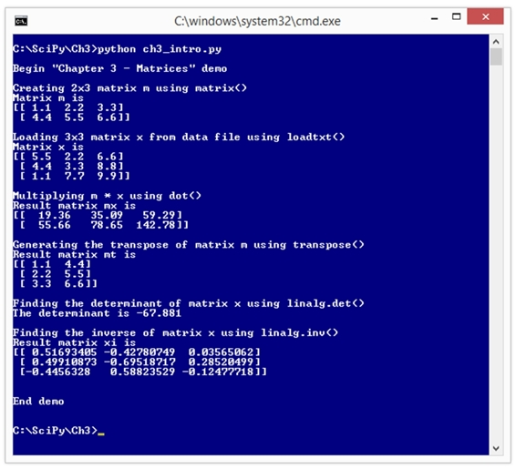

#  三、矩阵

矩阵可以说是数字和科学编程中最重要的数据结构。下面的截图显示了这一章的方向。



图 22:数字矩阵演示

在 3.1 节中，您将学习创建和初始化 NumPy 矩阵的最常见方法，并学习 NumPy 中支持的两种矩阵数据结构之间的区别。

在 3.2 节中，您将学习如何使用`dot()`函数执行矩阵乘法。

在 3.3 节中，你将学习转置矩阵的三种不同方法。

在 3.4 节中，您将了解重要的 NumPy 和 SciPy `linalg`模块，如何使用`det()`函数找到矩阵的行列式，以及行列式的用途。

在第 3.5 节中，您将学习如何使用`eye()`函数创建单位矩阵，使用`linalg.inv()`函数求矩阵的逆，以及使用`isclose()`函数正确比较两个矩阵的相等性。

在 3.6 节中，您将学习如何使用`loadtxt()`函数从文本文件中将值加载到矩阵中。

矩阵可以说是 NumPy 库最重要的特性。NumPy 支持两种矩阵:n 维数组样式矩阵和显式 NumPy 矩阵。这两种矩阵大多是相容的。NumPy 矩阵可以通过多种方式创建，但在许多数据科学场景中，三种常见的技术是使用`matrix()`函数、`array()`函数和`zeros()`函数。

代码清单 8:矩阵初始化演示

```py

  # matrices.py
  # Python 2.7

  import numpy as np

  def >show_matrix(m, dec, wid):
    fmt = "%" + str(wid) + "." + str(dec) + "f"
    (rows, cols) = np.shape(m)
    for i in xrange(rows):
      for j in xrange(cols):
        print fmt % m[i,j],
      print ""  # end of row
    print "" # final newline

  # =====

  print "\nBegin matrices demo \n"

  ma = np.matrix([[1.0, 2.0, 3.0], # 2x3
                 [4.0, 5.0, 6.0]])

  mb = np.zeros((3, 2), dtype=np.int32) # 3x2

  mc = np.array([[1.0, 2.0, 3.0], [4.0, 5.0, 6.0]]) # 2x3

  md = np.matrix([[7.0, 8.0, 9.0]]) # 1x3

  print "Matrix ma is "
  print ma
  print ""

  print "Matrix mb is "
  print mb
  print ""

  print "N-dimensional array/matrix mc is "
  print mc
  print ""

  print "Matrix ma is type " + str(type(ma))
  print "Matrix mb is type " + str(type(mb))
  print "Matrix mc is type " + str(type(mc))
  print ""

  print "Contents of matrix ma using show_matrix(ma, 3, 6) are
  "
  show_matrix(ma, 3, 6)

  msum = ma + mc
  print "Result of ma + mc = "
  print (msum)
  print ""

  md = np.matrix([[7.0, 8.0, 9.0]])
  mx = ma + md
  print "Matrix md is "
  print md
  print ""
  print "Result of ma + md is "
  print mx

  print "\nEnd demo \n"

```

```py

  C:\SciPy\Ch3>
  python matrices.py

  Begin
  matrices demo 

  Matrix
  ma is 
  [[
  1.  2.  3.]
   [
  4.  5.  6.]]

  Matrix
  mb is 
  [[0
  0]
   [0
  0]
   [0
  0]]

  N-dimensional
  array/matrix mc is 
  [[
  1.  2.  3.]
   [
  4.  5.  6.]]

  ma
  is type <class 'numpy.matrixlib.defmatrix.matrix'>
  mb
  is type <type 'numpy.ndarray'>
  mc
  is type <type 'numpy.ndarray'>

  Contents
  of matrix ma using show_matrix(ma, 3, 6) are 
   1.000 
  2.000  3.000 
   4.000 
  5.000  6.000 

  Result
  of ma + mc = 
  [[ 
  2.   4.   6.]
   [ 
  8.  10.  12.]]

  Matrix
  md is 
  [[
  7.  8.  9.]]

  Result
  of ma + md is 
  [[ 
  8.  10.  12.]
   [
  11.  13.  15.]]

  End demo

```

演示程序首先使用 NumPy `matrix()`函数创建一个矩阵:

`ma = np.matrix([[1.0, 2.0, 3.0],
                [4.0, 5.0, 6.0]])`

有两行，每行三列，所以矩阵有 2×3 的形状。因为没有指定`dtype`参数，矩阵的每个单元格都保存默认的`float64`数据类型。

接下来，演示使用 NumPy `zeros()`函数创建一个 3×2 矩阵:

`mb = np.zeros((3, 2), dtype=np.int32)`

请注意，这里使用的是两组括号，而不是用于创建简单数组的一组括号。矩阵`mb`的每个单元保存一个 32 位整数。如果省略了`dtype`参数，每个单元格都将是默认的`float64`数据类型。您很快就会看到，矩阵`mb`实际上是一个 NumPy n 维数组，而不是 NumPy 矩阵。在绝大多数编程情况下，您可以使用 NumPy 二维数组或 NumPy 矩阵。通用术语矩阵和矩阵可以指 NumPy 矩阵或 NumPy n 维数组。

接下来，演示创建了两个附加矩阵:

`mc = np.array([[1.0, 2.0, 3.0], [4.0, 5.0, 6.0]])
md = np.matrix([[7.0, 8.0, 9.0]])`

矩阵`mc`是一个 2×3 的 n 维数组，其值与显式矩阵`ma`相同。矩阵`md`是一个 1×3 的矩阵。有一行的矩阵通常称为行矩阵。有一列的矩阵称为列矩阵。例如:

`mm = np.matrix([[7.0], [8.0], [9.0]])`

行矩阵和列矩阵不同于简单的一维数组。您可以使用`reshape()`函数，例如`mm = np.reshape(md, (3,1))`，从行矩阵创建列矩阵(反之亦然)。您可以使用`flatten()`或`ravel()`函数从`ndarray`风格的矩阵中创建一个常规数组，例如:

`aa = np.array([[1.0, 2.0, 3.0], [4.0, 5.0, 6.0]])  # a 2x3 ndarray matrix
arr = np.flatten(aa)  # arr is an array [1.0, 2.0, 3.0, 4.0, 5.0, 6.0]  `

在显示矩阵`ma`、`mb`和`mc`的内容后，演示显示它们的对象类型:

`print "ma is type " + str(type(ma))  # 'numpy.matrixlib.defmatrix.matrix'
print "mb is type " + str(type(mb))  # displays 'numpy.ndarray'
print "mc is type " + str(type(mc))  # displays 'numpy.ndarray'`

概括地说，创建 NumPy 矩阵时，结果可以是显式矩阵(例如，使用`matrix()`函数时)或`ndarray`(例如，使用`zeros()`函数时)。在大多数情况下，您不必担心对象类型是什么，因为两种形式的矩阵通常(但不总是)兼容。

接下来，演示使用程序定义的`show_matrix()`功能显示矩阵`ma`的内容:

`print "Contents of matrix ma using show_matrix(ma, 3, 6) are "
show_matrix(ma, 3, 6)`

`show_matrix()`的第二个和第三个参数是显示每个单元格值时要使用的小数位数和宽度。在这种有相似参数的情况下，使用命名参数语法更易读，例如:

**`show_matrix(ma, dec=3, wid=6)`**

函数`show_matrix()`说明如何遍历矩阵:

`def show_matrix(m, dec, wid):
  fmt = "%" + str(wid) + "." + str(dec) + "f"
  (rows, cols) = np.shape(m)
  for i in xrange(rows):
    for j in xrange(cols):
      print fmt % m[i,j],
    print ""  # end of row
  print "" # final newline`

矩阵的维度是使用 NumPy `shape()`函数确定的，该函数返回一个包含行数和列数的元组。另一种方法是:

`rows = len(m)
cols = len(m[0])`

NumPy 矩阵`m`是数组的数组。所以`len(m)`是行数，`m[0]`是第一行，`len(m[0])`是第一行的单元格数，与列数相同(假设`m`所有行的列数相同)。

嵌套的`for`循环从左到右，然后从上到下迭代矩阵的单元:

`for i in xrange(rows):
  for j in xrange(cols):
    # curr cell is m[i,j]`

有趣的是，NumPy 允许您使用`m[i,j]`语法或`m[i][j]`语法访问矩阵单元格。这两种形式完全等价。在大多数情况下，首选`m[i,j]`形式，只是因为它更容易打字。

接下来，演示程序演示了矩阵加法:

`msum = ma + mc
print "Result of ma + mc = "
print msum`

回想一下`ma`和`mc`都是 2×3 矩阵，取值 1.0 到 6.0:

`[[ 1.0  2.0  3.0]
 [ 4.0  5.0  6.0]]`

毫不奇怪，结果(为了可读性，我在小数点后加了 0)是:

**`[[ 2.0   4.0   6.0]`**
` [ 8.0  10.0  12.0]]`

然而，回想一下`ma`是一个显式的 NumPy 矩阵，而`mc`是一个 NumPy `ndarray`。关键是这两种不同类型的矩阵可以毫无问题地加在一起。

接下来，演示展示了 NumPy 的一个不寻常的功能，称为广播:

`md = np.matrix([[7.0, 8.0, 9.0]])
mx = ma + md
print "Result of ma + md is "
print mx`

矩阵`ma`为 2×3。矩阵`md`为 1×3。就我所知的任何其他编程语言而言，试图将这两个矩阵相加都会产生某种错误，因为这些矩阵具有不同的形状。但是，NumPy 允许添加和返回:

`[[  8.0  100.  12.0]
 [ 11.0  13.0  15.0]]`

NumPy 本质上是将 1×3 `md`矩阵扩展为 2×3 矩阵，复制数值，使其具有与`ma`相同的形状，然后可以添加相应的单元格。我的一些同事认为 NumPy 广播是一个很棒的有用的功能。其他人认为广播是一个可疑的功能，鼓励草率的编码，并很容易导致程序错误。

资源

关于 NumPy 矩阵和数组之间区别的讨论，见
T1。

有关使用 NumPy `matrix()`功能创建矩阵的详细信息，请参见
[。](http://docs.scipy.org/doc/numpy-1.10.1/reference/generated/numpy.matrix.html)

有关使用 NumPy `array()`功能创建`ndarray`样式矩阵的详细信息，请参见
[。](http://docs.scipy.org/doc/numpy-1.10.1/user/basics.creation.html)

在许多数值编程场景中，执行矩阵乘法是一项非常常见的任务。NumPy `dot()`函数执行矩阵乘法。

代码清单 9 中的演示程序演示了使用 NumPy 的矩阵乘法。然后，程序定义了一个名为`my_mult()`的自定义函数，该函数使用嵌套循环执行矩阵乘法。程序执行从一个初步的`print`语句开始，然后演示使用 NumPy `matrix()`函数创建一个 2x3 矩阵 A 和一个 3x2 矩阵 B:

`A = np.matrix([[1.0, 2.0, 3.0],
               [4.0, 5.0, 6.0]])`

`B = np.matrix([[7.0, 8.0],
               [9.0, 10.0],
               [11.0, 12.0]])`

代码清单 9:矩阵乘法演示

```py

  # multiplication.py
  # Python 2.7

  import numpy as np

  def >my_mult(a, b):
    (arows, acols) = np.shape(a)
    (brows, bcols) = np.shape(b)
    result = np.zeros((arows, bcols))
    for i in xrange(arows):
      for j in xrange(bcols):
        for k in xrange(acols):
          result[i,j] = result[i,j] + a[i,k] * b[k,j]
    return result

  # =====

  print "\nBegin matrix multiplication demo \n"

  A = np.matrix([[1.0, 2.0, 3.0],
                 [4.0, 5.0, 6.0]])

  B = np.matrix([[7.0, 8.0],
                 [9.0, 10.0],
                 [11.0, 12.0]])

  C = np.dot(A, B) # NumPy matrix multiplication

  D = my_mult(A, B) # slower Python 

  print "Matrix A = "
  print A
  print ""

  print "Matrix B = "
  print B
  print ""

  print "Result of dot(A,B) = "
  print C
  print ""

  print "Result of my_mult(A,B) = "
  print D
  print ""

  print "End demo \n"

```

```py

  C:\SciPy\Ch3>
  python multiplication.py

  Begin matrix multiplication demo 

  Matrix
  A = 
  [[
  1.  2.  3.]
   [
  4.  5.  6.]]

  Matrix
  B = 
  [[ 
  7.   8.]
   [ 
  9.  10.]
   [
  11.  12.]]

  Result
  of dot(A,B) = 
  [[ 
  58.   64.]
   [
  139.  154.]]

  Result
  of my_mult(A,B) = 
  [[ 
  58.   64.]
   [
  139.  154.]]

  End demo

```

创建两个矩阵并显示它们的值后，我们使用 NumPy `dot()`函数计算它们的乘积，然后再次使用程序定义的`my_mult()`函数，如下所示:

`C = np.dot(A, B)
D = my_mult(A, B)`

NumPy 矩阵对象也可以使用`*`运算符相乘，例如 C = A * B，但是`ndarray`对象必须使用`dot()`函数。换句话说，`dot()`功能适用于这两种类型，因此在大多数情况下是更可取的。

演示最后显示了两个结果，以直观地验证它们是否相同:

`Result of A dot B =`

`[[  58.   64.]`

` [ 139.  154.]]`

`Result of my_mult(A,B) =`

`[[  58.   64.]`

` [ 139.  154.]]`

矩阵乘法也许最好用例子来解释。矩阵 A 的形状为 2×3，矩阵 B 的形状为 3×2。他们产品的形状是 2×2:

(2 x 3) * (3 x 2) = (2 x 2)

你可以想象两个最里面的维度，这里是 3 和 3，相互抵消，留下两个最外面的维度。例如，5×4 矩阵乘以 4×7 矩阵将具有形状 5×7。如果最里面的两个尺寸不相等，NumPy 将生成“形状不对齐”错误。

单元格[x，y]中的结果值是第一个矩阵的 x 行和第二个矩阵的 y 列中的值的乘积。所以对于演示，单元格[0，1]的结果使用矩阵 A 的第 0 行= [1，2，3]和矩阵 B 的第 1 列= [8，10，12]，给出(1 * 8) + (2 * 10) + (3 * 12) = 64。

程序定义函数`my_mult(a, b)`的实现开始于使用 NumPy `shape()`函数确定两个矩阵参数中每一个的行数和列数:

`def my_mult(a, b):
  (arows, acols) = np.shape(a)
  (brows, bcols) = np.shape(b)
. . .`

`shape()`函数返回一个元组，该元组包含矩阵中的行数和列数。您可以在此处执行错误检查，以验证两个矩阵是否一致，例如`if acols != brows: print "Error!"`。

一旦知道了两个输入矩阵的大小，就可以使用 NumPy `zeros()`函数初始化具有正确形状的结果矩阵:

`result = np.zeros((arows, bcols))`

注意双圆括号的使用，这迫使`zeros()`函数返回一个矩阵而不是一个数组。函数`my_mult()`然后遍历每行每列，将乘积之和累加并存储到结果矩阵的每个单元格中:

`for i in xrange(arows):
  for j in xrange(bcols):
    for k in xrange(acols):
      result[i,j] = result[i,j] + a[i,k] * b[k,j]
return result`

请注意，程序定义的矩阵乘法函数非常简单，但确实涉及三重嵌套`for`循环。对于小矩阵，程序定义的方法和 NumPy `dot()`函数之间的性能差异在大多数情况下可能并不显著。但是对于大型矩阵来说，程序定义的方法的较慢的性能可能是引人注目和令人讨厌的。

`dot()`函数可以应用于 NumPy 一维数组以及矩阵。例如:

`>>> import numpy as np
>>> arr1 = np.array([1, 3, 5])
>>> arr2 = np.array([6, 4, 2])
>>> arr3 = np.dot(arr1, arr2)
>>> print arr3
28`

在本例中，计算结果为(1 * 6) + (3 * 4) + (5 * 2) = 6 + 12 + 10 = 28。在数学术语中，这被称为点积(NumPy 函数的名称)、标量积或内积。

NumPy 有一个专用的`inner()`函数，只对数组有效。例如:

`>>> arr4 = np.inner(arr1, arr2)
>>> print arr4
28`

数组点积函数的一种可能的程序定义实现是:

**`def my_dotprod(a1, a2):`**`  result = 0
  for i in xrange(len(a1)):
    result = result + a1[i] * a2[i]
  return result`

`dot()`函数也可以应用于三维或更多维的数组，但这是一个相对不常见的场景。

资源

关于 NumPy `dot()`功能的更多详细信息，请参见
[。](http://docs.scipy.org/doc/numpy/reference/generated/numpy.dot.html)

有关列出大约 60 个 NumPy 矩阵函数的表格，请参见
[。](http://docs.scipy.org/doc/numpy-1.10.1/reference/generated/numpy.matrix.html)

关于包含矩阵的 NumPy `ndarray`数据类型的信息，请参见
[。](http://docs.scipy.org/doc/numpy-1.10.1/reference/arrays.ndarray.html)

一个简单但常见的矩阵运算是行和列的交换。NumPy 库支持转置矩阵`m`的三种内置方式:`m.transpose()`函数、`np.transpose(m)`函数和`m.T`属性。

代码清单 10:矩阵变换演示

```py

  # transposition.py
  # Python 2.7

  import numpy as np

  def >my_transpose(m):
    (rows, cols) = np.shape(m)
    result = np.zeros((rows, cols))
    for i in xrange(rows):
      for j in xrange(cols):
        result[j,i] = m[i,j]
    return result

  # =====

  print "\nBegin matrix transposition demo \n"

  m = np.matrix([[1., 2., 3.],
                 [4., 5., 6.],
                 [7., 8., 9.]])

  print "Matrix m = "
  print m
  print ""

  mt = m.transpose()
  print "Transpose from m.transpose() function = "
  print mt
  print ""

  mt = np.transpose(m)
  print "Transpose from np.transpose(m) function = "
  print mt
  print ""

  mt = m.T
  print "Transpose from m.T property  = "
  print mt
  print ""

  mt = my_transpose(m)
  print "Transpose from my_transpose() function = "
  print mt
  print ""

  print "\nEnd demo \n"

```

```py

  C:\SciPy\Ch3>
  python transposition.py

  Begin matrix transposition demo 

  Matrix
  m = 
  [[
  1.  2.  3.]
   [
  4.  5.  6.]
   [
  7.  8.  9.]]

  Transpose
  from m.transpose() function = 
  [[
  1.  4.  7.]
   [
  2.  5.  8.]
   [
  3.  6.  9.]]

  Transpose
  from np.transpose(m) function = 
  [[
  1.  4.  7.]
   [
  2.  5.  8.]
   [
  3.  6.  9.]]

  Transpose
  from m.T property  = 
  [[
  1.  4.  7.]
   [
  2.  5.  8.]
   [
  3\.  6.  9.]]

  Transpose
  from my_transpose() function = 
  [[
  1.  4.  7.]
   [
  2.  5.  8.]
   [
  3.  6.  9.]]

  End demo

```

演示程序首先创建并显示一个简单的 3×3 `float64`矩阵:

`m = np.matrix([[1., 2., 3.],``               [4., 5., 6.],
               [7., 8., 9.]])`

`print "Matrix m = "
print m`

这里，矩阵`m`被称为正方形矩阵，因为它的行数和列数相同。矩阵转置适用于方阵或非方阵。

接下来，演示程序使用三种不同的 NumPy 内置技术创建矩阵的换位`m`:

`mt = m.transpose()``print "Transpose from m.transpose() function = "
print mt`

`mt = np.transpose(m)
print "Transpose from np.transpose(m) function = "
print mt`

`mt = m.T
print "Transpose from m.T property  = "
print mt`

第一个函数调用使用了`ndarray`类的`transpose()`方法。注意语法是`*matrix*.transpose()`，没有参数。第二个函数调用使用 NumPy 函数，该函数接受一个矩阵作为参数。第三个调用没有括号，表示它是一个属性。在所有三个函数调用中，原矩阵`m`不变。如果你想改变一个矩阵，你可以使用一个类似于`m = np.transpose(m)`的调用模式。

一个直接而明显的问题是:为什么矩阵有三种转置方法？没有好的答案。像 NumPy 和 SciPy 这样的开源项目的优势之一是它们是协作的努力。然而，这种优势被库中一定量的冗余所抵消。基本上，当你使用 NumPy 和 SciPy 时，你通常可以用几种方法来执行一项任务，而且通常没有明确的最佳方法。

演示程序最后调用了一个名为`my_transpose()`的自定义转置函数:

`mt = my_transpose(m)` `Function my_transpose() is defined:`

`def my_transpose(m):
  (rows, cols) = np.shape(m)
  result = np.zeros((rows, cols))
  for i in xrange(rows):
    for j in xrange(cols):
      result[j,i] = m[i,j]
  return result`

使用程序定义的`my_transpose()`没有任何好处，除非你需要以某种方式自定义换位行为。

资源

矩阵转置的三种内置 NumPy 方式详见:

[http://docs . scipy . org/doc/NumPy-1 . 10 . 1/reference/generated/NumPy .转置. html](http://docs.scipy.org/doc/numpy-1.10.1/reference/generated/numpy.transpose.html)
[http://docs . scipy . org/doc/NumPy-1 . 10 . 0/reference/generated/NumPy . ndarray .转置. html](http://docs.scipy.org/doc/numpy-1.10.0/reference/generated/numpy.ndarray.transpose.html)
http://docs . scipy。

矩阵的行列式是表示矩阵是否有逆的值(如果行列式为 0.0，则矩阵没有逆)。行列式还表示一组向量是否线性相关，以及一个线性方程组有多少解。NumPy 和 SciPy 在它们的`linalg`(线性代数)子模块中都有一个`det()`函数。

代码清单 11:矩阵行列式演示

```py

  # determinants.py
  # Python 2.7

  import numpy as np

  def >extract(m, col):
    # return n-1 x n-1 submatrix w/o row 0 and col 
    n = len(m)
    result = np.zeros((n-1, n-1))
    for i in xrange(1, n):
      k = 0
      for j in xrange(n):
        if j != col:
          result[i-1,k] = m[i,j]
          k += 1
    return result

  def >my_det(m): # inefficient!
    n = len(m)
    if n == 1:
      return m[0]
    elif n == 2:
      return (m[0,0] * m[1,1]) - (m[0,1] * m[1,0])
    else:
      sum = 0.0
      for k in xrange(n):
        sign = -1
        if k % 2 == 0:
          sign = +1
        subm = extract(m, k)
        sum = sum + sign * m[0,k] * my_det(subm)
      return sum

  # =====

  print "\nBegin matrix determinant demo \n"

  m = np.matrix([[1., 4., 2., 3.],
                 [0., 1., 5., 4.],
                 [1., 0., 1., 0.],
                 [2., 3., 4., 1.]])

  print "Matrix m is "
  print m
  print ""

  d = np.linalg.det(m)
  print "Determinant of m using np.linalg.det() is "
  print d
  print ""

  d = my_det(m)
  print "Determinant of m using my_det() is "
  print d
  print ""

  print "\nEnd demo \n"

```

```py

  C:\SciPy\Ch3>
  python determinants.py

  Begin matrix determinant demo 

  Matrix
  m is 
  [[
  1.  4.  2.  3.]
   [
  0.  1.  5.  4.]
   [
  1.  0.  1.  0.]
   [
  2.  3.  4.  1.]]

  Determinant
  of m using np.linalg.det() is 
  -40.0

  Determinant
  of m using my_det() is 
  -40.0

  End demo

```

演示程序首先创建并显示一个 4×4 `float64`矩阵:

`m = np.matrix([[1., 4., 2., 3.],
               [0., 1., 5., 4.],
               [1., 0., 1., 0.],
               [2., 3., 4., 1.]])

print "Matrix m = "
print m`

行列式只适用于方阵(行数和列数相同的方阵)。最简单的情况(1×1 单值矩阵除外)是 2×2 矩阵。考虑演示矩阵左下角的 2×2 矩阵:

**`1.0  2.0
3.0  4.0`**

这个矩阵的行列式是(1.0 * 4.0)-(2.0 * 3.0)= 4.0-6.0 =-2.0。换句话说，计算一个 2×2 矩阵的行列式，你取左上乘以右下，再减去右上乘以左下。

方阵的行列式总是存在的，但它可以为零。例如，考虑这个矩阵:

**`3.0  2.0
6.0  4.0`**

行列式为(3.0 * 4.0)-(2.0 * 6.0)=(12.0-12.0)= 0。行列式为零的矩阵没有逆矩阵。

对于 3×3 及更大的矩阵，行列式的数学定义是递归的。假设 3×3 矩阵为:

**`a  b  c
d  e  f
g  h  i`**

在此，`a`、`b`、`c`等。，表示任意数字。决定因素是:


图 23:3×3 矩阵行列式的定义

请注意，您必须通过移除第一行和每个 *n* 列来提取大小为 *n* -1 × *n* -1 的 *n* 子矩阵。从头开始写代码计算尺寸大于 3×3 的矩阵的行列式是非常困难的，但是有了 NumPy 和 SciPy，你所要做的就是调用`linalg.det()`函数。

演示程序找到它创建的矩阵的行列式，如下所示:

`d = np.linalg.det(m)
print "Determinant of m using np.linalg.det() is "
print d`

简单易行。NumPy `linalg`子模块目前有 28 个函数对矩阵进行操作，包括`det()`函数。较大的 SciPy `linalg`子模块有 82 个功能。

有趣的是，SciPy `linalg`子模块包含一个略有不同的`det()`函数。`det()`的 SciPy 版本有一个参数`overwrite_a`，允许在行列式的计算过程中改变矩阵，从而提高性能。许多函数同时出现在 NumPy 和 SciPy 库中，这既是有用的，也可能是混淆的来源。

这个演示有一个程序定义的函数`my_det()`，可以计算矩阵的行列式。让我强调一下，程序定义的函数效率非常低，并且仅用于演示高级的 NumPy 和 SciPy 编程技术。除非你想演示一种糟糕的矩阵行列式计算方法，否则不应该使用自定义的`my_det()`函数。

函数`my_det()`使用与 NumPy `det()`函数相同的调用签名:

**`d = my_det(m)
print "Determinant of m using my_det() is "
print d`**

函数`my_det()`是递归的，意思是它调用自己。`my_det()`函数还调用一个辅助函数`extract()`，定义如下:

`def extract(m, col):
  n = len(m)
  result = np.zeros((n-1, n-1))
  for i in xrange(1, n):
    k = 0
    for j in xrange(n):
      if j != col:
        result[i-1,k] = m[i,j]
        k += 1
  return result`

函数`extract(m, col)`接受一个 *n* × *n* 矩阵`m`并返回一个 *n-1* × *n-1* 矩阵，其中第一行和第一列`col`已被删除。`my_det()`中的键码是:

`for k in xrange(n):
  sign = -1
  if k % 2 == 0: sign = +1
    subm = extract(m, k)
    sum = sum + sign * m[0,k] * my_det(subm)`

每个`n`子矩阵被提取并且`my_det()`被递归调用。很少有递归代码是好选择的情况，计算矩阵的行列式不在其中。`det()`的 NumPy 和 SciPy 实现使用了一种叫做矩阵分解的技术，这种技术很复杂，但是非常有效。

资源

关于`det()`功能的详细信息，请参见
T2。

关于 SciPy `det()`功能的详细信息，请参见
[http://docs . SciPy . org/doc/SciPy-0 . 15 . 1/reference/generated/SciPy . linalg . det . html](http://docs.scipy.org/doc/scipy-0.15.1/reference/generated/scipy.linalg.det.html)。

数值编程中最常见和最重要的操作之一是求矩阵的逆。NumPy 和 SciPy `linalg.inv()`函数执行矩阵求逆。

代码清单 12 中的演示程序演示了使用 NumPy 进行矩阵求逆。像往常一样，在代码的顶部，程序将 NumPy 库带入范围，并提供了一个方便的别名:`import numpy as np`。

因为`inv()`函数是 NumPy `linalg`(线性代数)子模块的一部分，所以另一种方法是使用`from numpy import linalg`语句。然后，演示程序定义了一个名为`my_close()`的自定义函数，该函数确定两个矩阵是否相等，即所有对应的单元格值是否相等或接近相等，在某个小容差范围内。

程序执行从一个初步的`print`语句开始，然后演示使用 NumPy `matrix()`函数创建一个 3×3 矩阵`m`，明确指定数据类型:

`m = np.matrix([[3, 0, 4],
               [2, 5, 1],
               [0, 4, 5]], dtype=np.float64)`

代码清单 12:矩阵求逆演示

```py

  # inversion.py
  # Python 2.7

  import numpy as np

  def >my_close(m1, m2, eps):
    (rows, cols) = np.shape(m1)
    for i in xrange(rows):
      for j in xrange(cols):
        if abs(m1[i,j] - m2[i,j]) > eps:
          return False
    return True

  # =====

  print "\nBegin matrix inversion demo \n"

  m = np.matrix([[3, 0, 4],
                 [2, 5, 1],
                 [0, 4, 5]], dtype=np.float64)

  print "Matrix m is"
  print m
  print ""

  mi = np.linalg.inv(m)
  print "The inverse of m is"
  print mi
  print ""

  idty = np.eye(3)
  print "The 3x3 identity matrix idty is"
  print idty
  print ""

  print "Product of mi * m is"
  mim = np.dot(mi, m)
  print mim
  print ""

  b1 = np.allclose(mim, idty)
  print "Comparing mi * m with idty using np.allclose()
  gives"
  print str(b1)
  print ""

  b2 = my_close(mim, idty, 1.0e-4)
  print "Comparing mi * m with idty using my_close() gives"
  print str(b2)

  print "\nEnd demo\n"

```

```py

  C:\SciPy\Ch3>
  python inversion.py

  Begin matrix inversion demo 

  Matrix
  m is
  [[
  3.  0.  4.]
   [
  2.  5.  1.]
   [
  0.  4.  5.]]

  The
  inverse of m is
  [[
  0.22105263  0.16842105 -0.21052632]
   [-0.10526316 
  0.15789474  0.05263158]
   [
  0.08421053 -0.12631579  0.15789474]]

  The
  3x3 identity matrix idty is
  [[
  1.  0.  0.]
   [
  0.  1.  0.]
   [
  0.  0.  1.]]

  Product
  of mi * m is
  [[ 
  1.00000000e+00  -1.11022302e-16   0.00000000e+00]
   [ 
  0.00000000e+00   1.00000000e+00   0.00000000e+00]
   [ 
  0.00000000e+00   1.11022302e-16   1.00000000e+00]]

  Comparing
  mi * m with idty using np.allclose() gives
  True

  Comparing
  mi * m with idty using my_close() gives
  True

  End
  demo

```

矩阵`m`可以使用`array()`功能创建为一个 *n* 维数组:

`m = np.array([[3., 0., 4.],[2., 5., 1.],[0., 4., 5.]])`

创建矩阵`m`并显示其值后，矩阵的逆矩阵计算和显示如下:

`mi = np.linalg.inv(m)
print "The inverse of m is"
print mi`

如果在脚本的顶部使用了`from numpy import linalg`语句，那么`inv()`函数可以被称为`linalg.inv(m)`来代替。`inv()`函数仅适用于行列式不等于零的方阵(行数和列数相等)。返回值是一个正方形矩阵，其形状与原始矩阵相同。

矩阵求逆是数值处理中最具技术挑战性的算法之一。相信我，你并不想尝试编写自己的自定义矩阵求逆函数，除非你愿意花费大量的时间和精力，大概是因为你需要实现一些专门化的行为。

不是所有的矩阵都有逆矩阵。如果对这样的矩阵应用`inv()`函数，就会得到“奇异矩阵”误差。因此，您需要首先检查以下内容:

`d = np.linalg.det(m)
if d == 0.0:
  print "Matrix does not have an inverse"
else:
  mi = np.linalg.inv(m)`

接下来，演示创建并显示一个 3x3 的身份矩阵:

`idty = np.eye(3)
print "The 3x3 identity matrix idty is"
print idty`

单位矩阵是正方形矩阵，其中从左上角到右下角的对角线上的单元格包含 1.0 值，所有其他单元格包含 0.0 值。

在普通算术中，某个数 *x* 的倒数是 1/ *x* 。例如，3 的倒数是 1/3。请注意，任何数乘以它的倒数等于 1。单位矩阵类似于普通算术中的数字 1。任何矩阵乘以它的逆矩阵等于单位矩阵。

演示通过将原始矩阵`m`乘以其逆矩阵`mi`并显示结果来验证逆矩阵是否正确，该结果实际上是单位矩阵:

`print "Product of mi * m is"
mim = np.dot(mi, m)
print mim`

由于`print`语句的默认格式，输出有些难以阅读:

`Product of mi * m is
[[  1.00000000e+00  -1.11022302e-16   0.00000000e+00]
 [  0.00000000e+00   1.00000000e+00   0.00000000e+00]
 [  0.00000000e+00   1.11022302e-16   1.00000000e+00]]`

如果你仔细观察，你会发现主对角线元素是 1.0，其他单元格值非常非常接近 0.0。在简单的场景中，两个矩阵(原始矩阵乘以其逆矩阵的乘积和单位矩阵)相等的视觉验证很好，但是在许多情况下，编程方法更好。演示通过两种方式比较矩阵乘以逆矩阵(`mim`)和单位矩阵:

`b1 = np.allclose(mim, idty)
print "Comparing mi * m with idty using np.allclose() gives"
print str(b1)

b2 = my_close(mim, idty, 1.0e-4)
print "Comparing mi * m with idty using my_close() gives"
print str(b2)`

一般来说，比较两个保存浮点值的矩阵是否完全相等是一个坏主意，因为浮点值有一些存储限制，因此有时只是它们真实值的近似值。例如:

`>>> x = 0.17 + 0.17  # 0.34
>>> y = 0.30 + 0.04  # 0.34
>>> b = (x == y)     # 0.34 == 0.34 should be True
>>> print b
False                # oops`

NumPy `allclose()`函数接受两个矩阵，如果两个矩阵具有相同的形状并且所有对应的单元格值对彼此非常接近(在 1.0e-5 (0.00001)内)，则返回`True`，否则返回`False`。如果默认的 1.0e-5 公差不合适，您可以向`allclose()`功能传递不同的公差参数。例如，以下语句:

`b1 = np.allclose(mim, idty, 1.0e-8)`

只有当矩阵`mim`和`idty`中所有对应的单元格彼此在 1.0e-8 以内时，才会返回`True`。

演示程序定义了一个名为`my_close()`的自定义方法，其功能类似于 NumPy `allclose()`函数。除非您需要实现某种特定的行为，比如对不同的行或列有不同的容差，否则编写这样的自定义函数没有任何好处。

程序定义功能`my_close()`实现如下:

`def my_close(m1, m2, eps):
  (rows, cols) = np.shape(m1)
  for i in xrange(rows):
    for j in xrange(cols):
      if abs(m1[i,j] - m2[i,j]) > eps:
        return False
  return True`

功能`my_close()`不检查其两个矩阵参数是否形状相同。你可以这样做:

`(rows_m1, cols_m1) = np.shape(m1)
(rows_m2, cols_m2) = np.shape(m2)
if rows_m1 != rows_m2 or cols_m1 != cols_m2:
  return None`

`inv()`的 SciPy 版本有一个`overwrite_a`参数，允许在计算逆矩阵时覆盖原始矩阵中的单元格值。例如:

`import numpy as np
import scipy.linalg as spla
m = np.random.rand(10, 10)
d = np.linalg.det(m)
if d == 0:
  print "Matrix does not have inverse"
else:
  mi = spla.inv(m, overwrite_a=True)`

这段代码创建一个随机值在[0.0 和 1.0]范围内的 10×10 矩阵，然后计算矩阵的逆矩阵，允许改变矩阵值以提高性能。然而，当我使用这种方法时，我从未见过原始矩阵随着这种形式的函数调用而改变。

资源

有关 NumPy 矩阵`inv()`功能的更多详细信息，请参见
[。](http://docs.scipy.org/doc/numpy/reference/generated/numpy.linalg.inv.html)

关于 NumPy `allclose()`功能的更多详细信息，请参见
[。](http://docs.scipy.org/doc/numpy/reference/generated/numpy.allclose.html)

关于`eye()`功能的信息，请参见
T2。

`inv()`功能的 SciPy 版本信息，见
[http://docs . SciPy . org/doc/SciPy/reference/generated/SciPy . linalg . inv . html](http://docs.scipy.org/doc/scipy/reference/generated/scipy.linalg.inv.html)。

## 加载矩阵

在许多实际场景中，您会希望从文本文件中将数据读入矩阵。NumPy `loadtxt()`功能非常通用，可以处理大多数情况。如果您需要特殊的行为，也可以使用自定义函数将数据从文本文件加载到矩阵中。

代码清单 13:从文本文件演示中加载矩阵数据

```py

  # loadingdata.py
  # Python 2.7

  import numpy as np

  def >my_load(fn, sep):
    f = open(fn, "r")

    rows = 0; cols = 0
    for line in f:
      rows += 1
      cols = len(line.strip().split(sep))

    result = np.zeros((rows,cols)) # make matrix

    f.seek(0) # back to start of file

    i = 0 # row index
    while True:
      line = f.readline()
      if not line: break
      line = line.strip()
      tokens = line.split(',') # a list
      for j in xrange(cols):
        result[i,j] = np.float64(tokens[j])
      i += 1

    f.close()
    return result

  # =====

  print "\nBegin matrix load demo \n"

  fn = r"C:\SciPy\Ch3\datafile.txt"

  m = np.loadtxt(fn, delimiter=',')
  print "Matrix loaded using np.loadtxt() = "
  print m
  print ""

  m = my_load(fn, sep=',')
  print "Matrix loaded using my_load() = "
  print m
  print ""

  print "\nEnd demo\n"

```

```py

  C:\SciPy\Ch3>
  python loadingdata.py

  Begin matrix load demo 

  Matrix
  loaded using np.loadtxt() = 
  [[
  1.  2.]
   [
  3.  4.]
   [
  5.  6.]
   [
  7.  8.]]

  Matrix
  loaded using my_load() = 
  [[
  1.  2.]
   [
  3.  4.]
   [
  5.  6.]
   [
  7.  8.]]

  End
  demo

```

演示程序首先指定源数据文件的位置:

`fn = r"C:\SciPy\Ch3\datafile.txt"`

这里，`fn`代表文件名。`r`限定符代表*原始的*，并告诉 Python 解释器将反斜杠视为文字，而不是转义序列的开始。文件`datafile.txt`是一个简单的逗号分隔的文本文件，没有标题:

**`1.0, 2.0
3.0, 4.0
5.0, 6.0
7.0, 8.0`**

接下来，演示创建并加载一个矩阵，如下所示:

`m = np.loadtxt(fn, delimiter=',')
print "Matrix loaded using np.loadtxt() = "
print m`

`delimiter`参数告诉`loadtxt()`每一行的值是如何分开的。默认值是任何空白字符(空格、制表符、换行符)，因此在这种情况下参数是必需的。

除了必需的`fname`参数和可选的`delimiter`参数外，`loadtxt()`还有七个附加的可选参数。其中，根据我的经验，最常用的三个参数是`comments`、`skiprows`和`usecols`。例如，假设一个数据文件是:

`colA : colB : colC
1.0 : 2.0 : 3.0
4.0 : 5.0 : 6.0
$ some comment
7.0 : 8.0 : 9.0`

以下语句的意思是:跳过第一行，将带有“$”或“%”的行视为注释，只加载第 0 列和第 2 列。

`m = np.loadtxt(fn, delimiter=':', comments=['$', '%'], skiprows=1,
  usecols=[0,2]) `

虽然`loadtxt()`相当全能，但是它不处理的场景很多。在这些情况下，编写自定义加载函数很容易。演示程序定义了这样一个功能:

`def my_load(fn, sep):
  f = open(fn, "r")
  rows = 0; cols = 0
  for line in f:
    rows += 1
    cols = len(line.strip().split(sep))
  result = np.zeros((rows,cols)) # make matrix
  f.seek(0) # back to start of file
  i = 0     # row index
  while True:
    line = f.readline() # read a line of data
    if not line: break  # end of file?
    line = line.strip() # remove whitespace from line
    tokens = line.split(',') # split line items into a list
    for j in xrange(cols):   # store each item in the curr row
      result[i,j] = np.float64(tokens[j])
    i += 1  # next row
  f.close()
  return result`

函数`my_load()`对文件进行初步扫描，以确定有多少行和多少列，然后创建一个具有适当形状的矩阵，重置文件读取指针，并进行第二次扫描，以读取、解析和存储数据文件中的每个值。有几种可供选择的设计可以使用。

资源

关于`loadtxt()`功能的详细信息，请参见
T2。

关于可以处理缺失值的 NumPy 函数`genfromtxt()`的详细信息，请参见
[http://docs . scipy . org/doc/NumPy-1 . 10 . 0/reference/generated/NumPy . genfroxt . html](http://docs.scipy.org/doc/numpy-1.10.0/reference/generated/numpy.genfromtxt.html)。