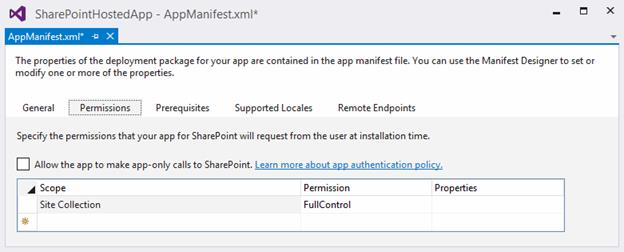

# 四、SharePoint 托管应用

如前几章所述，SharePoint 托管的应用程序是一种完全托管在 SharePoint 上的特定子网站(称为应用程序网站)中的应用程序。无法再执行服务器端代码，这种类型的应用程序迫使我们使用客户端技术(如 HTML 5 和 JavaScript)创建具有完全图形化界面的业务逻辑。实际上，您可以创建这样的应用程序来调用外部服务，但我们稍后会谈到这一点。感谢办公开发工具，我们拥有创建项目所需的模板。

## 项目

让我们讨论如何使用 Visual Studio 2013 创建我们的第一个 SharePoint 托管应用程序。

打开 Visual Studio。通过选择模板“办公室/SharePoint”创建新项目，然后选择“应用程序”并选择“适用于 SharePoint 2013 的应用程序”:


图 10: SharePoint 应用程序模板

与 Visual Studio 中的任何项目一样，给它一个名称和路径。

在这一点上，Visual Studio 要求我们输入信息(稍后可以修改)，包括应用程序的名称、我们要在其上执行调试的站点以及我们要创建的应用程序的类型。在这种情况下，选择 SharePoint 托管，如图 11 所示:


图 11:主机类型的选择

如果使用 Office 365，Visual Studio 会提示您登录以便进行调试。然后，您可以安装该应用程序(也可以跳过此步骤，稍后登录)。


图 12: Office 365 登录

完成这一步后，我们在 Visual Studio 中有了一个新的 SharePoint 项目。新创建的项目的结构如图 13 所示。


图 13:解决方案资源管理器

如您所见，有几个项目项依次由几个文件组成。称为内容、图像、页面和脚本的项目项是 SharePoint 模块。

|  | 注意:模块使得将“虚拟文件”(或内容数据库)中的文件部署到 SharePoint 成为可能，因此您可以通过特定的网址使这些文件可用。 |

这些模块包含必须安装在 SharePoint 中的所有文件，更具体地说，是要创建的 web 应用程序中的所有文件。在“页面”模块中，您可以找到包含实现这个小应用程序示例的标记的 Default.aspx 页面。脚本模块包含应用程序工作所需的所有 JavaScript 文件。在内容和图像模块中，有使用这个应用程序的 CSS 文件和图像。通过打开 App.js 文件，我们可以找到以下代码:

```js
          'use strict' ;

          var  context = SP.ClientContext.get_current();
          var  user = context.get_web().get_currentUser();

          // This code runs when the DOM is ready and creates a context object which is needed to use the SharePoint object model.
           $(document).ready(function  () {
               getUserName();
           });

          // This function prepares, loads, and then executes a SharePoint query to get the current user’s information.
          function  getUserName() {
               context.load(user);
               context.executeQueryAsync(onGetUserNameSuccess,
                                        onGetUserNameFail);
           }

          // This function is executed if the above call is successful.
          // It replaces the contents of the 'message' element with the username.
          function  onGetUserNameSuccess() {
               $('#message' ).text('Hello '  + user.get_title());
          }

          // This function is executed if the above call fails.
          function  onGetUserNameFail(sender, args) {
               alert('Failed to get user name. Error:' + args.get_message());
           }

```

这段代码使用 JavaScript 中的 CSOM 来做一些非常简单的事情，帮助您检索当前运行该应用程序的用户的用户名。

成功恢复用户名后，使用 jQuery 在 Default.aspx 页面的一个段落中设置该值；否则，您将收到包含错误消息的警报。

我们将在接下来的章节中分析 CSOM，但是请记住，因为我们在一个 SharePoint 托管的应用程序中，所以我们只能使用 JavaScript 实现。

这里需要注意的一个非常有趣的事情是，SharePoint 解决方案、特性和包有两个共同点:例如，我们可以去添加一个列表或一个自定义操作或其他工件。

为什么呢？因为 SharePoint 的所有工件，如列表和内容类型，也可以通过经典系统(WSPs)发布，但这次是以完全透明的方式。在接下来的章节中，我们将学习如何。

## 应用清单

项目中还有另一个文件:AppManifest.xml。这个文件是应用程序清单，我们甚至可以在提供者托管的应用程序中找到它(如前几章所述):


图 14:常规选项卡

我们看到的是应用程序清单的图形设计者。我们可以打开文件并显示其 XML 内容:

```js
          <?xml version= "1.0 " encoding= "utf-8 " ?>
          <!--Created:cb85b80c-f585-40ff-8bfc-12ff4d0e34a9-->
          <App XMLns= "http://schemas.microsoft.com/sharepoint/2012/App/manifest "
               Name= "SharePointApp1 "
               ProductID= "{6d3a5861-3593-4af7-9673-df0d350d8ae9} "
               Version= "1.0.0.0 "
               SharePointMinVersion= "16.0.0.0 ">
            <Properties>
              <Title> SharePointApp1</Title>

          <StartPage> ~appWebUrl/Pages/Default.aspx?{StandardTokens}</StartPage>  </Properties>

            <AppPrincipal>
              <Internal />
            </AppPrincipal>

          </App>

```

从平面设计师那里可以看出，我们可以添加很多信息。

如果我们转到“权限”选项卡，我们将看到应用程序安全性的配置；在这里，我们还可以指出应用程序必须拥有哪些权限才能工作:



图 15:权限选项卡

“先决条件”选项卡允许您配置应保证在应用程序中工作的所有先决条件(例如，SharePoint 服务):


图 16:先决条件选项卡

“支持的语言环境”选项卡用于指示应用程序可用的语言。对于每种语言，它将生成一个资源文件，然后可以在您的页面中使用。


图 17:支持的区域设置选项卡

“远程端点”选项卡指示应用程序最终将连接到的外部服务，以便读取或使用数据。如果应用程序清单中不存在未经授权的调用，SharePoint 会检查跨域调用并阻止这些调用。我们将在接下来的几章中看到更多关于这方面的细节。


图 18:远程端点

结果如下:

```js
          <?xml version= "1.0 " encoding= "utf-8 " ?>
          <!--Created:cb85b80c-f585-40ff-8bfc-12ff4d0e34a9-->
          <App XMLns= "http://schemas.microsoft.com/sharepoint/2012/App/manifest "
               Name= "SharePointHostedApp "
               ProductID= "{6d3a5861-3593-4af7-9673-df0d350d8ae9} "
               Version= "1.0.0.0 "
               SharePointMinVersion= "16.0.0.0 ">
            <Properties>
              <Title> SharePointHostedApp</Title>
              <StartPage> ~appWebUrl/Pages/Default.aspx?{StandardTokens}
              </StartPage>
               <SupportedLocales>
                <SupportedLocale CultureName="en" />
              </SupportedLocales>
            </Properties>

            <AppPrincipal>
              <Internal />
            </AppPrincipal>
            <AppPermissionRequests>
              <AppPermissionRequest
		Scope="http://sharepoint/content/sitecollection"               Right="FullControl" />
            </AppPermissionRequests>
            <AppPrerequisites>
              <AppPrerequisite Type="Capability"
          ID="132084D8-5DA6-4EAB-A636-3ADF44151846" />
            </AppPrerequisites>
            <RemoteEndpoints>
              <RemoteEndpoint Url= "http://www.test.com " />
            </RemoteEndpoints>
          </App>

```

在 XML 语法中，起始页的地址是第一部分，值 **~appWebUrl** 。该值将在安装过程中被替换为与正在创建的应用程序网站的网址相对应的值。

## 总结

在本章中，我们学习了如何创建和构建 SharePoint 托管的应用程序。如前所述，该应用程序必须仅使用客户端技术开发，如 JavaScript。可以在您的项目中插入诸如列表、内容类型、模块等工件。，声明性地。这将自动安装在安装过程中创建的应用程序网站中。