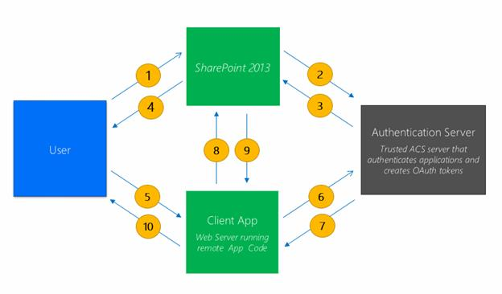
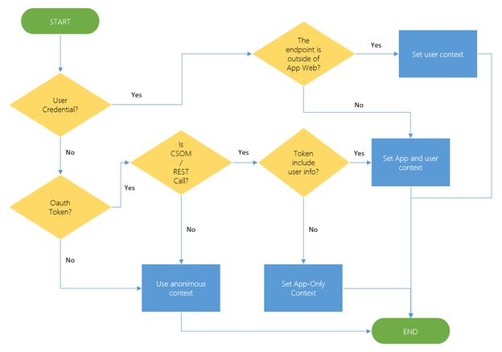

# 六、安全模型概述

## 基于声明的身份验证

对于 SharePoint 2013，默认身份验证模式是基于声明的身份验证模式，自 SharePoint 2010 以来，该模式一直存在，但可选。经典身份验证模式已被否决。

随着基于声明的身份验证的引入，您可以支持多种身份验证和授权场景，例如应用程序需求，这都要归功于安全令牌服务(STS)的存在。

在基于声明的身份验证中，默认情况下，身份验证提供程序会生成一个安全令牌，其中包含一组描述用户身份验证的声明，当用户登录到网站时，用户的令牌将被验证，然后用于访问 SharePoint。用户令牌是由身份提供者颁发的安全令牌。

所有这些也可以通过使用一个叫做 OAuth 的协议来实现。

## SharePoint 中的 OAuth

OAuth 是一个开放的授权协议。OAuth 以一种简单而标准的方式支持来自桌面和网络应用的安全授权。OAuth 使用户能够批准应用程序代表他们行事，而无需共享他们的用户名和密码。

例如，它使用户能够与另一个站点共享存储在一个站点上的私有资源或数据(联系人列表、文档、照片、视频等)，而用户不必提供他们的凭据(通常是用户名和密码)。

OAuth 使用户能够授权服务提供者(在本例中为 SharePoint 2013)为其由给定服务提供者(即 SharePoint 2013)托管的数据提供令牌而不是凭据(例如用户名和密码)。

每个令牌都授予对特定资源(例如文件夹中的文档)的特定站点(例如 SharePoint 文档存储库)的访问权限，并持续一段定义的时间，例如 30 分钟。这使用户能够向第三方网站授予对存储在另一个服务提供者(在本例中为 SharePoint)中的信息的访问权限，而无需共享其用户名和密码，也无需共享其在 SharePoint 上的所有数据。

OAuth 协议用于验证和授权应用程序和服务。使用 OAuth 协议:

*   授权应用程序代表用户请求 SharePoint 访问 SharePoint 资源。
*   验证 Office Store、应用程序目录或开发人员租户中的应用程序。

如果您为 SharePoint 2013 构建的应用程序和服务不需要以前的身份验证方法，则在创建应用程序和服务时，您不必使用 OAuth 协议。

如果您计划为 SharePoint 构建一个在远程 web 应用程序中运行并与 SharePoint 2013 通信的应用程序，您将需要使用 OAuth。

## 应用认证

在 SharePoint 2013 中，SharePoint 使用场景的典型应用如下:



图 24:SharePoint 身份验证流程

1.  用户连接到 SharePoint 网站。SharePoint 对用户进行身份验证，并创建包含用户身份信息的安全声明标记语言(SAML)令牌。
2.  SharePoint 使用应用程序标识查询其应用程序管理数据库，并确定应用程序是否是外部的。如果应用程序是外部的，并且有注册的应用程序主体，则 SharePoint 会调用访问控制系统(ACS)来创建上下文令牌，该令牌传递关于应用程序和当前用户的信息。
3.  ACS 创建一个包含应用主体和用户信息的上下文令牌。上下文令牌还包含客户端应用程序使用的刷新令牌。还要注意，上下文令牌的某些方面是由 ACS 使用应用程序机密签名的，并且只能由客户端应用程序准备，客户端应用程序也有应用程序机密的副本。
4.  SharePoint 向浏览器返回一个页面，该页面包含一个启动器(例如，可点击的小块)，允许用户从 SharePoint 网站重定向到客户端应用程序。
5.  当用户点击启动器时，启动器后面的 JavaScript 发出一个 HTTP POST 请求，将用户重定向到客户端应用程序。这个 HTTP POST 请求的主体包含上下文标记作为命名的表单参数。
6.  客户端应用程序读取上下文令牌，并从内部提取刷新令牌。客户端应用程序在创建 OAuth 令牌的请求中将刷新令牌传递给 ACS。发给 ACS 的部分消息是用应用程序机密签名的。
7.  ACS 使用应用程序机密来验证客户端应用程序请求。如果身份验证成功，ACS 会创建一个 OAuth 令牌，并将其返回给客户端应用程序。
8.  客户端应用程序使用 OAuth 令牌在 SharePoint 中进行 CSOM 调用和 REST 调用。
9.  SharePoint 对客户端应用程序进行身份验证，并确保它拥有适当的权限，以确保它有权执行它试图执行的任何操作。如果调用经过身份验证和授权，SharePoint 将执行 CSOM 和/或 REST 调用请求的任何工作，然后将请求的任何信息返回给客户端应用程序。
10.  客户端应用程序向用户返回一个页面，其中包含 CSOM 返回的 HTML 生成的表单数据以及对 SharePoint 的 REST 调用。

## 应用授权

授权过程验证经过身份验证的主体(应用程序或应用程序代表的用户)是否有权执行某些操作或访问特定资源(例如，列表或 SharePoint 文档文件夹)。

SharePoint 2013 提供三种类型的授权策略。调用中经过身份验证的身份决定了使用哪种授权策略。

经过身份验证的身份可以是:

*   仅用户身份
*   用户和应用程序身份
*   仅应用程序身份

授权策略可以是:

*   仅用户策略
*   用户+应用策略
*   仅应用程序策略

例如，如果使用用户+应用程序策略，则应用程序和应用程序所代表的用户都必须拥有访问资源的权限。在仅应用程序策略的情况下，访问检查仅违背应用程序的权限。在图 25 中，您可以分析 SharePoint 引擎用于用户身份验证的安全流。



图 25:安全流程

应用程序必须拥有的工作权限在 AppManifest.xml 文件中定义，由三个值定义:

1.  **作用域**:标识要设置权限的资源。
2.  **权限**:表示要设置的权限。
3.  **属性**:标识确定权限将应用于哪个资源所需的附加属性(不总是必要的)。


图 26:使用设计器设置 AppManifest.xml 的权限

以下是 XML 格式的相同权限:

```js
          <AppPermissionRequests>
              <AppPermissionRequest
                  Scope= "http://sharepoint/content/sitecollection "
                  Right= "Read " />
              <AppPermissionRequest
                  Scope= "http://sharepoint/content/sitecollection/web/list "    
                  Right= "FullControl ">
                <Property Name= "BaseTemplateId " Value= "101 "/>
              </AppPermissionRequest>
              <AppPermissionRequest
                  Scope= "http://sharepoint/search "
                  Right= "QueryAsUserIgnoreAppPrincipal " />
            </AppPermissionRequests>

```

但是权限是如何工作的呢？看看图 27。


图 27:appermissionrequest

应用程序权限请求包含范围属性和权限属性。范围属性包含一个字符串，该字符串包含以下信息:

*   **产品:**例如，SharePoint 对 Exchange 对 Lync
*   **权限提供者**:这是对内容或特定服务(如搜索或用户配置文件)的权限请求。
*   **目标对象**:请求授予的对象，如租赁、网站集、网站或列表。

右属性定义了请求的权限类型。SharePoint 标准化了四个基本权限:**读取**、**写入**、**管理**和**完全控制**。但是，某些权限类型，如搜索权限，使用专门的权限，如**queryaserignorequestionprint**。

页面上的标志允许您选择应用程序必须拥有的许可类型:

*   **用户+app 策略**:使用用户+app 策略时，授权检查同时考虑用户身份和 app 身份。特别是，当使用此策略时，只有当前用户和应用程序都有足够的权限执行相关操作时，授权检查才会成功。
*   **仅 app 策略**:当使用仅 app 策略时，内容数据库授权检查仅考虑 App 身份。特别是，当使用此策略时，仅当当前应用程序有足够的权限执行所讨论的操作时，授权检查才会成功，而不管当前用户的权限如何(如果有)。

## 总结

在本章中，我们了解了 SharePoint 2013 中的身份验证和授权。我们还了解了应用程序权限；能够使用 SharePoint 通过 CSOM 或 REST API 提供的资源访问应用程序的代码是非常重要的。