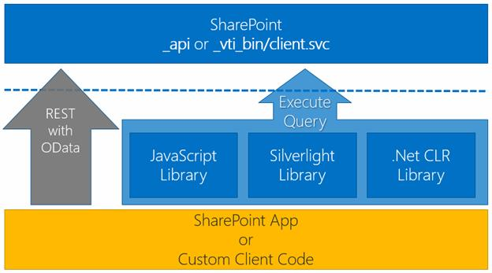

# 第 8 章休息/日常服务

除了让我们通过 CSOM 访问 SharePoint Client.svc 服务之外，SharePoint 2013 还引入了使用 REST 模式直接访问它的可能性，如图 29 所示。



图 29: SharePoint 客户端应用编程接口

REST 接口允许我们访问所有对象和所有通过 CSOM 可用的事务。

这允许我们向潜在的所有支持 HTTP 协议的技术开放 SharePoint 应用编程接口，并允许我们解释字符串。

|  | 注意:基于 REST 的应用程序使用 HTTP 请求来发送数据(创建和/或更新)，使用 HTTP 谓词来读取数据(查询)和删除数据，以进行这些操作(GET、POST、PUT 和 DELETE/MERGE)。 |

对于对 SharePoint 2013 的 REST 访问，我们必须使用新别名 **_api** 直接向地址 **Client.svc** 或服务进行 HTTP 调用。

SharePoint REST 服务实现了 OData 的规范，可以使用排序、过滤器等进行查询。

## 在 SharePoint 应用程序中运行 REST 调用

在 SharePoint 中测试名为 REST 的最简单的方法是使用浏览器。

例如，如果我们通过浏览器转到这个网址
[https://sp 2013appdev 简洁地. SharePoint . com/_ API/web/list](https://sp2013appdevsuccinctly.sharepoint.com/_api/web/lists)，我们会看到如图 30 所示的结果:


图 30:从浏览器调用 REST API

当然，我们可以使用浏览器来测试一个调用的 GET，但是更容易的是使用像[拨弄](http://www.jsfiddle.net/)这样的工具来测试我们的 REST 调用，看看发送和接收了什么数据。这是使用 REST 的最佳方式。

当我们使用 SharePoint REST 界面时，我们必须小心如何使用它。用 C#代码而不是 JavaScript 进行调用可能会有很大的不同，这也会对我们正在实现的应用程序类型和应用程序将拥有的主机类型产生影响。此外，我们必须确保我们的应用程序经过身份验证，可以从 SharePoint 访问数据。

如果我们的应用程序托管在 SharePoint 上，那么它会在允许以前经过身份验证的用户访问它的上下文中执行客户端代码。

```
           jQuery.ajax({
               URL: "http://<site URL>/_api/web/lists/GetByTitle('Test')",
               type: "GET" ,
               headers: {
                    "accept" : "application/json;odata=verbose" ,
                    "content-type" : "application/json;odata=verbose" ,
               },
               success: successFunction,
                error: successFunction
           });

```

如果应用程序是自托管提供程序类型，则运行服务器端代码(。NET 或其他)。在这种情况下，我们应该使用 OAuth，以便在每次对 SharePoint 进行 REST 调用时传递访问令牌:

```
          var  site = "http://site/" ;
          var  accessToken = "" ;
          HttpWebRequest  endpointRequest =
               (HttpWebRequest )HttpWebRequest .Create(site + "/_api/web/lists" );
           endpointRequest.Method = "GET" ;
           endpointRequest.Accept = "application/json;odata=verbose" ;
           endpointRequest.Headers
               .Add("Authorization" , "Bearer "  + accessToken);
          HttpWebResponse  endpointResponse =
               (HttpWebResponse )endpointRequest.GetResponse();

```

这是一个做同样事情的 C#代码的例子；它检索 SharePoint 网站上的列表。为了正确地进行调用，我们还必须传递身份验证信息，传递 AccessToken 身份验证。

无论我们使用哪种语言/平台，我们都需要了解如何创建网址，让我们能够获得运营所需的资源。

正如本书开头提到的，SharePoint REST API 基于 OData 协议来定义创建 URL 的语法。但是 OData 是怎么做到的呢？

## SharePoint 中 OData 的介绍

OData 是一个基于 HTTP 的网络协议，允许我们查询和操作数据。OData 使用 REST 范式定义对资源的操作，并使用标准的 URI 语法识别这些资源。数据使用 AtomPub 或 JSON 标准传输。此外，OData 协议定义了一些标准约定来支持信息和查询模式的交换。

每个查询都用唯一的网址提交，结果可以由代理服务器缓存，从而提高性能。

表 3: OData 将 CRUD 操作映射到 HTTP 动词

| HTTP 动词 | 操作 |
| --- | --- |
| 得到 | 用于读取数据。 |
| 邮政 | 用于插入新数据。任何不需要的属性都被设置为默认值。如果试图设置只读属性，服务将返回异常。 |
| PUT 和 MERGE | 用于更新。当您想要更新某个对象的某些属性，并且希望其他属性保持其当前值时，可以使用 MERGE。当你想替换一个项目时，使用 PUT。调用中没有特别提到的所有属性都用默认值进行设置。 |
| 删除 | 用于删除对象，如果是可回收对象，这将导致可回收操作。 |

此外，CSOM 的方法将被映射到:

*   导航器操作的获取
*   服务操作的开机自检、开机自检、合并或删除

以这个网址为例:

**http://server/_ API/web/list/？$orderby=title**

这个网址，如果通过调用 GET 调用，允许我们返回一个网站列表，按标题排序。

和 OData 中的所有 URL 一样，这个 URL 由三个基本部分组成:

*   服务根 URI:服务的网址
*   资源路径:标识您要操作的资源(**网页/列表**)
*   查询字符串选项:这些是查询的选项(**？$orderby=title** )

现在，以一个不同的网址为例:

**http://server/_ API/web/list/getByTitle('公告')**

让我们看看资源是如何在 URL 中不被改变的(../list ),但在添加资源后会被更改。路径的一部分，在这种情况下表示要执行的操作，getByTitle，传递您想要查找信息的列表的标题。

表 4:资源路径示例

| 资源路径 | 操作 |
| --- | --- |
| 网页/标题 | 当前网站的标题。 |
| 网页/列表(guid' <list id="">')</list> | 带 guid 的列表。 |
| web/列表/getByTitle(“任务”)/项目 | 任务列表中的项目。 |
| web/列表/getByTitle(“任务”)/字段 | 任务列表中的字段。 |
| web/getfolderbyserverelativeurl(“/共享文档”) | “共享文档”库的根文件夹。 |
| web/getfolderbyserverelativeurl('/Shared Documents ')/file(' todo . txt ')/$ value | “共享文档”库中 todo.txt 文件的内容。 |

默认情况下，数据以 AtomPub 格式的 XML 返回，如 OData 格式所扩展的，但是您可以通过在 HTTP 请求中添加以下 accept 头来检索 JSON 格式的数据:“**accept:application/JSON；odata =啰嗦**。

通过查询字符串参数，我们可以应用过滤器、排序和指示要返回的项目数:

表 5:查询字符串选项

| 查询字符串选项 | 操作 |
| --- | --- |
| $select | 指定返回的数据中包含哪些字段。 |
| $筛选器 | 指定返回集合的哪些成员，如列表中的项。 |
| orderby 美元 | 指定用于在数据返回之前对其进行排序的字段。 |
| $top | 仅返回集合或列表的前 n 项。 |
| $跳过 | 跳过集合或列表中的第一个 *n 个*项目，并返回其余项目。 |
| $展开 | 指定返回联接列表中的哪些投影字段。 |

以下是一些例子:

*   选择列标题:
    **_ API/web/list/getByTitle(' my list ')/items？$select=Title**
*   按列筛选作者:
    **_ API/web/list/getByTitle(' my list ')/items？$ filter =作者 eq 'Fabio Franzini'**
*   按列标题升序排序:
    **_ API/web/list/getByTitle(' my list ')/items？$orderby=Title asc**
*   通过跳转 10 项获得前五项:
    **_ API/web/list/getByTitle(' my list ')/items？$top=5 & $skip=10**
*   选择查找的列标题和列标题，明确说明要展开项目查找:
    **_ API/web/list/getByTitle(' my list ')/items？$select=Title，LookUp/Title&$ expand = LookUp**

到目前为止，我们看到的例子总是考虑到 GET 调用来执行查询。

如果我们想要插入或修改数据，以及更改请求的 HTTP 动词，我们必须传递一个名为 Form Digest 的值，它可以通过两种方式找到:

*   通过调用网址 **_api/contextinfo** 始终使用 HTTP GET 调用。
*   通过使用所有 SharePoint 页面中包含的名为 **__REQUESTDIGEST** 的隐藏字段。

## JavaScript 中的用法示例

### 阅读列表

```
           jQuery.ajax({
               URL: "http://<site URL>/_api/web/lists/GetByTitle('Test')",
               type: "GET" ,
               headers: {
                   "accept" : "application/json;odata=verbose" ,
                   "content-type" : "application/json;odata=verbose" ,
               },
               success: successFunction,
               error: successFunction
           });

```

### 创建新列表

```
           jQuery.ajax({
               URL: "http://<site URL>/_api/web/lists",
               type: "POST" ,
               data:  JSON.stringify({ '__metadata': { 'type': 'SP.List' },
                   'AllowContentTypes' : true ,
                   'BaseTemplate' : 100,
                   'ContentTypesEnabled' : true ,
                   'Description' : 'My list description',
                   'Title' : 'Test'  }),
               headers: {
                   "accept" : "application/json;odata=verbose" ,
                   "content-type" : "application/json;odata=verbose" ,
                   "content-length" : <length of post body>,
                   "X-RequestDigest" : $("#__REQUESTDIGEST" ).val()
               },
               success: successFunction,
               error: successFunction
           });

```

### 编辑列表

```
           jQuery.ajax({
               URL: "http://<site URL>/_api/web/lists/GetByTitle('Test')",
               type: "POST" ,
               data: JSON.stringify({
                   '__metadata' : { 'type' : 'SP.List'  },
                   'Title' : 'New title'
               }),
               headers: {
                   "X-HTTP-Method" : "MERGE" ,
                   "accept" : "application/json;odata=verbose" ,
                   "content-type" : "application/json;odata=verbose" ,
                   "content-length" : <length of post body>,
                   "X-RequestDigest" : $("#__REQUESTDIGEST" ).val(),
                   "IF-MATCH" : "*"
                },
               success: successFunction,
               error: successFunction
           });

```

请求头中的 IF-MATCH 键的值是您指定列表或列表项的 etag 值的地方。该特定值仅适用于列表和列表项，旨在帮助您在更新这些实体时避免并发问题。前面的示例使用星号(*)表示该值，只要您没有任何理由担心并发问题，就可以使用该值。否则，您应该通过执行检索实体的 GET 请求来获取 etag 值或列表或列表项。产生的 HTTP 响应的响应头将把 etag 作为 ETag 键的值传递。该值也包含在实体元数据中。以下示例显示了包含列表信息的 XML 节点的开始<entry>标记。 **m:etag** 属性包含 etag 值。</entry>

## 总结

与 CSOM 相比，REST 的使用要简单得多。永远使用最方便的技术来做你正在做的事情。

如果你正在使用。NET 代码，例如，因为应用程序是由提供者托管的，所以使用 CSOM 会更方便，因为它是一个强类型模型，适合与托管代码一起使用。

如果您正在编写 JavaScript 代码，那么使用 REST 可能会更方便，例如，因为我们可以使用 jQuery 重用 AJAX 调用中的任何经验，还因为已经提供了结果，在 JavaScript 对象中使用 JSON。

这并不是说 REST 只适用于 JavaScript，而 CSOM 只适用于. NET。相反，在选择要使用的方法之前，您应该始终评估使用范围。