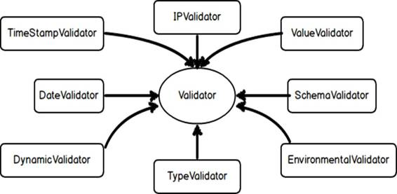

让我们再次看看维基百科的定义:

“不应该强迫任何客户端依赖它不使用的方法。ISP 将非常大的接口分成更小、更具体的接口。”

我认为这意味着:“作为一个客户，当我只需要三个方法时，为什么我要实现一个接口的九个方法？”更少的方法让开发人员的生活更轻松。

您可能会注意到这类似于一般责任分配软件模式的高内聚原则。尽管 GRASP 超出了本电子书的范围，但我们应该意识到，这些模式为协作对象分配责任提供了指南。

以下是 GRASP 模式的列表:

*   创造者
*   信息专家
*   低耦合
*   控制器
*   高凝聚力
*   间接
*   多态性
*   受保护变量
*   纯粹的制造

|  | 注意:“内聚性”指的是任何元素的操作在功能上是如何相关的。 |

|  | 注:参考:[https://en . Wikipedia . org/wiki/Cohesion _(computer _ science)](https://en.wikipedia.org/wiki/Cohesion_(computer_science))了解更多关于 Cohesion 的知识。 |

在前几章中，我们已经看到了如何解决我们的验证器问题。为了找到合适的解决方案，我们采用了 ISP。我们能说如果有人违反了 LSP，他们就了解了 ISP 吗？

在本章中，我们将讨论更多的场景，在这些场景中，我们可以调整 ISP 来解决我们的现实问题。

以下是罗伯特·马丁对互联网服务提供商的评价:

“制作特定于客户端的细粒度接口。”

由此，我们可以说我们不应该在接口的污染中弄乱类。我们的实现类应该服从拥有所需功能的接口。

让我换个说法——ISP 说我们不应该强迫客户使用他们不需要使用的接口。

让我们回到这个问题，其中我们的一个验证器不想使用特定的方法，但是我们强迫它使用我们的 IsValid()方法。

代码清单 32

```cs
  public interface IValidator
  {
    void Load();
    bool Isvalid();
  }

```

在代码清单 32 中，我们为客户端提供了接口 IValidator。注意，如果任何类实现了这个接口，它必须实现所有的方法。

如果一个类既不需要 Load()方法，也不需要 IsValid()方法，那么这个接口就迫使客户端实现不需要的方法，如代码清单 33 所示。

代码清单 33

```cs
  public class DynamicValidator : IValidator
  {

  public bool
  IsValid()

  {

  //I do not want this,
  why should I care about this?

  throw new
  NotImplementedException();

  }

  public void
  Load()

  {

  //Some stuff

  }
  }

```

DynamicValidator 不是用来实现 IsValid()方法的。如果一个客户端实现了 IValidator，那么该客户端将被迫处理 IsValid()方法，这并不好。如果你这样做，你的客户会不高兴的。

换句话说，我们可以说我们的接口 IValidator 很胖，没有内聚性。它可能只有两种方法，但大多数客户在与这些方法交互时会感到不安。

|  | 注意:当一个接口包含太多操作时，它被称为胖接口或臃肿接口。详见:[https://en.wikipedia.org/wiki/Interface_bloat](https://en.wikipedia.org/wiki/Interface_bloat)。 |

许多开发人员在阅读关于 LSP 和 ISP 的内容时会感到困惑。以下是它们之间区别的简明陈述:

“LSP 是关于子类型和继承的。互联网服务提供商关注的是业务逻辑与客户的沟通。”

考虑到这一点，我们将研究 ISP 的实现逻辑。在代码清单 34 中，我们有一个抽象类验证器。

代码清单 34

```cs
  public abstract class Validator
  {

  public abstract void Load();

  public abstract bool IsValid();
  }

```

一些客户将实现这个类，以便实现客户特定的业务逻辑或者他们根据自己的需求需要什么。代码清单 35 显示了一个例子。

代码清单 35

```cs
  public class SchemaValidator : Validator
  {

  public override bool IsValid()

  {

  throw new
  NotImplementedException();

  }

  public override void Load()

  {

  throw new
  NotImplementedException();

  }
  }

```

我们还有一个 DynamicValidator，如代码清单 36 所示。

代码清单 36

```cs
  public class DynamicValidator : Validator
  {

  public override bool IsValid()

  {

  throw new
  NotImplementedException();

  }

  public override void Load()

  {

  throw new
  NotImplementedException();

  }
  }

```

|  | 注意:这不是完整的代码。完整的源代码请参考 Bitbucket。 |

在代码清单 36 的场景中，所有客户端都必须绑定或坚持内部实现，这意味着它们必须重写抽象类中声明的方法。



图 9: 1 个服务器，n 个客户端的场景

在图 9 中，我们有一个场景，其中 n 个客户端联系 1 个服务器。我们有一些特殊类型的客户端，比如 DynamicValidator 和 EnvironmentalValidator(这些都需要任一种方法)。

你也可以反过来思考。假设您有一个接口 IValidator，它只有 IsValid()方法，并且各种客户端都在使用它。一些特殊类型的验证器需要一个额外的方法以及 IsValid()。这种新方法将是 Notify()。这是一个挑战——如果我们向现有的接口添加一个新的方法，我们就迫使我们快乐的客户也实现新的方法。

假设您正在使用来自第三方的应用编程接口，您实现了一切，然后部署到生产中。第二天，当你走进办公室的时候，突然被告知第三方改变了它的 API，在你目前使用的界面上增加了一个新的方法。不管哪个程序员改了那个 API，你都希望他们的手机掉进马桶里！

所以你可以看到，如果你在接口中放入不必要的方法，并强迫客户端使用它们，会有多痛苦。然而在这种情况下，客户端必须使用它们，因为没有其他选项可用。

想象一下这样一种情况，您的实现团队对使用您的接口的外部客户端非常满意，但是突然您的经理说一个顶级创收客户端请求对您现有的接口进行一些更改。他们想添加两个新方法，并删除或反对一个旧方法(因为他们不再使用它)。你会怎么做？

作为一名典型的开发人员，你可以开始深入研究代码，或者和你的经理讨论情况，并提出一些好的解决方案。当您使用高度可扩展的应用程序，并且您的客户端不断地推动您向它们提供新功能时，现实世界中的应用程序会有很多令人头疼的问题。

让我们回到最初的接口隔离问题。我们有解决方案，但我还想讨论一些调整。

#### 我们的要求是什么？

作为客户，我们必须只实现那些我们需要的东西。作为模块作者，我们不应该强迫我们的客户实现他们可能不需要的任何东西。

在我们的实时示例中，我们必须为新老客户端提供一个新方法，所以让我们在代码清单 37 中尝试将其设为 ISP。

代码清单 37

```cs
  public interface IValidator
  {

  bool Isvalid();
  }

  public interface IvalidatorLoader : IValidator
  {

  void Load();
  }

```

为了满足我们的需求，我们创建了一个新的接口 IValidatorLoader，它实现了接口 IValidator 本身。为什么呢？因为我们的新客户需要新的方法，但是他们没有说他们是否仍然需要现有的方法，这意味着他们将获得旧的和新的方法，IsValid()和 Load()，如代码清单 38 所示。

代码清单 38

```cs
  public class Validator : IValidator
  {

  public bool
  Isvalid()

  {

  //Perform some awesome
  stuff here.

  return true;

  }
  }

```

我们的旧验证器类将保持不变——它将实现 IValidator 接口，业务逻辑也不会有任何变化。

代码清单 39

```cs
  public class SpecialValidator : IValidator, IvalidatorLoader
  {

  public bool
  Isvalid()

  {

  //Why should I do new things—I
  have this method already in place.

  Validator validator = new Validator();

  return validator.Isvalid();

  }

  public void
  Load()

  {

  //Perform good stuff
  here to load special validator.

  }
  }

```

代码清单 39 显示了我们的特殊整合器类，它的引入是为了满足我们新客户的需求。新类实现了 IValidator 和 IValidatorLoader。

我们的 IsValid()方法的业务逻辑没有变化——我们只是在定义中连接现有的方法。没有必要编写和制作重复的代码。

注意，我们引入了一个新的 Load()方法。它应该有一些真正的业务逻辑，这里我们写了与我们新的 Load()方法相关的所有业务逻辑。

我们完了！让我们看看我们的客户将如何进行调用，如代码清单 40 所示。

代码清单 40

```cs
  class Program

  {

  static void
  Main(string[] args)

  {

  Console.WriteLine("Old clients, who do not
  require a new method");

  IValidator validator = new Validator();

  var isvalid = validator.Isvalid();

  NotifyValidationStuff(isvalid);

  IvalidatorLoader validatorLoader = new SpecialValidator();

  NotifyValidationStuff(validatorLoader.Isvalid());

  //This is for example
  only, in real time one should have some business logic on when to load
  validators.

  validatorLoader.Load();

  Console.WriteLine("New client can get the taste
  of Load() method as well");

  Console.ReadLine();

  }

  private static void NotifyValidationStuff(bool isvalid)

  {

  Console.WriteLine("Validations are {0}.", isvalid ? "passing" : "failing");

  }
      }

```

这就是我们想要的。代码清单 40 的代码是不言自明的。我们通过不让老客户的生活变得复杂来让他们开心，我们为新客户提供好的东西，让他们接触新的和旧的方法。