# 一、安装Spark

Spark 运行在 Java 虚拟机中。运行 Spark 的前提是安装 Java。我们将讨论在最流行的操作系统上的安装步骤，如微软视窗和 Linux。从 1.4 版本开始，Spark 还支持 R 编程语言和 Python 3。Spark 的早期版本只支持 Python 2.6。提到 R 语言只是为了完整；这本书除了陈述 Spark 已经内置了对它的支持之外，不打算更深入地探讨 R 语言的例子。

## 在 Linux 上安装Spark先决条件

我们将演示如何在 Centos 6 上安装 Apache Spark。x 从零开始。如前所述，Spark 实际上运行在 JVM 之上，所以我们必须首先安装 Java。Linux 系统的大多数桌面版本都预装了 Java，但我们将介绍 Java 安装以防万一。请注意，示例中的安装是在用户拥有 root 权限的情况下完成的。为了获得根权限，您可能需要在本节中运行以下所有命令，方法是在它们前面加上`sudo`。

### 安装 Java

如果您的系统安装了适当版本的 Java，请跳过此步骤。最简单的检查方法是在 shell 中运行命令`java –version`。虽然 Java 版本 8 已经有相当长的一段时间了，但是许多开发人员都在使用 Java 7 版本。您可以安装任何您喜欢的 Java 版本。提供的源代码将是 Java 7 和 Java 8 版本。

代码清单 1:在 Linux 上安装 Java

```scala
      $ cd /opt/

      $ wget --no-check-certificate -c --header "Cookie: oraclelicense=accept-securebackup-cookie" http://download.oracle.com/otn-pub/java/jdk/8u51-b16/jdk-8u51-linux-x64.tar.gz

      $ tar xzf jdk-8u51-linux-x64.tar.gz

      $ cd jdk1.8.0_51/

      $ alternatives --install /usr/bin/java java /opt/jdk1.8.0_51/jre/bin/java 2
      $ alternatives --install /usr/bin/javaws javaws /opt/jdk1.8.0_51/jre/bin/javaws 2
      $ alternatives --install /usr/bin/javac javac /opt/jdk1.8.0_51/bin/javac 2
      $ alternatives --config java

      There is 1 program that provides 'java'.
        Selection    Command
      -----------------------------------------------
      *+ 1           /opt/jdk1.8.0_51/jre/bin/java
      Enter to keep the current selection[+], or type selection number: 1 [ENTER]

      $ java –version
      java version "1.8.0_51"
      Java(TM) SE Runtime Environment (build 1.8.0_51-b16)
      Java HotSpot(TM) 64-Bit Server VM (build 25.51-b03, mixed mode)

      [Add these to ~/.bash_profile or the exports will not be set on the next boot]
      $ export JAVA_HOME=/opt/jdk1.8.0_51
      $ export JRE_HOME=/opt/jdk1.8.0_51/jre
      $ export PATH=$PATH:/opt/jdk1.8.0_51/bin:/opt/jdk1.8.0_51/jre/bin

```

### 安装 Python

如果你运行的是 Linux，很有可能你已经安装了 Python。您可以通过运行以下命令来检查这一点:

代码清单 2:检查 Linux 上的 Python 版本

```scala
      $ python -V
      Python 2.6.6

```

如果您对已安装的 Python 版本不满意，可以安装更新的版本。在开始安装之前更新操作系统包是一个很好的做法。

代码清单 3:使用 Yum 更新 Linux 包

```scala
      $ yum -y update

```

从 Python 源代码安装多个版本会很快变得很麻烦。我建议你使用 pyenv 工具。安装 pyenv 的先决条件是流行的源代码版本控制系统 Git。安装 pyenv 后，它会自动从源代码构建下载的 Python。为了成功运行构建过程，您还需要安装开发工具和 Python 所需的一些其他组件。您可以通过运行以下命令来安装组件:

代码清单 4:使用 Yum 安装 Git 和开发工具

```scala
      $ yum install git

      $ yum groupinstall "Development tools"
      $ yum install bzip2-devel
      $ yum install openssl-devel

```

代码清单 5:安装 Pyenv

```scala
      $ curl -L https://raw.githubusercontent.com/yyuu/pyenv-installer/master/bin/pyenv-installer | bash

      # add following to ~/.bash_profile:

      export PATH="$HOME/.pyenv/bin:$PATH"
      eval "$(pyenv init -)"
      eval "$(pyenv virtualenv-init -)"

```

安装 pyenv 后，即使在项目级别，在 Python 版本之间切换也相对容易。您只需要安装您需要的 Python 版本，然后在项目目录中创建一个包含您需要的 Python 版本的`.python-version`文件:

代码清单 6:安装 Pyenv 并切换 Python 版本

```scala
      $ pyenv install 3.4.3

      # version 3.4.4 is installed but if you try to run the version command you get something like

      $ python -V
      Python 2.6.6

      # now create a file .python-version and put 3.4.3 in it, if you now run version command

      $ python -V
      Python 3.4.3

```

### 安装 Scala

Spark 在 Java 和 Python 方面非常灵活，但是 Scala 的版本必须匹配。在撰写本文时，最新的 Spark 版本是 1.4.1，并且与 Scala 2.10.x 兼容。当您开始在系统上安装 Scala 时，请务必查看最新的 Spark 文档。在我的例子中，它看起来如下:

代码清单 7:在 CentOS 上安装 Scala

```scala
      $ wget http://www.scala-lang.org/files/archive/scala-2.10.5.tgz

      $ tar xvf scala-2.10.5.tgz

      $ mv scala-2.10.5 /usr/lib
      $ ln -s /usr/lib/scala-2.10.5 /usr/lib/scala
      # you can add following commands to ~/.bash_profile:
      $ export PATH=$PATH:/usr/lib/scala/bin
      $ export SCALA_HOME=/usr/lib/scala

      # check if everything is o.k. by running
      $ scala –version
      Scala code runner version 2.10.5 -- Copyright 2002-2013, LAMP/EPFL

```

要用 Scala 构建应用程序，您还需要使用一个名为简单构建工具的工具。要安装它，请使用以下命令:

代码清单 8:在 CentOS 上安装 sbt

```scala
      $ curl https://bintray.com/sbt/rpm/rpm | sudo tee /etc/yum.repos.d/bintray-sbt-rpm.repo

      $ yum install sbt

      $ sbt about
       [info] This is sbt 0.13.8

```

## 在 Windows 上安装Spark先决条件

Windows 7 完全没有消亡的迹象，并且仍然是目前最受欢迎的 Windows 操作系统。它没有微软的主流支持，但这并没有显著改变它的市场份额。将基于 Windows 7 描述安装过程。

### 安装 Java

对于 Windows，转到[http://www . Oracle . com/technetwork/Java/javase/downloads/index . html](http://www.oracle.com/technetwork/java/javase/downloads/index.html)找到 JDK 下载。在撰写本文时，最新版本是 8u51。同意页面上的条款和条件，以下载 Java 安装程序并运行下载的软件。只需确保您为 Windows 选择了 JDK，并小心 32(x86)和 64(x64)位系统。在继续安装之前，Windows 会询问您是否真的要对计算机进行更改:

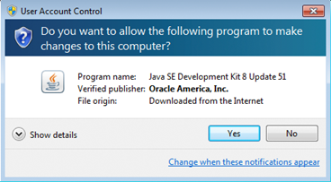

图 9:允许下载的安装程序对系统进行更改。

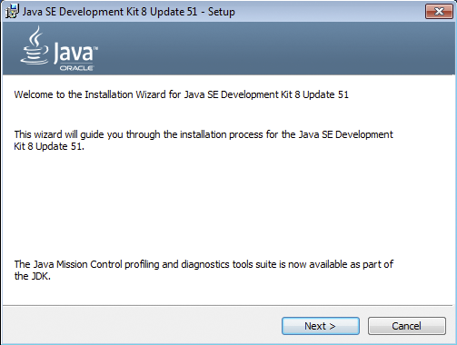

图 10:在 Windows 上安装 JDK 的初始屏幕

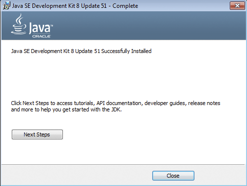

图 11:成功的 JDK 安装的结束

安装 Java 后，设置`JAVA_HOME`环境变量很重要。使用以下步骤检查或设置`JAVA_HOME`变量:

1.  右键点击`My Computer`。
2.  从列表中选择`Properties`。
3.  转到`Advanced system settings`。这将在`Advanced` `tab`上打开`System Properties`。
4.  点击`Environment Variables`。
5.  如下图所示，添加或更新`JAVA_HOME`变量。默认位置类似于`C:\Program Files\Java\jdk1.8.0_51`；在更改变量之前，请确保检查文件系统上的位置。请注意，位置因安装的 Java 版本而异。


图 12: Java 家庭环境变量设置

### 安装 Python

许多 Python 开发人员不想使用新的 Python 3 语法，所以 Python 有 Python 2 和 3 可供下载。去[https://www.python.org/downloads/windows/](https://www.python.org/downloads/windows/)选择你最喜欢的。请注意，有 x86 和 x86-64 版本可用，因此在下载安装程序之前，请确保您使用的是 32 位还是 64 位系统。

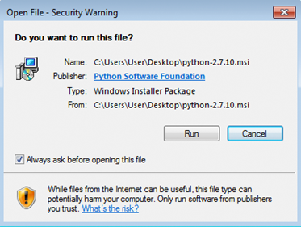

图 13:当窗口安全弹出窗口出现时，点击运行。


图 14:为所有用户安装 Python。


图 15:选择目标目录。


图 16:在下拉列表中点击 Python，选择将安装整个功能。

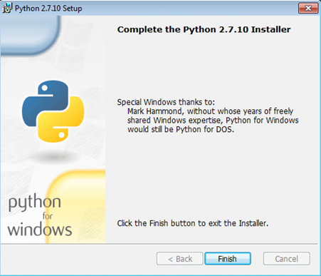

图 17:Python 安装结束

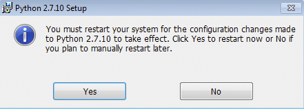

图 18:在使用 Python 之前，您可能需要重新启动系统。

### 安装 Scala

在撰写本文时，最新的 Spark 版本是 1.4.1，并且与 Scala 2.10.x 兼容。在系统上开始安装 Scala 之前，请查看最新的 Spark 文档。要在 Windows 上安装 Scala，请到[http://www.scala-lang.org/download/all.html](http://www.scala-lang.org/download/all.html)找到合适的版本下载。在我最新版本的星火系统上，是[http://www.scala-lang.org/download/2.10.5.html](http://www.scala-lang.org/download/2.10.5.html)。安装步骤如下图所示；如果有任何安全问题或类似问题，请同意:


图 19:在最初的 Scala 安装屏幕上，单击下一步。

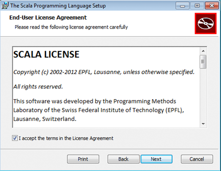

图 20:检查许可并接受条款。

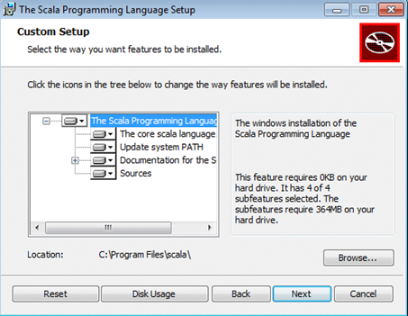

图 21:在本地磁盘上安装所有功能，然后单击下一步。


图 22:开始安装过程。


图 23:Scala 安装过程结束

安装过程结束时，将环境变量`SCALA_HOME`设置为值“C:\Program Files\scala。”使用上一节中描述的关于 Java 的过程。

如果你想在 Scala 中为 Spark 开发应用程序，你需要安装简单构建工具。

您可以在[http://www.scala-sbt.org/download.html](http://www.scala-sbt.org/download.html)下载 Scala 简单构建工具。下载后，运行安装程序:

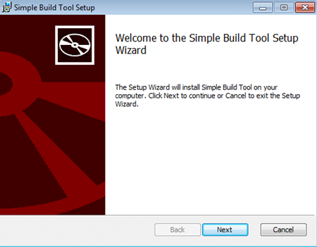

图 24:SBT 安装过程的开始

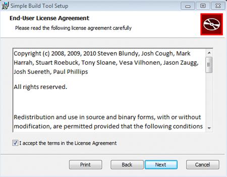

图 25:接受许可条款。

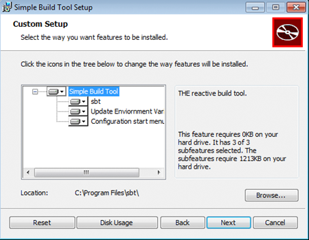

图 26:在简单构建工具下拉菜单中，将所有功能安装到硬盘上。

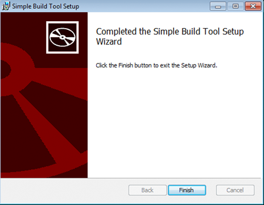

图 27:安装简单构建工具期间的最后一个屏幕

至此，本书其余部分的所有先决条件都已涵盖，包括如何安装 Spark。从现在开始，Windows 和 Linux 上的安装和配置过程几乎相同。

## Spark下载和配置

你可以在[https://spark.apache.org/downloads.html](https://spark.apache.org/downloads.html)下载Spark。目前最新的版本是 1.4.1。在下载页面选择 Spark 版本时，请选择此选项。如果您计划在现有的 Hadoop 基础架构上运行 Spark，请在包类型选择下选择您的 Hadoop 版本。如果您不打算使用 Hadoop，只需选择“为 Hadoop 2.6 及更高版本预构建”下载类型的 Hadoop 版本对本书来说并不重要。页面上的下一个元素将是下载链接；有些用户可能会对没有下载按钮感到惊讶。将档案下载到您选择的目录中。就我而言，下载链接是[http://www . Apache . org/dyn/closer . CGI/spark/Spark-1 . 4 . 1/Spark-1 . 4 . 1-bin-hadoop 2 . 6 . tgz](http://www.apache.org/dyn/closer.cgi/spark/spark-1.4.1/spark-1.4.1-bin-hadoop2.6.tgz)，但这可能会因开始下载时是否有较新版本的 Spark 或 Hadoop 而异。你可能已经注意到档案是“tar”格式的。Linux 计算机的用户在打开下载的文件时不会有特别的麻烦，但是在 Windows 上，您需要安装一个实用程序，比如 7-Zip 或任何其他支持 tar 的存档软件。请注意，提取过程将有多个步骤，因为档案中有档案。提取输出文件时，总是将它们输出到一个简单名称的文件夹中。我在 Windows 上最终得到了类似“C:\ spark \ Spark \ Spark-1 . 4 . 1-bin-Hadoop 2”这样的东西，但后来我只是将最终文件夹的内容复制到了“C:\spark-1.4.1”中，使以后与 Spark 的交互变得更加容易。在 Linux 上，我把 Spark 复制提取到文件夹“/root/Spark-1 . 4 . 1-bin-Hadoop 2.6；”这真的取决于你的喜好。

|  | 提示:将 Spark 的 tgz 档案提取到一个路径中没有空格的文件夹中。 |

如果您正在运行 Linux，请打开您的 shell 并导航到您提取 Spark 的文件夹。如果您正在运行 Windows，请打开命令提示符并执行相同的操作。首先，我们将运行Spark壳。

代码清单 9:在 Windows 上从命令提示符运行 Spark Shell

```scala
      C:\spark-1.4.1>bin\spark-shell

```

代码清单 10:在 Linux 上从 Shell 运行 Spark Shell

```scala
      [root@localhost spark-1.4.1-bin-hadoop2.6]# ./bin/spark-shell

```

结果将是在两个平台上运行的 Spark Shell。如果一切正常，您应该会看到一个 read-eval-print 循环 scala 接口:

代码清单 11:前面命令的结果应该是一个正在运行的 scala 解释器接口。

```scala
      scala>

```

我个人不喜欢缺省运行 Spark Shell 时打印的信息量。这是非常低级的信息，用处不大。虽然您刚刚启动了 Spark Shell，但离开它并更改日志记录级别可能是个好主意，这样它就不会让您感到困惑。要离开 REPL，只需键入`exit()`并按下`Enter`键。

导航到`conf`子文件夹，复制文件`log4j.properties.template`。将其重命名为`log4j.properties`并打开文件进行编辑。将`log4j.rootCategory`行从`INFO`更改为`WARN`，如下代码列表所示:

代码清单 12:更加用户友好的日志记录设置

```scala
      # Set everything to be logged to the console
      log4j.rootCategory=WARN, console
      log4j.appender.console=org.apache.log4j.ConsoleAppender
      log4j.appender.console.target=System.err
      log4j.appender.console.layout=org.apache.log4j.PatternLayout
      log4j.appender.console.layout.ConversionPattern=%d{yy/MM/dd HH:mm:ss} %p %c{1}: %m%n

      # Settings to quiet third-party logs that are too verbose
      log4j.logger.org.spark-project.jetty=WARN
      log4j.logger.org.spark-project.jetty.util.component.AbstractLifeCycle=ERROR
      log4j.logger.org.apache.spark.repl.SparkIMain$exprTyper=INFO
      log4j.logger.org.apache.spark.repl.SparkILoop$SparkILoopInterpreter=INFO

```

将日志输出级别设置为警告后，将当前目录从`conf`文件夹更改一级，并再次启动 Spark shell。在 shell 给出 scala REPL 之前，您应该看到从 shell 中输出的内容要少得多:

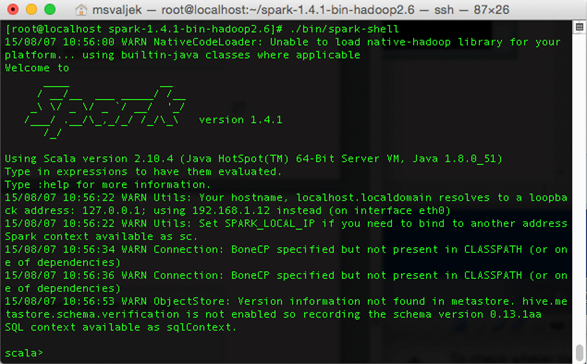

图 28:日志级别设置为警告的Spark外壳

这一章到此结束。现在您的系统上有一个正在运行的 Spark 实例。在下一章中，我们将讨论如何用 Scala、Java 和 Python 启动数据处理任务。