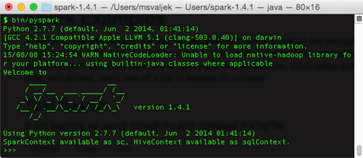
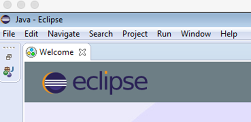
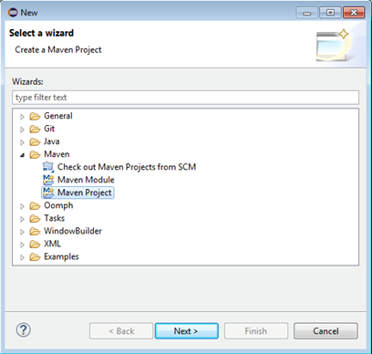
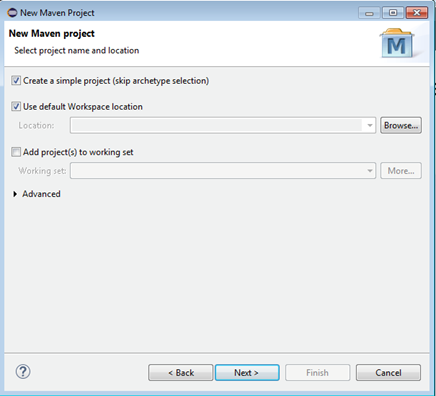
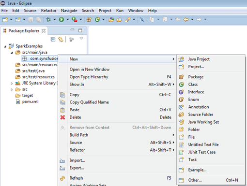
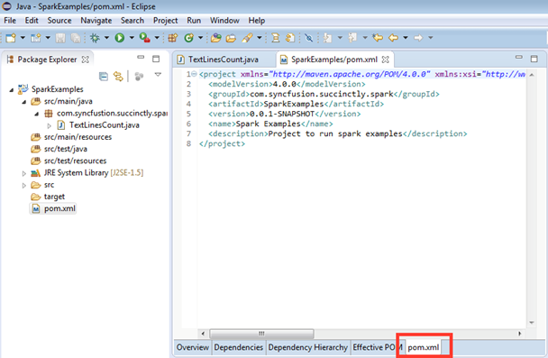
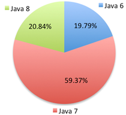

# 第二章你好火花

大数据处理的 hello world 应用程序总是涉及搜索单词的出现。通常，要处理的数据来自流、数据库或分布式文件系统。本章中的示例是在 hello world 级别上，因此我们将简单地使用 Spark 提供的文件。以下是 Spark 目录中的文件列表:

代码清单 13:火花目录的内容

```
      .
      ├── CHANGES.txt
      ├── LICENSE
      ├── NOTICE
      ├── R
      ├── README.md ß
      ├── RELEASE
      ├── bin
      ├── conf
      ├── data
      ├── ec2
      ├── examples
      ├── lib
      ├── python
      └── sbin

```

在本章中，我们将在示例中使用`README.md`文件。Spark 是用 Scala 编写的，所以在整本书中，我们将首先从 Scala 的例子开始。如果你对其他编程语言感兴趣，你可以跳到你需要或喜欢的例子。我不是真正的 R 专家，所以我不会为它提供整本书的例子。我在前几章也没有涉及 R 的安装。目前，Java 没有像 Python 和 Scala 那样的交互式外壳支持，所以当我们谈到 Java 示例时，我们将演示如何设置一个基本的 Java Spark 项目。Java 示例的依赖关系管理可能会变得非常复杂非常快，因此我们还将介绍如何使用目前最流行的 Java 依赖关系工具 Maven 来管理依赖关系。我们将从简单的文本搜索开始。

## 计算包含文本的文本行

在本例中，我们将对包含特定单词的文本行进行计数。虽然这看起来不多，但已经相当有用了。例如，您可以计算错误出现在生产日志或类似日志中的频率。在介绍中，我们提到为了简单起见，我们将使用 Spark 安装附带的`README.md`文件。让我们从 Scala 开始。

### 斯卡拉示例

打开命令提示符(Windows)或 Shell (Linux)，转到您解压缩 Spark 安装的目录。前一章描述了如何做到这一点，但作为一个简短的复习，这里是如何做到的:

代码清单 14:在 Windows 上从命令提示符运行 Spark Shell

```
      C:\spark-1.4.1>bin\spark-shell

```

代码清单 15:在 Linux 上从 Shell 运行 Spark Shell

```
      [root@localhost spark-1.4.1-bin-hadoop2.6]# ./bin/spark-shell

```

使用 Spark Shell 的优点是您可以立即使用 Spark Context，并且不必初始化它。我们将在接下来的章节中介绍如何做到这一点，但现在只需说 Spark Context 表示与 Spark 集群的连接，并用于对其进行计算操作。shell 中可用的上下文实际上并不是一个到集群的现成连接，它是一个用于测试、评估并在单个节点或开发阶段运行的上下文。幸运的是，这正是我们目前所需要的。输入以下内容:

代码清单 16:在 Scala 中计数包含单词 Spark 的行

```
      val readmeFile = sc.textFile("README.md")
      val sparkMentions = readmeFile.filter(line => line.contains("Spark"))

      // count the lines having Spark in them
      sparkMentions.count()

```

如果一切顺利，你应该看到这样的情况:

代码清单 17:计算火花壳中行数的结果

```
      scala> sparkMentions.count()
      res2: Long = 19

```

Spark Context 上的`textFile`方法将一个文件变成一组行。之后，我们将过滤掉其中没有火花的线条。最后，我们将调用一个名为 count 的操作。一切都很简单。如果你对 Spark 多了解一点，你就会知道`readmeFile`不仅仅是像数组或列表这样的任何集合类型，在 Spark 中这个集合实际上被称为*弹性分布式数据集*，这种类型的集合有很多方法用于各种转换和动作。我们很快就会谈到那个话题。就目前而言，你只要把结果当成物品的集合就够了。

有时你也会想检查你正在阅读的文件是否一切正常，以确保你可以很容易地看到文件。例如，如果您想打印文件的前十行，您可以执行以下操作:

代码清单 18:通过获取前十行来查看文件

```
      scala> readmeFile.take(10)

      res5: Array[String] = Array(# Apache Spark, "", Spark is a fast and general cluster computing system for big data. It provides, high-level APIs in Scala, Java, and Python, and an optimized engine that, supports general computation graphs for data analysis. It also supports a, rich set of higher-level tools including Spark SQL for SQL and structured, data processing, MLlib for machine learning, GraphX for graph processing,, and Spark Streaming for stream processing., "", <http://spark.apache.org/>)

```

|  | 提示:使用 take 确保您有正确的文件。 |

行数示例区分大小写，因此将只计算包含大写 Spark 的行。但这足以让你走了。在下一节中，我们将从 Python 的角度来看包含字符串示例的行。

### Python 示例

要开始在 Python 中使用 Spark，我们将使用 PySpark 实用程序。运行它与运行上一节中的 Spark Shell 非常相似:

代码清单 19:在 Windows 上从命令提示符运行 Spark Shell

```
      C:\spark-1.4.1>bin\PySpark

```

代码清单 20:在 Linux 上从 Shell 运行 Spark Shell

```
      [root@localhost spark-1.4.1-bin-hadoop2.6]# ./bin/PySpark

```

前面命令的结果应该是 Python Spark 外壳，如下所示:



图 29: PySpark 外壳在运行

代码清单 21:用 Python 方式计算包含火花的行

```
      readme_file = sc.textFile("README.md")
      spark_mentions = readme_file.filter(lambda line: "Spark" in line)

      # count the lines having Spark in them
      spark_mentions.count()

```

正如你所看到的，没有那么多行包括在内。毕竟，Python 在执行数据科学的开发人员中非常受欢迎，原因之一是您不必编写大量代码行来完成工作。在下一节中，我们将展示如何用 Java 的方式来实现。

### Java 示例和开发环境设置

在写这本书的时候，Java 没有像 Python 和 Scala 那样的交互式外壳，所以如果你想用 Java 为 Spark 编写应用程序，你需要做更多的设置。为了有效，我们将使用一个集成开发环境。在 Java 开发人员中，最受欢迎的是 IntelliJ IDEA、NetBeans 和 Eclipse。很难估计读者会使用什么，但在我看来，Eclipse 在很长一段时间内非常受欢迎，大多数读者至少会有一些基本的使用体验，所以我们将继续使用它。首先你必须下载 Eclipse。Eclipse 有许多版本；在写这本书的时候最新的是火星。你可以看看[http://www.eclipse.org/downloads/packages/release/Mars/R](http://www.eclipse.org/downloads/packages/release/Mars/R)下载`Eclipse IDE for Java Developers`，只要确定你下载的平台是对的。将归档文件解压到您选择的文件夹中，进入 Eclipse 文件夹，运行 Eclipse。按照下图中的步骤设置环境:


图 30:选择工作区目录。



图 31:关闭欢迎屏幕。


图 32:点击文件>新建>其他。



图 33:选择 Maven 项目。



图 34:选中创建一个简单的项目。


图 35:填写新项目配置。


图 36:在 src/main/java 中创建新包。


图 37:创建新包



图 38:在创建的包中创建新的 Java 类。


图 39:在新建 Java 类对话框中输入类名，选中创建公共静态 Void Main。

在新创建的 Java 类中输入以下代码:

代码清单 22: Java 文本行计数类

```
      package com.syncfusion.succinctly.spark.examples;

      import java.io.FileNotFoundException;
      import java.io.PrintWriter;
      import java.io.UnsupportedEncodingException;

      import org.apache.spark.SparkConf;
      import org.apache.spark.api.java.JavaRDD;
      import org.apache.spark.api.java.JavaSparkContext;
      import org.apache.spark.api.java.function.Function;

      public class TextLinesCount {

          public static void main(String[] args) throws FileNotFoundException, UnsupportedEncodingException {
              if (args.length < 1) {
                  System.err.println("Please provide a full path to the input files");
                  System.exit(0);
              }

              if (args.length < 2) {
                  System.err.println("Please provide a full path to the output file");
                  System.exit(0);
              }

              SparkConf conf = new SparkConf().setAppName("TextLinesCount").setMaster("local");
              JavaSparkContext context = new JavaSparkContext(conf);

              JavaRDD<String> inputFile = context.textFile(args[0]);

              Function<String, Boolean> filterLinesWithSpark = new Function<String, Boolean>() {
                  public Boolean call(String arg0) throws Exception {
                     return arg0 != null && arg0.contains("Spark");
                  }
              };

              JavaRDD<String> sparkMentions = inputFile.filter(filterLinesWithSpark);

              PrintWriter writer = new PrintWriter(args[1]);
              writer.println(sparkMentions.count());
              writer.close();
          }
      }

```

现在是建立依赖关系的时候了。为此，我们将编辑`pom.xml`文件。在 Eclipse 文件夹中找到`pom.xml`文件，双击它。编辑器将会打开，但由于它是一个图形编辑器，我们将选择`pom.xml`选项并手动编辑它:



图 40: Maven pom.xml 文件编辑器

打开编辑器后，更改。xml 文件转换为以下格式:

代码清单 23:文本行计数 Maven pom 文件

```
      <project  xmlns:xsi="http://www.w3.org/2001/XMLSchema-instance" xsi:schemaLocation="http://maven.apache.org/POM/4.0.0 http://maven.apache.org/xsd/maven-4.0.0.xsd">
        <modelVersion>4.0.0</modelVersion>
        <groupId>com.syncfusion.succinctly.spark</groupId>
        <artifactId>SparkExamples</artifactId>
        <version>0.0.1-SNAPSHOT</version>
        <name>Spark Examples</name>
        <description>Project to run spark examples</description>

        <dependencies>
            <dependency>
                <groupId>org.apache.spark</groupId>
                <artifactId>spark-core_2.10</artifactId>
                <version>1.4.1</version>
            </dependency>
        </dependencies>

        <build>
            <plugins>
                <plugin>
                    <groupId>org.apache.maven.plugins</groupId>
                    <artifactId>maven-compiler-plugin</artifactId>
                    <version>3.3</version>
                </plugin>
            </plugins>
        </build>

      </project>

```

下一步是打包应用程序:


图 41:使用选项运行 Maven 构建


图 42:在目标下，输入包并点击运行。

运行操作的结果将是一个控制台窗口，具有以下输出。请注意，它可能会因您如何根据以前的图进行设置以及您用于开发的平台而异:

代码清单 24:构建过程结果

```
      [INFO] Building jar: C:\spark\workspace\SparkExamples\target\SparkExamples-0.0.1-SNAPSHOT.jar
      [INFO] ------------------------------------------------------------------------
      [INFO] BUILD SUCCESS
      [INFO] ------------------------------------------------------------------------
      [INFO] Total time: 4.845 s
      [INFO] Finished at: 2015-08-08T13:46:32-07:00
      [INFO] Final Memory: 9M/23M
      [INFO] ------------------------------------------------------------------------

```

记住。jar 文件；向 Spark 提交任务时，您将需要它。现在是时候提交任务，交给 Spark 处理了。打开命令提示符或 shell，并转到安装 Spark 的位置。在 Windows 上，提交命令看起来如下所示:

代码清单 25:窗口上的任务提交操作

```
      > bin\spark-submit ^
      --class com.syncfusion.succinctly.spark.examples.TextLinesCount ^
      --master local ^
      file:///C:/spark/workspace/SparkExamples/target/SparkExamples-0.0.1-SNAPSHOT.jar ^
      C:/spark/README.md C:/spark/result.txt

```

如果您运行的是 Linux，提交命令会有点不同:

代码清单 26:Linux 上的任务提交操作

```
      $ ./bin/spark-submit \
      --class com.syncfusion.succinctly.spark.examples.TextLinesCount \
      --master local \
      /root/spark/SparkExamples-0.0.1-SNAPSHOT.jar \
      /root/spark-1.4.1-bin-hadoop2.6/README.md /root/spark/result.txt

```

运行提交命令后，应该创建一个新的文件，result.txt，它应该包含一个数字，代表其中有单词 *Spark* 的行数。在相当长的一段时间内，如果您尝试在 Windows 平台上运行前面的示例，那么在尝试提交任务时可能会遇到问题和空指针异常。都记录在[https://issues.apache.org/jira/browse/SPARK-2356](https://issues.apache.org/jira/browse/SPARK-2356)下。对于这个特殊的问题，有一个相对简单的解决方案。

|  | 注意:Windows 上的 Spark 在提交任务时可能会有问题。 |

要解决这个问题，您需要在磁盘上的某个地方创建一个文件夹。在我的例子中，我使用了`C:\hadoop.`在它下面我创建了一个子文件夹`bin,`，并且我将位于[下面的一个文件复制到其中。我还需要创建一个环境变量`HADOOP_HOME,`，并将其设置为`C:\hadoop`，以便能够向 Spark 提交任务并运行该示例。](http://public-repo-1.hortonworks.com/hdp-win-alpha/winutils.exe)

我们描述了在 Java 和 Scala 安装过程中如何添加或更改环境变量，我们不再赘述具体步骤。更改环境变量后，请确保重新启动了命令提示符。如果没有选择环境变量，提交过程将会失败。

我们在这个例子中使用的语法是 Java 版本 7。如您所见，比 Scala 或 Python 中的代码行多得多。这部分是由于我们必须对 Spark Context 和命令行参数处理进行一些初始化。我们还需要将结果打印到一个文件中，但是关键部分是定义一个函数来过滤掉这些行。我们可以使用 Java 8 来减少行数。你必须在你的电脑上安装 Java 8 版本才能编写 Java 8 程序。根据您的系统配置，您可能需要更改`pom.xml`文件，如下所示:

代码清单 Java 8 兼容项目的文件

```
      <project  xmlns:xsi="http://www.w3.org/2001/XMLSchema-instance" xsi:schemaLocation="http://maven.apache.org/POM/4.0.0 http://maven.apache.org/xsd/maven-4.0.0.xsd">
        <modelVersion>4.0.0</modelVersion>
        <groupId>com.syncfusion.succinctly.spark</groupId>
        <artifactId>SparkExamples</artifactId>
        <version>0.0.1-SNAPSHOT</version>
        <name>Spark Examples</name>
        <description>Project to run spark examples</description>

        <dependencies>
            <dependency>
                <groupId>org.apache.spark</groupId>
                <artifactId>spark-core_2.10</artifactId>
                <version>1.4.1</version>
            </dependency>
        </dependencies>

        <build>
            <plugins>
                <plugin>
                    <groupId>org.apache.maven.plugins</groupId>
                    <artifactId>maven-compiler-plugin</artifactId>
                    <version>3.3</version>
                    ;<configuration>
                      <source>1.8</source>
                      <target>1.8</target>
                    ;</configuration>
                </plugin>
            </plugins>
        </build>

      </project>

```

代码的其余部分将基本相同，但过滤行将更加优雅:

代码清单 28:符合 Java 8 语法的集合行

```
      JavaRDD<String> inputFile = context.textFile(args[0]);
      JavaRDD<String> sparkMentions = inputFile.filter(s -> s != null && s.contains("Spark"));

      // count the lines having Spark in them
      sparkMentions.count();

```

这实际上非常接近 Python 和 Scala。在本节中，我们讨论了如何用 Java 向 Spark 提交任务。在本书结束之前，我们不会讨论如何向 Spark 提交 Java 任务；将只有一个 Java 类的代码，您可以使用本节中的说明将其提交给 Spark 并将其签出。请注意，该示例接收输入和输出文件作为参数，并且您必须在提交任务时提供它们。这是因为 Java 不支持 REPL，所以我们必须通过将结果打印到文件中来实现。在下一节中，我们将讨论更复杂的例子。我们将计算单词的出现次数。

## 计算单词出现次数

在介绍大数据处理框架或技术时，计算单词出现次数是一个非常常见的例子。在这个例子中，我们将统计一个文件中单词的出现次数，然后我们将按照它们的出现频率进行排序。在这一节中，对于所使用的每种编程语言都没有单独的部分。相反，我们将一起回顾这些例子。让我们从 Scala 开始:

代码清单 29:readme . MD 文件中的 Scala 字数，十个最常见的单词

```
      val readmeFile = sc.textFile("README.md")

      val counts = readmeFile.flatMap(line => line.split(" ")).
          map(word => (word, 1)).
          reduceByKey(_ + _)

      val sortedCounts = counts.sortBy(_._2, false)

      sortedCounts.take(10).foreach(println)

```

如果一切正常，您应该会看到以下输出:

代码清单 30:Scala 生成的 README.md 文件中的前十个单词

```
      scala> sortedCounts.take(10).foreach(println)
      (,66)
      (the,21)
      (Spark,14)
      (to,14)
      (for,11)
      (and,10)
      (a,9)
      (##,8)
      (run,7)
      (can,6)

```

请注意，最常见的单词实际上是一个空字符，但我们仍在学习，因此我们将继续学习。仅在本练习中，尝试修改示例，以便过滤掉空字符。下面是使用 Python 接口的相同任务的样子:

代码清单 31:readme . MD 文件中的 Python 字数，十个最常见的单词

```
      readme_file = spark.textFile("README.md")

      counts = readme_file.flatMap(lambda line: line.split(" ")) \
                   .map(lambda word: (word, 1)) \
                   .reduceByKey(lambda a, b: a + b)

      counts.takeOrdered(10, key=lambda x: -x[1])

```

在 PySpark shell 中运行该示例的结果应该如下所示:

代码清单 32:Python 生成的 README.md 文件中的前十个单词

```
      >>> counts.takeOrdered(10, key=lambda x: -x[1])
      [(u'', 75), (u'the', 21), (u'Spark', 14), (u'to', 14), (u'for', 11), (u'and', 10), (u'a', 9), (u'##', 8), (u'run', 7), (u'is', 6)]

```

让我们看看在 Java 7 中字数会是什么样子。

代码清单 33:Java 生成的 README.md 文件中的前十个单词

```
      package com.syncfusion.succinctly.spark.examples;

      import java.util.Arrays;

      import org.apache.spark.SparkConf;
      import org.apache.spark.api.java.JavaPairRDD;
      import org.apache.spark.api.java.JavaRDD;
      import org.apache.spark.api.java.JavaSparkContext;
      import org.apache.spark.api.java.function.FlatMapFunction;
      import org.apache.spark.api.java.function.Function2;
      import org.apache.spark.api.java.function.PairFunction;

      import scala.Tuple2;

      public class WordCountJava7 {

          public static void main(String[] args) {
              if (args.length < 1) {
                  System.err.println("Please provide a full path to the input files");
                  System.exit(0);
              }

              if (args.length < 2) {
                  System.err.println("Please provide a full path to the output file");
                  System.exit(0);
              }

              SparkConf conf = new SparkConf().setAppName("WordCountJava7").setMaster("local");
              JavaSparkContext context = new JavaSparkContext(conf);

              JavaRDD<String> inputFile = context.textFile(args[0]);

              JavaRDD<String> words = inputFile.flatMap(new FlatMapFunction<String, String>() {
                  public Iterable<String> call(String s) {
                      return Arrays.asList(s.split(" "));
                  }
              });

              JavaPairRDD<String, Integer> pairs = words.mapToPair(new PairFunction<String, String, Integer>() {
                  public Tuple2<String, Integer> call(String s) {
                      return new Tuple2<String, Integer>(s, 1);
                  }
              });

              JavaPairRDD<String, Integer> counts = pairs.reduceByKey(new Function2<Integer, Integer, Integer>() {
                  public Integer call(Integer a, Integer b) {
                      return a + b;
                  }
              });

              JavaPairRDD<Integer, String> swappedPairs = counts
                      .mapToPair(new PairFunction<Tuple2<String, Integer>, Integer, String>() {
                          public Tuple2<Integer, String> call(Tuple2<String, Integer> item) throws Exception {
                              return item.swap();
                          }

                      });

              JavaPairRDD<Integer, String> wordsSorted = swappedPairs.sortByKey(false);

              wordsSorted.saveAsTextFile(args[1]);
          }

      }

```

最后一步，我们使用 Spark 提供的功能`saveAsTextFile`将集合直接保存到磁盘。如果您向 Spark 提交一个带有先前定义的 Java 类的任务，如果您使用与先前的 Java 示例相同的输出参数运行它，您可能会遇到`FileAlreadyExistsException`。如果发生这种情况，只需删除该文件。输出可能会让你有点困惑；这将是一个目录。如果您使用与前面示例中相同的参数提交任务，您可能会发现输出如下所示:

代码清单 34: Java 7 示例输出目录结构

```
      .
      └── results.txt
          ├── _SUCCESS
          └── part-00000

      1 directory, 2 files

```

代码清单 35: Java 示例输出文件内容

```
      (66,)
      (21,the)
      (14,Spark)
      (14,to)
      (11,for)
      (10,and)
      (9,a)
      (8,##)
      (7,run)
      (6,is)
      …

```

同样，Java 7 和 Java 8 有例子的原因是，目前，Java 7 仍然是使用最多的，而 Java 8 提供的代码少得多，并且势头很大。以下是 2015 年市场份额情况:



图 43:2015 年 Java 版本市场份额

因此，我还将包括 Java 8 的示例。下面是用 Java 8 编写的字数示例。当涉及到执行工作的行时，涉及到的代码要少得多:

代码清单 36: Java 8 字数示例

```
      package com.syncfusion.succinctly.spark.examples;

      import java.util.Arrays;

      import org.apache.spark.SparkConf;
      import org.apache.spark.api.java.JavaPairRDD;
      import org.apache.spark.api.java.JavaRDD;
      import org.apache.spark.api.java.JavaSparkContext;

      import scala.Tuple2;

      public class WordCountJava8 {

          public static void main(String[] args) {
              if (args.length < 1) {
                  System.err.println("Please provide a full path to the input files");
                  System.exit(0);
              }

              if (args.length < 2) {
                  System.err.println("Please provide a full path to the output file");
                  System.exit(0);
              }

              SparkConf conf = new SparkConf().setAppName("WordCountJava7").setMaster("local");
              JavaSparkContext context = new JavaSparkContext(conf);

              JavaRDD<String> inputFile = context.textFile(args[0]);

              JavaPairRDD<String, Integer> counts = inputFile.flatMap(line -> Arrays.asList(line.split(" ")))
                      .mapToPair(w -> new Tuple2<String, Integer>(w, 1))
                      .reduceByKey((x, y) -> x + y);

              JavaPairRDD<Integer, String> wordsSorted = counts.mapToPair(item -> item.swap())
                      .sortByKey(false);

              wordsSorted.saveAsTextFile(args[1]);
          }

      }

```

输出应该与 Java 7 中的相同。基本示例到此结束。在下一章中，我们将深入探讨 Spark 提供的机制。