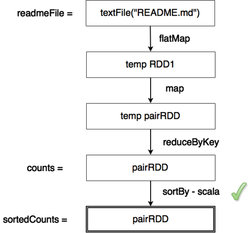
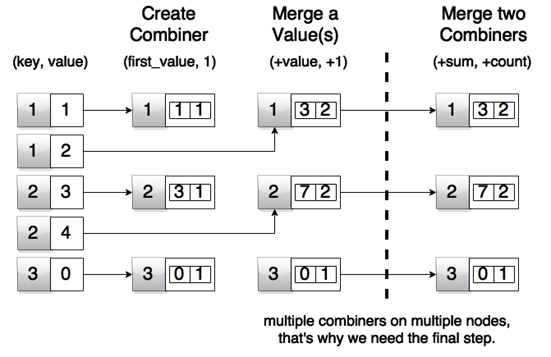

# 第 3 章火花内部

在前几章中，方向更倾向于实用性以及如何使用 Spark 进行操作。在这一章中，我们将探讨 Spark 背后的概念。我们正在后退一步，因为如果你了解所有速度的来源，你将能够以更好的方式利用火花的力量。在 Java 源代码中，您可能已经注意到名字中有 RDD 的类。RDD 代表*弹性分布式数据集*。我们之前提到过它们，但没有过多讨论。它们通常被描述为简单的集合。实际上，你可以这样对待他们，这很好，但他们背后还有更多。让我们深入探讨 RDD 的概念。

## 弹性分布式数据集(RDD)

我们已经提到了 RDD 的概念，但还没有深入探讨。让我们看看什么是真正的 RDD。RDD 是可以并行操作的不可变的分布式元素集合。这是 Spark 用来运行的基本抽象。rdd 支持各种类型的转换。我们已经使用了其中的一些，比如前面例子中的`map`和`filter,`。每一次变革都创造了一个新的 RDD。关于 rdd 需要记住的一件重要的事情是，它们被懒洋洋地评估；当要求他们进行转换时，实际工作不会马上完成。仅存储关于 RDD 来源的信息，并且必须应用转换。

|  | 注意:RDD 是延迟评估的数据结构。简而言之，这意味着没有与在 RDDs 上调用转换相关的处理。 |

这一开始让许多开发人员感到困惑，因为他们执行了所有的转换，最终没有得到他们期望的结果。这完全没问题，实际上也是 Spark 的工作方式。现在你可能想知道:我们如何获得结果？答案是通过调用动作。动作触发 RDDs 上的计算操作。在我们前面的例子中，通过使用`take`或`saveAsTextFile`来调用动作。

|  | 注意:调用操作会触发计算操作。动作=计算 |

延迟评估转换有很多好处。其中一些是操作可以组合在一起，减少了处理数据的节点之间的联网；同一数据没有多次通过。但这一切都有一个陷阱。根据用户的操作请求，Spark 将执行计算。如果步骤之间的数据没有被缓存，Spark 将再次重新评估表达式，因为 rdd 没有被具体化。我们可以通过调用`cache`或`persist`来指示 Spark 实现计算的操作。我们将很快讨论细节。在我们深入研究缓存是如何工作的之前，重要的是要提到 rdd 之间的关系被表示为一个有向无环图，或者 DAG。让我们通过查看一段 Scala 代码来分解它:

代码清单 37:readme . MD 文件中的 Scala 字数，十个最常见的单词

```scala
      val readmeFile = sc.textFile("README.md")

      val counts = readmeFile.flatMap(line => line.split(" ")).
          map(word => (word, 1)).
          reduceByKey(_ + _)

      val sortedCounts = counts.sortBy(_._2, false)

      sortedCounts.take(10).foreach(println)

```

一个 RDD 是从一个`README.md`文件创建的。对文件中的行调用`flatMap`转换也会创建一个 RDD，然后用一个单词和一个数字创建一对 RDD。与同一个单词配对的数字然后被加在一起。之后，我们按计数排序，取前十位，打印出来。触发计算的第一个动作是`sortBy.`这是一个特定于 Scala 的操作，它需要具体的数据来进行排序，从而触发计算。让我们来看看在此之前的 DAG:



图 44:计算操作有向无环图

图 44 显示了 rdd 是如何计算的。顶点是关系图，边是关系图上的变换和动作。只有动作可以触发计算。在我们的例子中，这发生在我们调用`sortBy`动作的时候。Spark 中有相当多的转换，所以我们只讨论最常见的转换。

表 3:常见火花转换

| 转换 | 描述 |
| 过滤器(功能) | 返回通过选择源中*函数*返回真的那些元素而形成的新数据集。 |
| 地图(功能) | 返回通过函数传递源的每个元素而形成的新分布式数据集。 |
| 平面地图(功能) | 类似于 map，但是每个输入项可以映射到 0 个或更多的输出项(因此函数应该返回一个序列，而不是单个项)。 |
| 不同([numTasks]) | 返回包含源数据集的不同元素的新数据集。 |
| 样本(有替换、部分、种子) | 使用给定的随机数发生器种子对数据的一部分进行采样，无论有无替换。通常在开发或调试时使用。 |
| 联合(其他数据集) | 返回一个新数据集，该数据集包含源数据集中的元素和参数的并集。 |
| 交集(其他数据集) | 返回一个新的 RDD，其中包含源数据集中元素和参数的交集。 |
| 笛卡尔坐标(其他数据集) | 当在类型为 T 和 U 的数据集上调用时，返回(T，U)对(所有元素对)的数据集。 |
| 来源:[http://spark . Apache . org/docs/latest/programming-guide . html # transformations](http://spark.apache.org/docs/latest/programming-guide.html#transformations) |

大多数从 Spark 开始的人都会对`flatMap`和`map`功能感到困惑。最简单的方法就是记住`map`是一对一的功能`flatmap`是一对多的功能。`flatMap`的输入通常是元素的集合。在我们的例子中，我们从文本行开始。文本行然后被拆分成单词。每行包含零个或多个单词。但是我们希望每个单词都单独出现在最终的 RDD 中，所以我们使用了`flatMap`函数。为了让它在你身上停留更长时间，让我们看看下图:


图 45:火花变换图和平面图在起作用

提到的一些转换主要用于简单的关系数据库，而一些更常用于成对关系数据库。我们暂时只提到它们，稍后将深入讨论。让我们看看一些最常见的操作:

表 4:常见火花动作

| 转换 | 描述 |
| 收集() | 在驱动程序中将数据集的所有元素作为数组返回。这通常在返回足够小的数据子集的过滤器或其他操作之后有用。打这个电话要小心。 |
| 计数() | 返回数据集中的元素数量。 |
| 第一次() | 返回数据集的第一个元素(类似于 take(1))。 |
| 拿(n) | 返回包含数据集第一个 *n 个*元素的数组。 |
| 提取样本(带替换，编号，[种子]) | 返回一个带有数据集“num”元素随机样本的数组，有或没有替换，可选地预先指定一个随机数生成器种子。 |
| 减少(函数) | 使用函数(接受两个参数并返回一个参数)聚合数据集的元素。该函数应该是可交换的和关联的，以便能够正确地并行计算。 |
| foreach(函数) | 对数据集的每个元素运行一个函数。通常用于与外部存储系统交互。 |
| saveAsTextFile(路径) | 将数据集的元素作为文本文件(或文本文件集)写入本地文件系统、HDFS 或任何其他 Hadoop 支持的文件系统中的给定目录。Spark 将在每个元素上调用 toString，将其转换为文件中的一行文本。 |
| 来源:[http://spark . Apache . org/docs/latest/programming-guide . html # actions](http://spark.apache.org/docs/latest/programming-guide.html#actions) |

既然我们已经介绍了最常用的动作和转换，那么提到一些在使用 Spark 开发应用程序时非常方便的助手操作可能是一件好事。其中之一就是爆炸:

代码清单 38:在火花壳中运行到爆炸的结果

```scala
      scala> sortedCounts.toDebugString

      res6: String =
      (2) MapPartitionsRDD[26] at sortBy at <console>:25 []
       |  ShuffledRDD[25] at sortBy at <console>:25 []
       +-(2) MapPartitionsRDD[22] at sortBy at <console>:25 []
          |  ShuffledRDD[21] at reduceByKey at <console>:25 []
          +-(2) MapPartitionsRDD[20] at map at <console>:24 []
             |  MapPartitionsRDD[19] at flatMap at <console>:23 []
             |  MapPartitionsRDD[18] at textFile at <console>:21 []
             |  README.md HadoopRDD[17] at textFile at <console>:21 []

```

结果是有向无环图的文本表示，它与我们称之为`toDebugString`方法的值或变量相关联。前面我们提到，我们可以通过缓存结果来避免不必要的计算。我们将在下一节讨论这个问题。

## 缓存 rdd

很多时候有向无环图不会是简单的层次结构。在实践中，它可能涉及许多分支到新层次的层次。


图 46:具有候选缓存的复杂有向无环图

当我们因为懒惰的评估而在每一个被调用的动作的末尾调用动作时，计算会一直进行到每一个动作的开始。缓存 rdd 是一个很好的做法，这些 rdd 是生成大量其他 rdd 的来源。在图 46 中，用红色标记标记的 RDD 无疑是缓存的候选对象。有两种方法可以用来缓存 RDD。一个是`cache`，一个是`persist`。方法`cache`只是`persist,`的简写，这里使用默认存储级别`MEMORY_ONLY`。让我们看一下缓存存储级别:

表 5:火花储存水平

| 存储级别 | 描述 |
| 仅内存 | 将 RDD 存储为 JVM 中反序列化的 Java 对象。如果 RDD 不适合内存，一些分区将不会被缓存，并且会在每次需要时被重新计算。这是默认级别。 |
| 内存和磁盘 | 将 RDD 存储为 JVM 中反序列化的 Java 对象。如果 RDD 不适合内存，将不适合的分区存储在磁盘上，并在需要时从那里读取它们。 |
| 只读存储器 | 将 RDD 存储为序列化的 Java 对象(每个分区一个字节数组)。这通常比反序列化的对象更节省空间，尤其是在使用快速序列化程序时，但读取起来更耗费 CPU。 |
| 内存和磁盘服务 | 类似于 MEMORY_ONLY_SER，但是将不适合内存的分区溢出到磁盘，而不是在每次需要时动态重新计算它们。 |
| 仅磁盘 | 仅将 RDD 分区存储在磁盘上。 |
| MEMORY_ONLY_2、MEMORY_AND_DISK_2 等。 | 与以前的级别相同，但在两个群集节点上复制每个分区。 |
| 关闭堆 | 正处于试验阶段。 |
| 来源:[http://spark . Apache . org/docs/latest/programming-guide . html # rdd-persistence](http://spark.apache.org/docs/latest/programming-guide.html#rdd-persistence) |

Spark 系统通常面向拥有大量 CPU 内核和大量 RAM。你必须有非常充分的理由在磁盘上存储一些东西。大多数情况下，该选项仅用于固态硬盘。在本书的前面，当我们谈到大数据处理的基础时，有一个比较表，其中一个 CPU 周期是代表一秒钟的基线。内存访问时间为六分钟，固态硬盘访问时间为两到六天。相比之下，旋转盘面需要一到十二个月。将数据保存到磁盘时，请记住这一点。

|  | 提示:Spark 需要内核和 RAM 大多数情况下，建议避开磁盘。 |

这并不意味着您应该不惜一切代价避免它，但是在磁盘上存储数据时，您必须意识到性能的显著下降。如果你还记得关于 Spark 排序记录的故事，排序的数据量肯定不仅仅适合 RAM，磁盘也被大量使用。重要的是要意识到磁盘比内存慢得多的事实。有时甚至去磁盘可能是一个比从各种网络存储或类似的东西中获取元素更好的选择。在这些情况下，缓存肯定会派上用场。让我们看看如何缓存 RDD。在本章中，我们主要使用 Scala 语言，因为我们讨论的是概念，而不是特定语言的实现。让我们缓存一个 RDD:

代码清单 39:在 RDD 上调用缓存

```scala
      scala> sortedCounts.cache()
      res7: sortedCounts.type = MapPartitionsRDD[26] at sortBy at <console>:25

      scala> sortedCounts.take(10).foreach(println)
      (,66)
      (the,21)
      (Spark,14)
      (to,14)
      (for,11)
      (and,10)
      (a,9)
      (##,8)
      (run,7)
      (can,6)

```

rdd 的评估比较懒散，所以只调用 cache 没有效果。这就是为什么我们要从 RDD 提取前十个元素并打印出来。我们正在调用操作，调用操作会触发缓存。

我们之前没有提到它，但是当您运行一个 Spark 或 Python shell 时，它也会启动一个小的 web 应用程序，为您提供 shell 使用的资源、环境等的概述。打开浏览器导航至 [http://localhost:4040/](http://localhost:4040/) 即可查看。此操作的结果应该如下所示:


图 47:火花壳应用程序界面

默认情况下，火花壳应用程序用户界面打开作业选项卡。导航到存储选项卡:


图 48:火花壳应用程序用户界面存储细节

我们通过调用缓存来缓存的 RDD 在 Spark Shell 应用程序用户界面存储选项卡中可见。我们甚至可以通过点击 RDD 名称来了解详情:


图 49:单个 RDD 的火花壳应用程序用户界面存储细节

如果您想停止缓存您的 RDDs 以释放资源用于进一步处理，您可以简单地在特定的 RDD 上调用`unpersist`方法。这种方法有立竿见影的效果，你不必等到 RDD 被重新计算。以下是`unpersist`工作原理的一个例子:

代码清单 40:在 RDD 调用 Unpersist

```scala
      scala> sortedCounts.unpersist()

      res3: sortedCounts.type = MapPartitionsRDD[9] at sortBy at <console>:25

```

你可以在 Spark 的 WebUI 中查看调用`cache`和`unpersist`方法的效果，我们在前面的图中已经展示过了。

到目前为止，我们已经涵盖了足够的内容，可以让您使用 rdd。在前面的例子中，我们只是提到了 Pair RDDs，并与它们一起工作了一段时间，但我们没有深入讨论它们。在下一节中，我们将解释如何使用配对 rdd。

## 配对 rdd

成对 rdd 的行为与基本 rdd 非常相似。主要区别在于，RDD 元素是键值对，键值对自然适合分布式计算问题。配对关系数据库主要用于执行各种聚合和初始提取转换加载过程步骤。就性能而言，关于它们有一个很少被提及的重要事实:配对 rdd 不会溢出到磁盘上。只有基本的 rdd 可以溢出到磁盘上。这意味着单对 RDD 必须适合计算机内存。如果配对 RDD 内容大于群集中最小内存量的大小，则无法处理。在前面的例子中，我们已经使用了 Pair RDDs，只是没有深入研究它们。

我们将从这里最简单的例子开始。我们将从自己定义的内存元素集合中创建 rdd。为此，我们将调用`parallelize` Spark 上下文函数。Java API 的类型更强一点，不能进行自动转换，所以 Java 代码会更健壮一点，因为我们必须从一开始就用正确的类型来对待元素。在这个例子中，使用 Java 8 并没有明显的优势，所以我们将继续使用 Java 7。与前几章一样，让我们从 Scala 开始:

代码清单 41:Scala 中的简单配对 RDD 定义

```scala
      val pairs = List((1,1), (1,2), (2,3), (2, 4), (3, 0))

      val pairsRDD = sc.parallelize(pairs)

      pairsRDD.take(5)

```

代码清单 42:Scala 结果中的简单配对 RDD 定义

```scala
      scala> pairsRDD.take(5)
      res2: Array[(Int, Int)] = Array((1,1), (1,2), (2,3), (2,4), (3,0))

```

代码清单 43:Python 中的简单配对 RDD 定义

```scala
      pairs = [(1, 1), (1, 2), (2, 3), (2, 4), (3, 0)]

      pairs_rdd = sc.parallelize(pairs)

      pairs_rdd.take(5)

```

代码清单 44:Python 结果中的简单配对 RDD 定义

```scala
      >>> pairs_rdd.take(5)
      [(1, 1), (1, 2), (2, 3), (2, 4), (3, 0)]

```

如前所述，Java 示例将包含更多细节。Java 没有交互式外壳，所以我们只需将 Java pair RDD 创建的结果输出到一个文本文件中。为了定义对，我们将使用 Scala 提供的 Tuple2 类。在前面的例子中，类型之间的转换是由 Scala 自动完成的，所以它的代码比 Java 少得多。另一个重要的区别是，在 Java 中`parallelize`只适用于基本的 rdd。要在 Java 中创建成对的 rdd，我们必须从初始化的上下文中使用`parallelizePairs`调用。让我们从定义一个类开始:

代码清单 45:Java 中的简单配对 RDD 定义

```scala
      package com.syncfusion.succinctly.spark.examples;

      import java.util.Arrays;
      import java.util.List;

      import org.apache.spark.SparkConf;
      import org.apache.spark.api.java.JavaPairRDD;
      import org.apache.spark.api.java.JavaSparkContext;

      import scala.Tuple2;

      public class PairRDDJava7 {
          public static void main(String[] args) {
              if (args.length < 1) {
                  System.err.println("Please provide a full path to the output file");
                  System.exit(0);
              }

              SparkConf conf = new SparkConf().setAppName("PairRDDJava7").setMaster("local");
              JavaSparkContext context = new JavaSparkContext(conf);

              List<Tuple2<Integer, Integer>> pairs = Arrays.asList(
                      new Tuple2(1, 1), new Tuple2<Integer, Integer>(1, 2),
                      new Tuple2<Integer, Integer>(2, 3), new Tuple2<Integer, Integer>(2, 4),
                      new Tuple2<Integer, Integer>(3, 0));

              JavaPairRDD<Integer, Integer> pairsRDD = context.parallelizePairs(pairs);

              pairsRDD.saveAsTextFile(args[0]);
          }
      }

```

作为一个简短的复习，要将这个类提交给 Spark，您需要使用前面章节中描述的 Maven 重新运行打包步骤。请注意，您提交的方式可能会因您使用的操作系统而异:

代码清单 46:在 Linux 机器上向 Spark 提交 PairRDDJava7

```scala
      $ ./bin/spark-submit \
      --class com.syncfusion.succinctly.spark.examples.PairRDDJava7 \
      --master local \
      /root/spark/SparkExamples-0.0.1-SNAPSHOT.jar \
      /root/spark/resultspair

```

提交作业时，操作结果通常不会输出到日志中。稍后，我们将展示在永久存储器中存储数据的其他方法。目前，结果将保存到一个文件夹中。以下是结果输出文件内容:

代码清单 47:提交给 Spark 的 PairRDDJava7 任务的输出文件

```scala
      (1,1)
      (1,2)
      (2,3)
      (2,4)
      (3,0)

```

前面的例子展示了如何从基本的内存数据结构中定义配对关系数据库。现在，我们将使用 Pair RDDs 来复习基本操作。配对关系数据库拥有基本关系数据库拥有的所有操作，因此，例如，您可以根据一些标准过滤掉它们。

### 聚合成对 rdd

当涉及到配对 rdd 时，这是一个非常常见的用例。当我们进行字数统计时，我们对一对 RDD 使用了`reduceByKey`变换。当调用`reduceByKey`时，返回一对与原始 RDD 具有相同键的 RDD，并且对具有相同键的每个值进行值的聚合。让我们看看在前面的例子中使用的对(1，1)、(1，2)、(2，3)、(2，4)和(3，0)调用它的结果。我们要取五个元素，虽然我们知道结果不一定是所有元素的总和。这只是为了触发计算并显示一些结果。同样，要运行 Java，您必须向 Spark 提交一个 jar。为了使内容更简短，在 Java 中，我们将只显示示例中代码的功能部分:

代码清单 Scala 中的 reduceByKey

```scala
      scala> pairsRDD.reduceByKey(_+_).take(5)
      res4: Array[(Int, Int)] = Array((1,3), (2,7), (3,0))

```

代码清单 49:Python 中的 reduceByKey

```scala
      >>> pairs_rdd.reduceByKey(lambda a, b: a + b).take(5)
      [(1, 3), (2, 7), (3, 0)]

```

代码清单 Java 7 中的 reduceByKey

```scala
      JavaPairRDD<Integer, Integer> reduceByKeyResult = pairsRDD
              .reduceByKey(new Function2<Integer, Integer, Integer>() {
                  public Integer call(Integer a, Integer b) {
                      return a + b;
                  }
              });

      reduceByKeyResult.saveAsTextFile(args[0]);

```

代码清单 Java 8 中的 reduceByKey

```scala
      JavaPairRDD<Integer, Integer> reduceByKeyResult = pairsRDD.reduceByKey((a, b) -> a + b);

      reduceByKeyResult.saveAsTextFile(args[0]);

```

请注意，在 Java 中，我们没有调用 take 操作，因为将 RDDs 保存到文本文件中会遍历所有 RDD 元素。生成的文件如下所示:

代码清单 52: Java reduceByKey 输出

```scala
      (1,3)
      (3,0)
      (2,7)

```

让我们在概念上更进一步。这个例子相对简单，因为我们所要做的就是把所有的东西加起来。不过，在现实生活中可能会变得相当复杂。例如，计算一个键的平均值在实践中是一个非常常见的问题。这并不简单，需要一些步骤。第一步，我们必须确定所有关键事件的总数。第二步是将所有元素组合在一起，然后通过键将它们相加。在最后一步中，我们必须将总和除以每个键的总计数。为了实现这个目标，我们将使用`combineByKey`功能。这有点复杂，所以我们将把它分成几部分。为了便于解释，我们再次使用我们的列表`((1,1), (1,2), (2,3), (2, 4), (3, 0))`。我们将在给出文本解释后以图形方式显示它，以确保您理解它。我知道刚开始可能会觉得有点挑战性，但是如果它不能马上生效，试着读几遍这个部分。让我们从主要解释开始:

1.创建一个组合器–为每个键完成第一个聚合步骤。本质上，对于每个键，我们创建一个包含值和值 1 的对列表。

2.合并一个值–对于每个键，我们将累加总和，并将元素总数增加 1。

3.合并两个合并器——在最后一步，我们将把所有的总和和所有的计数相加。这也是必要的，因为部分计算是在不同的机器上完成的。当结果出来时，我们把它们结合在一起。

我们将很快复习编程语言中的例子。在给出任何代码示例之前，让我们看一下图形描述，这样它会更好。对你们中的一些人来说，最后一步可能看起来有点不必要，但是请记住，Spark 并行处理数据，并且您必须组合从集群中的所有节点返回的数据。为了使我们的例子在最后一步发挥作用(如下图所示)，我们必须检查所有返回的结果，并用 count 除和。但这只是基本的映射，我们不会深入讨论。下图显示了`combineByKey`是如何工作的:



图 50:火花组合正在运行

以下是 Scala 中的代码:

代码清单 53: Spark combineByKey Scala 代码

```scala
      val pairAverageResult = pairsRDD.combineByKey(
          (v) => (v, 1),
          (acc: (Int, Int), v) => (acc._1 + v, acc._2 + 1),
          (acc1: (Int, Int), acc2: (Int, Int)) => (acc1._1 + acc2._1, acc1._2 + acc2._2)
          ).map{ case (key, value) => (key, value._1 / value._2.toFloat)}

```

在 Spark Shell 中运行以前代码的结果:

代码清单 54:火花壳中的火花组合结果

```scala
      scala> pairAverageResult.take(5);

      res6: Array[(Int, Float)] = Array((1,1.5), (2,3.5), (3,0.0))

```

我们只是在尝试火花壳的东西；部分调试 RDDs 最简单的方法是取出第一个 *n 个*元素。我们知道我们的收藏中只有三把钥匙，所以拿出五把肯定会全部打印出来。这些示例的目的与其说是为了性能和生产级别的优化，不如说是为了让您在本书结束之前能够轻松使用 Spark API。我们在 Scala 中介绍了一个非常复杂的例子。让我们看看这在 Python 中会是什么样子:

代码清单 55: Spark combineByKey Python 代码

```scala
      pair_average_result = pairs_rdd.combineByKey((lambda v: (v, 1)),
                                       (lambda a1, v: (a1[0] + v, a1[1] + 1)),
                                       (lambda a2, a1: (a2[0] + a1[0], a2[1] + a1[1]))
                                       ).map(lambda acc: (acc[0], (acc[1][0] / float(acc[1][1]))))

```

现在我们有了代码，让我们看看结果:

代码清单 56:PySpark 中的 Spark combineByKey 结果

```scala
      >>> pair_average_result.take(5)

      [(1, 1.5), (2, 3.5), (3, 0.0)]

```

Scala 和 Python 的例子相对相似。现在我们将展示 Java 7 版本。与 Scala 和 Python 相比，您会注意到代码要多得多。为了完整起见，让我们看一下完整的代码:

代码清单 57: Spark combineByKey Java7 代码

```scala
      package com.syncfusion.succinctly.spark.examples;

      import java.io.PrintWriter;
      import java.io.Serializable;
      import java.util.Arrays;
      import java.util.List;
      import java.util.Map;

      import org.apache.spark.SparkConf;
      import org.apache.spark.api.java.JavaPairRDD;
      import org.apache.spark.api.java.JavaSparkContext;
      import org.apache.spark.api.java.function.Function;
      import org.apache.spark.api.java.function.Function2;

      import scala.Tuple2;

      public class CombineByKeyJava7 {

                      public static class AverageCount implements Serializable {
                                      public int _sum;
                                       public int _count;

                                       public AverageCount(int sum, int count) {
                                                      this._sum = sum;
                                                      this._count = count;
                                      }

                                      public float average() {
                                                      return _sum / (float) _count;
                                      }
                      }

                      public static void main(String[] args) throws Exception {
                                      if (args.length < 1) {
                                                      System.err.println("Please provide a full path to the output file");
                                                      System.exit(0);
                                      }

                                      SparkConf conf = new SparkConf().setAppName("CombineByKeyJava7").setMaster("local");
                                      JavaSparkContext context = new JavaSparkContext(conf);

                                      Function<Integer, AverageCount> createCombiner =
                                                                      new Function<Integer, AverageCount>() {
                                                      public AverageCount call(Integer x) {
                                                                      return new AverageCount(x, 1);
                                                      }
                                      };

                                      Function2<AverageCount, Integer, AverageCount> mergeValues =
                                                                      new Function2<AverageCount, Integer, AverageCount>() {
                                                      public AverageCount call(AverageCount a, Integer x) {
                                                                      a._sum += x;
                                                                      a._count += 1;
                                                                      return a;
                                                      }
                                      };

                                      Function2<AverageCount, AverageCount, AverageCount> mergeTwoCombiners =
                                                                      new Function2<AverageCount, AverageCount, AverageCount>() {
                                                      public AverageCount call(AverageCount a, AverageCount b) {
                                                                      a._sum += b._sum;
                                                                      a._count += b._count;
                                                                      return a;
                                                      }
                                      };

                                      List<Tuple2<Integer, Integer>> pairs = Arrays.asList(new Tuple2(1, 1), new Tuple2<Integer, Integer>(1, 2),
                                                                      new Tuple2<Integer, Integer>(2, 3), new Tuple2<Integer, Integer>(2, 4),
                                                                      new Tuple2<Integer, Integer>(3, 0));

                                      JavaPairRDD<Integer, Integer> pairsRDD = context.parallelizePairs(pairs);

                                      JavaPairRDD<Integer, AverageCount> pairAverageResult = pairsRDD.combineByKey(createCombiner, mergeValues,
                                                                      mergeTwoCombiners);

                                      Map<Integer, AverageCount> resultMap = pairAverageResult.collectAsMap();

                                      PrintWriter writer = new PrintWriter(args[0]);

                                      for (Integer key : resultMap.keySet()) {
                                                      writer.println(key + ", " + resultMap.get(key).average());
                                      }

                                      writer.close();
                      }
      }

```

代码应该根据运行时给它的参数产生一个输出文件。在我的例子中，它被写入 combineByKey.txt 文件，看起来像:

代码清单 58:火花组合 Java 7 版本

```scala
      2, 3.5
      1, 1.5
      3, 0.0

```

同样，这看起来像很多代码，但我想 Java 老手已经习惯了——也许不喜欢它，但这就是 Java 8 之前版本的情况。作为比较，我们将看看 Java 8 的算法部分:

代码清单 59: Spark combineByKey Java 8 算法部分

```scala
      JavaPairRDD<Integer, AverageCount> pairAverageResult = pairsRDD.combineByKey(
              x -> new AverageCount(x, 1),
              (a, x) -> { a._sum += x; a._count += 1; return a; },
              (a, b) -> { a._sum += b._sum; a._count += b._count; return a; });

```

请注意，导入、参数处理和类定义仍与前面的示例相同。Java 示例有更多的代码，因为目前 Java 不支持交互式外壳。提交任务也与 Java 7 示例非常相似。你可能会给你的班级起一个不同的名字。总而言之，如您所见，本例中的代码少了很多。由于代码更少，维护起来可能更容易。

在本节中，我们演示了数据聚合的基础知识。同样，它不仅仅是这里展示的，但这本书的目标是让你前进。在下一节中，我们将讨论数据分组。

### 数据分组

分组与聚合非常相似。区别在于它只对数据进行分组；不像在聚合中那样计算每个组的值。分组可以用作其他操作的基础，例如两个配对关系数据库之间的连接和相交，但是这样做通常是一个非常糟糕的想法，因为它不是非常有效。在前一节中，我们使用了简单的整数键值对。如果我们这样做了，本节中的例子就没有多大意义了，所以我们将从我们在本书中使用的三种语言中定义简单的数据集。为了复习本节的示例，我们将定义一个关于二手车的简单示例。内部记录将是一年、一个名字和一种颜色。我们还将创建一对 RDD。让我们从 Scala 版本开始，然后对 Python 和 Java 做同样的事情:

代码清单 60: Scala 二手车初始数据定义

```scala
      case class UsedCar(year: Int, name: String, color: String)

      val cars = List(
          UsedCar(2012, "Honda Accord LX", "gray"),
          UsedCar(2008, "Audi Q7 4.2 Premium", "white"),
          UsedCar(2006, "Mercedes-Benz CLS-Class CLS500", "black"),
          UsedCar(2012, "Mitsubishi Lancer", "black"),
          UsedCar(2010, "BMW 3 Series 328i", "gray"),
          UsedCar(2006, "Buick Lucerne CX", "gray"),
          UsedCar(2006, "GMC Envoy", "red")
      )

```

代码清单 61: Python 二手车初始数据定义

```scala
      cars = [
          (2012, 'Honda Accord LX', 'gray'),
          (2008, 'Audi Q7 4.2 Premium', 'white'),
          (2006, 'Mercedes-Benz CLS-Class CLS500', 'black'),
          (2012, 'Mitsubishi Lancer', 'black'),
          (2010, 'BMW 3 Series 328i', 'gray'),
          (2006, 'Buick Lucerne CX', 'gray'),
          (2006, 'GMC Envoy', 'red')
      ]

```

代码清单 62: Java 二手车初始数据定义

```scala
          public static class UsedCar implements Serializable {
              public int _year;
              public String _name;
              public String _color;

              public UsedCar(int year, String name, String color) {
                  this._year = year;
                  this._name = name;
                  this._color = color;
              }
          }

          // rest of the code coming soon

          List<UsedCar> cars = Arrays.asList(
              new UsedCar(2012, "Honda Accord LX", "gray"),
              new UsedCar(2008, "Audi Q7 4.2 Premium", "white"),
              new UsedCar(2006, "Mercedes-Benz CLS-Class CLS500", "black"),
              new UsedCar(2012, "Mitsubishi Lancer", "black"),
              new UsedCar(2010, "BMW 3 Series 328i", "gray"),
              new UsedCar(2006, "Buick Lucerne CX", "gray"),
              new UsedCar(2006, "GMC Envoy", "red")
          );

```

我们将创建配对关系数据库，年份作为关键字，条目本身作为值:

代码清单 63:以年份为关键字、条目为值的 Scala Pair RDD

```scala
      val carsByYear = sc.parallelize(cars).map(x => (x.year, x))

```

代码清单 64: Python 将 RDD 与年份作为关键字，条目作为值配对

```scala
      cars_by_year = sc.parallelize(cars).map(lambda x : (x[0], x))

```

对于 Java，我们必须在这里重复很多代码，所以我们现在就跳过它，在最后提供最后一个例子。我们现在的目标是在一年内收回所有二手车。我们将在示例中使用 2006 年。为此，我们将使用`groupBy`方法。很多时候，`reduceByKey`和`combineByKey`性能更好，但是当我们需要将数据分组在一起的时候，`groupBy`就派上了用场。请注意，分组转换可能会产生大对。请记住，任何给定的配对 RDD 元素都必须适合内存。RDD 可以拆分到磁盘，但单个 Pair RDD 实例必须适合内存。让我们按年份对数据集进行分组，然后在 Scala 中查找 2006 年的所有值:

代码清单 65:2006 年的斯卡拉二手车

```scala
      scala> carsByYear.groupByKey().lookup(2006)

      res6: Seq[Iterable[UsedCar]] = ArrayBuffer(CompactBuffer(UsedCar(2006,Mercedes-Benz CLS-Class CLS500,black), UsedCar(2006,Buick Lucerne CX,gray), UsedCar(2006,GMC Envoy,red)))

```

使用 Python，我们将展示整个数据结构的外观，以便您获得整体印象:

代码清单 66: Python 显示了按年份分组的所有可用二手车

```scala
      >>> cars_by_year.groupByKey().map(lambda x : (x[0], list(x[1]))).collect()

      [(2008, [(2008, 'Audi Q7 4.2 Premium', 'white')]), (2012, [(2012, 'Honda Accord LX', 'gray'), (2012, 'Mitsubishi Lancer', 'black')]), (2010, [(2010, 'BMW 3 Series 328i', 'gray')]), (2006, [(2006, 'Mercedes-Benz CLS-Class CLS500', 'black'), (2006, 'Buick Lucerne CX', 'gray'), (2006, 'GMC Envoy', 'red')])]

```

代码清单 67:group by key 的 Java 示例

```scala
      package com.syncfusion.succinctly.spark.examples;

      import java.io.PrintWriter;
      import java.io.Serializable;
      import java.util.Arrays;
      import java.util.List;

      import org.apache.spark.SparkConf;
      import org.apache.spark.api.java.JavaPairRDD;
      import org.apache.spark.api.java.JavaSparkContext;
      import org.apache.spark.api.java.function.PairFunction;

      import scala.Tuple2;

      public class GroupByKeyJava7 {

                      public static class UsedCar implements Serializable {
                                      public int _year;
                                      public String _name;
                                      public String _color;

                                      public UsedCar(int year, String name, String color) {
                                                      this._year = year;
                                                      this._name = name;
                                                      this._color = color;
                                      }
                      }

                      public static void main(String[] args) throws Exception {
                                      if (args.length < 1) {
                                                      System.err.println("Please provide a full path to the output file");
                                                      System.exit(0);
                                      }

                                      SparkConf conf = new SparkConf()
                                                                      .setAppName("GroupByKeyJava7").setMaster("local");
                                      JavaSparkContext context = new JavaSparkContext(conf);

                                      List<UsedCar> cars = Arrays.asList(
                                                          new UsedCar(2012, "Honda Accord LX", "gray"),
                                                          new UsedCar(2008, "Audi Q7 4.2 Premium", "white"),
                                                          new UsedCar(2006, "Mercedes-Benz CLS-Class CLS500", "black"),
                                                          new UsedCar(2012, "Mitsubishi Lancer", "black"),
                                                          new UsedCar(2010, "BMW 3 Series 328i", "gray"),
                                                          new UsedCar(2006, "Buick Lucerne CX", "gray"),
                                                          new UsedCar(2006, "GMC Envoy", "red")
                                                      );

                                      JavaPairRDD<Integer, UsedCar> carsByYear = context.parallelize(cars)
                                                                      .mapToPair(new PairFunction<UsedCar, Integer, UsedCar>() {
                                                                                      public Tuple2<Integer, UsedCar> call(UsedCar c) {
                                                                                                      return new Tuple2<Integer, UsedCar>(c._year, c);
                                                                                      }
                                                                      });

                                      List<Iterable<UsedCar>> usedCars2006 = carsByYear.groupByKey().lookup(2006);

                                      PrintWriter writer = new PrintWriter(args[0]);

                                      for (Iterable<UsedCar> usedCars : usedCars2006) {
                                                      for (UsedCar usedCar : usedCars) {
                                                                      writer.println(
                                                                                      usedCar._year
                                                                                      + ", " + usedCar._name
                                                                                      + ", " + usedCar._color);
                                                      }
                                      }

                                      writer.close();
                      }
      }

```

运行 Java 示例的结果是一个包含 2006 年以来汽车产品的文件:

代码清单 68:Java 示例处理的结果

```scala
      $ cat /syncfusion/spark/out/groupByKey.txt

      2006, Mercedes-Benz CLS-Class CLS500, black
      2006, Buick Lucerne CX, gray
      2006, GMC Envoy, red

```

通过这个例子，我们了解了如何在 Spark 中将数据分组在一起。在下一节中，我们将讨论对关系数据库进行排序。

### 分类配对 rdd

排序是日常计算机应用中一个非常重要的功能。如果对数据进行排序，人们会更好地感知数据并注意到重要的差异和趋势。在许多情况下，排序是按时间进行的。其他要求，比如按字母排序，是完全有效的。有一个重要的事实你必须记住:

|  | 注意:排序是一项昂贵的操作。尝试对较小的集合进行排序。 |

当我们排序时，集群中的所有机器必须相互联系，并在排序数据的整个过程中反复交换多个数据集。因此，当您需要排序时，尝试在较小的数据集上调用它。我们将使用上一节中定义的数据。在本节中，我们将简单地按年份对其进行排序:

代码清单 69: Scala 按年份降序排列汽车产品

```scala
      scala> carsByYear.sortByKey(false).collect().foreach(println)

      (2012,UsedCar(2012,Honda Accord LX,gray))
      (2012,UsedCar(2012,Mitsubishi Lancer,black))
      (2010,UsedCar(2010,BMW 3 Series 328i,gray))
      (2008,UsedCar(2008,Audi Q7 4.2 Premium,white))
      (2006,UsedCar(2006,Mercedes-Benz CLS-Class CLS500,black))
      (2006,UsedCar(2006,Buick Lucerne CX,gray))
      (2006,UsedCar(2006,GMC Envoy,red))

```

代码清单 70: Python 按年份分类汽车产品

```scala
      cars_sorted_by_years = cars_by_year.sortByKey().map(lambda x : (x[0], list(x[1]))).collect()

      for x in cars_sorted_by_years:
          print str(x[0]) + ', ' + x[1][1] + ', '+ x[1][2]

```

代码清单 71:在 PySpark 中运行的 Python 结果

```scala
      >>> for x in cars_sorted_by_years:
      ...     print str(x[0]) + ', ' + x[1][1] + ', '+ x[1][2]
      ...
      2006, Mercedes-Benz CLS-Class CLS500, black
      2006, Buick Lucerne CX, gray
      2006, GMC Envoy, red
      2008, Audi Q7 4.2 Premium, white
      2010, BMW 3 Series 328i, gray
      2012, Honda Accord LX, gray
      2012, Mitsubishi Lancer, black
      >>>

```

由于我们已经提到的原因，Java 示例将再次包含更多的代码:

代码清单 72:Java 中按键排序的代码

```scala
      package com.syncfusion.succinctly.spark.examples;

      import java.io.PrintWriter;
      import java.io.Serializable;
      import java.util.Arrays;
      import java.util.List;

      import org.apache.spark.SparkConf;
      import org.apache.spark.api.java.JavaPairRDD;
      import org.apache.spark.api.java.JavaSparkContext;
      import org.apache.spark.api.java.function.PairFunction;

      import scala.Tuple2;

      public class SortByKeyJava7 {

                      public static class UsedCar implements Serializable {
                                      public int _year;
                                      public String _name;
                                      public String _color;

                                      public UsedCar(int year, String name, String color) {
                                                      this._year = year;
                                                      this._name = name;
                                                      this._color = color;
                                      }
                      }

                      public static void main(String[] args) throws Exception {
                                      if (args.length < 1) {
                                                      System.err.println("Please provide a full path to the output file");
                                                      System.exit(0);
                                      }

                                      SparkConf conf = new SparkConf().setAppName("SortByKeyJava7").setMaster("local");
                                      JavaSparkContext context = new JavaSparkContext(conf);

                                      List<UsedCar> cars = Arrays.asList(
                                           new UsedCar(2012, "Honda Accord LX", "gray"),
                                           new UsedCar(2008, "Audi Q7 4.2 Premium", "white"),
                                           new UsedCar(2006, "Mercedes-Benz CLS-Class CLS500", "black"),
                                           new UsedCar(2012, "Mitsubishi Lancer", "black"),
                                           new UsedCar(2010, "BMW 3 Series 328i", "gray"),
                                           new UsedCar(2006, "Buick Lucerne CX", "gray"),
                                           new UsedCar(2006, "GMC Envoy", "red")
                                      );

                                      JavaPairRDD<Integer, UsedCar> carsByYear = context.parallelize(cars)
                                                                      .mapToPair(new PairFunction<UsedCar, Integer, UsedCar>() {
                                                                                      public Tuple2<Integer, UsedCar> call(UsedCar c) {
                                                                                                      return new Tuple2<Integer, UsedCar>(c._year, c);
                                                                                      }
                                                                      });

                                      List<Tuple2<Integer, UsedCar>> sortedCars = carsByYear.sortByKey().collect();

                                      PrintWriter writer = new PrintWriter(args[0]);

                                      for (Tuple2<Integer, UsedCar> usedCar : sortedCars) {
                                                      writer.println(
                                                                                      usedCar._2()._year
                                                                                      + ", " + usedCar._2()._name
                                                                                      + ", " + usedCar._2()._color);
                                      }

                                      writer.close();
                      }
      }

```

Java 处理的结果是:

代码清单 73:Java 代码排序的结果

```scala
      $ cat  /syncfusion/spark/out/sortByKey.txt

      2006, Mercedes-Benz CLS-Class CLS500, black
      2006, Buick Lucerne CX, gray
      2006, GMC Envoy, red
      2008, Audi Q7 4.2 Premium, white
      2010, BMW 3 Series 328i, gray
      2012, Honda Accord LX, gray
      2012, Mitsubishi Lancer, black

```

还有一组更重要的操作，我们可以用 Pair RDDs 来完成。它正在加入，我们将在下一节讨论它

### 成对 rdd 上的连接、相交、并和差运算

最重要的配对 RDD 操作之一是加入。它在处理结构化数据时特别有用，我们将在后面讨论。有三种类型的连接操作可用:内部、左侧和右侧。请注意，在 Spark 中，连接是相对昂贵的操作，因为它们倾向于在集群中移动数据。这并不意味着您根本不应该使用它们，只是要小心，如果您要将真正大的数据集连接在一起，预计处理时间会更长。以下是连接操作的概述:

表 6:连接操作

| 转换 | 描述 |
| 连接(其他数据集) | 当在数据集(K，V)和(K，W)上调用时，它返回一个(K，(V，W))对的数据集，其中包含每个键的所有元素对。 |
| 左外部连接(其他数据集) | 当在数据集(K，V)和(K，W)上调用时，它返回一个包含所有对(K，(V，Some(W))的数据集。w 属于可选类型，我们将在示例中展示如何使用可选类型。 |
| 右外部连接(其他数据集) | 当在数据集(K，V)和(K，W)上调用时，它返回一个包含所有对(K，Some(V)，W)的数据集。v 是可选类型。 |

当与 Pair RDDs 合作时，我们将继续二手车市场的例子。我们将在之前的数据集中添加汽车经销商的信息。这是我们将用于 Scala 和 Python 的数据集。对于 Java，我们就不一一介绍了。对于 Java，我们将在 Scala 和 Python 示例之后提供源代码。数据定义如下:

代码清单 74: Scala 二手车和经销商示例

```scala
      case class UsedCar(dealer: String, year: Int, name: String, color: String)

      case class Dealer(dealer: String, name: String)

      val cars = List(
          UsedCar("a", 2012, "Honda Accord LX", "gray"),
          UsedCar("b", 2008, "Audi Q7 4.2 Premium", "white"),
          UsedCar("c", 2006, "Mercedes-Benz CLS-Class CLS500", "black"),
          UsedCar("a", 2012, "Mitsubishi Lancer", "black"),
          UsedCar("c", 2010, "BMW 3 Series 328i", "gray"),
          UsedCar("c", 2006, "Buick Lucerne CX", "gray"),
          UsedCar("c", 2006, "GMC Envoy", "red"),
          UsedCar("unknown", 2006, "GMC Envoy", "red")
      )

      val carsByDealer = sc.parallelize(cars).map(x => (x.dealer, x))

      val dealers = List(
          Dealer("a", "Top cars"),
          Dealer("b", "Local dealer"),
          Dealer("d", "Best cars")
      )

      var dealersById = sc.parallelize(dealers).map(x => (x.dealer, x))

```

代码清单 75: Python 二手车和经销商示例

```scala
      cars = [
          ("a", 2012, "Honda Accord LX", "gray"),
          ("b", 2008, "Audi Q7 4.2 Premium", "white"),
          ("c", 2006, "Mercedes-Benz CLS-Class CLS500", "black"),
          ("a", 2012, "Mitsubishi Lancer", "black"),
          ("c", 2010, "BMW 3 Series 328i", "gray"),
          ("c", 2006, "Buick Lucerne CX", "gray"),
          ("c", 2006, "GMC Envoy", "red"),
          ("unknown", 2006, "GMC Envoy", "red")
      ]

      cars_by_dealer = sc.parallelize(cars).map(lambda x: (x[0], x))

      dealers = [
          ("a", "Top cars"),
          ("b", "Local dealer"),
          ("d", "Best cars")
      ]

      dealers_by_id = sc.parallelize(dealers).map(lambda x: (x[0], x))

```

既然我们已经定义了数据，我们就可以在 Scala 和 Python 中检查连接操作了。让我们从常规的内部连接操作开始:

代码清单 76:斯卡拉经销商和汽车在星火壳牌联合运营

```scala
      scala> carsByDealer.join(dealersById).foreach(println)

      (a,(UsedCar(a,2012,Honda Accord LX,gray),Dealer(a,Top cars)))
      (a,(UsedCar(a,2012,Mitsubishi Lancer,black),Dealer(a,Top cars)))
      (b,(UsedCar(b,2008,Audi Q7 4.2 Premium,white),Dealer(b,Local dealer)))

```

代码清单 77: Python 经销商和汽车在 PySpark 中联合运营

```scala
      >>> cars_and_dealers_joined = cars_by_dealer.join(dealers_by_id)
      >>>
      >>> for x in cars_and_dealers_joined.collect():
      ...     print x[0] + ', ' + str(x[1][0][1]) + ', ' + x[1][0][2] + ', ' + x[1][1][1]
      ...

      a, 2012, Honda Accord LX, Top cars
      a, 2012, Mitsubishi Lancer, Top cars
      b, 2008, Audi Q7 4.2 Premium, Local dealer

```

只有当元素出现在两侧时，Join 才会通过创建元素来工作。有时，我们需要显示信息，而不管它们是否在两边。在这种情况下，我们使用左右连接。下面是一个使用`leftOuterJoin`的例子:

代码清单 78: Scala 经销商和汽车在 Spark Shell 中的左外连接操作

```scala
      scala> carsByDealer.leftOuterJoin(dealersById).foreach(println)

      (b,(UsedCar(b,2008,Audi Q7 4.2 Premium,white),Some(Dealer(b,Local dealer))))
      (unknown,(UsedCar(unknown,2006,GMC Envoy,red),None))
      (c,(UsedCar(c,2006,Mercedes-Benz CLS-Class CLS500,black),None))
      (c,(UsedCar(c,2010,BMW 3 Series 328i,gray),None))
      (c,(UsedCar(c,2006,Buick Lucerne CX,gray),None))
      (c,(UsedCar(c,2006,GMC Envoy,red),None))
      (a,(UsedCar(a,2012,Honda Accord LX,gray),Some(Dealer(a,Top cars))))
      (a,(UsedCar(a,2012,Mitsubishi Lancer,black),Some(Dealer(a,Top cars))))

```

代码清单 79: Python 经销商和汽车在 PySpark 中的左外连接操作

```scala
      cars_and_dealers_joined_left = cars_by_dealer.leftOuterJoin(dealers_by_id)

      for x in cars_and_dealers_joined_left.collect():
          out = x[0] + ', ' + str(x[1][0][1]) + ', ' + x[1][0][2] + ', '
          if x[1][1] is None:
              out += 'None'
          else:
              out += x[1][1][1]
          print out
      ...
      a, 2012, Honda Accord LX, Top cars
      a, 2012, Mitsubishi Lancer, Top cars
      unknown, 2006, GMC Envoy, None
      c, 2006, Mercedes-Benz CLS-Class CLS500, None
      c, 2010, BMW 3 Series 328i, None
      c, 2006, Buick Lucerne CX, None
      c, 2006, GMC Envoy, None
      b, 2008, Audi Q7 4.2 Premium, Local dealer

```

右连接看起来像:

代码清单 80: Scala 经销商和汽车在星火外壳中的外部连接操作

```scala
      scala> carsByDealer.rightOuterJoin(dealersById).foreach(println)

      (d,(None,Dealer(d,Best cars)))
      (b,(Some(UsedCar(b,2008,Audi Q7 4.2 Premium,white)),Dealer(b,Local dealer)))
      (a,(Some(UsedCar(a,2012,Honda Accord LX,gray)),Dealer(a,Top cars)))
      (a,(Some(UsedCar(a,2012,Mitsubishi Lancer,black)),Dealer(a,Top cars)))

```

代码清单 81: Python 经销商和汽车在 Spark Shell 中的右外连接操作

```scala
      cars_and_dealers_joined_right = cars_by_dealer.rightOuterJoin(dealers_by_id)

      for x in cars_and_dealers_joined_right.collect():
          out = x[0] + ', '
          if x[1][0] is None:
              out += 'None'
          else:
              out += str(x[1][0][1]) + ', ' + x[1][0][2] + ', '
          out += x[1][1][1]
          print out
      …

      a, 2012, Honda Accord LX, Top cars
      a, 2012, Mitsubishi Lancer, Top cars
      b, 2008, Audi Q7 4.2 Premium, Local dealer
      d, None, Best cars

```

对于 Java，我们将在最后看到一个包含所有操作的大例子。我们将使用代码注释来标记那里的每个重要块。除了连接，还有其他重要的配对 RDD 操作。其中之一就是交集。交集没有定义为 RDD 上的单独操作，但可以通过使用其他操作来表示。以下是它在 Scala 中的样子:

代码清单 82:Spark Shell 中的 Scala 经销商和汽车交叉操作

```scala
      scala> carsByDealer.groupByKey().join(dealersById.groupByKey())
      .flatMapValues(t => t._1++t._2).foreach(println)

      (a,UsedCar(a,2012,Honda Accord LX,gray))
      (b,UsedCar(b,2008,Audi Q7 4.2 Premium,white))
      (b,Dealer(b,Local dealer))
      (a,UsedCar(a,2012,Mitsubishi Lancer,black))
      (a,Dealer(a,Top cars))

```

代码清单 83:PySpark 中的 Python 经销商和汽车交叉操作

```scala
      cars_and_dealers_intersection = cars_by_dealer.groupByKey().join(dealers_by_id.groupByKey()).flatMapValues(lambda x: [x[0], x[1]])

      for x in cars_and_dealers_intersection.collect():
          for xi in x[1]:
              print x[0] + ', ' + str(xi[1]) + (', ' + xi[2] if len(xi) > 2 else '')
      …
      a, 2012, Honda Accord LX
      a, 2012, Mitsubishi Lancer
      unknown, 2006, GMC Envoy
      c, 2006, Mercedes-Benz CLS-Class CLS500
      c, 2010, BMW 3 Series 328i
      c, 2006, Buick Lucerne CX
      c, 2006, GMC Envoy
      b, 2008, Audi Q7 4.2 Premium

```

请注意，交集、并集和差通常与相同类型的数据组合在一起。前面例子的目的是证明在 Spark 中一切都保持灵活。这和结合现实生活中的实体比加入一些通用数据如数字要好。但是如果您试图在两个集合上调用一个实际的联合运算符，您会得到一个错误，说类型不兼容。以下是实际火花壳调用的示例:

代码清单 84:Scala 经销商和汽车联盟在火花壳的运作失败

```scala
      scala> carsByDealer.union(dealersById).foreach(println)

      <console>:34: error: type mismatch;
       found   : org.apache.spark.rdd.RDD[(String, Dealer)]
       required: org.apache.spark.rdd.RDD[(String, UsedCar)]
                    carsByDealer.union(dealersById).foreach(println)

```

继续举例，我们将定义另一组汽车。我们将简单地给这个组加后缀 2:

代码清单 85: Scala 第二组汽车

```scala
      val cars2 = List(
          UsedCar("a", 2008, "Toyota Auris", "black"),
          UsedCar("c", 2006, "GMC Envoy", "red")
      )

      val carsByDealer2 = sc.parallelize(cars2).map(x => (x.dealer, x))

```

代码清单 86: Python 第二组汽车

```scala
      cars2 = [
          ("a", 2008, "Toyota Auris", "black"),
          ("c", 2006, "GMC Envoy", "red")
      ]

      cars_by_dealer2 = sc.parallelize(cars2).map(lambda x: (x[0], x))

```

现在我们已经定义了第二个组，我们可以看看联合操作正在做什么:

代码清单 87: Scala 联合操作示例

```scala
      scala> carsByDealer.union(carsByDealer2).foreach(println)

      (c,UsedCar(c,2006,Mercedes-Benz CLS-Class CLS500,black))
      (a,UsedCar(a,2012,Mitsubishi Lancer,black))
      (a,UsedCar(a,2012,Honda Accord LX,gray))
      (b,UsedCar(b,2008,Audi Q7 4.2 Premium,white))
      (c,UsedCar(c,2010,BMW 3 Series 328i,gray))
      (c,UsedCar(c,2006,Buick Lucerne CX,gray))
      (c,UsedCar(c,2006,GMC Envoy,red))
      (unknown,UsedCar(unknown,2006,GMC Envoy,red))
      (a,UsedCar(a,2008,Toyota Auris,black))
      (c,UsedCar(c,2006,GMC Envoy,red))

```

代码清单 88: Python 联合操作示例

```scala
      cars_union = cars_by_dealer.union(cars_by_dealer2)

      for x in cars_union.collect():
          print str(x[0]) + ', ' + str(x[1][1]) + ', '+ x[1][2]
      …
      a, 2012, Honda Accord LX
      b, 2008, Audi Q7 4.2 Premium
      c, 2006, Mercedes-Benz CLS-Class CLS500
      a, 2012, Mitsubishi Lancer
      c, 2010, BMW 3 Series 328i
      c, 2006, Buick Lucerne CX
      c, 2006, GMC Envoy
      unknown, 2006, GMC Envoy
      a, 2008, Toyota Auris
      c, 2006, GMC Envoy

```

我们要讨论的最后一个操作是差异。通过调用`subtractByKey`运算计算差值:

代码清单 89: Scala 差分操作

```scala
      scala> carsByDealer.subtractByKey(carsByDealer2).foreach(println)

      (b,UsedCar(b,2008,Audi Q7 4.2 Premium,white))
      (unknown,UsedCar(unknown,2006,GMC Envoy,red))

```

代码清单 90: Python 差异操作

```scala
      cars_difference = cars_by_dealer.subtractByKey(cars_by_dealer2)

      for x in cars_difference.collect():
          print str(x[0]) + ', ' + str(x[1][1]) + ', '+ x[1][2]
      …
      unknown, 2006, GMC Envoy
      b, 2008, Audi Q7 4.2 Premium

```

这就完成了两个配对 rdd 之间的操作概述。Java 示例要冗长得多，所以我决定将它们组合成一个示例，以便在初始化时节省代码。这是整个部分的 Java 版本代码。

代码清单 91:Java 中两对关系数据库之间的操作

```scala
      package com.syncfusion.succinctly.spark.examples;

      import java.io.Serializable;
      import java.util.Arrays;
      import java.util.List;

      import org.apache.spark.SparkConf;
      import org.apache.spark.api.java.JavaPairRDD;
      import org.apache.spark.api.java.JavaSparkContext;
      import org.apache.spark.api.java.function.PairFunction;

      import com.google.common.base.Optional;
      import scala.Tuple2;

      public class OperationsBetweenToPairRddsJava7 {

                      public static class UsedCar implements Serializable {
                                      public String _dealer;
                                      public int _year;
                                      public String _name;
                                      public String _color;

                                      public UsedCar(String dealer, int year, String name, String color) {
                                                      this._dealer = dealer;
                                                      this._year = year;
                                                      this._name = name;
                                                      this._color = color;
                                      }

                                      @Override
                                      public String toString() {
                                                      return _dealer + ", " + _year + ", " + _name + ", " + _color;
                                      }
                      }

                      public static class Dealer implements Serializable {
                                      public String _dealer;
                                      public String _name;

                                      public Dealer(String dealer, String name) {
                                                      this._dealer = dealer;
                                                      this._name = name;
                                      }

                                      @Override
                                      public String toString() {
                                                      return _dealer + ", " + _name;
                                      }
                      }

                      public static void main(String[] args) throws Exception {
                                      if (args.length < 1) {
                                                      System.err.println("Please provide a full path to the output file");
                                                      System.exit(0);
                                      }

                                      SparkConf conf = new SparkConf().setAppName("OperationsBetweenToPairRddsJava7").setMaster("local");
                                      JavaSparkContext context = new JavaSparkContext(conf);

                                      List<UsedCar> cars = Arrays.asList(
                                                                      new UsedCar("a", 2012, "Honda Accord LX", "gray"),
                                                                      new UsedCar("b", 2008, "Audi Q7 4.2 Premium", "white"),
                                                                      new UsedCar("c", 2006, "Mercedes-Benz CLS-Class CLS500", "black"),
                                                                      new UsedCar("a", 2012, "Mitsubishi Lancer", "black"),
                                                                      new UsedCar("c", 2010, "BMW 3 Series 328i", "gray"),
                                                                      new UsedCar("c", 2006, "Buick Lucerne CX", "gray"),
                                                                      new UsedCar("c", 2006, "GMC Envoy", "red"),
                                                                      new UsedCar("unknown", 2006, "GMC Envoy", "red"));

                                      PairFunction<UsedCar, String, UsedCar> mapCars = new PairFunction<UsedCar, String, UsedCar>() {
                                                      public Tuple2<String, UsedCar> call(UsedCar c) {
                                                                      return new Tuple2<String, UsedCar>(c._dealer, c);
                                                      }
                                      };

                                      JavaPairRDD<String, UsedCar> carsByDealer = context.parallelize(cars).mapToPair(mapCars);

                                      List<Dealer> dealers = Arrays.asList(
                                                                      new Dealer("a", "Top cars"),
                                                                      new Dealer("b", "Local dealer"),
                                                                      new Dealer("d", "Best cars")

                                      );

                                      JavaPairRDD<String, Dealer> dealersById = context.parallelize(dealers)
                                                                      .mapToPair(new PairFunction<Dealer, String, Dealer>() {
                                                                                      public Tuple2<String, Dealer> call(Dealer c) {
                                                                                                      return new Tuple2<String, Dealer>(c._dealer, c);
                                                                                      }
                                                                      });

                                      // join operation
                                      JavaPairRDD<String, Tuple2<UsedCar, Dealer>> carsAndDealersJoined = carsByDealer.join(dealersById);
                                      carsAndDealersJoined.saveAsTextFile(args[0] + "carsAndDealersJoined");

                                      // left outer join operation
                                      JavaPairRDD<String, Tuple2<UsedCar, Optional<Dealer>>> carsAndDealersJoinedLeft = carsByDealer
                                                                      .leftOuterJoin(dealersById);
                                      carsAndDealersJoinedLeft.saveAsTextFile(args[0] + "carsAndDealersJoinedLeft");

                                      // right outer join operation
                                      JavaPairRDD<String, Tuple2<Optional<UsedCar>, Dealer>> carsAndDealersJoinedRight = carsByDealer
                                                                      .rightOuterJoin(dealersById);
                                      carsAndDealersJoinedLeft.saveAsTextFile(args[0] + "carsAndDealersJoinedRight");

                                      // intersection
                                      JavaPairRDD<String, Tuple2<Iterable<UsedCar>, Iterable<Dealer>>> carsAndDealersIntersection = carsByDealer
                                                                      .groupByKey().join(dealersById.groupByKey());
                                      carsAndDealersJoinedLeft.saveAsTextFile(args[0] + "carsAndDealersIntersection");

                                      List<UsedCar> cars2 = Arrays.asList(new UsedCar("a", 2008, "Toyota Auris", "black"),
                                                                      new UsedCar("c", 2006, "GMC Envoy", "red")

                                      );

                                      JavaPairRDD<String, UsedCar> carsByDealer2 = context.parallelize(cars).mapToPair(mapCars);

                                      // union
                                      JavaPairRDD<String, UsedCar> carsUnion = carsByDealer.union(carsByDealer2);
                                      carsUnion.saveAsTextFile(args[0] + "carsUnion");

                                      // difference
                                      JavaPairRDD<String, UsedCar> carsDifference = carsByDealer.subtractByKey(carsByDealer2);
                                      carsUnion.saveAsTextFile(args[0] + "carsDifference");
                      }
      }

```

作为本节的练习，您可以转到运行本示例的提交任务时指定的输出目录，并查看输出文件。看看你能不能注意到什么有趣的东西。

在本节中，我们讨论了 Spark 中两个配对 rdd 之间的操作。使用 Spark 进行分布式计算和数据处理是一个非常重要的课题。火花的内在机制一章到此结束。在下一章中，我们将讨论 Spark 如何获取数据，我们将重点讨论如何将结果数据传递到文本文件和交互式外壳之外的渠道。