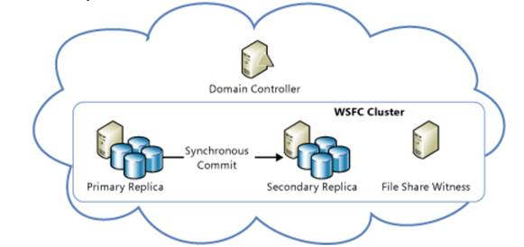
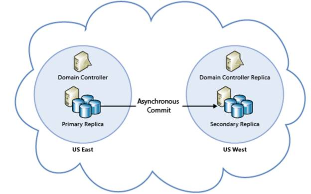
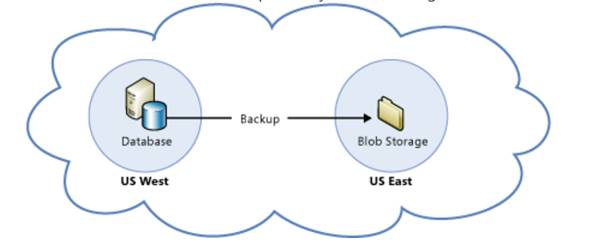
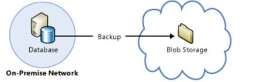

# 五、Azure 虚拟机上 SQL Server 的业务连续性解决方案

## Azure 中 SQL Server 的高可用性灾难恢复(HADR)解决方案

大多数运营团队最关心的问题之一是在硬件故障、基础架构故障或站点故障时应用程序和数据库的业务连续性和高可用性。Azure 虚拟机上的 SQL Server 支持除故障转移群集(Azure 尚不支持)之外的所有适用于本地版本 SQL Server 的高可用性和灾难恢复解决方案。

如前所述，虽然 Azure 存储支持跨 Azure 数据中心的地理冗余和存储复制，但它在磁盘之间并不一致，这使得它不能作为 Azure 中 SQL Server 的 HADR 解决方案使用。此外，尽管 Azure 存储维护数据库的本地冗余副本，但它不能替代 SQL Server 的备份或 HADR 解决方案。微软强烈建议根据数据库的恢复点目标(RPO)和恢复时间目标(RTO)，为运行在 Azure 上的 SQL Server 数据库设置 HADR 解决方案。

Azure 支持的 SQL Server HADR 技术包括:

*   始终在线可用性组
*   数据库镜像
*   日志传送
*   使用 Azure Blob 存储服务进行备份和恢复

进一步使用上述 HADR 技术，还可以设置混合 it 解决方案，其中本地版本的 SQL Server 将数据复制到运行在 Azure 虚拟机上的 SQL Server 实例。混合解决方案让您两全其美，在专用的高性能内部部署盒上运行的 SQL Server 实例将数据复制到运行在 Azure 数据中心的低成本虚拟机上。在 Azure 上运行的辅助实例可以扩展到更高的配置，以便在主节点出现故障时支持生产工作负载。因此，混合解决方案可以帮助您使用 SQL Server HADR 解决方案提供经济高效、高可用性和高性能的数据库解决方案。混合部署需要在内部数据中心和带有 Azure 网络的 Azure 数据中心之间建立站点到站点的虚拟专用网络，以便通过安全的虚拟专用网络隧道进行连接和数据复制。

在本章中，我们将讨论 Azure 虚拟机中 AlwaysON 可用性组和备份/恢复的设置和配置。不推荐使用数据库镜像，微软强烈建议使用 AlwaysON 可用性组作为 HADR 解决方案，它是数据库镜像的后继产品，提供了比镜像更多的功能。数据库镜像和日志传送的设置和配置类似于它们相应的内部设置，因此在本章中将不再讨论。

## Azure 中的 AlwaysON 可用性组

AlwaysOn 可用性组是一个高可用性和灾难恢复解决方案，它提供了数据库镜像的企业级替代方案。在 SQL Server 2012 中引入的 AlwaysOn 可用性组最大限度地提高了企业用户数据库集的可用性。可用性组支持一组离散的用户数据库(称为可用性数据库)的故障转移环境，这些数据库作为一个组一起进行故障转移。可用性组在 SQL 2012 中支持一组读写主数据库和一到四组对应的辅助数据库，从 SQL 2014 开始最多支持八组。可选地，辅助数据库可用于只读访问和/或一些备份/checkdb 操作。可用性组在可用性复制副本级别进行故障切换。故障转移不是由数据库问题引起的，例如数据库因数据文件丢失、数据库删除或事务日志损坏而变得可疑。

在 AlwaysON 可用性组中，每个参与的 SQL 实例(称为可用性复制副本)作为独立实例单独安装在单独的节点上。参与的节点或服务器是同一个 Windows Server 故障转移群集(WSFC)的一部分，但连接了它们自己的专用存储，这使得两个节点在地理上彼此分散。仲裁和支持自动故障转移需要 WSFC，这将在本节后面讨论。

AlwaysON 可用性组支持以下操作模式:

**异步提交模式**

在这种模式下，当在主复制副本(活动的 SQL 实例)上提交事务时，事务会立即刷新到磁盘上主数据库的事务日志中，并同时放入网络队列中，以便将日志复制到辅助复制副本。提交不会等待来自辅助副本的确认，而是继续下一组事务。这种可用性模式是一种灾难恢复解决方案，当可用性副本分布在相当远的距离时，这种解决方案可以很好地工作，因为事务的性能不依赖于数据复制的网络延迟。

**同步提交模式**

在这种模式下，与异步提交模式一样，当在主复制副本(活动的 SQL 实例)上提交事务时，该事务会立即刷新到磁盘上主数据库的事务日志中，并同时放入网络队列中，以便将日志复制到辅助复制副本。然而，提交事务等待来自辅助副本的确认，并且仅在从远程副本接收到确认之后才继续下一组事务。这种可用性模式强调高可用性和数据保护，而不是性能，代价是增加了事务延迟。给定的可用性组在 SQL 2012 中最多可以支持一个同步提交复制副本，在 SQL 2014 中最多可以支持三个同步提交可用性复制副本，包括当前的主复制副本。

**自动故障转移同步提交模式**

此模式是同步提交模式的变体，其中可用性组配置为自动故障转移。通过自动故障转移，群集服务对 SQL 实例执行 IsAlive 和 LooksAlive 检查，以检测任何故障。如果满足故障条件，群集中的可用性组资源将故障切换到辅助复制副本。只有同步提交模式支持自动故障转移，因为两个副本是事务一致的，而异步提交模式仅支持手动故障转移，也称为强制故障转移，这可能会导致一些数据丢失。

### Azure 中的 AlwaysON 可用性组拓扑

根据可用性副本的位置以及将其用作高可用性解决方案、灾难恢复解决方案、HADR 解决方案或设置混合解决方案的意图，可以为以下四种拓扑配置 Azure 中的 AlwaysON 可用性组。

#### 蔚蓝色中的高可用性解决方案



图 7: AlwaysON 可用性组作为 Azure 中的高可用性解决方案

将可用性组配置为 Azure 中 SQL Server 的高可用性解决方案时，两个参与的 SQL Server 虚拟机作为 Azure 中相同可用性集的一部分驻留在同一个 Azure 数据中心。由于这两个虚拟机位于同一数据中心，AlwaysON 可用性组可以配置为同步提交模式，并自动进行故障切换，因为网络延迟最小。Azure 中的可用性集使您能够将高可用性虚拟机放入单独的故障域和更新域中。这将确保数据中心的一个虚拟机因硬件或基础架构故障而发生的故障不会影响同一可用性集中的其他虚拟机，反之亦然，因为它将在同一数据中心的独立容错硬件上运行。要将 Azure 虚拟机放在同一可用性集中，您必须将它们部署在同一云服务中。只有同一云服务中的节点才能参与同一可用性集。

在第 2 章中讨论的[配置 Azure 虚拟机](02.html#_Provisioning_a_SQL)时，Azure 虚拟机被添加到云服务和可用性集中。在这种情况下，首先创建云服务和可用性集，在调配虚拟机时，它将被映射并与云服务和可用性集相关联。

以下 PowerShell 代码片段显示了云服务和新可用性集的创建，以及作为同一云服务和可用性集的一部分参与 AlwaysON 可用性组的两个虚拟机的资源调配。

代码清单 18:作为同一云服务和可用性集的一部分，为 AlwaysON 可用性组配置两个虚拟机

```sql
      New-AzureService -ServiceName $ServiceName -Location $Location|Out-Null

      New-AzureAvailabilityset  -Name $AvSet -Location $Location|Out-Null

      New-AzureQuickVM -Windows -ServiceName $ServiceName -AvailabilitySetName $AvSet -Name $VM1 -ImageName $ImageName.imagename -Password $password -AdminUsername $AdminAccount -InstanceSize $VmSize -EnableWinRMHttp | out-null
      New-AzureQuickVM -Windows -ServiceName $ServiceName -AvailabilitySetName $AvSet -Name $VM2 -ImageName $ImageName.imagename -Password $password -AdminUsername $AdminAccount -InstanceSize $VmSize -EnableWinRMHttp | out-null

```

为将 AlwaysON 可用性组配置为高可用性解决方案而调配虚拟机时，所有虚拟机、云服务、可用性集和虚拟机存储都是在位于同一 Azure 数据中心的同一位置创建的。

如果虚拟机在资源调配时未添加到可用性集中或添加到不同的可用性集中，并且如果后来决定虚拟机需要加入 AlwaysON 可用性组，则可以在使用 Azure 管理门户或 Set-AzureAvailabilitySet cmdlet 进行资源调配后将虚拟机添加到可用性集中，如下所示

代码清单 19:在资源调配后将虚拟机添加到可用性集中

```sql
      Get-AzureVM -ServiceName $ServiceName -Name "vm1" | Set-AzureAvailabilitySet -AvailabilitySetName $Avset |Update-AzureVM

```

虚拟机更新后，需要将其关闭(解除分配)并重新启动，以便作为指定可用性集的一部分启动虚拟机。

您还可以使用 Azure 管理门户将虚拟机添加到可用性集中。下面的文章描述了使用 Azure 管理门户实现相同功能的步骤:

[https://azure . Microsoft . com/en-us/文档/文章/虚拟机-如何配置-可用性/](https://azure.microsoft.com/en-us/documentation/articles/virtual-machines-how-to-configure-availability/)

#### Azure 中的 SQL Server 灾难恢复解决方案



图 8: AlwaysON 可用性组作为 Azure 中的灾难恢复解决方案

在 Azure 中将可用性组配置为 SQL Server 的灾难恢复解决方案时，每个参与的 SQL Server 虚拟机都驻留在不同的 Azure 数据中心，这些数据中心可能位于同一个国家(例如，美国中南部和美国东部)或不同的国家(例如，美国东部和欧洲)。由于 AlwaysON 可用性组中的两个参与虚拟机位于不同的数据中心，因此由于网络延迟较高，不建议使用同步提交模式。异步提交模式是此配置的首选模式。在数据中心或 Azure 位置内，所有副本都应位于相同的云服务、相同的可用性集和相同的虚拟网络内，如前所述。云服务和虚拟网络不能跨越 Azure 数据中心或位置，因此不同数据中心的参与虚拟机被映射到不同的云服务和虚拟网络。此配置需要 Azure VNet 到 VNet 的连接，可通过设置 s [站点到站点 VPN 隧道](https://azure.microsoft.com/en-us/documentation/articles/vpn-gateway-site-to-site-create/)或[快速路由](https://azure.microsoft.com/en-us/documentation/services/expressroute/)进行配置。可用性集配置不适用于这些虚拟机，因为虚拟机已经驻留在单独的数据中心，因此不一定是任何可用性集的一部分。

#### Azure 中 SQL Server 的高可用性和灾难恢复

这种配置是前面两种配置的组合。从 SQL 2014 开始，AlwaysON 可用性组最多允许 4 个 SQL 2012 可用性副本和 8 个副本。可以将同步提交模式下的多个可用性副本添加到同一个 Azure 数据中心以提供高可用性，并在单独的数据中心以异步提交模式配置一个或多个副本以提供灾难恢复。此外，辅助副本可以以只读模式打开，这可用于卸载报告和备份。在此配置中，驻留在同一位置的所有参与 Azure 虚拟机都是同一云服务、可用性集和虚拟网络的一部分，而远程副本是单独的云服务、可用性集和虚拟网络的一部分。如前所述，这种配置需要虚拟网络到虚拟网络的连接。

#### 混合 IT:Azure 中本地 SQL Server 的灾难恢复解决方案


图 9:混合 IT:Azure 中本地 SQL Server 的灾难恢复解决方案

这种配置允许您通过在 Azure 虚拟机中配置可用性组的辅助副本，为 SQL Server 的本地实例设置最经济高效的灾难恢复解决方案。在此配置中，所有本地复制副本都可以配置为同步提交模式，而 Azure 中的辅助复制副本则配置为异步提交模式。这种配置同样需要内部数据中心和 Azure 数据中心之间的虚拟网络到虚拟网络连接。这种连接可以通过使用[快速路由](https://azure.microsoft.com/en-us/documentation/services/expressroute/)设置站点到站点的虚拟专用网络隧道来配置，或者按照以下文章中描述的过程进行配置:

[https://azure . Microsoft . com/en-us/documentation/articles/VPN-gateway-site-to-site-create/](https://azure.microsoft.com/en-us/documentation/articles/vpn-gateway-site-to-site-create/)

### 为 AlwaysON 可用性组准备 Azure 环境

为了在 Azure 虚拟机中设置和配置 AlwaysON 可用性组，以便实现前面讨论的拓扑之一，首先满足以下先决条件非常重要:

1.  蔚蓝虚拟网络。创建 Azure 虚拟网络时，您可以设置 DNS 服务器和到另一个站点的 VPN 连接。如果您计划将 AlwaysON 可用性组配置为跨数据中心实施灾难恢复、HADR 或混合 IT 解决方案，这将是必需的。配置 AlwaysON 可用性组时，不需要虚拟网络到虚拟网络的连接，因为所有参与的虚拟机都位于同一个 Azure 数据中心。在这种情况下，可以跳过虚拟专用网连接部分。
2.  创建新的活动目录域控制器或[在 Azure 虚拟网络中安装副本活动目录域控制器](https://azure.microsoft.com/en-us/documentation/articles/virtual-networks-install-replica-active-directory-domain-controller/)或[设置 Azure 活动目录同步](http://social.technet.microsoft.com/wiki/contents/articles/19952.azure-active-directory-integration-step-by-step-guide.aspx)(目录同步)。需要一个域控制器，因为集群的所有节点都应该是同一个域的一部分。您可以创建新的域控制器，安装本地域控制器的副本，或者设置 DirSync。如果您设置了目录同步，您可以从 Azure 上的本地复制所有用户、用户群和安全权限。
3.  确保可用性组中的所有参与虚拟机都属于同一个域。这是设置 Windows Server 故障转移群集(WSFC)的先决条件。在参与的 Azure 虚拟机或服务器之间设置 Windows 服务器故障转移群集。这里有一个重要的警告，它不同于在内部环境中设置 WSFC。在两个 Azure 虚拟机之间创建 WSFC 后，群集名称资源可能无法启动，也不会联机，因为它无法从 DHCP 服务获取唯一的虚拟 IP 地址。相反，分配给群集名称的 IP 地址是其中一个节点的重复地址。这具有级联效应，最终导致群集仲裁失败，因为节点无法正确地相互连接。
4.  为了克服这一点，您可以从 VNet 或链路本地地址 169.254.1.1(有关链路本地地址的更多信息，请参考[http://www.ietf.org/rfc/rfc3927.txt](http://www.ietf.org/rfc/rfc3927.txt))为群集 IP 资源分配一个未使用的静态 IP 地址，并使群集名称资源联机。要在 Azure 虚拟机之间创建 WSFC，您需要使用以下步骤:

1.  在其中一个 Windows Azure 虚拟机上创建单节点群集。
2.  将群集 IP 地址设置为 VNet 中的静态 IP 或 IP 地址 169.254.1.1，这是一个链路本地地址。
3.  使“群集名称”资源联机，以便在活动目录中创建一个条目。
4.  创建具有链接本地地址的单节点集群的 PowerShell 脚本可以在这里找到:

[https://gallery . TechNet . Microsoft . com/script center/Create-WSFC-Cluster-for-7c 207 d3a](https://gallery.technet.microsoft.com/scriptcenter/Create-WSFC-Cluster-for-7c207d3a)

5.  将其他节点添加到集群中。
6.  确保应用了所有 [Windows 群集修补程序](https://msdn.microsoft.com/en-us/library/ff878487.aspx#WinHotfixes)，以便 WSFC 正常运行。
7.  在参与的虚拟机中安装独立的 SQL Server 实例。如前所述，您也可以在配置虚拟机时从库中配置一个 SQL Server 映像。这将在虚拟机上预安装一个独立的 SQL Server 实例。
8.  为虚拟机之间的 AlwaysON 数据复制流量打开防火墙端口。与数据库镜像类似，默认情况下，AlwaysON 可用性组在 TCP/IP 端口 5022 上通信。在高可用性配置中，当所有可用性副本虚拟机都在相同的云服务和位置下运行时，不需要在 Azure 虚拟机上创建端点。但是，对于副本分布在数据中心或位置的灾难恢复、HADR 或混合信息技术场景，我们需要[在参与可用性组的 Azure 虚拟机](02.html#_Adding_TCP/IP_Endpoints)中创建端点，为镜像流量打开 TCP/IP 端口 5022。

### 为 AlwaysON 可用性组准备 SQL 环境

1.  Azure 虚拟机中的所有 SQL Server 服务都应该在一个域帐户下运行。根据适用的安全实践，服务帐户不必相同，可以在不同的域帐户下运行，但如果可能，每个帐户都应该是一个域帐户。
2.  [使用 SQL 配置管理器在参与可用性组的每个 SQL 实例中启用 AlwaysON 可用性组功能](https://msdn.microsoft.com/en-us/library/ff878259.aspx#EnableAOAG)，如下图所示:


图 10:从 SQL 配置管理器中启用 AlwaysON AG 功能

如果有任何错误，这意味着 WSFC 配置不正确，因为 SQL 实例的 AlwaysON AG 功能会检查服务器是否属于 WSFC 的一部分，并且；如果该功能检测到 WSFC 的任何不适当配置，它将无法启用 AlwaysON AG 功能。

3.  最后，您用来登录创建可用性组的帐户必须对所有 SQL 实例副本具有 sysadmin 权限，才能创建可用性组。

### 创建可用性组

满足先决条件后，您就可以在 SQL 实例上创建可用性组了。以下是创建可用性组所需执行的步骤:

1.  确保需要添加为可用性组一部分的所有数据库都是由主复制副本上的应用程序创建的，并设置为完全恢复模式。
2.  创建完整的数据库备份，然后对需要添加到可用性组的所有数据库进行事务日志备份。
3.  使用 NORECOVERY 选项在所有辅助副本上恢复步骤 2 中创建的完整数据库备份和 T 日志备份。
4.  使用管理工作室(SSMS)中的[可用性组向导](https://msdn.microsoft.com/en-us/library/hh403415(v=sql.110).aspx)创建一个 AlwaysON 可用性组。指定可用性组名称，并选择要添加到可用性组的数据库。在已经使用 NORECOVERY 选项恢复了数据库和事务日志的地方添加辅助副本 SQL 实例。添加辅助复制副本时，您可以指定每个辅助复制副本是处于同步提交模式还是异步提交模式，以及它是否是自动故障切换伙伴。**不要在这一步创建**监听器，因为在 Azure 中运行 AlwaysON 监听器需要我们首先设置 Azure 内部负载平衡器(ILB)。单击仅加入以加入复制副本，并完成向导以创建 AlwaysON 可用性组。
5.  创建 AlwaysON 可用性组后，您可以连接到对象资源管理器。在 SSMS，展开始终高可用性，然后展开可用性组；现在，您应该会在这个容器中看到新的可用性组。右键单击可用性组名称，然后单击**显示仪表板**。此控制面板显示所有复制副本的当前状态(已同步或正在同步)。如果您想要测试故障切换，可以单击控制面板中的启动故障切换向导链接，启动到辅助复制副本的故障切换。

|  | 注意:不要尝试从故障转移群集管理器故障转移可用性组。所有故障切换操作都应在 SSMS 的 AlwaysOn 仪表板内执行。有关更多信息，请参见[对将 WSFC 故障转移群集管理器用于可用性组的限制](https://msdn.microsoft.com/library/ff929171.aspx)。 |

### 在 Azure 中为 AlwaysON 可用性组配置 ILB 侦听器

运行 Windows Server 2008 R2、Windows Server 2012 和 Windows Server 2012 R2 的 Azure 虚拟机支持可用性组侦听器。通过在也是可用性组节点的 Azure 虚拟机上使用 Azure 内部负载平衡器(ILB)和启用了直接服务器返回(DSR)的负载平衡端点，可以实现这种支持。每个云服务只支持一个可用性组侦听器，因为侦听器被配置为使用云服务贵宾地址或 ILB 的贵宾地址。请注意，这个限制仍然有效，尽管 Azure 现在支持在给定的云服务中创建多个 VIP 地址。微软有更多关于如何在 Azure 中为 AlwaysOn 可用性组配置 ILB 监听器的信息。

### 连接到 AlwaysON Azure ILB 监听程序的客户端配置

要使客户端应用程序能够连接到 AlwaysOn Azure ILB 侦听器，它必须驻留在不同于包含可用性组虚拟机的云服务上。Azure 不支持客户端和服务器在同一云服务中直接返回服务器。

您必须遵循特殊的配置步骤，以便侦听器既可以用于运行在 Azure 中的客户端应用程序，也可以用于运行在本地的客户端应用程序。客户端必须从与 AlwaysOn 可用性组节点不在同一云服务中的计算机连接到侦听器。如果可用性组跨越多个 Azure 子网，例如在灾难恢复、HADR 或混合方案中，客户端连接字符串必须包含“多子网故障切换=真”，以便能够快速连接到多个虚拟网络的 IP 地址，从而支持应用程序透明故障切换。这会导致对不同子网中的副本进行并行连接尝试。

您仍然可以通过直接连接到服务实例来分别连接到每个可用性复制副本。此外，由于 AlwaysOn 可用性组与数据库镜像客户端向后兼容，您可以连接到可用性副本，例如数据库镜像伙伴，只要副本以类似于数据库镜像的方式配置:一个主副本和一个辅助副本，辅助副本配置为不可读(**可读辅助**选项设置为**否**)

下面是一个示例客户端连接字符串，它对应于使用 ADO.NET 或 SQL Server 本机客户端的类似数据库镜像的配置:

代码清单 20:作为镜像故障转移伙伴连接到 AlwaysON AG 的客户端连接字符串

```sql
      Data Source=ReplicaServer1;Failover Partner=ReplicaServer2;Initial Catalog=AvailabilityDatabase;

```

如果您不希望设置 AlwaysON ILB 侦听器，但仍希望在 Azure 中使用 AlwaysON 可用性组作为 HADR 解决方案，也可以使用上述连接字符串。如果不配置 Azure ILB 侦听器，您将失去的唯一功能是应用程序透明故障切换，其中如果主复制副本出现故障，并且辅助复制副本实例成为新的主复制副本，则客户端连接可能无法透明地连接到新的主复制副本，并且可能需要手动干预来更改连接字符串。在这种情况下，您可以使用客户端别名来确保应用程序配置文件不需要在发生故障切换时反复更改，并且只需要将别名快速指向主复制副本。

## 使用 Azure Blob 存储服务进行备份和恢复

从 SQL 2012 SP1 CU2 开始，SQL Server 支持使用 Azure Blob 存储服务进行备份和恢复。此方法只能用作运行 SQL 2012 及更高版本的 SQL 实例的灾难恢复解决方案。此功能可用于备份驻留在本地实例上的 SQL Server 数据库或运行在 Azure 虚拟机上的 SQL Server 实例，以创建异地备份副本。备份到云提供了多种优势，例如可用性、地理复制的异地存储以及轻松地将数据迁移到云和从云中迁移。使用 T-SQL、SMO 和 PowerShell 以及从 SQL 2014 SSMS 开始支持备份到 Azure Blob 存储。

备份到 Azure Blob 存储可以在以下两种拓扑中实现为灾难恢复解决方案，具体取决于数据库是从本地 SQL 实例还是从运行在 Azure 虚拟机上的 SQL 服务器进行备份。

### Azure 中的 SQL Server 灾难恢复解决方案



图 11:备份到 Azure Blob 存储，作为 Azure 虚拟机上 SQL Server 的灾难恢复解决方案

### 混合 IT:Azure 中本地 SQL 服务器的灾难恢复解决方案



图 12:混合 IT:备份到 Azure Blob 存储作为本地 SQL Server 实例的灾难恢复解决方案

### SQL Server 备份到 Azure Blob 存储

如前所述，在备份到 Azure Blob 存储时，建议打开备份压缩，这是从 SQL Server 2008 R2 开始引入的，以降低存储成本并节省网络带宽。下面的文章提供了将 SQL Server 备份设置到 Azure Blob 存储的详细步骤:

[https://msdn . Microsoft . com/en-us/library/dn 435916(v = SQL . 120)。aspx](https://msdn.microsoft.com/en-us/library/dn435916(v=sql.120).aspx)