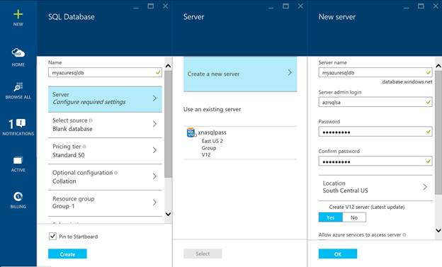
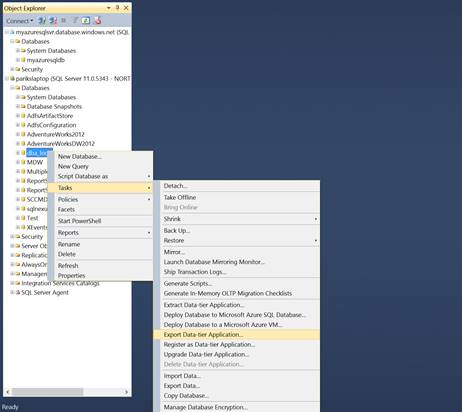
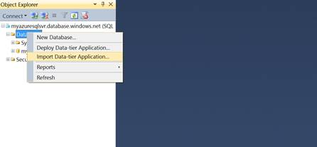

# 第 7 章调配、管理和迁移到 Azure SQL 数据库

Azure SQL 数据库最好的部分之一是，微软已经将其与所有熟悉的工具集成在一起，如 Azure Portal、PowerShell 和 SQL Server Management Studio。供应、管理和迁移到 Azure SQL 数据库的学习或加速曲线并没有那么陡峭，而且非常自然。

## 提供一个 Azure SQL 数据库

在 Azure 订阅中提供 Azure SQL 数据库有两种方法:

*   使用 Azure 管理门户
*   使用 Azure PowerShell

Azure 管理门户可用作配置数据库的图形用户界面，而 Azure PowerShell 可用作自动化的编程界面。

要在 Azure 中调配 Azure SQL 数据库，您必须首先获得 Azure 订阅。您可以购买 Azure 套餐或注册 [Azure 免费试用套餐。](https://azure.microsoft.com/en-us/pricing/free-trial/)

### 使用 Azure 管理门户

获得 Azure 订阅后，可以按照本节中的步骤使用 Azure 管理门户来调配 Azure SQL 数据库。

1.  登录 [Azure 管理门户](http://portal.azure.com)，点击新建>数据+存储> SQL 数据库，如下图


图 13:提供 Azure SQL 数据库

2.  下一步是提供数据库的名称和希望托管数据库的逻辑 SQL server 名称。数据库名称在给定的服务器中应该是唯一的，并且在您键入时由门户检查。如果您之前已经创建了现有的服务器名称，则可以使用它，或者创建一个新的服务器，如下图所示。
3.  您可以将逻辑服务器视为 Azure 中提供的一个 SQL 实例，它将托管您的 Azure SQL 数据库。创建服务器时，您需要提供一个唯一的服务器名称，其 DNS 后缀为*database.windows.net*，该服务器上 sysadmin 的登录名和密码，以及您希望将此数据库设置为托管的 Azure 位置。如下图所示:



图 14:为 Azure SQL 数据库创建新服务器

4.  下一步是选择数据库的源。您可以创建一个空白数据库并创建模式/对象，或者选择一个示例数据库(是的，我们最好的朋友 Adventureworks 也可以在 Azure SQL 数据库中作为示例数据库使用)，或者从备份中恢复数据库。


图 15:为 Azure SQL 数据库选择源

5.  下一步是为数据库选择[服务层](06.html#_Azure_SQL_Database)。服务层还决定数据库的每分钟定价，在门户中称为定价层。
6.  接下来，为数据库和数据库所属的资源组选择所需的排序规则。资源组是 Azure 中的一个新概念，用于对 Azure 上运行的应用程序的生命周期和依赖关系进行分组和管理。如果将 Azure SQL 数据库创建为运行 Azure 服务应用程序的后端，您可以将属于该应用程序的所有资源分类到一个资源组中，该资源组可以作为一个单元进行管理和监控。对于示例数据库，您可以选择列表中可用的默认-SQL- <location>资源组。</location>
7.  选择将在其中创建和计费数据库的 Azure 订阅。当您管理多个 Azure 订阅时，这很有用。
8.  最后，单击窗口底部的创建，以便在指定的逻辑服务器中调配 Azure SQL 数据库。

### 使用 Azure PowerShell

使用 Azure PowerShell，您可以使用以下 PowerShell 代码来设置 Azure SQL 数据库:

代码清单 21:提供 Azure SQL 数据库

```
      Import-Module Azure
      Add-AzureAccount

      #Select the desired Azure Subscription
      [array] $AllSubs = Get-AzureSubscription
      If ($AllSubs)
      {
              Write-Host "`tSuccess"
      }
      Else
      {
              Write-Host "`tNo subscriptions found. Exiting." -ForegroundColor Red
              Exit
      }
      #Write-Host "`n[Select Option] - Select a Subscription to Work With" -ForegroundColor Yellow
      $count = 1
      ForEach ($Sub in $AllSubs)
      {
         $SubName = $Sub.SubscriptionName
         Write-host "`n$count - $SubName"  -ForegroundColor Green
         $count = $count+1
      }
      $SubscriptionNumber = Read-Host "`n[SELECTION] - Select a Subscription to Provision the VM"
      If($SubscriptionNumber -gt $count)
      {
          Write-Host "`Invalid Subscription Entry - Existing" -ForegroundColor Red
          Exit
      }
      $SelectedSub = Get-AzureSubscription -SubscriptionName $AllSubs[$SubscriptionNumber - 1].SubscriptionName 3>$null
      $SubName = $SelectedSub.SubscriptionName
      Write-Host "`n Selected Subscription - $SubName" -ForegroundColor Green
      $SelectedSub | Select-AzureSubscription | out-Null

      $Location = "South Central US"
      $DatabaseName = "myazuresqldb"

      $server = New-AzureSqlDatabaseServer  -Location $location –AdministratorLogin "mysqlsa" -AdministratorLoginPassword "Pa$$w0rd" -Version "12.0"

      New-AzureSqlDatabase  -ServerName $server.ServerName -DatabaseName $DatabaseName -Edition "Basic" -MaxSizeGB 2

```

## 管理 Azure SQL 数据库

如前所述，Azure SQL 数据库最好的部分之一是微软维护了相同的工具，即 SQL Server 管理工作室、TSQL 和 PowerShell，用于管理 Azure SQL 数据库。由于对工具的熟悉，这使得管理更加容易。

为了能够管理和连接到 Azure SQL 数据库，您需要首先创建防火墙规则，以允许从外部连接到您的服务器和数据库。您可以为 Azure SQL 数据库服务器中的主数据库或用户数据库定义服务器级和数据库级防火墙设置，以选择性地允许对数据库的访问。

### 配置服务器级防火墙规则

可以通过 Microsoft Azure 管理门户、Transact-SQL 和 Azure PowerShell 创建和管理服务器级防火墙规则。

以下是使用 Azure 管理门户创建服务器级防火墙规则的步骤:

1.  以管理员权限登录 Azure 管理门户，单击左侧横幅上的全部浏览，然后单击 SQL Servers。
2.  在服务器窗口中，单击顶部的设置，然后单击防火墙打开服务器的防火墙设置子窗口。
3.  添加或更改防火墙规则。

*   要添加当前计算机的 IP 地址，请单击子窗口顶部的添加客户端 IP。
*   要添加其他 IP 地址，请键入规则名称、开始 IP 地址和结束 IP 地址。
*   要修改现有规则，请单击并更改规则中的任何字段。
*   要删除现有规则，请单击该规则，单击行尾的省略号(…)，然后单击删除。

4.  单击防火墙设置子窗口顶部的保存以保存更改。


图 16:使用 Azure 门户配置服务器级防火墙

您还可以使用以下 cmdlets 使用 Azure PowerShell 配置服务器级防火墙:

代码清单 22:使用 Azure PowerShell 配置服务器级防火墙

```
      Import-Module Azure
      Add-AzureAccount
      ## To add a new server-level firewall rule
      New-AzureSqlDatabaseServerFirewallRule –StartIPAddress 172.16.1.1 –EndIPAddress 172.16.1.10 –RuleName DBAFirewallRule –ServerName myazuresqldbserver
      ## To modify an existing server-level firewall rule
      Set-AzureSqlDatabaseServerFirewallRule –StartIPAddress 172.16.1.4 –EndIPAddress 172.16.1.10 –RuleName DBAFirewallRule –ServerName myazuresqldbserver
      # To delete an existing server-level firewall rule
      Remove-AzureSqlDatabaseServerFirewallRule –RuleName DBAFirewallRule –ServerName myazuresqldbserver

```

为了使用 SQL Server Management Studio (SSMS)从客户端工作站连接到 Azure SQL 数据库服务器，您首先需要使用上述技术之一创建服务器级防火墙规则，以允许客户端工作站 IP 地址作为 SQL Server 的合法条目。但是，在使用 SSMS 建立与 SQL Server 的连接后，您可以使用管理工作室针对服务器触发的 T-SQL 查询来创建其他防火墙规则。

要创建或更新服务器级防火墙规则，请执行 sp _ set _ 防火墙规则存储过程。要删除防火墙规则，请执行 sp_delete_firewall_rule 存储过程，如下所示。

代码清单 23:使用 Transact SQL 配置服务器级防火墙

```
      --Create new firewall rule
      EXEC sp_set_firewall_rule @name = N'DBAFirewallRule', @start_ip_address = '172.16.1.1', @end_ip_address = '172.16.1.10'
      -- Update an existing firewall rule
      EXEC sp_set_firewall_rule @name = N'DBAFirewallRule', @start_ip_address = '172.16.1.4', @end_ip_address = '172.16.1.10'
      --Delete an existing firewall rule
      EXEC sp_delete_firewall_rule @name = N'DBAFirewallRule'

```

### 配置数据库级防火墙规则

创建服务器级数据库规则后，您必须为客户端创建数据库级防火墙，以便能够连接到该服务器上的特定数据库。您可以使用 T-SQL 配置数据库级防火墙。

为了创建数据库级防火墙，您需要使用 SQL Server Management Studio 从客户端工作站连接到服务器，该工作站在服务器级防火墙中为连接而打开。然后，执行 sp_set_database_firewall_rule 存储过程来创建或更新数据库级防火墙规则，如以下代码片段所示:

代码清单 24:使用 Transact SQL 配置数据库级防火墙

```
      --Create new database-level firewall rule
      EXEC sp_set_database_firewall_rule @name = N'ApplicationFirewallRule', @start_ip_address = '172.16.1.11', @end_ip_address = '172.16.1.11'
      -- Update an existing database-level firewall rule
      EXEC sp_set_database_firewall_rule @name = N'ApplicationFirewallRule', @start_ip_address = '172.16.1.11', @end_ip_address = '172.16.1.12'
      --Delete an existing firewall rule
      EXEC sp_delete_database_firewall_rule @name = N'ApplicationFirewallRule'

```

### 使用 SSMS 连接到 Azure SQL 数据库

如前所述，为了连接到 Azure SQL 数据库服务器，第一步是确保您打算连接的客户端工作站被添加到服务器级防火墙中。一旦允许该 IP 地址连接到服务器，您就可以按照本节中的步骤使用 SSMS 管理服务器实例来连接到 Azure SQL 数据库服务器。具有最新更新的 SQL Server 2014 SSMS 为创建和修改 Azure SQL 数据库等任务提供了扩展支持。此外，您还可以使用 Transact-SQL 语句来完成这些任务。以下步骤提供了这些语句的示例。有关在 SQL 数据库中使用 Transact-SQL 的更多信息，包括支持哪些命令的详细信息，请参见 [Transact-SQL 引用(SQL 数据库)](http://msdn.microsoft.com/library/bb510741.aspx)。

如果您不知道给定 Azure SQL 数据库的服务器名称，您可以从 Azure Portal 中识别该服务器，如下所述:

1.  登录 Azure 门户，单击左侧横幅上的全部浏览，然后单击 SQL 数据库。
2.  单击您希望连接到的 Azure SQL 数据库，您将在数据库子窗口中看到服务器名称。


图 17:Azure SQL 数据库中的服务器名称

3.  服务器名称是唯一的，并附加了域名后缀*database.windows.net。*
4.  在任务栏上，单击开始，选择所有程序，选择 Microsoft SQL Server 2014，然后单击 SQL Server 管理工作室。
5.  如前所述，在连接到服务器中，将完全限定的服务器名称指定为*serverName.database.windows.net*。
6.  选择 SQL Server 身份验证，因为在 Azure SQL 数据库中尚不支持 Windows 身份验证。
7.  在登录框中，输入创建服务器时在门户中指定的 SQL Server 管理员登录。
8.  在“密码”框中，输入您在创建服务器时在门户中指定的密码。
9.  单击连接建立连接。

### 使用 T-SQL 管理 Azure SQL 数据库

一旦使用 SSMS 连接到 Azure SQL 数据库服务器，就可以使用 T-SQL 来创建和管理数据库对象，如下面的代码片段所示。在使用 Azure SQL 数据库时，一个重要的考虑是不支持在数据库之间切换的 **USE** 语句。相反，您需要直接建立或重新建立到目标数据库的连接。

代码清单 25:使用 T-SQL 管理 Azure SQL 数据库

```
      -- Create new database
      CREATE DATABASE myTestDB
      (
       EDITION='Standard',
       SERVICE_OBJECTIVE='S0'
      );
      -- ALTER DATABASE
      ALTER DATABASE myTestDB
      MODIFY
      (
      SERVICE_OBJECTIVE='S1'
      );
      -- DROP DATABASE
      DROP DATABASE myTestDB;
      -- Create New Server Login
      CREATE LOGIN User1 WITH password='Password1';
      -- Create Database User (switch to User Database)
      CREATE USER dbuser1 FROM LOGIN User1;
      --Adding User to db_datareader role (switch to User Database)
      exec sp_addrolemember 'db_datareader', 'dbuser1';   
      -- DROP Login (switch to master Database)
      DROP LOGIN User1
      -- Query catalog views (on master database)
      SELECT * FROM sys.databases
      SELECT * FROM sys.sql_logins
      -- Query dynamic management views (on User database)
      SELECT text,* from sys.dm_exec_requests
      cross apply sys.dm_exec_sql_text(sql_handle)
      SELECT * from sys.dm_exec_connections
      SELECT * from sys.dm_exec_sessions

```

## 迁移到 Azure SQL 数据库

为了将现有的内部 SQL 数据库迁移到 Azure SQL 数据库，您需要首先确保数据库中的 TSQL 代码和对象与 Azure SQL 数据库兼容。如前几章所述，在 Azure SQL 数据库中仍然有一些仅部分支持或根本不支持的 T-SQL 特性，所有这些特性都在下面的 MSDN 文章中进行了记录:

[https://azure . Microsoft . com/en-us/documentation/articles/SQL-database-transact-SQL-information/](https://azure.microsoft.com/en-us/documentation/articles/sql-database-transact-sql-information/)

如果数据库模式与 Azure SQL Database 兼容，则可以使用 SSMS 通过将数据库部署到 Azure SQL Database 来一步完成到 Azure SQL Database 的迁移，或者通过首先导出数据库的 BACPAC，然后将该 BACPAC 作为新数据库导入 Azure SQL Server 来分两步完成迁移。我们将在下面探讨每种迁移方法。

|  | 注意:在 SQL 2008 R2 中引入的数据层应用程序(DAC)是包含应用程序使用的所有数据库和实例对象的实体。数模转换器为创作、部署和管理数据层对象提供了一个单一的单元，而不必单独管理它们。数模转换器允许数据层开发与相关应用程序代码开发的更紧密集成。它还为管理员提供了系统中资源使用情况的应用程序级视图。BACPAC 文件是一个 DAC 包文件以及数据库中的数据，可以看作是数据库的备份文件，可以通过导入 BACPAC 文件来重新创建数据库对象和数据。 |

### 使用 SSMS 部署到 Azure SQL 数据库

随着 SQL 2014 的最新更新，SQL Server Management Studio (SSMS)附带了“将数据库部署到 Azure SQL 数据库”向导，允许您将本地版本的 SQL 数据库直接部署到 Azure SQL 数据库，前提是其模式兼容。以下是在 SSMS 使用部署向导迁移数据库的步骤。

1.  使用 SSMS 2014 SP1，连接到要迁移的本地数据库，在对象资源管理器中右键单击该数据库，然后单击任务，看到如图所示的“将数据库部署到 Microsoft Azure SQL 数据库”选项。


图 18:将数据库部署到微软 Azure SQL 数据库向导

2.  单击下一步，通过提供管理员用户名和密码，使用 SQL 身份验证连接到 Azure SQL 数据库服务器。选择数据库版本、服务层和最大大小，如下图所示。


图 19:将数据库部署到微软 Azure SQL 数据库

3.  单击下一步，然后单击完成，让向导提取数据库模式并将数据导出到 BACPAC 文件，然后将该文件导入到 Azure SQL 数据库中。

根据数据库的大小和复杂性，部署时间可能从几分钟到几个小时不等。如果存在不兼容性，模式验证例程将在实际部署到 Azure 之前快速检测到错误。当整个数据库模式与 Azure SQL Database 兼容，并且您希望一次性部署整个数据库时，此方法非常有用。但是，如果只有数据库模式的一个子集与 Azure SQL Database 兼容，并且您希望有选择地将数据库对象提取到 Azure SQL Database，则可以手动导出 BACPAC 并将其复制到 Azure Blob 存储中，然后在 Azure SQL Database Server 上恢复它，这将在下一节中讨论。

### 使用 SSMS 导出 BACPAC 并将其导入到 SQL 数据库

这种方法可以分为两个主要步骤:

1.  将数据库对象导出到本地存储或 Azure blob 存储上的 BACPAC 文件。
2.  将 BACPAC 文件导入到 Azure SQL 数据库服务器。

该方法包括以下步骤:

1.  连接到 SSMS 的源数据库，并导出到 BACPAC 文件，如下图所示:



图 20:将一个 SQL 数据库导出到 BACPAC

2.  在导出向导中，配置导出以将 BACPAC 文件保存到本地磁盘位置或 Azure Blob 存储。如果要从部分或所有表中排除数据，请单击高级选项卡，如下图所示:


图 21:通过过滤数据库对象导出到 BACPAC

3.  创建 BACPAC 后，使用 SSMS 连接到 Azure SQL 数据库服务器，右键单击数据库文件夹以导入 BACPAC 文件。



图 22:在 Azure SQL 数据库服务器中导入 BACPAC 文件

4.  导入时，您需要提供要创建的数据库的版本、服务层和最大大小，并完成向导以完成将 BACPAC 文件导入到 Azure SQL 数据库服务器。

此方法使您可以更好地控制要迁移到 Azure SQL 数据库的对象，因此，当您只想将部分数据库迁移到 Azure SQL 数据库时，此方法非常有用。